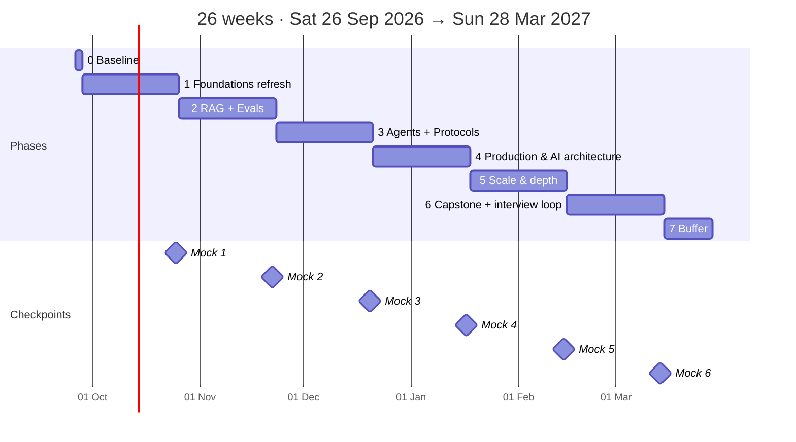

# Senior → Staff + AI Architect · 24-week roadmap

–day streak

–tasks done

–behind plan

–current week

## Today

--8<-- "includes/today-snippet.md"

[Open Today :material-arrow-right:](today.md){ .md-button .md-button--primary } [This week's plan](roadmap/index.md){ .md-button } [Latest digest](digest/index.md){ .md-button }

## Consistency

## The map

## Where to go

-   :material-rocket-launch: **Start here**

    ---

    The brief, how the system works, weekly rhythm, rules, the week-0 baseline.

    [:octicons-arrow-right-24: Start here](start-here/index.md)

-   :material-map-marker-path: **Roadmap**

    ---

    Phases with exit gates, and 27 day-by-day week pages generated from the curriculum.

    [:octicons-arrow-right-24: Roadmap](roadmap/index.md)

-   :material-robot: **Agentic AI & LLM engineering**

    ---

    29 topics from context engineering to MCP, LangGraph, evals, guardrails, serving and fine-tuning.

    [:octicons-arrow-right-24: Agentic AI](tracks/agentic-ai/index.md)

-   :material-sitemap: **System design & AI system design**

    ---

    Distributed-systems depth, 9 case studies, 12 AI system design walkthroughs.

    [:octicons-arrow-right-24: System design](tracks/system-design/index.md) · [AI SD](tracks/ai-system-design/index.md)

-   :material-domain: **Architecture · Python · Java/Spring AI**

    ---

    DDD, hexagonal, sagas, modernization; expert Python; Java 25 + Spring AI 2.0.

    [:octicons-arrow-right-24: Architecture](tracks/architecture/index.md) · [Python](tracks/python/index.md) · [Java](tracks/java-spring-ai/index.md)

-   :material-graph: **DSA · Staff+ skills**

    ---

    NeetCode-250 pattern path with spaced repetition; strategy, influence, STAR bank.

    [:octicons-arrow-right-24: DSA](tracks/dsa/index.md) · [Staff+](tracks/staff-skills/index.md)

-   :material-hammer-wrench: **Projects**

    ---

    The *Agentic Ops Copilot* capstone plus six phase projects with rubrics.

    [:octicons-arrow-right-24: Projects](projects/index.md)

-   :material-account-voice: **Interviews**

    ---

    Six checkpoints on one rubric, mock prompt banks, AI mock-interviewer prompts.

    [:octicons-arrow-right-24: Interviews](interviews/index.md)

-   :material-newspaper-variant: **Reading & trends**

    ---

    Daily auto-feed, curated digest, newsletters, papers, and a living tech radar.

    [:octicons-arrow-right-24: Reading](reading/index.md) · [Radar](trends/radar.md)

