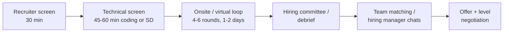

# How Staff/Principal loops work (2026)

!!! warning "Treat this as a pattern guide, not insider information"
    Processes vary by company, level, team and year, and change often. What follows is the commonly reported shape as of September 2026, based on general industry patterns. Confirm the exact format with each recruiter (ask for the round list, duration, and whether the coding round allows AI tools).

## The typical Staff+ loop



| Stage | What is evaluated | Notes |
|---|---|---|
| Recruiter screen | Level fit, motivation, compensation range, timelines | Ask about level target (Senior vs Staff) early; down-levelling is decided in the loop, so state your target and ask about it |
| Technical screen | Coding (medium, sometimes two) or a system design round | Often the same rubric as onsite; a weak screen ends the process |
| System design (1–2 rounds) | Scoping, estimation, trade-offs, depth, operability, organisational rollout | At Staff, expect ambiguity and a migration/rollout follow-up |
| AI system design | Retrieval, agents, evals, safety, cost | Increasingly standard in 2026 for AI-adjacent roles and many general Staff loops |
| Coding (1–2 rounds) | Data structures and algorithms; clean code; communication | Lower weight than SD at Staff but still a gate. Some companies now allow or test AI assistants (see below) |
| Low-level design / code design | Object modelling, concurrency, extensibility | More common at some enterprises and Indian/Asia-Pacific big-tech loops |
| Behavioral / leadership | Scope, influence, conflict, growing others, judgement | Usually 1–2 rounds; often decisive for level (Senior vs Staff) |
| Project deep dive / architecture review | Depth on your past work; defending decisions | Your capstone can supplement, but primary stories should be from real employment |
| Bar raiser / cross-team interviewer (some firms) | Independent calibration | Expect deeper follow-ups, culture/principles questions |

## Big tech vs enterprise vs startup

| Dimension | Big tech / hyperscaler | Large enterprise (logistics, banking, industrial) | Startup / scale-up |
|---|---|---|---|
| Rounds | 5–7 incl. 2 coding, 1–2 SD, behavioral, sometimes AI SD | 3–5: technical conversation, architecture case, leadership/stakeholder, sometimes coding | 3–5: practical take-home or pairing, SD, founder/leadership chat |
| Coding | Standard DSA, timed, harder at some | Lighter; often practical or code review; some run DSA | Practical ("build this feature"), sometimes with AI tools |
| System design | Scale, deep dives, trade-offs, org-level follow-ups | Integration, domain modelling, migration, governance, cost | End-to-end pragmatic; "what do you build first?" |
| Behavioral | Structured rubrics (levelling docs, leadership principles); heavy weight | Stakeholder management, delivery in complex orgs, mentoring | Ownership, speed, ambiguity, culture add |
| Decision | Committee; level calibrated centrally; team matching afterward | Hiring manager + panel; level mapped to internal grades | Founders/CTO; equity conversation |
| Timeline | 4–10 weeks including matching | 3–6 weeks | 1–4 weeks |
| What wins | Depth + structured communication + evidence of multi-team impact | Domain understanding + architecture judgement + influence in large orgs | Speed, breadth, product sense |

## What is different at Staff/Principal

1. **Level is the interview.** The loop decides Senior vs Staff. The same technical performance can yield either; scope and influence stories (see [behavioral rubric](rubric.md#5-behavioral-staff-leadership)) decide it.
2. **System design is ambiguous on purpose.** Interviewers expect you to reframe, prioritise, and discuss organisational rollout and migration, not just draw boxes.
3. **Written and strategic signals matter.** Some companies request a design doc sample or a strategy write-up review; keep 1–2 sanitised artefacts ready ([design docs and RFCs](../tracks/staff-skills/design-docs-rfcs.md), [technical strategy](../tracks/staff-skills/technical-strategy.md)).
4. **Leadership without authority** is probed repeatedly: [influence without authority](../tracks/staff-skills/influence-without-authority.md), [architecture reviews](../tracks/staff-skills/architecture-reviews.md).
5. **Team matching** (esp. at big tech) can take weeks after a "hire" decision; keep other processes warm.

## AI-era changes (as of Sept 2026)

| Trend | What to expect | How to prepare |
|---|---|---|
| **AI system design rounds** | Design a RAG system, agent platform, LLM gateway, evaluation platform; probed on evals, safety, cost | [AI SD framework](../tracks/ai-system-design/framework.md); capstone as concrete evidence; 8+ mocks by week 24 |
| **Evals and reliability questions** | "How do you know it works? How do you catch regressions?" | [evals and error analysis](../tracks/agentic-ai/evals-error-analysis.md); your P2/P3 reports |
| **Security of agents** | Prompt injection, excessive agency, data exfiltration | [guardrails and security](../tracks/agentic-ai/guardrails-security.md); P4 threat model |
| **AI-assisted coding rounds** | Some companies permit or require AI tools in coding rounds and evaluate how you direct, review and verify output; others explicitly ban them | Ask the recruiter. Practise both modes: unassisted DSA and AI-assisted "build a small feature and review generated code critically" ([AI-assisted development](../tracks/agentic-ai/ai-assisted-development.md)) |
| **Fewer trivia questions, more judgement** | "When would you not use an agent?" | Have opinions with numbers |
| **Leadership in the AI era** | Adoption strategy, risk, team skills, measuring productivity honestly | [AI-era leadership](../tracks/staff-skills/ai-era-leadership.md) |
| **Take-home / project-based screens** | Small agent or RAG build with evals within a few hours | Reuse capstone scaffolding; keep a "boilerplate" you can start from quickly |

## Preparation timeline mapped to the 24 weeks

| Weeks | Phase focus | Interview activity | Applying? |
|---|---|---|---|
| 0 | Baseline | CP0: calibrate | No |
| 1–4 | Foundations | CP1 at wk 4; start story bank (6 stories) | No |
| 5–8 | RAG + evals | CP2 at wk 8; 1 SD mock/week; AI SD framework | No |
| 9–12 | Agents + protocols | CP3 at wk 12, first paid mock; LLD weekly; refine story bank to 10 | Optional: talk to recruiters, no interviews yet |
| 13–16 | Production + AI architecture | CP4 at wk 16, Staff bar; write strategy artefact; Staff leadership stories | Update resume/LinkedIn; begin **warm-up applications** (lower-stakes targets) from wk 15–16 |
| 17–20 | Scale + depth | CP5 at wk 20; distributed depth; publish blog post 1 | **Warm-up interviews** (2–3) to learn formats; do not use dream companies yet |
| 21–24 | Capstone + full loops | CP6 at wk 24; 2 full mock loops; publish blog post 2; polish capstone | Schedule **target company** loops for weeks 25–28 (buffer weeks 25–26 for gaps) |
| 25–26 | Buffer | Fix the weakest round; 2 mocks/week | Target-company screens begin |
| 27+ | Live process | Debrief after every real round; keep 2 mocks/week | Run processes in parallel so offers arrive together |

!!! tip "Sequence your applications"
    Run 2–3 warm-up companies first to fix format surprises, then the target companies in a tight 2–3 week window so offers overlap and you can negotiate from a position of choice.

## Application checklist

- [ ] Resume: 1–2 pages, scope-and-impact bullets with numbers (team size influenced, $ saved, latency, reliability), Staff-level verbs (defined, aligned, drove adoption)
- [ ] Capstone repo public: README, C4 diagrams, ADRs, eval report, demo video (< 3 min)
- [ ] 2 published write-ups (P2 ablation, P3 failure analysis are the strongest)
- [ ] Story bank: 8–10 stories mapped to [B1–B25](mock-prompts.md#behavioral-staff-25)
- [ ] Sanitised design doc / strategy sample (check employer confidentiality)
- [ ] References prepared (former manager or peer Staff who can speak to scope)
- [ ] Compensation research and target range; understand level equivalence between companies (use public level-mapping sites, treat as approximate)
- [ ] Recruiter questions list: level target, loop structure, AI tools policy in coding, timeline, team matching process

## Debrief template (after every real round)

```text
Company / round / date:
What was asked (verbatim as possible):
What I did well:
Where I stalled or was vague:
Interviewer signals (hints, interruptions, tone):
Rubric self-score (1-4 per dimension) and gap:
New flashcards / drills:
```

## Negotiation and level notes

- **Level first, then compensation.** A Senior offer at high pay is usually worth less over 3 years than a Staff offer at moderate pay; ask what evidence would support a Staff level if the offer is Senior.
- Competing offers and timelines are the main leverage; keep recruiters informed honestly.
- Get the level, scope, team, and reporting line in writing before negotiating numbers.

## Related

[Checkpoints](checkpoints.md) · [Unified rubric](rubric.md) · [Mock prompts](mock-prompts.md) · [AI mock interviewer](ai-mock-interviewer.md) · [Staff archetypes](../tracks/staff-skills/staff-archetypes.md)
