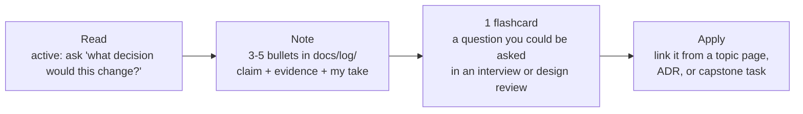

# Reading system: learn from content without drowning

The AI/infra firehose in 2026 is effectively infinite. This section is a **curated, opinionated** subset tuned for a 15-year engineer
heading to Staff/Principal + AI architect. The rule: *reading is an input to building and explaining, never a substitute for either.*

!!! abstract "The budget"
    - **20 min/day** (weekdays): the [daily feed](feed.md) + the day's digest. Triage only; read at most 1 item in full.
    - **1 h/week** (Sunday review block): one long-form article or paper section from [articles](articles.md) / [papers](papers.md) matched to the current roadmap week.
    - **Books and courses** are *not* reading-budget items; they are scheduled inside the track tasks in the roadmap.
    - Hard cap: if you are > 30 min over budget in a week, unsubscribe from one source. Scarcity is the feature.

## Where things live

| Page | What it is | When to use it |
|---|---|---|
| [Daily feed](feed.md) | Auto-generated every morning (~06:00 IST) from [`data/feeds.yml`](https://github.com/codeyashu/study-planner/blob/main/data/feeds.yml) | 10-min skim with coffee |
| [Newsletters](newsletters.md) | 40+ newsletters by category with priority (subscribe now / skim / optional) | Set up once; prune quarterly |
| [Must-read articles](articles.md) | 45+ essays mapped to roadmap phases/weeks | Sunday deep-read slot |
| [Books](books.md) | 25+ books with *which chapters* to read at your level | Track tasks; commute/evenings |
| [Courses](courses.md) | 25+ courses with hours and when they fit | Scheduled in phases |
| [Podcasts & YouTube](podcasts-youtube.md) | Channels + best episodes | Walks, gym, chores (passive) |
| [Papers](papers.md) | Distributed-systems + AI papers with explainers | Phase 2–5 depth work |
| [Engineering blogs](engineering-blogs.md) | 25+ company blogs with standout posts | System-design case studies |
| [Tech radar](../trends/radar.md) | Adopt / Trial / Assess / Hold for this learner | Before choosing a tool |

## Triage rules (apply in < 10 seconds per item)

1. **Is it tied to this week's topic or a live decision?** → read now.
2. **Is it a primary source** (paper, official release notes, an engineer describing their own system)? → save for Sunday.
3. **Is it a summary of someone else's primary source?** → open the primary source instead, or skip.
4. **Is it a "Top 10 tools" / hype thread / benchmark screenshot?** → skip. Wait for the weekly radar update.
5. **Is it a release announcement?** → only read if the tool is on the [radar](../trends/radar.md) in *Adopt* or *Trial*; otherwise the weekly agent will catch it.
6. **Would I bet 20 minutes that I will use this in the next 4 weeks?** If not → skip. It will still exist later.

!!! tip "The Sunday queue has a maximum length of 5"
    When a 6th item arrives, delete the oldest. If it mattered, it will resurface in someone else's writing.

## Read → note → 1 flashcard

Every item you read *in full* must produce three things, or it did not count:

- **Note format:** `Source · date · 1-line claim · evidence (numbers, design) · where I'd disagree · which topic page it strengthens`.
- **Flashcard:** phrase it as an L2/L3 question from [AGENTS.md §5](https://github.com/codeyashu/study-planner/blob/main/AGENTS.md) — e.g. *"When would hybrid search lose to pure BM25?"* — not a definition.
- **Apply:** if an article changes your view of a topic, add it to that topic page's Resources table (the weekly agent also does this).

## Reading well at senior level

- Read **for the trade-off, not the tool.** "Discord moved from Cassandra to ScyllaDB" is trivia; *why their read pattern made GC pauses the dominant tail-latency cause* is transferable.
- **Look for numbers.** QPS, p99, cost/1k requests, eval scores before/after. Posts without numbers are opinion — fine, but weigh them as such.
- **Date everything.** AI tooling claims decay in months. Anything about agent frameworks older than ~6 months needs a freshness check against the [radar](../trends/radar.md) and [what's new](../trends/whats-new.md).
- **Prefer explainers that change your mental model** (Sam Who, Lilian Weng, Marc Brooker, Jay Alammar) over the most-shared post.

## Maintenance

- The **daily agent** reads the feeds and writes the digest; it links only pages it actually opened.
- The **weekly agent** adds 3–5 genuinely good items across these pages and prunes dead links (`scripts/check_links.py`).
- **Quarterly (you):** unsubscribe from anything you skipped 4 weeks in a row.
