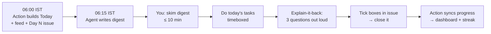

# How to use this site

## The daily loop (about 90 min on weekdays)



1. **Open [Today](../today.md)** (or the GitHub issue *Day N*, which has the same checklist). Each task shows track, minutes, a topic link and an optional resource.
2. **Timebox.** If a task overruns by 50%, stop, write down what's left, and move on. The catch-up queue will bring it back.
3. **Questions.** Every topic page ends with questions graded **L1 → L4**. Answer at least 3 out loud before opening the hidden answer.
4. **Close the loop.** Tick the boxes in the day's GitHub issue and close it. The `Sync progress` Action writes the ticked ids to `data/progress.yml`, and the [dashboard](../index.md) updates your streak, heatmap and per-track bars.

!!! tip "Forgot to tick yesterday?"
    Re-open the old issue, tick the boxes and close it again. The completion date is the date you close it. You can also run `uv run python scripts/sync_progress.py --done w03-ai-2 w03-dsa-4` locally and push.

## English & communication drills (30 min a day)

Every day has one 30-minute communication task (`wNN-comm-N`) that links straight to that day's drill: Mon grammar, Tue vocabulary, Wed speaking drill, Thu idioms and phrasal verbs, Fri writing, Sat recorded talk with shadowing, Sun soft skills plus a weekly recap. Answers are hidden in collapsible blocks. Say the speaking tasks out loud and record the Saturday talk; score it with the rubric in the drill. Run `uv run python scripts/export_vocab.py` to get an Anki CSV of all the words and idioms. See the [Communication track](../tracks/communication/index.md).

## Question levels

| Level | Meaning | How to use |
|---|---|---|
| **L1 Recall** | Definitions, mechanisms | Flashcards; should take under 30 s each |
| **L2 Apply** | Concrete situations, numbers, code | Solve on paper or in a REPL |
| **L3 Design** | Trade-offs, failure modes | Answer out loud in under 3 min, then compare |
| **L4 Staff** | Ambiguity, org impact, migrations | Write a 1-page memo; good for Sunday |

Each track also has a **question bank** (`Tracks → <track> → Question bank`). It has cross-topic questions, realistic scenarios, and a rapid-fire section for spaced review.

## Spaced repetition

- **DSA:** re-solve each problem on day 1, 3, 7 and 21 (the [problem tracker](../tracks/dsa/problem-tracker.md) has the rule and columns).
- **Concepts:** during the Sunday review hour, do the rapid-fire sections of the last 2 weeks' tracks, then pick one L3 question per track to explain back.
- **Anki (optional):** if you prefer an app, paste L1 questions into Anki or Mochi. The hidden-answer blocks map 1:1 to cards.

## Weekly loop (Sunday)

1. Review hour: flashcards, explain-it-back, and redo DSA problems marked `revisit`.
2. Write a retro in `docs/log/retros/week-NN.md` ([template](../log/retro-template.md)).
3. Record at least one **ADR** for the capstone ([template](../log/adr-template.md)).
4. The Sunday agent refreshes the radar and links, and rebalances next week if you're behind.

## Changing the plan

- **Edit the source, never the generated pages.** Change `data/curriculum.yml`, then run `uv run python scripts/build_plan.py`.
- **Ask an agent.** In any Claude Code session in this repo, say *"update roadmap: …"*, *"add topic X"*, or *"I finished X"*. [AGENTS.md](https://github.com/codeyashu/study-planner/blob/main/AGENTS.md) defines what the agent does.
- **Falling behind:** the rule is *never drop P0; move P2 to buffer weeks 25–26*.

## Local commands

```bash
uv sync && uv run mkdocs serve
```
