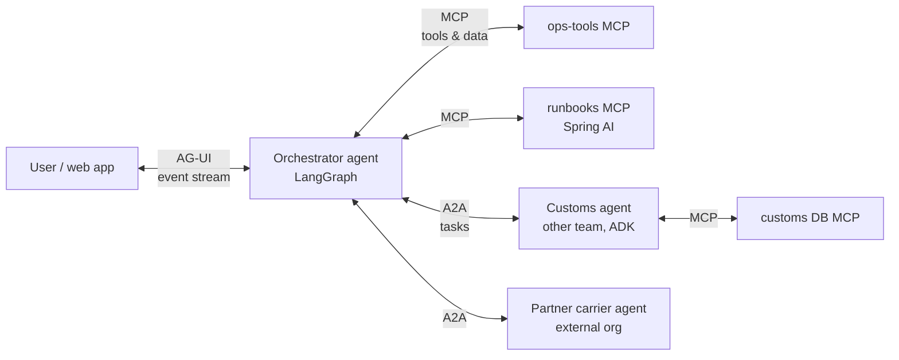
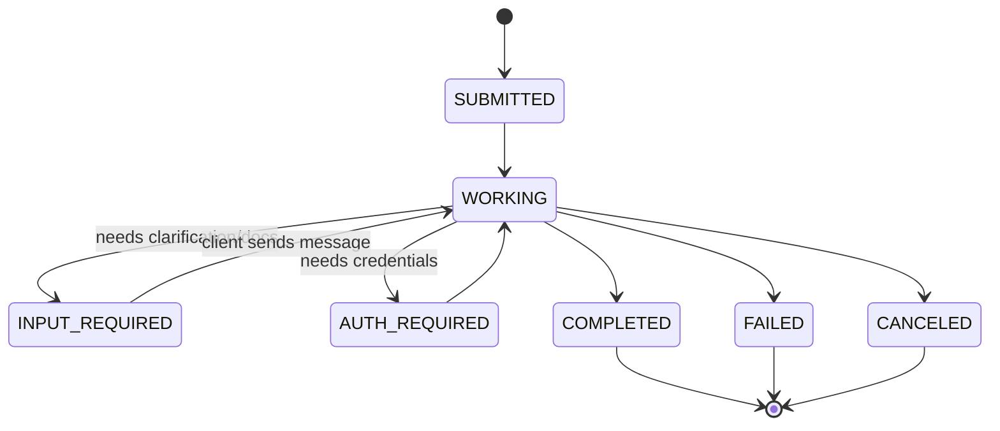

# A2A & AG-UI protocols

!!! abstract "At a glance"
    **Priority:** P1 · **Complexity:** 3/5 · **Est. time:** 3 h · **Phase:** 3 · **Prereqs:** [MCP](mcp.md), [Multi-agent systems](multi-agent-systems.md), [API design](../system-design/api-design.md)
    **You're done when:** the capstone exposes its "customs specialist" sub-agent over A2A (discoverable Agent Card, task lifecycle, streaming) and its orchestrator streams to a web UI over AG-UI, and you can explain where MCP, A2A and AG-UI each sit and why you'd never swap them.

## Why it matters

MCP standardised **agent ↔ tools**. Two more boundaries remain in any real system:

- **Agent ↔ agent** across teams, vendors and frameworks — **A2A** (Agent2Agent). Originated at Google (2025), now under the Linux Foundation; **v1.0 announced 2026-03-12** with signed Agent Cards and JSON-RPC / gRPC / HTTP+JSON bindings. Supported by Foundry Agent Service (A2A v1.0 GA), Bedrock AgentCore Runtime, ADK, MS Agent Framework, Pydantic AI and others.
- **Agent ↔ user interface** — **AG-UI** (from CopilotKit): an event-streaming protocol so any agent backend can drive any frontend with text streaming, tool-call visibility, shared state and human approvals. Adopted by MS Agent Framework, ADK, AWS, LangGraph, Pydantic AI and more.

For an architect these are *integration contracts*. The question is not "which is cool" but "what boundary am I crossing, who owns each side, and what lifecycle does the interaction have?"

## Core concepts

### The three-protocol stack



| Boundary | Protocol | Unit of work | Lifecycle | Opacity |
|---|---|---|---|---|
| Agent → tool/data | MCP | Tool call / resource read | Mostly request/response (Tasks extension for long jobs) | Tool is transparent: schema known |
| Agent → agent | A2A | **Task** containing messages and artifacts | Long-running, multi-turn, stateful, input-required, push notifications | Remote agent is **opaque**: no shared memory, tools or prompts |
| Agent → UI | AG-UI | **Run** producing a stream of typed events | Streaming per run; bidirectional (user input, approvals, state) | UI sees events, not internals |

Rule of thumb: **if the other side reasons autonomously and is owned by someone else, it's A2A; if it's a function, it's MCP; if a human is watching, it's AG-UI.**

### A2A in depth (v1.0)

**Discovery — the Agent Card.** JSON metadata served at `/.well-known/agent-card.json`: name, description, provider, version, supported interfaces/transports and URLs, capabilities (streaming, push notifications), security schemes, default input/output modes, and **skills** (id, description, tags, examples). v1.0 adds **Agent Card signing** so clients can verify the card wasn't tampered with, and an authenticated **extended Agent Card** (`GetExtendedAgentCard`) for capabilities only shown to authorised callers.

**Core operations** (same semantics across JSON-RPC, gRPC, HTTP+JSON bindings): `SendMessage`, `SendStreamingMessage`, `GetTask`, `ListTasks`, `CancelTask`, `SubscribeToTask`, and push-notification config CRUD.

**Data model.** A **Message** (role `user`/`agent`) contains **Parts** (text, file, structured data). Work happens in a **Task** with an id, optional `contextId` grouping related tasks, a status, history, and **Artifacts** (the outputs). v1.0 removed the `kind` discriminator field (breaking change from 0.3).

**Task states:**



(Wire names are `TASK_STATE_SUBMITTED`, `TASK_STATE_WORKING`, … in v1.0.)

**Long-running patterns:** streaming (SSE / gRPC stream of status and artifact update events), polling `GetTask`, or **push notifications** to a client webhook (authenticate the webhook! it's an SSRF and spoofing vector).

**Security:** standard schemes declared in the card — API key, HTTP bearer, OAuth 2.0 (auth code, client credentials, device code), OpenID Connect, mTLS. Treat every remote agent's output as **untrusted input** (OWASP ASI07 Insecure Inter-Agent Communication).

### Exposing an agent over A2A

=== "Pydantic AI (fastest)"

    ```python
    # uv add "pydantic-ai[a2a]"  ;  run: uvicorn customs_agent:app --port 9000
    from pydantic_ai import Agent

    customs = Agent(
        "openai:gpt-5.2",
        instructions="You are the customs clearance specialist. Ask for missing documents.",
    )
    app = customs.to_a2a()   # ASGI app serving Agent Card + A2A endpoints
    ```

=== "a2a-sdk (full control)"

    ```python
    # uv add "a2a-sdk[http-server]"
    from a2a.server.agent_execution import AgentExecutor, RequestContext
    from a2a.server.events import EventQueue

    class CustomsExecutor(AgentExecutor):
        async def execute(self, context: RequestContext, event_queue: EventQueue) -> None:
            # 1. get/create task from context  2. enqueue WORKING status
            # 3. run your agent  4. enqueue artifact update  5. enqueue COMPLETED
            ...

        async def cancel(self, context: RequestContext, event_queue: EventQueue) -> None:
            ...
    # Wire with DefaultRequestHandler + an in-memory/SQL task store + A2AStarletteApplication
    # (see the SDK's samples; class names change between minor releases).
    ```

!!! note "Version check"
    `a2a-sdk` implements A2A 1.0 with backward compatibility for 0.3 (as of Sept 2026). Framework helpers (`to_a2a()`) may lag the spec; check which protocol version they emit in the Agent Card.

### AG-UI in depth

AG-UI defines a small set of **typed events** streamed from agent to UI over HTTP (SSE) or WebSockets, plus inputs from UI to agent:

| Category | Events (examples) | UI use |
|---|---|---|
| Lifecycle | `RUN_STARTED`, `RUN_FINISHED`, `RUN_ERROR`, step started/finished | Spinners, error banners |
| Text | `TEXT_MESSAGE_START`, `TEXT_MESSAGE_CONTENT`, `TEXT_MESSAGE_END` | Token streaming |
| Tools | `TOOL_CALL_START`, `TOOL_CALL_ARGS`, `TOOL_CALL_END`, results | "Looking up MSK-123…", approval buttons |
| State | `STATE_SNAPSHOT`, `STATE_DELTA` (JSON Patch) | Shared state: live investigation board |
| Other | reasoning/thinking steps, custom events, raw | Show plan, domain widgets |

Why it matters: without it, every team invents its own websocket JSON for "tool started", and front-ends are coupled to one framework. With AG-UI, the React app (e.g. CopilotKit) works whether the backend is LangGraph, Pydantic AI, ADK or Agent Framework. **Frontend tools** (the agent asks the UI to do something — open a map, confirm a refund) and **human-in-the-loop** approvals become standard.

```python
# Pydantic AI → AG-UI (ASGI app streaming AG-UI events)
from pydantic_ai import Agent
copilot = Agent("openai:gpt-5.2", instructions="You are the Ops Copilot.")
app = copilot.to_ag_ui()   # serve with uvicorn; point CopilotKit / an AG-UI client at it
```

For LangGraph orchestrators, use the AG-UI LangGraph integration (listed in AG-UI docs) so graph node transitions and interrupts become AG-UI events.

### A2A vs "just call their REST API"

| | Plain REST/gRPC | A2A |
|---|---|---|
| Contract | Bespoke per service | Standard task/message/artifact model |
| Long-running + clarification | You design it | Built-in (`INPUT_REQUIRED`, streaming, push) |
| Discovery | Docs/wiki | Agent Card, registries |
| Best when | Deterministic service, stable schema | Autonomous agent, open-ended requests, cross-org |

Don't A2A-ify deterministic services. The overhead (task store, lifecycle) only pays when the remote side is genuinely an agent.

### Senior-level nuance

- **Opacity is a feature and a risk.** You don't see the remote agent's tools or prompts — good for encapsulation, bad for debugging and safety. Demand trace-context propagation and SLAs in the Agent Card/contract.
- **Trust boundaries multiply.** Remote agent output can carry prompt injections into your orchestrator (goal hijack via A2A). Sanitise, constrain with structured artifacts, and never auto-grant tools based on remote text.
- **Idempotency and cancellation** across A2A: retries can create duplicate tasks; use client-side dedupe keys in message metadata and implement `CancelTask` properly.
- **Cost attribution:** a single user request can fan out into A2A tasks billed to another team. Propagate a cost-center/tenant header and budget.
- **AG-UI state deltas** are JSON Patch — design your shared state schema deliberately; don't stream your whole LangGraph state (PII, size).

## Resources

| Resource | Type | Why this one | Level | Cost |
|---|---|---|---|---|
| [A2A protocol site](https://a2a-protocol.org/) | docs | Official: concepts, tutorials, what's new in v1.0 | intermediate | free |
| [A2A specification](https://a2a-protocol.org/latest/specification/) | docs | Operations, task states, security, bindings | advanced | free |
| [a2a-python SDK](https://github.com/a2aproject/a2a-python) | docs | Official Python SDK; samples link | intermediate | free |
| [A2A spec repo](https://github.com/a2aproject/A2A) | docs | Source of truth, discussions, proto definitions | advanced | free |
| [AG-UI docs](https://docs.ag-ui.com/introduction) | docs | Event types, integrations, protocol stack positioning | intermediate | free |
| [AG-UI GitHub](https://github.com/ag-ui-protocol/ag-ui) :gem: | docs | SDKs and framework integrations with runnable demos | intermediate | free |
| [Pydantic AI docs](https://ai.pydantic.dev/) | docs | `to_a2a()` and AG-UI adapters — quickest way to try both | intermediate | free |
| [Foundry: agent overview (A2A publishing)](https://learn.microsoft.com/en-us/azure/foundry/agents/overview) | docs | How a managed platform exposes A2A v1.0 endpoints | intermediate | free |

## Hands-on lab

**Goal (90 min):** give the capstone a cross-team agent and a live UI.

1. **Customs agent over A2A.** Build a Pydantic AI (or ADK) customs agent with an MCP tool `get_customs_status`. Expose via `to_a2a()` on port 9000. `curl http://localhost:9000/.well-known/agent-card.json` and inspect skills/capabilities.
2. **Orchestrator calls it.** In the LangGraph orchestrator, add a node `ask_customs` that sends an A2A message via the `a2a-sdk` client and streams status. Force an `INPUT_REQUIRED` path: the customs agent asks for an HS code when missing; the orchestrator routes this back to the user.
3. **Propagate trace context** (W3C `traceparent`) in A2A message metadata/headers; verify one trace spans orchestrator → customs agent → MCP in Langfuse.
4. **AG-UI.** Expose the orchestrator via AG-UI; use a minimal CopilotKit/Next.js app or the AG-UI dojo to show token streaming, a "tool running" indicator and an approval button for `restart_consumer`.
5. **Security.** Require a bearer token on the A2A endpoint (declared in the Agent Card security schemes); add a test that an unauthenticated `SendMessage` fails.

**Expected output:** a demo where the user asks "clear MSK-123 through customs", sees streaming progress in the UI, is asked for the HS code (relayed from the remote agent), and gets a final artifact; one trace in Langfuse covers all hops.

## Questions

### L1 — Recall

??? question "Q1. Where is an A2A Agent Card served and what does it contain?"
    ??? success "Answer"
        At `/.well-known/agent-card.json`. Name, description, provider, version, interfaces/URLs and transports, capabilities (streaming, push notifications), security schemes, default input/output modes, and skills. v1.0 supports signed cards and an authenticated extended card.

??? question "Q2. List the A2A task states."
    ??? success "Answer"
        Submitted, working, input-required, auth-required, completed, failed, canceled (wire names `TASK_STATE_*`). Completed/failed/canceled are terminal.

??? question "Q3. What problem does AG-UI solve, and name four of its event types."
    ??? success "Answer"
        Standardises the agent→UI streaming contract so frontends aren't coupled to one agent framework. Events: `RUN_STARTED`, `TEXT_MESSAGE_CONTENT`, `TOOL_CALL_START`, `STATE_SNAPSHOT`, `STATE_DELTA`, `RUN_FINISHED`, `RUN_ERROR`.

### L2 — Apply

??? question "Q4. The remote customs agent takes up to 4 hours. Your orchestrator runs in a request/response API with a 60 s timeout. Design the interaction."
    ??? success "Answer"
        Send the message, receive a task id immediately, persist it in the orchestrator's durable state (LangGraph checkpoint), and end the current run with a "pending" status to the user. Register a push-notification webhook (authenticated, validated) or poll `GetTask` from a scheduler; on completion, resume the graph thread and notify the user (AG-UI/email). Handle `INPUT_REQUIRED` by surfacing a question to the user and sending a follow-up message on the same task.

??? question "Q5. How do you prevent a compromised partner agent from hijacking your orchestrator via A2A responses?"
    ??? success "Answer"
        Treat artifacts as untrusted data: require structured artifacts validated by schema, never execute instructions from them, render free text in a quarantined/"data" section of the prompt or process it with a tool-less quarantined LLM (dual-LLM pattern), restrict which tools can be invoked after reading remote content, and apply output filtering. Verify signed Agent Cards and pin the endpoint.

??? question "Q6. Your React team wants to show 'Checking shipment MSK-123…' while tools run and an Approve button before writes. Which AG-UI features do you use?"
    ??? success "Answer"
        `TOOL_CALL_START/ARGS/END` events for progress display; a human-in-the-loop interrupt/frontend tool for approval (the agent pauses on the write tool, UI renders Approve/Reject, sends the decision back as input); `STATE_DELTA` to update a shared investigation panel.

### L3 — Design & trade-offs

??? question "Q7. A teammate wants to expose every internal agent as an MCP tool instead of adopting A2A. Evaluate."
    ??? success "Answer"
        Works for short, synchronous delegation where the caller wants a single result (agent-as-tool). Breaks down for multi-turn clarification, long-running work, streaming status, per-agent identity/auth, cancellation and discovery of skills — you'd reinvent A2A on top of MCP. Recommend: MCP for tools and simple agent-as-tool delegation inside a team; A2A at team/org boundaries or where the lifecycle matters.

??? question "Q8. Build vs adopt AG-UI for a single internal UI tied to one LangGraph backend."
    ??? success "Answer"
        Bespoke streaming is simple initially and avoids a dependency. AG-UI pays off with multiple backends/frameworks, reuse of CopilotKit components, standard HITL/frontend-tool semantics, and future migrations. If the backend may change (e.g. move a sub-agent to Agent Framework on Foundry), or other UIs will consume it, adopt AG-UI; cost is small because integrations exist for LangGraph/Pydantic AI.

??? question "Q9. What must an A2A contract between two companies specify beyond the protocol itself?"
    ??? success "Answer"
        Auth scheme and credential lifecycle, data classification/residency and retention of task history, SLAs (latency, availability, max task duration), cost/billing per task, rate limits, error semantics, versioning of skills and deprecation, audit and trace sharing, liability for agent actions, and incident contacts.

### L4 — Staff-level ambiguity

??? question "Q10. Your org wants an 'agent marketplace' where teams publish agents for others. Design the governance."
    ??? success "Answer"
        Registry of signed Agent Cards (owner, data classification, SLA, cost, eval scores); publishing pipeline (security review, red-team eval, trace instrumentation required, auth via corporate IdP); runtime gateway enforcing authZ between agents, quotas and cost attribution; versioning/deprecation policy; observability with cross-agent traces; kill switch per agent; periodic re-certification. Start with 3-5 high-value agents, not a free-for-all.

??? question "Q11. The protocols are still moving (A2A 0.3 → 1.0, MCP stateless). How do you avoid churn while still adopting?"
    ??? success "Answer"
        Isolate protocol handling in thin adapters (one module per protocol), keep domain logic protocol-agnostic, pin SDK versions, maintain contract tests per boundary, support N and N-1 during transitions (A2A SDK supports 1.0 + 0.3), and follow the spec's deprecation windows. Adopt where interoperability value is concrete (cross-team/partner), defer where a local function call suffices.

## Real-world use cases

- **Carrier–shipper collaboration**: a shipper's planning agent sends A2A tasks to a carrier's booking agent; input-required states handle missing dangerous-goods declarations.
- **Enterprise help desk**: an orchestrator delegates to HR, IT and finance agents owned by different departments via A2A; one AG-UI chat frontend in Teams/web.
- **Ops copilot UI**: AG-UI streams an incident investigation with a live shared state board (hypotheses, evidence, actions) and approval buttons for remediations.
- **Managed publishing**: Foundry Agent Service publishes agents with A2A endpoints; AgentCore Runtime hosts A2A servers ([Managed platforms](managed-agent-platforms.md)).

## Pitfalls & anti-patterns

- Using A2A for deterministic services (overhead with no benefit).
- Trusting remote agent output as instructions.
- Unauthenticated push-notification webhooks.
- No trace propagation across agent boundaries — undebuggable fan-outs.
- Streaming full internal state (with PII) to the UI via `STATE_SNAPSHOT`.
- Coupling the frontend to a framework's private event format.
- Ignoring task cancellation and idempotency.

## Checklist

- [ ] I can place MCP, A2A and AG-UI on a diagram and justify each boundary
- [ ] I exposed an agent over A2A and consumed it from the orchestrator, including input-required
- [ ] I streamed the orchestrator to a UI via AG-UI with an approval step
- [ ] I verified one trace across all hops
- [ ] I answered all L3 questions out loud in < 3 min each
