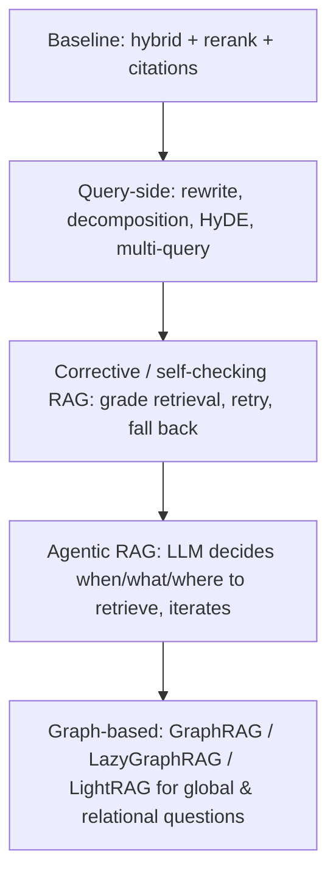

# Advanced RAG: agentic RAG, GraphRAG, LazyGraphRAG

!!! abstract "At a glance"
    **Priority:** P1 · **Complexity:** 4/5 · **Est. time:** 4 h · **Phase:** 5 · **Prereqs:** [Hybrid search & reranking](hybrid-search-reranking.md), [Agent patterns](agent-patterns.md), [Evals I](evals-error-analysis.md)
    **You're done when:** you can look at a failing RAG slice, diagnose which of {retrieval, multi-hop, global-question, freshness} it is, pick the cheapest technique that fixes it (rewrite, HyDE, agentic loop, graph), and prove the gain and the cost on a golden set.

## Why it matters

A well-built baseline (hybrid + rerank + good chunking) handles most "find the passage that answers this" questions. It fails on predictable classes:

1. **Multi-hop questions** ("Which services owned by the team that had the Feb outage also depend on the EDI gateway?") — no single chunk contains the answer.
2. **Global / sensemaking questions** ("What are the recurring themes in our last 200 postmortems?") — vector top-k can't summarise a corpus.
3. **Ambiguous / underspecified queries** needing clarification, decomposition or tool use.
4. **Answers needing computation or structured data** (SQL, APIs), not text.

Advanced techniques address these, but each adds cost, latency and new failure modes. Staff-level judgement is **not using them until error analysis shows which class you're failing** — as of 2026 evidence (for example arXiv 2601.07711) shows agentic RAG is not uniformly better than a strong static pipeline; it wins on hard multi-hop slices and can lose on simple lookups through extra noise and cost.

## Core concepts

### A ladder of techniques (climb only when the eval says so)



### Query-side techniques

| Technique | What | Helps | Cost |
|---|---|---|---|
| **Query rewriting** | Standalone query from chat history; keyword expansion | Follow-ups, vague queries | 1 small-model call |
| **Decomposition** | Split multi-part question into sub-questions, retrieve for each, merge | Multi-hop and compound questions | N+1 calls |
| **Multi-query + RRF** | Generate 3-5 paraphrases, retrieve all, fuse | Recall on ambiguous phrasing | 1 call + N retrievals |
| **HyDE** | LLM writes a hypothetical answer; embed *that* to retrieve | Short/abstract queries vs long docs; weak when the model hallucinates domain facts | 1 call |
| **Step-back** | Ask a more general question first | Questions needing background principles | 1 call |
| **Routing/filters** | Pick index, service, doc type, date range | Precision | 1 small call |

### Corrective and self-reflective RAG

Insert **graders**: after retrieval, a cheap model (or the reranker score) classifies the context as sufficient / ambiguous / irrelevant. If insufficient: rewrite and retry, broaden filters, or fall back to web/other source; after generation, check **groundedness** (each claim supported by cited chunks) and abstain or regenerate. Patterns from the literature: Self-RAG (learned reflection tokens), CRAG (corrective RAG with retrieval evaluator), Adaptive-RAG (route by query complexity). In production the practical form is a **LangGraph/Pydantic AI graph with 2-3 bounded loops**, not a research model.

### Agentic RAG

Give the LLM retrieval as **tools** and let it plan: `search_runbooks`, `search_incidents`, `query_metrics_sql`, `get_document(id)`. The agent decides whether to retrieve, which source, how to reformulate, and when it has enough. Strengths: multi-hop, mixed structured/unstructured sources, clarifying questions. Weaknesses: variable latency (3-10 LLM calls), cost, non-determinism, harder evals, tendency to over-retrieve or stop early.

Design rules that keep it reliable:

- Budget: max 4-6 retrieval calls per question; stop when the model outputs a cited final answer.
- Return **compact, cited chunks** (ID + 300-500 tokens + score), not full documents; provide `get_document(id, section)` to drill down.
- Make retrieval tools **idempotent and cached** per run; detect repeated queries.
- Route: cheap classifier decides *static pipeline vs agentic loop* — most questions stay on the fast path (adaptive RAG).
- Evaluate both **trajectory** (were the right tools called, were redundant calls avoided?) and **outcome** (correctness, faithfulness).

### GraphRAG

Microsoft's GraphRAG builds a **knowledge graph** from the corpus with an LLM: extract entities and relationships per chunk, cluster the graph into hierarchical **communities** (Leiden algorithm), and pre-generate **community summaries**. Query modes:

- **Local search**: entity-centric — find relevant entities, traverse neighbours, pull related text units and community reports. Good for relational questions.
- **Global search**: map-reduce over community summaries. Good for "themes across the whole corpus" sensemaking questions that vector RAG can't do.
- **DRIFT search**: local search enriched with community info.

Costs: indexing is **expensive** (LLM calls over every chunk for extraction plus summarisation — often 10-100x the cost of embedding-only ingestion), graphs go stale as documents change, entity resolution is imperfect, and evaluation is hard (LLM-judge comparisons for comprehensiveness/diversity).

### LazyGraphRAG and lighter alternatives

**LazyGraphRAG** (Microsoft Research, 2025) defers LLM work: indexing uses cheap NLP (noun-phrase extraction, co-occurrence graph, community detection) at roughly **vector-RAG indexing cost** (Microsoft reports ~0.1% of full GraphRAG index cost), and at query time it uses the LLM in a best-first/breadth-first hybrid to pull relevant text and summarise on demand, with a "relevance test budget" as the quality/cost knob. It trades query-time cost for near-zero index cost, which suits ad-hoc and frequently changing corpora. Other options: **LightRAG** (dual-level graph retrieval, incremental updates, open source), **HippoRAG**-style personalised PageRank over entity graphs, and a plain **property graph in Postgres/Neo4j** built from structured sources (service dependency graph, org chart) — often the best "GraphRAG" is the graph you already have.

| Approach | Best for | Index cost | Query cost | Freshness | Notes |
|---|---|---|---|---|---|
| Hybrid + rerank | Lookup Q&A | Low | Low | Easy | Default |
| Agentic RAG | Multi-hop, mixed sources | Low | High/variable | Easy | Needs trajectory evals |
| GraphRAG (full) | Global sensemaking, stable corpora | Very high | Medium | Hard | Reindex on change |
| LazyGraphRAG | Ad-hoc global questions, changing corpora | Very low | Medium-high | Easy | Tunable relevance budget |
| Existing knowledge graph + tools | Relational questions on curated data | Already paid | Low | Depends | Text-to-Cypher/SQL needs guardrails |

### Structured data: text-to-SQL is RAG too

For metrics, inventories and tickets, expose **parameterised query tools** or a semantic layer; if you allow text-to-SQL, enforce read-only roles, allow-lists, row limits, timeouts and schema retrieval (RAG over the DDL and example queries). Validate generated SQL by parsing (e.g. `sqlglot`) before execution.

### Diagnosing which technique you need

| Symptom in error analysis | Likely cause | First fix |
|---|---|---|
| Right doc absent from top-50 | Query/doc vocabulary gap | Hybrid, multi-query, HyDE, contextual retrieval |
| Right doc in top-50 not top-5 | Ranking | Reranker, tune candidate pool |
| Needs facts from 2+ docs | Multi-hop | Decomposition or agentic loop |
| "Summarise across everything" | Global question | Map-reduce over summaries, (Lazy)GraphRAG |
| Confident wrong answers with good context | Generation | Prompt/citation constraints, faithfulness gate |
| Stale answers | Freshness | Ingestion lag SLO, doc versioning, date filters |

### What juniors miss

- Jumping to GraphRAG because it's fashionable, before measuring baseline failure classes.
- Judging agentic RAG on final answers only; hiding runaway retrieval loops.
- No abstention path: advanced pipelines should say "I couldn't find it" rather than loop.
- Treating LLM-extracted graphs as ground truth (entity duplicates, hallucinated relations).

## Resources

| Resource | Type | Why this one | Level | Cost |
|---|---|---|---|---|
| [Microsoft GraphRAG documentation](https://microsoft.github.io/graphrag/) | docs | Official indexing pipeline, local/global/DRIFT search, prompt tuning | advanced | free |
| [LazyGraphRAG announcement (Microsoft Research)](https://www.microsoft.com/en-us/research/blog/lazygraphrag-setting-a-new-standard-for-quality-and-cost/) | article | Why deferring LLM work slashes index cost; cost/quality numbers (page may block automated fetch; open in browser) | advanced | free |
| [Self-RAG paper](https://arxiv.org/abs/2310.11511) | paper | Foundational idea of retrieval-on-demand plus self-critique | advanced | free |
| [Corrective RAG (CRAG) paper](https://arxiv.org/abs/2401.15884) | paper | Retrieval evaluator with corrective actions; template for graders | advanced | free |
| [Is agentic RAG always better? (arXiv 2601.07711)](https://arxiv.org/abs/2601.07711) | paper | Evidence-based counterweight to agentic hype | advanced | free |
| [LightRAG](https://github.com/HKUDS/LightRAG) :gem: | docs | Lightweight open-source graph RAG with incremental updates; easy to experiment locally | advanced | free |
| [Jason Liu - writing](https://jxnl.co/writing/) :gem: | article | Segmenting queries and choosing techniques by failure class | advanced | free |
| [Anthropic - Contextual Retrieval](https://www.anthropic.com/news/contextual-retrieval) | article | The cheapest high-impact upgrade before any graph work | intermediate | free |

## Hands-on lab

**Goal:** add a routed **agentic retrieval path** to the copilot and compare it with the static pipeline on multi-hop questions. (2-3 h)

1. Extend the golden set with 25 **multi-hop** questions across runbooks, postmortems and the service catalogue (e.g. "Which postmortems involved a service that depends on edi-gateway and were caused by a config change?") with labelled supporting doc IDs and answers. Add 10 **global** questions ("Top 3 recurring causes of latency incidents?").
2. Static baseline: hybrid+rerank top-5 -> answer with citations.
3. Agentic path as a **Pydantic AI agent** with tools `search_runbooks`, `search_incidents`, `get_service_dependencies(service)` (a small property graph in Postgres tables or a dict), `get_document(id)`; `UsageLimits(request_limit=8, tool_calls_limit=6)`; output type `Answer(text, citations, confidence)`.

    ```python
    from pydantic_ai import Agent, UsageLimits
    rag_agent = Agent("anthropic:claude-sonnet-4-6", deps_type=Deps, output_type=Answer,
                      instructions="Answer only from tool results. Cite doc ids. If insufficient evidence after 4 searches, say so.")
    result = await rag_agent.run(question, deps=deps,
                                 usage_limits=UsageLimits(request_limit=8, tool_calls_limit=6))
    ```

4. Router: a small model classifies `simple | multi_hop | global`; simple -> static; multi_hop -> agentic; global -> map-reduce over pre-summarised postmortems (write per-incident 150-token summaries once, then map-reduce).
5. Measure per slice: answer correctness (LLM judge validated on 20 human labels, see [Evals I](evals-error-analysis.md)), citation accuracy, tool calls, tokens, p95 latency.

*Expected shape:* static ~0.85 correctness on simple, ~0.4 on multi-hop; agentic ~0.7 on multi-hop at 3-5x cost; on simple questions agentic is equal or slightly worse and much costlier — hence the router. Global questions are unanswerable by static top-k (near 0) and decent via map-reduce.

## Questions

### L1 — Recall

??? question "Q1. What problem does GraphRAG solve that vector RAG cannot?"
    ??? success "Answer"
        Global, corpus-level sensemaking ("what themes recur across all documents?") and relationship-heavy questions. Vector top-k returns the most similar few chunks and can't aggregate across a whole corpus. GraphRAG builds an entity/relationship graph, clusters it into hierarchical communities, and summarises each community so global questions can be answered via map-reduce over summaries, and local questions via graph neighbourhood retrieval.

??? question "Q2. What is LazyGraphRAG's key idea and trade-off?"
    ??? success "Answer"
        Defer LLM use: index with cheap NLP (concept co-occurrence graph, community detection) at roughly vector-RAG cost, and spend LLM effort at query time on only the relevant communities/text under a relevance-test budget. Trade-off: much lower indexing cost and easier updates versus higher and more variable per-query cost/latency; it suits changing corpora and ad-hoc global questions.

??? question "Q3. What is HyDE and when does it fail?"
    ??? success "Answer"
        Hypothetical Document Embeddings: the LLM writes a plausible answer to the query, and that text (not the question) is embedded for retrieval, bringing the query representation closer to document-style text. It helps for short or abstract queries; it fails when the model lacks domain knowledge and hallucinates misleading specifics (e.g. internal service names), or for identifier lookups where lexical matching is what's needed.

### L2 — Apply

??? question "Q4. Error analysis of 100 failed RAG answers: 35 gold doc not in top-50, 20 in top-50 but not top-5, 25 multi-hop, 10 global, 10 generation errors. Prioritise."
    ??? success "Answer"
        Fix by cost-effectiveness: (1) The 35 retrieval-absent cases: hybrid/contextual retrieval/multi-query, chunking and metadata review — cheapest and largest. (2) The 20 ranking cases: add or upgrade the reranker and adjust candidate pool. (3) The 25 multi-hop: decomposition or a routed agentic path with budgets. (4) The 10 global: map-reduce over pre-computed summaries or LazyGraphRAG only if global questions matter to users. (5) The 10 generation errors: citation-required output, faithfulness gate. Re-run the golden set after each step; stop when the residual failures aren't worth their cost.

??? question "Q5. Write the stop conditions and budgets for an agentic retrieval loop."
    ??? success "Answer"
        Hard budgets: `request_limit` (e.g. 8 model calls), `tool_calls_limit` (6 retrievals), wall-clock timeout (20 s), token cap. Semantic stops: model returns a final `Answer` with citations; or `confidence=low` triggers abstention message. Loop protection: hash `(tool, normalised args)` and refuse repeats returning a nudge; stop if two consecutive retrievals add no new document IDs. On budget exhaustion return partial findings labelled as such rather than a fabricated answer. Emit these as span attributes for dashboards.

??? question "Q6. Implement multi-query retrieval with RRF in outline."
    ??? success "Answer"
        ```python
        async def multi_query_retrieve(q: str, n: int = 4, k: int = 20):
            variants = (await rewriter.run(f"Write {n} diverse search queries for: {q}")).output  # list[str]
            lists = await asyncio.gather(*(hybrid_search(v, k=k) for v in [q, *variants]))
            scores: dict[int, float] = {}
            for results in lists:
                for rank, doc_id in enumerate(results, start=1):
                    scores[doc_id] = scores.get(doc_id, 0.0) + 1.0 / (60 + rank)
            return sorted(scores, key=scores.get, reverse=True)[:k]
        ```
        Then rerank the fused list. Measure recall@20 uplift vs single query on the ambiguous slice; if under ~3 points, drop it (extra latency and cost).

### L3 — Design & trade-offs

??? question "Q7. Static pipeline vs agentic RAG vs router for an enterprise assistant handling 50k questions/day. Decide."
    ??? success "Answer"
        Use a **router (adaptive RAG)**: a cheap classifier (or heuristics on query features) sends the ~80% simple lookups down the fast static hybrid+rerank path (low latency, predictable cost, easy evals) and only multi-hop/ambiguous ones to a budgeted agentic loop. Pure agentic multiplies LLM calls 3-8x for no gain on simple queries and complicates SLOs; pure static leaves multi-hop failures. Evaluate router accuracy separately (misroutes to static cost quality; misroutes to agentic cost money), tune threshold on a labelled set, and monitor the traffic split and per-path metrics.

??? question "Q8. Would you adopt full GraphRAG for a corpus of 50k postmortems updated daily? Alternatives?"
    ??? success "Answer"
        Probably not full GraphRAG: extraction over 50k documents costs heavily, and daily updates require reindexing or complex incremental handling; extracted graphs also contain noise. Prefer: hybrid RAG for lookups; per-document structured extraction (cause category, service, fix) into a table for aggregation queries (SQL answers "top recurring causes" precisely); periodic LLM-generated cluster summaries for themes; or LazyGraphRAG/LightRAG if free-form global questions are a real requirement. Decide on measured question mix: if <5% of questions are global, don't pay the index tax.

??? question "Q9. How do you evaluate agentic RAG differently from static RAG?"
    ??? success "Answer"
        Add **trajectory metrics** to outcome metrics: tool selection correctness, unnecessary/repeated calls, steps to answer, recovery from empty retrieval, budget-exhaustion rate; plus cost and p95 latency per slice. Use fixed seeds/temperature 0 where possible and run each case multiple times (variance). Grade outcomes with validated LLM judges for correctness/faithfulness/citation accuracy; keep deterministic checks (citation IDs exist, supporting doc retrieved). Use traces to do error analysis by trajectory pattern (looping, premature stop, wrong source).

### L4 — Staff-level ambiguity

??? question "Q10. An exec saw a GraphRAG demo and wants it 'across all company knowledge' this quarter. Respond."
    ??? success "Answer"
        Agree on the outcome, not the technique: which decisions or questions do they want improved? Sample real questions, run a baseline on the existing platform, and categorise failures. Propose a staged plan: (1) fix baseline retrieval and freshness (fast wins), (2) pilot graph/global techniques on one corpus with well-defined global questions, comparing GraphRAG, LazyGraphRAG and structured extraction on quality and cost, (3) decide scale-out from data. Be explicit about the risks (index cost, staleness, ACL propagation through summaries — a community summary can leak restricted content!) and success metrics. This protects the budget while showing momentum.

??? question "Q11. ACLs and GraphRAG: how do permissions work when summaries blend documents from different access levels?"
    ??? success "Answer"
        This is a real hazard: community summaries and graph edges can leak information from restricted documents to users who can't see the sources. Options: build separate graphs/summaries per permission domain (partition by ACL groups), compute summaries only over documents accessible to the group and enforce domain selection at query time, tag every generated artifact with the intersection of source ACLs and only serve to users satisfying it, or restrict graph techniques to corpora with uniform access. Add tests with users of different permissions, audit logs, and a data-classification review before rollout.

## Real-world use cases

- **Incident postmortem mining:** structured extraction into tables for "top causes by quarter" (SQL), LazyGraphRAG for open-ended theme discovery.
- **Trade compliance research:** agentic multi-hop across regulations, amendments and internal policies with citation requirements and abstention.
- **Service dependency questions:** the existing CMDB/dependency graph exposed as tools beats LLM-extracted graphs.
- **Sales/contract analytics:** decomposition for "compare clause X across these 12 contracts".

## Pitfalls & anti-patterns

- Building graphs before measuring failure classes.
- Unbounded agentic loops; no abstention path.
- Judging only final answers; ignoring cost per query.
- Community summaries leaking across ACL boundaries.
- Treating LLM-extracted entities as clean (no entity resolution, no confidence).
- Multi-query/HyDE always-on, doubling latency for no measured gain.

## Checklist

- [ ] I can map failure symptoms to techniques and their costs
- [ ] I built a routed agentic retrieval path with budgets and loop detection
- [ ] I measured static vs agentic per slice including cost and latency
- [ ] I can explain GraphRAG vs LazyGraphRAG vs structured extraction trade-offs
- [ ] I answered all L3 questions out loud in < 3 min each
