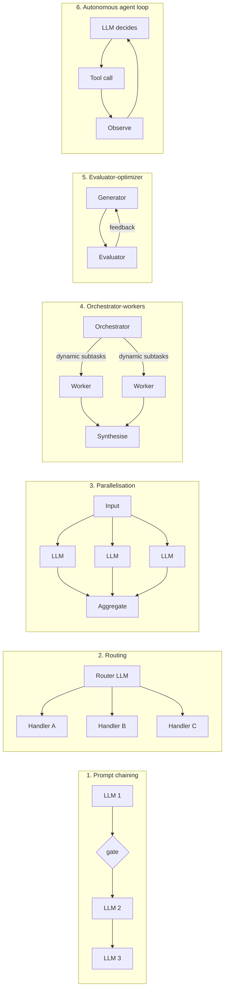
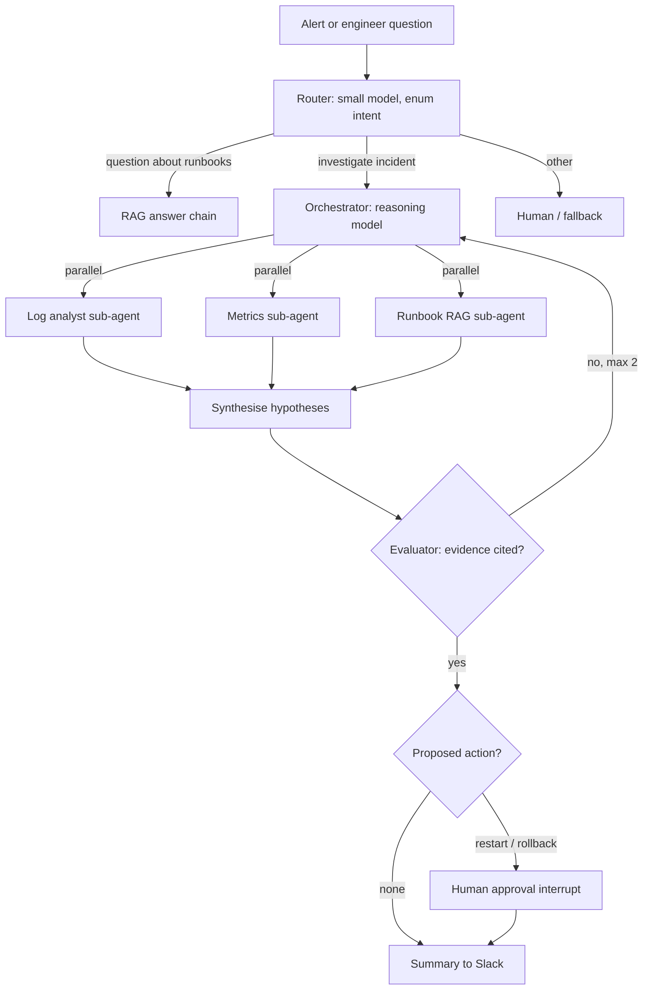

# Agent & workflow patterns (Building Effective Agents)

!!! abstract "At a glance"
    **Priority:** P0 · **Complexity:** 3/5 · **Est. time:** 3 h · **Phase:** 1 · **Prereqs:** [Prompting & structured outputs](prompting-structured-outputs.md), [Tool calling](tool-calling.md)
    **You're done when:** given a use case you can pick the *least agentic* pattern that meets the quality bar, sketch it as a graph, name its failure modes and controls, and justify it with an eval rather than intuition.

## Why it matters

"Agent" is the most overloaded word in the industry. Anthropic's **Building Effective Agents** (Dec 2024, still the reference in 2026) drew the line that most practitioners now use:

- **Workflows:** LLMs and tools orchestrated through **predefined code paths**.
- **Agents:** LLMs **dynamically direct their own process and tool usage**, deciding how many steps to take.

The core advice — *start with the simplest thing; add agency only when it demonstrably improves outcomes* — is what separates production systems from demos. Most successful "agents" in enterprises are mostly workflows with one or two agentic steps. As an architect you'll be asked to choose patterns, justify cost/latency/reliability, and explain failure modes. Every framework (LangGraph, Pydantic AI, OpenAI Agents SDK, Google ADK, MS Agent Framework) implements these same patterns with different ergonomics.

## Core concepts

### The augmented LLM

The building block is an LLM with **retrieval, tools, and memory**. Everything below composes calls to it. Get this unit right first — good tool design ([tool calling](tool-calling.md)) and context ([context engineering](context-engineering.md)) matter more than the orchestration pattern.

### The five workflow patterns + the agent loop



| Pattern | Use when | Cost/latency | Main failure mode | Control |
|---|---|---|---|---|
| **Prompt chaining** | Task decomposes into fixed steps | Sequential latency, predictable | Error propagates down the chain | Programmatic gates/validation between steps |
| **Routing** | Distinct input categories need different handling/models | +1 cheap call | Misroutes | Labelled eval of router; "other" → fallback/human |
| **Parallelisation** (sectioning / voting) | Independent subtasks, or need confidence via multiple samples | Parallel → low latency, higher cost | Aggregation conflicts | Deterministic aggregation, majority vote, thresholds |
| **Orchestrator-workers** | Subtasks not known up front (e.g. which services to inspect) | Variable | Over-decomposition, lost context at boundaries | Cap workers, structured worker outputs |
| **Evaluator-optimizer** | Clear evaluation criteria and iteration helps (drafting, code) | 2–4x calls | Endless loops, evaluator too lenient | Max iterations, calibrated evaluator |
| **Agent loop** | Open-ended, unpredictable number of steps, trusted environment | Unbounded without limits | Loops, drift, compounding errors, runaway cost | Step/tool/cost budgets, checkpoints, HITL, sandboxing |

### The agent loop, precisely

```python
# Pseudocode for every "agent" framework's core loop
messages = [system, user]
for step in range(MAX_STEPS):
    resp = llm(messages, tools=TOOLS)
    if resp.stop_reason != "tool_use":
        return resp.final_answer
    for call in resp.tool_calls:           # may be parallel
        result = execute(call)             # authz, validation, timeouts, idempotency here
        messages += [call, result]
raise StepBudgetExceeded
```

Everything else (ReAct, "plan-and-execute", reflection) is a variation: ReAct interleaves reasoning and actions; **plan-and-execute** has one call produce a plan then executes steps (cheaper, more predictable, but brittle when the plan is wrong — re-plan on failure); **reflection** adds a critique step.

### Reliability maths: why agency is expensive

If each step succeeds with probability *p* and a task needs *n* dependent steps, naive success ≈ *pⁿ*: 0.95¹⁰ ≈ 0.60, 0.99¹⁰ ≈ 0.90. Agents recover from some errors (they observe and retry), so reality is better than *pⁿ*, but the direction holds: **every added step is a place to fail**. Workflows hard-code the steps you already know are needed, spending model judgement only where it's required.

### Choosing: a decision procedure

1. Can a single well-designed call (with retrieval + structured output) meet the bar? Stop.
2. Are the steps known in advance? → **chain** (with gates) or **route**.
3. Independent sub-parts or need confidence? → **parallelise**.
4. Sub-parts depend on the input and aren't enumerable? → **orchestrator-workers**.
5. Quality improves with critique against clear criteria? → **evaluator-optimizer**.
6. Genuinely open-ended, environment gives ground-truth feedback (tests pass, query returns), and errors are cheap/reversible? → **agent loop** with budgets, checkpoints, and HITL for irreversible actions.

Multi-agent systems (several autonomous agents collaborating) are a further step with their own failure modes — see [multi-agent systems](multi-agent-systems.md).

### Controls every agentic system needs

- **Budgets:** max steps, max tool calls, max tokens/cost per run, wall-clock timeout.
- **Stop conditions:** explicit "done" output type; detect repeated identical tool calls (loop detection).
- **Checkpointing:** persist state per step so you can resume, replay, and debug — see [LangGraph](langgraph.md) and [durable execution](durable-execution-hitl.md).
- **Human-in-the-loop** for irreversible or high-blast-radius actions.
- **Least-privilege tools**, sandboxing, and injection defences — see [guardrails](guardrails-security.md).
- **Tracing** of every step — see [LLM observability](llm-observability.md).
- **Evals at two levels:** end-to-end task success and per-step (router accuracy, tool-call validity).

### The capstone's shape

The **Agentic Ops Copilot** deliberately mixes patterns:



Router (routing) → orchestrator-workers with parallel workers → evaluator gate → HITL. Only the orchestrator is a true agent loop.

### What juniors miss

- Starting with a multi-agent framework for something a chain solves.
- No budgets → a stuck agent burns $200 overnight.
- Not separating *deciding* (LLM) from *doing* (code with authz and validation).
- Evaluating only the final answer, so they can't tell which step broke.
- Treating framework choice as the architecture; the pattern is the architecture.

## Resources

| Resource | Type | Why this one | Level | Cost |
|---|---|---|---|---|
| [Anthropic — Building effective agents](https://www.anthropic.com/engineering/building-effective-agents) | article | The reference taxonomy of workflows vs agents, with when-to-use guidance | intermediate | free |
| [12-Factor Agents (HumanLayer)](https://github.com/humanlayer/12-factor-agents) :gem: | article | Opinionated engineering principles: own your control flow, small focused agents, pause/resume | intermediate | free |
| [Lilian Weng — LLM Powered Autonomous Agents](https://lilianweng.github.io/posts/2023-06-23-agent/) | article | Planning, memory, tool use — conceptual foundations behind ReAct/reflection | intermediate | free |
| [Simon Willison — Designing agentic loops](https://simonwillison.net/2025/Sep/30/designing-agentic-loops/) :gem: | article | Practical view of tools, sandboxes and goals for coding-agent loops | intermediate | free |
| [Hugging Face — AI Agents Course](https://huggingface.co/learn/agents-course) | course | Hands-on, framework-spanning implementations of the patterns | intermediate | free |
| [LangGraph docs — overview](https://docs.langchain.com/oss/python/langgraph/overview) | docs | How the patterns map onto graphs, state, and checkpoints | intermediate | free |
| [Chip Huyen — AI Engineering (book repo)](https://github.com/chiphuyen/aie-book) | book | Chapter on agents: planning, failure modes, evaluation in a systems context | advanced | paid |

## Hands-on lab

**Goal:** implement three patterns in **plain Python** (no framework) for the same task and compare them with numbers — the baseline you'll later port to LangGraph. (2 h)

Task: "Given an alert, produce a root-cause hypothesis with cited evidence." Use stub tools with canned data: `get_recent_deploys(service)`, `query_logs(service, window)`, `get_metrics(service, metric, window)`, `search_runbooks(query)`.

1. **Chain:** fixed steps — deploys → logs → metrics → runbook → synthesise (one LLM call at the end with all results).
2. **Orchestrator-workers:** orchestrator LLM outputs a structured plan (`list[Subtask]`), workers run in parallel with `asyncio.TaskGroup`, synthesiser combines.
3. **Agent loop:** the loop pseudocode above with `MAX_STEPS=8`, loop detection (same tool + args twice → inject a warning), and a cost counter.
4. Create 15 scenarios with known root causes (bad deploy, DB saturation, upstream dependency outage, config change, red herring alert).
5. Score: root cause correct (exact label), evidence cited (bool), LLM calls, tokens, latency.

*Expected shape:*

```
pattern               correct  cited  calls  tokens   p50_s
chain                 10/15    15/15  1      9.2k     4.1
orchestrator-workers  12/15    14/15  4.3    14.8k    6.0
agent-loop            13/15    12/15  6.7    31.5k    14.2
```

Write down which scenarios each pattern failed and why — this is your first [error analysis](evals-error-analysis.md). Decide which pattern the capstone orchestrator uses and record it as an ADR.

## Questions

### L1 — Recall

??? question "Q1. What distinguishes a workflow from an agent in Anthropic's taxonomy?"
    ??? success "Answer"
        A workflow orchestrates LLM calls and tools through predefined code paths — the developer decides the control flow. An agent lets the LLM decide its own process: which tools to call, in what order, and when it's done, typically in a loop with environment feedback. Workflows give predictability and lower cost; agents give flexibility for open-ended tasks at the cost of latency, cost, and compounding-error risk.

??? question "Q2. List the five workflow patterns and one use case for each."
    ??? success "Answer"
        (1) **Prompt chaining** — extract fields → validate → draft a customer email. (2) **Routing** — classify a query to billing/tracking/technical handlers or to small vs large models. (3) **Parallelisation** — sectioning (check guardrails in parallel with answering) or voting (3 samples to judge severity). (4) **Orchestrator-workers** — decide which services to investigate for an incident, then investigate each. (5) **Evaluator-optimizer** — generate a postmortem draft, evaluate against a rubric, refine.

??? question "Q3. What controls must wrap an autonomous agent loop in production?"
    ??? success "Answer"
        Step, tool-call, token/cost and wall-clock budgets; explicit completion criteria; loop detection; per-step checkpointing for resume/replay; human approval for irreversible actions; least-privilege, validated, idempotent tools with timeouts; sandboxing for code execution; injection defences on untrusted inputs; full tracing; and evals for both end-to-end success and per-step decisions.

### L2 — Apply

??? question "Q4. A 6-step dependent workflow has per-step accuracy of 97%. What's the naive end-to-end success and what would you do about it?"
    ??? success "Answer"
        0.97⁶ ≈ 0.83. Options: add programmatic gates/validators after the steps with highest error to catch and retry failures; merge steps where one call can do two reliably; raise per-step accuracy with better context/examples or a stronger model on the weakest step (find it via per-step evals); add a final verifier. Measure per-step error rates — the fix is usually concentrated in one or two steps.

??? question "Q5. Implement loop detection for an agent that keeps calling `query_logs` with the same arguments."
    ??? success "Answer"
        ```python
        import hashlib, json
        from collections import Counter

        seen: Counter[str] = Counter()

        def fingerprint(name: str, args: dict) -> str:
            return hashlib.sha256(f"{name}:{json.dumps(args, sort_keys=True)}".encode()).hexdigest()

        def guard(name: str, args: dict) -> str | None:
            fp = fingerprint(name, args)
            seen[fp] += 1
            if seen[fp] == 2:
                return (f"You already called {name} with these exact arguments and got the result above. "
                        "Use that result, change the arguments, or finish.")
            if seen[fp] >= 3:
                raise RuntimeError("loop detected")  # escalate / end run with partial result
            return None
        ```
        On the second identical call, return the warning as the tool result instead of executing; on the third, stop and escalate. Also track "no new information" over N steps, and emit a trace event so loops show up in dashboards.

??? question "Q6. Your router misroutes 9% of queries. How do you improve it without upgrading to a bigger model first?"
    ??? success "Answer"
        Do error analysis on the misroutes: are categories overlapping or ill-defined? Fix the taxonomy (merge/split), write crisp definitions with boundary examples, add 1–2 few-shots per confusable pair, add an `other/uncertain` class routed to a safe default, and output a short reason before the label. Evaluate on a labelled set (≥ 100 examples, stratified) with a confusion matrix. If still weak and volume is high, fine-tune a small classifier or use embeddings + kNN. Upgrade the model only after the data says the task is hard, not ill-posed.

### L3 — Design & trade-offs

??? question "Q7. Plan-and-execute vs ReAct-style loop for incident investigation. Trade-offs?"
    ??? success "Answer"
        **Plan-and-execute:** one planning call produces steps; execution is mostly deterministic/cheap models; fewer expensive calls, easier to show/approve the plan (good for HITL), predictable cost. Brittle when early findings should change the plan — mitigate with re-planning after each phase. **ReAct:** decides after each observation, adapts naturally to surprises (the log shows a DB error → pivot to DB metrics), but costs more calls, can wander, and is harder to bound. For incidents, a hybrid works: plan a first wave of parallel checks, then a bounded ReAct phase to chase the strongest hypothesis, with re-planning allowed at most twice.

??? question "Q8. When is evaluator-optimizer worth its 2–4x cost, and how can it go wrong?"
    ??? success "Answer"
        Worth it when there are clear, checkable criteria and the first draft is often fixable: code (tests/linters as evaluator — best case, ground truth), structured documents against a rubric, translations with terminology checks. Failure modes: evaluator is the same model and shares blind spots (sycophantic approval); vague rubrics → random feedback; oscillation between versions; unbounded iterations. Controls: deterministic evaluators where possible, calibrated LLM judges (validated against human labels), max 2–3 iterations, stop on no-improvement.

??? question "Q9. Your team wants to build the copilot as five autonomous peer agents chatting in a group. Argue for or against."
    ??? success "Answer"
        Against as a starting point. Peer group-chat architectures multiply calls and tokens, make control flow emergent and hard to debug, and suffer from information loss and conflicting actions between agents. The copilot's sub-tasks are well-understood (logs, metrics, runbooks) and parallelisable — orchestrator-workers with structured worker outputs gives the parallelism and specialisation benefits with a single point of control, clear budgets, and simpler tracing. Revisit multi-agent only for genuinely separate ownership domains or when an eval shows gains that justify cost.

### L4 — Staff-level ambiguity

??? question "Q10. Leadership wants 'autonomous agents' in every product line by next year. How do you shape this into something safe and valuable?"
    ??? success "Answer"
        Reframe the goal from "agents" to outcomes (hours saved, resolution time, error rates). Offer a maturity ladder: assistive (suggestions) → workflow automation with human approval → bounded autonomy on reversible actions → broader autonomy with monitoring. Provide a platform: paved-road framework, tool registry with authz, tracing, eval harness, HITL primitives, budget controls. Require each team to define success metrics and an eval set before building, and to justify each increase in autonomy with data. Pick 2–3 lighthouse use cases, publish results, and create a review board for high-risk actions. This keeps momentum while preventing a portfolio of fragile demos.

??? question "Q11. A vendor pitches a 'fully autonomous SRE agent' that can restart services and roll back deploys. How do you evaluate it?"
    ??? success "Answer"
        Evaluate on *your* incidents: replay 50–100 historical incidents in a sandbox and measure correct diagnosis, correct action, time to mitigation, and harmful actions. Examine controls: permissions model (least privilege, scoped credentials), approval workflows, audit logs, blast-radius limits, kill switch, behaviour under prompt injection via logs/tickets, observability (OTel traces), data handling. Start in shadow mode (recommend only), then approval-required, then autonomy for a narrow set of reversible actions with auto-rollback. Contractual: SLAs, liability, model change notifications. Decide with a pilot scorecard, not a demo.

## Real-world use cases

- **Customer support triage (routing + chaining):** intent router → specialised handlers; refunds require an approval gate.
- **Incident copilot (orchestrator-workers + HITL):** parallel evidence gathering, human approves mitigations.
- **Coding agents (agent loop):** tests and compilers provide ground-truth feedback — the ideal agent environment.
- **Document processing (parallelisation):** sections of a 100-page contract analysed in parallel, then aggregated.
- **Marketing copy (evaluator-optimizer):** draft → brand-guideline judge → refine, max two rounds.

## Pitfalls & anti-patterns

- Agent where a chain suffices; multi-agent where one agent suffices.
- No step/cost budgets; no loop detection.
- LLM performs irreversible actions without approval or idempotency.
- Framework-first design ("we use X, so everything is a crew of agents").
- Only end-to-end evals; no per-step visibility.
- Plans without re-planning; ReAct without bounds.

## Checklist

- [ ] I can draw all five workflow patterns + the agent loop and give a use case for each
- [ ] I implemented chain, orchestrator-workers and agent loop in plain Python and compared them on 15 scenarios
- [ ] I wrote an ADR choosing the capstone orchestrator pattern
- [ ] I can list the controls for an agent loop from memory
- [ ] I answered all L3 questions out loud in < 3 min each
