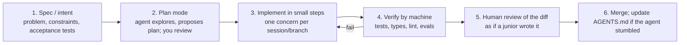

# AI-assisted development: coding agents, AGENTS.md, skills

!!! abstract "At a glance"
    **Priority:** P0 · **Complexity:** 2/5 · **Est. time:** 2 h · **Phase:** 1 · **Prereqs:** [Prompting & structured outputs](prompting-structured-outputs.md), [Context engineering](context-engineering.md)
    **You're done when:** your repositories (including this study planner and the capstone) have a maintained `AGENTS.md`, a verification loop (tests, lint, type-check) the agent runs itself, at least one reusable skill and one hook; and you can describe your personal workflow (plan → implement → verify → review) and its guardrails.

## Why it matters

You're studying to build agentic systems *and* you are the first customer of agentic tooling: coding agents (Claude Code, Codex CLI, GitHub Copilot agent mode, Cursor, Gemini CLI, and others) write a large share of new code at many companies. Engineers who are systematically effective with them — spec-first, verification-driven, small diffs, reviewed — ship several times faster; those who "vibe code" ship faster *and* accumulate defects and security holes. Evidence is mixed and context-dependent: METR's 2025 randomised study found experienced open-source maintainers were ~19% *slower* with early-2025 tools while believing they were faster; the DORA 2025 report found AI amplifies existing team strengths and weaknesses. As a Staff engineer you are also asked to set team policy ([AI-era leadership](../staff-skills/ai-era-leadership.md)).

Also: this is the most direct application of [context engineering](context-engineering.md) you'll do daily. `AGENTS.md` is a context file; skills are progressive disclosure; hooks are deterministic guardrails.

## Core concepts

### The tool landscape (as of Sept 2026)

| Tool | Form | Notes |
|---|---|---|
| **Claude Code** | Terminal/IDE/desktop agent; Agent SDK for embedding | `CLAUDE.md`, subagents, skills, hooks, slash commands, MCP, plan mode, permission modes |
| **OpenAI Codex** (CLI, IDE, cloud) | Terminal + cloud sandboxes | Reads `AGENTS.md`; cloud tasks in isolated containers |
| **GitHub Copilot** (agent mode, coding agent) | IDE + PR-based agent | Custom instructions, MCP, runs in Actions sandbox |
| **Cursor / Windsurf / Zed / JetBrains AI** | AI-native IDEs | Rules files, agent modes |
| **Gemini CLI, Amp, Aider, Cline, OpenHands** | CLI/open-source agents | Model-flexible options |

They converge on the same primitives: a **loop** (read → plan → edit → run → observe), **tools** (file, shell, search, web), **project memory files**, **extensibility** (MCP, skills, hooks, subagents), and **permissions**.

### AGENTS.md: the cross-tool context file

`AGENTS.md` (agents.md, stewarded under the Linux Foundation's Agentic AI Foundation) is a plain Markdown "README for agents" read by most coding agents; Claude Code additionally reads `CLAUDE.md` (which can import/point to `AGENTS.md`). Nested files apply to subdirectories; the closest wins.

What goes in it (keep it short — context is budgeted, and it's loaded every session):

1. **Commands**: exact install/build/test/lint/typecheck commands (`uv run pytest -q`, `uv run mkdocs build --strict`).
2. **Architecture map**: where things live and why (one screen).
3. **Conventions that aren't obvious from code**: error-handling style, naming, "never edit generated files", "tests in `tests/` mirror `src/`".
4. **Definition of done**: what the agent must run before saying it's finished.
5. **Boundaries**: what needs approval (migrations, deleting data, touching prod config), secrets rules, files off-limits.
6. **Gotchas**: things that burned you once.

What doesn't: long style guides (use the linter), tutorials, anything that's discoverable by reading code, aspirational rules the codebase doesn't follow. Rule of thumb: **if the agent would get it right without the line, delete the line**; prune when the model improves. Treat it as code: review changes, keep it under ~150-300 lines, and update it when the agent repeats a mistake (that's the feedback loop).

```markdown
# AGENTS.md (example for the capstone repo)
## Commands
- Setup: `uv sync` · Test: `uv run pytest -q` · Types: `uv run ty check` · Lint: `uv run ruff check --fix && uv run ruff format`
- Evals (slow, ask first): `uv run python -m evals.run --suite smoke`
## Architecture
- `orchestrator/` LangGraph graph; `agents/` Pydantic AI sub-agents; `mcp_servers/ops_tools/` Python MCP server; `java/runbooks-mcp/` Spring AI MCP server
## Conventions
- Pydantic models at every boundary; no bare dicts across module edges. Async everywhere in I/O paths.
- All LLM calls go through the LiteLLM alias in `config/models.yml`; never hard-code provider model IDs.
## Definition of done
- tests + types + lint pass; new behaviour has a test; prompt changes include an eval delta.
## Boundaries
- Never edit `docs/**/generated/*`; ask before changing `docker-compose.yml` ports or DB migrations; never print `.env` values.
```

### Skills: progressive disclosure for procedures

**Agent Skills** (an open format supported by Claude Code and adopted by other tools; agentskills.io) package a procedure as a folder: `SKILL.md` (name, description, instructions) plus optional scripts/reference files. Only the name+description sit in context; the full instructions and resources load **on demand** when relevant. That's context engineering applied to *procedures*: e.g. a `write-topic-page` skill that encodes your page template, or `release-checklist` that runs specific commands. Use skills for repeatable multi-step workflows; use `AGENTS.md` for always-true facts; use hooks for things that must *always* happen.

### Hooks and deterministic guardrails

Instructions are suggestions; **hooks are guarantees**. Claude Code hooks run shell commands/scripts at lifecycle events (`PreToolUse`, `PostToolUse`, `UserPromptSubmit`, `Stop`, …), e.g.:

- `PostToolUse` on file edits → run formatter/linter; feed failures back.
- `PreToolUse` on `Bash` → block `rm -rf`, `git push --force`, commands touching production contexts.
- `Stop` → refuse to finish unless tests pass.

Similar mechanisms exist elsewhere (Copilot instructions + Actions checks, pre-commit hooks, CI). **Push rules that must never be violated out of the prompt and into code.**

### A workflow that works



Principles:

- **Give the agent a way to verify itself.** A fast test/lint/type-check loop is the single highest-leverage investment; without it you're the test suite.
- **Small, reviewable diffs.** Cap task size; commit often; use branches/worktrees for parallel agents.
- **Plan before code** for anything non-trivial; steer early where it's cheap.
- **Fresh context per task.** Long sessions degrade (context rot); use `/clear`/new sessions and subagents to isolate exploration ([Context engineering](context-engineering.md)).
- **Spec-driven development** (e.g. GitHub Spec Kit): write requirements/acceptance criteria as durable artifacts; the agent implements against them.
- **TDD with agents**: write (or have the agent write, then review) failing tests first; agents are excellent at "make this test pass" and bad at knowing what's *right*.
- **Review for what agents get wrong**: plausible-but-wrong logic, over-engineering, duplicated helpers, swallowed errors, hallucinated APIs/packages ("slopsquatting" — verify dependencies exist and are the intended ones), disabled tests to go green, security issues (injection, secrets, authz gaps).

### Risks and controls

| Risk | Control |
|---|---|
| Prompt injection via repo content, issues, web pages, MCP tools (the agent has your shell) | Least-privilege permissions; sandbox/devcontainer; no long-lived prod creds in the environment; review tool calls; allow-list network |
| Secrets leakage to model providers/logs | `.env` denylist, secret scanning, enterprise data-retention settings |
| Supply chain (hallucinated/malicious packages, unreviewed MCP servers/skills) | Lockfiles, dependency review, approved MCP registry, treat skills/plugins as code |
| Over-trust / skill atrophy | Review discipline; write core design yourself; pair-review AI diffs |
| IP/licensing | Org policy on tools and code-similarity filters |
| Quality drift in AI-heavy codebases | CI gates, coverage/mutation checks, architecture fitness functions ([Evolutionary architecture](../architecture/evolutionary-architecture.md)) |
| Permission fatigue → `--dangerously-skip-permissions` everywhere | Use scoped allow-lists and sandboxes instead of blanket bypass |

### Using coding agents *for this learning plan*

- Have the agent quiz you from topic pages; use it as a rubber duck for the L3/L4 questions (answer first, then ask for critique).
- Let it scaffold labs, but write the core mechanism (e.g. the LangGraph state machine) yourself first — the learning is in the struggle.
- Keep the study-planner repo's `AGENTS.md` (this repo already has one) accurate: it is the operating protocol for the scheduled agents.

### Senior-level nuance

- **Measure, don't feel.** Track cycle time, review time, escaped defects, and rework for AI-assisted PRs versus baseline; perceived speed-up is unreliable (METR).
- **Bottleneck shifts to review and verification.** If agents 3x code output, review capacity, test suites and CI speed become the constraint. Invest there.
- **Agents amplify architecture.** Clear module boundaries, good tests and typed interfaces make agents dramatically better; a big ball of mud makes them worse.
- **Context files rot.** Stale `AGENTS.md` is worse than none; own it in CODEOWNERS.
- **Codebase-as-prompt**: naming, small files and consistent patterns are now a productivity feature for machines as well as humans.

## Resources

| Resource | Type | Why this one | Level | Cost |
|---|---|---|---|---|
| [AGENTS.md](https://agents.md/) | docs | The cross-tool standard: format, examples, adopters | beginner | free |
| [Claude Code overview](https://code.claude.com/docs/en/overview) | docs | Memory files, hooks, subagents, skills, permissions | intermediate | free |
| [Anthropic: Claude Code best practices](https://www.anthropic.com/engineering/claude-code-best-practices) | article | Plan/implement/verify workflows from the tool's authors | intermediate | free |
| [Anthropic: Equipping agents with Agent Skills](https://www.anthropic.com/engineering/equipping-agents-for-the-real-world-with-agent-skills) | article | Progressive disclosure design of skills | intermediate | free |
| [Agent Skills format](https://agentskills.io) :gem: | docs | Open spec for portable skills | intermediate | free |
| [OpenAI Codex repo](https://github.com/openai/codex) | docs | Open-source CLI agent; reads AGENTS.md | intermediate | free |
| [GitHub Spec Kit](https://github.com/github/spec-kit) :gem: | docs | Spec-driven development toolkit for agents | intermediate | free |
| [METR: developer productivity study (2025)](https://metr.org/blog/2025-07-10-early-2025-ai-experienced-os-dev-study/) | article | Sobering measured result; how to think about productivity claims | intermediate | free |
| [DORA 2025 report](https://dora.dev/research/2025/dora-report/) | article | Org-level evidence on AI amplifying team capabilities | intermediate | free |
| [Martin Fowler: exploring generative AI](https://martinfowler.com/articles/exploring-gen-ai.html) :gem: | article | Thoughtworks practitioners' running notes on agents in engineering | intermediate | free |

## Hands-on lab

**Goal (90 min):** make one repo agent-ready and measure the difference.

1. **AGENTS.md** (20 min): write it for the capstone repo (commands, architecture, conventions, definition of done, boundaries). Keep under 150 lines. Add a `CLAUDE.md` that says "See AGENTS.md" if you use Claude Code.
2. **Verification loop** (15 min): ensure one command runs tests + types + lint in < 60 s (`make check`); document it in AGENTS.md.
3. **Hook** (15 min): add a `PostToolUse` hook that runs `ruff format` on edited Python files and a `PreToolUse` hook blocking `git push --force` and edits to `.env`.
4. **Skill** (20 min): create `add-mcp-tool` skill: steps to add a tool to the Python MCP server (schema, description rules, tests, register, update docs), with a template file.
5. **A/B** (20 min): implement the same small feature (e.g. a new `list_delayed` filter) twice — once with a bare prompt, once with AGENTS.md + skill + hooks + plan mode. Compare: iterations, tests passing on first try, diff size, review comments you'd leave.

**Expected output:** the four artifacts committed, plus a short table showing the difference in first-pass success and review burden.

## Questions

### L1 — Recall

??? question "Q1. What belongs in AGENTS.md and what doesn't?"
    ??? success "Answer"
        Belongs: exact commands, architecture map, non-obvious conventions, definition of done, boundaries/approvals, known gotchas. Doesn't: style rules the linter enforces, tutorials, things discoverable from code, aspirations not followed by the codebase, secrets. Keep it short and maintained.

??? question "Q2. How do skills differ from AGENTS.md and hooks?"
    ??? success "Answer"
        AGENTS.md is always-loaded context of stable facts. Skills are on-demand procedures (only name/description in context until relevant; full instructions/resources load when used). Hooks are deterministic code executed at lifecycle events (guarantees, not suggestions).

??? question "Q3. What is 'slopsquatting'?"
    ??? success "Answer"
        Attackers register package names that LLMs commonly hallucinate; if an agent (or developer) installs the suggested nonexistent package, malicious code is executed. Mitigate with lockfiles, dependency review, allow-lists/private registries and verifying packages before install.

### L2 — Apply

??? question "Q4. The agent keeps running the wrong test command and editing generated files. What do you change?"
    ??? success "Answer"
        Add exact commands and 'never edit generated/**' to AGENTS.md; add a `PreToolUse` hook denying edits to generated paths (deterministic); ensure a single `make check` entry point; add a note in the definition of done. Re-test; if it recurs, tighten permissions.

??? question "Q5. You want the agent to run tests automatically but never run destructive shell commands. Design the permission setup."
    ??? success "Answer"
        Allow-list specific commands (`uv run pytest`, `ruff`, `git status/diff/add/commit`), deny/ask for others; a `PreToolUse` Bash hook blocking patterns (`rm -rf`, `git push --force`, `curl | sh`, prod kube contexts); run in a devcontainer/sandbox without production credentials; avoid blanket bypass modes.

??? question "Q6. A 900-line AI-generated PR passes CI. What do you check in review?"
    ??? success "Answer"
        Does it solve the stated problem (spec/acceptance)? Tests actually assert behaviour (not tautologies or disabled tests)? Hallucinated APIs/dependencies? Error handling and edge cases; authorisation and input validation; duplicated abstractions; unnecessary complexity; performance in loops/queries; secrets; consistency with architecture. Request splitting into smaller PRs next time.

### L3 — Design & trade-offs

??? question "Q7. Team of 40: allow coding agents with full autonomy, or restrict to autocomplete? Propose a policy."
    ??? success "Answer"
        Tiered autonomy by risk: autocomplete/chat everywhere; agent mode on branches with human-reviewed PRs in sandboxes; no production credentials or write access to protected branches; stricter for security-sensitive modules (CODEOWNERS review). Provide approved tools, enterprise data settings, shared AGENTS.md/skills, MCP registry, training, and metrics (cycle time, defect escape, review load). Reassess quarterly with data.

??? question "Q8. Spec-driven development vs conversational prompting for a large feature. Trade-offs?"
    ??? success "Answer"
        Spec-driven: durable intent, reviewable by humans before code, parallelisable, consistent; costs upfront effort and can be over-formal for small changes. Conversational: fast for exploration and small tasks, but intent is lost, drift and context rot in long sessions. Use conversational for exploration/spikes, then distil into a spec/plan and implement in fresh, scoped sessions with tests as acceptance criteria.

??? question "Q9. Where should 'always run the linter after edits' live: AGENTS.md, a skill, or a hook?"
    ??? success "Answer"
        A hook: it's deterministic and must always happen; instructions may be ignored under context pressure. AGENTS.md can document that it happens; CI is the backstop.

### L4 — Staff-level ambiguity

??? question "Q10. Leadership claims 'AI makes engineers 2x productive, so cut the hiring plan by half'. How do you respond?"
    ??? success "Answer"
        Ask for evidence at the outcome level rather than activity: cycle time, deployment frequency, change failure rate, defect escapes, review load, onboarding time; note studies showing mixed results and perceived-vs-measured gaps (METR), and DORA's finding that AI amplifies existing strengths/weaknesses. Propose a measured pilot with baselines, invest in bottlenecks (review, tests, CI), and plan capacity on measured gains with a buffer. Highlight risks: quality debt, security, skill development for juniors.

??? question "Q11. Design the rollout of AI coding agents across engineering with security and quality controls."
    ??? success "Answer"
        Phase 1: pilot teams with sandboxed setups, shared AGENTS.md/skills templates, metrics baselines. Phase 2: paved road (approved tools/models via gateway, MCP registry, secret scanning, devcontainers, CI gates like tests/coverage/SAST/dependency review). Phase 3: scale with training, champions, policy on autonomy tiers, incident process (prompt-injection events, leaked secrets), and ongoing measurement. Governance via architecture/security guild; review quarterly as tools change.

## Real-world use cases

- **Legacy modernization** ([Legacy modernization](../architecture/legacy-modernization.md)): agents generate characterization tests and perform mechanical migrations (Java 17 → 25, Spring Boot 3 → 4) with human review.
- **Platform teams**: skills that encode golden-path scaffolding (new service with observability, CI, MCP server template).
- **Incident response**: agents draft postmortem timelines from traces/logs with human verification.
- **Documentation and study tooling**: scheduled agents maintain digests and question banks (like this repo) under a strict AGENTS.md protocol.

## Pitfalls & anti-patterns

- Huge, stale AGENTS.md files copied from blog posts.
- No fast verification loop; the human becomes the test runner.
- Giant multi-concern sessions and PRs.
- Blanket permission bypass on a machine with production credentials.
- Trusting green CI as proof of correctness when tests were written by the same agent without review.
- Installing unreviewed MCP servers/skills.
- Measuring lines of code generated as productivity.

## Checklist

- [ ] I can explain AGENTS.md vs skills vs hooks vs subagents and when to use each
- [ ] The capstone repo has AGENTS.md, a one-command check, a hook, and a skill
- [ ] I ran the A/B and know my first-pass success rate
- [ ] I can state a team policy for agent autonomy and its controls
- [ ] I answered all L3 questions out loud in < 3 min each
