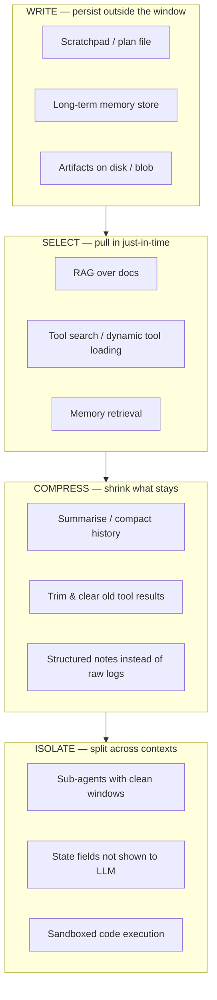

# Context engineering

!!! abstract "At a glance"
    **Priority:** P0 · **Complexity:** 3/5 · **Est. time:** 3 h · **Phase:** 1 · **Prereqs:** [LLM fundamentals](llm-fundamentals.md), [Prompting & structured outputs](prompting-structured-outputs.md)
    **You're done when:** you can design a per-step context budget for a long-running agent (what goes in, in what order, what gets compacted or offloaded) and show with a measurement that it beats "append everything" on accuracy and cost.

## Why it matters

"Prompt engineering" optimises one string. **Context engineering** is the discipline of deciding, *at every step of an agent loop*, which tokens the model sees: instructions, tool definitions, retrieved documents, memory, prior tool results, and conversation history. Anthropic describes it as finding "the smallest possible set of high-signal tokens" for the next step; the phrase was popularised in mid-2025 and is now standard vocabulary.

It matters because agents fail far more often from **bad context** than from bad models: stale tool results, 40 irrelevant tools, a runbook from the wrong service, or a transcript so long the model forgets the user's actual question. And context is also your **cost and latency** lever (see [LLM fundamentals](llm-fundamentals.md)). In system-design interviews for agent platforms, "how do you manage context over a 50-step task?" is a standard probe.

## Core concepts

### Context is a finite attention budget

Even with 200k–1M token windows, effective recall degrades:

- **Lost in the middle** (Liu et al., 2023): information in the middle of long contexts is used less reliably than at the start or end.
- **Context rot** (Chroma research, 2025): performance on simple retrieval-and-reasoning tasks degrades as input length grows, even far below the window limit, and distractors (similar-but-wrong content) hurt most.
- Every token also costs money and prefill time; transcripts re-sent every step grow cost quadratically without caching.

So the design goal is not "fit more" but **maximise signal per token at each step**.

### The four operations (write, select, compress, isolate)

A useful taxonomy (LangChain's context-engineering write-up, echoed by Anthropic and Manus):

| Operation | Mechanism | Example in the Ops Copilot |
|---|---|---|
| **Write** | Persist info outside the context window | Agent writes `investigation.md` (hypotheses, evidence, ruled-out causes) to state/disk |
| **Select** | Retrieve only what the next step needs | Retrieve 5 runbook chunks for `vessel-tracker`, not all runbooks; load only the tools relevant to the detected intent |
| **Compress** | Summarise or prune | Replace a 6k-token log dump with a 200-token aggregate after it's been analysed; compact history at 70% of budget |
| **Isolate** | Separate contexts | A log-analysis sub-agent reads 50k tokens of logs and returns a 300-token finding to the orchestrator |

### Anatomy and ordering of a step's context

Order for **cache efficiency and attention**:

1. System instructions (stable) — role, goals, policies, output rules.
2. Tool definitions (stable per agent/intent).
3. Static domain knowledge / few-shots (stable).
4. *Cache breakpoint.*
5. Long-term memory & retrieved documents (per task).
6. Working state: plan, scratchpad summary, key facts so far.
7. Recent conversation/tool turns (last N verbatim).
8. The current question / next-step instruction (end — recency helps).

**Restating the goal at the end** of long contexts (Manus calls it "recitation" — e.g. keeping a todo list updated at the tail) measurably keeps agents on track over long loops.

### Tool results: the silent context killer

In agent loops, tool outputs dominate context growth. Rules of thumb:

- **Tools should return decisions-ready data, not raw dumps**: aggregates, top-k, and IDs to fetch more. A `query_logs` tool returning 20 grouped error signatures (≈ 500 tokens) beats 2,000 raw lines (≈ 60k tokens). See [tool calling](tool-calling.md).
- **Paginate and truncate with a hint**: "Showing 20 of 1,340 matches; refine with `pattern=`".
- **Clear stale tool results** once they've been used: replace the body with a stub ("[log query result summarised: 3 error signatures, top = TimeoutError in booking-api]"). Several providers now offer server-side context editing/clearing for old tool results — check your provider's docs.
- **Keep errors in context** (at least briefly): models learn from seeing a failed call, and hiding failures leads to repeated mistakes.

### Compaction strategies

| Strategy | How | Pros | Cons |
|---|---|---|---|
| Sliding window | Keep last N turns | Trivial, cache-friendly-ish | Loses early goals/constraints |
| Summarise-and-replace | At threshold (e.g. 70–80% of budget), LLM summarises older turns into a structured note | Preserves key facts | Summary loss/drift; costs a call; breaks cache prefix once |
| Structured state | Maintain explicit fields (goal, facts, open questions, decisions) updated each step; send state not transcript | Precise, testable | Needs schema design; more code |
| Offload to files/memory | Write artefacts; keep references | Unbounded working memory | Requires retrieval discipline |
| Sub-agent isolation | Delegate heavy reading | Orchestrator stays small | Coordination overhead, information loss at boundary |

**Senior nuance:** compaction breaks prefix caching at the compaction point — do it rarely and in big chunks (e.g. when crossing a threshold), not every turn. And keep the *original* data retrievable (by ID) so a summary error can be corrected.

### Tool overload and dynamic tool selection

Every tool definition costs tokens (often 100–500 each) and, more importantly, **accuracy**: tool-selection errors rise noticeably as you go past ~20–30 similar tools. Options: group tools per intent/sub-agent; **tool search** (the model queries a tool index and only matching definitions are loaded — supported natively by some providers and frameworks as of 2026, e.g. Pydantic AI's `ToolSearch` capability); namespacing and crisp descriptions; or code-execution patterns where the model writes code against an API instead of calling dozens of tools.

### Memory vs context

- **Short-term (thread) memory** = the working context of the current task; in LangGraph it's the checkpointed state (see [LangGraph](langgraph.md)).
- **Long-term memory** = facts persisted across sessions (user preferences, service ownership, prior incident learnings), retrieved selectively — see [memory systems](memory-systems.md).
- Memory is just another *select* source; the same budget discipline applies. Unfiltered memory injection is a common cause of weird, stale behaviour.

### A context budget, concretely

For the copilot orchestrator (target ≤ 24k tokens per step, which keeps p50 TTFT low and quality high):

| Slot | Budget | Policy |
|---|---|---|
| System + policies | 2k | Static, cached |
| Tool definitions | 3k | ≤ 12 tools; per-intent subsets |
| Retrieved runbooks | 4k | Top-5 reranked chunks, dedup, with source IDs |
| Working state (plan, facts) | 2k | Structured, updated each step |
| Recent turns + tool results | 10k | Last 6 turns verbatim; older → summarised |
| Current instruction + goal recitation | 1k | Always last |
| Headroom | 2k | For the unexpected |

Enforce it in code — a `ContextBuilder` that counts tokens per slot and applies the policy — not with hope.

### What juniors miss

- Treating the transcript as the state. The *state* should be structured; the transcript is a log.
- Measuring nothing: no per-slot token metrics, so no idea why cost doubled.
- Summarising too eagerly (loses precise identifiers like order IDs, timestamps).
- Loading every MCP server's tools into every agent.
- Assuming a bigger window fixes an agent that "forgets".

## Resources

| Resource | Type | Why this one | Level | Cost |
|---|---|---|---|---|
| [Anthropic — Effective context engineering for AI agents](https://www.anthropic.com/engineering/effective-context-engineering-for-ai-agents) | article | The canonical framing: attention budget, compaction, note-taking, sub-agents | intermediate | free |
| [Manus — Context Engineering for AI Agents: Lessons from Building Manus](https://manus.im/blog/Context-Engineering-for-AI-Agents-Lessons-from-Building-Manus) :gem: | article | Hard-won production tricks: KV-cache hit rate as the key metric, recitation, keeping errors, file system as memory | advanced | free |
| [LangChain — Context engineering for agents](https://blog.langchain.com/context-engineering-for-agents/) | article | The write/select/compress/isolate taxonomy with LangGraph examples | intermediate | free |
| [Drew Breunig — How Long Contexts Fail](https://www.dbreunig.com/2025/06/22/how-contexts-fail-and-how-to-fix-them.html) :gem: | article | Names the failure modes: poisoning, distraction, confusion, clash — great diagnostic vocabulary | intermediate | free |
| [Chroma — Context Rot](https://research.trychroma.com/context-rot) :gem: | article | Empirical evidence that performance degrades with input length and distractors | advanced | free |
| [Lost in the Middle (Liu et al.)](https://arxiv.org/abs/2307.03172) | paper | Classic result on positional recall in long contexts | advanced | free |
| [12-Factor Agents (HumanLayer)](https://github.com/humanlayer/12-factor-agents) :gem: | article | "Own your context window" and other principles for production agents | intermediate | free |

## Hands-on lab

**Goal:** build the capstone's `ContextBuilder` and prove it beats naive history on a long investigation. (90–120 min)

1. Create a synthetic 30-step investigation transcript for an incident ("booking-api latency spike") — mix of user turns, tool calls, and large tool results (log dumps of 3–8k tokens, metric series, runbook chunks). Embed 5 **key facts** early (e.g. "deploy `a1b2c3` at 14:02 UTC", "only region eu-west affected").
2. Implement two strategies:
    - `naive`: append everything.
    - `engineered`: slot budgets from the table above; tool results older than 3 turns replaced with 1–2 line stubs; structured `InvestigationState` (Pydantic model: `goal`, `facts: list[str]`, `hypotheses`, `ruled_out`, `next_step`) updated after each tool result by a cheap model; goal recitation at the end.
3. Count tokens per slot with your provider's token counter; log a per-step table.
4. At steps 10, 20, and 30 ask 5 probe questions ("Which region is affected?", "Which deploy preceded the spike?"). Score exact-match against the key facts.
5. Record input tokens per step, total cost, and probe accuracy for both strategies.

*Expected:* naive grows to 100k+ tokens by step 30 with probe accuracy dropping (especially for facts in the middle); engineered stays under ~20k tokens with stable accuracy. Keep `ContextBuilder` — the [LangGraph](langgraph.md) lab uses it in the orchestrator's state-to-prompt function.

## Questions

### L1 — Recall

??? question "Q1. Define context engineering and how it differs from prompt engineering."
    ??? success "Answer"
        Prompt engineering is crafting instructions and examples for a (mostly single) call. Context engineering is the ongoing, programmatic curation of *everything* in the window at each step of an agentic system — instructions, tools, retrieved knowledge, memory, tool results, history — to maximise the signal for the next decision under a finite attention and cost budget. It's a systems problem: state management, retrieval, compaction and isolation, measured with evals.

??? question "Q2. What are the four context operations (write, select, compress, isolate)? Give one example of each."
    ??? success "Answer"
        **Write:** persist outside the window (agent keeps a plan/notes file or state field). **Select:** retrieve just-in-time (RAG top-5 runbook chunks, dynamic tool loading). **Compress:** summarise or trim (replace old tool results with stubs; summarise history at a threshold). **Isolate:** split into separate windows (a sub-agent reads 50k tokens of logs and returns a 300-token finding; state fields hidden from the LLM).

??? question "Q3. What is 'lost in the middle' / context rot, and what design responses follow from it?"
    ??? success "Answer"
        Empirically, LLMs use information at the start and end of long contexts more reliably than in the middle, and overall performance degrades as context length and distractor content grow, well below the advertised window. Responses: keep contexts short and relevant (retrieval, pruning), put critical instructions at the start and restate the goal/current task at the end, deduplicate and remove near-miss distractors, and prefer structured state over raw transcripts.

### L2 — Apply

??? question "Q4. The copilot's per-step input grows from 8k to 95k tokens over a 25-step investigation. Tool results are 80% of it. Give a concrete plan."
    ??? success "Answer"
        (1) Redesign the heavy tools to return aggregates/top-k with pagination hints (e.g. grouped error signatures, p50/p95 per minute instead of raw points). (2) After a tool result has been consumed (the next assistant turn references it), replace it with a stub plus an ID to re-fetch. (3) Maintain a structured `InvestigationState` that captures the facts extracted from results. (4) Keep the last ~3 tool turns verbatim. (5) If still over budget, delegate log reading to a sub-agent. Target: ≤ 20–25k per step. Validate with a probe-question eval and track per-slot token metrics in traces.

??? question "Q5. Where do you put a cache breakpoint in the copilot's prompt, and what content must never appear before it?"
    ??? success "Answer"
        After the stable prefix: system instructions, tool definitions, and static few-shots/domain definitions. Anything varying per request or per step must come after: timestamps, user identity, retrieved documents, working state, conversation, tool results. Also keep tool definition *order* stable (sorting them deterministically) — reordering changes the prefix. Monitor the cache-read token ratio; a drop signals someone introduced volatility into the prefix.

??? question "Q6. An agent has access to 85 tools from 6 MCP servers and picks the wrong one 18% of the time. What do you do?"
    ??? success "Answer"
        Reduce the choice set per step: route by intent to a sub-agent/tool group (≤ 10–15 tools each), or enable tool search/deferred loading so only relevant definitions are in context. Clean up descriptions (distinct names, when-to-use/when-not-to-use, examples), merge overlapping tools, namespace by server. Then run an eval of tool-selection accuracy on labelled tasks before/after. Expect both accuracy and token cost to improve markedly.

### L3 — Design & trade-offs

??? question "Q7. Summarise-and-replace compaction vs structured state vs sub-agent isolation for a 2-hour incident investigation. Choose and justify."
    ??? success "Answer"
        Use a combination with **structured state as the backbone**: an explicit schema (goal, facts with sources, hypotheses, ruled-out, decisions, next step) updated each step is precise, testable, and survives any number of steps; it also makes HITL review easy. Use **sub-agent isolation** for heavy reading (logs, long docs) so the orchestrator never sees raw bulk. Use **summarisation** only as a safety net for the conversational remainder, triggered at a threshold (e.g. 75% of budget) and preserving identifiers. Pure summarisation drifts and loses exact IDs; pure sub-agents lose cross-cutting insight; pure structured state requires good schema design but is the most debuggable. Keep raw artefacts addressable by ID so any summary can be verified.

??? question "Q8. Would you use a 1M-token context model to avoid building memory/retrieval for a support agent with 3 years of customer history? Trade-offs?"
    ??? success "Answer"
        No as a default. Costs: each call pays for massive prefill (caching helps only if the prefix is stable, and history changes), latency of seconds, and degraded recall/distraction from irrelevant old tickets. Also privacy (minimisation), access control, and inability to cite specific records. Better: long-term memory store with retrieval (recent summary + top-k relevant past interactions + structured profile), with long-context as a fallback for deep-dive tasks on one customer. Validate with an eval comparing both on real questions: accuracy, cost/query, p95.

??? question "Q9. Should old tool errors be removed from the context to keep it clean?"
    ??? success "Answer"
        Mostly no, at least in the short term. Seeing a failed call and its error lets the model update its beliefs and avoid repeating the same mistake — removing them causes loops of identical failing calls. Keep recent errors verbatim; after the agent has recovered, you can compact them into a note ("`query_logs` requires ISO timestamps; fixed"). Do remove errors that contain sensitive data or massive stack traces (summarise them).

### L4 — Staff-level ambiguity

??? question "Q10. Teams keep adding tools and instructions to a shared 'platform agent' and quality is sliding. Nobody owns the context. What do you propose?"
    ??? success "Answer"
        Treat the context window as a **shared, budgeted resource with an owner**. Establish: a context budget per slot with CI checks (token counts of system prompt and tool definitions); a tool registry with required metadata (owner, description quality, eval cases) and review; decomposition into intent-specific sub-agents so teams own their slice; tool search/deferred loading for the long tail; and a shared eval suite that every change must pass (tool-selection accuracy, task success, cost/step). Publish a dashboard of tokens per slot and quality over time. Socialise with an RFC framing it as "platform capacity", like DB connection pools.

??? question "Q11. How would you explain to executives why the 'smarter' agent with more context performs worse, and what you'll measure to fix it?"
    ??? success "Answer"
        Analogy: giving an analyst every document in the building doesn't make them faster; it buries the relevant page. Models have a limited attention budget and are distracted by similar-but-irrelevant content; more context also costs more and adds latency. Plan: measure task success rate, cost per task, and p95 latency on a fixed eval set; experiment with curated context (retrieval, compaction, sub-agents); report the before/after. Commit to a target (e.g. +10pp success at −40% cost) and a date.

## Real-world use cases

- **Incident investigation copilot:** structured investigation state + log sub-agent keeps the orchestrator at ~15k tokens across 40 steps.
- **Coding agents** (Claude Code, Codex): plan/todo files, compaction at thresholds, sub-agents for search, and AGENTS.md files as selected persistent context — see [AI-assisted development](ai-assisted-development.md).
- **Freight quote assistant:** customer profile and contract terms selected from memory per request instead of full history; tariff tables queried via tools.
- **Research agents:** notes written to files, only summaries of each source kept in the orchestrator.

## Pitfalls & anti-patterns

- Transcript-as-state with unbounded growth.
- Volatile data in the prefix → cache miss rate 100%.
- Tools returning raw dumps; no pagination.
- Compaction every turn (breaks caching, compounds summary errors).
- Blind long-term-memory injection of stale facts.
- One mega-agent with every tool from every MCP server.
- No per-slot token telemetry.

## Checklist

- [ ] I can explain write/select/compress/isolate with examples from my own system
- [ ] I implemented a `ContextBuilder` with slot budgets and token accounting
- [ ] I measured naive vs engineered context on probe accuracy and cost
- [ ] I can design tool outputs that are decision-ready and paginated
- [ ] I answered all L3 questions out loud in < 3 min each
