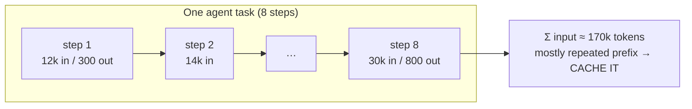

# Cost & latency optimization: caching, batching, streaming

!!! abstract "At a glance"
    **Priority:** P0 · **Complexity:** 3/5 · **Est. time:** 3 h · **Phase:** 4 · **Prereqs:** [LLM fundamentals](llm-fundamentals.md), [Context engineering](context-engineering.md), [LLM observability](llm-observability.md), [Capacity & cost planning](../ai-system-design/capacity-cost-planning.md)
    **You're done when:** you can build a per-request cost model for the capstone from traces, have cut cost ≥40% and p95 time-to-first-token ≥30% using prompt caching, routing, streaming and batching, and can explain each lever's mechanism and failure mode.

## Why it matters

Agentic systems are expensive by construction: every loop iteration re-sends the growing context, tool definitions and system prompt. A 12-step agent with a 20k-token context processes ~240k+ input tokens per task. At scale, LLM spend becomes a top-3 cloud line item and latency becomes the main UX complaint. Finance asks "why did the bill triple?"; users ask "why does it take 40 seconds?".

The Staff-level skill is **unit economics**: cost and latency per *successful task*, broken down by component, with levers ranked by impact and risk. Interviewers love "your LLM bill is $400k/month — cut it in half without hurting quality."

## Core concepts

### Where the money and time go

Cost per call ≈ `input_tokens × p_in + cached_input_tokens × p_cache_read + output_tokens × p_out` (+ cache writes, tool fees, reasoning tokens billed as output).

Latency per call ≈ **queueing + prefill (∝ input tokens, fast, parallel) + decode (∝ output tokens, sequential)**. Rules of thumb (vary by model/provider, as of 2026):

- Output tokens cost **3-8x** input tokens and dominate latency: decode at ~50-150 tokens/s for hosted frontier models means 1,000 output tokens ≈ 7-20 s.
- Prefill is much faster per token, but at 100k+ tokens TTFT becomes seconds.
- **Reasoning models** emit hidden thinking tokens billed as output — a "short answer" can cost 5k tokens of reasoning. Control with effort/thinking-budget parameters.
- For agents: **cost ≈ Σ over steps of (full context each step)** → quadratic-ish growth with steps unless you compact.



### The lever menu (ranked by typical ROI)

| # | Lever | Mechanism | Typical saving | Risk / caveat |
|---|---|---|---|---|
| 1 | **Measure first** | Per-span tokens/cost in traces; cost per successful task | — | Without it, you optimize the wrong thing |
| 2 | **Prompt (prefix) caching** | Provider reuses KV cache for an identical prompt prefix | Cached input billed at ~10% (Anthropic reads 0.1x; writes 1.25x for 5-min TTL, 2x for 1-hour); OpenAI automatic for prompts ≥1,024 tokens at a discount; TTFT drops substantially | Only exact prefix matches; any change early in the prompt (timestamp, user name, tool order) busts it |
| 3 | **Model routing / cascades** | Cheap model for easy requests, frontier for hard ([Routing](model-routing-gateways.md)) | 30-70% | Quality regressions on misrouted requests; needs evals |
| 4 | **Context diet** | Trim tool results, fewer/leaner tool definitions, compaction, retrieve less but better | 20-60% of input | Dropping needed context hurts accuracy |
| 5 | **Output diet** | Concise formats, structured outputs, `max_tokens`, lower reasoning effort | Big latency wins | Too terse hurts UX/quality |
| 6 | **Batch APIs** | Async bulk processing (OpenAI/Anthropic batch: ~50% discount, results within 24 h) | 50% on offline work | Not for interactive paths |
| 7 | **Semantic / exact response caching** | Return stored answers for repeated/similar queries | High for FAQ-like traffic | Staleness, wrong-answer reuse, tenant leakage |
| 8 | **Parallelism** | Parallel tool calls, parallel sub-agents, speculative execution | Latency | Cost up; rate limits |
| 9 | **Self-hosting / fine-tuning small models** | Own GPUs, distilled models ([Inference serving](inference-serving.md), [Fine-tuning](fine-tuning.md)) | Can be large at high volume | Ops burden; utilisation risk |

### Prompt caching done right

Structure every prompt **stable → volatile**:

```text
[1] System prompt & policies           (static for weeks)      ← cache breakpoint
[2] Tool definitions (sorted, stable)  (static per release)   ← cache breakpoint
[3] Retrieved docs / few-shot          (semi-static per task)
[4] Conversation history               (grows, append-only)   ← cache breakpoint (last turn)
[5] Current user message + timestamps  (volatile)
```

- Anthropic: explicit `cache_control` breakpoints (up to 4), minimum cacheable length per model, 5-min default TTL (1-hour option). OpenAI: automatic prefix caching; use `prompt_cache_key` to improve routing locality. Other providers vary — check docs.
- Keep history **append-only** — editing old turns (e.g. redacting) busts the cache from that point.
- Put timestamps, request IDs and user-specific data **at the end**.
- MCP 2026-07-28 requires deterministic `tools/list` ordering — helps keep tool definitions byte-stable ([MCP](mcp.md)).
- Monitor **cache hit rate** (`cache_read_input_tokens / total_input_tokens`) as a first-class metric; target > 70% for agent loops.

```python
# Anthropic Messages API: cache the static system prompt + tools
import anthropic
client = anthropic.Anthropic()

resp = client.messages.create(
    model="<claude-model-id>",
    max_tokens=800,
    system=[{"type": "text", "text": OPS_POLICY_AND_RUNBOOK_INDEX,   # ~8k static tokens
             "cache_control": {"type": "ephemeral"}}],
    tools=TOOLS,                       # keep order stable across calls
    messages=history + [{"role": "user", "content": question}],
)
u = resp.usage
print(u.input_tokens, u.cache_creation_input_tokens, u.cache_read_input_tokens, u.output_tokens)
```

### Worked cost model (capstone)

Illustrative prices (replace with your contract): frontier $3/M input, $15/M output, cache read $0.30/M; small model $0.15/M in, $0.60/M out.

**Baseline** — every request goes to the frontier agent, 8 steps, average 20k input + 400 output per step, no caching:

- Input: 8 × 20k = 160k × $3/M = $0.48
- Output: 8 × 400 = 3.2k × $15/M = $0.048
- **≈ $0.53/request.** At 50k requests/day → **$26.4k/day ≈ $800k/month.**

**After levers:**

1. Caching: ~75% of input is a stable prefix → 120k cached × $0.30/M = $0.036 + 40k × $3/M = $0.12 → input $0.156 (plus small write premium).
2. Routing: 60% of requests are simple lookups → small model single step (~6k in / 200 out ≈ $0.001).
3. Context diet: trim tool outputs → frontier steps average 14k instead of 20k.

Blended ≈ 0.4 × (~$0.14) + 0.6 × $0.001 ≈ **$0.057/request → ~90% reduction**, subject to eval-verified quality. This is the kind of arithmetic to do on a whiteboard.

### Latency engineering

| Metric | Why | Levers |
|---|---|---|
| **TTFT** (time to first token) | Perceived responsiveness | Caching (prefill skip), shorter prompts, smaller models for first response, regional endpoints, streaming |
| **TPOT / tokens/s** | Reading speed, total time | Smaller/faster models, lower reasoning effort, shorter outputs, speculative decoding (self-hosted) |
| **End-to-end task latency** | Agent loops | Fewer steps (better tools), parallel tool calls, parallel sub-agents, early exit |
| **Tail (p95/p99)** | SLOs | Timeouts + hedged requests to a fallback deployment, rate-limit headroom, avoid cold starts |

**Streaming** doesn't reduce total time but slashes *perceived* latency: stream tokens and agent progress events (tool started/finished) to the UI via SSE/AG-UI ([A2A & AG-UI](a2a-ag-ui.md)). For structured outputs, stream partial JSON (Pydantic AI supports streaming validated partial output) or stream a text summary while structured data finalises.

**Hedging**: if p95 of a deployment spikes, send a duplicate request to a second deployment after a delay (e.g. at the p90 latency) and take the first response — costs a few % extra tokens, cuts tail latency.

### Response caching (exact and semantic)

- **Exact cache** (hash of normalised prompt + model + params) is safe and cheap — great for deterministic sub-steps (classification of identical alerts, embedding calls).
- **Semantic cache** (embedding similarity threshold) is risky: "What's the ETA of MSK-123?" and "…MSK-124?" are 0.98 similar. Use only for FAQ-like, non-personalised, non-time-sensitive answers; key by tenant; short TTL; include entity extraction in the key.
- LiteLLM proxy supports caching backends (Redis, semantic with Qdrant/Redis) at the gateway.

### Batching

- **Provider batch APIs**: nightly re-classification, eval runs, backfills, document processing — ~50% cheaper.
- **Self-hosted**: continuous batching in vLLM/SGLang is automatic; your lever is concurrency and max batch tokens ([Inference serving](inference-serving.md)).
- **Micro-batching** embeddings: send 64-256 texts per request.

### Senior-level nuance

- **Optimize cost per successful task**, not per call. A cheaper model that needs 3 retries or causes escalations can cost more.
- **Cache busting is the silent cost regression.** A harmless PR adding the date to the system prompt can triple the bill. Alert on cache hit rate drops.
- **Reasoning effort is a dial**: default "high" everywhere is a common waste; set per route with evals.
- **Tool result truncation** is the cheapest big win in agents — measure the top token-producing tools.
- **Budget enforcement belongs in the gateway** (per key/team/user) *and* in the agent loop (per task).
- **Negotiated/provisioned throughput** (e.g. provisioned deployments on Azure) trades flexibility for predictable latency and price at high steady volume.

## Resources

| Resource | Type | Why this one | Level | Cost |
|---|---|---|---|---|
| [Anthropic prompt caching docs](https://platform.claude.com/docs/en/build-with-claude/prompt-caching) | docs | Breakpoints, TTLs, pricing multipliers, usage fields | intermediate | free |
| [OpenAI prompt caching guide](https://platform.openai.com/docs/guides/prompt-caching) | docs | Automatic prefix caching behaviour and best practices | intermediate | free |
| [Anyscale: continuous batching](https://www.anyscale.com/blog/continuous-batching-llm-inference) :gem: | article | Why batching dominates throughput economics | intermediate | free |
| [BentoML LLM Inference Handbook](https://bentoml.com/llm/) :gem: | article | TTFT/TPOT, metrics and optimisation techniques explained clearly | intermediate | free |
| [LiteLLM caching](https://docs.litellm.ai/docs/proxy/caching) | docs | Exact and semantic caching at the gateway | intermediate | free |
| [Anthropic: Effective context engineering](https://www.anthropic.com/engineering/effective-context-engineering-for-ai-agents) | article | Compaction and context diet for agents | intermediate | free |
| [RouteLLM paper (arXiv 2406.18665)](https://arxiv.org/abs/2406.18665) | paper | Learned routing: cost savings at quality parity | advanced | free |
| [applied-llms.org](https://applied-llms.org/) | article | Practitioner lessons incl. cost/latency trade-offs | intermediate | free |

## Hands-on lab

**Goal (2 h):** cut the capstone's cost and latency with evidence.

1. **Baseline.** Run the 30-scenario eval set through the stack with Langfuse tracing. Export per-span tokens, cost, TTFT, total latency. Build a table: cost per successful task, p50/p95 latency, top 5 token consumers (spans/tools).
2. **Caching.** Reorder prompts stable → volatile; move timestamps to the end; sort tools; add cache breakpoints (if using Anthropic) or `prompt_cache_key` (OpenAI). Re-run; record cache hit rate.
3. **Context diet.** Truncate/aggregate the two largest tool outputs; cap retrieved chunks. Re-run; check eval accuracy didn't drop.
4. **Routing.** Add a LiteLLM route: simple lookups → local Ollama model; incidents → frontier ([Routing](model-routing-gateways.md)).
5. **Streaming.** Stream tokens and tool-progress events to the UI; measure TTFT perceived by the client.
6. **Batch.** Move the nightly "re-classify yesterday's alerts" job to a provider batch API (or a local batch run) and compute savings.

**Expected output:** before/after table (cost/task, cache hit %, p95 TTFT, p95 total, eval accuracy) with ≥40% cost reduction and no accuracy loss beyond 1 pt.

## Questions

### L1 — Recall

??? question "Q1. Why do output tokens dominate latency?"
    ??? success "Answer"
        Decode is sequential: each output token requires a forward pass using the KV cache, bounded by memory bandwidth, while prefill processes all input tokens in parallel. So latency ≈ small per-input-token cost + large per-output-token cost.

??? question "Q2. What must be true for a prompt-cache hit?"
    ??? success "Answer"
        An identical prefix (byte-exact from the start up to the cached point) within the TTL, same model, often above a minimum token length, and routed to a replica holding the cache (providers handle routing; hints like `prompt_cache_key` help).

??? question "Q3. Define TTFT and TPOT."
    ??? success "Answer"
        Time to first token: from request to first streamed token (queueing + prefill). Time per output token: average inter-token latency during decode (inverse of tokens/s).

### L2 — Apply

??? question "Q4. Cache hit rate dropped from 78% to 12% after Tuesday's deploy. Find the cause."
    ??? success "Answer"
        Diff the rendered prompts before/after: likely a volatile value moved into the prefix (timestamp, request id, user name in system prompt), non-deterministic tool ordering (dict/set iteration, new MCP server), a changed system prompt per request (A/B variant), or edited history (redaction). Fix ordering, add a test that renders the prefix twice and asserts byte equality, and alert on hit-rate drops.

??? question "Q5. Compute monthly savings: 2M requests/month, 30k input tokens each, 80% cacheable prefix, $3/M input, cache read at 10% of input price. Ignore write premium."
    ??? success "Answer"
        Input tokens/month = 60B. Without cache: 60,000M × $3/M = $180k. With cache: 48B at $0.30/M = $14.4k + 12B at $3/M = $36k → $50.4k. Savings ≈ **$129.6k/month (72%)**.

??? question "Q6. Your agent's p95 is 45 s; p50 is 12 s. What do you investigate?"
    ??? success "Answer"
        Break down by span: long-tail step counts (loops), slow tools (DB/API timeouts), reasoning-effort outliers, rate-limit retries/backoff, specific deployments/regions spiking, huge contexts on some tasks. Fixes: step limits, tool timeouts, hedged requests, capacity headroom, compaction, route long tasks to async UX.

### L3 — Design & trade-offs

??? question "Q7. Semantic cache for a logistics support bot — yes or no?"
    ??? success "Answer"
        Mostly no for entity-specific, time-sensitive questions (shipment status): high risk of wrong reuse and tenant leakage. Yes for generic policy/FAQ answers ("what documents are needed for a reefer container to Brazil?") keyed by tenant/locale, with short TTL, entity-aware keys, and eval of false-hit rate. Exact caching of deterministic sub-steps is safe everywhere.

??? question "Q8. Reduce latency for a 6-step agent: parallel tool calls vs a smaller model vs fewer steps via better tools. Rank."
    ??? success "Answer"
        Usually: (1) fewer steps via task-shaped tools — removes whole LLM round-trips and tokens; (2) parallel tool calls where independent — cuts wall-clock with no quality risk; (3) smaller model — biggest per-step speedup but quality risk, apply via routing with evals. Also stream progress so perceived latency drops.

??? question "Q9. Provisioned throughput vs pay-as-you-go for a steady 300 RPS workload."
    ??? success "Answer"
        Provisioned: predictable latency (no noisy neighbours), capacity guarantees, lower unit price at high utilisation; risk of paying for idle capacity and commitment lock-in. PAYG: elastic, no commitment, but rate limits and variable latency. For steady 300 RPS with SLOs: provision the base load (e.g. p50 traffic) and burst to PAYG via gateway fallbacks.

### L4 — Staff-level ambiguity

??? question "Q10. The CFO wants LLM spend cut 50% next quarter; product fears quality loss. Lay out your plan."
    ??? success "Answer"
        Week 1-2: attribution — cost per feature/team/task via gateway + traces; identify top 20% driving 80%. Quick wins with zero quality risk: caching (prefix ordering), tool output truncation, batch APIs for offline jobs, exact caching, killing unused features. Next: routing/cascades and reasoning-effort tuning gated by eval sets per feature (quality SLO). Then: distillation/self-hosting for highest-volume narrow tasks. Governance: budgets per team in the gateway, cost dashboards, cost review in design docs. Report weekly: spend, cost/task, quality metrics side by side.

??? question "Q11. How do you make cost a design-time concern across teams rather than an after-the-fact bill?"
    ??? success "Answer"
        Require a cost model section in AI design docs (tokens/request, requests/day, cost/task, cache strategy); provide a calculator; enforce budgets and alerts per API key in the gateway; show cost per span in traces; include cost in eval reports (quality vs cost frontier); chargeback/showback per team; celebrate savings. Tie to SLOs: cost per successful task as a tracked KPI.

## Real-world use cases

- **Ops copilot**: prefix caching of policies and runbook index; routing simple shipment lookups to a local model; SEV1 investigations on frontier models.
- **Document processing** (customs, invoices): batch API overnight processing at ~50% discount; small fine-tuned extractors.
- **Customer chat**: streaming + short first response from a fast model while a slower model prepares details.
- **Coding agents**: aggressive context compaction and cached repository context to keep long sessions affordable.

## Pitfalls & anti-patterns

- Optimizing cost per call instead of cost per successful task.
- Timestamps/user data at the top of prompts (cache busting).
- Unbounded tool outputs and ever-growing histories.
- Semantic caching for personalised or time-sensitive answers.
- Reasoning effort "high" by default everywhere.
- No per-team budgets; discovering costs from the invoice.
- Using streaming as an excuse for slow total latency on agent tasks.

## Checklist

- [ ] I can compute cost per task from token counts and prices on a whiteboard
- [ ] I restructured prompts for caching and measured hit rate
- [ ] I trimmed context and added routing with eval-verified quality
- [ ] I stream tokens and tool progress to the UI
- [ ] I achieved ≥40% cost reduction on the capstone with evidence
- [ ] I answered all L3 questions out loud in < 3 min each
