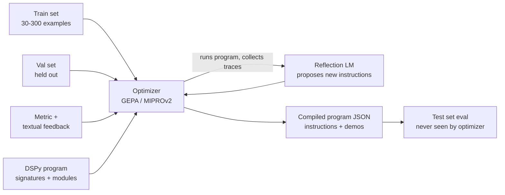

# DSPy & prompt optimization (GEPA)

!!! abstract "At a glance"
    **Priority:** P1 · **Complexity:** 4/5 · **Est. time:** 4 h · **Phase:** 5 · **Prereqs:** [Prompting & structured outputs](prompting-structured-outputs.md), [Evals I](evals-error-analysis.md), [Eval tooling](eval-tooling.md)
    **You're done when:** you have taken one real prompt from the capstone (the incident triage classifier), rewritten it as a DSPy program, optimized it with `dspy.GEPA` against a held-out set, and can show a measured before/after delta plus the dollar cost of the optimization run.

## Why it matters

Hand-tuned prompts are the "magic constants" of LLM systems: untested, model-specific and brittle. Every model upgrade (and in 2026 you get one per quarter) silently shifts behaviour, and nobody knows which sentence in the 900-word system prompt was load-bearing. DSPy reframes the problem: you declare **what** each LM step does (a typed *signature*), compose steps as ordinary Python *modules*, and let an *optimizer* search for the instructions and few-shot demos that maximize a metric you define on a dataset you own.

Why a Staff/AI architect cares in 2026:

- **Model portability.** Re-running an optimizer against a new model is cheaper and more reliable than re-tuning prompts by hand. This is the strongest business case for DSPy.
- **Eval-driven discipline.** DSPy cannot work without a metric and a dataset. Adopting it forces the team to build the eval harness they should have built anyway ([Evals I](evals-error-analysis.md)).
- **GEPA changed the economics.** GEPA (Genetic-Pareto reflective prompt evolution, ICLR 2026 Oral) uses an LM to *read* execution traces and textual feedback and propose better instructions. The paper reports it outperforming GRPO-style RL fine-tuning on several tasks with up to ~35x fewer rollouts, and beating MIPROv2 by >10% on average. Prompt optimization became a credible alternative to fine-tuning for many tasks ([Fine-tuning](fine-tuning.md)).
- **Interviews.** "How would you systematically improve a prompt?" is now a common AI-architect question. "I'd run error analysis, build a metric, then use an optimizer like GEPA with a held-out set" is the senior answer.

## Core concepts

### The programming model

| Concept | What it is | Analogy |
|---|---|---|
| **Signature** | Typed I/O spec: `"question, context -> answer"` or a `dspy.Signature` class with `InputField`/`OutputField` and a docstring | Function signature + docstring |
| **Module** | A parameterized LM step: `dspy.Predict`, `dspy.ChainOfThought`, `dspy.ReAct`, `dspy.ProgramOfThought`, or your own `dspy.Module` subclass composing them | `nn.Module` layer |
| **Adapter** | Turns a signature into the actual prompt/messages and parses the reply (`ChatAdapter` default, `JSONAdapter` for native structured outputs) | Serializer |
| **LM** | `dspy.LM("provider/model")`, backed by LiteLLM, so any provider/Ollama/vLLM works | DB driver |
| **Metric** | `metric(example, pred, trace=None) -> float | bool` (GEPA: may also return textual feedback) | Loss function |
| **Optimizer** (a.k.a. teleprompter) | Searches over instructions/demos (or weights) to maximize the metric | Training loop |
| **Compiled program** | The same module with optimized parameters, saved as JSON | Checkpoint |

The core insight is **separating the program's control flow (Python) from its parameters (instructions + demos)**. Parameters are learnable; control flow is code you review.



### The optimizer menu (DSPy 3.x, as of Sept 2026)

| Optimizer | What it tunes | Data needed | When to use |
|---|---|---|---|
| `BootstrapFewShot` | Few-shot demos (bootstrapped from successful traces) | ~10-50 | Quick baseline; cheap |
| `BootstrapFewShotWithRandomSearch` | Demos, multiple candidate sets | 50+ | Slightly better, more calls |
| `MIPROv2` | Instructions + demos jointly via Bayesian optimization | 50-300 | Strong general-purpose choice pre-GEPA |
| **`GEPA`** | Instructions (per predictor), guided by reflection over traces + feedback; keeps a Pareto frontier of candidates | 30-300 | Default for instruction optimization in 2026; best sample efficiency |
| `SIMBA` | Instructions/demos via stochastic mini-batch introspection | 50+ | Alternative reflective optimizer |
| `BootstrapFinetune` | Model **weights** from bootstrapped traces | 100s+ | Distil a big-model program into a small model |

### How GEPA works (mechanism, not magic)

1. **Seed**: start with your program's current instructions as candidate 0.
2. **Rollout**: run the candidate on a minibatch of train examples (default `reflection_minibatch_size=3`), capturing the full trace (inputs, intermediate outputs, tool calls) and the metric's **score + textual feedback**.
3. **Reflect**: a (usually stronger) `reflection_lm` reads traces + feedback for *one predictor* and writes an improved instruction ("The classifier confuses 'degraded' with 'outage' when the alert mentions partial region failure; add rule: ...").
4. **Evaluate & select**: the new candidate is scored; GEPA keeps a **Pareto frontier** — candidates that are best on *at least one* validation example — rather than a single best. Sampling parents from the frontier preserves diverse "specialist" strategies and avoids premature convergence.
5. **Merge** (optional `use_merge=True`): combine modules from different lineages that excel on different subsets.
6. Stop when the budget (`auto="light"|"medium"|"heavy"`, or `max_metric_calls`, or `max_full_evals`) is spent. Exactly one budget knob must be set.

Why this beats RL on sample efficiency: a scalar reward says *that* you failed; a trace + natural-language feedback says *why*. One reflective update extracts far more signal per rollout.

!!! tip "Feedback quality is the lever"
    GEPA's metric can return `dspy.Prediction(score=..., feedback="...")`. The feedback is what the reflection LM reads. "Wrong" is useless; "Predicted severity=SEV3 but runbook says any customer-facing payment failure is SEV1; the model ignored the `customer_impact` field" is gold. Invest in feedback the way you'd invest in good error messages. You can also return predictor-level feedback using the `pred_name` argument.

### Code: the capstone triage classifier

```python
# uv add "dspy>=3.3"
import os
from typing import Literal
import dspy

# Any LiteLLM model string works: "openai/...", "anthropic/...", "ollama_chat/qwen3:8b"
task_lm = dspy.LM(os.environ.get("TASK_MODEL", "ollama_chat/qwen3:8b"),
                  api_base=os.environ.get("OLLAMA_BASE", "http://localhost:11434"))
reflection_lm = dspy.LM(os.environ["REFLECTION_MODEL"], temperature=1.0, max_tokens=32000)
dspy.configure(lm=task_lm)

class TriageIncident(dspy.Signature):
    """Classify an operational alert and pick the owning team."""
    alert: str = dspy.InputField(desc="raw alert text incl. service, region, metrics")
    runbook_excerpt: str = dspy.InputField()
    severity: Literal["SEV1", "SEV2", "SEV3", "SEV4"] = dspy.OutputField()
    owner_team: str = dspy.OutputField(desc="team slug from the runbook")
    rationale: str = dspy.OutputField(desc="one sentence")

program = dspy.ChainOfThought(TriageIncident)

def load(path: str) -> list[dspy.Example]:
    import json
    rows = [json.loads(l) for l in open(path)]
    return [dspy.Example(**r).with_inputs("alert", "runbook_excerpt") for r in rows]

train, val, test = load("train.jsonl"), load("val.jsonl"), load("test.jsonl")

def metric(gold, pred, trace=None, pred_name=None, pred_trace=None):
    sev_ok = gold.severity == pred.severity
    team_ok = gold.owner_team == pred.owner_team
    score = 0.7 * sev_ok + 0.3 * team_ok
    fb = []
    if not sev_ok:
        fb.append(f"Severity {pred.severity} should be {gold.severity}. Gold rationale: {gold.why}")
    if not team_ok:
        fb.append(f"Owner {pred.owner_team} should be {gold.owner_team}.")
    return dspy.Prediction(score=score, feedback=" ".join(fb) or "Correct.")

evaluate = dspy.Evaluate(devset=test, metric=lambda g, p, t=None: metric(g, p).score,
                         num_threads=8, display_progress=True)
baseline = evaluate(program)

optimizer = dspy.GEPA(metric=metric, reflection_lm=reflection_lm,
                      max_metric_calls=600,   # hard cost cap; or auto="light"
                      num_threads=8, track_stats=True)
optimized = optimizer.compile(program, trainset=train, valset=val)
after = evaluate(optimized)
optimized.save("triage_gepa.json")          # commit this artifact; load with program.load(...)
```

Senior nuance in that snippet:

- **Three splits.** The optimizer sees `train` (reflection minibatches) and `val` (Pareto selection). Only `test` gives an unbiased estimate. Reporting the val score is reporting training accuracy.
- **Weighted metric** encodes business cost (a wrong severity pages the wrong people at 3 a.m.; a wrong team is re-routed in minutes).
- **Artifact in git.** The compiled JSON is a versioned build output; review diffs of the instructions like code.
- **Task LM vs reflection LM.** Optimize a cheap local model with a strong reflection model: you pay frontier prices only during compilation.

### Cost math of an optimization run

Budget = metric calls × (program LM calls per example) × tokens.

- `max_metric_calls=600`, ChainOfThought = 1 call, ~2.5k tokens in / 300 out on a local 8B model: effectively free (GPU time).
- Reflection: roughly one reflection call per proposal; with a few dozen proposals × ~8k tokens each on a frontier model = a few hundred thousand tokens. Even at frontier list prices this is typically single-digit dollars.
- A ReAct agent with 6 tool-using steps and an LLM judge metric can be **20-50x** more expensive per metric call. Cap with `max_metric_calls`, use a cheaper judge, and cache LM calls (DSPy caches by default — clear or vary cache when you need fresh samples).

Rule of thumb: if one full program run costs $0.01, a 1,000-call GEPA run is ~$10 plus reflection. That is cheaper than one engineer-hour of prompt fiddling, and it is repeatable on every model upgrade.

### When DSPy is (and isn't) the right tool

| Use DSPy when | Avoid / defer when |
|---|---|
| A task has a measurable metric and ≥30 labelled examples | No agreed definition of "good" yet (do error analysis first) |
| You will swap models (cost down-shift, vendor change, local) | One-off prompt, low traffic, no eval set |
| Multi-step pipelines where hand-tuning each step is combinatorial | The problem is retrieval quality or missing tools (optimizing the prompt won't fix bad context) |
| You want to distil a frontier pipeline into a small model (`BootstrapFinetune`) | Heavy agent frameworks already own the prompt and expose no hook |

You do **not** have to adopt DSPy as your runtime. A common 2026 pattern: use DSPy/GEPA offline to discover instructions, then paste the optimized instruction into a Pydantic AI agent or LangGraph node, and keep the eval in CI. The GEPA algorithm is also available standalone (`gepa` package) for optimizing arbitrary text artifacts (system prompts, tool descriptions).

### Senior-level nuance juniors miss

- **Overfitting is real.** With 40 examples and 600 metric calls, GEPA will find instructions that encode quirks of the train set. Watch the gap between val and test; prefer `auto="light"` first.
- **Metric hacking.** If your metric is an LLM judge, the optimizer will optimize *the judge*. Validate the judge against human labels first ([Evals I](evals-error-analysis.md)).
- **Demos leak data.** Bootstrapped few-shot demos are real training examples embedded in the prompt. Don't let customer PII from the train set ship inside production prompts.
- **Prompt length drift.** Reflective optimizers tend to grow instructions. Track token count; add a length penalty to the metric if latency/cost matters.
- **Nondeterminism.** Set `seed`, pin model versions, record the reflection LM used; otherwise "re-optimize on upgrade" is not reproducible.

## Resources

| Resource | Type | Why this one | Level | Cost |
|---|---|---|---|---|
| [DSPy docs](https://dspy.ai/) | docs | Official; signatures, modules, optimizers, tutorials incl. GEPA | intermediate | free |
| [GEPA optimizer API](https://dspy.ai/current/api/optimizers/GEPA/overview/) | docs | Exact constructor/metric signatures and budget knobs | advanced | free |
| [GEPA paper (arXiv 2507.19457)](https://arxiv.org/abs/2507.19457) | paper | Mechanism: reflection + Pareto selection; results vs GRPO/MIPROv2 | advanced | free |
| [DSPy paper (arXiv 2310.03714)](https://arxiv.org/abs/2310.03714) | paper | The original "compile LM pipelines" argument | advanced | free |
| [HF cookbook: DSPy + GEPA](https://huggingface.co/learn/cookbook/dspy_gepa) :gem: | interactive | Runnable notebook, end-to-end optimization | intermediate | free |
| [The Data Quarry: Learning DSPy (optimizers)](https://thedataquarry.com/blog/learning-dspy-3-working-with-optimizers/) :gem: | article | Clearest practitioner walkthrough of optimizers and pitfalls | intermediate | free |
| [DeepLearning.AI: DSPy — Build & optimize agentic apps](https://www.deeplearning.ai/short-courses/dspy-build-optimize-agentic-apps/) | course | Short guided course; good for the mental model | intermediate | free |
| [gepa-ai/gepa](https://github.com/gepa-ai/gepa) :gem: | docs | Standalone GEPA for optimizing any text artifact outside DSPy | advanced | free |
| [stanfordnlp/dspy on GitHub](https://github.com/stanfordnlp/dspy) | docs | Source, issues, release notes (track 3.x changes) | advanced | free |

## Hands-on lab

**Goal (90-120 min):** optimize the capstone's incident-triage step and ship the artifact.

1. **Data (20 min).** Export 120 historical alerts (or synthesize from your runbooks; keep them realistic, include ambiguous ones). Label `severity`, `owner_team`, `why`. Split 40/40/40 into `train/val/test.jsonl`. Stratify by severity.
2. **Baseline (10 min).** Run the program above with your *current hand-written prompt* pasted as the signature docstring. Record test accuracy and mean tokens per call.
3. **BootstrapFewShot (10 min).** `dspy.BootstrapFewShot(metric=..., max_bootstrapped_demos=4).compile(program, trainset=train)`. Record accuracy and token growth.
4. **GEPA (30-40 min).** Run with `auto="light"` first, then `max_metric_calls=600`. Log reflection LM tokens (LiteLLM callbacks or provider dashboard) to compute cost.
5. **Compare (10 min).** Table: baseline / fewshot / GEPA-light / GEPA-600 — test accuracy, SEV1 recall, tokens/call, optimization $ cost.
6. **Ship (15 min).** Save `triage_gepa.json`; add a pytest that loads it and asserts test accuracy ≥ baseline + 5 pts; wire into the capstone's CI eval job ([Eval tooling](eval-tooling.md)).
7. **Portability check.** Switch `TASK_MODEL` to a different model; evaluate the *same* compiled program; then re-optimize. Note the delta — that is your model-upgrade playbook.

**Expected output:** a markdown table in `docs/log/` showing a measurable improvement (typical: +5 to +20 pts on a small local model), SEV1 recall specifically, and a cost line such as "GEPA run: 600 metric calls, 1.4M task tokens (local), 310k reflection tokens ≈ $X".

## Questions

### L1 — Recall

??? question "Q1. What is a DSPy signature, and what does it replace?"
    ??? success "Answer"
        A declarative, typed input/output spec for one LM step (string form `"question -> answer"` or a `dspy.Signature` class with fields and a docstring). It replaces the hand-written prompt template: the adapter renders it into messages and parses outputs. The *instructions* derived from it become optimizable parameters.

??? question "Q2. Name the three budget knobs for `dspy.GEPA` and the rule governing them."
    ??? success "Answer"
        `auto` (`"light"|"medium"|"heavy"`), `max_full_evals`, and `max_metric_calls`. Exactly one must be set. `max_metric_calls` is the most direct cost cap.

??? question "Q3. Why does GEPA keep a Pareto frontier instead of the single best candidate?"
    ??? success "Answer"
        A candidate that's best on even one validation example stays eligible as a parent. This preserves diverse strategies (specialists for sub-populations), avoids greedy local optima, and allows `merge` to combine complementary lineages.

??? question "Q4. What does `BootstrapFinetune` optimize that GEPA and MIPROv2 don't?"
    ??? success "Answer"
        Model weights. It bootstraps successful traces from a (usually larger-model) program and fine-tunes a smaller model on them; GEPA and MIPROv2 optimize prompts (instructions and/or demos) with frozen weights.

### L2 — Apply

??? question "Q5. Your GEPA run reports val accuracy 0.93, but production accuracy after deploy is 0.78. List the likely causes and the fixes."
    ??? success "Answer"
        (1) Reporting val, which GEPA used for selection — overfit; fix: separate untouched test split. (2) Train/val not representative of production distribution (e.g. synthetic, missing rare alert types); fix: sample from production traces, stratify. (3) Model/version drift between optimization and prod; pin model versions. (4) Different adapter or temperature in prod runtime (e.g. instruction pasted into another framework without the demos/format); run the eval in the prod runtime. (5) Judge-based metric optimized the judge; validate metric against human labels.

??? question "Q6. Estimate the cost of a GEPA run: ReAct agent averaging 5 LM calls per example at 3k input / 400 output tokens each, LLM-judge metric at 2k/200 tokens, `max_metric_calls=500`, frontier model at $3/M input and $15/M output (illustrative prices). Ignore reflection."
    ??? success "Answer"
        Per metric call: agent = 5 × (3k × $3/M + 0.4k × $15/M) = 5 × ($0.009 + $0.006) = $0.075. Judge = 2k × $3/M + 0.2k × $15/M = $0.006 + $0.003 = $0.009. Total ≈ $0.084 × 500 ≈ **$42**, plus reflection (a few dollars). Levers: cheaper task model during search, cheaper judge, smaller minibatches, caching.

??? question "Q7. Write a GEPA metric for a SQL-generation module that gives useful feedback."
    ??? success "Answer"
        ```python
        def metric(gold, pred, trace=None, pred_name=None, pred_trace=None):
            try:
                rows = run_readonly(pred.sql, timeout_s=5)
            except Exception as e:
                return dspy.Prediction(score=0.0, feedback=f"SQL failed to execute: {e}. Schema: {gold.schema_hint}")
            if rows == gold.expected_rows:
                return dspy.Prediction(score=1.0, feedback="Correct result set.")
            return dspy.Prediction(score=0.3,
                feedback=f"Executed but wrong result: got {len(rows)} rows, expected {len(gold.expected_rows)}. "
                         f"Likely missing filter; gold query uses: {gold.key_clauses}")
        ```
        Partial credit for executable SQL gives a gradient; feedback names the failure class and a hint (without leaking the full gold answer, which would overfit).

### L3 — Design & trade-offs

??? question "Q8. GEPA vs LoRA fine-tuning vs just upgrading to a bigger model — the triage classifier is at 81% and needs 92%. Decide and defend."
    ??? success "Answer"
        Order of operations: (1) error analysis — if failures are due to missing runbook context, fix retrieval first; no optimizer helps. (2) Try GEPA on the current model: cheap ($10s), hours not days, keeps model swappable, artifact is human-readable. (3) If still short and volume is high, consider distillation/LoRA on a small model using GEPA-optimized big-model traces — lower per-call cost and latency but adds a training/serving pipeline and model lifecycle. (4) Bigger model is the fastest check of ceiling ("is 92% achievable at all?") and a sensible stopgap if volume is low; cost scales with every call forever. Decision criteria: call volume × price delta, latency SLO, data residency (local model), team's MLOps maturity.

??? question "Q9. Should the capstone use DSPy as its runtime framework, or only as an offline optimizer? Argue both."
    ??? success "Answer"
        Runtime: single source of truth (compiled JSON loaded directly), easy re-optimization, no copy-paste drift. Cons: another abstraction next to LangGraph/Pydantic AI; adapter-rendered prompts are less transparent; observability integration must be verified; fewer people know it. Offline only: keep Pydantic AI/LangGraph as runtime, use DSPy/GEPA to discover instructions, paste into agent config, guard with CI eval. Cons: drift between optimized and deployed prompt formatting (demos, field ordering). Recommendation for the capstone: offline for agent-level prompts; runtime DSPy for isolated, high-volume classification/extraction steps where the module *is* the service.

??? question "Q10. Your optimizer keeps growing the instruction from 300 to 2,500 tokens. Why, and what do you do?"
    ??? success "Answer"
        Reflection adds rules for each observed failure and rarely removes them; longer instructions often do help on the train set. Costs: latency, $/call, and dilution (later rules conflict). Mitigations: add a length penalty to the score (e.g. `score - 0.00005*tokens`), set a hard max in the proposer, run a "compression" pass (ask reflection LM to consolidate while holding accuracy), check test not val, and use prompt caching so the static instruction costs ~10% on repeated calls ([Cost & latency](cost-latency-optimization.md)).

### L4 — Staff-level ambiguity

??? question "Q11. Five teams each hand-tune prompts for the same vendor model. Leadership wants to move 60% of traffic to a cheaper model next quarter. Propose a plan."
    ??? success "Answer"
        (1) Inventory LLM call sites and traffic/cost per site via gateway logs ([Routing & gateways](model-routing-gateways.md)). (2) Mandate an eval set + metric per high-traffic site as the entry ticket ("no eval, no migration") — provide a template and a shared runner in CI. (3) Offer a paved-road optimization service: DSPy/GEPA job that takes (program or prompt, dataset, metric, target model) and returns an artifact + report. (4) Migrate by traffic-weighted value: top 5 sites first, shadow traffic on the cheap model, compare on production samples, then canary via gateway weights. (5) Guardrails: per-site quality SLO, auto-rollback. (6) Publish results (cost saved, quality delta) to earn adoption. Risks to name: metric gaming, teams without data, legal review for training data use.

??? question "Q12. A PM says 'the optimizer rewrote our prompt and now it's unreadable; compliance wants every prompt change approved.' How do you reconcile automated optimization with change control?"
    ??? success "Answer"
        Treat compiled prompts as build artifacts with a promotion pipeline: optimizer output → PR containing the instruction diff, eval report (test metrics, slices, safety evals, token delta) → human approval (compliance sees a readable diff + evidence) → deploy with version tag and rollback. Constrain search space where compliance matters (fixed "policy block" that the optimizer can't edit; optimize only task-specific sections). Keep audit trail: dataset hash, model versions, reflection LM, seed. This turns "unreadable AI changes" into more evidence than hand edits ever had.

## Real-world use cases

- **Logistics document extraction (bill of lading, customs forms).** Field-extraction module optimized per carrier template family; re-optimized when switching to a cheaper model, with per-field accuracy as the metric.
- **Support ticket routing at scale.** Classification with hundreds of labels; GEPA-optimized instructions on a small model replace a frontier model, cutting cost ~10x with equal accuracy on held-out tickets.
- **RAG answer synthesis.** Optimize the "answer from context with citations" module using a faithfulness + citation-correctness metric; retrieval stays unchanged.
- **Tool-description tuning.** Using standalone GEPA to optimize MCP tool descriptions so an agent selects the right tool (metric: tool-selection accuracy on a labelled set) ([MCP](mcp.md)).
- **Distillation for edge/on-prem.** Frontier pipeline → `BootstrapFinetune` into a local 8B model for a data-residency-constrained deployment.

## Pitfalls & anti-patterns

- Optimizing before error analysis — you polish a prompt while the real bug is retrieval.
- Reporting validation-set scores as results.
- Using an unvalidated LLM judge as the metric (you optimize the judge's biases).
- Tiny, unrepresentative datasets (20 synthetic examples) — overfit instructions.
- Forgetting DSPy's LM cache when you expect fresh samples; or disabling it and paying twice.
- Letting PII from training examples ship as few-shot demos.
- Not versioning the compiled artifact, model versions and dataset hash.
- Treating DSPy as all-or-nothing; the offline-optimizer pattern is often the pragmatic choice.

## Checklist

- [ ] I can explain signatures, modules, adapters, metrics and optimizers without notes
- [ ] I can explain how GEPA's reflection + Pareto selection works and why it's sample-efficient
- [ ] I built train/val/test splits and ran baseline, BootstrapFewShot and GEPA on the triage step
- [ ] I computed the dollar cost of an optimization run
- [ ] The compiled artifact is in git and guarded by a CI eval
- [ ] I answered all L3 questions out loud in < 3 min each
