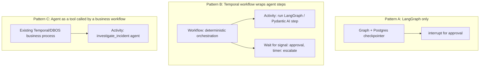

# Durable execution & human-in-the-loop

!!! abstract "At a glance"
    **Priority:** P0 · **Complexity:** 4/5 · **Est. time:** 3 h · **Phase:** 3 · **Prereqs:** [LangGraph](langgraph.md), [Tool calling](tool-calling.md), [Agent patterns](agent-patterns.md)
    **You're done when:** the copilot pauses before any write action, survives a process kill during the pause and during a tool call, resumes correctly hours later on approve/edit/reject, never double-executes a side effect, and you can explain when LangGraph checkpoints are enough versus when to add Temporal/DBOS.

## Why it matters

Agent runs are **long, expensive, and full of side effects**: 30 LLM calls, three external APIs, a ticket creation, a rollback that a human must approve — and somewhere in the middle a pod restarts, a provider returns 529, or an approver goes to lunch. Without **durable execution** you either lose the work (and re-pay for it), or worse, replay it and repeat a side effect. Without **human-in-the-loop (HITL)** you either forbid useful autonomy or grant dangerous autonomy.

The two problems are the same problem: **a run must be able to stop at an arbitrary point, be persisted, and continue later — exactly once for side effects.** This is where a Staff engineer's distributed-systems background (idempotency, at-least-once delivery, outbox, sagas) transfers directly to agents. See [reliability patterns](../system-design/reliability-patterns.md) and [sagas & outbox](../architecture/sagas-outbox.md).

## Core concepts

### Failure taxonomy for agent runs

| Failure | Example | Naive outcome | Durable design |
|---|---|---|---|
| Transient dependency error | 429/529 from model, DB blip | Run fails | Retry with backoff + jitter at the step level; circuit breaker; fall back to another model |
| Process crash / deploy | Pod evicted mid-run | Lost run; re-run from scratch (re-pay, maybe duplicate effects) | Checkpoint per step; resume on another worker |
| Long wait | Human approval for hours; external callback | Holding a connection/thread; timeouts | Persist and release resources; resume on signal |
| Poison step | Deterministic failure (bad schema) | Infinite retry storm | Bounded retries, then dead-letter/escalate to human |
| Duplicate delivery | Retry after unknown outcome | Double ticket, double refund | Idempotency keys; exactly-once *effect* |
| Version skew | Code changed while runs in flight | Resume into different logic | Versioned graphs/workflows; migration or drain |

### Exactly-once is an illusion; idempotent effects are the tool

Execution engines give **at-least-once** step execution with **recorded results** (a completed step's output is stored and reused on replay). The gap: a step that performs a side effect and crashes *before its result is recorded* will run again. Therefore:

1. Give every side-effecting step a **deterministic idempotency key** (`run_id:step_name[:n]`), and pass it to the downstream system (Stripe-style) or record "done" in your own table in the same transaction as the effect.
2. Separate **decide** (LLM, non-deterministic, recorded once) from **do** (deterministic, idempotent, retried).
3. Prefer **outbox** semantics for effects in your own DB.
4. For effects without idempotency support, add a compensating action (saga) and a reconciliation job.

### Level 1: LangGraph checkpoints + interrupts

LangGraph persists state at super-step boundaries ([LangGraph](langgraph.md)) and provides `interrupt()` to pause for human input:

```python
from langgraph.types import interrupt, Command

def human_approval(state: State) -> Command[Literal["execute", "abort"]]:
    # Everything before interrupt() re-runs on resume -> keep it cheap and side-effect free
    decision = interrupt({
        "kind": "approve_action",
        "action": state["proposed_action"],        # e.g. {"tool": "rollback_deploy", "args": {...}}
        "evidence": state["findings"][:3],
        "expires_at": state["approval_deadline"],
    })
    # resume value: {"decision": "approve"|"edit"|"reject", "edited_args": {...}, "by": "alice"}
    if decision["decision"] == "reject":
        return Command(update={"approved": False, "audit": decision}, goto="abort")
    args = decision.get("edited_args") or state["proposed_action"]["args"]
    return Command(update={"approved": True, "final_args": args, "audit": decision}, goto="execute")
```

Run and resume:

```python
config = {"configurable": {"thread_id": incident_id}}
out = graph.invoke({"alert": alert}, config, durability="sync")
if "__interrupt__" in out:                      # or use stream_events v3 -> stream.interrupts
    payload = out["__interrupt__"][0].value     # send to Slack / approval UI; store thread_id with it
...
# hours later, possibly in another process:
graph.invoke(Command(resume={"decision": "approve", "by": "alice"}), config)
```

Rules from the docs that bite in production:

- **The node re-executes from its start on resume.** Code before `interrupt()` runs again — keep it idempotent and cheap.
- **Never wrap `interrupt()` in a bare `try/except`** (it works by raising a special exception).
- **Interrupt matching is index-based** within a node; keep the order of interrupts deterministic (no conditional skipping between runs).
- **Avoid `while True` loops with `interrupt()`** (re-execution explodes); use conditional edges to loop back to an approval node.
- Payloads must be **JSON-serialisable**.
- Parallel branches can raise multiple interrupts; resume with a mapping of interrupt ID -> value.
- A **checkpointer and `thread_id` are mandatory**.
- Static breakpoints (`interrupt_before=["execute"]` at compile/invoke time) are useful for debugging, but dynamic `interrupt()` is the production pattern because it carries context and supports conditional approval.

### HITL patterns

| Pattern | Flow | Use when |
|---|---|---|
| **Approve/reject** | Pause before an irreversible action | Rollbacks, payments, external comms |
| **Edit-then-approve** | Human modifies tool args/draft | Emails, ticket text, queries |
| **Review tool calls** | Interrupt on specific tools by policy (risk tier) | Mixed autonomy: reads free, writes gated |
| **Clarification** | Agent asks the user a question, resumes with the answer | Ambiguous requests |
| **Escalation** | On low confidence/budget exhaustion/repeated failure, hand off to a human with full context | Fallback; poison-step handling |
| **Confidence-based sampling** | Autonomous by default; humans review a % or low-confidence cases | High volume with measurable error rates |
| **Post-hoc audit** | Act autonomously with undo; review after | Reversible low-risk actions |

Approval policy belongs in **code and config** (risk tier per tool, thresholds, who can approve), enforced in the executor — not in the prompt. Include in the approval request: the proposed action with exact arguments, the evidence, the blast radius, an expiry, and the run/trace link; record who approved, when, and what they saw (audit). Design for **approval latency**: timeouts, reminders, escalation to a secondary approver, and a safe default on expiry (usually *do nothing and notify*). Watch for **approval fatigue**: too many prompts trains rubber-stamping — tier risk, batch related approvals, and measure approval rate/time.

Security: verify approver identity and authorisation server-side (an approval is a privileged action), bind the approval to the exact payload hash so it can't be replayed for different args, and beware injected content asking users to approve something misleading (show the machine-derived action, not model-generated prose alone).

### Level 2: Durable workflow engines (Temporal, DBOS, Prefect, Restate)

LangGraph checkpoints give resumability inside an agent process/runtime. When runs span **days**, need **timers, signals, versioning, cross-service orchestration, or strict exactly-once activity semantics**, use a workflow engine:

- **Temporal:** workflows are deterministic code whose event history is persisted; **activities** (non-deterministic or side-effecting work such as LLM calls and tools) are retried with policies and their results recorded; on crash the workflow is **replayed** from history, skipping completed activities. Signals/updates deliver human decisions; timers and durable sleeps handle waits; versioning APIs handle code changes. Determinism rule: workflow code can't do I/O or use randomness directly.
- **DBOS:** durable execution as a library on Postgres (decorators `@DBOS.workflow()`/`@DBOS.step()`), checkpointing step outputs to your Postgres; low infrastructure overhead, attractive if you already run Postgres.
- **Prefect, Restate, AWS Lambda durable functions, Kitaru, Airflow:** other engines with varying models; Pydantic AI documents integrations with seven engines as of 2026.

**Pydantic AI integration (v1/v2):** wrap an agent in `TemporalAgent` (or the DBOS/Prefect equivalents) so model requests and tool calls become activities/steps automatically — non-deterministic work is offloaded with retry policies while your coordination logic stays deterministic. Notes from the docs: DBOS/Prefect run durable units in the workflow's process (an MCP toolset can keep one session), whereas Temporal activities may run in different workers (sessions can't be shared across activities) — a real design constraint for stateful MCP servers ([MCP](mcp.md)).

Composition patterns:



Choose:

| Need | Pick |
|---|---|
| Interactive agent, minutes-to-hours pauses, one service, Postgres available | LangGraph + PostgresSaver + interrupts |
| Multi-day workflows, SLA timers, many services, strict audit/versioning | Temporal (or DBOS if Postgres-centric and simpler) around agent steps |
| Already have a business workflow engine | Agent as an activity/step; keep the agent's own loop bounded |
| Serverless, low volume | Durable functions/DBOS; avoid running a Temporal cluster for 50 runs/day |

### Retries, timeouts, and budgets in durable systems

- **Per-step retry policy:** exponential backoff with jitter, max attempts, non-retryable error classes (validation errors, 4xx that won't change). LLM calls: treat 429/5xx/timeouts as retryable; treat content-policy refusals and schema failures separately (model-level retry with feedback, bounded).
- **Timeouts at three levels:** per call (e.g. 60 s), per step, per run (wall-clock); plus a **heartbeat** for long activities so a stuck worker is detected.
- **Budgets persist across resumes:** store spent tokens/cost and step count in state, so a crash-resume doesn't reset the budget.
- **Dead-letter/escalation:** after N failures, park the run with full state and notify a human rather than retry forever.
- **Cancellation:** support graceful cancel (user aborts) that stops model calls and triggers compensations.

### Versioning in-flight runs

Code changes while runs are paused for hours are inevitable. Options: **drain** (new runs use v2, old finish on v1 workers), **compatible changes only** (additive state fields with defaults), **explicit migration** functions applied on resume, or workflow-engine versioning primitives (Temporal `patched`/Worker Versioning). Always store a schema/version field in state and test resume across versions in CI.

### Observability for durable runs

Trace per execution segment, linked by run/thread ID ([LLM observability](llm-observability.md)); record `resume_count`, wait time (excluded from latency SLOs), approval decisions, retries per step, and dead-letter counts; alert on runs stuck beyond a threshold and on approval queues aging.

### What juniors miss

- Assuming "the framework retries" implies exactly-once effects.
- Doing side effects before `interrupt()` in the same node.
- No approval expiry/escalation, so runs hang forever.
- Approval that isn't bound to the exact action payload.
- Ignoring in-flight version skew.
- Using a workflow engine for a 3-step chat agent, or the reverse: relying on in-memory state for multi-hour flows.

## Resources

| Resource | Type | Why this one | Level | Cost |
|---|---|---|---|---|
| [LangGraph - Interrupts](https://docs.langchain.com/oss/python/langgraph/interrupts) | docs | Definitive rules for `interrupt`, `Command(resume=...)`, multiple interrupts | advanced | free |
| [LangGraph - Persistence](https://docs.langchain.com/oss/python/langgraph/persistence) | docs | Checkpointers, durability modes, Postgres, thread IDs | advanced | free |
| [Pydantic AI - Durable execution overview](https://pydantic.dev/docs/ai/capabilities/durable_execution/overview/) | docs | How agents run on Temporal, DBOS, Prefect and more; engine trade-offs | advanced | free |
| [Temporal blog - Durable AI agents with Pydantic AI and Temporal](https://temporal.io/blog/build-durable-ai-agents-pydantic-ai-and-temporal) | article | Concrete walkthrough of activities vs workflow determinism for agents | advanced | free |
| [DBOS documentation](https://docs.dbos.dev/) :gem: | docs | Postgres-native durable workflows without a separate cluster; great for smaller teams | intermediate | free |
| [12-Factor Agents - Pause/resume & contact humans with tool calls](https://github.com/humanlayer/12-factor-agents) :gem: | article | Design principles for human contact as a first-class tool and simple pause/resume | intermediate | free |
| [Anthropic - Building effective agents](https://www.anthropic.com/engineering/building-effective-agents) | article | Human checkpoints and stopping conditions in the agent loop | intermediate | free |
| [OWASP Top 10 for Agentic Applications 2026](https://genai.owasp.org/resource/owasp-top-10-for-agentic-applications-for-2026/) | docs | Excessive agency and human-oversight failures - why approval gates exist | intermediate | free |

## Hands-on lab

**Goal:** make the copilot's write path durable, gated and exactly-once-effect. (2-3 h)

1. In the LangGraph from the previous lab add `propose_action` (LLM proposes `{tool, args, rationale}` from findings; risk tier from a table) and a `human_approval` node using `interrupt()` for `risk >= WRITE`, then `execute` (calls `create_incident_ticket` / `rollback_deploy` stub with an idempotency key `f"{thread_id}:{step}"`), then `notify`.
2. Build a tiny approval API (FastAPI): `GET /approvals` lists pending interrupts (persist `{thread_id, payload_hash, expires_at}` when you detect `__interrupt__`), `POST /approvals/{id}` accepts `approve|edit|reject`, verifies the approver's role, checks the payload hash, and calls `graph.ainvoke(Command(resume=...), config)`.
3. **Kill test A (during pause):** start a run, wait for the interrupt, `docker compose restart app`, approve afterwards; confirm the run resumes from the checkpoint and finishes.
4. **Kill test B (during effect):** make the ticket stub sleep 5 s and `kill -9` the app mid-call *after* it recorded the effect in a `tickets` table keyed by idempotency key but before returning; resume; assert exactly one ticket row.
5. **Expiry:** implement a scheduled job that resumes expired approvals with `{"decision": "reject", "by": "system:timeout"}` and notifies.
6. **Edit path:** approve with edited args; assert the executed args equal the edited ones and the audit log stores both.
7. **Stretch (Temporal or DBOS):** re-implement `execute` + wait-for-approval as a DBOS workflow (or Temporal workflow + signal) calling your LangGraph investigation as one step; compare code complexity, and note what you gained (timers, versioning) and lost (streaming ergonomics).
8. Add traces: approval wait time span, `resume_count`, decision attributes.

*Expected:* survive both kills with exactly one ticket, an audit trail with approver identity and payload hash, and a documented decision on whether Temporal/DBOS is justified at the copilot's scale (likely "not yet; LangGraph + Postgres suffices until multi-day/SLA flows appear").

## Questions

### L1 — Recall

??? question "Q1. What happens to a node containing `interrupt()` when the run is resumed?"
    ??? success "Answer"
        The node re-executes from its beginning (not from the interrupt line). `interrupt()` returns the resume value the second time. Code before it runs again, so it must be idempotent and side-effect free, or the side effects must live in separate nodes.

??? question "Q2. Why can't frameworks give exactly-once side effects, and what do you do instead?"
    ??? success "Answer"
        A step can perform an external effect and crash before its completion is recorded, so the runtime can only guarantee at-least-once execution. You make the effect idempotent with a deterministic key (or a transactional "already done" record) so re-execution is harmless, achieving exactly-once *effect*. Where the downstream can't dedupe, use compensations and reconciliation.

??? question "Q3. In Temporal, what belongs in a workflow vs an activity?"
    ??? success "Answer"
        Workflows contain deterministic orchestration code (control flow, timers, waiting for signals) and are replayed from event history, so they must not perform I/O or use non-deterministic sources directly. Activities do the non-deterministic/side-effecting work (LLM calls, tool execution, API calls); they are retried per policy and their results are recorded so replays reuse them.

### L2 — Apply

??? question "Q4. Design the idempotency key and storage for `rollback_deploy` invoked by an agent that may retry or resume."
    ??? success "Answer"
        Key = `sha256(thread_id + ":" + step_name + ":" + normalized_args)` (or `thread_id:step` when one call per step). Table `effects(idempotency_key PRIMARY KEY, status, request, response, created_at)`. Executor: `INSERT ... ON CONFLICT DO NOTHING RETURNING`; if inserted, perform the rollback (passing the key to the deploy system if it supports it) then update status/response; if conflict and status=done return the stored response; if status=in_progress, poll or return "in progress". Wrap insert and effect-record in a transaction where possible or use the outbox pattern. Also add reconciliation that checks the deploy system's real state for `in_progress` records older than a timeout.

??? question "Q5. The approval node computes an expensive LLM summary before `interrupt()`. What's wrong and how do you fix it?"
    ??? success "Answer"
        On resume the node re-runs from the start, so the summary is regenerated (extra cost/latency and possibly a different summary than the one the approver saw). Move the summary into a preceding node so its result is checkpointed in state, and have the approval node only read state and call `interrupt()`. Also include a hash of what was shown to the approver in the audit.

??? question "Q6. Implement approval expiry so runs don't hang forever."
    ??? success "Answer"
        Store `expires_at` in the interrupt payload and in an `approvals` table. A scheduler (cron/APScheduler/Temporal timer) queries expired pending approvals and resumes each thread with `Command(resume={"decision":"reject","by":"system:timeout"})`, or escalates first to a secondary approver at T-15 min. The graph's `human_approval` handles timeout decisions by routing to an `abort_and_notify` node. Alert on approvals older than SLO and track time-to-approve distributions.

### L3 — Design & trade-offs

??? question "Q7. LangGraph checkpoints + interrupts vs wrapping the agent in Temporal. Decide for (a) an on-call copilot, (b) a 5-day customs clearance agent."
    ??? success "Answer"
        (a) On-call copilot: investigations last minutes; approvals within minutes to hours; single service; team owns Postgres. LangGraph + PostgresSaver + interrupts is simpler, keeps streaming and graph tooling, and avoids running Temporal. Add idempotent effects and expiry jobs. (b) Customs clearance: multi-day, external callbacks from authorities, SLA timers, escalation, audit and versioning of long-lived flows, many systems — a workflow engine (Temporal, or DBOS if Postgres-centric) fits: durable timers, signals, retries, worker versioning, visibility. Use LangGraph/Pydantic AI inside activities for the intelligent steps. Criteria: duration, timers/SLAs, cross-service coordination, versioning needs, team's operational maturity.

??? question "Q8. How do you set autonomy levels so approval fatigue doesn't neuter HITL?"
    ??? success "Answer"
        Risk-tier actions (read / reversible write / irreversible / high-blast-radius) in a registry; auto-approve reads and low-risk reversible actions with post-hoc audit and easy undo; require approval only for irreversible/high-impact ones; batch related approvals; show concise, machine-derived diffs with evidence; measure approval rate, time-to-approve, and rejection reasons; if approval rate is ~100% for a class, consider promoting to autonomous with monitoring; if rejections are high, fix the agent. Periodically red-team the flow to see whether reviewers catch planted bad proposals.

??? question "Q9. What must an approval record contain to satisfy an auditor?"
    ??? success "Answer"
        Who (authenticated identity and role), when, what they were shown (exact action, arguments, evidence, model/prompt versions, payload hash), what they decided (approve/edit/reject) including edited values, the resulting executed action and idempotency key, run/trace IDs, and expiry/escalation history. Store append-only (tamper-evident), retain per policy, and link to the change in the target system. Bind approval to the payload hash so an approval can't be reused for different arguments.

### L4 — Staff-level ambiguity

??? question "Q10. A VP asks to remove human approvals to 'move faster' after two months of 98% approval rates. What's your response?"
    ??? success "Answer"
        Treat it as a measurable risk decision. 98% approval means the agent is usually right, but the value of the gate lies in the 2% and the severity of those cases. Analyse rejections and near-misses by severity; estimate the cost of an unreviewed bad action (blast radius, reversibility) versus review cost (minutes per approval x volume). Propose graduated autonomy: auto-approve categories with reversible actions, tight guardrails, and strong monitoring (undo, rate limits, anomaly alerts), keep gates for irreversible ones, run a shadow period comparing agent decisions to humans, define rollback triggers and owners. Get the decision documented and signed by the risk owner.

??? question "Q11. Half your workflows are on LangGraph checkpoints, the other half on Temporal, chosen ad hoc. Propose a platform direction."
    ??? success "Answer"
        Don't force a single engine; publish a decision guide (duration, timers, cross-service coordination, versioning, team skills) and shared primitives: idempotent effect library, approval service (API + UI + audit), risk-tier registry, trace conventions (run ID, resume links), and a common state versioning policy. Standardise the *contracts* so an agent step can run as a LangGraph node or a Temporal activity. Offer a paved road for each class (interactive agents -> LangGraph+Postgres; long business processes -> Temporal/DBOS with agent activities), provide reference templates, and track incidents and operating cost to revisit the split annually.

## Real-world use cases

- **Deploy rollback approvals:** copilot proposes; on-call approves in Slack; exactly-once rollback with audit.
- **Payments/refunds agents:** tiered by amount; above threshold requires edit-then-approve by a finance user; idempotency keys with the PSP.
- **Customs document workflow:** multi-day agent with external callbacks, timers and escalations on Temporal; LLM steps as activities.
- **Contract redlining:** agent drafts, legal edits and approves each clause change; resume after days.

## Pitfalls & anti-patterns

- Side effects before `interrupt()` or non-idempotent nodes.
- Bare `try/except` swallowing interrupts; `while True` interrupt loops.
- Approval not bound to payload; approvals from unauthenticated callbacks.
- No expiry/escalation; no dead-letter path.
- Budgets reset on resume; unbounded retries on deterministic failures.
- No plan for in-flight version skew.
- Using in-memory checkpointers "temporarily" in production.

## Checklist

- [ ] I can explain at-least-once execution, idempotent effects and why they matter
- [ ] I built a gated write path with interrupt, approval API, expiry, and audit
- [ ] I passed both kill tests with exactly one side effect
- [ ] I can decide between LangGraph checkpoints and Temporal/DBOS with criteria
- [ ] I answered all L3 questions out loud in < 3 min each
