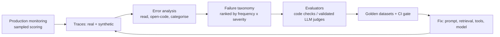

# Evals I: error analysis, LLM-as-judge, eval-driven development

!!! abstract "At a glance"
    **Priority:** P0 · **Complexity:** 4/5 · **Est. time:** 5 h · **Phase:** 2 · **Prereqs:** [Prompting & structured outputs](prompting-structured-outputs.md), [RAG fundamentals](rag-fundamentals.md)
    **You're done when:** you've read 100 real (or realistic) copilot traces, built a failure-mode taxonomy from them, turned the top modes into binary evaluators (code-based or a judge validated against your own labels with TPR/TNR), and can explain why this beats generic "helpfulness" scores.

## Why it matters

The most common reason LLM products stall is not the model — it is that nobody can tell whether a change made things better. Teams ship on vibes, get regressions, and lose trust. **Evals are the unit tests of probabilistic software**, and the discipline that separates demos from production.

The practitioner consensus (Hamel Husain, Shreya Shankar, Eugene Yan, Jason Liu; Husain and Shankar's evals FAQ and their AI Evals course) is remarkably consistent:

1. **Start with error analysis on real data**, not with a metrics library or a dashboard of generic scores.
2. **Failure modes are application-specific**; you discover them by reading traces and open-coding what went wrong.
3. **Prefer binary pass/fail** criteria tied to a specific failure over 1-5 Likert scores.
4. **LLM-as-judge is itself a model you must evaluate** (against human labels) before you trust it.
5. **Evals are a flywheel**: production trace -> failure -> new test case -> fix -> regression guard.

This page is the method; [Evals II](eval-tooling.md) covers the tools and CI wiring.

## Core concepts

### The eval-driven development loop



### Step 0: get data (you have less than you think)

- If you have production traces: sample ~100 diverse ones (stratify by intent, length, user segment; include thumbs-down and escalations).
- If you don't: **synthesise queries** by defining dimensions (e.g. service x alert type x user persona x difficulty) and having an LLM generate combinations, then hand-filter to realistic ones. Don't ask an LLM for "20 test questions" — you get homogeneous, easy inputs. Dogfood with real teammates.
- Log **full traces**: inputs, retrieved context, tool calls with args/results, intermediate reasoning, outputs, latency, cost ([LLM observability](llm-observability.md)).

### Step 1: error analysis (open coding then axial coding)

1. Look at ~100 traces in a purpose-built viewer (even a notebook or a simple internal page; reduce friction — this determines whether the team actually does it).
2. For each trace write a **free-text note** on the *first upstream failure* ("used deploy from wrong service", "cited runbook for different version", "asked for info already given"). Stop at the first failure — downstream errors are often consequences.
3. Continue until **theoretical saturation**: new traces stop producing new failure types (often 60-100 traces).
4. **Cluster** notes into 5-10 named categories (axial coding). Count each. An LLM can help cluster, but you write the notes — the judgment is the point.
5. Rank by **frequency x severity x fixability**. Some failures are just missing instructions (fix the prompt — no eval needed); others need an automated evaluator because they're subtle or recurring.

For agents, also analyse **trajectories**: where did the first wrong step occur (tool choice, args, interpretation of result, planning)? A **transition matrix** (from step type to failing step type) shows where agents break — a technique popularised by the AI Evals course.

### Step 2: choose the right kind of evaluator

| Evaluator type | Use for | Cost | Example |
|---|---|---|---|
| **Code-based assertion** | Anything checkable deterministically | ~free, deterministic | JSON schema valid; citation IDs exist in retrieved set; no write tool called without approval; cited `service` == alert `service`; regex for PII; latency < 5 s |
| **Reference-based** | Known-answer tasks | Low | Exact/normalised match on extracted fields; recall@k for retrieval |
| **LLM-as-judge (binary)** | Subjective/semantic criteria that recur | Medium; needs validation | "Does the summary state a root cause that is supported by the cited evidence?" |
| **Human review** | Ground truth, calibration, novel failures | High | Your own labels on 100+ traces |
| **Online metrics** | Reality check | Free | Thumbs, escalation rate, edit distance of drafts |

Prefer code checks. Reach for a judge only when you cannot express the criterion in code.

### Step 3: LLM-as-judge done properly

Common failure: prompt a model with "rate helpfulness 1-5", get 4.2 average forever, and learn nothing. Instead:

- **One judge per failure mode**, binary output (`pass`/`fail`) with a short critique before the verdict.
- Write a precise **rubric with definitions and 2-4 examples** of pass and fail from your own data.
- Split your human-labelled traces into **train** (for prompt examples), **dev** (to iterate the judge prompt) and **test** (to report final agreement) — never tune on test.
- Measure **TPR (true positive rate) and TNR (true negative rate)** of the judge against human labels — not overall accuracy, which is misleading with imbalanced data (if 90% of traces pass, a judge that always says pass is 90% "accurate"). Aim for both > ~0.85-0.9 on the criterion you care about; iterate on the prompt until so.
- Correct estimated rates for judge error: with known TPR/TNR, `true_rate ≈ (observed + TNR - 1) / (TPR + TNR - 1)` (Rogan-Gladen); or report confidence intervals via bootstrap. The `judgy` library implements this.
- Known **judge biases**: position bias (in pairwise), verbosity bias, self-preference (a model favours its own outputs), sycophancy to the answer under review, sensitivity to formatting. Mitigate: swap order and average, use a different/stronger model family for judging, ask for evidence quotes, use temperature 0.
- Use **pairwise** comparisons for model/prompt A/B ("which response better satisfies X?") and **pointwise binary** for regression gating.
- Re-validate the judge when you change the judged model, the judge model, or the data distribution. Judges drift.

Minimal judge in Pydantic AI:

```python
from typing import Literal
from pydantic import BaseModel
from pydantic_ai import Agent

class Verdict(BaseModel):
    critique: str
    verdict: Literal["pass", "fail"]

judge = Agent(
    "openai:gpt-5.2",  # placeholder; use a different family from the system under test when possible
    output_type=Verdict,
    instructions=(
        "You grade an incident-copilot answer for ONE criterion: GROUNDED_ROOT_CAUSE.\n"
        "PASS only if every root-cause claim is directly supported by a quoted evidence item "
        "in <evidence>. FAIL if any claim is unsupported, speculative but stated as fact, or "
        "cites evidence about a different service.\n"
        "Examples: ... (2 pass, 2 fail from your labelled dev set)\n"
        "Write the critique first (quote the supporting or missing evidence), then the verdict."
    ),
)
```

### Metrics for agents and RAG (what to actually track)

- **Task success** (binary, per scenario, ideally verified by environment state or a test).
- **Retrieval**: recall@k, MRR, context precision — *separately* from generation ([RAG fundamentals](rag-fundamentals.md)).
- **Generation**: faithfulness/groundedness, correct abstention, citation accuracy.
- **Tool use**: correct tool, valid args, unnecessary calls, recovery after error.
- **Safety**: injection success rate, unauthorised action attempts ([guardrails](guardrails-security.md)).
- **Non-functional**: p50/p95 latency, tokens, cost per task, step count.
- Report **pass rates with confidence intervals**; with n=50 cases a 4-point change is noise. Run non-deterministic cases k times (pass@k / pass^k: "at least once" vs "every time" — customers experience the latter).

### Golden datasets and the flywheel

- Store cases as versioned files (`jsonl`) with: input, expected properties (not necessarily exact text), tags/slices, provenance (which trace/incident), and owner.
- Every production failure or support escalation becomes a new case. Keep a **regression** set (must always pass) and an **exploration** set (tracking capability progress).
- Split by slice so you see e.g. `identifier queries` regress even if the aggregate holds.
- Beware **leakage**: don't put eval examples in few-shot prompts or fine-tuning data; don't overfit to the eval (rotate fresh cases quarterly).
- Size guidance: 30-50 cases per major slice for gating; 100-200 total is a healthy start; more when improvements are small.

### Anti-patterns Hamel and others call out repeatedly

- Buying an "eval platform" and running generic metrics (helpfulness, coherence, toxicity) that don't correlate with your failures.
- Likert 1-5 scores with unexplained differences between 3 and 4.
- Not looking at data; delegating labelling to an LLM entirely.
- Ignoring the domain expert: the person who knows what "correct" means must define pass/fail (a "benevolent dictator" for quality helps).
- Trying to evaluate everything up front instead of the top 3 failure modes.

### What juniors miss

- Confusing judge agreement % with judge validity (base rates!).
- Evaluating with the same model that generated the answer.
- Skipping the *first upstream failure* rule and chasing downstream symptoms.
- Treating a single-run pass as reliable for a stochastic system.

## Resources

| Resource | Type | Why this one | Level | Cost |
|---|---|---|---|---|
| [Hamel Husain and Shreya Shankar - Evals FAQ](https://hamel.dev/blog/posts/evals-faq/) | article | The densest, most practical Q&A on error analysis, judges, synthetic data, RAG/agent evals | intermediate | free |
| [Hamel Husain - Your AI Product Needs Evals](https://hamel.dev/blog/posts/evals/) | article | The foundational three-level eval framework (unit tests, human/model review, A/B) with a worked example | intermediate | free |
| [Hamel Husain - Using LLM-as-a-Judge (a complete guide)](https://hamel.dev/blog/posts/llm-judge/) :gem: | article | Step-by-step judge building with critique-first prompts and calibration | intermediate | free |
| [Hamel Husain - A Field Guide to Rapidly Improving AI Products](https://hamel.dev/blog/posts/field-guide/) | article | Error analysis workflow, data viewers, and prioritisation from real consulting engagements | intermediate | free |
| [Eugene Yan - Evaluating the effectiveness of LLM-evaluators](https://eugeneyan.com/writing/llm-evaluators/) :gem: | article | Literature survey of judge biases and reliability, with practical guidance | advanced | free |
| [Applied LLMs](https://applied-llms.org/) | article | Operational lessons on evals, guardrails and product iteration | intermediate | free |
| [DeepLearning.AI - Evaluating AI Agents](https://learn.deeplearning.ai/courses/evaluating-ai-agents/information) | course | Short course on trajectory and component-level agent evaluation | intermediate | free |
| [Pydantic Evals docs](https://pydantic.dev/docs/ai/evals/) | docs | Code-first datasets, evaluators (incl. LLMJudge) and reports | intermediate | free |

## Hands-on lab

**Goal:** run a real error analysis on the capstone and produce the first validated evaluators. (3-4 h across two sittings)

1. **Collect 100 traces.** Use the components built so far (triage, RAG, tools). Generate inputs by dimension: 6 services x 5 alert types x 3 personas (on-call, manager, new hire) x 2 difficulty levels, sample 60 combos, plus 40 hand-written from real incidents/Slack threads. Run the copilot end-to-end with full logging to JSONL (or Langfuse once [observability](llm-observability.md) is set up).
2. **Annotate** each trace in a spreadsheet: `first_failure_note` (blank if pass). Time-box 2 min/trace. Stop when no new failure types appear.
3. **Categorise** into a taxonomy; produce a Pareto table:

    ```
    category                          count  severity  fixable_by
    wrong service context used        17     high      prompt+state
    hallucinated runbook step         12     high      retrieval+citation check
    answered without evidence         11     med       abstention rule
    unnecessary tool calls            9      low       tool descriptions
    ignored time window in query      6      med       schema validation
    ```

4. **Fix the cheap ones** directly (prompt/instructions/schema) — no eval needed.
5. **Build evaluators** for the top 2-3 recurring failures:
    - Code: `citations_exist_in_retrieved(trace)`, `service_matches_alert(trace)`.
    - Judge: `GROUNDED_ROOT_CAUSE` (above). Label 60 traces yourself as pass/fail for it; split 20 train / 20 dev / 20 test; iterate the prompt on dev; **report TPR/TNR on test** and a bootstrap CI for the corrected pass rate.
6. Save `evals/datasets/copilot_v1.jsonl` (with slices) and `evals/README.md` documenting taxonomy, evaluators, judge validation numbers. This feeds [Evals II](eval-tooling.md) where you wire it into CI.

*Expected:* a taxonomy dominated by 3-4 categories (typically "wrong context/entity", "unsupported claim", "no abstention"), a judge with TPR/TNR near 0.85-0.9 after 2-3 iterations, and a clear picture of what to fix first.

## Questions

### L1 — Recall

??? question "Q1. What is error analysis in the LLM eval context and why is it the first step?"
    ??? success "Answer"
        Reading a sample of real (or realistic) traces, noting the first upstream failure in each, and clustering the notes into a taxonomy with counts. It's first because failure modes are application-specific; without it you'll build generic evaluators (helpfulness, coherence) that don't reflect what actually breaks, and you won't know what to fix or measure.

??? question "Q2. Why prefer binary pass/fail over 1-5 scores for LLM judges?"
    ??? success "Answer"
        Binary criteria force a precise definition of failure, are easier for humans to label consistently and for judges to reproduce, and support clear thresholds and TPR/TNR validation. Likert scales have ambiguous boundaries (what's a 3 vs 4?), low inter-rater agreement, and produce averages that hide the failures you need to see, and they drift without anyone noticing.

??? question "Q3. Define TPR and TNR for a judge and why accuracy alone is misleading."
    ??? success "Answer"
        Treating "fail" (the defect) as positive: TPR = fraction of truly failing traces the judge flags; TNR = fraction of truly passing traces the judge passes. Accuracy hides imbalance: if 90% of traces pass, a judge that always says "pass" has 90% accuracy but 0% TPR — it catches no defects. You need both rates (and per-class error costs) to trust the judge.

### L2 — Apply

??? question "Q4. Your judge says 78% of answers are grounded. On a labelled test set its TPR (catching ungrounded) is 0.80 and TNR 0.90. Estimate the true grounded rate."
    ??? success "Answer"
        Let the observed rate of *flagged failures* be 22%. With failure as positive: observed = TPR·p_f + (1-TNR)(1-p_f) where p_f = true failure rate. 0.22 = 0.80·p_f + 0.10·(1-p_f) = 0.10 + 0.70·p_f -> p_f = 0.12/0.70 ≈ 0.171. True grounded rate ≈ 82.9%, not 78%. The judge over-flags (10% false positive rate) more than it misses. Report with a bootstrap CI because TPR/TNR themselves are estimated from limited labels; and improve TNR before trusting the number.

??? question "Q5. Write two code-based evaluators for the copilot and one thing each cannot catch."
    ??? success "Answer"
        ```python
        def citations_exist(trace) -> bool:
            retrieved = {c["id"] for c in trace.retrieved_chunks}
            return all(cid in retrieved for cid in trace.answer.citations)

        def no_unapproved_writes(trace) -> bool:
            return all(t.approved for t in trace.tool_calls if t.name in WRITE_TOOLS)
        ```
        `citations_exist` cannot tell whether the cited chunk actually supports the claim (a semantic judge or NLI check is needed). `no_unapproved_writes` cannot tell whether an *approved* write was the right action. Code checks give cheap, deterministic floors; judges/humans cover semantics.

??? question "Q6. You have 40 labelled traces and want to build a judge. How do you split and iterate?"
    ??? success "Answer"
        Hold out a **test** set first (e.g. 15) and never look at judge errors on it during iteration. Use ~10 as **train** (source of few-shot examples in the prompt) and ~15 as **dev** for iteration: run the judge, inspect disagreements, refine rubric definitions and examples, repeat until TPR/TNR are satisfactory on dev, then evaluate once on test and report. With so few labels the CI will be wide — label more (aim for 100+ with at least 30 positive failures) before using the judge to gate releases.

### L3 — Design & trade-offs

??? question "Q7. Should you use the same model as generator and judge? Which judge model do you choose?"
    ??? success "Answer"
        Prefer a different model family (or at least a different, typically stronger, model) to reduce self-preference bias and correlated blind spots. Choose the judge by validation against your human labels — a smaller model may suffice for narrow binary criteria (cheaper for CI and production sampling), while subtle criteria may need a frontier model. Pin the judge model version and treat judge changes like schema migrations: revalidate TPR/TNR and re-baseline scores. Consider ensembling two cheap judges for high-stakes criteria and routing disagreements to humans.

??? question "Q8. Build vs buy an eval/annotation platform vs a notebook and a spreadsheet at the start?"
    ??? success "Answer"
        Start simple: the constraint is the team's willingness to look at data, so reduce friction. A custom lightweight viewer (Streamlit/HTML page rendering a trace with keyboard shortcuts for labelling) often beats a generic platform because it shows domain context (the alert, retrieved runbooks, tool results) side by side. Adopt a platform (Langfuse annotation queues, Phoenix, Braintrust, etc.) when you need collaboration, dataset versioning, and integration with tracing. Whatever you choose, keep datasets and evaluators in your repo and exportable, and avoid tools that push generic metrics as the default.

??? question "Q9. pass@k vs pass^k for agent evals — which matters for a customer-facing agent?"
    ??? success "Answer"
        pass@k = probability that at least one of k attempts succeeds (measures capability ceiling); pass^k = probability that *all* k attempts succeed (measures reliability). Customers experience each interaction individually, so consistency matters: an agent with 80% per-attempt success has pass^5 of only ~33%. For user-facing flows, gate on pass^k over repeated trials (or per-case pass rates with CIs), and use pass@k to understand headroom (e.g. whether self-consistency/retries could help).

### L4 — Staff-level ambiguity

??? question "Q10. Three teams use different evaluation approaches (vibes, a vendor dashboard, unit tests). Leadership wants 'one quality score'. What do you do?"
    ??? success "Answer"
        Resist a single composite score; it hides failure modes and invites gaming. Offer a **quality framework**: shared vocabulary (task success, groundedness, safety, latency, cost), a required baseline (error analysis on 100 traces, a versioned golden set, CI gate) and shared tooling for traces, datasets and judge validation, while allowing app-specific evaluators. Publish a scorecard per application with per-slice pass rates and CIs, plus a trend. Provide office hours and templates; run an initial error-analysis workshop with each team. Report to leadership as "% of P0 use cases with validated evals and passing gates", which is actionable.

??? question "Q11. A domain expert and the LLM judge disagree on 25% of cases. What now?"
    ??? success "Answer"
        First check whether the criterion is well-defined: have two experts label the same cases and compute inter-annotator agreement; low agreement means the rubric is ambiguous — refine definitions with examples, split into sub-criteria, or accept it's subjective and use pairwise preference with multiple raters. If experts agree with each other but not the judge, analyse disagreements (judge biases, missing context, stricter/looser threshold), improve the rubric/few-shots or upgrade the model, and re-measure TPR/TNR. Until validated, don't gate releases on the judge; use it only for triage and prioritising human review. Document decisions so the org understands the judge's limits.

## Real-world use cases

- **Incident copilot:** taxonomy shows "wrong service context" dominates; a code evaluator (`service_matches_alert`) plus state fix removes 30% of failures.
- **Customer support agent:** judge for "policy-compliant refund decision" validated by the support lead; pass^3 gate before rollout.
- **Contract review assistant:** lawyers label 150 clauses; recall of risky clauses is the headline metric with a recall floor.
- **Shipment ETA explanations:** reference-based evals against known delay causes from operations data.

## Pitfalls & anti-patterns

- Skipping data review and starting from a metrics library.
- Likert scales and generic "helpfulness" judges.
- Unvalidated judges; using accuracy instead of TPR/TNR.
- Same model as generator and judge.
- Tiny eval sets, single-run results, no confidence intervals.
- Evaluating the LLM while ignoring retrieval and tool steps.
- Eval sets that never get new cases from production failures.

## Checklist

- [ ] I can run an error analysis and produce a ranked failure taxonomy
- [ ] I built code evaluators and one LLM judge validated with TPR/TNR on a held-out test set
- [ ] I saved a versioned golden dataset with slices
- [ ] I can explain judge biases and mitigations
- [ ] I answered all L3 questions out loud in < 3 min each
