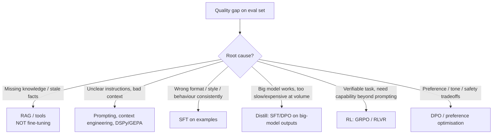

# Fine-tuning: LoRA/QLoRA, DPO, GRPO — and when not to

!!! abstract "At a glance"
    **Priority:** P1 · **Complexity:** 5/5 · **Est. time:** 6 h · **Phase:** 5 · **Prereqs:** [LLM fundamentals](llm-fundamentals.md), [Evals I](evals-error-analysis.md), [DSPy](dspy.md), [Inference serving](inference-serving.md)
    **You're done when:** you can justify fine-tune vs prompt vs RAG vs DSPy with an eval-backed decision, have LoRA-tuned a small model on the capstone triage task (SFT, optionally DPO/GRPO), served the adapter, and measured quality, cost and regression risk against the un-tuned baseline.

## Why it matters

Fine-tuning is the most over-reached-for and under-understood tool in the stack. Teams reach for it to "teach the model our knowledge" (RAG's job) or to fix prompt problems (prompting/DSPy's job), then discover they've bought a training pipeline, a model lifecycle and a regression surface. It shines in narrower situations: **consistent format/style/behaviour, distilling a large model's task into a small cheap one, latency/cost at high volume, tool-use and domain-specific skills, and RL on verifiable rewards (reasoning/agent behaviour)**.

In 2026 the tooling is mature (TRL, Unsloth, PEFT, vLLM multi-LoRA) and hosted fine-tuning exists from major providers, so the hard part is *judgement and evaluation*, not GPUs.

## Core concepts

### Decision ladder: when to fine-tune (and when not to)



| Fine-tune when… | Don't when… |
|---|---|
| You have ≥ hundreds-to-thousands of high-quality examples and a stable task | Facts change frequently (use retrieval) |
| Prompted frontier model works but cost/latency at your volume is too high | You haven't done error analysis or built evals |
| Strict output style/format that prompting can't hold reliably | A bigger model or better prompt closes the gap |
| Need on-prem/small model with domain behaviour | You can't maintain the model lifecycle (retrain per base-model release) |
| Verifiable reward exists (tests, validators, exact-match) → RL | Data is small, noisy or contains PII you can't use |

Senior heuristics: **knowledge → RAG; behaviour → fine-tune; instructions → prompt/DSPy.** And: fine-tuning on small data mostly teaches *format and style*, rarely new reasoning ability.

### Method landscape

| Method | Trains | Data | Purpose | Notes |
|---|---|---|---|---|
| **Full fine-tune** | All weights | 10k+ | Max quality/large shift | Memory ~ 16-20 bytes/param with Adam; rarely needed |
| **LoRA** | Low-rank adapters ΔW = BA on selected layers (r ≈ 8-64) | 100s-10k+ | Cheap task adaptation | Adapters are MBs; mergeable; multi-LoRA serving |
| **QLoRA** | LoRA on a 4-bit (NF4) quantized frozen base | Same | Fits 7-70B on a single GPU | Slightly lower quality; slower step time |
| **SFT** | Supervised next-token on (prompt, ideal response) | Curated pairs | Format, style, tool-use, distillation | Loss masking on prompt tokens; chat template must match inference |
| **DPO** (and variants: IPO, KTO, ORPO, SimPO) | Preference pairs (chosen, rejected), no reward model, no sampling loop | Thousands of pairs | Tone, safety, reducing verbosity/hallucination patterns | Stable and cheap; sensitive to β and data quality |
| **RLHF (PPO)** | Reward model + PPO | Large | Legacy heavy approach | Rarely used outside labs |
| **GRPO / RLVR** | Policy optimisation with group-relative advantages and **verifiable rewards** (no critic model) | Prompts + reward functions | Reasoning, tool-use, code, SQL, structured tasks | Sample `G` completions per prompt; advantage = (r − mean)/std within group; needs generation throughput (vLLM) |
| **Distillation** | SFT/DPO on teacher outputs (possibly GEPA-optimised pipeline traces) | 1k-100k | Small model imitates big pipeline | Check teacher licence/ToS |

LoRA intuition: freeze W (d×k), learn A (r×k) and B (d×r); output = Wx + (α/r)·BAx. Trainable params ≈ r(d+k) per layer — typically 0.1-1% of the model. Key hyperparameters: rank `r`, `lora_alpha` (scale), target modules (all linear layers is a strong default), dropout, learning rate (1e-4 to 2e-4 for LoRA SFT; ~1e-6 to 5e-6 for full-model RL), epochs (1-3 — more overfits).

### Code: LoRA SFT with TRL

```python
# uv add "trl" peft datasets transformers accelerate bitsandbytes
from datasets import load_dataset
from peft import LoraConfig
from trl import SFTConfig, SFTTrainer

# JSONL with {"messages": [{"role":"system|user|assistant","content":...}, ...]} — the model's chat format
ds = load_dataset("json", data_files={"train": "triage_train.jsonl", "eval": "triage_val.jsonl"})

peft_config = LoraConfig(r=16, lora_alpha=32, lora_dropout=0.05,
                         target_modules="all-linear", task_type="CAUSAL_LM")

cfg = SFTConfig(
    output_dir="triage-lora",
    num_train_epochs=2,
    per_device_train_batch_size=4, gradient_accumulation_steps=8,
    learning_rate=2e-4, lr_scheduler_type="cosine", warmup_ratio=0.05,
    bf16=True, logging_steps=10, eval_strategy="steps", eval_steps=50,
    assistant_only_loss=True,           # train only on assistant tokens (requires template support; check your TRL version)
    max_length=4096,
)
trainer = SFTTrainer(model="Qwen/Qwen3-8B", args=cfg, peft_config=peft_config,
                     train_dataset=ds["train"], eval_dataset=ds["eval"])
trainer.train()
trainer.save_model("triage-lora")       # adapter only (~100-300 MB)
```

For 4-bit QLoRA add a `BitsAndBytesConfig(load_in_4bit=True, bnb_4bit_quant_type="nf4", bnb_4bit_compute_dtype=torch.bfloat16)` via `model_init_kwargs`. Unsloth wraps the same recipe with custom kernels for ~2x speed and lower VRAM, and has RL (GRPO) recipes for consumer GPUs.

### Code: GRPO with verifiable rewards (TRL)

```python
from trl import GRPOConfig, GRPOTrainer
from peft import LoraConfig
import json

def valid_json_reward(completions, **kwargs):
    out = []
    for c in completions:
        text = c if isinstance(c, str) else c[0]["content"]
        try:
            obj = json.loads(text)
            out.append(1.0 if set(obj) == {"severity", "owner_team"} else 0.3)
        except Exception:
            out.append(0.0)
    return out

def correctness_reward(completions, severity, owner_team, **kwargs):   # dataset columns are passed by name
    rewards = []
    for c, sev, team in zip(completions, severity, owner_team):
        text = c if isinstance(c, str) else c[0]["content"]
        try:
            o = json.loads(text)
            rewards.append(0.7 * (o.get("severity") == sev) + 0.3 * (o.get("owner_team") == team))
        except Exception:
            rewards.append(0.0)
    return rewards

args = GRPOConfig(output_dir="triage-grpo", num_generations=8, max_completion_length=256,
                  per_device_train_batch_size=8, learning_rate=1e-6, num_train_epochs=1,
                  use_vllm=True, vllm_mode="colocate", vllm_gpu_memory_utilization=0.3)
trainer = GRPOTrainer(model="Qwen/Qwen3-8B", reward_funcs=[valid_json_reward, correctness_reward],
                      reward_weights=[0.3, 0.7], args=args, train_dataset=rl_dataset,
                      peft_config=LoraConfig(r=16, lora_alpha=32, target_modules="all-linear"))
trainer.train()
```

GRPO essentials: for each prompt sample `G` completions, compute rewards, normalise within the group to get advantages, update policy with clipped ratios (KL penalty `beta` defaults to 0 in current TRL). **Reward hacking** is the central risk — the model finds cheap ways to score (e.g. always output the modal class). Mitigate with held-out evals not used for reward, multiple reward components, format + correctness balance, length penalties, and manual inspection of high-reward samples.

### Data is the work

- **Quality > quantity**: 1-3k excellent, diverse examples routinely beat 50k noisy ones for SFT (LIMA effect).
- Sources: human-labelled, production traces filtered by outcome/feedback, **synthetic data from a stronger model** (check ToS), rejection-sampled outputs (generate N, keep those passing validators).
- Split train/val/test *by scenario/entity* not random rows (avoid leakage). Deduplicate. Keep a **golden regression set** that never enters training.
- Match the **chat template and system prompt** exactly between training and serving — the most common silent failure.
- PII/licensing review before training; models can memorise and regurgitate training data.
- Evaluate for **capability regression**: run general evals (instruction following, safety, tool-calling) before/after — narrow SFT can cause catastrophic forgetting and safety erosion.

### Serving adapters

- **vLLM multi-LoRA**: `--enable-lora --lora-modules triage=./triage-lora`; requests choose adapter by `model="triage"`. One base model, many tenant/task adapters; small per-adapter overhead.
- Merging (`merge_and_unload`) gives a standalone model for engines without adapter support, at the cost of one full copy per variant.
- Quantized base + adapter combos: verify quality post-quantization.

### Hosted fine-tuning

OpenAI, Google and some open-model hosts (Together, Fireworks) and Azure/Foundry offer managed SFT/preference/RFT-style tuning; easier operationally and often the fastest route for a frontier-family small model, but: lock-in to the provider's model versions (retrain on deprecation), data handling terms, and higher per-token inference prices for tuned models on some platforms. Compare against open-weights LoRA served yourself.

### Senior-level nuance

- **Establish the ceiling first**: prompt the best available model with best context; if it can't reach the target, fine-tuning a smaller model won't either (except distillation/format tasks).
- **Base model churn**: every new base model release invalidates adapters. Budget retraining automation — dataset versioning, reproducible training scripts, eval gates. If you can't automate retraining, prefer prompt/DSPy artifacts.
- **Judge for preference data**: DPO pairs from an LLM judge inherit the judge's biases (verbosity, position); validate on human labels.
- **RL needs verifiers**: if you can't write a reliable reward function, GRPO is a bad fit; consider SFT/DPO.
- **Cost of a run**: 8B QLoRA on 3k examples × 2 epochs ≈ under an hour on one 24-48 GB GPU (dollars). The expensive part is data curation, evals and ownership, not the GPU bill.
- **Evaluation contamination**: don't tune hyperparameters on the test set; report confidence intervals; multiple seeds for RL.

## Resources

| Resource | Type | Why this one | Level | Cost |
|---|---|---|---|---|
| [TRL docs](https://huggingface.co/docs/trl) | docs | SFT/DPO/GRPO trainers, reward function API | intermediate | free |
| [Hugging Face LLM course](https://huggingface.co/learn/llm-course) | course | Fine-tuning fundamentals and hands-on | intermediate | free |
| [PEFT docs](https://huggingface.co/docs/peft) | docs | LoRA config, merging, adapters | intermediate | free |
| [Unsloth RL guide](https://unsloth.ai/docs/get-started/reinforcement-learning-rl-guide) :gem: | docs | Practical GRPO on modest GPUs, reward design tips | advanced | free |
| [Unsloth](https://github.com/unslothai/unsloth) | docs | Fast/low-VRAM LoRA/QLoRA/RL notebooks | intermediate | free |
| [LoRA paper (arXiv 2106.09685)](https://arxiv.org/abs/2106.09685) | paper | The original low-rank adaptation argument | advanced | free |
| [QLoRA paper (arXiv 2305.14314)](https://arxiv.org/abs/2305.14314) | paper | NF4, double quantization, paged optimizers | advanced | free |
| [DPO paper (arXiv 2305.18290)](https://arxiv.org/abs/2305.18290) | paper | Preference optimisation without a reward model | advanced | free |
| [DeepSeekMath / GRPO paper (arXiv 2402.03300)](https://arxiv.org/abs/2402.03300) | paper | Origin of GRPO | advanced | free |
| [Thinking Machines: LoRA Without Regret](https://thinkingmachines.ai/blog/lora/) :gem: | article | When LoRA matches full fine-tuning; rank/LR guidance, RL with tiny rank | advanced | free |

## Hands-on lab

**Goal (3 h, single 24-48 GB GPU or Colab/rented):** fine-tune the triage classifier and decide with data.

1. **Baseline & ceiling** (20 min): from [DSPy](dspy.md) lab, take the test-set accuracy of (a) hand prompt on the 8B model, (b) GEPA-optimised prompt, (c) frontier model prompt.
2. **Data** (40 min): build 1,500 training examples from labelled alerts plus rejection-sampled frontier outputs that pass validators; split by service; keep the golden test set untouched; write the chat-template renderer once and reuse it for train and inference.
3. **SFT LoRA** (40 min): run the TRL script; log train/eval loss; save the adapter.
4. **Evaluate** (20 min): test accuracy, SEV1 recall, JSON validity rate, latency; also run a 30-question general regression set (instruction following, refusal behaviour) before/after.
5. **(Optional) GRPO** (60 min): 200 steps with the two reward functions on a 3k-prompt set; inspect top-reward samples for hacking.
6. **Serve** (20 min): vLLM with `--enable-lora`; register via LiteLLM alias `triage-ft`; run the capstone eval through the gateway.
7. **Decision memo** (20 min): compare quality/cost/maintenance across prompt, GEPA, LoRA, frontier; recommend.

**Expected output:** comparison table and memo. A common honest outcome: LoRA SFT beats a hand-prompted 8B by 10-25 pts, matches or slightly trails GEPA + frontier, at ~20-50x lower per-call cost — with a retraining obligation.

## Questions

### L1 — Recall

??? question "Q1. Explain LoRA in two sentences and give typical rank and trainable-parameter fraction."
    ??? success "Answer"
        LoRA freezes pretrained weights and learns a low-rank update ΔW = BA (rank r, typically 8-64) added to selected layers, scaled by α/r. It trains roughly 0.1-1% of parameters, and the resulting adapter is small and can be merged or hot-swapped.

??? question "Q2. What distinguishes QLoRA from LoRA?"
    ??? success "Answer"
        The frozen base model is loaded in 4-bit NF4 quantization (with double quantization and paged optimizers) while LoRA adapters train in higher precision, cutting memory dramatically so 30-70B models fit on one GPU, at some speed/quality cost.

??? question "Q3. How does GRPO compute advantages, and what's the main difference from PPO?"
    ??? success "Answer"
        For each prompt sample a group of G completions, score them, and normalise rewards within the group ((r − mean)/std) as the advantage. There is no learned value/critic model, unlike PPO, which lowers memory and complexity; it pairs naturally with verifiable rewards.

??? question "Q4. What data format does DPO need?"
    ??? success "Answer"
        Preference triples: prompt, chosen response, rejected response. It optimises the policy to prefer chosen over rejected relative to a reference model, without training a separate reward model.

### L2 — Apply

??? question "Q5. After SFT your model produces garbled/incorrect formatting only in production. What do you check first?"
    ??? success "Answer"
        Chat template/system prompt mismatch between training and serving (special tokens, role names, BOS/EOS), plus tokenizer version, and stop-token settings. Render one training example and one production request with the same function and diff token IDs; ensure `assistant_only_loss` masking was correct and the served model loads the intended adapter/base combination.

??? question "Q6. Estimate LoRA trainable parameters for r=16 on a model with 32 layers applying to 7 linear modules per layer, each roughly 4096×4096 (simplification)."
    ??? success "Answer"
        Per module r(d+k) = 16 × 8192 = 131,072. 7 modules × 32 layers = 224 modules → ~29.4M trainable parameters (~0.37% of 8B). (Real MLP dimensions differ, so actual counts are somewhat larger.)

??? question "Q7. Your GRPO run's reward climbs but held-out accuracy falls. What's happening and what do you do?"
    ??? success "Answer"
        Reward hacking/overfitting to the reward function (e.g. degenerate outputs exploiting the format reward or class prior). Inspect top-reward completions, add held-out evals unrelated to the training reward, rebalance/adjust reward components, add length/diversity controls, reduce learning rate or steps, enlarge/diversify prompts, and consider KL regularisation (β > 0).

### L3 — Design & trade-offs

??? question "Q8. For an internal policy Q&A bot the CEO asks to 'fine-tune the model on our documents'. Respond."
    ??? success "Answer"
        Documents change and need citations, access control and updates — that's RAG (with hybrid search and reranking). Fine-tuning on documents unreliably injects facts, can't enforce per-user permissions, and goes stale. Possible small fine-tune for tone/format or a domain-tuned embedding/reranker after error analysis. Present an eval comparing RAG vs fine-tuned closed-book on questions requiring current documents.

??? question "Q9. Choose among prompt-optimisation (GEPA), LoRA SFT, and hosted fine-tuning for a high-volume extraction task at 30M calls/month."
    ??? success "Answer"
        Start with GEPA on the cheapest capable model (fast, reversible). If quality/cost still miss targets, LoRA SFT a small open model with distilled data from the best pipeline and serve via vLLM multi-LoRA — best unit economics at 30M calls. Hosted fine-tuning if the org lacks GPU ops and the provider's tuned small model meets price/latency. Decision factors: token economics, retraining automation, data residency, model lifecycle risk, and eval-proven quality.

??? question "Q10. SFT vs DPO vs GRPO for making an agent choose the right tool more reliably."
    ??? success "Answer"
        SFT on curated successful trajectories teaches the format and common patterns cheaply. DPO on (good trajectory, bad trajectory) pairs can suppress specific failure modes. GRPO/RLVR fits when there's an automatic verifier (did the tool call yield correct final state?) and you can generate many rollouts in a sandbox. Sequence: improve tool descriptions and evals first; SFT if consistent format issues remain; RL only with reliable verifiers and infrastructure.

### L4 — Staff-level ambiguity

??? question "Q11. Your team fine-tuned models on last year's base; a much better base model just released. How do you avoid being permanently behind?"
    ??? success "Answer"
        Build the fine-tuning pipeline as reproducible CI: versioned datasets, deterministic training scripts, automatic evals and a promotion gate; re-run on each new base with a budget; keep prompts/DSPy artifacts as the fallback path; measure whether new bases with prompting now beat old tuned models (often yes) — retire fine-tunes that no longer earn their maintenance. Standardise adapters via multi-LoRA serving to reduce deployment cost; document deprecation triggers.

??? question "Q12. Legal and security ask about training on customer conversations. What's your position and mechanism?"
    ??? success "Answer"
        Only with explicit contractual/consent basis and purpose limitation; prefer synthetic or consented/de-identified data; PII detection and redaction; tenant-scoped adapters if data can't cross customers; data retention and deletion process covering datasets and trained artifacts (deletion in weights is hard — another reason to prefer RAG/memory for personal data); access control on training data; membership-inference/memorisation testing; audit log. Document residual risk and sign-off.

## Real-world use cases

- **Alert triage at scale** (logistics ops): LoRA-tuned 8B classifier distilled from a frontier pipeline; adapters per business unit.
- **SQL/query generation** with execution-based rewards via GRPO on a private schema.
- **Document field extraction**: SFT on carrier-specific templates to hit strict JSON formats at low latency.
- **On-device/edge assistants**: fine-tuned small models for offline terminals.
- **Tone/brand adaptation** with DPO on preference pairs from support quality reviews.

## Pitfalls & anti-patterns

- Fine-tuning to inject facts instead of using RAG.
- No eval set or leaked test data; reporting training accuracy.
- Template mismatch between training and serving.
- Ignoring capability/safety regression after narrow SFT.
- RL without a reliable verifier; unnoticed reward hacking.
- Training on unreviewed PII or on data whose licence forbids it.
- No plan for base-model upgrades.

## Checklist

- [ ] I can apply the decision ladder (RAG / prompt / DSPy / SFT / DPO / RL) with evidence
- [ ] I LoRA-tuned a small model on the triage task with a clean test split
- [ ] I checked regression on general capabilities and served the adapter via vLLM
- [ ] I wrote a decision memo comparing quality, cost and maintenance
- [ ] I answered all L3 questions out loud in < 3 min each
