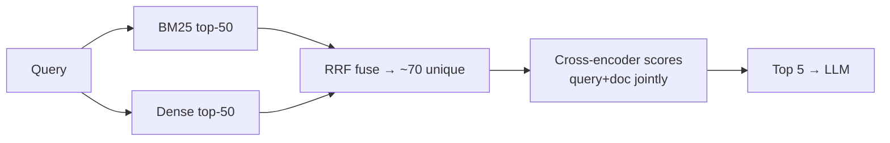

# Hybrid search & reranking

!!! abstract "At a glance"
    **Priority:** P0 · **Complexity:** 3/5 · **Est. time:** 3 h · **Phase:** 2 · **Prereqs:** [RAG fundamentals](rag-fundamentals.md)
    **You're done when:** the copilot's retrieval uses BM25/FTS + dense with RRF and a cross-encoder reranker, and you can show per-slice recall@5 improvements (especially on identifier-heavy queries) with the latency cost measured.

## Why it matters

Pure dense retrieval is great at meaning ("the booking service is slow after the release") and bad at exact tokens ("`EDI-4471`", "`MAEU1234567`", "`ORA-00060`"). Pure lexical search is the opposite. In enterprise corpora — full of product codes, error IDs, service names, and acronyms — you need both. Then a **reranker** fixes the ordering, because first-stage retrievers are optimised for speed, not precision.

As of 2026 the default production recipe is: **hybrid retrieval (lexical + dense + metadata filters) → fuse (RRF) → cross-encoder rerank top-50 → pass top-5 to the LLM.** It's usually the single biggest quality jump after fixing parsing and chunking, and it's a guaranteed interview discussion.

## Core concepts

### Lexical retrieval: BM25 in one paragraph

BM25 scores a document for a query by summing, over query terms, **IDF** (rare terms matter more) × a **saturating term-frequency** component (the 10th occurrence adds less than the 2nd), normalised by document length (parameters k1 ≈ 1.2–2.0, b ≈ 0.75). It's exact-match on tokens after analysis (lowercasing, stemming, stopwords). Strengths: identifiers, rare jargon, zero training, explainable. Weaknesses: synonyms and paraphrase ("outage" vs "downtime"), typos, multilingual.

In Postgres you have options: built-in **full-text search** (`tsvector`, `ts_rank_cd` — not true BM25 but workable), or BM25 extensions (e.g. ParadeDB's `pg_search`). Elasticsearch/OpenSearch, Qdrant (sparse vectors / BM25), Weaviate, Azure AI Search, and Vespa offer BM25 natively.

**Learned sparse** retrieval (SPLADE-style) expands documents/queries with related terms into sparse vectors — lexical precision with some semantic recall. Useful middle ground; supported by several vector DBs.

### Dense vs sparse vs hybrid

| | Lexical (BM25) | Dense (embeddings) | Hybrid |
|---|---|---|---|
| Exact IDs / codes | Excellent | Poor | Excellent |
| Paraphrase / synonyms | Poor | Excellent | Excellent |
| Out-of-domain jargon | Good | Varies by model | Good |
| Explainability | High | Low | Medium |
| Cost | Cheap (inverted index) | Embedding + ANN | Both |

### Fusion: Reciprocal Rank Fusion (RRF)

Scores from BM25 and cosine similarity live on different scales; normalising and weighting them (linear combination) is fiddly and brittle. **RRF** uses only ranks:

`RRF(d) = Σ_retrievers 1 / (k + rank_r(d))`, with **k = 60** by convention.

- Robust with no tuning; a document ranked highly by either retriever rises.
- Weighted RRF (multiply each term) lets you favour one retriever for certain query types.
- Alternative: convex combination of normalised scores (can beat RRF when carefully tuned on a golden set, e.g. α = 0.5–0.7 toward dense).

### Rerankers: why a second stage helps



- **Bi-encoders** (embedding models) encode query and document *independently*; similarity is a dot product. Fast (precompute docs; ANN search over millions) but the document vector is a lossy summary computed without knowing the query.
- **Cross-encoders** feed `[query, document]` *together* through a transformer, so every query token attends to every document token; output is a relevance score. Much more accurate, but you must run the model per (query, doc) pair — impossible over millions, perfect for 20–100 candidates.
- **Late interaction** (ColBERT): store per-token embeddings for docs, compute MaxSim at query time — between the two in accuracy and cost, heavy storage.
- **LLM rerankers:** prompt an LLM to score/sort candidates (listwise). Strong but slower and pricier; useful for low-QPS, high-value queries.

Typical options (as of Sept 2026): Cohere Rerank (hosted, also on Azure/Bedrock), Voyage rerankers, Jina rerankers, open-weight BGE rerankers (e.g. `BAAI/bge-reranker-v2-m3`), mxbai rerankers; run open ones via sentence-transformers, TEI, or Infinity.

### Numbers of thumb

| Parameter | Typical value |
|---|---|
| First-stage candidates per retriever | 20–100 (50 is a good start) |
| Rerank input | 30–100 unique docs |
| Passed to LLM | 3–8 chunks |
| Cross-encoder latency (GPU, 50 docs × ~300 tokens) | tens of ms to ~200 ms depending on model size; CPU is several times slower |
| Hosted rerank API | ~100–400 ms incl. network |
| Expected gain | Rerankers commonly add 5–15+ points of recall@5 / nDCG@10 over first-stage ranking on real corpora — *measure yours* |

Latency budget for a copilot answer (non-streaming part): query embed 20–50 ms + hybrid SQL 20–80 ms + rerank 50–200 ms ≈ **< 350 ms** retrieval, leaving the rest to generation.

### Query-side improvements

- **Metadata filters** extracted from the query (service, date range, doc type) — cheap structured-output call or regex.
- **Query rewriting**: conversational follow-ups ("and what about eu-west?") rewritten into standalone queries using chat history. Almost mandatory for chat.
- **Multi-query / HyDE** (generate a hypothetical answer and embed it): helps recall on vague queries; costs an LLM call — use selectively ([advanced RAG](advanced-rag.md)).
- **Identifier detection:** regex for known ID formats → exact-match boost or filter.

### Evaluate per slice

Aggregate recall hides wins and regressions. Slice the golden set: identifier queries, paraphrase queries, multi-hop, short/vague, by service. Hybrid typically lifts the identifier slice dramatically and leaves paraphrase roughly flat; the reranker lifts everything at the top ranks.

### What juniors miss

- Linear-combining raw BM25 and cosine scores without normalisation.
- Reranking only the top-5 (nothing to reorder) or passing 30 chunks to the LLM "since we reranked".
- Using a reranker with a max input length shorter than chunks (silent truncation).
- Not accounting for reranker latency at p95 under load (batching!).
- Postgres FTS with the `english` config stemming away parts of identifiers.

## Resources

| Resource | Type | Why this one | Level | Cost |
|---|---|---|---|---|
| [Pinecone — Rerankers and two-stage retrieval](https://www.pinecone.io/learn/series/rag/rerankers/) | article | Clearest explanation of bi- vs cross-encoders and why two-stage retrieval works | intermediate | free |
| [Supabase — Hybrid search](https://supabase.com/docs/guides/ai/hybrid-search) :gem: | docs | Copy-pasteable Postgres FTS + pgvector + RRF SQL function | intermediate | free |
| [Sentence Transformers — Cross-Encoders](https://www.sbert.net/examples/cross_encoder/applications/README.html) | docs | How to run/finetune cross-encoders locally; retrieve & rerank examples | intermediate | free |
| [Qdrant — Hybrid queries](https://qdrant.tech/documentation/concepts/hybrid-queries/) | docs | Prefetch + fusion (RRF/DBSF) + multi-stage queries in a vector DB | intermediate | free |
| [Elastic — Reciprocal rank fusion](https://www.elastic.co/guide/en/elasticsearch/reference/current/rrf.html) | docs | Concise definition of RRF and its parameters | intermediate | free |
| [Jina — What is ColBERT and late interaction](https://jina.ai/news/what-is-colbert-and-late-interaction-and-why-they-matter-in-search/) :gem: | article | Visual intuition for bi-encoder vs cross-encoder vs late interaction | advanced | free |
| [Cohere — Rerank overview](https://docs.cohere.com/docs/rerank-overview) | docs | Hosted reranker API semantics and usage | intermediate | freemium |
| [Anthropic — Contextual Retrieval](https://www.anthropic.com/news/contextual-retrieval) | article | Measured stack of contextual embeddings + BM25 + reranking | intermediate | free |

## Hands-on lab

**Goal:** upgrade the copilot's retrieval to hybrid + rerank and measure per slice. (2–3 h)

1. Add a full-text column and index to the `chunks` table from the RAG lab. Use the `simple` config so identifiers survive:

    ```sql
    ALTER TABLE chunks ADD COLUMN fts tsvector
      GENERATED ALWAYS AS (to_tsvector('simple', section_path || ' ' || content)) STORED;
    CREATE INDEX ON chunks USING gin (fts);
    ```

2. Hybrid query with RRF in one SQL statement:

    ```sql
    WITH dense AS (
      SELECT id, row_number() OVER (ORDER BY embedding <=> %(qvec)s) AS r
      FROM chunks WHERE (%(svc)s::text IS NULL OR service = %(svc)s)
      ORDER BY embedding <=> %(qvec)s LIMIT 50
    ), lexical AS (
      SELECT id, row_number() OVER (ORDER BY ts_rank_cd(fts, q) DESC) AS r
      FROM chunks, websearch_to_tsquery('simple', %(qtext)s) q
      WHERE fts @@ q AND (%(svc)s::text IS NULL OR service = %(svc)s)
      ORDER BY ts_rank_cd(fts, q) DESC LIMIT 50
    )
    SELECT id, COALESCE(1.0/(60 + d.r), 0) + COALESCE(1.0/(60 + l.r), 0) AS rrf
    FROM dense d FULL OUTER JOIN lexical l USING (id)
    ORDER BY rrf DESC LIMIT 50;
    ```

3. Rerank with an open cross-encoder (`uv add sentence-transformers`):

    ```python
    from sentence_transformers import CrossEncoder

    reranker = CrossEncoder("BAAI/bge-reranker-v2-m3", max_length=512)  # config value

    def rerank(query: str, docs: list[tuple[int, str]], top_n: int = 5):
        scores = reranker.predict([(query, text) for _, text in docs], batch_size=32)
        ranked = sorted(zip(docs, scores), key=lambda x: x[1], reverse=True)
        return [(doc_id, float(s)) for (doc_id, _), s in ranked[:top_n]]
    ```

4. Run the golden set (extend to ~80 questions, tagged by slice: `identifier`, `paraphrase`, `vague`, `multi-hop`) through four configs: dense, lexical, hybrid, hybrid+rerank.
5. Report recall@5, recall@20, MRR per slice and retrieval p50/p95 latency.

*Expected shape:*

```
config          id_recall@5  para_recall@5  all_recall@5  MRR   p95_ms
dense           0.45         0.82           0.68          0.55  45
lexical         0.88         0.51           0.66          0.58  20
hybrid (RRF)    0.90         0.80           0.83          0.66  70
hybrid+rerank   0.93         0.88           0.90          0.79  260
```

Wire `hybrid+rerank` into the `search_runbooks` tool. Record the latency budget in `COSTMODEL.md`.

## Questions

### L1 — Recall

??? question "Q1. Why does dense retrieval struggle with identifiers like error codes?"
    ??? success "Answer"
        Embedding models compress text into a fixed vector that captures semantics learned from training data; rare strings like `EDI-4471` are split into sub-word tokens with little learned meaning, so their contribution to the vector is weak and similar-looking codes collapse together. Lexical search matches the exact token and weights it highly by IDF because it's rare — exactly the behaviour you want for identifiers.

??? question "Q2. Write the RRF formula and explain why k≈60."
    ??? success "Answer"
        `RRF(d) = Σ_r 1/(k + rank_r(d))`. The constant k dampens the dominance of the very top ranks, so a document ranked 1st by one retriever doesn't overwhelm one ranked 3rd by both; k=60 came from the original paper's experiments and works robustly across datasets without tuning. Smaller k emphasises top ranks more.

??? question "Q3. Contrast bi-encoders and cross-encoders."
    ??? success "Answer"
        Bi-encoders embed query and document separately; documents are pre-embedded and searched with ANN — fast and scalable but less accurate because the document representation is query-agnostic. Cross-encoders process the concatenated query and document jointly with full attention and output a relevance score — much more accurate, but cost scales with the number of pairs, so they're used to rerank a small candidate set.

### L2 — Apply

??? question "Q4. Your reranker adds 450 ms p95 at 30 QPS on CPU. Options?"
    ??? success "Answer"
        Reduce work: rerank fewer candidates (70 → 30 after dedupe) and truncate docs to the most relevant window; use a smaller reranker model (distilled/"base" variant) and check the quality delta on the golden set; batch pairs efficiently; move to GPU or a serving engine (TEI/Infinity/ONNX with quantization); cache rerank results for repeated queries; or use a hosted reranker if latency and data policy permit. Also consider skipping rerank when the first-stage top score is very confident. Measure recall@5 vs p95 trade-off curve and pick deliberately.

??? question "Q5. Chat users ask follow-ups like 'what about the rollback steps?'. Retrieval returns junk. Fix."
    ??? success "Answer"
        Add a **query rewriting** step: a small model takes the last few turns and outputs a standalone query ("booking-api database failover rollback steps") plus extracted filters (service=booking-api) as structured output. Retrieve on the rewritten query. Evaluate with a conversational slice in the golden set. Keep the original user text for the generation prompt.

??? question "Q6. Should you linearly combine BM25 and cosine scores? When might it beat RRF?"
    ??? success "Answer"
        Only after normalising (e.g. min-max per query or z-scores), because raw BM25 is unbounded and query-dependent while cosine is in [-1, 1]. A tuned convex combination (`α·dense + (1-α)·lexical`) can beat RRF when you have a solid golden set and stable score distributions because it uses score magnitudes, not just ranks. RRF is the robust default when you lack tuning data or distributions shift across query types. Tune α per slice if query types are detectable.

### L3 — Design & trade-offs

??? question "Q7. Postgres (FTS + pgvector) vs Elasticsearch/OpenSearch vs a vector DB for hybrid search at 5M chunks. Decide."
    ??? success "Answer"
        Postgres keeps one system, transactional consistency with metadata/ACLs, simple ops, and is ample at 5M chunks with HNSW + GIN — but built-in FTS ranking isn't true BM25 (extensions can fix that) and complex hybrid queries are hand-written SQL. Elasticsearch/OpenSearch has best-in-class lexical features (analysers, BM25, highlighting) plus kNN and native RRF, at the cost of another cluster. A vector DB (Qdrant/Weaviate) offers first-class hybrid/fusion and quantization with good filtering, but lexical features are thinner than ES. If the team already runs Postgres and scale is moderate, start there (it's the capstone's choice) and move when evidence (latency, relevance features) demands; if you already run ES for search, extend it.

??? question "Q8. Cross-encoder vs LLM listwise reranking for a legal-contract search tool with 200 queries/day."
    ??? success "Answer"
        At 200 queries/day, cost and latency are less binding, and legal relevance is nuanced (clause semantics, exceptions), so an LLM reranker can add accuracy — especially with instructions encoding domain relevance criteria. But it's slower (seconds), non-deterministic, and harder to calibrate. A strong cross-encoder is fast, deterministic, and cheap. Pragmatic: cross-encoder first stage rerank to top-20, LLM listwise rerank to top-5 for high-value queries, evaluated on nDCG@5 with lawyer-labelled judgements. Choose based on measured gain vs latency tolerance.

??? question "Q9. Fine-tune an embedding model or add a reranker first?"
    ??? success "Answer"
        Add a reranker first: no training data pipeline, immediate gains at the top ranks, easy to swap. Fine-tuning embeddings requires labelled pairs (thousands), careful hard-negative mining, re-indexing the corpus, and ongoing versioning — worthwhile when first-stage recall@50 is the bottleneck (the relevant doc isn't even in candidates) on domain-specific vocabulary. Check recall@50: if it's high but recall@5 low → reranker; if recall@50 is low → fix first stage (hybrid, chunking, then maybe fine-tuning).

### L4 — Staff-level ambiguity

??? question "Q10. The search team (Elasticsearch experts) and the AI team (vector DB fans) disagree on the retrieval platform. How do you resolve it?"
    ??? success "Answer"
        Move from opinions to a shared benchmark: jointly build a golden set across key use cases with slices, and define non-functional requirements (latency, scale, ACLs, ops, cost). Run a time-boxed bake-off of 2–3 configurations using both teams' expertise. Decide via an ADR with explicit criteria and re-evaluation triggers. Often the answer is "extend the existing ES platform with vectors and a reranker service" or "Postgres for small corpora, ES for large" — and organisationally, a joint retrieval guild so expertise merges rather than competes.

??? question "Q11. Product wants 'Google-quality' search over internal docs in one quarter. What do you commit to?"
    ??? success "Answer"
        Commit to measurable outcomes, not a slogan: e.g. recall@5 ≥ 0.85 and answer acceptance ≥ 70% on a golden set built from real queries, p95 < 1.5 s. Plan: week 1–2 golden set + baseline; weeks 3–6 parsing/chunking fixes, hybrid, reranking, query rewriting; weeks 7–10 feedback loop (thumbs, click logs) and freshness; weeks 11–12 hardening and dashboards. Be explicit about what's out of scope (personalisation, learning-to-rank from clicks) and the dependency on document quality — often the biggest limiter is outdated content, so include content ownership in the plan.

## Real-world use cases

- **Container & booking lookup:** hybrid makes `MAEU…` container numbers and booking references retrievable alongside natural-language questions.
- **Error-code knowledge base:** lexical dominates for `ORA-`/`EDI-` codes; dense handles "timeouts talking to the carrier API".
- **Policy search:** reranker surfaces the precise clause among many near-duplicates across policy versions.
- **E-commerce/product search:** SKU exact matches plus semantic browse queries — the classic hybrid case.

## Pitfalls & anti-patterns

- Dense-only retrieval in an identifier-heavy domain.
- Un-normalised score blending.
- Reranking too few or too many candidates; ignoring reranker max length.
- Stemming configs that mangle codes.
- Only aggregate metrics; no per-slice evaluation.
- No latency budget for reranking under load.

## Checklist

- [ ] I can explain BM25, RRF, bi- vs cross-encoders and late interaction
- [ ] I implemented hybrid SQL with RRF and a cross-encoder reranker
- [ ] I measured per-slice recall and retrieval latency for four configurations
- [ ] I can defend a first-stage/rerank candidate budget
- [ ] I answered all L3 questions out loud in < 3 min each
