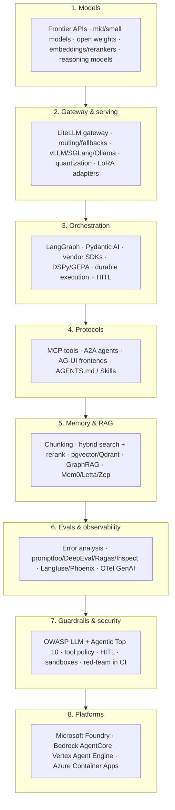

# Agentic AI & LLM Engineering

Goal of this track: **ship production agentic systems in 2026** as a Staff/AI architect: pick the right abstraction level, evaluate rigorously, keep it secure and affordable, and operate it. Everything builds toward one capstone.

!!! abstract "Capstone: Agentic Ops Copilot"
    A LangGraph orchestrator delegating to Pydantic AI sub-agents, which use MCP tool servers (one Python, one Spring AI), backed by hybrid RAG over runbooks/incidents, with evals in CI, Langfuse tracing, layered guardrails and a LiteLLM gateway. Runs locally with docker-compose + Ollama; deploys to Azure Container Apps + Microsoft Foundry.

## The 2026 stack at a glance

Read it bottom-up for *dependencies* (you need models and serving before orchestration) and top-down for *risk* (platforms and security constrain what you can build).

## All 29 topics

Order follows the topic contract. Phases are the roadmap phase where each topic is first scheduled.

| # | Topic | Priority | Complexity | Phase | Hours |
|---|---|---|---|---|---|
| 1 | [LLM fundamentals: tokens, transformers, sampling, reasoning models](llm-fundamentals.md) | P0 | 3 | 1 | 4 |
| 2 | [Prompting & structured outputs](prompting-structured-outputs.md) | P0 | 2 | 1 | 3 |
| 3 | [Context engineering](context-engineering.md) | P0 | 3 | 1 | 3 |
| 4 | [Agent & workflow patterns (Building Effective Agents)](agent-patterns.md) | P0 | 3 | 1 | 3 |
| 5 | [Tool calling & function design](tool-calling.md) | P0 | 2 | 1 | 2 |
| 6 | [RAG fundamentals: chunking, embeddings, retrieval](rag-fundamentals.md) | P0 | 3 | 2 | 4 |
| 7 | [Hybrid search & reranking](hybrid-search-reranking.md) | P0 | 3 | 2 | 3 |
| 8 | [Vector databases: pgvector, Qdrant & friends](vector-databases.md) | P0 | 3 | 2 | 3 |
| 9 | [Advanced RAG: agentic RAG, GraphRAG, LazyGraphRAG](advanced-rag.md) | P1 | 4 | 5 | 4 |
| 10 | [Evals I: error analysis, LLM-as-judge, eval-driven development](evals-error-analysis.md) | P0 | 4 | 2 | 5 |
| 11 | [Evals II: promptfoo, DeepEval, Ragas, Inspect in CI](eval-tooling.md) | P0 | 3 | 2 | 3 |
| 12 | [LLM observability: Langfuse, Phoenix, OTel GenAI semconv](llm-observability.md) | P0 | 3 | 2 | 3 |
| 13 | [LangGraph: graphs, state, checkpoints](langgraph.md) | P0 | 4 | 3 | 6 |
| 14 | [Durable execution & human-in-the-loop](durable-execution-hitl.md) | P0 | 4 | 3 | 3 |
| 15 | [Pydantic AI](pydantic-ai.md) | P0 | 2 | 3 | 4 |
| 16 | [DSPy & prompt optimization (GEPA)](dspy.md) | P1 | 4 | 5 | 4 |
| 17 | [Vendor agent SDKs: Claude Agent SDK, OpenAI Agents SDK, Google ADK, MS Agent Framework](vendor-agent-sdks.md) | P1 | 3 | 3 | 4 |
| 18 | [Model Context Protocol (MCP)](mcp.md) | P0 | 3 | 3 | 5 |
| 19 | [A2A & AG-UI protocols](a2a-ag-ui.md) | P1 | 3 | 3 | 3 |
| 20 | [Agent memory systems (Mem0, Letta, Zep)](memory-systems.md) | P1 | 3 | 3 | 3 |
| 21 | [Multi-agent systems: when, how, and failure modes](multi-agent-systems.md) | P0 | 4 | 3 | 4 |
| 22 | [Guardrails & security: OWASP LLM/Agentic Top 10, prompt injection](guardrails-security.md) | P0 | 4 | 4 | 5 |
| 23 | [Cost & latency optimization: caching, batching, streaming](cost-latency-optimization.md) | P0 | 3 | 4 | 3 |
| 24 | [Model selection, routing & gateways (LiteLLM)](model-routing-gateways.md) | P0 | 3 | 4 | 3 |
| 25 | [Inference serving: vLLM, SGLang, Ollama, quantization](inference-serving.md) | P1 | 4 | 5 | 4 |
| 26 | [Fine-tuning: LoRA/QLoRA, DPO, GRPO — and when not to](fine-tuning.md) | P1 | 5 | 5 | 6 |
| 27 | [Managed platforms: Microsoft Foundry, Bedrock AgentCore](managed-agent-platforms.md) | P1 | 3 | 4 | 3 |
| 28 | [AI-assisted development: coding agents, AGENTS.md, skills](ai-assisted-development.md) | P0 | 2 | 1 | 2 |
| 29 | [Shipping LLM features to production: the checklist](production-checklist.md) | P0 | 3 | 4 | 2 |

Total: about 104 hours across the track. Also see the [track question bank](questions.md).

## Recommended path

| Phase | Focus | Topics | Capstone milestone |
|---|---|---|---|
| **1** | Foundations and habits | 1-5, 28 | Repo with AGENTS.md; a single tool-calling agent with structured output |
| **2** | Retrieval and evals (do evals *before* fancy orchestration) | 6-8, 10-12 | Hybrid RAG over runbooks; eval set + Langfuse tracing |
| **3** | Orchestration and protocols | 13-15, 17-21 | LangGraph + Pydantic AI sub-agents; MCP servers (Python + Spring AI); memory |
| **4** | Production hardening | 22-24, 27, 29 | Guardrails, LiteLLM gateway, cost work, Foundry deploy, PRR |
| **5** | Depth and specialisation | 9, 16, 25, 26 | GEPA-optimised prompts; local vLLM; optional LoRA |

Non-negotiable ordering rules: **evals before optimisation** (DSPy, fine-tuning, routing all need them), **security before autonomy** (guardrails before write tools), **measurement before cost work**.

## Framework choice guide

| Situation | Reach for | Why | Watch out for |
|---|---|---|---|
| Explicit control flow, durable state, HITL, long-running | **LangGraph** ([1.x](langgraph.md)) | Checkpointing, interrupts, streaming, ecosystem | Boilerplate; graph sprawl |
| Typed agents/sub-agents, structured output, model-agnostic | **Pydantic AI** ([v1](pydantic-ai.md)) | Types end-to-end, MCP/A2A/AG-UI support, Logfire/OTel | Younger multi-agent story; pair with LangGraph for orchestration |
| Systematic prompt/pipeline optimisation with a metric | **DSPy + GEPA** ([DSPy](dspy.md)) | Optimises instructions per model automatically | Needs dataset + metric; can overfit |
| Agent that edits files / runs commands over long tasks | **Claude Agent SDK** ([SDKs](vendor-agent-sdks.md)) | Harness, permissions, hooks, subagents | Must sandbox; Claude models |
| Chat/voice agent with handoffs and guardrails on OpenAI | **OpenAI Agents SDK** | Minimal primitives, tracing, sessions | Default trace export; OpenAI-centric |
| GCP/Gemini or multi-language teams | **Google ADK 2.0** | Workflow runtime, Java/Go/TS support | Gemini-first ergonomics |
| Azure/.NET estate, Foundry hosting | **Microsoft Agent Framework 1.0** | Middleware, workflows, Foundry hosted agents | Newer; migration from SK/AutoGen |
| AWS-native | **Strands Agents + AgentCore** ([platforms](managed-agent-platforms.md)) | Default templates, managed runtime | AWS coupling |
| Java/Spring shops | **Spring AI 2.0** (see [Java track](../java-spring-ai/spring-ai-agents.md)) | Boot 4 integration, `@McpTool` | Smaller agent ecosystem than Python |
| Document/RAG-centric pipelines | LlamaIndex Workflows / LangChain retrievers + your own eval | Rich loaders and indexes | Abstraction depth; keep retrieval measurable |
| Cross-team agent interop | **A2A** + MCP ([protocols](a2a-ag-ui.md)) | Standard contracts | Only where boundaries are real |

Default recommendation for a new Python agent product in Sept 2026: **plain Python + Pydantic AI for typed steps, LangGraph when you need durable multi-step control flow, MCP for tools, LiteLLM gateway, Langfuse tracing, evals in CI.** Add DSPy for optimisation, vendor SDKs where they clearly earn their place.

## Key books, courses and reading

| Resource | Type | Use it for |
|---|---|---|
| [Anthropic: Building effective agents](https://www.anthropic.com/engineering/building-effective-agents) | article | The canonical patterns ladder; re-read quarterly |
| [Anthropic: Effective context engineering](https://www.anthropic.com/engineering/effective-context-engineering-for-ai-agents) | article | Context as a budgeted resource |
| [Chip Huyen: AI Engineering (O'Reilly)](https://github.com/chiphuyen/aie-book) | book | Systems view of evals, RAG, agents, deployment |
| [Hamel Husain: Evals FAQ](https://hamel.dev/blog/posts/evals-faq/) | article | Eval-driven development in practice |
| [applied-llms.org](https://applied-llms.org/) | article | Operational lessons from practitioners |
| [Hugging Face Agents course](https://huggingface.co/learn/agents-course) | course | Free hands-on agent fundamentals |
| [Hugging Face MCP course](https://huggingface.co/learn/mcp-course) | course | Build MCP clients and servers |
| [LangChain Academy: Intro to LangGraph](https://academy.langchain.com/courses/intro-to-langgraph) | course | Free LangGraph fundamentals |
| [DeepLearning.AI: Evaluating AI Agents](https://learn.deeplearning.ai/courses/evaluating-ai-agents/information) | course | Agent evaluation techniques |
| [Simon Willison's weblog](https://simonwillison.net/) | blog | Daily signal; lethal trifecta and security thinking |
| [Embrace The Red](https://embracethered.com/blog/) :gem: | blog | Real exploit write-ups against agents |

## Lab map: how topics build the capstone

| Lab output | Built in topics |
|---|---|
| Tool-calling agent with typed output | 2, 5, 15 |
| Hybrid RAG service with rerank | 6, 7, 8 |
| Eval set + CI gate + Langfuse traces | 10, 11, 12 |
| Orchestrator graph with HITL | 13, 14, 21 |
| MCP servers (Python + Spring AI) | 18 |
| A2A specialist + AG-UI frontend | 19 |
| Long-term memory | 20 |
| Guardrails, tool policy, red-team CI | 22 |
| Gateway, routing, caching, cost dashboard | 23, 24 |
| Local vLLM and optional LoRA | 25, 26 |
| Foundry deployment + ADR | 27 |
| Production readiness review | 29 |
