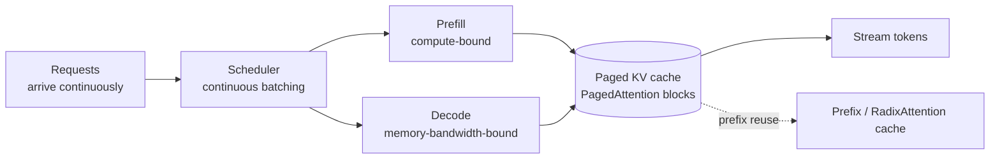

# Inference serving: vLLM, SGLang, Ollama, quantization

!!! abstract "At a glance"
    **Priority:** P1 · **Complexity:** 4/5 · **Est. time:** 4 h · **Phase:** 5 · **Prereqs:** [LLM fundamentals](llm-fundamentals.md), [Cost & latency](cost-latency-optimization.md), [Model routing & gateways](model-routing-gateways.md), [LLM serving platform design](../ai-system-design/llm-serving-platform.md)
    **You're done when:** you can size GPU memory for a model + KV cache from first principles, serve an open-weights model with vLLM behind the LiteLLM gateway, benchmark throughput and TTFT at several concurrency levels, and decide (with cost math) self-host vs API.

## Why it matters

Self-hosting open-weights models is now mainstream for three reasons: **data residency/privacy**, **unit economics at high volume for narrow tasks**, and **latency/control** (structured decoding, fine-tuned adapters). It's also how the capstone runs offline on a laptop (Ollama). Architects must reason about GPU memory, batching and cost per million tokens — and know when *not* to self-host, because idle GPUs are expensive and ops burden is real.

## Core concepts

### Where the memory goes

Serving memory ≈ **weights + KV cache + activations/overhead**.

- **Weights** = parameters × bytes/param. 8B params: FP16/BF16 (2 B) → 16 GB; FP8/INT8 (1 B) → 8 GB; 4-bit (0.5 B) → ~4-5 GB. 70B: 140 GB / 70 GB / ~36 GB.
- **KV cache per token** = `2 × layers × kv_heads × head_dim × bytes`. Example (Llama-3-8B-like: 32 layers, 8 KV heads via GQA, head_dim 128, FP16): 2 × 32 × 8 × 128 × 2 B = **128 KB/token**. A 32k-token sequence = 4 GB; 50 concurrent 8k-token sequences = 50 GB. **KV cache, not weights, limits concurrency.**
- GQA/MQA and MLA shrink KV heads; KV-cache quantization (FP8/INT4-style) shrinks bytes/element (vLLM v0.20 highlighted a 2-bit KV option — validate accuracy before use).

### The serving engine's job



Key mechanisms:

- **Continuous (in-flight) batching**: new requests join the running batch at each decoding step instead of waiting for the whole batch to finish — the biggest throughput win over naive serving.
- **PagedAttention** (vLLM): KV cache stored in fixed-size blocks like virtual memory pages, eliminating fragmentation; enables high concurrency and cheap prefix sharing.
- **Prefix caching / RadixAttention** (SGLang): reuse KV for shared prefixes (system prompt, few-shot, agent history) — the self-hosted analogue of provider prompt caching. Crucial for agent loops.
- **Chunked prefill**: split long prefills so they don't stall decodes (protects TPOT under mixed load).
- **Speculative decoding**: a small draft model (or MTP/EAGLE-style heads) proposes tokens verified in parallel by the big model; 1.5-3x decode speedup at low batch sizes; less at high batch.
- **Tensor / pipeline / expert parallelism** for models larger than one GPU; **prefill/decode disaggregation** in large deployments (e.g. llm-d, NVIDIA Dynamo).
- **Structured decoding** (grammar/JSON schema constrained sampling) built in (xgrammar/outlines-style) — guarantees valid JSON ([Prompting & structured outputs](prompting-structured-outputs.md)).

### Engines compared (as of Sept 2026)

| Engine | Strengths | Weaknesses | Use when |
|---|---|---|---|
| **vLLM** (stable line v0.2x, Aug 2026) | Broadest model support, PagedAttention, continuous batching, OpenAI-compatible server, quantization (FP8/INT8/AWQ/GPTQ), LoRA multi-adapter serving, active ecosystem (llm-compressor, llm-d) | Rapid release cadence/breaking flags; tuning needed | Default production serving |
| **SGLang** | RadixAttention prefix caching, fast structured outputs, strong on multi-turn/agent workloads, frontend DSL | Smaller model matrix historically (closing gap) | Agent/RAG workloads with heavy prefix reuse; JSON-heavy |
| **TensorRT-LLM** | Peak NVIDIA performance, FP8/FP4 kernels | NVIDIA-only, build/compile complexity | Max throughput on NVIDIA at scale, with ops capacity |
| **llama.cpp / Ollama** | CPU/Apple Silicon/consumer GPU, GGUF quantization, trivial setup | Lower throughput under concurrency; not a multi-tenant server | Dev laptops, edge, low-concurrency internal tools |
| **Managed** (Azure Foundry models, Bedrock, Vertex, Together, Fireworks, etc.) | No GPU ops; pay per token | Less control; per-token price | Default until volume justifies self-hosting |

### Quantization

| Method | Bits | Notes |
|---|---|---|
| BF16/FP16 | 16 | Baseline quality |
| **FP8** (W8A8) | 8 | Near-lossless on modern GPUs (H100/H200/B200 hardware support); ~2x memory/throughput improvement |
| **INT8** (SmoothQuant-style) | 8 | Robust; good on older GPUs |
| **AWQ / GPTQ** (weight-only) | 4 | ~3.5-4x weight memory reduction; small quality loss; great for fitting on smaller GPUs; less benefit at high batch (compute-bound) |
| **GGUF Q4_K_M etc.** | ~4-5 | llama.cpp/Ollama format; CPU/GPU mixed offload |
| **FP4 / NVFP4, MXFP4** | 4 | Blackwell-class hardware support; watch quality on your evals |
| **KV-cache quantization** | 8/4/2 | Boosts concurrency; verify long-context accuracy |

Rules of thumb: **8-bit is usually safe; 4-bit weight-only is usually fine for ≥7-8B general models but degrades reasoning/coding/tool-calling more than perplexity suggests** — always run *your* eval. Smaller models suffer more from quantization than larger ones.

### Serving in practice

```bash
# vLLM OpenAI-compatible server (single GPU); flags evolve — check `vllm serve --help` for your version
vllm serve Qwen/Qwen3-8B-Instruct \
  --max-model-len 32768 \
  --gpu-memory-utilization 0.90 \
  --enable-prefix-caching \
  --max-num-seqs 64 \
  --port 8000
# quantized:  --quantization fp8   (or a pre-quantized AWQ checkpoint)
```

```python
# Any OpenAI client works; route via LiteLLM as "openai/<model>" with api_base
from openai import AsyncOpenAI
client = AsyncOpenAI(base_url="http://vllm:8000/v1", api_key="unused")
resp = await client.chat.completions.create(
    model="Qwen/Qwen3-8B-Instruct",
    messages=[{"role": "user", "content": "Classify: 'Reefer temp alarm at Rotterdam gate 4'"}],
    extra_body={"guided_json": {"type": "object", "properties": {"severity": {"enum": ["SEV1","SEV2","SEV3"]}},
                                "required": ["severity"]}},   # structured decoding (option name varies by version)
)
```

Ollama for the local dev loop (`ollama pull qwen3:8b`; OpenAI-compatible at `:11434/v1`) mirrors the vLLM API shape so the same gateway config runs both.

### Capacity planning & cost math

Throughput is best measured, not guessed. Method:

1. Define workload: input/output token distribution, concurrency, SLOs (p95 TTFT < 1.5 s, TPOT < 40 ms).
2. Benchmark with your engine's tool (`vllm bench serve`, or a load script) at concurrency 1, 8, 32, 64, 128; plot tokens/s and latency percentiles; find the **knee** where latency violates SLO.
3. GPUs needed = peak tokens/s ÷ tokens/s per GPU at SLO × headroom (1.3-2x for spikes, failures).

Illustrative economics: one H100-class GPU at ~$3/h serving an 8B FP8 model at ~2,500 output tok/s sustained (steady batch) → 9M tokens/h → **~$0.33 per M output tokens** at 100% utilisation. At 30% utilisation → ~$1.10/M. Compare to API small-model pricing (often $0.1-0.6/M output): **self-hosting an 8B model rarely beats cheap API tiers unless utilisation is high, privacy demands it, or you need fine-tuned/custom behaviour.** For 70B+ or heavily fine-tuned models, the calculus differs. Always include: GPU reservation vs on-demand vs spot, idle time, engineer time, monitoring, upgrades.

Autoscaling: scale on **queue depth / running requests / KV cache usage**, not CPU; cold start (model load 1-5 min) means keeping a warm minimum. Kubernetes options: KServe, KubeRay, llm-d, NVIDIA Dynamo, vLLM production-stack.

### Observability for serving

Export: requests running/waiting, KV-cache utilisation, prefix-cache hit rate, TTFT/TPOT/e2e histograms, tokens/s, preemptions/swaps (memory pressure), GPU utilisation/memory. vLLM exposes Prometheus metrics at `/metrics`. Alert on waiting-queue growth and KV usage > 90%.

### Senior-level nuance

- **Benchmark with realistic prompts.** Random short prompts overstate throughput; real agents have long shared prefixes and long outputs.
- **Prefix caching is a huge lever for agents** — verify hit rate; sticky routing by session/prefix across replicas (cache-aware routing) matters at scale.
- **Tail latency under mixed load**: long prefills starve decodes; use chunked prefill, separate pools for batch vs interactive.
- **Quantization + LoRA**: serving multiple LoRA adapters on one base (multi-LoRA) is far cheaper than N full models ([Fine-tuning](fine-tuning.md)).
- **Model licences** (Llama community licence, Gemma terms, Apache/MIT models like Qwen/Mistral variants) affect commercial use — legal review.
- **Security**: don't expose the engine port; add auth via gateway; pin container images; watch for CVEs in serving stacks; treat model weights as supply-chain artifacts (checksums, trusted hubs).
- **Tool calling and reasoning parsers** are version-sensitive — ensure the engine's parser matches the model's chat template, or tool calls silently break.

## Resources

| Resource | Type | Why this one | Level | Cost |
|---|---|---|---|---|
| [vLLM docs](https://docs.vllm.ai/) | docs | Serving, quantization, benchmarking, metrics | intermediate | free |
| [vLLM quantization docs](https://docs.vllm.ai/en/latest/features/quantization/) | docs | Supported formats and hardware matrix | intermediate | free |
| [PagedAttention paper (arXiv 2309.06180)](https://arxiv.org/abs/2309.06180) | paper | The core idea behind vLLM's memory efficiency | advanced | free |
| [SGLang docs](https://docs.sglang.ai) | docs | RadixAttention, structured outputs, deployment | intermediate | free |
| [SGLang paper (arXiv 2312.07104)](https://arxiv.org/abs/2312.07104) | paper | Program-level optimisation, prefix caching | advanced | free |
| [BentoML LLM Inference Handbook](https://bentoml.com/llm/) :gem: | article | Clear explanations of batching, KV cache, quantization, metrics | intermediate | free |
| [Anyscale: continuous batching](https://www.anyscale.com/blog/continuous-batching-llm-inference) :gem: | article | Intuitive walkthrough with numbers | intermediate | free |
| [Maarten Grootendorst: visual guide to quantization](https://newsletter.maartengrootendorst.com/p/a-visual-guide-to-quantization) :gem: | article | Best visual intro to quantization schemes | intermediate | free |
| [llm-d](https://llm-d.ai) | docs | Kubernetes-native distributed inference (disaggregation, cache-aware routing) | advanced | free |
| [llama.cpp](https://github.com/ggml-org/llama.cpp) | docs | GGUF, CPU/Metal inference internals | intermediate | free |

## Hands-on lab

**Goal (2 h):** serve, benchmark, and integrate a local model; produce a self-host-vs-API cost table.

1. **Memory math** (15 min): for your chosen 7-8B model compute weights (BF16, FP8, 4-bit) and KV bytes/token from its `config.json`; predict max concurrent 8k-token sequences on your GPU (or a rented one).
2. **Serve** (30 min): run vLLM (rented GPU/cloud spot) or Ollama (laptop). Enable prefix caching. Expose OpenAI-compatible API.
3. **Gateway** (15 min): register it in LiteLLM as `fast-local`; route the triage alias to it.
4. **Benchmark** (40 min): write an async load script replaying 100 real capstone prompts (long shared system prefix) at concurrency 1/8/32/64; record TTFT p50/p95, tokens/s, and vLLM `/metrics` KV usage and prefix hit rate. Repeat with FP8/AWQ and compare quality on the triage eval.
5. **Economics** (20 min): compute $/M tokens at measured throughput for utilisation 20/50/80%; compare with API prices for the small and frontier tiers; conclude a break-even monthly token volume.

**Expected output:** a table of (precision, VRAM, max concurrency, tokens/s, TTFT p95, triage accuracy, $/M tokens) and a written recommendation.

## Questions

### L1 — Recall

??? question "Q1. What is PagedAttention and what problem does it solve?"
    ??? success "Answer"
        It stores the KV cache in fixed-size blocks mapped through a block table (like OS paging), removing fragmentation and over-reservation of contiguous memory, enabling higher batch sizes and cheap sharing of prefix blocks between sequences.

??? question "Q2. What is continuous batching?"
    ??? success "Answer"
        The scheduler adds and removes sequences from the running batch at every decode iteration instead of waiting for a whole static batch to finish, keeping the GPU busy and dramatically raising throughput.

??? question "Q3. Which phase is compute-bound and which is memory-bandwidth-bound?"
    ??? success "Answer"
        Prefill is compute-bound (many tokens processed in parallel); decode is memory-bandwidth-bound (one token at a time reading weights and KV cache).

??? question "Q4. Name three quantization approaches and one trade-off of each."
    ??? success "Answer"
        FP8: near-lossless but needs hardware support. AWQ/GPTQ 4-bit weight-only: big memory savings, small quality loss and limited benefit at high batch. GGUF (llama.cpp): runs on CPU/consumer hardware but lower throughput for multi-user serving. (Also KV-cache quantization: more concurrency, risk for long-context accuracy.)

### L2 — Apply

??? question "Q5. A 70B model in BF16 needs how much weight memory? Can it serve on 2×80 GB GPUs with room for KV cache? What are your options?"
    ??? success "Answer"
        ~140 GB of weights; 2×80 = 160 GB leaves ~20 GB minus overhead for KV cache — very little concurrency. Options: FP8 weights (~70 GB) leaving ~85 GB for KV on 2 GPUs with tensor parallel 2; 4-bit AWQ (~36 GB) even on one GPU with limited KV; 4 GPUs with TP4. Choose by eval quality and target concurrency.

??? question "Q6. Compute the KV cache size per token for 40 layers, 8 KV heads, head_dim 128, FP16, and how many 16k-token sequences fit in 40 GB."
    ??? success "Answer"
        Per token = 2 × 40 × 8 × 128 × 2 B = 163,840 B ≈ 160 KB. Per 16k sequence ≈ 2.5 GB (16,384 × 160 KB). 40 GB / 2.5 GB ≈ 16 sequences (less after overhead and fragmentation, with paged allocation near this).

??? question "Q7. TTFT p95 doubles when a few users send 60k-token prompts. Diagnose and fix."
    ??? success "Answer"
        Long prefills monopolise compute and block decodes/new prefills. Fixes: chunked prefill, separate pool/priority for long-context requests, prompt-length limits or routing long jobs to a batch pool, prefix caching for repeated context, more replicas, and admission control by token budget.

### L3 — Design & trade-offs

??? question "Q8. Self-host an 8B model or use a small hosted model for 200M tokens/month of classification?"
    ??? success "Answer"
        Compute both: hosted small models often cost tens of cents per M tokens → 200M tokens ≈ tens to low hundreds of dollars/month. A GPU at ~$2-3/h is ~$1.5-2.2k/month always-on, even if underutilised. Self-hosting loses on cost at this volume unless privacy/residency forces it or utilisation is high and you also need fine-tuned adapters. Recommend hosted (or local Ollama for dev) and revisit at ~10x volume or when residency requires it.

??? question "Q9. vLLM vs SGLang for an agent workload with 6k-token shared prefixes and JSON outputs."
    ??? success "Answer"
        Both support prefix caching and structured decoding; SGLang's RadixAttention and structured-output speed are strong for prefix-heavy multi-turn agents, vLLM has broader model support/ecosystem. Benchmark both with a replay of real traces measuring prefix hit rate, TTFT/TPOT, structured-output overhead, and stability; choose on data, plus team familiarity and support for your model's tool-call/reasoning parser.

??? question "Q10. Autoscaling policy for a vLLM deployment on Kubernetes."
    ??? success "Answer"
        Scale on waiting-queue length / running requests per replica and KV-cache utilisation (e.g. add replicas when waiting > N for 30 s or KV > 85%), not CPU. Keep a warm minimum due to multi-minute model load; use node pools with pre-pulled images and cached weights (PVC/object-store mirror); cache-aware routing to preserve prefix hits; scale-down slowly; separate pools for interactive and batch.

### L4 — Staff-level ambiguity

??? question "Q11. Leadership wants 'our own GPU cluster to save money on LLMs.' Provide the decision framework and recommendation."
    ??? success "Answer"
        Establish baseline spend per workload from gateway data. For each workload compute self-host TCO: GPUs (reserved/on-demand), utilisation, idle, networking, engineers (on-call, upgrades), security, model licences vs API cost at required quality. Only narrow, high-volume, steady, latency- or privacy-sensitive workloads typically win. Start with managed/serverless open-model endpoints and pilot one workload with an SLO; require ≥60% sustained utilisation forecast before committing capex. Keep gateway aliases so migration is reversible. Report break-even volume and risks.

??? question "Q12. A model upgrade in the serving stack (new vLLM version) silently degraded tool-calling accuracy. How do you prevent recurrence?"
    ??? success "Answer"
        Treat the serving stack as a model dependency: pin engine, model, tokenizer/chat-template and parser versions; run the eval suite (tool-call accuracy, structured-output validity, latency) in CI against a staging deployment on every change; canary via gateway weights with shadow comparisons; alert on tool-call error rates and schema failures in production; keep the previous image ready for rollback; document parser/template pairing per model.

## Real-world use cases

- **Offline/on-prem ops copilot** on vessels or terminals with intermittent connectivity: quantized 8B on a local GPU via vLLM/llama.cpp.
- **High-volume alert classification**: fine-tuned small model served with multi-LoRA adapters per business unit.
- **Regulated data** (customs, HR): self-hosted open-weights model in a private VNet.
- **Developer laptops**: Ollama for offline dev/test of agents with the same OpenAI-compatible API.

## Pitfalls & anti-patterns

- Sizing GPUs from weight size alone; ignoring KV cache.
- Benchmarking with short synthetic prompts.
- 4-bit quantizing without task evals, especially for tool calling.
- Idle GPUs from static provisioning.
- Mismatched chat templates/parsers breaking tool calls.
- Exposing the inference port without auth.
- Ignoring model and container supply chain.

## Checklist

- [ ] I can compute weights and KV-cache memory and estimate concurrency
- [ ] I can explain continuous batching, PagedAttention, prefix caching, speculative decoding
- [ ] I served a model behind LiteLLM and benchmarked at several concurrencies
- [ ] I produced a self-host vs API cost table with utilisation scenarios
- [ ] I answered all L3 questions out loud in < 3 min each
