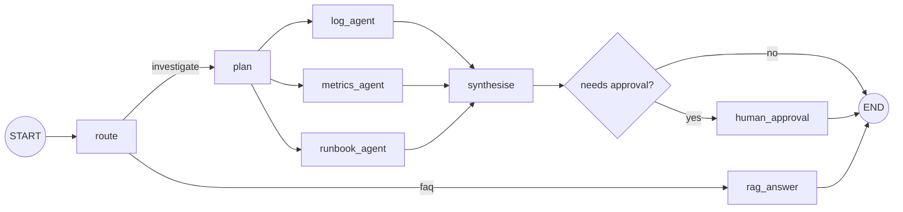

# LangGraph: graphs, state, checkpoints

!!! abstract "At a glance"
    **Priority:** P0 · **Complexity:** 4/5 · **Est. time:** 6 h · **Phase:** 3 · **Prereqs:** [Agent patterns](agent-patterns.md), [Tool calling](tool-calling.md), [Context engineering](context-engineering.md)
    **You're done when:** the copilot orchestrator runs as a LangGraph `StateGraph` with typed state and reducers, parallel fan-out to sub-agents, a Postgres checkpointer, streaming, and time-travel debugging — and you can explain what is written at each super-step and what happens on crash and resume.

## Why it matters

LangGraph is the de-facto low-level orchestration framework for stateful agents in Python: **LangGraph 1.0 went GA on 2025-10-22 (no breaking changes from 0.x), and 1.2 shipped on 2026-05-11** (adds finer-grained node timeouts/error handling, a `DeltaChannel` (beta) to cut checkpoint size for growing channels, and the v3 streaming API). Its value is not "another way to call an LLM" — it is **explicit control flow, typed state, durable checkpoints, interrupts and streaming** in one runtime, letting you build the agent patterns from [Agent patterns](agent-patterns.md) as inspectable graphs rather than emergent prompt behaviour.

Where it competes: Pydantic AI (typed, lighter, per-agent) — commonly used *together* (LangGraph orchestrates; Pydantic AI agents are nodes); vendor SDKs ([vendor agent SDKs](vendor-agent-sdks.md)); Temporal/DBOS for durable business workflows ([durable execution](durable-execution-hitl.md)). Know when LangGraph is the right tool: long-running, branching, human-in-the-loop, resumable agent workflows.

## Core concepts

### The model: a Pregel-style state machine

LangGraph compiles a graph of **nodes** (functions) and **edges** over a shared **state** made of **channels**. Execution proceeds in **super-steps** (Bulk Synchronous Parallel, inspired by Google's Pregel): in each super-step, all nodes whose input channels were updated run **in parallel**, their writes are applied to channels **at the end of the step** (not visible mid-step), then the next set of nodes is scheduled. A checkpoint is taken at super-step boundaries.



Fan-out edges (plan -> three agents) run in one super-step; `synthesise` waits until all its inputs have written (join).

### State, channels and reducers

State is a schema (`TypedDict`, dataclass or Pydantic model). Each key is a channel; the **reducer** decides how concurrent writes combine. Without a reducer, last-write-wins (and two parallel writers to the same key raise an error). Use reducers for lists and merges:

```python
from typing import Annotated, Literal, TypedDict
from operator import add
from langgraph.graph import StateGraph, START, END
from langgraph.graph.message import add_messages
from langgraph.types import Command, Send, interrupt
from langgraph.checkpoint.postgres import PostgresSaver

class Finding(TypedDict):
    source: str
    summary: str
    evidence_ids: list[str]

class State(TypedDict):
    alert: str
    intent: Literal["investigate", "faq"]
    messages: Annotated[list, add_messages]     # reducer: append/merge by message id
    findings: Annotated[list[Finding], add]     # parallel agents append
    answer: str | None
    approved: bool | None
```

Design rule: **state is the source of truth, not the transcript** ([context engineering](context-engineering.md)). Keep it small, JSON-serialisable and structured. Separate the *graph state schema* from *input/output schemas* (`StateGraph(State, input_schema=..., output_schema=...)`) so callers see a clean API and internals stay private.

### Nodes, edges, Command and Send

```python
def route(state: State) -> Command[Literal["plan", "rag_answer"]]:
    intent = classify(state["alert"])                  # small model, enum output
    return Command(update={"intent": intent},
                   goto="plan" if intent == "investigate" else "rag_answer")

def plan(state: State):
    # dynamic fan-out: one Send per sub-agent, each with its own input payload
    return [Send("run_agent", {"agent": a, "alert": state["alert"]})
            for a in ("logs", "metrics", "runbooks")]

async def run_agent(payload: dict) -> dict:
    result = await SUBAGENTS[payload["agent"]].run(payload["alert"])   # e.g. a Pydantic AI agent
    return {"findings": [result.output]}                # merged via the `add` reducer

def synthesise(state: State):
    return {"answer": write_summary(state["findings"])}

builder = StateGraph(State)
builder.add_node("route", route)
builder.add_node("plan", plan)             # returns Sends, conditional-edge-like
builder.add_node("run_agent", run_agent)
builder.add_node("synthesise", synthesise)
# ... rag_answer, human_approval nodes
builder.add_edge(START, "route")
builder.add_edge("run_agent", "synthesise")
```

- **Static edges** for fixed flow; **conditional edges** (`add_conditional_edges(node, fn)`) for routing on state; **`Command(goto=..., update=...)`** when a node decides both the state update and where to go (keeps routing logic beside the decision); **`Send`** for map-reduce/fan-out with a dynamic number of workers and per-branch input.
- **Subgraphs:** a compiled graph can be a node in another graph; useful for one graph per sub-agent with its own private state, mapping in/out state explicitly.
- **Retry and timeout policies** per node (`retry_policy=RetryPolicy(max_attempts=3, ...)`; 1.2 adds finer-grained node timeouts and error handling — check release notes for exact API) so transient failures don't kill a run.
- **Recursion limit** (`recursion_limit` in config, default 25 super-steps in older versions; set deliberately) is your loop budget — combine with explicit counters in state.

### Checkpointers: persistence internals

A **checkpointer** saves a snapshot of the state after each super-step, keyed by `thread_id` (and a `checkpoint_id`). It's what enables: conversation memory across invocations, **fault tolerance** (resume after crash), **human-in-the-loop** (pause/resume), **time travel** (inspect/replay/fork from a past checkpoint) and debugging.

What is stored per checkpoint (conceptually): channel values (serialised, msgpack/JSON with typed serde), channel versions, which nodes have seen which versions (this drives scheduling on resume), a parent checkpoint pointer (forming a tree — hence forking), metadata (step, source, writes), and **pending writes**: outputs of nodes that succeeded in a super-step whose siblings failed — on resume, successful nodes are *not* re-executed; only failed/unfinished ones are.

```python
config = {"configurable": {"thread_id": "inc-2026-0925-001"}}   # keep < 255 chars for Postgres

with PostgresSaver.from_conn_string("postgresql://copilot:pw@localhost:5432/copilot") as cp:
    cp.setup()                                  # creates tables/indexes (once; idempotent migrations)
    graph = builder.compile(checkpointer=cp)
    result = graph.invoke({"alert": alert}, config, durability="sync")

    snapshot = graph.get_state(config)          # current values, .next nodes, pending interrupts
    for s in graph.get_state_history(config):   # newest first; each has config with checkpoint_id
        print(s.metadata["step"], s.next)
    graph.update_state(config, {"approved": True})   # write as if a node produced it (manual fix)
```

Checkpointers (as of Sept 2026): `InMemorySaver` (tests only), `SqliteSaver` (local), `PostgresSaver`/`AsyncPostgresSaver` (`langgraph-checkpoint-postgres`; production; use async variant under FastAPI), plus managed options via LangGraph Platform/other community backends. Use `serde` with allow-listed types for safe deserialisation of custom objects (avoid pickle for untrusted data).

**Durability modes** (per invocation): `"exit"` (persist only when the run exits, fastest, can't recover from a mid-run crash), `"async"` (persist while the next step runs; small crash window), `"sync"` (write before proceeding; strongest, slowest). Choose per workload: `"sync"` for expensive/irreversible steps, `"async"` for typical chat. **Checkpoint growth** is real: every super-step writes the full value of changed channels, so a growing `messages` list makes storage O(n²) — mitigate with `DeltaChannel` (1.2, beta: stores only deltas and reconstructs by replay), trimming/summarising state, and pruning old checkpoints per thread on a schedule.

**Short-term vs long-term memory:** checkpoints are *thread-scoped*. Cross-thread memory (user preferences, learned facts) goes in a **Store** (`InMemoryStore` dev, Postgres-backed store in prod) with namespaces and optional semantic search — see [memory systems](memory-systems.md).

### Crash-and-resume semantics you must know

- Resume means `graph.invoke(None, config)` (or `Command(resume=...)` for interrupts) on the same `thread_id`: the runtime loads the latest checkpoint and schedules the nodes that hadn't completed.
- **Nodes may execute more than once** (a node that crashed mid-way re-runs from its start; an interrupted node re-runs from the top when resumed). Therefore **side effects inside nodes must be idempotent** (idempotency keys, upserts) or isolated in separate nodes/tasks so they're not repeated. This is the same lesson as [tool calling](tool-calling.md) and [durable execution](durable-execution-hitl.md).
- Wrap non-deterministic or side-effecting steps in `@task` (Functional API) or dedicated nodes so their results are recorded and replays reuse them rather than re-calling the LLM/API.

### Streaming

A production agent UI needs progress, tokens and interrupts streamed. LangGraph 1.2 GA'd the **v3 streaming API**: `graph.stream_events(input, config, version="v3")` returns a run-stream handle with typed projections per channel (messages/tokens, values, updates, tools, subgraphs), each event carrying channel/namespace/sequence/timestamp; interrupts surface via `stream.interrupts`. Older modes (`stream_mode="updates" | "values" | "messages" | "custom"`) remain widely used. Map these to SSE/WebSocket, or to AG-UI events ([A2A & AG-UI](a2a-ag-ui.md)).

### Functional API vs Graph API

The **Functional API** (`@entrypoint`, `@task`) lets you write ordinary Python control flow (loops, ifs) while still getting checkpointing, interrupts and streaming; tasks are the durable, cached units. Use it for linear/loopy flows where a graph diagram adds ceremony; use the **Graph API** where topology, parallel fan-out and visualisation matter. They interoperate in the same runtime.

### Time travel and debugging

`get_state_history` gives every checkpoint; invoke with a past `checkpoint_id` in config to **replay** (nodes before it are not re-run; those after are) or `update_state` then invoke to **fork** an alternative branch ("what if the log agent had returned X?"). Combined with traces ([LLM observability](llm-observability.md)) and the checkpoint's `thread_id` in span attributes, this is the fastest way to debug an agent bug: reproduce from the exact state.

### Testing

Test nodes as pure functions (state in, update out) with no LLM; test graph topology and routing with fake models (`FakeListChatModel` / Pydantic AI `TestModel`), an `InMemorySaver`, and assertions on `get_state`. Add a **golden-trajectory test**: for fixed fake tool outputs the graph must call nodes in the expected order and stop within N super-steps. Evals over real models are separate ([eval tooling](eval-tooling.md)).

### Trade-offs and senior nuance

| Choice | Pro | Con |
|---|---|---|
| LangGraph over hand-rolled loop | Checkpointing, interrupts, streaming, visualisation, ecosystem | Framework concepts (channels, super-steps) to learn; abstraction leaks in debugging |
| LangGraph vs Pydantic AI alone | Multi-actor topology, HITL, durable state | Extra layer if you only need a single tool-using agent |
| LangGraph vs Temporal/DBOS | Agent-native (state, streaming, LLM ecosystem) | Not a general workflow engine; less mature for multi-day business processes and cross-service orchestration |
| Pydantic model state vs TypedDict | Validation | Slight overhead; validation applies on input, not always between nodes |
| Big shared state vs private subgraph state | Simple | Context bloat, coupling |

Common mistakes: putting the full transcript and large tool outputs in state (checkpoint bloat, context bloat); non-idempotent nodes; forgetting `thread_id` (every invoke becomes a fresh run); many parallel writers to a key without a reducer; swallowing the interrupt exception with a bare `except`; assuming checkpoints are a database for business data (they're an implementation detail with a schema you don't own); unbounded loops without a recursion limit/state counter.

## Resources

| Resource | Type | Why this one | Level | Cost |
|---|---|---|---|---|
| [LangGraph docs - overview](https://docs.langchain.com/oss/python/langgraph/overview) | docs | Entry point to graph API, persistence, streaming, interrupts | intermediate | free |
| [LangGraph - Graph API](https://docs.langchain.com/oss/python/langgraph/graph-api) | docs | State, reducers, nodes, edges, Send, Command, subgraphs | intermediate | free |
| [LangGraph - Persistence](https://docs.langchain.com/oss/python/langgraph/persistence) | docs | Checkpointers, threads, Postgres setup, durability modes, DeltaChannel | advanced | free |
| [LangGraph - Interrupts](https://docs.langchain.com/oss/python/langgraph/interrupts) | docs | `interrupt()` and `Command(resume=...)` rules and gotchas | advanced | free |
| [LangGraph - Functional API](https://docs.langchain.com/oss/python/langgraph/functional-api) | docs | `@entrypoint`/`@task` for durable ordinary Python | intermediate | free |
| [LangGraph - Memory](https://docs.langchain.com/oss/python/langgraph/add-memory) | docs | Short-term (checkpoint) vs long-term (Store) memory patterns | intermediate | free |
| [LangChain Academy - Intro to LangGraph](https://academy.langchain.com/courses/intro-to-langgraph) | course | Free structured course with notebooks; best hands-on start | intermediate | free |
| [12-Factor Agents](https://github.com/humanlayer/12-factor-agents) :gem: | article | Counterpoint mindset: own your control flow, state and prompts; helps you judge what to delegate to a framework | intermediate | free |
| [Hugging Face Agents Course](https://huggingface.co/learn/agents-course) | course | Includes a LangGraph unit; useful cross-framework perspective | beginner | free |

## Hands-on lab

**Goal:** implement the capstone orchestrator as a LangGraph with Postgres checkpoints. (3-4 h)

1. `uv add langgraph langgraph-checkpoint-postgres "psycopg[binary,pool]" langfuse` and ensure `docker compose up postgres` from the vector lab.
2. Define `State` (above) with reducers; nodes: `route` (small model, `Command`), `plan` (returns `Send`s), `run_agent` (calls sub-agents — stub with deterministic fakes first; Pydantic AI in the [next page](pydantic-ai.md)), `synthesise`, `human_approval` (stub; real interrupt in [durable execution & HITL](durable-execution-hitl.md)), and `rag_answer` using the hybrid `search_runbooks`.
3. Compile with `PostgresSaver`; run one alert with `durability="sync"`; inspect `get_state_history` and print `next`/`metadata` per step; confirm three `run_agent` branches ran in the **same** super-step (timestamps).
4. **Crash test:** make one sub-agent raise on first call (`if not os.path.exists(flag): create flag; raise`). Invoke; observe failure; re-invoke with `None` on the same `thread_id`; verify (via a call counter) the two successful branches did **not** re-run.
5. **Time travel:** pick the checkpoint before `synthesise`, `update_state` to inject a different finding, and resume to fork; show both branches in history.
6. **Streaming:** print node updates and LLM tokens using `stream_events(..., version="v3")` (or `stream_mode=["updates","messages"]` if on an older 1.x).
7. **Tracing:** add the Langfuse `CallbackHandler` to `config["callbacks"]` and include `thread_id` in metadata; confirm the trace mirrors the graph.
8. Measure checkpoint bytes per thread after 30 steps with and without trimming `messages`; record in `COSTMODEL.md`.

*Expected:* parallel branches in one step; resume re-runs only the failed branch; forked history visible; checkpoint size shrinking after trimming (or with `DeltaChannel` if you try the beta).

## Questions

### L1 — Recall

??? question "Q1. What is a super-step and why does it matter for state updates?"
    ??? success "Answer"
        LangGraph executes in Pregel/BSP-style super-steps: all nodes scheduled for the step run (in parallel if independent), their writes are collected, then applied to channels at the end of the step via reducers, and a checkpoint is saved. Consequences: nodes in the same step can't see each other's writes, parallel writers to one key need a reducer, and checkpoints/resume operate at super-step granularity.

??? question "Q2. What does a reducer do and what happens without one?"
    ??? success "Answer"
        A reducer function defines how multiple updates to a state key combine (e.g. `operator.add` to append lists, `add_messages` to merge chat messages by ID). Without one, the channel is last-value: a single writer overwrites, and two nodes writing the same key in the same super-step cause an invalid-update error.

??? question "Q3. What are the three durability modes?"
    ??? success "Answer"
        `"exit"`: persist only when execution exits (success, error, or interrupt): fastest, can't recover mid-run crashes. `"async"`: persist in the background while the next step runs: good performance, small window of loss if the process crashes. `"sync"`: persist before the next step starts: highest durability, extra latency.

### L2 — Apply

??? question "Q4. Implement a map-reduce fan-out of N services to investigate, where N is only known at runtime."
    ??? success "Answer"
        ```python
        from typing import Annotated
        from operator import add
        from langgraph.types import Send

        class State(TypedDict):
            services: list[str]
            findings: Annotated[list[dict], add]

        def fan_out(state: State):
            return [Send("investigate_service", {"service": s}) for s in state["services"]]

        async def investigate_service(payload: dict):
            r = await service_agent.run(payload["service"])
            return {"findings": [{"service": payload["service"], "summary": r.output}]}

        builder.add_conditional_edges("plan", fan_out, ["investigate_service"])
        builder.add_edge("investigate_service", "synthesise")
        ```
        Each `Send` runs the node with its own input; results merge via the `add` reducer; `synthesise` runs after all branches complete. Cap N (e.g. 8) to bound cost, and set node timeouts/retry policies.

??? question "Q5. A node calls `create_incident_ticket` then crashes before the checkpoint. What happens on resume and how do you make it safe?"
    ??? success "Answer"
        On resume the node re-runs from its beginning, so the ticket would be created twice. Make the side effect idempotent: derive an idempotency key from `thread_id` + node name (+ step), pass it to the ticketing API (or store-and-check in your DB), and treat "already exists" as success. Alternatively isolate the write in its own task/node so its result is recorded in the checkpoint immediately, and use `durability="sync"` for that path.

??? question "Q6. Every invoke seems to start fresh and the bot forgets context. Diagnose."
    ??? success "Answer"
        Likely no checkpointer compiled in, or the `thread_id` is missing/changing between calls (e.g. generated per request). Checkpoints are keyed by `thread_id`; without a stable ID each invoke is a new thread. Fix: `compile(checkpointer=...)`, pass `config={"configurable": {"thread_id": stable_id}}`, and persist the ID client-side (session). Also verify the state schema has a reducer for messages (`add_messages`) so history accumulates rather than being overwritten.

### L3 — Design & trade-offs

??? question "Q7. LangGraph vs Pydantic AI vs a plain async Python loop for the copilot. Decide, and where the boundary sits."
    ??? success "Answer"
        Use **LangGraph for the orchestrator** (multi-branch topology, parallel sub-agents, checkpointed state, interrupts, streaming, resume) and **Pydantic AI for the sub-agents** (typed tools/outputs, dependency injection, easy testing, provider abstraction) called from nodes. A plain loop would force us to hand-build persistence, resume and HITL — a maintenance burden with subtle bugs. Pydantic AI alone lacks durable graph orchestration (though it integrates with Temporal/DBOS for durability). Boundary: graph state holds structured findings, not sub-agent transcripts; sub-agent runs are opaque to the graph except via traces. Risks: two abstractions to learn and two version cadences (mitigate with pinned versions and thin adapters).

??? question "Q8. Should each sub-agent be a subgraph, a node, or a separate service?"
    ??? success "Answer"
        Start with **nodes** calling in-process agents (simple, one trace, shared checkpoints). Use **subgraphs** when the sub-agent has multiple internal steps you want checkpointed/streamed and its own private state. Use **separate services** (A2A/MCP or HTTP) when teams own them independently, need different scaling/runtime, or security boundaries — accepting network failure modes, versioning contracts, and context propagation of trace IDs and identity. Decide per agent by ownership boundaries and scaling needs, not by fashion.

??? question "Q9. Postgres checkpointer vs Redis vs Temporal for durability of a copilot with 1,000 concurrent investigations lasting up to 30 minutes and approvals lasting hours."
    ??? success "Answer"
        Postgres checkpointer fits: 1,000 threads is modest; durable, queryable, and you already run Postgres. Watch checkpoint growth (prune, DeltaChannel, trim state) and connection pooling (async pool, `thread_id` limits). Redis is faster but durability semantics and querying are weaker for audit. Temporal (or DBOS) gives stronger guarantees for multi-day, cross-service workflows (timers, signals, versioning, exactly-once activity semantics) and can wrap a LangGraph run as an activity, but adds infrastructure and a programming-model constraint (deterministic workflow code). For approvals lasting hours, LangGraph interrupts + Postgres are sufficient if the app can wake the thread on approval; choose Temporal when workflows span days, need SLA timers/escalations, or coordinate many services.

### L4 — Staff-level ambiguity

??? question "Q10. Your team's LangGraph flows have become a 40-node monolith that nobody dares change. What do you do?"
    ??? success "Answer"
        Treat it like any monolith: identify cohesive sub-flows via traces and change history; extract subgraphs with explicit input/output schemas and private state; introduce contract tests (state-in/state-out fixtures) and a golden-trajectory suite so refactors are safe; simplify state (remove transcript-in-state, use structured fields); replace deep conditional routing with `Command`-based local decisions; document the graph with generated diagrams (`draw_mermaid`) in the repo. Set ownership per subgraph, budgets per flow, and version the state schema with migration functions for in-flight threads. Deliver incrementally behind evals to prove no regression.

??? question "Q11. LangGraph 1.x is stable, but the ecosystem (checkpointers, streaming API, DeltaChannel beta) is moving. How do you manage upgrade risk in a regulated org?"
    ??? success "Answer"
        Pin versions (lockfile), read release notes, and run the eval + trajectory suites and a checkpoint **backward-compatibility test** (load checkpoints produced by the previous version and resume) in CI before upgrades. Avoid beta features in critical paths (or isolate behind flags), wrap framework APIs in a thin internal adapter for the parts likely to change (streaming, persistence setup), keep business state out of checkpoints, and plan schema migrations for state changes. Canary upgrade on a subset of threads, maintain rollback (old image + compatible checkpoint schema), and track deprecations in an ADR.

## Real-world use cases

- **Incident copilot:** router -> parallel log/metrics/runbook agents -> synthesis -> approval gate, all checkpointed.
- **Claims/disputes processing:** long-running multi-step workflow with human review queues and resumable state.
- **Coding/review agents:** loops with tests as ground truth, checkpoints enabling replay of failing runs.
- **Customer onboarding:** document extraction, validation, external checks, and human approvals over hours/days.

## Pitfalls & anti-patterns

- Transcript and large tool outputs in state.
- Non-idempotent side effects inside nodes.
- Missing `thread_id`; using `InMemorySaver` in production.
- Parallel writers without reducers.
- Bare `except:` around `interrupt()`.
- No recursion limit/loop counters.
- Treating checkpoint tables as an application database.
- Adopting beta channels/APIs on critical paths without tests.

## Checklist

- [ ] I can explain super-steps, channels, reducers and what a checkpoint stores
- [ ] I built the orchestrator graph with parallel `Send` fan-out and a Postgres checkpointer
- [ ] I proved that resume re-runs only failed branches and that side effects are idempotent
- [ ] I used time travel to fork a run and debug
- [ ] I wired streaming and Langfuse tracing
- [ ] I answered all L3 questions out loud in < 3 min each
