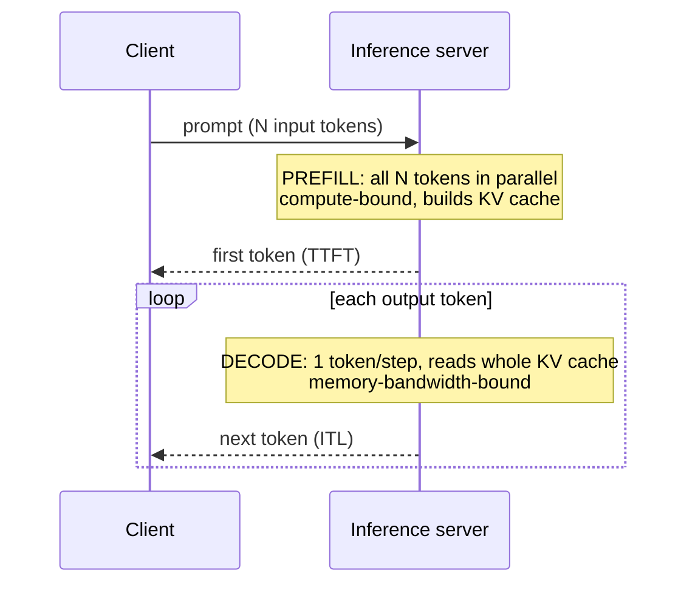

# LLM fundamentals: tokens, transformers, sampling, reasoning models

!!! abstract "At a glance"
    **Priority:** P0 · **Complexity:** 3/5 · **Est. time:** 4 h · **Phase:** 1 · **Prereqs:** [Python asyncio](../python/asyncio-deep.md)
    **You're done when:** you can predict, within ~20%, the cost and latency of any LLM call in the Agentic Ops Copilot from its input/output token counts, explain *why* (prefill vs decode, KV cache, prompt caching), and choose between a reasoning and a non-reasoning model with data.

## Why it matters

You don't need to train transformers to ship agents, but you do need a correct *mechanical model* of them. Almost every production decision in an agentic system is downstream of four facts:

1. **You pay (money and latency) per token**, and input and output tokens behave completely differently.
2. **The model attends over everything in the context window** — which is why long context is expensive, slow, and gets *worse* at recall past a point.
3. **Generation is sampling from a distribution**, so outputs are non-deterministic even at temperature 0 on most hosted stacks.
4. **Reasoning models spend hidden output tokens thinking** — great for planning and hard tool selection, wasteful for extraction and routing.

In a Staff-level interview ("design an LLM-powered incident copilot for 5,000 engineers"), the people who stand out are the ones who say "the system prompt plus tool schemas is ~6k tokens, that's cacheable, so steady-state input cost is ~10% of list; decode is ~60 tok/s so a 400-token answer is ~7 s, so we stream". This page gives you that fluency.

## Core concepts

### Tokens: the unit of everything

- A **tokenizer** (BPE / SentencePiece variants) maps text to integer IDs from a vocabulary of ~100k–260k entries. Rules of thumb for English prose: **~4 characters ≈ 1 token ≈ 0.75 words**. Code, JSON, logs, UUIDs, stack traces, and non-Latin scripts tokenize *much* worse (often 1.5–3x more tokens per character). Logs are a worst case — which matters for an ops copilot.
- Tokenizers are **model-specific**. Never estimate Claude cost with `tiktoken`; use the provider's token-counting endpoint or the usage block returned on every response.
- Token boundaries explain classic failures: counting letters, reversing strings, arithmetic on long numbers, and fragility around whitespace in few-shot examples.
- **Context window** = input + output tokens the model can handle in one call. As of Sept 2026, frontier models advertise 200k–1M+ tokens; *effective* context (where recall stays high) is much smaller — see [context engineering](context-engineering.md).

### The transformer in one screen

A decoder-only transformer repeatedly does: embed tokens → N layers of (self-attention + MLP) → project to vocabulary logits → pick next token → append → repeat.

- **Self-attention:** each token produces a Query, Key and Value vector. A token's output is a weighted sum of all previous tokens' Values, weighted by softmax(Q·K / √d). This is how "the service" in token 900 links back to "payments-api" in token 12.
- **Causal masking:** a token can only attend to earlier tokens. This is why **prefix order matters** for caching: change token 5 and everything after it must be recomputed.
- **MLP layers** store most of the "knowledge"; attention does routing/retrieval within the context.
- **Mixture-of-Experts (MoE):** many frontier and open models only activate a subset of MLP "experts" per token — big total parameters, smaller active parameters, cheaper inference per token.

### Prefill vs decode — the single most useful mental model



| Phase | What happens | Bound by | Latency driver | Cost driver |
|---|---|---|---|---|
| Prefill | Process all input tokens in parallel, build KV cache | GPU compute (FLOPs) | **TTFT** grows ~linearly (attention part quadratically) with input length | Input token price (cheap) |
| Decode | Generate one token at a time, each reading the full KV cache | GPU memory bandwidth | **Inter-token latency × output tokens** | Output token price (typically 4–5x input) |

Consequences you should internalise:

- **Output tokens dominate latency.** 2,000 input tokens might add ~100–300 ms of TTFT; 500 output tokens at 50–100 tok/s add 5–10 s. Shorten outputs before you shorten inputs.
- **Structured outputs and terse formats save real money and time** (JSON with short keys vs prose).
- **Streaming** doesn't reduce total latency but cuts perceived latency to TTFT.

### KV cache and why long context costs

During decode, the model caches every previous token's K and V per layer so it doesn't recompute them. Memory per token:

`KV bytes/token = 2 (K and V) × layers × kv_heads × head_dim × bytes_per_value`

Example (a 70B-class dense model with grouped-query attention: 80 layers, 8 KV heads, head_dim 128, fp16): 2 × 80 × 8 × 128 × 2 B ≈ **320 KB per token**. A single 128k-token request therefore pins **~40 GB** of GPU memory just for KV cache. That's why:

- Providers charge more (or tier pricing) for very long prompts, and self-hosted throughput collapses with long contexts (fewer concurrent sequences fit — see [inference serving](inference-serving.md)).
- Techniques like **GQA/MQA**, KV-cache quantization, and **PagedAttention** (vLLM) exist to squeeze this.

### Prompt caching (provider-side prefix caching)

Because attention is causal, the KV cache for an identical **prefix** can be reused across requests. Providers expose this as prompt caching:

- **Anthropic:** explicit `cache_control` breakpoints; cache reads are billed at a small fraction of base input price, cache writes at a premium; short default TTL with a longer paid option (check the [prompt caching docs](https://platform.claude.com/docs/en/build-with-claude/prompt-caching) for current multipliers).
- **OpenAI / Azure OpenAI:** automatic for prompts above a minimum length; discounted cached-input price.
- **Self-hosted (vLLM/SGLang):** automatic prefix caching / RadixAttention.

Design rule: **stable stuff first, volatile stuff last** — system prompt → tool definitions → static few-shots → retrieved docs → conversation → latest user turn. Putting a timestamp or request ID at the top of the system prompt silently disables caching. For an agent loop that re-sends a growing transcript every step, caching is the difference between O(n²) and roughly O(n) cost.

### Sampling

The model outputs logits → softmax → a probability distribution over the vocabulary. Decoding picks one token:

| Knob | Effect | When |
|---|---|---|
| `temperature` | Scales logits; <1 sharpens, >1 flattens | 0–0.3 for extraction/tool use; 0.7–1.0 for brainstorming |
| `top_p` (nucleus) | Sample from the smallest set with cumulative prob ≥ p | Usually tune temperature *or* top_p, not both |
| `top_k` / `min_p` | Truncate the tail | Common in open-model serving |
| `max_tokens` | Hard cap on output | Always set; it's also a cost guardrail |
| `stop` sequences | Stop on string | Delimited outputs |
| Constrained decoding | Mask tokens that violate a grammar/JSON schema | [Structured outputs](prompting-structured-outputs.md) |

**Senior nuance — determinism is a myth on hosted APIs.** Even at temperature 0 you'll see different outputs because floating-point reductions vary with batch composition on the server (batch-size-dependent kernels), MoE routing, and silent model updates. Design for it: pin model *snapshots* (dated IDs), cache responses where exact repeatability matters, and evaluate on distributions (pass rate over N runs), not single samples.

**Reasoning models often ignore or restrict sampling params** (fixed temperature) and expose an *effort*/*thinking budget* knob instead.

### Reasoning ("thinking") models

Reasoning models are trained with reinforcement learning to produce a long internal chain of thought before the answer.

- **Mechanism:** more test-time compute — the model explores, checks, and backtracks in tokens. Those thinking tokens are **billed as output tokens** and add decode latency, even when hidden or summarised.
- **Controls (as of Sept 2026):** reasoning effort (low/medium/high) or a thinking token budget, depending on provider; some providers support *interleaved thinking* between tool calls.
- **Where they win:** multi-step planning, ambiguous tool choice, debugging, maths/code, root-cause analysis across many signals.
- **Where they lose:** classification, routing, extraction, summarisation — a small fast model at low temperature is cheaper, faster, and often just as accurate.
- **Prompting differs:** give goals and constraints, not step-by-step "think step by step" scaffolding (it's redundant and can hurt).

### Choosing a model: the numbers to know

| Metric | Typical range (hosted, Sept 2026) | Why you care |
|---|---|---|
| TTFT | 200 ms – 2 s (longer for reasoning models) | Perceived latency |
| Output speed | 30–200 tok/s by model size/provider | Total latency |
| Price ratio output:input | ~4–5x | Optimise outputs first |
| Cached input discount | ~50–90% off | Stable prefixes |
| Context window vs effective context | Advertised ≫ effective | Don't stuff; retrieve |

Treat any specific price as a config value with a date on it; they change quarterly.

### What juniors miss

- Counting only input tokens in cost models (and forgetting thinking tokens).
- Assuming temperature 0 = reproducible.
- Using the largest model everywhere instead of a **model cascade** (small model routes/extracts, large model plans) — see [model routing](model-routing-gateways.md).
- Believing a 1M context window means you can skip retrieval.
- Putting volatile content early in the prompt, killing cache hit rate.

## Resources

| Resource | Type | Why this one | Level | Cost |
|---|---|---|---|---|
| [Karpathy — Deep Dive into LLMs like ChatGPT](https://www.youtube.com/watch?v=7xTGNNLPyMI) | video | 3.5 h, the clearest end-to-end mental model: tokenization, pretraining, post-training, RL, hallucination | intermediate | free |
| [Transformer Explainer (Georgia Tech Polo Club)](https://poloclub.github.io/transformer-explainer/) :gem: | interactive | Live GPT-2 in the browser; watch attention and temperature change the distribution | intermediate | free |
| [3Blue1Brown — Neural networks series (transformers & attention chapters)](https://www.3blue1brown.com/topics/neural-networks) | video | Best visual intuition for attention and embeddings | intermediate | free |
| [Tiktokenizer](https://tiktokenizer.vercel.app/) :gem: | interactive | Paste your logs/JSON and see how badly they tokenize | intermediate | free |
| [vLLM — PagedAttention blog](https://blog.vllm.ai/2023/06/20/vllm.html) | article | Why KV cache memory is the bottleneck and how paging fixes it | advanced | free |
| [Anthropic — Prompt caching docs](https://platform.claude.com/docs/en/build-with-claude/prompt-caching) | docs | Exact mechanics of prefix caching, breakpoints, TTLs, pricing multipliers | intermediate | free |
| [Sebastian Raschka — Understanding Reasoning LLMs](https://magazine.sebastianraschka.com/p/understanding-reasoning-llms) :gem: | article | How reasoning models are trained (RL, distillation) and when they're worth it | advanced | free |
| [Build a Large Language Model (From Scratch) — Raschka](https://www.manning.com/books/build-a-large-language-model-from-scratch) | book | If you want to implement attention/KV cache yourself in PyTorch | advanced | paid |
| [Stanford CS336: Language Modeling from Scratch](https://stanford-cs336.github.io/) | course | Deep systems view (tokenizers, kernels, scaling, inference) for when you go further | advanced | free |

## Hands-on lab

**Goal:** build `llmprobe`, a tiny harness the capstone will reuse to measure token usage, TTFT, throughput and cache effects across local and cloud models. (90 min)

1. `uv init llmprobe && uv add httpx anthropic openai tiktoken rich` and run Ollama locally (`ollama pull qwen3:8b` or any small model — treat model names as config).
2. Write `probe.py` that sends the same prompt with **streaming** and records: TTFT (time to first content chunk), total time, output tokens, tokens/sec, and the provider's reported `usage`.

    === "Anthropic"

        ```python
        import os, time
        from anthropic import Anthropic

        client = Anthropic()
        MODEL = os.environ.get("ANTHROPIC_MODEL", "claude-sonnet-4-6")  # placeholder

        def probe(system: str, user: str) -> dict:
            t0 = time.perf_counter(); ttft = None
            with client.messages.stream(
                model=MODEL, max_tokens=400,
                system=[{"type": "text", "text": system,
                         "cache_control": {"type": "ephemeral"}}],
                messages=[{"role": "user", "content": user}],
            ) as stream:
                for _ in stream.text_stream:
                    ttft = ttft or time.perf_counter() - t0
                msg = stream.get_final_message()
            total = time.perf_counter() - t0
            u = msg.usage
            return {"ttft": ttft, "total": total, "in": u.input_tokens,
                    "out": u.output_tokens,
                    "cache_read": u.cache_read_input_tokens,
                    "cache_write": u.cache_creation_input_tokens,
                    "tok_s": u.output_tokens / (total - ttft)}
        ```

    === "OpenAI / Ollama (OpenAI-compatible)"

        ```python
        import os, time
        from openai import OpenAI

        # Ollama: base_url="http://localhost:11434/v1", api_key="ollama"
        client = OpenAI(base_url=os.getenv("OPENAI_BASE_URL"),
                        api_key=os.getenv("OPENAI_API_KEY", "ollama"))
        MODEL = os.environ.get("OPENAI_MODEL", "qwen3:8b")  # placeholder

        def probe(system: str, user: str) -> dict:
            t0 = time.perf_counter(); ttft = None; usage = None
            stream = client.chat.completions.create(
                model=MODEL, max_tokens=400, stream=True,
                stream_options={"include_usage": True},
                messages=[{"role": "system", "content": system},
                          {"role": "user", "content": user}],
            )
            for chunk in stream:
                if chunk.choices and chunk.choices[0].delta.content and ttft is None:
                    ttft = time.perf_counter() - t0
                if chunk.usage:
                    usage = chunk.usage
            total = time.perf_counter() - t0
            return {"ttft": ttft, "total": total,
                    "in": usage.prompt_tokens, "out": usage.completion_tokens,
                    "tok_s": usage.completion_tokens / (total - ttft)}
        ```

3. **Experiment A — input vs output:** vary input length (1k, 8k, 32k tokens of real log lines) with fixed 100-token output; then fix input and vary `max_tokens` (100, 400, 1,600). Plot TTFT and total. *Expected:* TTFT grows with input; total time grows much faster with output.
4. **Experiment B — caching:** use a ~5k-token system prompt (runbook excerpt). Call 5 times. *Expected:* call 1 shows `cache_write`, calls 2–5 show `cache_read` ≈ 5k and lower TTFT. Now prepend `datetime.now()` to the system prompt and repeat — cache hits vanish.
5. **Experiment C — tokenization tax:** count tokens for 10 KB of English prose vs 10 KB of JSON logs vs 10 KB of stack traces. Record the chars/token ratio.
6. **Experiment D — determinism:** run the same prompt 20× at temperature 0; count distinct outputs.
7. Write a 10-line `COSTMODEL.md` for the capstone: estimated tokens per copilot turn, cost per 1,000 turns, p50 latency. Keep the numbers; you'll validate them in [LLM observability](llm-observability.md).

## Questions

### L1 — Recall

??? question "Q1. What is the difference between prefill and decode, and which one dominates latency for a typical chat response?"
    ??? success "Answer"
        **Prefill** processes all input tokens in parallel in one forward pass, building the KV cache; it's compute-bound and determines **time-to-first-token**. **Decode** generates tokens one at a time; each step reads the whole KV cache so it's memory-bandwidth-bound, and total decode time ≈ output tokens × inter-token latency. For typical responses (a few hundred output tokens), **decode dominates** end-to-end latency: 500 tokens at 60 tok/s ≈ 8 s, while prefilling 5k tokens takes a fraction of a second. That's why you shorten outputs, stream, and use terse formats before trimming inputs.

??? question "Q2. What is stored in the KV cache and why does it make long contexts expensive to serve?"
    ??? success "Answer"
        For every token already processed, every layer stores that token's Key and Value vectors so later tokens can attend to it without recomputation. Size per token = 2 × layers × kv_heads × head_dim × bytes. For a 70B-class GQA model that's ~320 KB/token, so a 128k context holds ~40 GB of GPU memory for one sequence. GPU memory is the constraint on batch size, so long contexts reduce concurrency and throughput — providers pass that on in price and rate limits, and self-hosted clusters see throughput collapse.

??? question "Q3. Why is output at temperature 0 still not deterministic on hosted APIs?"
    ??? success "Answer"
        Temperature 0 makes decoding greedy, but the *logits* themselves vary slightly between runs: floating-point addition isn't associative and inference kernels change reduction order with batch size/composition (which depends on other users' traffic); MoE routing can flip on near-ties; and providers may update the serving stack or model behind an alias. Small logit differences flip an argmax, and once one token differs the continuation diverges. Mitigations: pin dated model snapshots, evaluate pass rates over multiple samples, cache outputs where exact repeatability is required.

??? question "Q4. What are reasoning tokens and how are they billed?"
    ??? success "Answer"
        Reasoning (thinking) tokens are the internal chain-of-thought a reasoning model generates before its final answer. They're produced by decode, so they cost **output-token prices** and add latency, even if the API hides them or returns only a summary. Usage objects report them (often as a separate reasoning-token count). A request with a 200-token answer may bill thousands of output tokens at high effort — budget for this with effort/budget controls and `max_tokens`.

### L2 — Apply

??? question "Q5. The copilot's system prompt + tool schemas are 6,000 tokens, each turn adds ~1,500 tokens of retrieved context and ~300 tokens of conversation, and answers average 350 output tokens. Assume $3/M input, $15/M output, cached input at 10% of input price. Estimate cost per turn with and without caching."
    ??? success "Answer"
        Input per turn ≈ 6,000 + 1,500 + 300 = 7,800 tokens; output 350.

        - **Without caching:** 7,800 × $3/M = $0.0234; 350 × $15/M = $0.00525 → **≈ $0.0287/turn** (~$28.70 per 1,000 turns).
        - **With caching of the 6k prefix** (steady state): 6,000 × $0.30/M = $0.0018 + 1,800 × $3/M = $0.0054 + output $0.00525 → **≈ $0.0125/turn**, a ~56% saving. (Ignore occasional cache-write premiums; they amortise if traffic is steady within the TTL.)

        Note the output share rises from 18% to 42% — next optimisation is shorter answers. In a multi-step agent loop where the transcript is re-sent each step, caching matters even more because the growing history becomes the cached prefix.

??? question "Q6. Your p95 latency is 14 s. Traces show TTFT p95 = 1.1 s and outputs average 900 tokens at 70 tok/s. What do you change first?"
    ??? success "Answer"
        Decode is ~900/70 ≈ 12.9 s — nearly all of it. Actions in order: (1) cut output length — ask for terse structured output, cap `max_tokens`, remove "explain your reasoning" instructions for the end user; (2) stream to the UI so perceived latency ≈ TTFT; (3) if a reasoning model, lower effort or move this step to a non-reasoning model; (4) split: small fast model produces the answer, big model only for planning; (5) consider a faster provider/model tier. Trimming the input prompt would barely help — TTFT is already only 1.1 s.

??? question "Q7. A developer puts `f\"Current time: {now}\"` as the first line of the system prompt. What breaks and how do you fix it?"
    ??? success "Answer"
        Prefix caching requires byte-identical prefixes; a changing first line means every request misses the cache, so you pay full input price and full prefill latency on the whole system prompt + tool definitions. Fix: move volatile data (time, user, request ID) to the *end* — in the latest user message or a trailing system/context block — and keep the stable blocks (instructions, tool schemas, static examples) first. Verify with the usage block (`cache_read_input_tokens` or cached-token counts) and alert on cache-hit-rate drops.

??? question "Q8. Estimate how many tokens 50 MB of JSON application logs is, and what that implies for 'just put the logs in context'."
    ??? success "Answer"
        JSON logs tokenize poorly — assume ~2.5–3 chars/token → roughly 17–20 million tokens. That's 20–100x beyond any context window, and even if it fit, cost (~$50+ per call at $3/M) and recall degradation make it absurd. Implication: logs must be *queried*, not stuffed — give the agent a tool (`query_logs(service, level, window, pattern)`) that returns aggregates or top-k samples, and keep per-call log excerpts to a few thousand tokens.

### L3 — Design & trade-offs

??? question "Q9. For the copilot you must pick models for (a) intent routing, (b) root-cause analysis over logs/metrics/runbooks, (c) drafting the Slack summary. Reasoning or non-reasoning for each? Defend."
    ??? success "Answer"
        - **(a) Routing:** small non-reasoning model (or even a fine-tuned classifier), temperature 0, structured output with an enum. It's a classification problem; latency budget ~300–500 ms; reasoning adds cost and seconds for no accuracy gain. Evaluate on a labelled set; if accuracy <95% add few-shots before upsizing.
        - **(b) RCA:** reasoning model at medium effort. The task needs multi-hop hypothesis testing and tool selection across signals; this is where test-time compute pays. Constrain with a thinking budget and tool-call limit; latency 20–60 s is acceptable for an async investigation that streams progress.
        - **(c) Summary:** mid-size non-reasoning model — it's a transformation of already-established facts; reasoning would just burn output tokens. Enforce a format and length.

        The general principle: spend test-time compute only where the error cost is high and the task is genuinely multi-step; prove it with an eval that compares both on the same dataset (accuracy, cost/task, p95 latency).

??? question "Q10. Self-host an open 70B model on your own GPUs vs use a hosted frontier API for the copilot. What token-level mechanics drive the decision?"
    ??? success "Answer"
        Hosted wins on quality, zero ops, elastic capacity, and built-in prompt caching. Self-hosting wins on data residency, predictable cost at high *steady* utilisation, and control (pinned weights = no silent changes). Mechanics: KV cache memory limits concurrency — long agent transcripts (30–60k tokens) mean only a handful of sequences per GPU node, so cost per token rises sharply with context length; decode is bandwidth-bound so you need batching (vLLM continuous batching) to be economic, which trades latency for throughput; prefix caching must be enabled to match hosted caching. Break-even typically requires high sustained utilisation; bursty internal-tool traffic rarely gets there. A common answer: hosted for the reasoning step, self-hosted small model for high-volume routing/embedding, behind a gateway so you can move traffic.

??? question "Q11. A PM says 'the new model has a 1M-token window, so let's drop RAG and put all 3,000 runbooks in the prompt.' Respond."
    ??? success "Answer"
        Three problems. **Cost/latency:** 3,000 runbooks ≈ several million tokens — doesn't fit, and even a 1M prompt costs dollars per call and many seconds of prefill; caching helps cost but not the quadratic attention work on first load or the memory footprint. **Quality:** recall degrades with length and position ("lost in the middle", context rot); distractors reduce accuracy — targeted retrieval of 5–10 relevant chunks usually beats stuffing. **Operability:** no citation granularity, no access control per document, every runbook edit invalidates the cache. Where long context *does* help: a single long artefact (one 200-page incident report) or as a fallback when retrieval confidence is low. Propose an eval: RAG vs long-context on 100 real questions, compare accuracy, cost, p95.

### L4 — Staff-level ambiguity

??? question "Q12. Finance flags LLM spend grew 6x in a quarter across 12 teams. You're asked to 'fix it' without slowing teams down. What do you do?"
    ??? success "Answer"
        **Measure first:** route all traffic through a gateway (or mandate OTel GenAI spans) tagging team, feature, model, input/output/cached/reasoning tokens. Build a cost dashboard by feature; typically 2–3 features drive 70%+ of spend. **Common root causes:** reasoning models used for classification; no prompt caching (volatile prefixes); unbounded agent loops; huge retrieved contexts; retries on validation failures. **Levers (in order of ROI):** caching hygiene and prefix design (a lint rule + cache-hit SLO), model cascades (small default, large by escalation), output caps, tool-call/step budgets, semantic caching for repeated queries, batch APIs for offline work. **Governance without friction:** per-team budgets with alerts not hard blocks, a paved-road SDK that does the right thing by default, and a monthly review of the top-10 spenders with the owning teams. Tie savings to an eval gate so quality doesn't silently drop. Communicate as "unit cost per resolved incident", not raw tokens.

??? question "Q13. Your org must choose a default 'house' model for the next 12 months. Two vendors are close on benchmarks. How do you structure the decision so it survives the next model release?"
    ??? success "Answer"
        Don't pick a model; pick an **architecture that makes the model a config value**: a gateway abstraction, provider-agnostic frameworks (Pydantic AI / LangGraph model strings), prompts and tool schemas that avoid vendor-only features unless isolated, and an internal eval suite built from *your* tasks (routing accuracy, RCA correctness, tool-call validity, cost/task, p95 latency, refusal rate). Run both vendors through it; decide on task-weighted results plus non-functional criteria — data residency (e.g. Azure regions via Microsoft Foundry), rate limits, caching economics, snapshot/deprecation policy, contractual terms. Re-run the suite on every major release (quarterly) and allow per-use-case overrides. Write an ADR with the explicit re-evaluation trigger. This turns a political one-shot bet into a repeatable, evidence-based process.

## Real-world use cases

- **Logistics incident copilot (Maersk-like):** vessel-tracking service alerts; the copilot's cost model is dominated by log excerpts (poor tokenization) — solved by aggregating logs via tools and caching the 8k-token runbook/tool prefix.
- **Customer-service assistant for shipment ETAs:** streaming the answer cuts perceived latency from 6 s to <1 s; a small model answers 85% of queries, escalating to a reasoning model for exceptions (customs holds, rerouting).
- **Batch document extraction (bills of lading):** offline batch APIs at a discount plus a small model at temperature 0 with schema-constrained output; determinism concerns handled by storing outputs, not re-generating.
- **Code-review bot:** reasoning model for diffs touching concurrency; fast model for style nits — routing by diff features.

## Pitfalls & anti-patterns

- Estimating cost from input tokens only; forgetting reasoning tokens and retries.
- Relying on `tiktoken` counts for non-OpenAI models.
- Aliased model names (`-latest`) in production — silent behaviour changes break evals.
- Volatile content at the top of prompts (cache killer).
- No `max_tokens` → runaway outputs and cost spikes.
- Asserting exact string equality in tests on LLM output.
- Using reasoning models for routing/extraction "because they're smarter".

## Checklist

- [ ] I can explain prefill vs decode, KV cache, and prefix caching without notes
- [ ] I can compute cost per turn from token counts and pricing, including cache and reasoning tokens
- [ ] I built `llmprobe` and measured TTFT, tok/s and cache hits on a local and a cloud model
- [ ] I wrote the capstone `COSTMODEL.md`
- [ ] I answered all L3 questions out loud in < 3 min each
