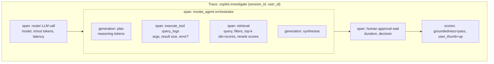

# LLM observability: Langfuse, Phoenix, OTel GenAI semconv

!!! abstract "At a glance"
    **Priority:** P0 · **Complexity:** 3/5 · **Est. time:** 3 h · **Phase:** 2 · **Prereqs:** [LLM fundamentals](llm-fundamentals.md), [Observability in Python](../python/observability-python.md)
    **You're done when:** one copilot request produces a single trace showing the router, each retrieval (with scores), each LLM call (model, tokens, cost, latency), each tool call and any human interrupt — in Langfuse, with session/user IDs, a cost dashboard, and an online judge scoring a sample of production traces.

## Why it matters

Traditional APM tells you a request took 14 s and returned 200. It cannot tell you *why the answer was wrong*, which retrieved chunk misled the model, which of 7 agent steps burned 80% of the tokens, or whether last Tuesday's prompt change raised the refusal rate. Non-deterministic, multi-step systems need **traces that capture content and decisions**, not just timings. Observability is also the substrate for evals ([Evals I](evals-error-analysis.md) needs traces to read), cost control ([cost & latency](cost-latency-optimization.md)), and incident forensics.

The good news: in 2026 the ecosystem has converged on **OpenTelemetry** as the wire format, with the **GenAI semantic conventions** defining span names and attributes. The nuance: those conventions are still marked *Development* (not stable) as of mid-2026, and now live in a dedicated repo (`open-telemetry/semantic-conventions-genai`), so attribute names can change — pin instrumentation versions and expect churn.

## Core concepts

### What to capture: the trace anatomy of an agent run



Capture at minimum:

| Layer | Attributes |
|---|---|
| LLM call | provider, model (requested and served), input/output/cached/reasoning tokens, finish reason, latency, TTFT, temperature, **prompt version**, cost, (optionally) messages |
| Retrieval | query, rewritten query, filters, returned IDs and scores, latency, index/embedding version |
| Tool call | tool name, args (redacted), result size/summary, error type, latency, idempotency key |
| Agent step | step index, decision (tool / final), budget remaining, loop-detection flags |
| Run | session/thread ID, user ID (pseudonymous), environment, release version, total tokens/cost, outcome |
| Scores | code/judge evaluations, user feedback (attached to trace/observation) |

### OpenTelemetry GenAI semantic conventions (Development status)

Key elements (names as of Sept 2026; verify in the spec repo before relying on them):

- **Span operations** via `gen_ai.operation.name`: `chat`, `text_completion`, `embeddings`, `retrieval`, `execute_tool`, `invoke_agent`, `create_agent`.
- **Common attributes:** `gen_ai.provider.name` (replaces the older `gen_ai.system`), `gen_ai.request.model`, `gen_ai.response.model`, `gen_ai.request.temperature`, `gen_ai.usage.input_tokens`, `gen_ai.usage.output_tokens`, `gen_ai.response.finish_reasons`, `gen_ai.conversation.id`; tool attributes such as tool name and call ID.
- **Metrics:** client token usage and operation duration histograms (`gen_ai.client.token.usage`, `gen_ai.client.operation.duration`) for dashboards and SLOs.
- **Content capture is opt-in** (prompts/completions may contain PII and are large): controlled by `OTEL_INSTRUMENTATION_GENAI_CAPTURE_MESSAGE_CONTENT` in instrumentations that follow the spec. Decide deliberately per environment.
- Framework instrumentations emit these: Pydantic AI (via Logfire/OTel, `instrument=True`), OpenLLMetry/Traceloop, OpenInference (Arize), LangSmith/LangGraph tracing, Microsoft Agent Framework, and vendor SDK instrumentation. Pydantic AI v2 defaults to instrumentation version 5, which reports aggregated usage under `gen_ai.aggregated_usage.*` on agent-run spans (relevant when you sum tokens: don't double count).

Why OTel matters architecturally: **one pipeline** (SDK -> Collector -> backend), vendor-neutral, and your LLM traces join your existing service traces (HTTP, DB, queue) so "the slow request" is one trace from the API gateway to the model call.

### Backends: Langfuse vs Phoenix vs others

| | **Langfuse** | **Arize Phoenix** | Others |
|---|---|---|---|
| Model | OSS (MIT core), self-host (Postgres/ClickHouse/Redis/S3 via docker compose or Helm) or cloud; acquired by ClickHouse (Jan 2026), stays OSS | OSS, self-host as a single container/Postgres; Arize AX is the commercial sibling | LangSmith (LangChain), Braintrust, Datadog LLM Observability, Grafana + Tempo (generic), Logfire, Azure Monitor/Application Insights, Helicone/Portkey (gateway-based) |
| Ingest | OTLP endpoint + native SDK (Python SDK v4 is OTel-based) | OTLP + OpenInference instrumentation | OTLP mostly |
| Strengths | Prompt management + versioning, datasets and experiments, LLM-as-judge evaluators on live traces, annotation queues, cost tracking, sessions/users | Notebook-friendly, strong eval + embedding/retrieval analysis, easy local start | Fit-with-existing-stack (Datadog/Grafana), enterprise features |
| Watch out | Self-hosting has real moving parts at scale | UI less product-analytics oriented | Lock-in, content-in-vendor concerns |

Local capstone: Langfuse via docker compose. Cloud (Azure): Langfuse self-hosted on AKS/Container Apps + managed Postgres/ClickHouse/Blob, or Azure Monitor with OTel and Langfuse for LLM-specific views. Whatever you pick, **export via OTel Collector** so you can dual-write or switch.

### Langfuse in Python (SDK v4, OTel-based)

```python
# pip/uv: langfuse ; env: LANGFUSE_PUBLIC_KEY, LANGFUSE_SECRET_KEY, LANGFUSE_BASE_URL
from langfuse import observe, get_client, propagate_attributes

langfuse = get_client()

@observe(name="retrieve", as_type="retriever")
def retrieve(query: str, service: str | None):
    hits = hybrid_search(query, service)
    langfuse.update_current_span(output=[{"id": h.id, "score": h.score} for h in hits])
    return hits

@observe(name="copilot.investigate")
def investigate(alert: str, user_id: str, session_id: str):
    with propagate_attributes(user_id=user_id, session_id=session_id,
                              tags=["copilot", "prod"], metadata={"release": RELEASE}):
        hits = retrieve(alert, service_of(alert))
        ...
        return answer

# short-lived scripts / serverless: langfuse.flush()
```

Framework integrations: LangChain/LangGraph via `from langfuse.langchain import CallbackHandler` passed in `config={"callbacks": [handler]}`; OpenAI/Anthropic via drop-in wrappers or OTel instrumentation; Pydantic AI via its OTel instrumentation pointed at Langfuse's OTLP endpoint. In the capstone, prefer **OTel instrumentation + Collector**, and use Langfuse-specific APIs only where they add value (scores, prompts, datasets).

Pydantic AI + OTel to any backend:

```python
import os
from pydantic_ai import Agent

# Point the OTel exporter at Langfuse's OTLP endpoint (or your Collector)
os.environ["OTEL_EXPORTER_OTLP_ENDPOINT"] = "http://localhost:3000/api/public/otel"
# auth header: Authorization=Basic base64(public:secret) via OTEL_EXPORTER_OTLP_HEADERS
Agent.instrument_all()             # instrument every agent; or Agent(..., instrument=True)
```

(Check current docs for the exact endpoint/header format and for `logfire.configure(send_to_logfire=False)` style setup; details change.)

### Scores, feedback and online evaluation

Attach **scores** to traces/observations: user thumbs, code checks (`citations_exist`), and LLM-judge results. Langfuse can run managed evaluators on a *sampled* fraction of live traces (e.g. 5-10%) — use your validated judges from [Evals I](evals-error-analysis.md). Alert on score-rate shifts, not just latency. Route low-scoring and thumbs-down traces to an **annotation queue**, and promote reviewed failures into the golden set: the flywheel.

### Cost, latency and quality dashboards

- **Cost:** by feature, model, tenant, prompt version; tokens split (input/cached/output/reasoning); cache hit rate; cost per successful task (the metric leadership understands).
- **Latency:** p50/p95 TTFT and total per step type; queueing and tool time; waiting-for-human time excluded from latency SLOs.
- **Reliability:** error rate by provider/model, retry/429 rate, schema-validation retry rate, loop-detection triggers, budget-exhaustion rate.
- **Quality:** online judge pass rates by slice, thumbs ratio, escalation rate, abstention rate.
- **Drift:** input distribution (intent mix), retrieval score distributions, top-1 score, empty-result rate.

### Privacy, security and cost of observability

- **PII/secrets:** redact at the SDK (masking hooks) and/or in the Collector (attribute processors) before data leaves your boundary. Default to *not* capturing message content in prod unless justified; sample content (e.g. 100% of errors, 5% of successes).
- **Access control:** traces contain customer data — apply RBAC, retention (e.g. 30-90 days), and deletion by user for GDPR.
- **Volume:** long-running agents generate large traces; use sampling (tail-based in the Collector to keep all errors/slow/low-score traces), truncate large payloads (store tool results in blob with a reference), and set span limits.
- **Trace context propagation** across services and MCP calls (W3C `traceparent`) so multi-service agent flows stay in one trace ([MCP](mcp.md), [A2A/AG-UI](a2a-ag-ui.md)).
- **Non-blocking export:** batch processors with bounded queues; observability must never break or slow the request path.

### What juniors miss

- Logging strings instead of structured spans; can't aggregate or filter.
- Capturing prompts everywhere in prod (privacy incident waiting).
- Only tracking LLM calls; retrieval and tool spans are where debugging value lives.
- No prompt version on the span -> can't attribute regressions.
- Trusting cost numbers without checking price tables (cached/reasoning token pricing).
- Treating OTel GenAI attribute names as stable.

## Resources

| Resource | Type | Why this one | Level | Cost |
|---|---|---|---|---|
| [Langfuse docs](https://langfuse.com/docs) | docs | Tracing, prompts, datasets, evals, self-hosting; SDK v4 is OTel-based | intermediate | free |
| [Langfuse - Python SDK instrumentation](https://langfuse.com/docs/observability/sdk/python/instrumentation) | docs | `@observe`, context managers, `propagate_attributes` | intermediate | free |
| [Langfuse - LangChain/LangGraph integration](https://langfuse.com/integrations/frameworks/langchain) | docs | CallbackHandler setup for LangGraph runs | intermediate | free |
| [Arize Phoenix docs](https://arize.com/docs/phoenix) | docs | Local-first OSS tracing/evals; OpenInference instrumentation | intermediate | free |
| [OpenTelemetry GenAI semantic conventions](https://opentelemetry.io/docs/specs/semconv/gen-ai/) | docs | Canonical attribute/span definitions and status (Development) | advanced | free |
| [semantic-conventions-genai repo](https://github.com/open-telemetry/semantic-conventions-genai) | docs | Where the conventions now live; track changes here | advanced | free |
| [OpenLLMetry (Traceloop)](https://github.com/traceloop/openllmetry) :gem: | docs | OTel instrumentation for many LLM SDKs/vector DBs; a good reference implementation | intermediate | free |
| [Pydantic Logfire docs](https://logfire.pydantic.dev/docs/) | docs | OTel-native platform tightly integrated with Pydantic AI; useful even if you export elsewhere | intermediate | freemium |
| [Hamel Husain - Field guide](https://hamel.dev/blog/posts/field-guide/) | article | Why looking at traces (and building simple viewers) drives improvement | intermediate | free |

## Hands-on lab

**Goal:** full-fidelity tracing for the capstone with Langfuse locally and a cost/quality dashboard. (2-3 h)

1. Add Langfuse to `docker-compose.yml` following the official self-hosting guide (Langfuse web + worker, Postgres, ClickHouse, Redis, MinIO). Create a project and API keys; put them in `.env` (never commit).
2. Instrument the components you already built:
    - `@observe` on `investigate`, `retrieve` (as_type retriever), tool executor (as_type tool), and the judge.
    - Pydantic AI/LLM calls via OTel instrumentation; verify `gen_ai.*` attributes appear (model, tokens).
    - Add `propagate_attributes(user_id, session_id)` at the request boundary; add `prompt_version` and `release` metadata.
3. Add an **OTel Collector** service between the app and Langfuse with: an attribute processor redacting emails/tokens, tail sampling (keep errors, slow, low-score; 10% of the rest), and a debug exporter to compare formats.
4. Run 50 golden-set cases through the copilot; in the Langfuse UI answer: which step dominates cost? What's the p95 for `retrieve`? Which prompt version had the most schema retries?
5. Configure a Langfuse LLM-as-judge evaluator (your validated `GROUNDED_ROOT_CAUSE` prompt) on 20% of traces; attach thumbs feedback via an API call from a fake UI; create a saved view "failed grounded + thumbs down" and export 10 traces into the golden dataset.
6. Write `docs/observability.md` with your span taxonomy, redaction policy and retention decision.

*Expected:* a single nested trace per request (router -> orchestrator -> tools/retrieval -> synthesis) with token and cost totals; a dashboard with cost per successful task; sampled online scores appearing on traces.

## Questions

### L1 — Recall

??? question "Q1. Name five things an LLM trace should capture beyond latency and status code."
    ??? success "Answer"
        Model and provider; input/output/cached/reasoning token counts and cost; prompt version and parameters; retrieval query, filters and returned IDs/scores; tool calls with (redacted) arguments, results size and errors; agent step index/decision and budget state; session and user IDs; attached scores (judge, feedback). Optionally message content, subject to privacy policy.

??? question "Q2. What is the status of the OpenTelemetry GenAI semantic conventions and what does it imply?"
    ??? success "Answer"
        As of mid-2026 they're in Development status (not stable), now maintained in a dedicated repository. Implication: attribute and span names may change (e.g. `gen_ai.system` was superseded by `gen_ai.provider.name`), so pin instrumentation library versions, isolate attribute names behind your own helper/processor, and expect to migrate dashboards. Message-content capture is opt-in.

??? question "Q3. Why is content capture opt-in and how do you handle it in production?"
    ??? success "Answer"
        Prompts and completions can contain PII, secrets and confidential data and inflate storage costs. Default it off in prod; enable selectively (errors, low-score traces, sampled traffic) with redaction in the SDK or Collector, restricted access, and retention limits. Keep metadata (tokens, model, IDs) always on.

### L2 — Apply

??? question "Q4. Traces show p95 = 22 s but LLM spans total 9 s. Where might the remainder be and how do you find it?"
    ??? success "Answer"
        Non-LLM time: tool calls (slow backends), retrieval/rerank, queueing before the run started, serialization of large tool outputs, sequential tool execution that should be parallel, waiting for human approval (should be excluded from the SLO), retries/backoff, or cold starts. Use the trace waterfall: sort spans by self-time, look for gaps (uninstrumented code) between spans, and add spans around suspicious sections. Fix with parallel tool calls, caching, timeouts and better indexing.

??? question "Q5. Configure sampling so that you keep all failures but control cost at 2M traces/day."
    ??? success "Answer"
        Use **tail-based sampling** in the OTel Collector: policies that keep 100% of traces with error status, high latency (> p99 threshold), low judge score or thumbs-down (attach scores as span attributes or use a second pass), budget-exhaustion/loop flags, and a probabilistic 5-10% of the remainder; drop or truncate large payload attributes. Because tail sampling buffers spans, size the Collector memory and use consistent trace-ID load balancing across Collector replicas. Keep metrics (token counts, durations) unsampled by deriving them before sampling.

??? question "Q6. Add user and session attribution in a FastAPI endpoint using Langfuse so all nested spans inherit it."
    ??? success "Answer"
        ```python
        from fastapi import FastAPI, Depends
        from langfuse import observe, propagate_attributes

        app = FastAPI()

        @app.post("/investigate")
        @observe(name="api.investigate")
        async def investigate_endpoint(req: Req, user=Depends(current_user)):
            with propagate_attributes(user_id=hash_user(user.id), session_id=req.thread_id,
                                      tags=[settings.env], metadata={"release": settings.release}):
                return await run_copilot(req)   # nested @observe / OTel spans inherit the attributes
        ```
        Use a hashed/pseudonymous user ID, keep the thread/session ID consistent with the LangGraph `thread_id` so traces map to checkpoints.

### L3 — Design & trade-offs

??? question "Q7. Langfuse vs Phoenix vs Datadog LLM Observability vs Azure Monitor only. Recommend for a Maersk-like enterprise with Azure and Grafana already in place."
    ??? success "Answer"
        Keep OTel as the standard and split concerns: infrastructure/service telemetry stays in the existing stack (Azure Monitor/Grafana); LLM-specific workflows (prompt versions, datasets, judge evals, annotation) go to Langfuse (self-hosted in-region for data residency) fed via the same OTel Collector — dual export is cheap. Phoenix is excellent for local exploration and retrieval analysis; Datadog is compelling only if Datadog is already the enterprise APM. Decision criteria: data residency, RBAC/SSO, ops burden of self-hosting ClickHouse/Postgres, evaluation/annotation features, cost at your trace volume, and exit strategy (OTel makes switching a Collector config change).

??? question "Q8. Should agent traces be one giant trace per conversation or one trace per request linked by session?"
    ??? success "Answer"
        Per **request/run** trace, linked by **session/thread ID** (and span links for resumed runs). Multi-hour conversations or human-in-the-loop pauses make single traces unbounded, break sampling and exporters, and hinder analysis. For resumable workflows (LangGraph interrupts, Temporal), start a new trace on resume with a link to the original (and store the trace/checkpoint IDs together) so you can navigate the whole story by session.

??? question "Q9. How do you reconcile observability with GDPR/right-to-erasure?"
    ??? success "Answer"
        Minimise: don't store content by default; pseudonymise user IDs with a keyed hash; redact PII in the Collector; keep short retention (e.g. 30 days for content, longer for aggregate metrics). Maintain an index from user pseudonym to trace IDs so deletion requests can purge traces (Langfuse supports deletion APIs) and derived datasets; document the lawful basis and access controls; ensure golden datasets built from traces are scrubbed before commit.

### L4 — Staff-level ambiguity

??? question "Q10. Ten teams instrument LLM calls differently (custom logs, vendor SDKs). Propose a platform approach."
    ??? success "Answer"
        Publish an observability standard: OTel GenAI semconv (pinned version) + a thin internal library that configures exporters, redaction, prompt-version and cost attributes, and wraps common SDKs/frameworks; a central OTel Collector tier with sampling and routing; a shared backend for LLM traces with per-team projects and RBAC; golden dashboards (cost, latency, errors, online quality). Provide auto-instrumentation via the paved-road SDK/gateway so adoption is nearly free, plus a migration guide. Measure adoption (% of LLM calls traced), enforce via gateway logging for unmigrated teams, and review costs quarterly. Prepare for semconv changes by isolating attribute names in the library.

??? question "Q11. Leadership asks for 'a single AI quality dashboard'. What goes on it, and what do you refuse to put on it?"
    ??? success "Answer"
        Put: per-use-case task success (online judge + human audit sample) with CIs, escalation/abstention rates, groundedness pass rate, safety incidents/ASR, p95 latency, cost per successful task, cache hit rate, and coverage metrics (share of use cases with validated evals). Refuse: a composite vanity score, generic metrics without validated correlation to outcomes, raw token counts without unit economics, and anything derived from unvalidated judges presented as truth. Each metric gets a definition, owner and threshold with a link to example traces so numbers can be audited.

## Real-world use cases

- **Cost forensics:** traces reveal a retry loop on schema validation at 12% of calls; fixing the schema saves 18% of spend.
- **Debugging a wrong answer:** the trace shows retrieval returned a runbook for a different region (filter not applied) — fixed in one PR.
- **Provider incident:** error/429 rates by provider on a dashboard trigger automatic failover in the gateway.
- **Feedback flywheel:** thumbs-down traces flow to an annotation queue, then into the golden dataset weekly.

## Pitfalls & anti-patterns

- Plain-text logs of prompts; no structured spans.
- Capturing all content in prod without redaction and retention policy.
- No prompt/release version on spans.
- Instrumenting only the LLM call, not retrieval/tools/state transitions.
- Blocking exports on the request path; unbounded payloads in spans.
- Hard-coding unstable semconv attribute names in dashboards.

## Checklist

- [ ] I can describe the span taxonomy for an agent run and the key attributes
- [ ] I have Langfuse (or Phoenix) running locally with the copilot instrumented via OTel/`@observe`
- [ ] I configured redaction and tail sampling in an OTel Collector
- [ ] I attached judge scores and user feedback to traces and exported failures to the golden set
- [ ] I answered all L3 questions out loud in < 3 min each
