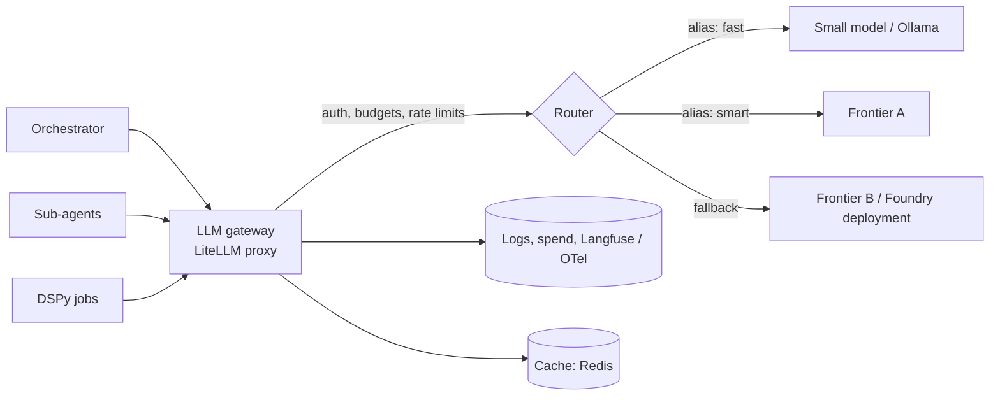

# Model selection, routing & gateways (LiteLLM)

!!! abstract "At a glance"
    **Priority:** P0 · **Complexity:** 3/5 · **Est. time:** 3 h · **Phase:** 4 · **Prereqs:** [LLM fundamentals](llm-fundamentals.md), [Cost & latency](cost-latency-optimization.md), [Rate limiting](../system-design/rate-limiting.md), [Reliability patterns](../system-design/reliability-patterns.md)
    **You're done when:** every LLM call in the capstone goes through a LiteLLM proxy with virtual keys, budgets, fallbacks and tracing; you have a model-selection matrix backed by your own evals; and you can defend gateway-vs-SDK-vs-managed decisions.

## Why it matters

Direct provider SDK calls scattered across services create five problems at once: no central cost attribution, no key hygiene, no failover when a provider has an outage or 429s, no way to swap models without redeploys, and no consistent logging or PII policy. An **LLM gateway** is the API-gateway pattern applied to models: one OpenAI-compatible endpoint in front of many providers, where auth, budgets, routing, retries, caching and observability live. In 2026, model churn is quarterly and outages are routine, so "change a model alias in config" is a resilience and negotiation capability, not a nicety.

Model **selection** is the companion skill: choosing per task from a menu of frontier, mid, small and local models using your own evals rather than leaderboards.

## Core concepts

### Gateway responsibilities



| Concern | What the gateway does |
|---|---|
| **Unified API** | One OpenAI-compatible surface (chat, responses, embeddings) over 100+ providers, including Azure/Foundry, Bedrock, Vertex, Ollama, vLLM |
| **Identity & keys** | Virtual keys per team/service/user with model allow-lists; provider keys never leave the gateway |
| **Budgets & limits** | Per-key/team/user spend caps, RPM/TPM limits |
| **Routing** | Load-balance across deployments; latency- or cost-based; priorities |
| **Resilience** | Retries with backoff, cooldown of unhealthy deployments, fallbacks (including context-window and content-policy fallbacks) |
| **Governance** | Guardrail hooks (PII masking, injection checks), audit log, data-retention controls |
| **Observability** | Callbacks to Langfuse/OTel; cost per request tagged by team/feature |
| **Caching** | Exact and semantic caching |

### Gateway landscape (Sept 2026)

| Option | Nature | Notes |
|---|---|---|
| **LiteLLM** (SDK + Proxy) | OSS, Python; SDK `Router` or standalone proxy server | De facto default; broad provider coverage; virtual keys/budgets in proxy; DSPy uses it under the hood |
| Portkey, Helicone, OpenRouter | SaaS/hybrid gateways | Fast start; data leaves your tenancy; OpenRouter is a marketplace/aggregator |
| Cloudflare AI Gateway, Kong AI Gateway, Envoy AI Gateway | API-gateway-native | Fit if your org already runs these; strong policy/rate-limit story |
| Azure API Management (GenAI gateway policies) / Foundry model router | Managed Azure | Token-limit policies, semantic caching, load-balancing across Azure OpenAI deployments |
| Pydantic AI Gateway | Vendor gateway | Integrated with Logfire |
| Roll your own | Thin FastAPI | Only if requirements are tiny; you will reinvent budgets, fallbacks and streaming edge cases |

### LiteLLM Router (in-process)

```python
# uv add litellm
import os
from litellm import Router

model_list = [
    {   # alias the app uses; two deployments behind it
        "model_name": "smart",
        "litellm_params": {"model": "azure/gpt-frontier-deploy-eu", "api_base": os.environ["AZ_EU_BASE"],
                           "api_key": os.environ["AZ_EU_KEY"], "rpm": 600, "order": 1},
    },
    {
        "model_name": "smart",
        "litellm_params": {"model": "anthropic/<claude-model-id>", "api_key": os.environ["ANTHROPIC_API_KEY"],
                           "order": 2},
    },
    {
        "model_name": "fast",
        "litellm_params": {"model": "ollama_chat/qwen3:8b", "api_base": "http://ollama:11434"},
    },
]

router = Router(
    model_list=model_list,
    routing_strategy="simple-shuffle",      # default, low overhead; alternatives: latency-based-routing,
                                            # usage-based-routing-v2 (needs Redis), least-busy, cost-based-routing
    num_retries=2, timeout=60,
    allowed_fails=3, cooldown_time=30,      # deployment cooldown after repeated failures
    fallbacks=[{"smart": ["fast"]}],        # last-resort degrade
    context_window_fallbacks=[{"fast": ["smart"]}],
)

async def ask(msg: str, alias: str = "smart") -> str:
    r = await router.acompletion(model=alias, messages=[{"role": "user", "content": msg}])
    return r.choices[0].message.content
```

### LiteLLM Proxy (the enterprise shape)

```yaml
# config.yaml
model_list:
  - model_name: smart
    litellm_params: {model: azure/gpt-frontier-deploy-eu, api_base: os.environ/AZ_EU_BASE, api_key: os.environ/AZ_EU_KEY}
  - model_name: smart
    litellm_params: {model: anthropic/<claude-model-id>, api_key: os.environ/ANTHROPIC_API_KEY}
  - model_name: fast
    litellm_params: {model: ollama_chat/qwen3:8b, api_base: http://ollama:11434}

router_settings:
  routing_strategy: simple-shuffle
  num_retries: 3
  allowed_fails: 3
  fallbacks: [{"smart": ["fast"]}]

litellm_settings:
  success_callback: ["langfuse"]        # per-request traces with cost
  cache: true                           # configure Redis backend for shared cache

general_settings:
  master_key: os.environ/LITELLM_MASTER_KEY
  database_url: os.environ/DATABASE_URL # enables virtual keys, teams, budgets, spend logs
```

Clients then use any OpenAI SDK with `base_url="http://litellm:4000"` and a **virtual key** created via the proxy API with `models`, `max_budget`, `budget_duration`, `rpm_limit`, `tpm_limit`, and `metadata` (team, feature) for attribution.

!!! warning "Gateway supply chain"
    A gateway holds every provider credential and sees every prompt. Pin versions, review advisories, run it in your network, restrict the admin UI, rotate the master key, and don't expose it publicly. Treat it like your identity provider.

### Routing strategies

| Strategy | How | When | Failure mode |
|---|---|---|---|
| **Static alias per use-case** | `triage → fast`, `investigate → smart` | Default. Explicit, testable | Misses per-request difficulty variance |
| **Rule-based** | Route by task type, input length, tenant tier, language | Predictable domains | Rules rot |
| **Cascade** | Try cheap model; escalate if confidence/verifier fails | Quality-sensitive, cost-sensitive | Latency of failed attempt; needs a reliable escalation signal |
| **Learned router** (RouteLLM-style) | Classifier predicts if weak model suffices | High volume, mixed difficulty; paper reports large savings at near-parity | Training data + drift; needs evals |
| **Provider-managed router** (e.g. Foundry model router) | Platform picks model per prompt | Simplicity on that platform | Opaque; hard to reproduce evals |
| **Load/health-based** | Across deployments of the *same* model | Capacity, resilience | Not quality routing |

Cascade signals: schema validation failure, low self-reported confidence (weak), a verifier/judge, retrieval-empty, tool error. Prefer *verifiable* signals over model self-confidence.

### Model selection: a process, not a leaderboard

1. Define **task classes** in the system (triage classification, extraction, RAG answer, planner, code-gen, judge).
2. Build **per-class eval sets** ([Evals I](evals-error-analysis.md)) with pass criteria.
3. Shortlist 3-5 candidates across tiers (frontier, mid, small, local open-weights) and providers.
4. Run the eval; record **quality, p50/p95 latency, cost per successful task, failure modes** (format errors, refusals).
5. Choose the **cheapest model meeting the quality SLO**, keep a runner-up as fallback, record an ADR with the date (models expire quickly).
6. **Re-run on each model release**; alias indirection makes swapping a config change.

Selection dimensions beyond quality: context window and effective context (recall degrades before the limit), tool-calling reliability, structured-output support, multilingual quality, data residency/regions, rate limits and quota approvals, licence (open weights), safety/refusal behaviour, and provider stability/SLA.

### Senior-level nuance

- **Aliases are the contract.** Apps request `smart`/`fast`, never `gpt-x-2026-08`. Version pinning lives in gateway config with a change log and eval gate.
- **Fallback quality is not free.** A silent fallback to a weaker model in an outage can degrade correctness invisibly. Tag responses with the served model; alert on fallback rate; some flows should *fail* rather than degrade (financial actions).
- **Streaming + fallbacks**: fallback after tokens have started streaming is not possible; decide on time-to-first-token timeouts and hedging.
- **Rate limits are per deployment/region**: spread across regions and deployments; use `order`/priority for provisioned throughput first, PAYG as overflow.
- **Prompt portability**: prompts tuned for one model degrade on another. Keep model-specific prompt variants in config, or use DSPy/GEPA to re-optimise ([DSPy](dspy.md)).
- **Data policy per route**: EU-only data must never fall back to a US deployment; encode residency in the routing config (separate aliases per region/tier).
- **Gateway overhead**: expect single-digit milliseconds to low tens of ms at moderate load; measure it, and scale horizontally with Redis for shared state.

## Resources

| Resource | Type | Why this one | Level | Cost |
|---|---|---|---|---|
| [LiteLLM docs](https://docs.litellm.ai/docs/) | docs | Router, proxy, providers, callbacks | intermediate | free |
| [LiteLLM virtual keys](https://docs.litellm.ai/docs/proxy/virtual_keys) | docs | Budgets, limits, teams, key metadata | intermediate | free |
| [LiteLLM caching](https://docs.litellm.ai/docs/proxy/caching) | docs | Redis/semantic caching at the gateway | intermediate | free |
| [LiteLLM on GitHub](https://github.com/BerriAI/litellm) | docs | Source, issues, security advisories to monitor | advanced | free |
| [RouteLLM paper (arXiv 2406.18665)](https://arxiv.org/abs/2406.18665) | paper | Learned routing with preference data; cost/quality curves | advanced | free |
| [RouteLLM repo](https://github.com/lm-sys/RouteLLM) :gem: | docs | Runnable open-source router framework and evaluation | advanced | free |
| [applied-llms.org](https://applied-llms.org/) | article | Model choice and evals from practitioners | intermediate | free |
| [Langfuse docs](https://langfuse.com/docs) | docs | Attribute cost/latency by model, user, feature | intermediate | free |
| [Hamel Husain: evals FAQ](https://hamel.dev/blog/posts/evals-faq/) | article | Grounding model selection in your own evals | intermediate | free |

## Hands-on lab

**Goal (90 min):** put the capstone behind a gateway.

1. Add `litellm` (proxy image) to docker-compose with Postgres and Redis; config with aliases `fast` (Ollama) and `smart` (a hosted model or Foundry deployment) plus a second deployment for `smart`.
2. Create virtual keys: `orchestrator` (both aliases, $20/day), `evals` (smart only, $5/day), `dspy-jobs` (fast+smart, $10 total). Verify a budget breach returns a clear error.
3. Point all services (LangGraph, Pydantic AI, DSPy) at `http://litellm:4000` via `base_url` and the virtual key; enable the Langfuse callback with `metadata` = `{feature, tenant}`.
4. **Chaos test:** block the primary `smart` deployment (bad key or firewall); confirm retries, cooldown, and fallback; measure added latency and the fallback rate metric; verify responses carry the served model.
5. **Selection eval:** run your triage eval on 4 candidates; produce the quality/cost/latency table; pick with a written ADR.
6. Add a simple cascade for triage: `fast` first, escalate to `smart` if schema validation fails or the verifier disagrees; compare cost vs always-`smart`.

**Expected output:** working gateway, spend by key in the UI, a fallback demo, and an ADR with the selection matrix.

## Questions

### L1 — Recall

??? question "Q1. List six responsibilities of an LLM gateway."
    ??? success "Answer"
        Unified OpenAI-compatible API, virtual keys/identity, budgets and rate limits, routing/load-balancing, retries/cooldowns/fallbacks, caching, guardrail hooks/PII redaction, logging/observability and cost attribution.

??? question "Q2. What does LiteLLM's default `simple-shuffle` strategy do and why is it the recommended default?"
    ??? success "Answer"
        Randomly picks among healthy deployments weighted by RPM/TPM or weights; minimal overhead and no shared state, which keeps latency low and scales horizontally. Use latency/usage-based strategies only if you need them (usage-based-v2 requires Redis).

??? question "Q3. Difference between `fallbacks` and `context_window_fallbacks`?"
    ??? success "Answer"
        `fallbacks` trigger on failures (errors, rate limits after retries) and route to alternate model groups; `context_window_fallbacks` trigger when the prompt exceeds the model's context window and route to a larger-context model.

### L2 — Apply

??? question "Q4. A team's key hit its budget mid-day and their agent silently produced empty answers. What should have happened?"
    ??? success "Answer"
        The gateway returns a 4xx budget-exceeded error; the client must surface it as a typed failure (not swallow it), alerts should fire at 80% budget, and the agent should degrade explicitly (queue, cheaper alias if policy allows) rather than return empty output. Add tests for budget errors in the agent's error handling.

??? question "Q5. Design a cascade for invoice-field extraction: cheap model first. What escalation signals do you use?"
    ??? success "Answer"
        Schema/validator failures (required fields missing, totals not summing, date format), cross-field consistency checks, retrieval against vendor master data mismatch, low OCR confidence, or a judge/verifier disagreement. Avoid raw self-reported confidence. Track escalation rate and per-tier accuracy; tune thresholds so escalated fraction is ~10-30%.

??? question "Q6. Your fallback from `smart` to `fast` during an outage raised task failures downstream. What controls do you add?"
    ??? success "Answer"
        Per-flow policy: critical flows fail closed or queue instead of degrading; fallback group of equivalent-quality models in another provider/region first; response metadata with served model; alert on fallback rate; downstream validation steps; eval the fallback models on the flow's eval set beforehand.

### L3 — Design & trade-offs

??? question "Q7. LiteLLM proxy vs cloud-native gateway (Azure APIM / Foundry) vs direct SDK calls for a multi-cloud enterprise."
    ??? success "Answer"
        Direct SDK: simplest, no central control — fine for prototypes only. Cloud-native: deep IAM/network/policy integration, managed HA, but tied to one cloud and weaker cross-provider routing. LiteLLM: multi-provider, virtual keys/budgets, quick iteration, but you operate it and it holds all keys (security-critical). Common pattern: LiteLLM (or equivalent) as the app-facing gateway, with cloud-native gateways/private endpoints behind it for specific providers; or APIM in front of LiteLLM for enterprise auth. Choose by team's ops capacity and residency constraints.

??? question "Q8. Learned router vs static aliases vs cascade for a support bot at 5M requests/month with 60% easy queries."
    ??? success "Answer"
        Start with static aliases by intent (classification is itself cheap) — easy to test. If mixed difficulty inside an intent remains, add a cascade with a verifiable escalation signal. A learned router pays off at high volume with stable distribution and labelled preference data; requires training, monitoring and drift handling. Evaluate savings vs complexity: at 5M/month, 60% easy, the cascade or router can save six figures annually, but only with per-tier quality tracking.

??? question "Q9. Where do data-residency rules belong: app code, gateway config, or network?"
    ??? success "Answer"
        All three, with the gateway as the enforcement point: separate model groups per region (no cross-region fallbacks), virtual keys restricted to allowed groups, network egress rules preventing direct provider access, and app-level tenant→region mapping. Test by simulating regional outages to confirm no cross-region leakage.

### L4 — Staff-level ambiguity

??? question "Q10. Five teams have their own provider keys and contracts. Propose the gateway rollout without a big-bang migration."
    ??? success "Answer"
        Offer the gateway as a paved road with immediate benefits (central billing, fallbacks, free tracing, spend visibility) and near-zero migration (change `base_url`). Start with new services and pain-point teams. Consolidate contracts once usage is visible for volume negotiation. Set a sunset date for direct keys, block egress to provider domains except from the gateway, and provide SLAs/on-call for the gateway. Track adoption and incidents; fix noisy-neighbour issues via per-team limits.

??? question "Q11. Vendor launches a cheaper model claiming parity. How does the org decide whether to switch?"
    ??? success "Answer"
        Automated, not political: nightly/on-demand eval pipeline runs each task class's eval set against candidates via the gateway; compare quality (with confidence intervals), latency, cost per successful task, safety evals; canary a small % of traffic with shadow comparison; ADR with rollout/rollback; contract and data-processing terms reviewed. Because apps use aliases, the switch is config plus canary. Publish results to earn trust.

## Real-world use cases

- **Enterprise platform team**: one gateway for 30 services, per-team budgets, monthly showback, Foundry and Bedrock deployments as targets.
- **Ops copilot**: `fast` local model for alert classification; `smart` for investigations; regional deployments for EU data.
- **Batch document pipeline**: gateway-level rate limiting protects interactive traffic from batch jobs sharing the same provider quota.
- **Resilience**: multi-provider fallbacks during provider incidents without app redeploys.

## Pitfalls & anti-patterns

- Hard-coding provider model IDs in application code.
- Silent fallbacks to weaker models.
- Exposing the gateway or master key broadly.
- One shared key for all teams (no attribution).
- Choosing models from leaderboards without task evals.
- Cross-region fallbacks violating residency.
- Cascades keyed on the model's own confidence.

## Checklist

- [ ] I can explain gateway responsibilities and compare gateway options
- [ ] The capstone runs through LiteLLM with virtual keys, budgets, tracing
- [ ] I demonstrated retries, cooldown and fallback under failure
- [ ] I built a selection matrix from my own evals and wrote an ADR
- [ ] I answered all L3 questions out loud in < 3 min each
