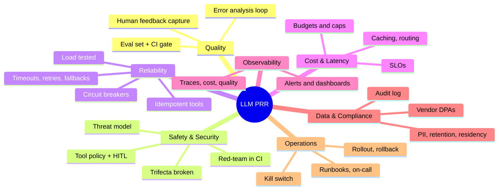

# Shipping LLM features to production: the checklist

!!! abstract "At a glance"
    **Priority:** P0 · **Complexity:** 3/5 · **Est. time:** 2 h · **Phase:** 4 · **Prereqs:** [Evals I](evals-error-analysis.md), [LLM observability](llm-observability.md), [Guardrails & security](guardrails-security.md), [Cost & latency](cost-latency-optimization.md), [Observability & SLOs](../system-design/observability-slos.md)
    **You're done when:** the capstone passes a written go-live review covering evals, safety, cost, reliability, observability, data governance, rollout and incident readiness, and you can defend each item (and consciously accepted gaps) to a security reviewer and an SRE.

## Why it matters

Prototype-to-production for LLM features fails in predictable ways: no eval so regressions ship silently, no budget so a loop burns $5k overnight, no fallback so a provider outage is your outage, no injection defence so a PDF drives the agent, no rollback because the prompt lives in someone's notebook. This page is the integrated capstone of the track: a **production readiness review (PRR)** you run before launch and re-run quarterly.

It is also a strong interview frame: "You're launching an agent to 10,000 employees on Monday. What do you need in place?"

## Core concepts

### Readiness dimensions



### The checklist

Use as a gate: each item is **Done / Accepted risk (owner + date) / N/A (why)**. Severity tags: **[B]** blocker for launch, **[S]** should have within 30 days.

#### 1. Product & scope

- [ ] **[B]** Clear job-to-be-done, target users and *non-goals*; what happens when the AI can't help (graceful handoff to human/UI).
- [ ] **[B]** Autonomy level defined (suggest / act-with-approval / act-autonomously) per action; irreversible actions require HITL.
- [ ] **[S]** UX communicates uncertainty, shows sources/citations, lets users correct and give feedback (thumbs + free text).
- [ ] **[S]** AI-disclosure and terms updated; user control over data/memory.

#### 2. Quality & evals ([Evals I](evals-error-analysis.md), [Eval tooling](eval-tooling.md))

- [ ] **[B]** Eval set from real/representative data (≥ 100-300 cases; includes adversarial and edge cases); pass criteria tied to product goals.
- [ ] **[B]** Error analysis done on failures; top failure modes categorised and mitigated or accepted.
- [ ] **[B]** Automated evals run in CI on every prompt/model/tool/retrieval change with regression thresholds (promptfoo/DeepEval/Ragas/Inspect).
- [ ] **[B]** LLM judges validated against human labels (agreement measured).
- [ ] **[S]** Online evals/monitors sample production traces; drift detection; feedback loops into the eval set.
- [ ] **[S]** Slice metrics (language, tenant, query type), not only averages.
- [ ] **[S]** RAG: retrieval metrics (recall@k, MRR) separate from generation metrics.

#### 3. Safety & security ([Guardrails](guardrails-security.md))

- [ ] **[B]** Threat model documented against OWASP LLM Top 10 and Agentic Top 10; lethal trifecta broken per context.
- [ ] **[B]** Least-privilege identity per agent; user-delegated (OBO) access to user data; no shared broad service credentials.
- [ ] **[B]** Tool-policy layer (allow-lists, arg validation, egress control, rate limits); write tools gated by HITL or scopes.
- [ ] **[B]** Output handling: schema validation, safe rendering (no arbitrary markdown images/links), encoded sinks.
- [ ] **[B]** Sandboxed code execution/browsing; no prod credentials in tool environments.
- [ ] **[B]** Tenant isolation tested for retrieval, memory, caches and logs.
- [ ] **[S]** Automated red-team (promptfoo OWASP agentic preset / PyRIT) with tracked attack success rate; human red-team before major expansion.
- [ ] **[S]** MCP servers/skills/plugins from an approved registry, versions pinned.

#### 4. Reliability ([Reliability patterns](../system-design/reliability-patterns.md))

- [ ] **[B]** Timeouts on every LLM/tool call; bounded retries with backoff + jitter on retryable errors only; idempotency keys on write tools.
- [ ] **[B]** Step, token, time and cost limits per run (loop guard); recursion limit; max fan-out for sub-agents.
- [ ] **[B]** Fallback plan: secondary model/provider/region ([gateway](model-routing-gateways.md)); tested by chaos drill; degraded mode UX; critical flows fail closed.
- [ ] **[B]** Rate-limit and quota headroom verified (provider TPM/RPM, provisioned capacity) at 2x expected peak.
- [ ] **[S]** Durable execution for long tasks (checkpointing, resume) ([Durable execution & HITL](durable-execution-hitl.md)); poison-run handling.
- [ ] **[S]** Circuit breakers on tools and providers; bulkheads between interactive and batch traffic.
- [ ] **[S]** Load test with realistic prompts; capacity model documented ([Capacity & cost](../ai-system-design/capacity-cost-planning.md)).

#### 5. Cost & latency ([Cost & latency](cost-latency-optimization.md))

- [ ] **[B]** Cost per successful task measured on the eval set and in shadow traffic; monthly forecast at expected and 3x volume.
- [ ] **[B]** Budgets and alerts per key/team/user in the gateway; hard caps; runaway-loop protection.
- [ ] **[S]** Prompt caching structure verified (hit rate ≥ target); context diet done; routing/cascade evaluated.
- [ ] **[S]** Latency SLOs (TTFT, p95 end-to-end) defined; streaming and progress UI in place.

#### 6. Observability ([LLM observability](llm-observability.md))

- [ ] **[B]** End-to-end traces per request: prompts, tool calls, retrieved context IDs, model/version, tokens, cost, latency, errors; trace ID returned to users for support.
- [ ] **[B]** Dashboards + alerts: error rate, fallback rate, refusal/guardrail-trigger rate, cost/hour, p95 latency, cache hit rate, tool failure rate, eval-score drift.
- [ ] **[B]** PII redaction/retention policy applied to traces; access-controlled.
- [ ] **[S]** OTel GenAI semantic conventions (still "Development" status as of Sept 2026 — pin the version you emit) so backends are swappable.
- [ ] **[S]** Prompt/config versions attached to every trace.

#### 7. Data governance & compliance

- [ ] **[B]** Data classification of everything entering prompts; vendor DPAs, zero/limited retention, no-training terms; region/residency enforced in routing.
- [ ] **[B]** PII/secret detection before logging, memory and third-party calls; retention TTLs.
- [ ] **[B]** Right-to-erasure path covering memory, vector stores, caches, traces, eval datasets ([Memory systems](memory-systems.md)).
- [ ] **[S]** Audit log of agent actions with user identity, inputs, approvals, outcomes (immutable).
- [ ] **[S]** Regulatory mapping (EU AI Act risk tier and obligations, sector rules, works-council/HR constraints where employees are users); model cards/documentation for tuned models.
- [ ] **[S]** Third-party model/licence review for open-weights and fine-tunes.

#### 8. Change management ([DSPy](dspy.md), [AI-assisted development](ai-assisted-development.md))

- [ ] **[B]** Prompts, tool schemas, model aliases, retrieval config are **versioned artifacts in git** with review; no prompt edits in a UI without history.
- [ ] **[B]** Every change runs the eval gate; model upgrades are canaried via the gateway with shadow comparison.
- [ ] **[B]** One-step rollback (config flip) tested.
- [ ] **[S]** Deprecation tracking for models/APIs (provider retirement dates, e.g. Assistants API retired 2026-08-26); quarterly upgrade slot.
- [ ] **[S]** Dependency pinning for SDKs (fast-moving) with automated update PRs and eval gates.

#### 9. Rollout & operations

- [ ] **[B]** Staged rollout: internal dogfood → 1-5% canary → 25% → 100%; success and abort criteria defined up front.
- [ ] **[B]** **Kill switch** (feature flag) disabling agent actions or the whole feature within minutes, tested.
- [ ] **[B]** On-call runbooks for: provider outage, cost spike, prompt-injection incident, bad-output incident (wrong action taken), data leak; owners named.
- [ ] **[S]** Incident taxonomy and postmortem template for AI incidents; feedback into evals.
- [ ] **[S]** Support workflow: how a user reports a bad answer; trace lookup; SLA.
- [ ] **[S]** Post-launch review at 2 and 6 weeks with metrics (quality, adoption, cost, incidents).

### Go/no-go template

```markdown
## PRR summary — Ops Copilot v1 (date)
Autonomy: read-only investigation autonomous; restarts require approval.
Blockers open: 0  · Accepted risks: [semantic cache off; red-team ASR 4% on ASI02, owner: Sec, revisit 2026-11-01]
Evals: triage acc 91% (CI gate ≥88%); groundedness 94%; judge κ=0.78 vs humans.
Cost: $0.06/task p50, $0.31 p95; forecast $9.4k/mo @ 50k tasks/day; hard cap $400/day.
Reliability: fallback drill passed (2026-09-20); load test 3x peak OK; kill switch drill passed.
Security: trifecta broken (see threat model); tool policy enforced; sandbox for code tool.
Decision: GO to 5% canary; abort if fallback>5%, cost/task>2x forecast, or any sev-1 action w/o approval.
```

### The launch-week failure list (things that actually bite)

1. Provider rate limits or quota not raised → 429 storms at launch.
2. A cache-busting change (timestamp in prompt) triples cost on day 2.
3. Agent loop on ambiguous input burns budget (no step/cost cap).
4. A tool returns 2 MB JSON → context overflow → errors.
5. Users paste secrets/PII into chat; logs retain them.
6. Model silently updated (alias → new snapshot) and behaviour shifts; no version pinning or canary.
7. Evals passed on a clean dataset; production inputs are messier (typos, mixed languages, pasted emails).
8. No human escalation path when the agent fails; users stuck.
9. Injection via an email/ticket triggers a write action nobody expected.
10. Nobody owns the prompt/eval set after launch; quality decays.

### Senior-level nuance

- **Ship a smaller autonomy level first.** "Suggest" → "act with approval" → "act autonomously on low-risk classes" is a launch strategy *and* a data-collection strategy (approvals produce labelled data).
- **Define SLOs for quality, not just uptime**: e.g. "≥ 90% of triage suggestions accepted without edit"; error budgets can gate feature velocity.
- **Accepted risks need owners and dates.** A risk register is the honest artefact; "we'll fix it later" without a date is a decision to not fix.
- **Reviews scale by tier.** Read-only internal assistant ≠ customer-facing agent taking payments; scale the PRR depth.
- **Operational ownership**: the team that ships owns the pager for the agent, including "the model got dumber this week".

## Resources

| Resource | Type | Why this one | Level | Cost |
|---|---|---|---|---|
| [Hamel Husain: LLM evals FAQ](https://hamel.dev/blog/posts/evals-faq/) | article | Practical eval-driven development for shipping | intermediate | free |
| [applied-llms.org](https://applied-llms.org/) | article | Tactical/operational/strategic lessons from teams shipping LLM products | intermediate | free |
| [Anthropic: Building effective agents](https://www.anthropic.com/engineering/building-effective-agents) | article | Simplicity, tool design and evaluation guidance | intermediate | free |
| [OWASP Top 10 for LLM Applications](https://genai.owasp.org/llm-top-10/) | docs | Security checklist backbone | intermediate | free |
| [OWASP Top 10 for Agentic Applications 2026](https://genai.owasp.org/resource/owasp-top-10-for-agentic-applications-for-2026/) | docs | Agent-specific risks ASI01–ASI10 | intermediate | free |
| [NIST AI Risk Management Framework](https://www.nist.gov/itl/ai-risk-management-framework) | docs | Governance vocabulary for risk reviews | intermediate | free |
| [EU AI Act explorer](https://artificialintelligenceact.eu) | docs | Obligations by risk tier for EU deployments | intermediate | free |
| [Google SRE Workbook](https://sre.google/workbook/table-of-contents/) | book | SLOs, alerting, incident management applicable to LLM services | intermediate | free |
| [Google: Rules of Machine Learning](https://developers.google.com/machine-learning/guides/rules-of-ml) :gem: | article | Timeless production ML lessons (metrics first, monitoring, launch discipline) | intermediate | free |
| [Chip Huyen: AI Engineering (book repo)](https://github.com/chiphuyen/aie-book) | book | Systems view: evals, deployment, monitoring, feedback | intermediate | paid |

## Hands-on lab

**Goal (90 min):** run a PRR on the capstone and fix the top blockers.

1. Copy the checklist into `docs/log/prr-ops-copilot.md`; mark each item Done / Accepted / N/A with evidence links (trace, CI run, dashboard).
2. **Drills** (do at least three): (a) provider failure — block the primary model, verify fallback and alerts; (b) runaway loop — feed an ambiguous task and confirm caps stop it and emit a metric; (c) kill switch — flip the flag mid-conversation; (d) injection — replay the poisoned log line from the security lab; (e) erasure — run `forget_user` and verify.
3. **Cost forecast:** from 50 traced tasks compute p50/p95 cost/task; forecast at 1k/10k/50k tasks/day; set the gateway hard cap.
4. **Dashboards:** build one Langfuse/Grafana dashboard with the eight production metrics listed in section 6.
5. Fill in the go/no-go template; have a peer (or an LLM playing skeptical security reviewer) challenge it; record accepted risks with owners and dates.

**Expected output:** completed PRR document with evidence, three drill reports, dashboard screenshot, and a go/no-go summary.

## Questions

### L1 — Recall

??? question "Q1. List five things that must be capped per agent run."
    ??? success "Answer"
        Steps/iterations (recursion limit), tokens, wall-clock time, cost, and fan-out/depth of sub-agents (also tool calls per tool and retries).

??? question "Q2. What is a kill switch in this context and what should it disable?"
    ??? success "Answer"
        A feature flag/config that quickly disables the agent's actions or the entire AI feature (without deploy), returning users to a safe manual path. It should be testable, reachable by on-call, and able to disable write tools independently of read-only functions.

??? question "Q3. Why must prompts, tool schemas and model aliases be versioned in git?"
    ??? success "Answer"
        They determine behaviour like code does: versioning enables review, diffs, evals per change, traceability (attach version to traces), rollback and audit.

### L2 — Apply

??? question "Q4. Eval accuracy is 92% but user complaints spike after launch. List investigation steps."
    ??? success "Answer"
        Compare production input distribution to the eval set (languages, length, noise); slice failures from traces and user feedback; check model alias/version changes, fallback rate, and retrieval quality; sample and label recent production traces; identify new failure modes and add them to the eval set; check tool errors/timeouts; confirm guardrails aren't over-blocking. Fix, re-run gates, and add online monitors.

??? question "Q5. Compute the daily cost cap: forecast 20k tasks/day at $0.06 p50, p95 $0.30; you want protection against 3x traffic and a loop bug."
    ??? success "Answer"
        Expected ≈ $1.2k/day at p50 (with tail maybe ~$1.6k). 3x traffic ≈ $4.8k. Set gateway alerts at ~1.5x forecast (~$2.4k), hard cap near $5k/day, and per-run cap (e.g. $1) so a single loop can't consume budget; per-user caps to contain abuse. Page on-call at the alert, not the cap.

??? question "Q6. Design the canary for switching the triage alias to a cheaper model."
    ??? success "Answer"
        Offline eval first (quality SLO met). Shadow mode: run new model in parallel on 100% traffic without user impact and compare outputs/judges. Then 5% live traffic via gateway weights with monitors on acceptance rate, escalation rate, schema failures, latency, cost. Abort criteria defined upfront; ramp to 25/50/100% over days; keep rollback as a weight flip; record ADR.

### L3 — Design & trade-offs

??? question "Q7. Launch fast with known gaps vs delay for full safety review — how do you decide?"
    ??? success "Answer"
        Risk-tier the launch: blast radius (users, data sensitivity, action irreversibility). For low-risk read-only internal use, launch with a canary, kill switch and accepted risks with owners/dates. For actions with financial/customer impact or external data exposure, blockers (identity, HITL, policy layer, tenant isolation) are non-negotiable. Reduce scope (autonomy level, user group) rather than skipping controls. Document the decision in the PRR.

??? question "Q8. Where do you put the eval gate in the delivery pipeline given evals are slow and costly?"
    ??? success "Answer"
        Tiered: fast smoke set (20-50 cases, cheap model/judge) on every PR; full suite nightly and on changes to prompts/tools/models/retrieval; pre-release gate with full suite + red-team; production canary with online metrics. Use caching for deterministic parts, sampling for judge calls, and parallelism; budget the eval cost explicitly.

??? question "Q9. What should the on-call runbook for 'agent took a wrong action' contain?"
    ??? success "Answer"
        Immediate containment (kill switch/disable write tools, revoke tokens), identification via trace ID of what happened and which identity/approval, blast-radius query (other affected actions/users), remediation/rollback of the action, notification paths (security, legal, affected owners), evidence preservation, root-cause categories (prompt injection, tool bug, model error, approval flaw), and the follow-ups: eval case added, policy/tool changes, postmortem.

### L4 — Staff-level ambiguity

??? question "Q10. Three teams want to launch agents this quarter; you have one platform engineer. Prioritise the platform investments."
    ??? success "Answer"
        Highest leverage shared capabilities first: LLM gateway with budgets/fallbacks/tracing; a standard eval CI template; the tool-policy/HITL library and threat-model template; a trace/dashboard baseline; then MCP registry and sandbox service. Provide a PRR checklist and office hours; require teams to meet blockers themselves using the templates. Sequence launches by risk (read-only first). Track adoption; avoid building bespoke features for one team.

??? question "Q11. An exec asks 'how do we know the AI isn't getting worse over time?' Design the answer."
    ??? success "Answer"
        Continuous quality monitoring: pinned model versions with scheduled canary evals on any change; nightly eval on a fixed golden set (detects provider drift); online sampling of production traces scored by validated judges plus human review of a small sample; user feedback rates and edit/acceptance rates; drift detection on input distribution and retrieval stats; dashboards with alert thresholds; quarterly error-analysis review feeding the eval set. Report a quality SLO with error budget to leadership.

## Real-world use cases

- **Ops copilot launch** (logistics): staged rollout from control-tower team to regional ops; kill switch and approvals for restarts.
- **Customer-facing shipment assistant**: PRR with stricter injection defences, tenant isolation, and legal review (EU AI Act transparency).
- **Document intelligence pipeline**: batch quality monitors, sampling human QA, and cost caps per job.
- **Internal HR/policy assistant**: high sensitivity — memory off by default, strict retention, works-council consultation.

## Pitfalls & anti-patterns

- Launching with only demo-set evals.
- No per-run and per-day caps.
- Unpinned model aliases updated by the provider.
- Logging full prompts with PII into a wide-access tool.
- Skipping the rollback drill.
- Treating the PRR as a one-time paperwork exercise.
- No named owner for prompts/evals after launch.

## Checklist

- [ ] I can recite the nine PRR sections and blockers from memory
- [ ] I ran a PRR on the capstone with evidence and three drills
- [ ] I have a cost forecast, caps, and alerts in the gateway
- [ ] I can present the go/no-go summary and accepted risks
- [ ] I answered all L3 questions out loud in < 3 min each
