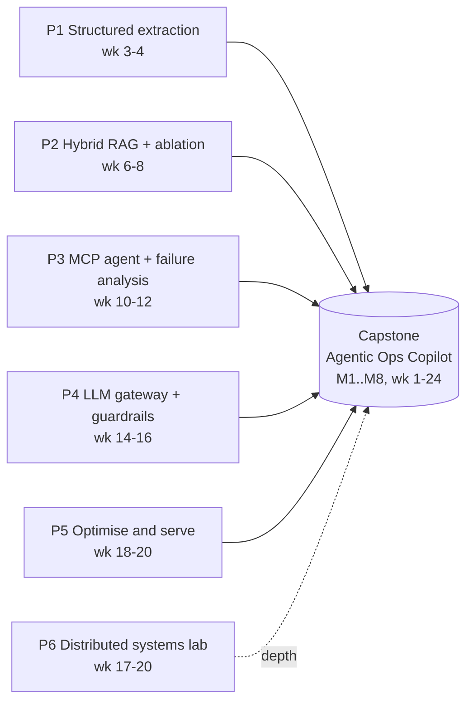

# Projects

!!! abstract "How projects work"
    **One capstone, built incrementally** across all 24 weeks, plus **six phase mini-projects** that each de-risk one hard part of it.
    Mini-projects are deliberately *narrower and deeper* than the capstone slice they feed: you run the experiment, write the report, then merge the winning design into the capstone.
    Everything is judged against one [project rubric](rubric.md) so you can see your growth from Phase 1 to Phase 6.

## The model



- **Capstone = the portfolio piece.** A production-grade, domain-agnostic *operations copilot*. Example domain: logistics shipment exceptions and trade documents (easy to swap for IT ops, claims, procurement). See [capstone spec](capstone.md).
- **Mini-projects = the evidence.** Each one ends in a *report with numbers* (ablation table, failure taxonomy, benchmark, go/no-go memo). These reports are what you talk about in Staff and AI system design interviews: "we measured X, chose Y, here's the trade-off."
- **Code lives in a separate repo you create** (suggested name: `agentic-ops-copilot`, public on GitHub). This site holds specs, rubrics and write-ups only. Mini-projects live either as folders in that repo (`experiments/p2-rag-ablation/`) or as their own small repos; P6 (Gossip Glomers) should be its own repo.

## Every project ships four things

| Deliverable | What "done" looks like |
|---|---|
| **Code** | Runs from a clean clone with one command (`uv sync && make up` or `docker compose up`). Typed (`ty`/`mypy` clean), linted (`ruff`), tested (`pytest`), CI green. |
| **README** | Problem, architecture diagram (Mermaid/C4), how to run, how to evaluate, known limitations, cost to run. |
| **Write-up** | 800–2000 words, blog-quality: question → method → results table → decision → what you'd do next. Publish at least 2 of these publicly by week 24. |
| **ADRs** | 1+ per week on the capstone, 2–4 per mini-project, in `docs/adr/NNNN-title.md` using the [ADR practice](../../architecture/adrs.md) (context, decision, alternatives, consequences, status). |

!!! tip "Eval-first rule"
    Before writing the feature, write the eval: a golden set (even 20 examples), a metric, and a threshold. A project without an eval harness scores at most 2 on the rubric's *Evals* dimension, regardless of how good the demo looks. See [evals and error analysis](../evals-error-analysis.md).

## All projects

| Project | Phase | Weeks | Core skills | Key artefact | Rubric |
|---|---|---|---|---|---|
| [Capstone: Agentic Ops Copilot](capstone.md) | 1–6 | 1–24 | End-to-end agentic system, LangGraph, Pydantic AI, MCP, RAG, evals, observability, guardrails, gateway, Azure | Running system + 15 ADRs + 2 blog posts | [rubric](rubric.md) |
| [P1 Structured extraction service](p1-structured-extraction-service.md) | 1 | 3–4 | FastAPI, Pydantic v2, Pydantic AI, structured outputs, first eval harness | Field-level accuracy report | [rubric](p1-structured-extraction-service.md#rubric) |
| [P2 Hybrid RAG with ablation](p2-hybrid-rag-with-ablation.md) | 2 | 6–8 | pgvector, BM25, reranking, chunking, Ragas/DeepEval, Langfuse | Ablation report (recall@k, MRR, faithfulness) | [rubric](p2-hybrid-rag-with-ablation.md#rubric) |
| [P3 MCP agent and failure analysis](p3-mcp-agent-and-failure-analysis.md) | 3 | 10–12 | LangGraph, HITL, MCP (Python + Spring AI 2.0), tool design, trajectory evals | Failure-mode taxonomy report | [rubric](p3-mcp-agent-and-failure-analysis.md#rubric) |
| [P4 LLM gateway and guardrails](p4-llm-gateway-and-guardrails.md) | 4 | 14–16 | LiteLLM, routing, semantic caching, budgets, OWASP LLM/Agentic, promptfoo red-team | Red-team report + cost/latency dashboard | [rubric](p4-llm-gateway-and-guardrails.md#rubric) |
| [P5 Optimise and serve](p5-optimize-and-serve.md) | 5 | 18–20 | DSPy/GEPA, vLLM/Ollama benchmarking, quantisation, LoRA fine-tune | Go/no-go memo | [rubric](p5-optimize-and-serve.md#rubric) |
| [P6 Distributed systems lab](p6-distributed-systems-lab.md) | 5 | 17–20 | Gossip, CRDTs, Kafka-style logs, transactions, Maelstrom/Jepsen-style testing | Solutions repo + write-up | [rubric](p6-distributed-systems-lab.md#rubric) |

!!! note "P5 and P6 overlap (weeks 17–20)"
    Phase 5 has two projects. Budget: P5 gets the Saturday build blocks, P6 gets ~2 h of weekday system-design time. If you slip, P6 challenges 5c/5d/6c move to buffer weeks 25–26; P5's go/no-go memo does not.

## Weekly rhythm for project work

| Slot | Project activity |
|---|---|
| Saturday (3 h) | Main build block: implement the milestone slice. |
| Sunday (first 1.5 h) | Run evals, fix regressions, write the ADR for the week's decision. |
| One weekday (~30 min) | Update README / write-up draft; groom the milestone checklist. |
| End of phase | Score yourself on the [rubric](rubric.md); record scores in the capstone repo `docs/scorecard.md`; fix the lowest dimension first next phase. |

## Scoring and gates

- Score each project on the [generic rubric](rubric.md) (7 dimensions, 1–4). Project pages add project-specific criteria.
- **Phase gate:** average >= 3.0 and no dimension below 2. If you miss, spend the first Saturday of the next phase closing the gap before starting new work.
- **By week 24:** capstone average >= 3.5, Evals and Security both 4. That is the bar for "Staff-level portfolio".

## Suggested repo layout (capstone repo)

```text
agentic-ops-copilot/
  apps/            # deployable services (gateway, orchestrator, mcp servers)
  packages/        # shared libs (domain, rag, evals)
  experiments/     # p1..p5 mini-project notebooks/scripts + reports
  evals/           # golden sets, promptfoo + DeepEval configs
  docs/adr/        # ADRs (numbered)
  docs/writeups/   # project reports
  infra/           # docker-compose, Bicep/Terraform for Azure
```

Full layout and milestones: [capstone spec](capstone.md).
