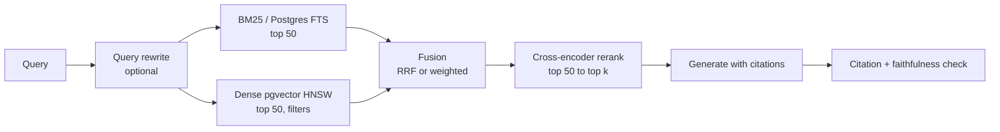

# P2: Hybrid RAG with ablation study

!!! abstract "At a glance"
    **Phase:** 2 · **Weeks:** 6–8 (~12 h build) · **Feeds:** capstone M3, ADRs 0003–0006
    **Goal:** Build a hybrid retrieval pipeline (BM25/FTS + dense + metadata filters → fusion → cross-encoder rerank → cited answer) on Postgres + pgvector, then run a controlled **ablation study** that shows which knobs matter: chunking, hybrid weights/fusion, reranker, k.
    **Done when:** a report with an ablation table (recall@k, MRR, nDCG, faithfulness, latency, cost) justifies every default in your pipeline, and the eval runs in CI with a regression gate.

## Why this project

"Which chunk size?" and "do we need a reranker?" are the questions every RAG team argues about without data. The Staff move is to build the harness that ends the argument. Your ablation report is also the single best artefact for an AI system design interview on [enterprise RAG](../../ai-system-design/rag-system.md).

## Skills practised

- [RAG fundamentals](../rag-fundamentals.md), [hybrid search and reranking](../hybrid-search-reranking.md), [advanced RAG](../advanced-rag.md)
- [Vector databases](../vector-databases.md): HNSW parameters (`m`, `ef_construction`, `ef_search`), filtered search pitfalls
- [Search systems](../../system-design/search-systems.md): inverted indexes, BM25
- [Eval tooling](../eval-tooling.md) and [evals and error analysis](../evals-error-analysis.md)
- [LLM observability](../llm-observability.md): Langfuse traces for retrieval spans
- [Data tooling](../../python/data-tooling.md): Polars/DuckDB for analysing results

## Spec

### Corpus and golden set

- **Corpus:** 150–400 documents in the example domain: SOPs, carrier terms, SLA contracts, incident post-mortems, FAQ pages. Mix of long PDFs and short pages; include near-duplicates and superseded versions (effective dates) because production corpora have them. Synthetic + public docs only.
- **Golden set:** 150 questions, each with relevant chunk/doc IDs and a reference answer. Distribution:

| Type | Share | Example |
|---|---|---|
| Single-fact lookup | 30% | "What is the free time at destination for tier-B customers?" |
| Keyword/ID-heavy | 15% | "What does SOP-114 say about reefer alarms?" (BM25 should win) |
| Paraphrase/semantic | 20% | "What happens if the box sits too long at the port?" (dense should win) |
| Multi-hop | 15% | "Which penalty applies if a tier-A shipment misses cut-off at a transhipment port?" |
| Temporal/versioned | 10% | "What was the policy before the 2026 revision?" |
| Unanswerable | 10% | Must refuse |

Build it with a mix of: hand-written (at least 50), LLM-generated from chunks then **human-filtered**, and real-style questions from your own ops experience.

### Pipeline (the system under test)

### Ablation grid

| Factor | Levels |
|---|---|
| Chunking | fixed 256 / 512 / 1024 tokens with 10–15% overlap; recursive by structure (headings); semantic chunking; parent-child (retrieve small, return parent); contextual chunk headers (prepend doc title + section path) |
| Retrieval mode | BM25 only; dense only; hybrid |
| Fusion | RRF (k=60); weighted linear with alpha in {0.3, 0.5, 0.7} after score normalisation |
| Reranker | none; local cross-encoder (bge-reranker family); hosted reranker (one cloud option) |
| k passed to LLM | 3, 5, 10 |
| Embedding model | one local, one hosted |

Do **not** run the full cross-product. Use a one-factor-at-a-time sweep from a sensible baseline, then a small factorial on the two factors that matter most.

### Metrics

| Stage | Metric | Notes |
|---|---|---|
| Retrieval | recall@5, recall@10, MRR@10, nDCG@10 | Computed against labelled chunk IDs; map chunk IDs across chunking strategies by *char-span overlap* with labelled evidence spans, or labels break when chunking changes |
| Generation | faithfulness, answer relevancy, citation precision/recall, correct-refusal rate | DeepEval or Ragas; calibrate the judge on 50 hand labels |
| System | p50/p95 latency per stage, $/query, index size, ingest time | From Langfuse spans |

!!! tip "The span-label trick"
    Label *evidence spans* (doc ID + char offsets), not chunk IDs. Then any chunking strategy can be scored: a chunk is relevant if it overlaps an evidence span by >= 50%. This is what makes chunking ablations possible at all.

## Step-by-step plan

| Step | When | What |
|---|---|---|
| 1 | Wk 6 Sat | Corpus collection + ingestion: parse, clean, store docs with metadata (doc type, effective date, tenant). Schema: `documents`, `chunks(id, doc_id, span_start, span_end, text, embedding vector, tsv tsvector, chunk_strategy)` |
| 2 | Wk 6 Sun | Golden set v1 (80 questions) with evidence spans; labelling guide |
| 3 | Wk 7 weekdays | Retrieval harness: `retrieve(query, config) -> list[Chunk]`, metrics module with unit tests, results to Parquet |
| 4 | Wk 7 Sat | Baseline: fixed-512, dense only, no rerank, k=5. Then BM25 only and hybrid RRF. Langfuse tracing of every stage |
| 5 | Wk 7 Sun | Chunking sweep; error analysis on misses (vocabulary mismatch? chunk boundary split the answer? stale version retrieved?) |
| 6 | Wk 8 weekdays | Reranker + k sweep; generation metrics on the best 3 retrieval configs; golden set to 150 |
| 7 | Wk 8 Sat | Wire best config into capstone; promptfoo/DeepEval in CI on a 40-question smoke subset with regression gate |
| 8 | Wk 8 Sun | Report + ADRs 0003–0006 |

## Acceptance criteria

- [ ] 150-question golden set with evidence spans and a labelling guide
- [ ] Ablation table covering at least chunking (4 levels), mode (3), reranker (2), k (3)
- [ ] Best config: recall@10 >= 0.80 and faithfulness >= 0.85; unanswerable refusal >= 0.8
- [ ] Per-question-type breakdown (shows where BM25 vs dense wins)
- [ ] Latency and cost per configuration; the chosen config's p95 retrieval+rerank < 800 ms locally
- [ ] Judge calibration: agreement with your labels >= 0.8 reported
- [ ] CI runs a smoke eval and fails on > 3-point drop in recall@10 or faithfulness
- [ ] Error analysis section with top 5 failure categories and counts

## Stretch

- Query rewriting / HyDE / multi-query: measure; it often helps paraphrase and hurts ID lookups.
- Contextual retrieval (LLM-written chunk context) vs cheap heading-path headers: cost vs gain.
- Compare pgvector against Qdrant on the same data (latency, filtered recall).
- LazyGraphRAG-style approach for the multi-hop slice only.
- Port the retriever to Spring AI 2.0 (`VectorStore` + advisors) and verify identical recall. See [Spring AI RAG](../../java-spring-ai/spring-ai-rag.md).

## Deliverables

1. `experiments/p2-rag-ablation/` with harness, configs, results Parquet, notebook or Polars script producing tables
2. Write-up: *"Chunking, hybrid, rerank: an ablation on an operations corpus"* (publishable)
3. ADRs 0003 (datastore), 0004 (chunking), 0005 (hybrid + rerank), 0006 (eval gating)
4. Capstone M3 merged with CI gate

## Rubric

Generic [rubric](rubric.md) plus:

| Criterion | 1 | 2 | 3 | 4 |
|---|---|---|---|---|
| Golden set | < 50 Qs, LLM-generated unfiltered | 100 Qs, chunk-ID labels | 150 Qs, evidence spans, type mix incl. unanswerable | Plus labelling guide, double-labelled subset, versioned dataset |
| Experimental design | Ad-hoc tries | One-factor sweeps, no baseline | Baseline + OFAT + small factorial, fixed seeds | Plus variance across runs / bootstrap CIs and per-type breakdown |
| Retrieval quality | recall@10 < 0.6 | 0.6–0.75 | 0.75–0.85 | > 0.85 with justified latency/cost |
| Generation quality | No faithfulness metric | Uncalibrated judge | Calibrated judge, faithfulness >= 0.85 | Plus citation precision and refusal metrics with failure analysis |
| Decision quality | Defaults unexplained | Defaults explained qualitatively | Each default backed by a table row | Plus cost/latency trade-off framed for stakeholders and a revisit trigger |

## Resources

| Resource | Why |
|---|---|
| [pgvector](https://github.com/pgvector/pgvector) | HNSW params, filtering, iterative scans |
| [Pinecone: rerankers](https://www.pinecone.io/learn/series/rag/rerankers/) :gem: | Clear visual explanation of bi- vs cross-encoders |
| [Ragas docs](https://docs.ragas.io/) | Context precision/recall, faithfulness |
| [DeepEval docs](https://deepeval.com/) | RAG metrics, pytest integration |
| [Langfuse docs](https://langfuse.com/docs) | Tracing and datasets |
| [Eugene Yan: patterns for LLM systems](https://eugeneyan.com/writing/llm-patterns/) | RAG and eval patterns |
| [Microsoft Research: LazyGraphRAG](https://www.microsoft.com/en-us/research/blog/lazygraphrag-setting-a-new-standard-for-quality-and-cost/) | Stretch goal |
| [Hamel Husain: evals FAQ](https://hamel.dev/blog/posts/evals-faq/) | Judge calibration, error analysis |
