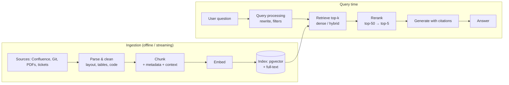

# RAG fundamentals: chunking, embeddings, retrieval

!!! abstract "At a glance"
    **Priority:** P0 · **Complexity:** 3/5 · **Est. time:** 4 h · **Phase:** 2 · **Prereqs:** [LLM fundamentals](llm-fundamentals.md), [Context engineering](context-engineering.md)
    **You're done when:** you've built an ingestion + retrieval pipeline over the copilot's runbooks and postmortems on pgvector, with a 50-question golden set, and can report recall@5/@20 and MRR for at least two chunking strategies.

## Why it matters

Retrieval-Augmented Generation grounds an LLM in *your* data — runbooks, contracts, tickets, SOPs — without retraining. It's still the most deployed LLM architecture in enterprises in 2026, and "design an enterprise RAG system" is the most common AI system-design interview question (see [AI system design: RAG system](../ai-system-design/rag-system.md)).

The key insight for senior engineers: **RAG is a search problem first, a generation problem second.** If the right chunk isn't retrieved, no model can answer correctly; if it is, even mid-size models do well. Most RAG failures trace back to ingestion (parsing, chunking, metadata) and retrieval, not the LLM. Measure retrieval separately from generation.

## Core concepts

### The pipeline



Baseline in 2026: **hybrid retrieval (BM25 + dense + metadata filters) → cross-encoder rerank → generate with citations.** This page covers the dense foundation; [hybrid search & reranking](hybrid-search-reranking.md) and [advanced RAG](advanced-rag.md) build on it.

### Parsing: garbage in, garbage retrieved

- PDFs and HTML lose structure unless you parse layout: headings, tables, lists, code blocks. Use layout-aware parsers (e.g. Docling, Unstructured, or provider document APIs) for complex documents; plain text extraction destroys tables.
- Normalise: strip boilerplate (navigation, footers), deduplicate near-identical pages (Confluence copies!), keep **source URL, title, section path, last-modified, owner, ACL** as metadata.
- Tables: keep them as markdown/HTML in a single chunk, or generate row-level text; never split a table mid-row.

### Chunking

| Strategy | How | Good for | Watch out |
|---|---|---|---|
| Fixed-size (tokens) with overlap | e.g. 400 tokens, 15% overlap | Homogeneous prose | Splits mid-thought |
| Recursive / structural | Split on headings → paragraphs → sentences, merge to target size | Docs with structure (runbooks, wikis) — **good default** | Needs clean parsing |
| Semantic | Split where embedding similarity between sentences drops | Unstructured long text | Slower, variable sizes, gains often small |
| Document-level + section | Small chunks for retrieval, return parent section for generation ("small-to-big", parent-document) | Precision *and* context | More storage, dedupe parents |
| Late chunking / contextual | Embed with surrounding context (e.g. Anthropic's **contextual retrieval**: prepend an LLM-written 50–100 token summary situating each chunk) | Chunks that are ambiguous alone ("It must be restarted first") | Ingestion cost (use prompt caching) |

**Numbers of thumb (tune on your golden set):** 256–512 tokens per chunk for Q&A over prose; 10–20% overlap; one step of a runbook or one FAQ answer per chunk; always prepend the **title and section path** to the chunk text before embedding ("Runbook: booking-api › Database failover › Step 3"). Anthropic reported contextual embeddings + contextual BM25 cut top-20 retrieval failures by ~49%, and ~67% with reranking — a cheap, large win.

### Embeddings

An embedding model maps text to a vector such that semantically similar texts are close (cosine similarity). What matters:

- **Model choice:** check the MTEB leaderboard *for retrieval tasks in your language/domain*, then validate on your golden set — leaderboard rank rarely transfers perfectly. Options: hosted (OpenAI, Cohere, Voyage, Azure OpenAI, Gemini) or open (BGE, E5, Nomic, Qwen3-Embedding, etc. via Ollama/TEI).
- **Dimensions:** 384–3,072. Higher isn't always better; storage and latency scale with dims. Many models support **Matryoshka** truncation (use the first 256/512 dims with small quality loss).
- **Asymmetric retrieval:** many models expect different prefixes/instructions for queries vs documents (e.g. `query:` / `passage:`). Missing these silently costs recall.
- **Normalise** vectors and use cosine (or inner product on normalised vectors).
- **Versioning:** changing the embedding model means **re-embedding everything**. Store `embedding_model` and `embedding_version` per row; plan blue/green re-indexing.
- **Max input length:** text beyond the model's limit is truncated silently.

Dense retrieval is weak on **exact identifiers** (error codes, container numbers, `ORA-00060`, service names) — that's why hybrid search matters.

### Retrieval and generation

- Retrieve **k = 20–50 candidates** for reranking; pass **3–8 chunks** to the LLM. More isn't better — distractors hurt (see [context engineering](context-engineering.md)).
- **Metadata filters** (service, doc type, freshness, ACL) are often the highest-leverage precision improvement. Apply **ACL filtering at retrieval time**, never after generation.
- Generation prompt: answer only from provided sources, cite chunk IDs, say "not found in the documentation" when unsupported. Validate citations exist (structured output with `citations: list[str]`).
- Store and show sources; users trust answers they can verify.

### Evaluating retrieval (do this before tuning prompts)

Build a **golden set**: 50–200 real questions (from Slack, tickets, search logs) each labelled with the relevant chunk/document IDs. Metrics:

| Metric | Definition | Target of thumb |
|---|---|---|
| **Recall@k** | Fraction of questions where a relevant chunk is in top-k | ≥ 0.9 at k=20 (pre-rerank); ≥ 0.8 at k=5 (post-rerank) |
| **MRR** | Mean of 1/rank of first relevant result | ≥ 0.6 |
| **nDCG@k** | Rank-weighted relevance with graded labels | Compare variants |
| **Context precision** | Fraction of passed chunks that are relevant | Higher = fewer distractors |

Then evaluate generation separately: faithfulness (claims supported by context), answer correctness, citation accuracy — tools like Ragas help ([eval tooling](eval-tooling.md)).

### Freshness and operations

- Incremental ingestion keyed on source ID + content hash; delete tombstoned documents (stale runbooks are dangerous).
- Re-embed on content change only; track ingestion lag as an SLO.
- Index size: 1M chunks × 1,024 dims × 4 bytes ≈ 4 GB raw vectors (+ index overhead ~1.5–2x for HNSW). `halfvec` halves it.

### What juniors miss

- Tuning the prompt when recall@20 is 0.6.
- No golden set — "it looks good" on five questions.
- Losing tables and headings during parsing.
- Forgetting query/document prefixes for the embedding model.
- ACLs applied after retrieval (data leak) or not at all.
- No embedding version column → painful migrations.

## Resources

| Resource | Type | Why this one | Level | Cost |
|---|---|---|---|---|
| [Anthropic — Introducing Contextual Retrieval](https://www.anthropic.com/news/contextual-retrieval) | article | Clear explanation of chunk-context loss and a measured fix combining contextual embeddings + BM25 + reranking | intermediate | free |
| [pgvector README](https://github.com/pgvector/pgvector) | docs | The reference for vector types, operators, HNSW/IVFFlat, filtering in Postgres | intermediate | free |
| [MTEB leaderboard](https://huggingface.co/spaces/mteb/leaderboard) | interactive | Compare embedding models by task/language; filter to retrieval | intermediate | free |
| [Jason Liu — writing on systematically improving RAG](https://jxnl.co/writing/) :gem: | article | The most practical "treat RAG as a search product, measure recall, segment queries" material | advanced | free |
| [Eugene Yan — Patterns for building LLM-based systems (RAG section)](https://eugeneyan.com/writing/llm-patterns/) | article | RAG in context of evals, caching, guardrails | intermediate | free |
| [Hugging Face — LLM course](https://huggingface.co/learn/llm-course) | course | Embeddings and semantic search chapters with runnable notebooks | intermediate | free |
| [Chip Huyen — AI Engineering (book repo)](https://github.com/chiphuyen/aie-book) | book | RAG chapter: retrieval algorithms, chunking, evaluation trade-offs | advanced | paid |
| [Supabase — Hybrid search with pgvector](https://supabase.com/docs/guides/ai/hybrid-search) :gem: | docs | Concrete SQL for Postgres FTS + pgvector with RRF — next step after this page | intermediate | free |

## Hands-on lab

**Goal:** the copilot's **knowledge base** v1 — ingest runbooks & postmortems into pgvector and measure retrieval. (2–3 h)

1. `docker compose` service: `pgvector/pgvector:pg17` (or pg18 image if available), plus Ollama with an embedding model (e.g. `nomic-embed-text` or `bge-m3` — config value). Cloud variant: Azure OpenAI embeddings.
2. Corpus: 40–80 markdown runbooks and postmortems (write/synthesise for 3–4 fictional services; include error codes and service names).
3. Schema:

    ```sql
    CREATE EXTENSION IF NOT EXISTS vector;
    CREATE TABLE chunks (
      id bigserial PRIMARY KEY,
      doc_id text NOT NULL,
      section_path text NOT NULL,
      service text,
      doc_type text,               -- runbook | postmortem
      content text NOT NULL,
      content_hash text NOT NULL,
      embedding_model text NOT NULL,
      embedding vector(768) NOT NULL   -- match your model's dims
    );
    CREATE INDEX ON chunks USING hnsw (embedding vector_cosine_ops);
    CREATE INDEX ON chunks (service);
    ```

4. Ingestion (`uv add psycopg[binary] pgvector httpx`): parse markdown by headings, build two chunkers — (A) fixed 400 tokens / 60 overlap, (B) heading-aware recursive with section path prefix — embed, upsert by `content_hash`.
5. Retrieval:

    ```python
    import numpy as np, psycopg
    from pgvector.psycopg import register_vector

    def search(conn, qvec: np.ndarray, k: int = 20, service: str | None = None):
        sql = """SELECT id, doc_id, section_path, 1 - (embedding <=> %s) AS score
                 FROM chunks WHERE (%s::text IS NULL OR service = %s)
                 ORDER BY embedding <=> %s LIMIT %s"""
        return conn.execute(sql, (qvec, service, service, qvec, k)).fetchall()
    ```

6. Golden set: 50 questions with relevant `doc_id`s (15 containing exact error codes/IDs). Compute recall@5, recall@20, MRR for A vs B, with and without the `service` filter.

*Expected:* B beats A on recall@5 by a noticeable margin; the ID-heavy questions have the worst recall under pure dense retrieval — keep that list; the [hybrid search](hybrid-search-reranking.md) lab fixes it.

## Questions

### L1 — Recall

??? question "Q1. Why is RAG described as 'a search problem first'?"
    ??? success "Answer"
        Because generation quality is bounded by retrieval: if relevant evidence isn't in the context, the model either refuses or hallucinates; if it is, most capable models answer well. Most failures are in parsing, chunking, metadata, and ranking. So you evaluate retrieval (recall@k, MRR) separately and fix it before touching the generation prompt.

??? question "Q2. What is contextual retrieval and why does it help?"
    ??? success "Answer"
        Before embedding (and BM25-indexing) each chunk, an LLM generates a short context (50–100 tokens) situating it within the whole document — e.g. "This chunk is step 3 of the booking-api database failover runbook" — and prepends it. Chunks that are ambiguous alone ("restart it after draining") become retrievable by the right queries. Anthropic reported large reductions in retrieval failures, especially combined with BM25 and reranking. Cost is ingestion-time only and prompt caching of the document makes it cheap.

??? question "Q3. Define recall@k and MRR."
    ??? success "Answer"
        **Recall@k:** fraction of queries for which at least one relevant item (or the fraction of relevant items, depending on convention) appears in the top-k results. **MRR (mean reciprocal rank):** average over queries of 1/rank of the first relevant result (0 if none). Recall@k tells you whether reranking/generation *can* succeed; MRR tells you how high the first relevant hit is ranked.

### L2 — Apply

??? question "Q4. Estimate storage for 2M chunks with 1,024-dim float32 embeddings in pgvector with HNSW, and how to reduce it."
    ??? success "Answer"
        Raw vectors: 2M × 1,024 × 4 B ≈ 8.2 GB. HNSW index adds roughly the vector size again plus graph links (m=16 → ~32 neighbours at layer 0 × 8 B), so expect ~14–18 GB total plus text/metadata. Reduce: `halfvec(1024)` (2 bytes/dim) halves vectors and index with minimal recall loss; Matryoshka truncation to 512 dims halves again; binary quantization (`bit`) for a first-pass index with re-ranking on full vectors for 32x smaller candidates. Validate recall on the golden set after each change.

??? question "Q5. Recall@20 is 0.93 but answer correctness is 0.70. Where do you look?"
    ??? success "Answer"
        Retrieval finds evidence, so look downstream: (1) **ranking** — is the relevant chunk in top-20 but not in the top-5 passed to the LLM? Measure recall@5; add a reranker. (2) **context assembly** — distractors, truncation, missing parent context (small chunk lacks the needed detail → small-to-big). (3) **generation** — faithfulness failures, instructions, model choice; check with a faithfulness metric. (4) **golden labels** — maybe answers need multiple chunks (multi-hop) that aren't all retrieved. Do error analysis on the 30% failures and categorise.

??? question "Q6. Users ask 'what does error EDI-4471 mean?' and dense retrieval returns generic EDI docs. Fix it."
    ??? success "Answer"
        Dense embeddings don't preserve rare exact tokens well. Add lexical retrieval (Postgres full-text / BM25) and fuse with dense via RRF (hybrid search); ensure the tokenizer/FTS config keeps codes intact (e.g. `simple` config, or a separate exact-match column/trigram index for identifiers); optionally detect identifier patterns with regex and apply an exact filter/boost. Add these queries to the golden set as a slice and track recall on it.

### L3 — Design & trade-offs

??? question "Q7. Small chunks vs large chunks vs small-to-big for runbooks. Decide."
    ??? success "Answer"
        Small chunks (~200 tokens) retrieve precisely but lack context (step 5 without the prerequisites); large chunks (~1,000+) carry context but dilute embeddings (many topics in one vector) and waste tokens. For runbooks, **small-to-big**: index step-level/section-level chunks with section-path prefixes for precise matching, then return the parent section (or neighbouring steps) to the LLM, deduplicated. It costs more storage and assembly logic but matches how runbooks are used (you need the whole procedure). Validate recall@5 and answer correctness on the golden set.

??? question "Q8. Hosted embedding API vs self-hosted open model for a regulated logistics company."
    ??? success "Answer"
        Hosted: top quality, zero ops, but data leaves your boundary (mitigated with regional deployments like Azure OpenAI in-region), per-token cost at re-index time, and vendor model deprecations forcing re-embeds on their schedule. Self-hosted (TEI/Ollama/vLLM with BGE/E5/Qwen3-Embedding): data stays in-house, fixed cost, pinned versions, but you operate GPU/CPU inference and may lose a few points of quality. Decide via your golden set (recall delta), data classification, and TCO. Many enterprises use in-region hosted for general docs and self-hosted for restricted data. Either way, store model/version per row to enable migration.

??? question "Q9. How do you enforce document permissions in RAG for 30,000 users across many Confluence spaces?"
    ??? success "Answer"
        Ingest ACL metadata (space/group IDs) per chunk; at query time resolve the user's groups (cached) and apply as a **pre-filter** in the vector query (`WHERE acl && user_groups`), so unauthorised chunks never reach the LLM. With HNSW, restrictive filters can reduce recall — use pgvector's iterative index scans or partitioning by tenant/space, or a vector DB with filterable HNSW (e.g. Qdrant payload indexes). Sync ACL changes quickly (event-driven), audit retrievals, and test with users of different permissions in the eval set. Never rely on the LLM to "not mention" restricted content.

### L4 — Staff-level ambiguity

??? question "Q10. Three business units built separate RAG stacks (different chunking, vector stores, embeddings). Propose a convergence plan."
    ??? success "Answer"
        Start with evidence: collect each stack's golden set (or build one), usage, costs, and pain points. Define a shared **retrieval platform** contract: ingestion connectors, parsing, chunking strategies as config, embedding service with versioning, hybrid retrieval + reranking API, ACL enforcement, and an eval harness — while letting teams own their corpora and prompts. Choose defaults backed by cross-team benchmark results (e.g. pgvector for < ~50M vectors, one embedding model per data class). Migrate the team with the most pain first, publish quality/cost deltas, provide adapters to avoid big-bang rewrites, and sunset duplicate infra on a timeline. Governance: shared golden-set practice and quarterly re-evaluation of embedding models.

??? question "Q11. The CTO asks whether you still need RAG now that models have 1M-token windows and vendors offer 'file search' built in. How do you answer?"
    ??? success "Answer"
        RAG as a *pattern* (selecting relevant context) remains necessary; the question is build vs buy. Long context doesn't solve corpora larger than the window, cost per query, latency, recall degradation, ACLs, or freshness. Vendor file search is great for prototypes and small corpora but offers limited control over parsing, chunking, hybrid ranking, ACLs, evaluation, and portability, and ties you to one provider. Recommendation: use managed search for low-stakes use cases, own the retrieval layer for core, high-value corpora; decide per use case with an eval comparing quality, cost, latency, and compliance.

## Real-world use cases

- **Ops runbook assistant:** heading-aware chunks with service metadata; filter by the alerting service first.
- **Customs & trade compliance Q&A:** regulations chunked by article with jurisdiction and effective-date metadata; freshness filters prevent citing superseded rules.
- **Customer support over contract terms:** ACL-filtered retrieval per customer account; citations shown to agents.
- **Engineering knowledge search:** postmortems + ADRs indexed; hybrid needed for error codes and service names.

## Pitfalls & anti-patterns

- No golden set; tuning by vibes.
- Lossy parsing of tables/code.
- Oversized chunks mixing topics; no section-path prefix.
- Missing query/document instruction prefixes for the embedding model.
- Post-hoc ACL filtering.
- Stale documents never deleted.
- Changing embedding model without re-indexing everything.

## Checklist

- [ ] I can explain the full ingestion and query pipeline and where failures originate
- [ ] I built pgvector ingestion with two chunking strategies
- [ ] I created a 50-question golden set and measured recall@5/@20 and MRR
- [ ] I can size storage for a vector index and name three ways to reduce it
- [ ] I answered all L3 questions out loud in < 3 min each
