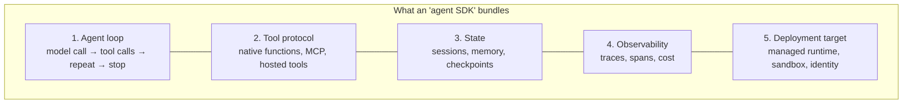

# Vendor agent SDKs: Claude Agent SDK, OpenAI Agents SDK, Google ADK, MS Agent Framework

!!! abstract "At a glance"
    **Priority:** P1 · **Complexity:** 3/5 · **Est. time:** 4 h · **Phase:** 3 · **Prereqs:** [Agent patterns](agent-patterns.md), [Tool calling](tool-calling.md), [LangGraph](langgraph.md), [Pydantic AI](pydantic-ai.md)
    **You're done when:** you have implemented the same "look up a shipment and summarise delays" agent in at least three vendor SDKs, can state each SDK's execution model, lock-in surface and where it runs, and can defend which one (if any) belongs in the capstone.

## Why it matters

In 2026 every frontier lab and hyperscaler ships an agent SDK, and each is pushed hard by its sales team. As an architect you will be asked "should we standardise on X?" several times a year. The SDKs are *not* interchangeable: they differ in execution model (in-process loop vs. subprocess harness vs. graph runtime), in what they own (tools, sessions, tracing, sandboxing), and in how tightly they bind you to one model vendor or cloud.

The senior skill is not memorising APIs — it is recognising that an "agent SDK" is a bundle of five separable things (loop, tool protocol, state/sessions, tracing, deployment target) and deciding which of those you are willing to rent from a vendor.

## Core concepts

### The landscape (as of Sept 2026)

| SDK | Status | Execution model | Model coupling | Distinctive strengths | Where it runs best |
|---|---|---|---|---|---|
| **Claude Agent SDK** (`claude-agent-sdk`, formerly Claude Code SDK) | GA; Python + TypeScript | Drives the Claude Code agent harness: built-in file/shell/web tools, permissions, hooks, subagents, skills, context compaction | Claude models (via Anthropic API, Bedrock, Vertex, Foundry) | Batteries-included *computer-use-style* agent: edits files, runs commands, long tasks; subagents with depth/concurrency/budget caps | Coding/ops agents, research agents, anything needing a sandboxed workspace |
| **OpenAI Agents SDK** (`openai-agents`) | GA; Python + TS; sandbox agents beta (Apr 2026) | Lightweight in-process loop: `Agent`, `Runner`, tools, handoffs, guardrails, sessions, tracing | Provider-agnostic via LiteLLM/any OpenAI-compatible endpoint, but best on OpenAI Responses API | Minimal primitives, handoffs, input/output guardrails, built-in tracing dashboard | Chat/workflow agents, voice (Realtime), teams already on OpenAI |
| **Google ADK** (`google-adk`) | Python 2.0 GA ~mid-2026 (graph Workflow runtime); also TS, Go, Java, Kotlin | Agents + workflow agents (sequential/parallel/loop) + graph workflows; `adk web` dev UI; session/memory/artifact services | Gemini-first; other models via LiteLLM | Multi-language, eval tooling, deploy to Vertex AI Agent Engine / Cloud Run | GCP shops, polyglot teams |
| **Microsoft Agent Framework** (`agent-framework`) | 1.0 GA 2026-04-03; successor to AutoGen + Semantic Kernel (both now maintenance) | `Agent` + model clients, sessions, context providers, middleware, graph **Workflows** with checkpointing/HITL, "Harness Agent" | Provider-agnostic (Foundry, Azure OpenAI, OpenAI, Anthropic, Ollama…) | Enterprise features: middleware, telemetry, typed workflows, .NET parity, Foundry hosted agents | Azure/.NET estates, Foundry deployments |

Also relevant: **Strands Agents** (AWS, default in AgentCore templates), **Pydantic AI** and **LangGraph** (vendor-neutral, covered in their own topics).

### Decompose any SDK into five layers



Evaluate lock-in *per layer*:

- **Loop**: cheap to replace (a few hundred lines). Low lock-in.
- **Tools**: if tools are MCP servers, portable. If they're SDK-specific decorators calling vendor-hosted tools (web search, code interpreter), medium lock-in.
- **State**: session stores with proprietary schemas are sticky. Medium-high.
- **Observability**: if the SDK emits OTel GenAI spans you can route anywhere; vendor dashboards only = high lock-in.
- **Deployment**: managed runtimes (Foundry hosted agents, Vertex Agent Engine, AgentCore Runtime) are the real lock-in — and the real value. See [Managed platforms](managed-agent-platforms.md).

### Same agent, four SDKs

The task: an agent with one tool `get_shipment(id)` that summarises delay risk.

=== "Claude Agent SDK"

    ```python
    # uv add claude-agent-sdk   (requires the Claude Code runtime; see docs)
    import asyncio
    from typing import Any
    from claude_agent_sdk import (ClaudeAgentOptions, create_sdk_mcp_server,
                                  query, tool, ResultMessage)

    @tool("get_shipment", "Fetch shipment status by id", {"shipment_id": str})
    async def get_shipment(args: dict[str, Any]) -> dict[str, Any]:
        data = {"id": args["shipment_id"], "eta": "2026-10-02", "port": "Rotterdam",
                "status": "held_customs"}
        return {"content": [{"type": "text", "text": str(data)}]}

    ops = create_sdk_mcp_server(name="ops", version="1.0.0", tools=[get_shipment])

    async def main() -> None:
        opts = ClaudeAgentOptions(
            system_prompt="You are a logistics ops assistant. Be concise.",
            mcp_servers={"ops": ops},
            allowed_tools=["mcp__ops__get_shipment"],   # everything else denied
            permission_mode="default",
            max_budget_usd=0.50,                          # hard spend cap
        )
        async for msg in query(prompt="Is shipment MSK-123 at risk of delay?", options=opts):
            if isinstance(msg, ResultMessage):
                print(msg.result, msg.total_cost_usd)

    asyncio.run(main())
    ```

=== "OpenAI Agents SDK"

    ```python
    # uv add openai-agents
    from agents import Agent, Runner, function_tool

    @function_tool
    def get_shipment(shipment_id: str) -> dict:
        """Fetch shipment status by id."""
        return {"id": shipment_id, "eta": "2026-10-02", "port": "Rotterdam",
                "status": "held_customs"}

    agent = Agent(
        name="ops-assistant",
        instructions="You are a logistics ops assistant. Be concise.",
        tools=[get_shipment],
    )
    result = Runner.run_sync(agent, "Is shipment MSK-123 at risk of delay?")
    print(result.final_output)
    ```

=== "Google ADK"

    ```python
    # uv add google-adk ; project layout: ops_agent/agent.py exporting root_agent
    from google.adk.agents.llm_agent import Agent

    def get_shipment(shipment_id: str) -> dict:
        """Fetch shipment status by id."""
        return {"status": "success", "id": shipment_id, "eta": "2026-10-02",
                "port": "Rotterdam", "state": "held_customs"}

    root_agent = Agent(
        model="gemini-flash-latest",
        name="ops_assistant",
        description="Answers shipment delay questions.",
        instruction="You are a logistics ops assistant. Be concise.",
        tools=[get_shipment],
    )
    # run: `adk run ops_agent`  or dev UI: `adk web --port 8000`
    ```

=== "MS Agent Framework"

    ```python
    # uv add agent-framework
    import asyncio
    from agent_framework import Agent
    from agent_framework.foundry import FoundryChatClient
    from azure.identity import AzureCliCredential

    def get_shipment(shipment_id: str) -> dict:
        """Fetch shipment status by id."""
        return {"id": shipment_id, "eta": "2026-10-02", "port": "Rotterdam",
                "status": "held_customs"}

    agent = Agent(
        client=FoundryChatClient(
            project_endpoint="https://<resource>.services.ai.azure.com/api/projects/<project>",
            model="<deployment-name>",
            credential=AzureCliCredential(),
        ),
        name="ops-assistant",
        instructions="You are a logistics ops assistant. Be concise.",
        tools=[get_shipment],
    )

    async def main() -> None:
        print(await agent.run("Is shipment MSK-123 at risk of delay?"))

    asyncio.run(main())
    ```

!!! warning "Verify against the installed version"
    These SDKs ship breaking changes monthly. The snippets match official docs as of Sept 2026; pin versions in `pyproject.toml` and re-check the quickstart before upgrading.

### Key differentiators in depth

**Claude Agent SDK — a harness, not a loop.** You get Claude Code's tool suite (Read/Edit/Bash/Grep/Web), a permission system (`permission_mode`: `default`, `acceptEdits`, `plan`, `dontAsk`, `bypassPermissions`, `auto`), `allowed_tools`/`disallowed_tools`, **hooks** (e.g. `PreToolUse` to veto a command), **subagents** via `AgentDefinition` (own prompt, tool subset, model; context isolation), skills, automatic context compaction, and `max_budget_usd`. `query()` is one-shot; `ClaudeSDKClient` keeps a multi-turn session with interrupts. Trade-off: heavier process (it runs the Claude Code runtime), Claude-only models, and you *must* sandbox it (container/VM) because it can execute shell commands.

**OpenAI Agents SDK — minimal primitives.** `Agent` (instructions, tools, handoffs, output_type, guardrails), `Runner.run/run_sync/run_streamed`, **handoffs** (agent-to-agent transfer of control, represented to the model as tools), **input/output guardrails** that run in parallel with the agent and can trip a tripwire, **sessions** (SQLite/SQLAlchemy/Redis/encrypted), and tracing on by default (sent to OpenAI's trace dashboard unless you disable it or add your own processor — a data-governance item). Sandbox agents (beta) add isolated workspaces.

**Google ADK — structure and multi-language.** `LlmAgent` plus deterministic workflow agents (`SequentialAgent`, `ParallelAgent`, `LoopAgent`) and, in 2.0, a graph Workflow runtime. Services for sessions, memory and artifacts are pluggable (in-memory for dev, Vertex-backed in prod). Strong built-in evaluation (`adk eval`) and `adk web` for trace inspection.

**MS Agent Framework — enterprise glue.** Model clients (chat completions and Responses), `AgentSession`, context providers (memory), **middleware** (intercept runs and function calls: logging, PII scrubbing, approval), MCP clients, and typed graph **Workflows** with checkpointing and human-in-the-loop. .NET and Python parity matters in Microsoft shops. It is the recommended way to build Foundry **hosted agents**.

### Choosing: a decision table

| If your situation is… | Lean towards | Why |
|---|---|---|
| Agent must manipulate files/repos/shell over long tasks | Claude Agent SDK (in a sandbox) | Harness, compaction and tools already solved |
| Customer-facing chat with guardrails + handoffs, OpenAI models | OpenAI Agents SDK | Smallest surface, guardrails built in |
| Azure/.NET estate, Foundry deployment, compliance-heavy | MS Agent Framework | Middleware, Entra, Foundry hosted agents |
| GCP, Gemini, polyglot teams | Google ADK | Multi-language, Vertex deployment |
| Multi-model, need explicit durable control flow | LangGraph (+ Pydantic AI nodes) | Vendor-neutral, checkpoints ([LangGraph](langgraph.md)) |
| Typed single agents, model-agnostic | Pydantic AI | Types end-to-end, OTel/Logfire ([Pydantic AI](pydantic-ai.md)) |

**Capstone decision:** the Agentic Ops Copilot uses LangGraph for orchestration and Pydantic AI for sub-agents (vendor-neutral), MCP for tools (portable), and optionally a **Claude Agent SDK "runbook executor" sub-agent** inside a locked-down container for tasks that need shell access. That isolates vendor coupling to one replaceable node.

### Senior-level nuance

- **Tools are the moat, not the loop.** Invest in MCP servers and good tool design; any SDK can then consume them.
- **Default telemetry exports.** Check where traces go by default (vendor cloud) before sending production data. Route to Langfuse/OTel ([LLM observability](llm-observability.md)).
- **Handoffs vs agents-as-tools.** Handoff transfers the conversation (the specialist talks to the user); agent-as-tool returns a result to the orchestrator. Handoffs lose central control; agents-as-tools cost an extra summarisation hop.
- **Budget and depth caps.** Harness SDKs will happily spawn subagents; set spend/turn caps in code, not prompts.
- **Version churn is an operational cost.** Budget a quarterly upgrade spike per SDK you adopt; fewer SDKs = less churn.

## Resources

| Resource | Type | Why this one | Level | Cost |
|---|---|---|---|---|
| [Claude Agent SDK overview](https://code.claude.com/docs/en/agent-sdk/overview) | docs | Official concepts: harness, permissions, hooks, sessions | intermediate | free |
| [Claude Agent SDK Python reference](https://code.claude.com/docs/en/agent-sdk/python) | docs | Exact `query`, `ClaudeAgentOptions`, `@tool`, `ClaudeSDKClient` API | advanced | free |
| [Claude Agent SDK subagents](https://code.claude.com/docs/en/agent-sdk/subagents) :gem: | docs | Context isolation, tool restriction, depth/concurrency/spend caps | advanced | free |
| [OpenAI Agents SDK docs](https://openai.github.io/openai-agents-python/) | docs | Agents, handoffs, guardrails, sessions, tracing | intermediate | free |
| [OpenAI Agents SDK: guardrails](https://openai.github.io/openai-agents-python/guardrails/) | docs | Tripwire model, parallel execution | intermediate | free |
| [Google ADK docs](https://adk.dev/) | docs | Multi-language ADK, workflows, deployment | intermediate | free |
| [Microsoft Agent Framework overview](https://learn.microsoft.com/en-us/agent-framework/overview/) | docs | Agents, harness agent, workflows, migration from SK/AutoGen | intermediate | free |
| [Anthropic: Building effective agents](https://www.anthropic.com/engineering/building-effective-agents) | article | Framework-agnostic patterns; "start simple" | intermediate | free |
| [Chip Huyen: Agents](https://huyenchip.com/2025/01/07/agents.html) :gem: | article | Vendor-neutral mental model of planning, tools, failure modes | intermediate | free |

## Hands-on lab

**Goal (2 h):** SDK bake-off on one task, producing an ADR.

1. Build a tiny MCP server `ops-tools` exposing `get_shipment` and `list_delayed(port)` ([MCP](mcp.md)) — or reuse the capstone's.
2. Implement the agent in **three** SDKs (pick from the four above). Where supported, consume tools via MCP rather than native decorators.
3. Run the same 10-question script against each; capture: correctness (manual), tokens, latency p50, lines of code, and where traces went.
4. Add one control per SDK: a guardrail/hook/middleware that blocks any tool call with `port="*"`.
5. Write `docs/log/adr-00X-agent-sdk.md`: decision, per-layer lock-in, upgrade cost, and the rule "vendor SDKs only as isolated nodes behind an interface".

**Expected output:** a comparison table (3 rows × 6 columns) and an ADR recommending the capstone's split (LangGraph + Pydantic AI core, optional Claude Agent SDK sandboxed executor).

## Questions

### L1 — Recall

??? question "Q1. What are MS Agent Framework's predecessors and what is their status?"
    ??? success "Answer"
        AutoGen and Semantic Kernel. Agent Framework 1.0 (GA April 2026) is their direct successor from the same teams; both predecessors are in maintenance mode with migration guides.

??? question "Q2. In the OpenAI Agents SDK, what is a handoff?"
    ??? success "Answer"
        A transfer of control from one agent to another specialist agent, exposed to the model as a tool; after the handoff the target agent owns the conversation. Contrast with using an agent as a tool, where the result returns to the caller.

??? question "Q3. Name four things the Claude Agent SDK provides beyond a basic tool loop."
    ??? success "Answer"
        Built-in file/shell/web tools; permission modes + allowed/disallowed tools; hooks (e.g. PreToolUse); subagents with isolated context; skills; automatic context compaction; session resume; spend caps (`max_budget_usd`).

??? question "Q4. What three deterministic workflow agents does Google ADK provide?"
    ??? success "Answer"
        `SequentialAgent`, `ParallelAgent`, `LoopAgent` (ADK 2.0 adds a graph-based Workflow runtime on top).

### L2 — Apply

??? question "Q5. Using the Claude Agent SDK, how do you ensure the agent can read files and call your MCP tool but never run shell commands?"
    ??? success "Answer"
        Set `allowed_tools=["Read","Grep","Glob","mcp__ops__get_shipment"]`, `disallowed_tools=["Bash","Write","Edit"]`, keep `permission_mode="default"` (not bypass), and add a `PreToolUse` hook that denies anything outside an allow-list as defence in depth. Still run the process in a container with no credentials it doesn't need.

??? question "Q6. Your OpenAI Agents SDK app sends traces to OpenAI's dashboard by default. Security says no production data may leave your tenancy. What do you do?"
    ??? success "Answer"
        Disable default tracing export (the SDK supports disabling tracing globally or per run) and register a custom trace processor that exports to your OTel collector/Langfuse; verify with network egress rules. Also check model data-retention settings separately — tracing and inference are different data flows.

??? question "Q7. Sketch how you'd make a sub-agent in MS Agent Framework require human approval before calling `create_refund`."
    ??? success "Answer"
        Use function middleware (or the framework's approval-required tool mechanism) to intercept `create_refund` invocations, pause and emit an approval request; in a Workflow, model it as an HITL step with checkpointing so the run can resume after approval hours later. Log the approver identity with the tool call span.

### L3 — Design & trade-offs

??? question "Q8. Leadership asks you to standardise the company on one vendor SDK. Argue for and against, then recommend."
    ??? success "Answer"
        For: shared skills, paved road, one security review, consistent tracing. Against: model lock-in (SDK favours its vendor's models/hosted tools), churn risk, capability gaps (e.g. harness vs lightweight chat). Recommendation: standardise the *interfaces* not the SDK — MCP for tools, OTel GenAI for traces, A2A for cross-team agent calls, a gateway for models; allow a short list of approved SDKs with a thin internal wrapper and ADR per exception.

??? question "Q9. Handoffs vs orchestrator-with-agents-as-tools for a customer support bot with billing, shipping and returns specialists."
    ??? success "Answer"
        Handoffs: lower latency (no summarisation hop), specialist speaks directly, good when specialists are self-contained. Risks: loss of global control, harder cross-domain questions ("refund the delayed shipment"), policy enforcement scattered. Orchestrator: central guardrails and memory, can compose specialists, easier eval; costs an extra LLM hop and potential information loss in summaries. For support with cross-domain requests and compliance, orchestrator; use handoffs only for clean domain switches.

??? question "Q10. When is a harness-style SDK (Claude Agent SDK) the wrong choice?"
    ??? success "Answer"
        High-QPS, low-latency request/response services (process overhead, long contexts); strictly deterministic workflows (use a graph/workflow engine); multi-model requirements; environments where you can't provide a sandbox; tasks with no file/shell component where a 50-line loop suffices.

### L4 — Staff-level ambiguity

??? question "Q11. Three teams built agents on three SDKs (ADK, OpenAI Agents SDK, LangGraph). Now they need to call each other and share tools. Propose a convergence plan that doesn't force a rewrite."
    ??? success "Answer"
        Converge on protocols: extract shared tools into MCP servers behind a gateway with auth; expose each team's agent via A2A (Agent Card, tasks) so they're callable regardless of SDK ([A2A & AG-UI](a2a-ag-ui.md)); unify tracing on OTel GenAI conventions into one backend with trace-context propagation; route model calls through one LLM gateway for cost/keys. Only then consider consolidating SDKs opportunistically when a team does a major rewrite. Measure: shared tool reuse, cross-agent trace completeness, incident MTTR.

??? question "Q12. A vendor offers big credits if you adopt their agent SDK and managed runtime. How do you evaluate the offer?"
    ??? success "Answer"
        Quantify total cost of exit: which layers become proprietary (state schemas, hosted tools, tracing, identity), migration effort estimate, data egress. Run a time-boxed pilot with exit criteria; insist on OTel export, MCP/A2A support, data residency terms, and model choice. Accept if the managed runtime removes real undifferentiated work (sandboxing, identity, scaling) and exit cost stays bounded (tools and evals remain portable). Put the decision in an ADR with a review date.

## Real-world use cases

- **Ops runbook executor** (logistics control tower): Claude Agent SDK in a container with read-only kube credentials, diagnosing a stuck EDI pipeline; spend cap and hooks enforce safety.
- **Customer service triage** (retail/ecommerce): OpenAI Agents SDK with input guardrail classifying abuse/jailbreaks and handoffs to billing vs shipping agents.
- **Enterprise knowledge agent in Teams**: MS Agent Framework hosted agent on Foundry with Entra identity and SharePoint grounding.
- **Multi-language field-service agent**: ADK in Java for the existing backend team and Python for the ML team, deployed to Vertex Agent Engine.

## Pitfalls & anti-patterns

- Choosing an SDK by demo quality rather than per-layer lock-in and operability.
- Using vendor-hosted tools for core business logic you can't move.
- Running harness SDKs with `bypassPermissions` outside a sandbox.
- Not pinning versions; upgrading four SDKs in one sprint.
- Leaving default trace export on with production data.
- Mixing handoffs and orchestration ad hoc so no one knows who owns the conversation.
- Rewriting working agents to "standardise" instead of standardising protocols.

## Checklist

- [ ] I can describe each SDK's execution model and lock-in per layer without notes
- [ ] I implemented the same agent in three SDKs and measured tokens/latency/LOC
- [ ] I added a guardrail/hook/middleware in each
- [ ] I wrote an ADR for the capstone's SDK choice
- [ ] I answered all L3 questions out loud in < 3 min each
