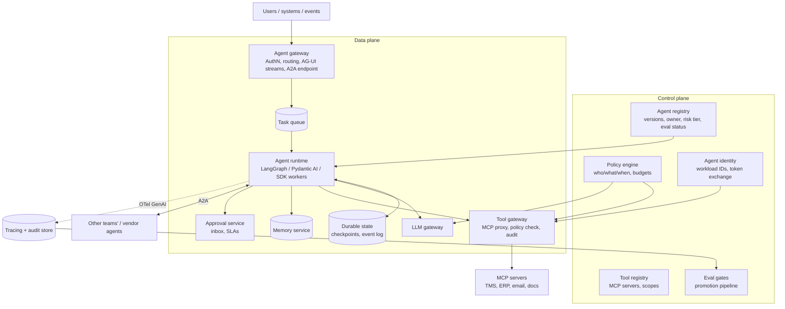

# Design a multi-agent platform

!!! abstract "At a glance"
    **Priority:** P0 · **Complexity:** 5/5 · **Est. time:** 4 h · **Phase:** 3 · **Prereqs:** [Framework](framework.md), [Multi-agent systems](../agentic-ai/multi-agent-systems.md), [MCP](../agentic-ai/mcp.md), [A2A & AG-UI](../agentic-ai/a2a-ag-ui.md), [Durable execution & HITL](../agentic-ai/durable-execution-hitl.md), [Guardrails & security](../agentic-ai/guardrails-security.md)
    **You're done when:** you can design an enterprise platform where many teams build, deploy, govern and observe agents — with durable execution, MCP tool registry, A2A interop, agent identity, HITL, budgets and OWASP Agentic Top 10 controls — and argue when a single agent beats a multi-agent topology.

## Problem

"Our company has dozens of teams wanting to ship agents (customer service, finance ops, logistics exception handling). Design an internal multi-agent platform: how agents are built, run, connected to tools and each other, governed and monitored."

Logistics example to anchor: a **shipment exception agent** detects a delayed vessel, a **rebooking agent** proposes alternatives, a **customer-comms agent** drafts notifications, and a **billing agent** assesses demurrage impact — owned by four different teams.

## Clarifying questions

| Question | Why it matters |
|---|---|
| Is this a *platform* (for many teams) or *one* multi-agent application? | Platform → control plane, tenancy, registry, governance |
| What actions can agents take: read-only, drafts, writes to ERP/TMS, payments? | Risk tiers, HITL, identity model |
| Run durations: seconds (chat) or hours/days (workflows waiting on humans/events)? | Durable execution, checkpointing |
| Framework mandate or bring-your-own (LangGraph, Pydantic AI, vendor SDKs)? | Runtime abstraction, A2A as interop layer |
| Cloud strategy: Microsoft Foundry, Bedrock AgentCore, self-built on Kubernetes? | Build vs buy per component |
| Compliance: SOX (finance), GDPR, audit requirements? | Audit trails, approval evidence |
| Scale: number of agents, runs/day, concurrent runs? | Runtime sizing, queueing |

## Requirements

**Functional:** agent registry (versioned definitions, owners, risk tier); runtime to execute agents (sync, async, long-running); tool registry via MCP servers; agent-to-agent calls (A2A); memory services; HITL approvals; evaluation gates before promotion; per-agent budgets; tracing and audit; front-end streaming (AG-UI).

| NFR | Target (assumed) |
|---|---|
| Quality | Each agent passes its task-success eval ≥ agreed threshold before prod; trajectory evals for tool correctness |
| Latency | Interactive agents: first progress event < 1 s, typical run < 30 s; async agents: minutes–days with durable state |
| Cost | Per-run budget caps enforced by platform; cost attribution per agent/team; platform overhead < 10% of token spend |
| Safety | Least-privilege agent identities, no standing super-credentials, HITL for irreversible actions, OWASP Agentic Top 10 controls |
| Reliability | Runs survive pod/process failures (resume from checkpoint); idempotent tool side-effects; 99.9% control plane |
| Scale | 200 agents, 2M runs/day, 20k concurrent runs |

## Estimation

```text
2M runs/day ≈ 23 runs/s avg, ~70/s peak
Avg run: 6 LLM calls × (6k input + 500 output) + 5 tool calls
Tokens/day: 2M × 6 × 6.5k = 78B tokens (~72B in, 6B out)
At assumed $3/M in, $15/M out: $216k + $90k ≈ $306k/day → ~$9M/month
  → routing (planner on frontier, workers on small models) and caching are platform features, not team choices
Multi-agent multiplier: orchestrator-workers topologies can use several times more tokens than a single agent
  (Anthropic reported ~15× chat for their research system) — budget per run is mandatory.
Concurrency: 70 runs/s × 20 s avg active time ≈ 1,400 active; plus 20k suspended runs waiting on humans/events
  → suspended runs must cost ~nothing: persisted checkpoints, not live processes.
Checkpoint storage: 2M runs × 10 checkpoints × 20 KB = 400 GB/day → TTL + compaction.
```

## Architecture



**Principle:** the platform owns cross-cutting concerns (identity, policy, tool access, budgets, durability, observability, evals); teams own agent logic and their evals. The tool gateway and LLM gateway are the two enforcement chokepoints.

## Component deep dives

### 1. Topology: single agent vs multi-agent

| Topology | When | Cost |
|---|---|---|
| Workflow (deterministic graph with LLM steps) | Predictable process (invoice matching) | Lowest; easiest to eval |
| Single agent + tools | Open-ended but one domain/context | Moderate |
| Orchestrator–workers (supervisor) | Parallelisable research/breadth tasks | High token multiplier; context isolation benefits |
| Handoffs (peer routing) | Distinct domains with clear boundaries (triage → billing agent) | Moderate; handoff context loss risk |
| Cross-team agents via A2A | Different owners, deploy cycles, vendors | Network + contract overhead; strongest isolation |

Cognition's "Don't build multi-agents" and Anthropic's multi-agent research write-up are complementary: shared context and consistent decisions favour a single agent; breadth-first parallel exploration with separable subtasks favours multi-agent. The platform should support all topologies but make the *cheap* ones the default template.

### 2. Runtime & durable execution

| Option | Strengths | Weaknesses |
|---|---|---|
| LangGraph (1.x) with Postgres checkpointer | Graph + state + interrupts for HITL; time-travel; wide adoption | Python/JS; you run the infra (or LangGraph Platform) |
| Pydantic AI with durable execution integrations (e.g., Temporal) | Typed, lightweight, OTel/Logfire native, A2A/AG-UI support | Less graph tooling |
| Temporal/workflow engine wrapping agent steps | Battle-tested durability, retries, timers, days-long waits | Determinism constraints; LLM calls as activities |
| Managed: Microsoft Foundry Agent Service, Bedrock AgentCore Runtime | Session isolation, identity, memory, gateway, evals as services | Lock-in; less control; feature parity varies |
| Vendor SDKs (OpenAI Agents SDK, Claude Agent SDK, Google ADK 2.0, MS Agent Framework 1.0) | Fast for their model ecosystems | Heterogeneity across teams |

Decision pattern: platform standardises the **contracts** (run API, event schema, checkpoint store, tracing, A2A endpoint) and supports 1–2 blessed frameworks. Each LLM call and tool call is a step with a checkpoint so crashes resume without repeating side effects; tool writes carry **idempotency keys** derived from run ID + step ID.

### 3. Tools: MCP registry and tool gateway

- Every enterprise system is exposed as a governed **MCP server** (TMS shipment API, ERP invoices, email, document store), registered with owner, scopes, risk level, rate limits.
- Agents never call systems directly; the **tool gateway** proxies MCP, enforces policy (is agent X allowed tool Y for this user/tenant, now, under this budget?), injects the right credential, logs audit events, and applies output sanitisation (strip instructions-like content, size caps).
- Tool design quality matters as much as model choice: few well-scoped tools with clear descriptions and structured errors beat 80 thin API wrappers (see Anthropic's "Writing effective tools for agents").

### 4. Identity & authorization

| Model | Description | Verdict |
|---|---|---|
| Shared service account | Agent uses one super-credential | Anti-pattern (OWASP Agentic: identity & privilege abuse) |
| **On-behalf-of user** (token exchange) | Agent acts with the invoking user's delegated, down-scoped token | Default for user-initiated runs |
| Agent workload identity + policy | Agent has its own identity with narrowly scoped permissions | For autonomous/event-triggered runs |
| Both combined | Effective permission = intersection of user and agent scopes | Best for sensitive domains |

Short-lived tokens, per-tool scopes, and policy-as-code (OPA/Cedar-style) evaluated at the tool gateway. Bedrock AgentCore Identity/Policy and Foundry's Entra-based agent identities are managed versions of this pattern.

### 5. Agent-to-agent (A2A)

Use A2A (v1.0, 2026: signed Agent Cards, JSON-RPC/gRPC/REST bindings) when crossing ownership boundaries: the exception agent (Ops team) asks the billing agent (Finance team) for a demurrage estimate as a **task**, not by sharing memory or prompts. Benefits: independent deploys, capability discovery via Agent Cards, auth at the boundary. Risks: cascading failures and trust propagation — treat another agent's output as untrusted input, enforce timeouts, budgets and circuit breakers.

MCP vs A2A in one line: MCP connects an agent to **tools/data**; A2A connects an agent to **another agent** that has its own reasoning, state and policies.

### 6. Memory

Platform memory service with namespaces (user, agent, tenant), types (semantic facts, episodic summaries), provenance and TTL. Writes from untrusted content require validation (memory poisoning, ASI06-type risks). Shared memory between agents is a coupling hazard — prefer passing explicit task context over shared mutable memory.

### 7. Human-in-the-loop

Risk-tiered: tier 0 read-only (no approval), tier 1 drafts (human sends), tier 2 reversible writes (post-hoc review/sampling), tier 3 irreversible/financial (pre-approval, maybe four-eyes). Implementation: runtime `interrupt` → run suspended with checkpoint → approval item in inbox (Teams/Slack/portal) rendered from **structured action args** → approve/edit/reject resumes the run. SLAs and escalation when approvals time out.

### 8. Budgets & loop control

Per run: max steps, max tokens, max $, max wall time, max tool calls per tool; per agent/team: daily spend quota. Detect loops (same tool + args repeated), stalled progress (no state change over N steps). On breach: stop gracefully, summarise state, escalate to human.

## Evaluation strategy

- **Promotion pipeline**: agent version must pass its eval suite (task success, trajectory correctness, safety/red-team set, cost/latency budget) in CI before registry marks it deployable to prod; canary with online evals after.
- **Trajectory evals**: check tool sequence and arguments against expected (deterministic where possible), not just final answers; for multi-agent, evaluate handoff correctness and sub-agent outputs.
- **Simulation**: user simulators and mocked MCP servers (record/replay) for reproducible agent tests; sandboxed environments for write tools.
- **Online**: task completion rate, human-approval rejection rate (strong signal), escalation rate, cost per successful task, time to resolution.
- **Error analysis** on failed runs: taxonomy like *wrong plan*, *wrong tool*, *bad args*, *tool error unhandled*, *gave up early*, *loop*, *handoff lost context*, *policy block*.

## Observability

One trace per run spanning agents (A2A propagates W3C trace context), with OTel GenAI spans for `invoke_agent`, `chat`, `execute_tool` (conventions still Development as of mid-2026 — pin versions). Separate **audit log** (immutable): who/what agent, on whose behalf, which tool, args hash, policy decision, approval evidence. Dashboards per agent: runs, success, p95 duration, tokens and $ per run, tool error rates, budget breaches, approval latency.

## Failure modes (mapped to OWASP Agentic Top 10 themes)

| Failure | Example | Control |
|---|---|---|
| Goal hijack / prompt injection | Email body instructs agent to forward invoices | Untrusted content isolation, confirmation for exfil-capable tools, injection classifiers |
| Tool misuse | Agent calls `cancel_booking` instead of `hold_booking` | Narrow tools, policy checks, HITL tiers, idempotent and reversible designs |
| Identity & privilege abuse | Agent uses shared admin token | OBO tokens, least privilege, short-lived credentials |
| Memory/context poisoning | Malicious fact stored and reused | Provenance, validation, TTL, user-visible memory |
| Cascading failures | One agent's bad output propagates through A2A chain | Validate inter-agent outputs, circuit breakers, timeouts |
| Rogue / runaway agents | Loop burning $2k overnight | Budgets, kill switch, anomaly alerts |
| Supply chain | Malicious third-party MCP server | Registry allow-list, signed Agent Cards, review, sandboxing |
| Insufficient observability | Can't explain what agent did | Mandatory tracing + audit |

## Scaling & cost optimization

- Suspended runs are data, not processes: checkpoint and release workers.
- Queue-based workers autoscale on queue depth; separate pools by risk/priority.
- Model routing per step: planner/orchestrator on frontier models, workers/extractors on small models; prompt caching of agent system prompts and tool definitions.
- Tool result caching for idempotent reads (shipment status TTL 60 s).
- Parallel sub-agents only when subtasks are independent; cap fan-out.

## What a Staff-level answer adds

- **Build vs buy per capability**: e.g., buy managed runtime/identity (Foundry or AgentCore) but own the tool registry, policy and evals, which encode your business.
- **Paved road + escape hatch**: templates for the 3 common topologies; BYO framework allowed if it meets the contracts (tracing, A2A, checkpoints, gateway usage).
- **Operating model**: platform team, agent owners, a risk-review board for tier-3 agents; an "agent readiness review" like a production readiness review.
- **Adoption metrics**: time to first production agent, % agents with eval gates, cost per successful task, incidents per 1k runs.
- **Standards stance**: MCP for tools, A2A for agents, AG-UI for front ends, AGENTS.md for coding-agent repos — reduces vendor lock-in.

## Resources

| Resource | Type | Why this one | Level | Cost |
|---|---|---|---|---|
| [How we built our multi-agent research system (Anthropic)](https://www.anthropic.com/engineering/multi-agent-research-system) | article | Real numbers on token multipliers, orchestration and evals | advanced | free |
| [Don't Build Multi-Agents (Cognition)](https://cognition.ai/blog/dont-build-multi-agents) :gem: | article | Sharp counter-argument on context sharing | intermediate | free |
| [How and when to build multi-agent systems (LangChain)](https://blog.langchain.com/how-and-when-to-build-multi-agent-systems/) :gem: | article | Reconciles the two views above | intermediate | free |
| [Writing effective tools for agents (Anthropic)](https://www.anthropic.com/engineering/writing-tools-for-agents) | article | Tool design determines agent quality | intermediate | free |
| [A2A protocol](https://a2a-protocol.org/) | docs | Agent Cards, tasks, bindings | intermediate | free |
| [MCP specification](https://modelcontextprotocol.io/specification/2026-07-28) | docs | Tools, auth, stateless core (2026-07-28) | advanced | free |
| [LangGraph overview](https://docs.langchain.com/oss/python/langgraph/overview) | docs | Checkpoints, interrupts, durable execution | intermediate | free |
| [Microsoft Foundry Agent Service](https://learn.microsoft.com/en-us/azure/foundry/agents/overview) | docs | Managed runtime + identity on Azure | intermediate | paid |
| [Amazon Bedrock AgentCore](https://docs.aws.amazon.com/bedrock-agentcore/) | docs | Runtime, Gateway, Identity, Policy, Memory, Evaluations | intermediate | paid |
| [OWASP Top 10 for Agentic Applications 2026](https://genai.owasp.org/resource/owasp-top-10-for-agentic-applications-for-2026/) | docs | Threat model for the whole platform | intermediate | free |

## Follow-up questions

### L2 — Apply

??? question "Q1. A rebooking agent crashes after calling `create_booking` but before recording the result. How does the platform avoid a double booking on resume?"
    ??? success "Answer"
        Tool calls carry idempotency keys (run ID + step ID) passed to the TMS MCP server, which dedupes. The runtime checkpoints *before* the call with status "in-flight"; on resume, it re-invokes with the same key and gets the original result. If the downstream system can't support idempotency, the tool gateway keeps an outbox/result log keyed by the idempotency key, and the agent first queries "does booking with reference X exist?".

??? question "Q2. Define the budget policy for a customer-comms agent that drafts delay notifications."
    ??? success "Answer"
        Per run: max 8 steps, 40k tokens, $0.10, 60 s wall time, max 2 calls to the drafting tool; small model by default, escalation to frontier only on eval-defined triggers (legal-sensitive customers). Per agent: $500/day with alert at 70%. On breach: stop, emit a partial result (template-based notification) and create a human task. Budgets live in policy, enforced by LLM and tool gateways, not in agent code.

??? question "Q3. An approval is pending for 3 days. What happens to the run and to the resources?"
    ??? success "Answer"
        Run state is persisted (checkpoint + pending interrupt) — no worker or connection held. Approval service sends reminders and escalates per SLA (e.g., to a team lead after 24 h). Tokens/credentials are not held; on resume, a fresh OBO token is obtained. Before executing the approved action, re-validate preconditions (the vessel may have departed), because the world has changed. After a max timeout, auto-cancel with notification.

??? question "Q4. How do you propagate tracing across an A2A call to another team's agent?"
    ??? success "Answer"
        Pass W3C `traceparent`/`tracestate` in the A2A request metadata/headers; the callee creates child spans under the same trace ID in its own backend (or a shared one). Agree on OTel GenAI span names/attributes (pinned semconv version). Link task IDs in spans so audit and debugging can join across teams even if backends differ.

### L3 — Design & trade-offs

??? question "Q5. The exception-handling flow: should it be one agent with many tools or four agents over A2A?"
    ??? success "Answer"
        Depends on ownership and context coupling. If one team owns it and the steps share context heavily (the same shipment facts), use one agent (or a workflow) with tools — cheaper, simpler evals, no handoff loss. The billing assessment owned by Finance with its own policies and data access is a good A2A boundary: expose it as an agent (or even just a tool if it's deterministic). So: single exception agent + tools for rebooking/comms, A2A to the finance agent. Revisit if evals show context overload.

??? question "Q6. Build on Microsoft Foundry Agent Service / Bedrock AgentCore or self-build on Kubernetes + LangGraph?"
    ??? success "Answer"
        Evaluate per capability: runtime isolation, identity, memory, gateway, evals, observability. Managed wins on time-to-value, security posture (session isolation, identity integration) and ops load; self-build wins on portability, multi-cloud, framework freedom and fine-grained control. Typical Staff answer: use managed runtime/identity where the company is already on that cloud; own the tool registry, policy definitions, eval suites and tracing schema in portable forms (MCP, OTel, A2A) so migration is feasible. Record in an ADR with exit criteria.

??? question "Q7. How do you stop a malicious or buggy third-party MCP server from compromising agents?"
    ??? success "Answer"
        Registry allow-list with review (source, owner, pinned versions/hashes); run third-party servers in sandboxes with network egress limits; tool gateway validates schemas and sanitises outputs (size caps, strip instruction-like content, flag URLs); never expose secrets to servers beyond required scopes; monitor tool description changes ("rug pull" of tool definitions); red-team with poisoned tool outputs.

??? question "Q8. Trajectory evals vs outcome evals for agents — which do you gate on?"
    ??? success "Answer"
        Both, for different purposes. Outcome (task success) is what users care about and must gate. Trajectory checks catch unsafe or wasteful paths that happen to succeed (called a write tool unnecessarily, 20 steps instead of 5) and localise failures; gate hard on safety-relevant trajectory rules (forbidden tools, missing approval) and track efficiency metrics as soft gates. Avoid over-specifying exact paths — legit alternative trajectories exist; assert invariants, not sequences.

### L4 — Staff-level ambiguity

??? question "Q9. Teams complain the platform slows them down; some deploy agents outside it. What do you do?"
    ??? success "Answer"
        Treat as product feedback. Measure time-to-first-production-agent and where time goes (onboarding, eval requirements, approvals). Make the paved road faster than the shadow path: templates, local dev with mocked MCP servers, self-service tool registration with automated checks, tiered governance (read-only agents get light review). Keep hard requirements minimal and non-negotiable (identity via gateway, tracing, budgets). Bring shadow agents in by offering value (cost savings, access to governed connectors they can't get otherwise), then enforce via network/credential policy for sensitive systems only.

??? question "Q10. An agent sent 3,000 incorrect delay notifications to customers. You lead the incident. What changes on the platform afterward?"
    ??? success "Answer"
        Immediate: kill switch for the agent, stop outbound comms, correction notice. Postmortem (blameless): root cause likely a data issue (bad ETA feed) + no volume anomaly guard + tier misclassification (bulk customer comms should be tier 2/3). Platform changes: blast-radius limits (max N external messages/hour per agent without approval), anomaly detection on action volumes, canary sends to a sample with review, data-quality checks on inputs, eval cases replicating the incident, risk-tier review of all outbound-comms agents. Communicate transparently to leadership with metrics.

??? question "Q11. How would you decide whether the company needs a multi-agent platform at all?"
    ??? success "Answer"
        Inventory use cases and their shape: how many need long-running, action-taking agents vs RAG/chat or deterministic automation? If most are workflows with LLM steps, invest in a workflow platform + LLM gateway + evals, not agent-to-agent infrastructure. Build agent platform capabilities incrementally as demand proves them (identity + tool gateway first — needed by any action-taking AI; A2A only when two teams need to interoperate). Avoid building a platform ahead of 2–3 real production agents.

## Real-world use cases

- **Logistics exception management**: detect → assess → rebook → notify, spanning ops, finance and comms teams; HITL on rebooking and bulk comms.
- **Finance ops (invoice matching, dispute handling)**: SOX-grade audit, four-eyes approvals, deterministic workflows with LLM extraction steps.
- **IT/service desk agents**: MCP tools for ticketing and identity; strong guardrails on privileged actions (password resets, access grants).
- **Procurement assistant**: A2A to supplier agents (external), signed Agent Cards and strict data-sharing policies.

## Checklist

- [ ] I can draw control plane vs data plane and name the two enforcement chokepoints
- [ ] I can argue single-agent vs multi-agent with the Cognition/Anthropic trade-off
- [ ] I can explain durable execution, idempotent tools and HITL suspension
- [ ] I can design agent identity (OBO + workload identity) and policy enforcement
- [ ] I can map platform controls to OWASP Agentic Top 10 risks
- [ ] I answered all L3/L4 questions out loud in < 3 min each
