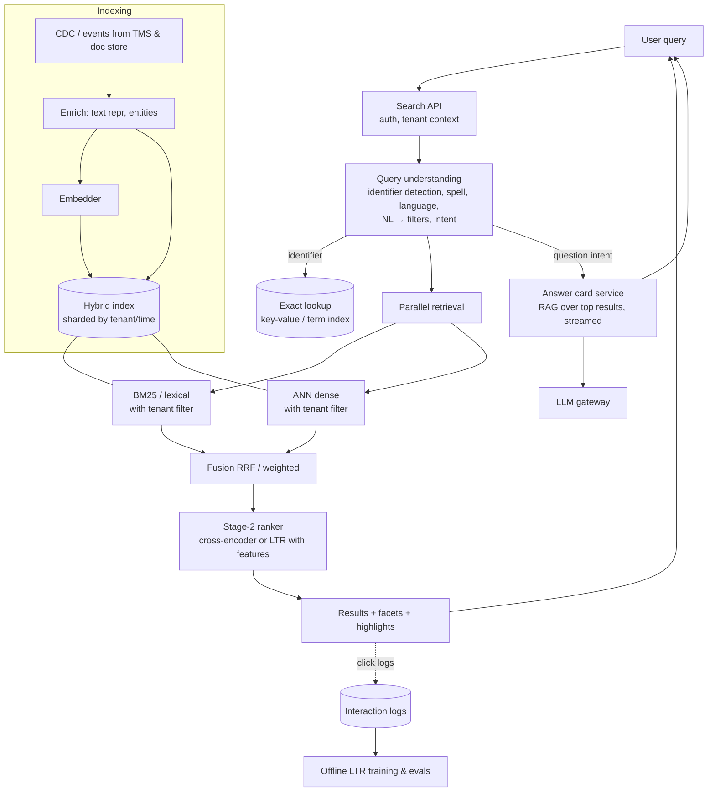

# Design AI-powered semantic search

!!! abstract "At a glance"
    **Priority:** P1 · **Complexity:** 4/5 · **Est. time:** 3 h · **Phase:** 2 · **Prereqs:** [Search systems](../system-design/search-systems.md), [Hybrid search & reranking](../agentic-ai/hybrid-search-reranking.md), [Vector databases](../agentic-ai/vector-databases.md), [RAG system](rag-system.md)
    **You're done when:** you can design a low-latency hybrid search system (lexical + dense + filters + learned ranking) for 100M+ items with query understanding, reranking, optional generative answers, relevance evaluation (nDCG, online A/B), and a clear latency and cost budget — and explain how it differs from RAG.

## Problem

"Design semantic search for a large catalogue / knowledge base. Users type natural-language queries; results must be relevant, fast and filterable. Optionally show an AI-generated summary answer."

Logistics flavour: search across **shipments, bookings, containers and documents** in a customer portal ("reefer containers delayed in Rotterdam last week", "MSKU1234567", "invoices for booking 22XYZ over $10k"), plus a product-style catalogue of services and tariffs. 150M shipment records, 30M documents, 200k enterprise users.

## Clarifying questions

| Question | Why |
|---|---|
| What entities are searched: records, documents, products? | Structured vs unstructured retrieval, text-to-filter |
| Query mix: identifiers, keywords, natural language, questions? | Router design; lexical must stay strong |
| Latency target and QPS? | Rerank budget, caching, index topology |
| Personalisation and permissions? | Per-tenant filtering, features for ranking |
| Is a generated answer required or just ranked results? | Adds RAG path, cost, latency |
| Freshness: how fast must new shipments/events be searchable? | Near-real-time indexing |
| Success metric: clicks, task completion, zero-result rate? | Evals and A/B design |

## Requirements

**Functional:** free-text search with facets/filters; identifier lookup; natural-language filters ("last week", "Rotterdam", "reefer") translated to structured filters; ranked results with highlights; typo tolerance; multilingual; optional AI answer card with citations; "more like this".

| NFR | Target (assumed) |
|---|---|
| Quality | nDCG@10 +15% vs current keyword search on judged set; zero-result rate < 2%; identifier queries 100% exact-hit at rank 1 |
| Latency | Results p95 < 300 ms; AI answer card streamed, TTFT < 1.5 s (non-blocking) |
| Scale | 2k QPS peak; 180M items; 500k updates/hour |
| Freshness | New/updated shipments searchable < 60 s |
| Cost | Search infra cost per query < $0.0005; AI answer only on ~10–20% of queries |
| Safety | Strict tenant isolation; no leakage via suggestions/autocomplete; injection-safe answer generation |

## Estimation

```text
Items: 180M; embed a text representation (~200 tokens avg) → 36B tokens one-off
  self-hosted embedding model on GPUs: at an assumed ~20k tokens/s/GPU → 1.8M GPU-s ≈ 500 GPU-h (~$1.5k)
Vectors: 180M × 768 dims × 4 B = 553 GB float32 → int8 ~138 GB → binary ~17 GB (+rescoring)
BM25 index: ~100–200 GB depending on fields
Updates: 500k/hour ≈ 140/s embeddings → one GPU handles easily
Query path at 2k QPS peak:
  query embedding (small model, ~5 ms on GPU, batched) → 2k QPS fine on 1–2 GPUs
  rerank top-100 with cross-encoder: 2k × 100 = 200k pairs/s → too expensive!
    → rerank top-30 only for NL queries (~40% of traffic): 800 × 30 = 24k pairs/s → a few GPUs
AI answer card on 15% of queries: 300 QPS at peak, ~100 QPS average (avg ≈ 1/3 of peak)
  100 × 3k input tokens × 86,400 s ≈ 26B tokens/day → at an assumed $0.50/M small model ≈ $13k/day → too much;
  gate the card behind intent (question-like queries only, ~3%) and cache → ~$2–3k/day
```

Key insight: **search must stay cheap per query**; LLM calls are the exception path, gated by intent.

## Architecture



## Component deep dives

### 1. Query understanding

| Technique | Purpose | Cost |
|---|---|---|
| Identifier detection (regex: container numbers, booking IDs, B/L numbers) | Route to exact lookup; skip semantic | ~0 |
| Spell correction, transliteration | Recall on typos | low |
| NL → structured filters ("last week", "Rotterdam" → date range, UN/LOCODE NLRTM) | Precision; uses facets properly | small LLM or NER + rules; cache |
| Intent classification (navigational, exploratory, question) | Decide rerank, answer card | small model |
| Query expansion / rewriting | Recall for vague queries | LLM call — only when needed |

Using an LLM for query → filters is powerful but adds 100–300 ms; run it in parallel with a plain hybrid retrieval, merge if it returns in time (speculative execution), and cache by normalised query.

### 2. Retrieval & fusion

- **Hybrid** by default: BM25 (identifiers, exact phrases, rare terms) + dense (semantic, multilingual).
- Fusion: **Reciprocal Rank Fusion** (robust, no score calibration) or weighted normalised scores (tunable per query type).
- Filters (tenant, date, type) applied inside both retrievers; shard by tenant/time to keep filtered ANN recall high.
- Multi-vector / late interaction (ColBERT-style) for higher precision if budget allows.

### 3. Ranking

| Stage | Options |
|---|---|
| Stage 1 (recall) | BM25 + ANN, top 200–1,000 |
| Stage 2 (precision) | Cross-encoder reranker on top 30–100 (text relevance) and/or **learning-to-rank** (GBDT like LightGBM LambdaMART) with features: text scores, recency, entity match, tenant popularity, user history, business rules |
| Stage 3 (business) | Diversity, pinning, dedupe, freshness boosts |

For structured entities (shipments), LTR with rich features often beats a pure text cross-encoder; for documents, cross-encoders shine. Click-based training needs position-bias correction.

### 4. Embeddings

- Choose by evaluation on your queries (MTEB leaderboard is a starting shortlist, not an answer).
- Text representation matters: for a shipment, compose "reefer 40ft container, Rotterdam → Singapore, delayed 3 days, customer ACME, status: at transhipment port" — the embedding only knows what you put in.
- Fine-tune embeddings on click/judged pairs for domain vocabulary (reefer, demurrage, transhipment) once logs exist.
- Matryoshka/quantised embeddings to control memory; version embedders with the index.

### 5. AI answer card (generative layer)

Only for question intents ("why was my shipment held in customs?"). RAG over the top-k results the user is allowed to see, streamed separately so it never delays the result list. Citations link to results. Guardrails: results can contain user/partner-authored text (injection), so no tools, output link allow-list. Cache answers for popular queries per tenant (short TTL).

### 6. Indexing and freshness

CDC from TMS/document store → enrichment → embedding → index upsert. Near-real-time: < 60 s via streaming (Kafka) and index refresh intervals. Backfills (re-embedding) as separate batch jobs writing to a new index version with alias swap.

### 7. Engine choice

| Engine | Fit |
|---|---|
| Elasticsearch/OpenSearch | Mature BM25, facets, aggregations + vectors; existing ops skills |
| Vespa | Advanced ranking (multi-phase, tensors), hybrid at scale |
| Qdrant/Weaviate/Milvus + separate BM25 | Vector-first; sparse vectors support improving |
| Azure AI Search / managed | Semantic ranker built-in; speed to market |
| Postgres (pgvector + FTS) | Smaller scale (< ~50M) with transactional data |

## Evaluation strategy

- **Offline relevance**: judged query set (1–2k queries stratified by type: identifier, keyword, NL, question; by tenant size; by language) with graded relevance labels → nDCG@10, MRR, Recall@100 (for stage 1). LLM-assisted labelling is acceptable to scale judgments if calibrated against human labels on a subset.
- **Component evals**: query→filter extraction accuracy (exact match on filter sets), identifier routing precision, answer-card groundedness and citation precision.
- **Online**: A/B or interleaving experiments — CTR@k, successful-search rate (click + dwell or downstream action), reformulation rate, zero-result rate, time to first click. Interleaving needs less traffic for ranking comparisons.
- **Error analysis**: review failed sessions (reformulations, zero results); taxonomy: *identifier mishandled*, *filter misparsed*, *semantic drift (related but wrong entity)*, *stale index*, *permission-filter starvation*.

## Observability

Per query: latency per stage, candidates per retriever, fusion overlap, reranker latency, result count, click position; LLM spans for query understanding and answer card (OTel GenAI). Metrics: p50/p95/p99 by stage, zero-result rate, index lag, embedder throughput, cache hit rates, answer-card usage and cost.

## Failure modes

| Failure | Mitigation |
|---|---|
| Semantic search returns "similar but wrong" entity (ROTTERDAM vs ANTWERP) | Entity/filter extraction, lexical leg, LTR features for exact matches |
| Identifier queries broken by embeddings | Router to exact lookup, BM25 boost |
| Cross-tenant leakage via autocomplete/suggestions | Tenant-scoped suggestion indexes, no global popular queries with identifiers |
| Filtered ANN recall collapse | Shard by tenant, filter-aware ANN, fallback to brute force for small tenants |
| Latency spikes from rerank or LLM query parsing | Budgets, timeouts with fallback to stage-1 ranking, speculative parallelism |
| Stale results | CDC monitoring, index lag SLO |
| Answer card hallucination / injection | Grounding checks, no tools, citations, abstention |

## Scaling & cost optimization

- Keep LLM out of the hot path by default; route by intent.
- Quantised vectors + rescoring; tiered storage (recent shipments hot, archived cold).
- Cache query embeddings and results (tenant-scoped); cache LLM query-parse results.
- Batch reranker inference on GPU; distil cross-encoder to smaller model.
- Shard by tenant/time; replicate for QPS.

## What a Staff-level answer adds

- Treats search as a **ranking problem with a feedback loop** (logs → LTR → A/B), not "add a vector DB".
- Separates **search** (ranked list, ms latency, cheap) from **RAG** (generated answer, seconds, expensive) and composes them.
- Explicit **relevance program**: judged sets, labelling guidelines, experimentation platform, owners.
- Migration plan from keyword search: shadow mode, interleaving experiments, gradual rollout per tenant.
- Exposes search as an MCP tool for agents (the shipment exception agent uses the same search with the user's permissions).

## Resources

| Resource | Type | Why this one | Level | Cost |
|---|---|---|---|---|
| [Rerankers and Two-Stage Retrieval (Pinecone)](https://www.pinecone.io/learn/series/rag/rerankers/) | article | Bi-encoder vs cross-encoder intuition | intermediate | free |
| [Hybrid search (Qdrant)](https://qdrant.tech/articles/hybrid-search/) :gem: | article | Fusion methods and when each wins | intermediate | free |
| [ColBERT paper](https://arxiv.org/abs/2004.12832) | paper | Late interaction for precision at scale | advanced | free |
| [System Design for Recommendations and Search (Eugene Yan)](https://eugeneyan.com/writing/system-design-for-discovery/) :gem: | article | Offline/online, retrieval/ranking architecture used by big tech | intermediate | free |
| [MTEB leaderboard](https://huggingface.co/spaces/mteb/leaderboard) | interactive | Shortlist embedding models (then evaluate on your data) | intermediate | free |
| [Sentence Transformers (SBERT)](https://sbert.net/) | docs | Embedding and cross-encoder training/fine-tuning | intermediate | free |
| [Embedding quantization (Hugging Face)](https://huggingface.co/blog/embedding-quantization) | article | Memory math for large indexes | intermediate | free |
| [Introducing Contextual Retrieval (Anthropic)](https://www.anthropic.com/news/contextual-retrieval) | article | Evidence for BM25 + embeddings + rerank | intermediate | free |

## Follow-up questions

### L2 — Apply

??? question "Q1. A user searches 'MSKU1234565'. Walk through the query path."
    ??? success "Answer"
        Query understanding matches the ISO 6346 pattern (and validates check digit) → identifier route: exact lookup in the container/term index filtered by tenant → return the container and linked shipments at rank 1 within ~20 ms. Semantic retrieval is skipped (or run in parallel for "related" results). If not found in tenant scope, return "no match" — never fall back to fuzzy semantic matches that might show a different container as if it were the one requested.

??? question "Q2. 'Reefer containers delayed in Rotterdam last week' — convert to a structured query."
    ??? success "Answer"
        Filters: `equipment_type IN (reefer types)`, `location = NLRTM` (port or terminal events), `status/event = delayed` (ETA slip > threshold), `date_range = [last Monday, last Sunday]` in user's timezone, `tenant = user's company`. Remaining free text (if any) goes to hybrid retrieval. Implementation: small LLM with a JSON schema of allowed filter fields/enums + validation against reference data; fall back to plain hybrid search if parsing fails or times out. Cache by normalised query.

??? question "Q3. Size the reranking budget: 2k QPS, 40% NL queries, top-50 rerank, cross-encoder at an assumed 4k pairs/s per GPU."
    ??? success "Answer"
        NL QPS = 800 × 50 = 40k pairs/s → 10 GPUs + headroom (~13). Options: rerank top-20 (→ 4 GPUs), distil to a smaller cross-encoder (2–3× faster), rerank only when stage-1 confidence is low, cache for popular queries. Measure nDCG impact of each reduction.

??? question "Q4. Zero-result rate is 7%. How do you investigate?"
    ??? success "Answer"
        Sample zero-result queries and classify: typos, over-restrictive parsed filters (LLM added a wrong filter), identifiers from other tenants, vocabulary mismatch (synonyms), stale index, permission-filter starvation. Fixes: spell correction, relax filters progressively with UI notice ("showing results without 'last week'"), synonyms/dense leg, index lag fixes. Track zero-result rate by cause.

### L3 — Design & trade-offs

??? question "Q5. Cross-encoder reranking vs learning-to-rank with features — which for shipment search?"
    ??? success "Answer"
        Shipments are structured records where relevance depends on non-text features (recency, status, exact entity matches, user's typical lanes). LTR (LambdaMART) over features including text scores (BM25, dense similarity) fits better, trained on click logs with position-bias correction and judged data. For document search, a cross-encoder adds more. Common production answer: cross-encoder score as one LTR feature for text-heavy entities.

??? question "Q6. Should the LLM answer card be synchronous with results?"
    ??? success "Answer"
        No. Results must return in < 300 ms; the answer card streams asynchronously into its own UI slot, triggered only for question intents. This keeps search fast and cheap while offering generative value where it helps. If the card fails, results remain.

??? question "Q7. RRF or weighted score fusion?"
    ??? success "Answer"
        RRF is robust and needs no score calibration — a great default. Weighted fusion can outperform when tuned per query type (identifier-ish → lexical weight up; conceptual → dense up) but requires normalised scores and ongoing tuning. Start with RRF, then move to learned fusion via LTR features once judged data exists.

??? question "Q8. Elasticsearch with vectors vs a dedicated vector DB plus separate BM25?"
    ??? success "Answer"
        If the team runs Elasticsearch/OpenSearch already and needs facets/aggregations, one engine for hybrid reduces consistency and ops problems. A dedicated vector DB wins if vector scale/filters/quantisation needs exceed ES capabilities or the use case is vector-first. Avoid dual-writes across two engines without strong reasons; if you must, keep one source of truth and rebuild both from CDC.

### L4 — Staff-level ambiguity

??? question "Q9. Product asks to 'replace search with a chatbot'. What do you recommend?"
    ??? success "Answer"
        Show data: query mix (identifier and navigational queries dominate portal search — chat is slower for them), latency expectations, cost per query. Recommend composing: keep fast search for lookups and browsing, add an answer card and a conversational mode for exploratory questions, both built on the same retrieval layer and permission model. A/B test engagement and task completion. This avoids regressing the majority of users while adding AI value.

??? question "Q10. You have no relevance labels and no experimentation platform. How do you start a relevance program?"
    ??? success "Answer"
        Week 1–2: mine logs for top queries and failure signals (reformulations, zero results); build a 500-query judged set with SMEs + LLM-assisted labelling calibrated on a subset. Establish nDCG baseline for current search. Build interleaving/A-B capability (even simple traffic split with logging). Define owners and a weekly relevance review. Only then introduce semantic/hybrid changes, each measured offline then online.

??? question "Q11. Legal requires that search never reveals the existence of other tenants' shipments. Where can leakage happen?"
    ??? success "Answer"
        Results (filters), result counts and facet counts (computed pre-filter), autocomplete/suggestions (global popular queries), spell-correction dictionaries built from all tenants' data (suggesting a competitor's customer name), caches keyed without tenant, answer card context, timing differences (identifier lookup fast when exists elsewhere). Mitigate with tenant-scoped indexes/filters everywhere, tenant-scoped suggestion and spell dictionaries, consistent responses for not-found vs not-authorised, and leakage tests in CI.

## Real-world use cases

- **Customer portal shipment search**: identifiers + NL filters + LTR; the main example above.
- **Enterprise document search** (contracts, SOPs): hybrid + cross-encoder + answer card — shares infra with [RAG system](rag-system.md).
- **Tariff/service catalogue search** for sales teams: multilingual semantic matching with business boosts.
- **E-commerce style catalogue** (spare parts for container equipment): part numbers (lexical) + descriptions (semantic).

## Checklist

- [ ] I can draw query understanding → hybrid retrieval → fusion → ranking → answer card
- [ ] I can size vectors, reranker GPUs and LLM costs, and explain intent gating
- [ ] I can explain RRF, cross-encoders vs LTR, and position-bias in click data
- [ ] I can design offline (nDCG) and online (interleaving/A-B) relevance evaluation
- [ ] I can enumerate tenant-leakage vectors in search
- [ ] I answered all L3/L4 questions out loud in < 3 min each
