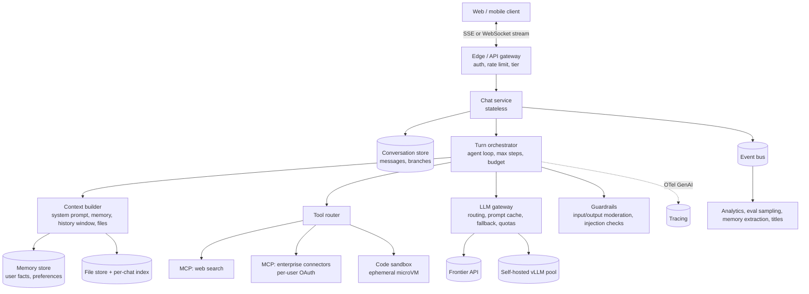

# Design a ChatGPT-style assistant

!!! abstract "At a glance"
    **Priority:** P0 · **Complexity:** 4/5 · **Est. time:** 3 h · **Phase:** 3 · **Prereqs:** [Framework](framework.md), [Context engineering](../agentic-ai/context-engineering.md), [Memory systems](../agentic-ai/memory-systems.md), [Cost & latency optimization](../agentic-ai/cost-latency-optimization.md)
    **You're done when:** you can design a multi-tenant, streaming, tool-using chat assistant for millions of users — covering conversation storage, context-window management, memory, tool execution via MCP, streaming transport, GPU/API capacity math and safety — and explain how it differs from the classic chat-system case study.

## Problem

"Design a ChatGPT-like assistant: users chat with an LLM in multi-turn conversations, upload files, and the assistant can use tools (web search, code execution, company connectors). Web + mobile. Scale: 5M DAU."

Enterprise variant worth practising: an internal "company GPT" for a 100k-employee logistics group with connectors (MCP) to shipment tracking, SharePoint and ticketing, SSO and per-user permissions.

## Clarifying questions

| Question | Why it matters |
|---|---|
| Consumer or enterprise? | Enterprise → SSO, per-user tool auth, data retention/eDiscovery, no training on data |
| Which capabilities in v1: files, web search, code execution, image generation, voice? | Each adds a subsystem (sandbox, file parsing, search provider) |
| Models: one or many, user-selectable? | Routing layer, per-model quotas, pricing tiers |
| Long-term memory across chats? | Memory extraction/storage, privacy controls |
| Latency expectations? | Streaming mandatory; TTFT target |
| Free vs paid tiers? | Rate limits, model access, priority queuing |
| Regions / residency? | Multi-region deployment, region-pinned models |

## Requirements

**Functional:** create/list/rename/delete conversations; send message and stream response; stop generation; regenerate/edit (branching); attach files; tool use with visible progress; memory on/off and view/delete; share conversation link; feedback.

| NFR | Target (assumed) |
|---|---|
| Quality | Tool-call success ≥ 97%; factual-error rate on eval set below threshold; refusal rate on benign prompts < 1% |
| Latency | TTFT p95 < 1 s (non-reasoning), streaming ≥ 30 tokens/s perceived; tool-using turns show progress within 1 s |
| Cost | Free tier < $0.30/user/month; paid tier margin-positive at $20–30/month |
| Safety | Content policy enforcement, injection-safe tools, no cross-user data leakage, PII handling, abuse detection |
| Availability | 99.9% chat; graceful degradation to smaller model on provider/GPU saturation |
| Durability | No lost messages once acknowledged |

## Estimation

```text
5M DAU × 8 turns/day = 40M turns/day ≈ 460 turns/s avg, ~1,400/s peak (3× factor)
Tokens per turn: system+tools 2k, history (truncated/summarised) 3k, user 150 → ~5k input; output 400
Daily: 40M × 5k = 200B input tokens; 40M × 400 = 16B output tokens
Output tokens/s at peak: 1,400 × 400 / ~10 s generation ≈ 56k tokens/s being streamed concurrently
Concurrent streams at peak ≈ 1,400 turns/s × ~10 s = 14k open streaming connections (plus idle websockets)

API cost (assumed $3/M in, $15/M out, 70% cached prefix at 10% price):
  input effective ≈ 200B × (0.3 + 0.7×… only the 2k prefix is cacheable) → treat 2k/5k cacheable:
  cacheable 80B × $0.3/M = $24k/day; uncached 120B × $3/M = $360k/day; output 16B × $15/M = $240k/day
  ≈ $620k/day → ~$19M/month  (≈ $3.7/DAU/month) → need routing: most chat is easy
Route 70% of turns to a small model (~1/10 price) → ~$7M/month (~$1.4/DAU)

Self-host angle: a 70B-class model on 8×H100 with vLLM might sustain ~several thousand output tok/s under
batching; 56k tok/s peak → tens of nodes for the big model (validate with benchmarks, not this estimate).

Storage: 40M turns × ~4 KB (text + metadata) = 160 GB/day → ~58 TB/year before compression.
```

The estimate reveals the design driver: **token economics and routing**, not message storage.

## Architecture



Key idea: the **chat service is stateless**; the conversation store is the source of truth; the orchestrator runs a bounded agent loop per turn; everything slow and non-critical (titles, memory extraction, eval sampling, analytics) goes async via the event bus.

## Component deep dives

### 1. Streaming transport

| Option | Pros | Cons |
|---|---|---|
| **SSE over HTTP** | Simple, works through proxies/CDNs, native in browsers; each turn is a request | One-directional; reconnection must resume by offset |
| WebSocket | Bidirectional (stop, voice, typing), one connection | Sticky connections, LB/idle timeouts, harder to scale horizontally |
| AG-UI protocol over SSE/WS | Standard event types for agent state, tool progress, shared state; adopted by major agent frameworks in 2026 | Another abstraction to adopt |

Design: SSE for token streams (resume via `Last-Event-ID` and a per-turn token log in Redis/stream store), a separate cancel endpoint that signals the orchestrator (which aborts the upstream model call to stop paying for tokens). Persist the assistant message incrementally (or at completion with a checkpoint) so a reconnecting client can recover.

### 2. Conversation storage & branching

Messages form a **tree** (edit/regenerate creates siblings). Schema: `messages(conversation_id, message_id, parent_id, role, content_parts[], model, token_counts, created_at)`; `conversations(id, user_id, title, current_leaf_id, …)`. Partition by `user_id` / `conversation_id` (Cassandra/DynamoDB/Cosmos-style wide-column or sharded Postgres). Reads are "load the path from leaf to root" — cache the active path. Retention and deletion must cascade to derived stores (memory, file indexes, traces, eval samples) — a GDPR requirement people forget.

### 3. Context-window management

The context builder is the heart of quality and cost.

| Technique | Use | Trade-off |
|---|---|---|
| Sliding window of last N turns | Default | Loses early facts |
| Rolling summary of older turns | Long chats | Summarisation cost; summary drift |
| Retrieval over conversation history | Very long chats, "what did I say earlier about X" | Extra infra; misses implicit context |
| Tool-result compaction / clearing | Agentic turns with big tool outputs | Must keep references to re-fetch |
| Prompt caching friendly ordering | Always | Static first: system → tool defs → memory → summary → recent turns |

Budget example for a 128k-window model: system + tools 3k, memory 1k, summary 1k, recent turns up to 8k, files/tool results up to 20k, reserve output 4k. Just because the window is 200k–1M doesn't mean you should fill it — cost is linear in input tokens and quality degrades with distractors ("context rot").

### 4. Memory

| Type | Example | Store |
|---|---|---|
| Session (working) | Current task state | Conversation itself |
| Long-term semantic | "User works in customs brokerage, prefers metric units" | Memory store (Mem0/Letta/Zep-style or custom table + vector index) |
| Episodic | Summaries of past chats | Vector index per user |
| Procedural | Custom instructions | User profile |

Write path: async extractor after each turn proposes memory ops (add/update/delete) → dedupe/conflict resolution → store with provenance. Read path: retrieve top-k relevant memories into context. Privacy: user-visible, editable, deletable; never memorise secrets/sensitive categories; memory is a **poisoning vector** (OWASP Agentic: memory & context poisoning) — content from tools/web pages should not write memory without user action.

### 5. Tools via MCP

- Tool router exposes a **curated subset** of tools per turn (too many tool definitions hurt accuracy and burn tokens; use tool search/lazy loading for large catalogs).
- Enterprise connectors run as MCP servers using **per-user OAuth** (the user's delegated token, not a service super-account) — the 2025-11-25 spec's authorization model and the 2026-07-28 revision's OAuth/OIDC hardening make this the standard pattern.
- Code execution: ephemeral sandbox (Firecracker/gVisor microVM), no network by default, CPU/memory/time limits, files mounted per conversation.
- Web search results are untrusted: never let content from a fetched page trigger another side-effecting tool without confirmation.

### 6. Model routing

| Strategy | How | Risk |
|---|---|---|
| User-selected model | UI picker | Users pick the biggest model for everything |
| Rule-based | Attachments/code/long context → big model | Brittle |
| Learned router (RouteLLM-style) | Classifier predicts if small model suffices | Needs preference data; monitor quality per route |
| Cascade | Small model answers; verifier escalates | Double latency on escalations |

Plus reliability routing: provider fallback on 429/5xx, region failover, priority tiers for paid users.

### 7. Guardrails & abuse

Input moderation (fast classifier, parallel with the first model call where possible), output moderation on streamed chunks with ability to retract, jailbreak/injection classifiers, per-user and per-IP rate limits, anomaly detection for scraping/automation, and account-level abuse scoring. For enterprise: DLP on outbound content, tenant data never used for training, audit logs.

## Evaluation strategy

- **Offline suites** per capability: general chat quality (pairwise preference judged by LLM, calibrated to humans), tool-use correctness (did it call the right tool with right args — deterministic checks), long-context recall, memory correctness (right memory retrieved, no stale facts), safety (red-team prompts, over-refusal set).
- **Regression gates** on prompt/model/router changes, sliced by language, capability and tier.
- **Online**: A/B tests on thumbs rate, regenerate rate, conversation length, return rate; sampled LLM-judge on production traces with human review of disagreements.
- **Error analysis**: weekly trace review of regenerates and thumbs-down; taxonomy like *wrong tool*, *tool args malformed*, *ignored file*, *memory wrong*, *over-refusal*, *verbosity*.

## Observability

Per turn: trace with spans for context build, each model call (model, tokens in/out/cached, TTFT, TPOT), each tool call (name, latency, error), guardrail decisions. Metrics: TTFT/TPOT p50/p95 by model/region, stream disconnect rate, cancel rate, tokens/turn, cost per DAU by tier, tool error rate, router distribution, moderation block rate. Sample traces into the eval pipeline (with consent/redaction rules).

## Failure modes

| Failure | Mitigation |
|---|---|
| Hallucinated facts | Encourage tool use (search) for factual queries, citations, calibrated uncertainty language, evals on factuality slices |
| Indirect prompt injection via web/file content | Treat tool outputs as data, confirm side-effects, restrict tools in turns with untrusted content (lethal trifecta), injection classifiers |
| Tool misuse / runaway loops | Max steps per turn, per-turn token and $ budget, duplicate-call detection, timeouts |
| Provider outage / 429 storms | Gateway fallback chain, degrade model, queue with backpressure, status messaging |
| Stream drop mid-answer | Resume by event ID, server-side persistence of partial output |
| Memory leak across users | Memory keyed by user, isolation tests, no shared semantic cache for personalised content |
| Cost spike (abuse, long contexts) | Tier quotas, context caps, anomaly alerts, bot detection |

## Scaling & cost optimization

- Stateless chat/orchestrator pods autoscale on concurrent streams, not CPU.
- Prompt caching: keep system prompt and tool definitions byte-stable; version them deliberately.
- Routing and cascades: largest lever at consumer scale.
- Self-host the high-volume small model on vLLM/SGLang with prefix caching and continuous batching; keep frontier APIs for hard queries — hybrid fleet.
- Async/batch for non-interactive work (titles, memory extraction, summaries) via cheaper models and batch APIs.
- Output length control via instructions and `max_tokens` per tier.

## What a Staff-level answer adds

- Distinguishes the **data plane** (turn execution) from the **control plane** (model catalog, prompts, tool registry, policies, quotas) and versions everything in the control plane.
- A **capacity plan** with provider rate-limit contracts (TPM/RPM) and reserved/provisioned throughput vs pay-as-you-go.
- **Privacy architecture**: deletion propagation, retention, residency, "no training" guarantees, audit.
- **Product-quality loop**: which online metric is the north star (e.g., successful sessions/week) and how offline evals predict it.
- Protocol strategy: MCP for tools, AG-UI for front-end events, A2A if other teams' agents are invoked.

## Resources

| Resource | Type | Why this one | Level | Cost |
|---|---|---|---|---|
| [Effective context engineering for AI agents (Anthropic)](https://www.anthropic.com/engineering/effective-context-engineering-for-ai-agents) | article | Compaction, tool-result clearing, memory — the context builder's playbook | intermediate | free |
| [Prompt caching (Claude docs)](https://docs.claude.com/en/docs/build-with-claude/prompt-caching) | docs | Exact prefix-caching semantics to design prompt ordering | intermediate | free |
| [Prompt caching (OpenAI docs)](https://platform.openai.com/docs/guides/prompt-caching) | docs | Automatic caching behaviour for comparison | intermediate | free |
| [AG-UI docs](https://docs.ag-ui.com/) :gem: | docs | Standard event model for streaming agent UIs | intermediate | free |
| [MCP specification](https://modelcontextprotocol.io/specification/2026-07-28) | docs | Tool/connector protocol and auth model | advanced | free |
| [Mem0 docs](https://docs.mem0.ai/) | docs | Concrete memory extraction/update design | intermediate | freemium |
| [RouteLLM (LMSYS blog)](https://lmsys.org/blog/2024-07-01-routellm/) :gem: | article | Learned routing with cost/quality curves | advanced | free |
| [Musings on building a GenAI product (LinkedIn Eng)](https://www.linkedin.com/blog/engineering/generative-ai/musings-on-building-a-generative-ai-product) :gem: | article | Honest production lessons on latency, evals, capacity | intermediate | free |
| [Beyond the sandbox: Claude Code sandboxing (Anthropic)](https://www.anthropic.com/engineering/claude-code-sandboxing) | article | Filesystem/network isolation pattern for code tools | advanced | free |

## Follow-up questions

### L2 — Apply

??? question "Q1. A user clicks Stop mid-stream. Walk through what must happen server-side."
    ??? success "Answer"
        Client calls cancel endpoint (or sends WS message) with turn ID → chat service publishes a cancel signal (Redis pub/sub or orchestrator control channel) → orchestrator aborts the in-flight model request (closing the upstream stream stops token billing at most providers) and any running tools (sandbox kill) → persists the partial assistant message with `finish_reason=cancelled` and token counts → emits a final stream event. Idempotent: repeated cancels are no-ops. Metrics: cancel rate by model (high rates signal verbosity or slowness).

??? question "Q2. A conversation has grown to 180k tokens. The model supports 200k. What does your context builder send?"
    ??? success "Answer"
        Not 180k. Keep static prefix (system + tools, cacheable), user memory, a rolling summary of old turns (refreshed every N turns), the last ~10–20 turns verbatim, and retrieved snippets from older turns relevant to the current message; clear stale tool outputs, keeping references. Target maybe 15–30k tokens. Rationale: cost is linear in input tokens, TTFT grows with prefill, and accuracy drops with distractors. Evaluate with a long-conversation recall suite.

??? question "Q3. Estimate the concurrent streaming connections and pods needed at 1,400 turns/s peak with 10 s average stream duration."
    ??? success "Answer"
        Little's law: 1,400 × 10 = 14,000 concurrent streams. An async (event-loop) service can hold ~5–10k idle-ish streaming connections per pod, but orchestration work (JSON parsing, guardrail calls) limits it; plan ~1–2k active turns per pod → 10–15 pods plus 50% headroom and multi-AZ → ~24 pods. Scale on active-stream count. The real limiter is upstream model capacity (TPM limits), not pods.

??? question "Q4. How would you implement 'edit a previous message' without losing the old branch?"
    ??? success "Answer"
        Messages as a tree: editing message M creates a new sibling M' with the same parent; generation continues from M'. `current_leaf_id` on the conversation points to the active branch. Loading = walk parent pointers from the leaf (cache the path). UI shows "< 2/3 >" sibling navigation. Context building uses only the active path. Deletion policies must handle whole subtrees.

### L3 — Design & trade-offs

??? question "Q5. SSE or WebSocket for streaming? Decide for a web + mobile assistant with a voice feature planned next year."
    ??? success "Answer"
        SSE now for text streaming: simple, HTTP-native, CDN/proxy-friendly, easy resume with event IDs, and stateless LB. Cancel via a separate POST. For voice, use a dedicated realtime channel (WebRTC or WebSocket to a realtime speech service) rather than forcing all chat over WebSockets. Keep the event schema transport-agnostic (e.g., AG-UI events) so switching transports doesn't change the client model.

??? question "Q6. Should the free tier use a self-hosted open model while paid uses frontier APIs?"
    ??? success "Answer"
        Plausible, with evidence. Free-tier traffic is huge, price-sensitive and mostly simple; a self-hosted mid-size model at high utilisation can cut cost per token substantially. Risks: quality gap hurts conversion; GPU capacity planning and on-call; safety tuning of the open model. I'd A/B: free tier on open model vs small API model, measuring retention and upgrade rate, not just eval scores. A hybrid fleet with a learned router often wins: open model for easy turns, API for hard ones regardless of tier.

??? question "Q7. Where do you enforce content moderation for streamed output without killing TTFT?"
    ??? success "Answer"
        Input moderation runs in parallel with starting the model call (cancel generation if input is flagged). Output moderation runs on buffered windows (e.g., every sentence/200 tokens) asynchronously; if flagged, stop the stream and replace/retract the message. For high-risk categories, delay display by a small buffer. Accept a tiny exposure window as a documented trade-off, or for enterprise/regulated contexts, moderate before display at the cost of latency.

??? question "Q8. How do you prevent a malicious web page (fetched by the search tool) from making the assistant email the user's files to an attacker?"
    ??? success "Answer"
        Break the lethal trifecta: in any turn where untrusted content is in context, disable or require explicit user confirmation for exfiltration-capable tools (email, HTTP POST, file share). Tools use per-user scoped tokens with least privilege. Show the full action (recipient, attachments) in a confirmation UI rendered from structured tool args — not model prose. Add injection classifiers on tool outputs, egress allow-lists, and red-team evals with poisoned pages (promptfoo OWASP agentic preset).

### L4 — Staff-level ambiguity

??? question "Q9. Leadership wants to launch the company-internal assistant to 100k employees in 8 weeks. What do you cut and what don't you cut?"
    ??? success "Answer"
        Cut: custom model hosting, long-term memory, code execution, broad connector catalog, fancy routing. Use a managed platform (Microsoft Foundry Agent Service or Bedrock AgentCore) or a thin custom stack over a gateway. Keep (non-negotiable): SSO + per-user permissions on the 2–3 connectors shipped, audit logging and retention policy, DLP/PII controls, basic moderation, eval suite for top intents, cost quotas per user, OTel tracing. Launch to a 2k pilot in week 6, measure, then expand. Document deferred items with trigger criteria.

??? question "Q10. Cost per DAU is 3× the business plan after launch. You have one quarter. Plan?"
    ??? success "Answer"
        Decompose cost by driver from traces: model mix, input vs output tokens, cached vs uncached, tool loops, long-context turns, heavy users. Typical plan: (1) fix prompt ordering to maximise cache hits (days); (2) cap history/tool-output tokens via summarisation/compaction (weeks); (3) introduce routing with eval gates per slice (weeks); (4) move background work to batch + small models; (5) quotas and fair-use limits for extreme users; (6) negotiate provisioned throughput. Track weekly cost/DAU and quality metrics side by side; publish a burn-down to leadership.

??? question "Q11. Legal asks for a guarantee that deleted conversations are gone everywhere within 30 days. What's your design?"
    ??? success "Answer"
        Maintain a **data lineage map** of every store derived from conversations: primary store, search/vector indexes, memory store, file store, traces/observability backend, eval datasets, analytics warehouse, backups, provider-side retention (zero-data-retention agreements). Deletion emits an event consumed by each store's deleter with idempotent, verifiable completion; a reconciliation job audits orphans. Backups: crypto-shredding (per-user keys) to avoid restoring deleted data. Evals built from prod must reference traces by ID and be purged or anonymised accordingly.

## Real-world use cases

- **Company GPT for a logistics group**: SSO, MCP connectors to shipment tracking and document stores, per-user OAuth, audit — the enterprise flavour of this design.
- **Customer-facing assistant on a carrier's portal**: booking questions, tracking, invoices; tools restricted to the customer's own account; strict rate limits.
- **Developer assistant in an IDE**: repository context, tool execution in sandboxes — overlaps with [Coding agent](coding-agent.md).
- **Consumer assistant at scale**: routing + self-hosted small model to hit unit economics.

## Checklist

- [ ] I can draw the architecture and explain why the chat service is stateless
- [ ] I can compute concurrent streams, token volumes and $/DAU with routing and caching
- [ ] I can explain context-window budgeting, summarisation and cache-friendly ordering
- [ ] I can describe memory write/read paths and their privacy/poisoning risks
- [ ] I can defend SSE vs WebSocket and the stop/resume mechanics
- [ ] I answered all L3/L4 questions out loud in < 3 min each
