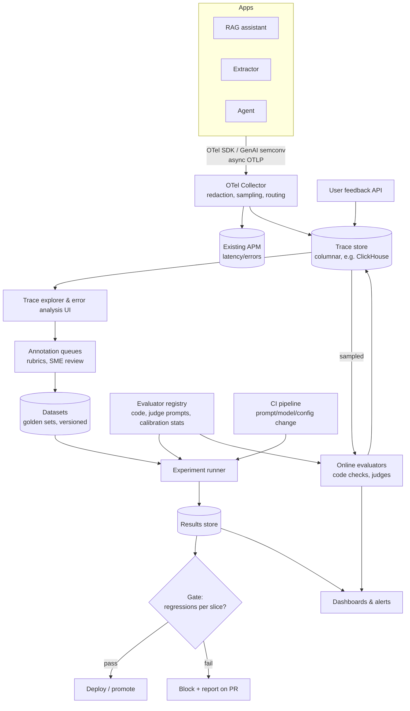

# Design an LLM evaluation & observability platform

!!! abstract "At a glance"
    **Priority:** P0 · **Complexity:** 4/5 · **Est. time:** 3 h · **Phase:** 4 · **Prereqs:** [Framework](framework.md), [Evals I](../agentic-ai/evals-error-analysis.md), [Evals II](../agentic-ai/eval-tooling.md), [LLM observability](../agentic-ai/llm-observability.md), [Observability & SLOs](../system-design/observability-slos.md)
    **You're done when:** you can design a company-wide platform that ingests traces from every LLM app, supports error analysis and annotation, runs offline eval suites in CI and online evaluators on production traffic, calibrates LLM judges against humans, and gates releases — and explain why generic metrics are not enough.

## Problem

"We have 30 LLM features in production and no consistent way to know if they're working. Design an evaluation and observability platform used by all teams."

Anchor example: a shipment-tracking assistant, a bill-of-lading extractor, and an exception-handling agent — three very different eval needs (conversational quality, field-level accuracy, trajectory correctness).

## Clarifying questions

| Question | Why |
|---|---|
| Which app types: chat, RAG, extraction, agents? | Evaluator library breadth; trace schema |
| Trace volume and retention? | Storage engine, sampling |
| Data sensitivity (PII, customer data)? | Redaction, access control, residency |
| Who labels: engineers, SMEs, vendors? | Annotation UX, workflow |
| Existing observability stack (Datadog, Grafana, Azure Monitor)? | OTel integration vs separate tool |
| Build vs buy (Langfuse, Phoenix, Braintrust, LangSmith, cloud-native evals)? | Scope of custom build |
| Release process: how would evals gate deploys? | CI integration |

## Requirements

**Functional:** trace ingestion (OTel GenAI), trace explorer and search; datasets (golden sets, versioned); annotation queues and rubrics; evaluator registry (code checks, LLM judges, human review); experiment runs comparing prompt/model/config variants; CI integration with pass/fail gates; online evaluators on sampled production traffic; dashboards and alerts; feedback capture API; prompt registry integration.

| NFR | Target (assumed) |
|---|---|
| Ingestion | 50M spans/day, < 1 min to searchable |
| Overhead on apps | Async export; < 1 ms added latency; never blocks the app |
| Eval run speed | 1,000-case suite completes < 15 min in CI |
| Judge quality | Each production judge has measured TPR/TNR ≥ 0.85 vs human labels |
| Cost | Eval + judge spend < 10% of production LLM spend |
| Security | PII redaction at ingestion, RBAC per team/project, residency |

## Estimation

```text
Traffic: 30 apps, 5M LLM-app requests/day, ~10 spans/request → 50M spans/day
Span size avg ~2 KB metadata; with prompt/completion bodies ~10 KB avg (truncated)
  → 50M × 10 KB = 500 GB/day raw → columnar compression 5–10× → ~50–100 GB/day stored
Retention: 30 days hot (≈ 2–3 TB), 1 year cold summaries/samples
Online eval sampling: 1% of requests = 50k/day judged
  judge call ~2k input + 200 output tokens on a small model (assumed $0.25/M in, $1/M out)
  → 50k × (2k×0.25 + 200×1)/1M ≈ $35/day; with a frontier judge ~10–15× more
Offline CI: 30 apps × 5 runs/day × 500 cases × 1–3 judge calls → 225k–675k calls/day → watch cost;
  cache judge results by (case, output hash, judge version)
```

## Architecture



## Component deep dives

### 1. Trace model and ingestion

- Standardise on **OpenTelemetry GenAI semantic conventions** (spans such as `chat`, `embeddings`, `execute_tool`, `invoke_agent`; attributes like `gen_ai.request.model`, `gen_ai.usage.input_tokens`). They are still Development status as of mid-2026 and live in a dedicated repo, so pin a version and provide an SDK wrapper to absorb changes.
- Capture: prompt template ID/version, variables, retrieved doc IDs, tool args/results, model params, tokens, cost, latency, user/session IDs (pseudonymised), feedback.
- Collector pipeline: PII redaction (regex + NER), body truncation, tail sampling (keep all errors, thumbs-down, high-cost traces; sample the rest), fan-out to APM (latency/error metrics) and the LLM trace store (full content).

| Store option | Fit |
|---|---|
| ClickHouse (used by Langfuse, which ClickHouse acquired in Jan 2026) | High-volume analytics on traces; cheap |
| Postgres | Small scale, simple |
| Vendor SaaS (Langfuse Cloud, Phoenix/Arize, Braintrust, LangSmith, Datadog LLM Observability) | Fast adoption; data residency review |

### 2. Evaluator types and when to use each

| Evaluator | Examples | Cost | Reliability |
|---|---|---|---|
| **Code/assertion** | JSON schema valid, required citation present, extracted container number matches regex and check digit, tool called with valid args, no forbidden tool | ~free | Deterministic — use first and most |
| Reference-based | Exact/normalised match vs ground truth fields; numeric tolerance | cheap | High where ground truth exists |
| **LLM-as-judge (binary, rubric-specific)** | "Does the answer make claims unsupported by the passages? yes/no + reason" | moderate | Must be calibrated vs humans |
| Pairwise judge | A vs B preference for experiments | moderate | Position bias → swap order |
| Human review | SME labels, error analysis | expensive | Gold standard; needed to calibrate everything else |
| Online behavioural | Thumbs, regenerate, copy, escalation, task completion | free | Noisy, biased, but real |

Guidance (Husain & Shankar): prefer **binary pass/fail** judgements per specific failure mode over 1–10 scales; build judges only for failure modes discovered in error analysis; validate each judge on a labelled split and report TPR/TNR; re-validate when the judge model changes.

### 3. Error analysis workflow

The platform's most valuable feature is not dashboards — it's making **reading traces** fast.

1. Sample ~100 traces (stratified; oversample negative feedback).
2. **Open coding**: annotator writes a free-text note on the first failure seen in each trace.
3. **Axial coding**: cluster notes into a failure taxonomy (e.g., for the tracking assistant: *wrong shipment resolved*, *stale status used*, *fabricated ETA*, *tool error not surfaced*, *tone*).
4. Count, prioritise, fix; turn each category into an evaluator (code check if possible, else judge) and add examples to the golden set.
5. Repeat after each significant change.

UI requirements: keyboard-driven review, side-by-side trace + retrieved context + tool I/O, quick labels, notes, "add to dataset".

### 4. Datasets

- Versioned, immutable snapshots; each case has input, context (or pointer), expected output/properties, tags (intent, language, difficulty, tenant), provenance (prod trace ID, synthetic, SME-written).
- Stratified coverage matrix: intents × difficulty × edge cases × adversarial.
- Synthetic generation to fill gaps (LLM generates variants along defined dimensions), always reviewed.
- Privacy: prod-derived cases follow retention/deletion rules; anonymise where possible.

### 5. Experiments and CI gates

- An experiment = dataset version × app config (prompt version, model alias, retrieval params) × evaluator versions → results per case.
- CI: on PR touching prompts/config/tool schemas, run a fast suite (~200 cases, code checks + cheap judges); nightly full suite with frontier judges.
- Gate on **slice-level** regressions (e.g., "German customs questions" dropped 8 pts) not just averages; statistical noise handling: run multiple samples for non-deterministic outputs, use confidence intervals, and set tolerance bands.
- Cache results keyed by (case, output hash, evaluator version) to control cost.

### 6. Online evaluation

- Sampled production traces → evaluators asynchronously; results attached to traces; alert on rate changes (e.g., unsupported-claim rate > 3% over 1 h).
- Guardrail-style evaluators (inline, blocking) are different from monitoring evaluators (async) — keep inline ones cheap and fast.
- Tie online metrics to business outcomes (resolution rate, handle time) for leadership reporting.

### 7. Agent-specific evaluation

Trajectory evaluation: tool call correctness (right tool, valid args), step efficiency, policy compliance (approval obtained before write), final outcome; simulation harness with mocked MCP servers and user simulators; replay of production traces against new agent versions (with side effects stubbed).

## Evaluation strategy (of the platform itself)

- Judge calibration dashboards (TPR/TNR per judge vs latest human labels).
- Meta-metric: do offline eval improvements predict online metric improvements? Track correlation per app.
- Adoption: % of prod LLM features with CI gates, % with ≥ 1 calibrated judge, time from failure discovered → evaluator in CI.

## Observability

The platform is itself an observability system; operate it with SLOs: ingestion lag, query latency, dropped spans, evaluator backlog, judge error rates. Cost dashboards for judge spend per team.

## Failure modes

| Failure | Mitigation |
|---|---|
| Uncalibrated judges produce reassuring numbers | Mandatory calibration stats; show confidence; human spot checks |
| Generic metrics (e.g., off-the-shelf "faithfulness") don't match product failures | Error-analysis-first; custom evaluators per failure mode |
| Eval set overfitting / staleness | Refresh from production monthly; hold-out sets; track drift between eval and prod distribution |
| PII leakage into trace store | Redaction at collector, RBAC, retention, access audit |
| App latency hit from tracing | Async batch export, non-blocking, circuit breaker on exporter |
| Judge cost explosion | Sampling, cheap judges for triage, result caching, budgets per team |
| Gate flakiness blocks deploys | Multiple samples, CIs, tolerance bands, quarantined flaky cases |

## Scaling & cost optimization

- Tail-based sampling; store full bodies only for sampled/flagged traces; metrics for all.
- Columnar storage with TTLs; downsample old traces to aggregates.
- Tiered judges: small model first, frontier only for uncertain cases.
- Batch APIs for nightly eval runs.
- Shared evaluator library so teams don't reinvent (and each pays for) the same judges.

## What a Staff-level answer adds

- **Operating model**: teams own golden sets and failure taxonomies; platform owns infra, evaluator library, calibration standards; SMEs are budgeted for labelling time.
- **Release policy**: "no prompt/model change to prod without passing its eval gate" as an engineering standard, with exceptions process.
- **Build vs buy**: adopt Langfuse/Phoenix (OSS, self-hostable) or a SaaS for trace UI and datasets; build the pieces that encode your business (evaluators, taxonomies, gates). Cloud-native options (Foundry evaluations, Bedrock AgentCore Evaluations, GA March 2026) matter if you're committed to a cloud.
- **Governance tie-in**: eval evidence feeds risk reviews and regulatory documentation (e.g., model risk management).

## Resources

| Resource | Type | Why this one | Level | Cost |
|---|---|---|---|---|
| [Evals FAQ (Husain & Shankar)](https://hamel.dev/blog/posts/evals-faq/) :gem: | article | Binary judges, error analysis, calibration — the canonical practice | advanced | free |
| [Your AI Product Needs Evals (Hamel Husain)](https://hamel.dev/blog/posts/evals/) | article | Why evals drive the whole development loop | intermediate | free |
| [Who Validates the Validators? (Shankar et al.)](https://arxiv.org/abs/2404.12272) :gem: | paper | Criteria drift and aligning judges with humans | advanced | free |
| [Evaluating the effectiveness of LLM-evaluators (Eugene Yan)](https://eugeneyan.com/writing/llm-evaluators/) :gem: | article | Survey of judge techniques and pitfalls | advanced | free |
| [Langfuse docs](https://langfuse.com/docs) | docs | OSS tracing, datasets, evaluators, annotation | intermediate | freemium |
| [Arize Phoenix](https://arize.com/docs/phoenix) | docs | OSS tracing + evals with OTel/OpenInference | intermediate | free |
| [OTel GenAI semantic conventions](https://opentelemetry.io/docs/specs/semconv/gen-ai/) | docs | Span/attribute standard (Development status) | intermediate | free |
| [Inspect (UK AISI)](https://inspect.aisi.org.uk/) | docs | Rigorous eval framework, strong for agents | advanced | free |
| [promptfoo OWASP agentic red teaming](https://www.promptfoo.dev/docs/red-team/owasp-agentic-ai/) | docs | Security evals in CI | intermediate | free |
| [Evaluating AI Agents (DeepLearning.AI)](https://learn.deeplearning.ai/courses/evaluating-ai-agents/information) | course | Trajectory and component evals hands-on | intermediate | free |

## Follow-up questions

### L2 — Apply

??? question "Q1. Your LLM judge for 'unsupported claims' agrees with humans 90% of the time. Is it good enough?"
    ??? success "Answer"
        Not enough information. If only 5% of answers have unsupported claims, a judge that always says "fine" scores 95% agreement. Report TPR (catches real failures) and TNR (doesn't flag good answers) on a labelled set with enough positives (oversample failures). If TPR is 60%, the judge misses 40% of problems — unacceptable for a gate. Improve with clearer binary criteria, few-shot examples from disagreements, stronger judge model; re-measure on a held-out split.

??? question "Q2. Design the CI gate for the bill-of-lading extractor."
    ??? success "Answer"
        Dataset: 500 documents stratified by carrier template, scan quality, language; per-field ground truth. Evaluators: schema validity (100% required), exact/normalised match per field, check-digit validation for container numbers, numeric tolerance for weights. Gate: no critical field (consignee, container numbers, port codes, HS codes) regresses > 0.5 pt overall or > 2 pts on any template slice; schema validity 100%; cost/doc and latency within +15%. Runs on every PR touching prompts/model/parsing; nightly full run.

??? question "Q3. Estimate storage for 20M traces/day at 15 KB each with 7× compression and 30-day hot retention."
    ??? success "Answer"
        20M × 15 KB = 300 GB/day raw → ~43 GB/day compressed → 30 days ≈ **1.3 TB** hot. Add indexes/replication (×2–3) → ~3–4 TB. Tail-sample bodies (keep 10% + all flagged) to cut by ~80%.

??? question "Q4. A team wants to use a 1–10 'quality' score from a judge. What do you suggest instead?"
    ??? success "Answer"
        Scales are poorly calibrated, drift across judge versions and don't tell you what to fix. Instead, run error analysis to find the top failure modes, then create binary evaluators per failure mode (e.g., "fabricated ETA: yes/no", "cited wrong shipment: yes/no"), each calibrated. Use pairwise comparisons for A/B experiments where holistic preference matters.

### L3 — Design & trade-offs

??? question "Q5. Put LLM trace content into the existing APM (Datadog/Grafana) or a dedicated LLM observability store?"
    ??? success "Answer"
        Both, split by purpose: latency/error/cost metrics and span skeletons into the existing APM (one pane for SREs, correlation with infra); full prompt/completion content, datasets, annotations and eval results in a dedicated LLM store (Langfuse/Phoenix/ClickHouse) optimised for large text, review workflows and access control. The OTel Collector fans out. Some APMs now offer LLM observability; evaluate on annotation/dataset features and data residency, not just trace viewing.

??? question "Q6. How do you handle non-determinism in eval gates?"
    ??? success "Answer"
        Temperature 0 where the app allows (not a guarantee of determinism); run k samples for stochastic apps and evaluate pass rate; confidence intervals via bootstrap on case-level results; tolerance bands based on observed run-to-run variance; flag flaky cases and quarantine them. Compare against the baseline measured in the same run (same judge version) rather than historical numbers.

??? question "Q7. Online evaluators: inline (blocking) or async (monitoring)?"
    ??? success "Answer"
        Inline only for high-severity, cheap, fast checks where blocking prevents harm (PII leak, schema invalid, policy violation, grounding check for regulated answers) — they are guardrails with latency budgets. Everything else async on sampled traffic: quality judges, tone, helpfulness — used for alerting, dashboards and dataset building. Keep the two in separate registries with different SLOs.

??? question "Q8. Build the platform or buy?"
    ??? success "Answer"
        Buy/adopt the commodity layers: trace UI, storage, dataset management, experiment tracking (Langfuse/Phoenix self-hosted for residency, or SaaS). Build the differentiated layers: domain evaluators, failure taxonomies, CI gates tied to your release process, redaction policies, and integrations with your identity/data governance. Revisit if scale or compliance requirements exceed vendor capabilities. Ensure data portability via OTel.

### L4 — Staff-level ambiguity

??? question "Q9. Teams see evals as a tax and skip them. How do you change the culture?"
    ??? success "Answer"
        Make evals useful to teams first: fast error-analysis tooling that finds bugs they care about, templates that get a first gate running in a day, visible wins ("this gate caught a regression before prod"). Then standards: eval gates required for tier-1 (customer-facing, action-taking) features; lighter requirements for internal experiments. Leadership metrics: incidents prevented, time to detect regressions. Fund SME labelling time explicitly — that's usually the real blocker.

??? question "Q10. Offline eval scores rise, but online metrics (resolution rate) are flat. What's going on and what do you do?"
    ??? success "Answer"
        Likely distribution mismatch (golden set no longer represents production), metrics measuring the wrong thing (judges rewarding verbosity), or bottleneck elsewhere (retrieval coverage, UX). Actions: re-sample golden set from recent production; error analysis on unresolved sessions; check judge calibration; measure correlation of each offline metric with online outcomes and drop metrics that don't predict; consider online experiments to validate hypotheses directly.

??? question "Q11. Legal is worried about storing prompts and completions containing customer data in the eval platform. Design the compromise."
    ??? success "Answer"
        Data minimisation: redact PII at the collector (reversible tokenisation only in a restricted vault if needed), store full content only for sampled traces with short retention (e.g., 30 days) and RBAC; metadata-only for the rest. Datasets built from prod require anonymisation review; deletion requests propagate by trace ID. Residency: region-local storage. Access audit logs. Document in a DPIA; legal signs off on the retention matrix.

## Real-world use cases

- **Shipment tracking assistant**: error analysis surfaced "stale status used" as top failure → fix via tool freshness + code check on timestamp age.
- **Bill-of-lading extraction**: field-level reference evals with template slices gate every parser/model change.
- **Exception-handling agent**: trajectory evals ensure approvals happen before rebooking writes.
- **Company-wide LLM platform**: shared evaluator library and judge calibration standards across 30 teams.

## Checklist

- [ ] I can draw ingestion → store → evaluators → gates and explain each
- [ ] I can explain why binary, calibrated judges beat 1–10 scores (TPR/TNR)
- [ ] I can run an open/axial coding error analysis on 50 traces
- [ ] I can design a slice-aware CI gate that handles non-determinism
- [ ] I can argue build vs buy and the privacy compromise
- [ ] I answered all L3/L4 questions out loud in < 3 min each
