# AI System Design

Interview-grade and production-grade design of LLM-powered systems: RAG, assistants, agent platforms, gateways, serving, evaluation, document processing, search, coding agents, capacity planning, and classic ML ranking. 12 topics, about 38 hours, phases 2-5.

!!! abstract "At a glance"
    **Goal:** design any "build an LLM-powered X" system in 45 minutes with numbers, evals and safety built in. **Checkpoints:** phase 2 (framework, RAG, AI search), phase 3-4 (assistant, agents, gateway, evals, capacity), phase 5 (serving, coding agent, recsys).

## How AI system design interviews differ

| Classic system design | AI system design (2026) |
|---|---|
| Correctness is deterministic | Quality is probabilistic; you must propose **evals** and error analysis |
| Cost is a footnote | **Tokens, GPU or API cost per request** is a core NFR with a worked estimate |
| Latency = p99 in ms | TTFT, TPOT, streaming UX, multi-step agent latency |
| Threats: AuthN/Z, injection into SQL | Prompt injection (direct and indirect), tool misuse, data exfiltration, memory poisoning (OWASP LLM and Agentic Top 10) |
| Change = deploy code | Change = prompts, models, indexes, tools; each needs versioning and eval gates |
| Scale knob: replicas | Scale knobs: routing, caching (prompt/semantic), batching, quantisation |
| Interviewer probes storage and consistency | Interviewer probes context construction, retrieval quality, agent boundaries, "how do you know it works?" |

Classic skills (queues, idempotency, rate limiting, multi-tenancy, observability) remain the substrate; spend roughly a third of the interview there and the rest on the AI-specific parts. Start with the [framework](framework.md).

## Topics

| Topic | Priority | Complexity | Phase | Hours |
|---|---|---|---|---|
| [AI system design interview framework](framework.md) | P0 | 2/5 | 2 | 2 |
| [Design an enterprise RAG system](rag-system.md) | P0 | 4/5 | 2 | 4 |
| [Design AI-powered semantic search](ai-search.md) | P1 | 4/5 | 2 | 3 |
| [Design a ChatGPT-style assistant](chat-assistant.md) | P0 | 4/5 | 3 | 3 |
| [Design a multi-agent platform](agent-platform.md) | P0 | 5/5 | 3 | 4 |
| [Design a multi-tenant LLM gateway](llm-gateway.md) | P0 | 4/5 | 4 | 3 |
| [Design an LLM evaluation & observability platform](evaluation-platform.md) | P0 | 4/5 | 4 | 3 |
| [Design an intelligent document processing pipeline](document-processing.md) | P1 | 3/5 | 4 | 3 |
| [LLM capacity, latency & cost planning](capacity-cost-planning.md) | P0 | 3/5 | 4 | 2 |
| [Design an LLM inference/serving platform](llm-serving-platform.md) | P1 | 5/5 | 5 | 4 |
| [Design a coding agent / code-review bot](coding-agent.md) | P1 | 4/5 | 5 | 3 |
| [Classic ML system design: recommendation & ranking](recsys-ml-basics.md) | P2 | 4/5 | 5 | 4 |

Also: the [question bank](questions.md) (graded questions, scenarios and rapid-fire).

## Recommended path

```mermaid
flowchart LR
  F[Framework] --> R[RAG system]
  R --> S[AI search]
  S --> C[Chat assistant]
  C --> A[Agent platform]
  A --> G[LLM gateway]
  G --> E[Evaluation platform]
  E --> P[Capacity & cost planning]
  P --> D[Document processing]
  D --> V[LLM serving platform]
  V --> K[Coding agent]
  K --> M[Recsys / classic ML]
```

1. **Phase 2:** framework, RAG, AI search. Pair with the agentic-ai topics [RAG fundamentals](../agentic-ai/rag-fundamentals.md), [Hybrid search & reranking](../agentic-ai/hybrid-search-reranking.md) and [Evals I](../agentic-ai/evals-error-analysis.md).
2. **Phase 3:** chat assistant, agent platform. Pair with [MCP](../agentic-ai/mcp.md), [Multi-agent systems](../agentic-ai/multi-agent-systems.md), [Durable execution & HITL](../agentic-ai/durable-execution-hitl.md).
3. **Phase 4:** gateway, evaluation platform, capacity planning, document processing. Pair with [Guardrails & security](../agentic-ai/guardrails-security.md) and [Model routing & gateways](../agentic-ai/model-routing-gateways.md).
4. **Phase 5:** serving, coding agent, recsys. Pair with [Inference serving](../agentic-ai/inference-serving.md).
5. Weeks 4/8/12/16/20/24: run a timed mock (45 minutes) from the [question bank](questions.md) scenarios and record yourself.

Classic system design foundations: [Interview framework & estimation](../system-design/framework-and-estimation.md), [Caching](../system-design/caching.md), [Rate limiting](../system-design/rate-limiting.md), [Observability & SLOs](../system-design/observability-slos.md).

## Books and courses

| Resource | Notes |
|---|---|
| [AI Engineering (Chip Huyen)](https://github.com/chiphuyen/aie-book) | Best 2025+ coverage of evals, RAG, agents, inference; the primary text. |
| [Generative AI System Design Interview (Aminian & Sheng)](https://bytebytego.com/courses/genai-system-design-interview) | Good interview-format walkthroughs (2024) but **light on agents, MCP/A2A and evals**; use it for structure, then supplement with this track. |
| [Hello Interview: ML System Design in a Hurry](https://www.hellointerview.com/learn/ml-system-design/in-a-hurry/introduction) | Delivery framework and classic ML design. |
| [Designing Machine Learning Systems (Chip Huyen)](https://huyenchip.com/books/) | Data, features, deployment, monitoring; pairs with the recsys topic. |
| ML System Design Interview (Aminian & Xu) | Classic ML case studies (ranking, search, recsys). |
| [Patterns for Building LLM-based Systems (Eugene Yan)](https://eugeneyan.com/writing/llm-patterns/) | Free pattern catalogue. |

Full curated list with metadata: `data/resources/ai-system-design.yml`.

## Conventions used on these pages

- Estimates are **order-of-magnitude** and prices are **assumptions as of Sept 2026**; replace with measured numbers from load tests and traces.
- Framework and product status as of Sept 2026: LangGraph 1.x, Pydantic AI, MCP spec 2025-11-25 and 2026-07-28 revision, A2A v1.0, OTel GenAI semconv (Development status), Microsoft Foundry, Amazon Bedrock AgentCore, OWASP Top 10 for LLM Apps and for Agentic Applications 2026.
- Each design page follows: At a glance, Problem, Clarifying questions, Requirements, Estimation, Architecture, Component deep dives, Evaluation, Observability, Failure modes, Scaling and cost, Staff-level additions, Resources, Follow-up questions (L2-L4), Use cases, Checklist.
