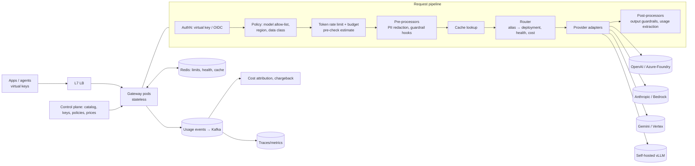

# Design a multi-tenant LLM gateway

!!! abstract "At a glance"
    **Priority:** P0 · **Complexity:** 4/5 · **Est. time:** 3 h · **Phase:** 4 · **Prereqs:** [Framework](framework.md), [Model routing & gateways](../agentic-ai/model-routing-gateways.md), [Rate limiting](../system-design/rate-limiting.md), [Security & multi-tenancy](../system-design/security-authn-authz.md)
    **You're done when:** you can design a gateway that fronts multiple LLM providers for dozens of internal teams — unified API, token-aware rate limits and budgets, routing and fallbacks, caching, PII redaction, streaming, cost attribution and tracing — adding < 20 ms p95 overhead.

## Problem

"Every team at our company calls OpenAI, Anthropic, Gemini, Azure/Foundry and Bedrock directly with their own keys. Design a central LLM gateway: one API, governance, cost control, reliability."

This is the most common Staff-level AI platform question because it mixes classic SD (proxy, rate limiting, multi-tenancy) with LLM specifics (tokens, streaming, provider quirks).

## Clarifying questions

| Question | Why |
|---|---|
| How many teams/apps, total RPS and tokens/min? | Sizing; per-tenant quota design |
| Which providers and self-hosted models? | Adapter layer; API normalisation |
| API shape: OpenAI-compatible, provider-native passthrough, or both? | Feature coverage vs uniformity |
| Governance needs: PII redaction, content filtering, data residency, audit? | Inline processing latency; region routing |
| Budgets: hard caps or soft alerts? Chargeback? | Accounting precision; enforcement point |
| Latency overhead tolerance? | In-path processing choices |
| Also MCP/tool traffic and agent traffic? | Some 2026 gateways also proxy MCP and A2A |

## Requirements

**Functional:** unified chat/embeddings/responses API (OpenAI-compatible + native passthrough); virtual keys per app; model catalog and aliases (`gpt-default`, `fast-small`); routing (by alias, cost, latency, region, tenant policy); fallbacks and retries; token-based rate limits and budgets; prompt/semantic caching; PII redaction and guardrail hooks; streaming passthrough; usage logs and cost attribution; admin UI.

| NFR | Target (assumed) |
|---|---|
| Latency overhead | < 20 ms p95 non-streaming, < 5 ms per streamed chunk |
| Availability | 99.95% (higher than any single provider) |
| Scale | 5k RPS peak, 50M tokens/min aggregate |
| Accuracy of accounting | Token counts reconciled with provider invoices within 1% |
| Security | Provider keys never leave the gateway; tenant isolation; audit of every request |
| Safety | PII redaction policies per tenant; content policy hooks; data residency enforced |

## Estimation

```text
Sanity-check the stated 5k RPS: 5k × (3k in + 400 out) = 17M tokens/s ≈ 1B tokens/min — far beyond
  typical provider quotas, so challenge the number. Realistic enterprise peak: 500 RPS
  → 1.7M tokens/s ≈ 100M TPM → still needs multiple deployments/regions/providers pooled behind the gateway
Gateway compute: proxying is IO-bound; an async proxy (Go/Rust/Envoy, or Python with uvloop) handles
  thousands of concurrent streams per core-set; 500 RPS × 10 s streams = 5k concurrent streams → a few pods
Usage log: 500 RPS × 86,400 = 43M records/day × ~1 KB = 43 GB/day (metadata only; bodies optional & redacted)
Rate-limit state: Redis counters per (tenant, model, window) → trivial size, ~10k ops/s
```

Senior point: the gateway's compute is cheap; the value is in **capacity pooling** (sharing provisioned throughput across teams) and **policy**.

## Architecture



## Component deep dives

### 1. API shape

| Option | Pros | Cons |
|---|---|---|
| OpenAI-compatible only | Every SDK/framework speaks it; easy migration | Lowest-common-denominator; loses provider features (Anthropic cache control, thinking, citations) |
| Native passthrough per provider | Full features | Clients coupled to providers; harder routing |
| **Both**: compatible for portability, passthrough routes for advanced use | Pragmatic | Two surfaces to govern |

Most 2026 gateways (LiteLLM, Envoy AI Gateway, cloud API-management AI gateways, Foundry/Bedrock model routers) take the hybrid approach.

### 2. Token-aware rate limiting & budgets

Requests-per-minute is insufficient; one 100k-token request equals hundreds of small ones.

- **Pre-check**: estimate input tokens (tokenizer or chars/4 heuristic) + `max_tokens`; reserve against the tenant's TPM bucket (token bucket in Redis, Lua for atomicity).
- **Post-adjust**: on completion (or stream end), reconcile actual usage from provider response and refund/charge the difference.
- **Budgets**: $ per tenant per day/month computed from a price table (versioned per model/provider/region, including cached-token and batch prices). Soft limit → alert; hard limit → 429 with clear error or downgrade to cheaper alias.
- **Fairness**: per-tenant limits plus a global cap per upstream deployment; priority classes (interactive > batch) with separate buckets so batch jobs can't starve chat.

### 3. Routing & fallbacks

| Strategy | Use |
|---|---|
| Alias mapping (`fast-small` → current best small model) | Decouple apps from model churn; upgrade centrally with eval evidence |
| Weighted / least-latency across deployments | Spread load across regions/provisioned deployments |
| Cost-aware | Prefer provisioned throughput already paid for, then PAYG |
| Health-based | Circuit breaker on 429/5xx/latency spikes per deployment |
| Fallback chain | Same model other region → equivalent model other provider → smaller model |
| Content-aware (learned router) | Optional; better placed in app or as opt-in alias (`auto`) because quality is app-specific |

Fallback caveats: different providers tokenize and format differently; tool-calling schemas and structured-output support differ; prompts tuned for one model may regress on another — fallbacks must be **eval-certified** per alias. Retries must respect idempotency (no retry after partial stream was delivered to client; or restart stream transparently only before first byte).

### 4. Streaming

Proxy SSE chunk-by-chunk without buffering; parse usage from the final chunk (request `stream_options.include_usage` or provider equivalent); if the client disconnects, cancel upstream to stop cost. Output guardrails on streams operate on windows (see [Chat assistant](chat-assistant.md)).

### 5. Caching

| Cache | Where | Notes |
|---|---|---|
| Provider prompt caching | Upstream | Gateway should *preserve* cache hits: sticky routing of same prefix to same deployment/region; don't mutate prompts (e.g., injecting timestamps) |
| Exact-match response cache | Gateway | Useful for deterministic calls (temperature 0, embeddings, classification); key includes tenant, model, params |
| Semantic cache | Gateway (opt-in) | Only for tenants/intents that accept it; similarity threshold tuned by eval; never across tenants |

### 6. Data protection

- PII detection/redaction (Presidio-class or cloud DLP) before egress for tenants whose data class requires it; reversible tokenisation (`<PERSON_1>`) if the response needs re-insertion.
- Data residency: policy maps data classification + tenant region → allowed deployments (EU data only to EU endpoints).
- Zero-data-retention agreements tracked per provider deployment in the catalog.
- Logging: metadata always; bodies only when tenant opts in, redacted, with retention limits.

### 7. Keys & secrets

Apps get **virtual keys** (scoped to models, budgets, environments) or authenticate via workload identity (OIDC); provider keys live in a secret manager and are rotated without app changes. Managed identities for Azure/AWS providers where possible.

## Evaluation strategy

- The gateway itself isn't "evaluated" like a model, but **alias changes and fallback routes are**: every alias target change runs the consuming apps' eval suites (or a representative gateway-level benchmark per capability: tool calling, JSON validity, extraction, chat quality).
- Shadow traffic: mirror a sample of requests to a candidate model, compare with judges offline (respecting data policies).
- Router evals: if offering `auto` routing, measure quality vs cost curves per workload.
- Guardrail evals: PII redaction precision/recall on labelled samples; false-positive rate matters (over-redaction breaks answers).

## Observability

Per request: tenant, app, alias, resolved deployment, region, tokens in/out/cached, cost, TTFT, total latency, gateway overhead, cache hit, fallback count, status. OTel GenAI attributes (`gen_ai.request.model`, `gen_ai.response.model`, `gen_ai.usage.*`), noting semconv is Development status as of mid-2026. Dashboards: spend by tenant vs budget, 429s by cause (tenant limit vs upstream), provider health, cache hit rates, fallback rates. Monthly reconciliation job compares metered usage to provider invoices.

## Failure modes

| Failure | Mitigation |
|---|---|
| Gateway becomes SPOF | Stateless multi-AZ pods; Redis HA; fail-open vs fail-closed policy per check (e.g., rate limiter fail-open with local limits; PII redaction fail-closed for restricted tenants) |
| Provider outage / 429 storms | Circuit breakers, fallback chains, backoff with jitter, priority shedding |
| Silent quality regression after alias change | Eval-gated alias changes, canary per tenant, easy rollback |
| Cost blow-up from a runaway agent | Per-key budgets, anomaly detection on spend velocity, auto-throttle |
| Accounting drift | Use provider-reported usage, versioned price tables, reconciliation |
| Prompt injection / exfil via gateway | Gateway can host guardrail hooks but can't fix app design; document shared responsibility |
| Latency overhead creep (too many inline processors) | Budget per processor, async where possible, per-tenant opt-in |

## Scaling & cost optimization

- Pool **provisioned throughput** (PTUs/provisioned capacity) across teams; spill to PAYG; schedule batch into off-peak windows and batch APIs.
- Route batch/async traffic to batch endpoints (~50% cheaper at major providers).
- Cache-aware routing keeps prefix cache hits.
- Central aliases let you move entire workloads to cheaper models once evals pass.
- Horizontal scale on concurrent streams; keep in-path code allocation-light (Go/Rust/Envoy for the hot path; Python admin/control plane is fine).

## What a Staff-level answer adds

- **Shared responsibility model**: what the gateway guarantees (keys, quotas, residency, audit) vs what apps own (prompt injection defence, output correctness).
- **Adoption strategy**: make the gateway the easiest path (central billing, higher quotas, instant access to new models), then require it for production.
- **Capacity economics**: provisioned vs PAYG vs self-hosted, with utilisation targets and chargeback.
- **Extending to agents**: MCP gateway/tool proxy and A2A ingress as the same control-plane pattern (policy + identity + audit), e.g., Bedrock AgentCore Gateway or Envoy-based AI gateways.
- **Build vs buy**: LiteLLM/Envoy AI Gateway/cloud API management vs custom; decide on hot-path performance, extensibility, and who operates it.

## Resources

| Resource | Type | Why this one | Level | Cost |
|---|---|---|---|---|
| [LiteLLM docs](https://docs.litellm.ai/) | docs | Reference feature set: virtual keys, budgets, routing, fallbacks | intermediate | free |
| [Envoy AI Gateway](https://aigateway.envoyproxy.io/) :gem: | docs | Kubernetes-native, high-performance data plane design | advanced | free |
| [Gateway API Inference Extension](https://gateway-api-inference-extension.sigs.k8s.io/) :gem: | docs | Model-aware routing to self-hosted pools | advanced | free |
| [Building a Generative AI Platform (Chip Huyen)](https://huyenchip.com/2024/07/25/genai-platform.html) | article | Where the gateway sits among guardrails, caches, routers | intermediate | free |
| [RouteLLM paper](https://arxiv.org/abs/2406.18665) | paper | Evidence and method for learned routing | advanced | free |
| [Prompt caching (Claude docs)](https://docs.claude.com/en/docs/build-with-claude/prompt-caching) | docs | Why gateway must not mutate prefixes | intermediate | free |
| [Microsoft Presidio](https://github.com/microsoft/presidio) | docs | PII detection/anonymisation building block | intermediate | free |
| [Amazon Bedrock AgentCore](https://docs.aws.amazon.com/bedrock-agentcore/) | docs | Managed gateway for tools/agents alongside models | intermediate | paid |

## Follow-up questions

### L2 — Apply

??? question "Q1. Design the token bucket for a tenant with 2M TPM and a 50k-token request arriving with max_tokens=4k."
    ??? success "Answer"
        Bucket capacity 2M tokens, refill ~33.3k tokens/s. On arrival estimate input tokens (50k via tokenizer or heuristic) + max_tokens (4k) = 54k reservation; atomically decrement in Redis (Lua script) if available, else 429 with `Retry-After` computed from refill rate. On completion, actual = 50k in + 900 out → refund 3.1k. For streams, reconcile at stream end; if the client disconnects, charge what was generated. Separate buckets for input and output if the provider limits them separately.

??? question "Q2. A team's p95 latency doubled after onboarding to the gateway. How do you investigate?"
    ??? success "Answer"
        Compare gateway overhead span vs upstream time. Suspects: inline PII redaction on large prompts (NER is slow — use regex-first + sampling, or async), buffering of streams (proxy not flushing), loss of provider prompt-cache hits because routing spreads requests across deployments/regions (add prefix-affinity routing), extra hops across regions (gateway deployed far from provider endpoint), Redis latency on rate-limit checks. Fix the largest, add per-processor latency budgets.

??? question "Q3. Compute a team's monthly chargeback: 800M input (60% cached), 90M output on a model priced (assumed) $3/M in, $0.30/M cached read, $15/M out."
    ??? success "Answer"
        Cached: 480M × $0.30 = $144. Uncached input: 320M × $3 = $960. Output: 90M × $15 = $1,350. Total ≈ **$2,454**. Show the counterfactual without caching (800M × $3 = $2,400 input → $3,750 total) to credit the team's prompt design. Include gateway overhead allocation if chargeback covers platform costs.

??? question "Q4. How do you roll out 'fast-small' alias change from model A to model B?"
    ??? success "Answer"
        Run gateway benchmark + subscribed apps' eval suites against B; publish results. Canary: route 5% of traffic of opted-in tenants to B with online metrics (error rate, JSON validity, latency, cost) and sampled judge comparisons. Staged rollout per tenant; tenants can pin a specific model version to opt out temporarily. Instant rollback via config. Announce deprecation timelines for pinned versions.

### L3 — Design & trade-offs

??? question "Q5. Fail-open or fail-closed when Redis (rate limiting) is down?"
    ??? success "Answer"
        Rate limiting: fail-open with local in-memory approximate limits per pod (limit × 1/N pods) — availability of AI features beats precise quotas for minutes, and upstream providers still enforce their own limits. Budgets: tolerate short inaccuracy, reconcile later. PII redaction and residency policy: fail-closed for restricted tenants because a compliance breach is worse than an outage. Make the choice explicit per check in config.

??? question "Q6. Should content-aware model routing live in the gateway or in applications?"
    ??? success "Answer"
        Mostly applications (or an opt-in `auto` alias). Quality is task-specific — only the app has evals that define "good enough". The gateway provides mechanisms (aliases, health/cost routing, fallbacks, telemetry, a router service apps can call). Offering an `auto` alias is fine for generic chat workloads with its own evals, but forcing it globally causes silent regressions for specialised tasks like extraction.

??? question "Q7. Semantic caching at the gateway — yes or no?"
    ??? success "Answer"
        Opt-in only. Enterprise traffic has low exact repetition and personalised/permissioned contexts, so hit rates are low and false hits are dangerous (wrong or leaked answers). Where it works: FAQ-like public content, classification of repeated inputs, embeddings. Requirements: tenant-scoped keys, include system prompt/model/params in key, similarity threshold chosen via eval of false-hit rate, TTL tied to content freshness. Prompt caching (upstream) is the bigger, safer win.

??? question "Q8. Build on LiteLLM, adopt Envoy AI Gateway, use cloud API management, or build custom?"
    ??? success "Answer"
        Criteria: hot-path performance and overhead, provider coverage, extensibility (custom processors), multi-cloud, operational ownership, security review, cost. LiteLLM: fastest to adopt, rich features, Python hot path (fine for moderate RPS). Envoy AI Gateway: high-performance, Kubernetes-native, good for self-hosted pools with inference extension; more ops. Cloud API management AI gateways: best if single-cloud and already standard. Custom: only if requirements are unique at scale. A common answer: start with LiteLLM or cloud-native, keep the API OpenAI-compatible and config portable, revisit at scale.

### L4 — Staff-level ambiguity

??? question "Q9. Finance wants hard monthly budgets per team; product teams fear outages when budgets run out. Resolve."
    ??? success "Answer"
        Tiered policy: soft alerts at 50/80/100%; at 100% interactive production traffic degrades to a cheaper alias rather than failing, while batch/dev traffic hard-stops; a documented emergency override with approver. Monthly budget reviews with forecasting from trends. This aligns incentives (teams see cost) without customer-facing outages, and Finance gets predictability. Put it in an ADR signed by both.

??? question "Q10. A regulator requires that EU customer data never leaves the EU, including LLM processing. What gateway changes?"
    ??? success "Answer"
        Data classification on requests (tenant/app declares, or detected), policy mapping classification → allowed regional deployments; EU-only deployments in the catalog (Foundry/Bedrock regional endpoints with data-zone guarantees, EU self-hosted pools); fallback chains restricted to EU; logs stored in EU; audit evidence per request (deployment region). Contractual verification of provider data processing and retention. Tests in CI that attempt cross-region routing for EU-classified traffic.

??? question "Q11. The gateway team is 3 people and 40 teams want features. How do you prioritise and scale the team's impact?"
    ??? success "Answer"
        Define the gateway's charter narrowly (identity, quotas, routing, telemetry, compliance). Make it extensible (plugin/processor interface, self-service config) so teams contribute rather than request. Prioritise by risk and spend concentration (top 5 teams = most spend). Publish a roadmap and SLOs, run office hours, and push app-specific concerns (prompt management, evals) to the platform's other components or to teams themselves.

## Real-world use cases

- **Enterprise AI platform at a logistics group**: one gateway for 40 teams, pooled provisioned throughput on Foundry and Bedrock, EU/US residency routing.
- **SaaS vendor embedding LLM features**: per-customer budgets and cost attribution feeding pricing decisions.
- **Agent platform backbone**: gateway enforces per-run budgets and model aliases for all agents (see [Agent platform](agent-platform.md)).
- **Regulated bank**: fail-closed PII redaction, full audit, self-hosted models for highest data classes.

## Checklist

- [ ] I can draw the request pipeline and explain each processor's latency cost
- [ ] I can design token-aware rate limits with pre-reservation and reconciliation
- [ ] I can explain fallback chains and why they need eval certification
- [ ] I can argue fail-open vs fail-closed per policy
- [ ] I can compute chargeback including cached tokens
- [ ] I answered all L3/L4 questions out loud in < 3 min each
