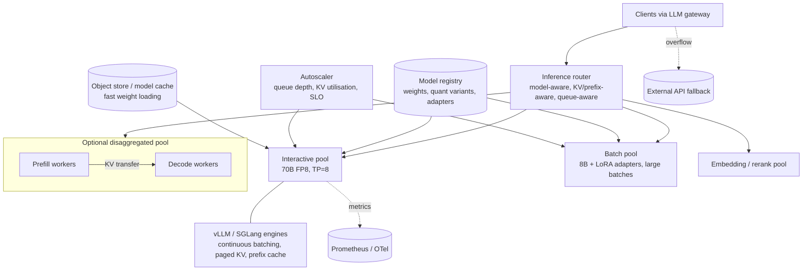

# Design an LLM inference/serving platform

!!! abstract "At a glance"
    **Priority:** P1 · **Complexity:** 5/5 · **Est. time:** 4 h · **Phase:** 5 · **Prereqs:** [Framework](framework.md), [Inference serving](../agentic-ai/inference-serving.md), [LLM fundamentals](../agentic-ai/llm-fundamentals.md), [Capacity & cost planning](capacity-cost-planning.md), [Load balancing](../system-design/load-balancing.md)
    **You're done when:** you can design a self-hosted multi-model serving platform on GPUs — explaining prefill vs decode, KV cache memory math, continuous batching, prefix caching, quantisation, parallelism, disaggregated serving, KV-aware routing, autoscaling and multi-LoRA — and size GPUs for a stated token throughput and latency SLO.

## Problem

"We want to self-host open-weight LLMs (8B–70B+ class, plus embedding and reranker models) for internal teams because of data residency and cost. Design the inference platform."

Logistics context: document extraction (bills of lading, customs declarations) runs at high steady volume — a good fit for a fine-tuned 8B model with LoRA adapters per document family — while interactive assistants need low TTFT.

## Clarifying questions

| Question | Why |
|---|---|
| Which models and sizes; how many fine-tuned variants (LoRA)? | Memory planning, multi-LoRA serving |
| Workload mix: interactive chat vs batch extraction vs embeddings? | Separate pools, SLOs, batching policy |
| SLOs: TTFT, TPOT (inter-token latency), throughput? | Batch sizes, parallelism, disaggregation |
| Traffic shape: steady vs spiky; peak/avg ratio? | Autoscaling and utilisation → economics |
| Hardware: which GPUs available (H100/H200/B200/MI300-class), on-prem or cloud? | Memory per GPU, interconnect |
| Context lengths? | KV cache size dominates memory |
| Multi-tenancy and isolation requirements? | Shared vs dedicated pools, quotas |

## Requirements

**Functional:** OpenAI-compatible endpoints (chat, completions, embeddings, rerank); model registry and deployment (versions, quantisation variants, LoRA adapters); routing; autoscaling; quotas per tenant; batch API; streaming; structured output/constrained decoding; metrics and tracing.

| NFR | Target (assumed) |
|---|---|
| Latency (interactive pool) | TTFT p95 < 800 ms for ≤ 4k-token prompts; TPOT p95 < 50 ms (≥ 20 tok/s per stream) |
| Throughput (batch pool) | Max tokens/s per GPU; job completion within 4 h window |
| Utilisation | > 60% average GPU utilisation (economics) |
| Availability | 99.9% interactive; graceful overflow to API provider via gateway |
| Quality | Quantised/fine-tuned variants must pass eval parity with baseline (≤ 1 pt drop on key metrics) |
| Cost | Cost per M tokens below equivalent API price at expected utilisation |

## Estimation

**KV cache math (the number to know):**

```text
KV bytes per token = 2 (K and V) × layers × kv_heads × head_dim × bytes_per_elem
Example 70B-class with GQA: 80 layers, 8 KV heads, head_dim 128, FP16 (2 bytes)
  = 2 × 80 × 8 × 128 × 2 = 327,680 B ≈ 0.31 MB per token
8k-token sequence → ~2.5 GB of KV cache per concurrent sequence
Weights: 70B × 2 bytes (FP16) = 140 GB; FP8 = 70 GB; INT4 ≈ 35–40 GB

On 8 × 80 GB GPUs (640 GB) with FP8 weights (70 GB) and runtime overhead (~10%):
  ~500 GB for KV → ~200 concurrent 8k sequences (FP16 KV), ~400 with FP8 KV cache
Example 8B-class (32 layers, 8 KV heads, 128 dim, FP16): 2×32×8×128×2 = 131 KB/token
  → 8k seq ≈ 1 GB; on one 80 GB GPU with 16 GB weights → ~55 concurrent 8k seqs
```

**Throughput and GPUs:**

```text
Decode is memory-bandwidth-bound: each step reads all weights once for the whole batch.
Single-stream upper bound ≈ HBM bandwidth / weight bytes:
  8B FP16 (16 GB) on ~3.3 TB/s HBM → ~200 tok/s per stream at batch 1
Batching amortises weight reads: aggregate throughput scales near-linearly with batch until compute-bound
  or KV memory runs out → thousands of tok/s per GPU for 8B-class under load (benchmark to confirm!)

Target: interactive peak 400 concurrent streams × 25 tok/s = 10k output tok/s on 70B-class
  Suppose benchmark shows one 8-GPU FP8 node sustains ~3k output tok/s at TPOT < 50 ms
  → 4 nodes at peak + 1 N+1 spare = 5 nodes (40 GPUs)
Cost: 40 GPUs × assumed $3/GPU-h × 730 h ≈ $88k/month
  Tokens served (at 50% avg utilisation): 10k × 0.5 × 2.6M s/month ≈ 13B output tokens
  → ~$6.7/M output tokens (+ input prefill cost, which is cheaper per token) → compare with API pricing
```

Say explicitly: **these are order-of-magnitude estimates; the real sizing comes from load-testing the exact model, engine version, quantisation and prompt length distribution.**

## Architecture



## Component deep dives

### 1. Engines

| Engine | Strengths | Notes |
|---|---|---|
| **vLLM** | PagedAttention, continuous batching, automatic prefix caching, broad model/hardware support, multi-LoRA, OpenAI-compatible server | Default choice for most platforms |
| **SGLang** | RadixAttention prefix sharing, fast structured generation, strong for agentic/multi-call workloads | Excellent when prompts share long prefixes |
| TensorRT-LLM / NVIDIA Dynamo | Peak NVIDIA performance, disaggregated serving orchestration | More build complexity |
| Ollama / llama.cpp | Local/dev, edge, CPU/Apple silicon | Not for multi-tenant production scale |
| Hugging Face TGI | Historically common | Check current maintenance status before choosing |

### 2. Core mechanisms (explain in interviews)

- **Prefill vs decode**: prefill processes the prompt in parallel (compute-bound; drives TTFT); decode generates one token per step per sequence (memory-bandwidth-bound; drives TPOT). Mixing them causes interference — long prefills stall decodes.
- **Continuous (in-flight) batching**: sequences join/leave the batch every step instead of waiting for the whole batch — huge utilisation gain.
- **PagedAttention**: KV cache in fixed-size blocks, eliminating fragmentation, enabling sharing (vLLM paper).
- **Chunked prefill** (Sarathi-Serve): split long prefills into chunks interleaved with decodes to bound TPOT.
- **Prefix caching**: reuse KV for shared prefixes (system prompts, few-shot, documents) — cuts TTFT and compute for RAG/agents.
- **Speculative decoding**: small draft model (or n-gram/EAGLE-style heads) proposes tokens verified by the big model in one pass — lowers latency at low batch sizes; gains shrink at high load.
- **Quantisation**: FP8 weights (near-lossless on modern GPUs), INT4 AWQ/GPTQ (memory savings, some quality loss), FP8 KV cache (doubles concurrency). Always eval.

### 3. Parallelism

| Type | What | When |
|---|---|---|
| Tensor parallel (TP) | Split each layer across GPUs in a node | Model doesn't fit one GPU; needs fast NVLink |
| Pipeline parallel (PP) | Split layers across nodes | Very large models across nodes; adds bubbles |
| Data parallel (replicas) | Multiple copies | Scale throughput; simplest |
| Expert parallel (EP) | Spread MoE experts | MoE models (many 2025–26 open models are MoE) |

Rule of thumb: smallest TP that fits weights + adequate KV; scale out with replicas.

### 4. Disaggregated prefill/decode

Run prefill and decode on separate GPU pools and transfer KV (DistServe, and production stacks like llm-d / NVIDIA Dynamo). Benefits: tune each pool independently for TTFT vs TPOT, eliminate interference, better goodput under SLOs. Costs: KV transfer bandwidth (needs fast interconnect), orchestration complexity. Worth it at large scale with long prompts (RAG, agents); overkill for small fleets.

### 5. Routing

Round-robin is wrong for LLMs. The router should consider: which replica already has the prefix in KV cache (cache affinity), queue depth and KV utilisation per replica, LoRA adapter loaded, and request priority. Kubernetes Gateway API Inference Extension and llm-d implement model-aware and KV-cache-aware routing on K8s.

### 6. Multi-LoRA

Serve one base model with many adapters (per document family, per tenant) loaded dynamically; batch requests across adapters (vLLM supports multi-LoRA). Dramatically better utilisation than one deployment per fine-tune. Limits: adapter count in GPU memory, rank sizes, cold-load latency.

### 7. Autoscaling and cold starts

- Scale signals: queue depth, pending requests, KV cache utilisation, TTFT SLO burn — not CPU/GPU utilisation alone.
- Cold start = node provisioning (minutes) + weight load (70–140 GB) + engine warmup/graph capture. Mitigations: warm spare capacity, local NVMe model cache, fast streaming loaders, pre-pulled images, snapshotting.
- Overflow: gateway routes excess to external APIs (if data policy allows) rather than violating SLOs; batch pool absorbs slack during off-peak (run batch jobs when interactive load is low → utilisation up).

## Evaluation strategy

- **Performance benchmarks**: load tests with production-like prompt/output length distributions; measure TTFT, TPOT, throughput, goodput (requests meeting SLO) vs concurrency; track per engine version.
- **Quality parity**: every quantised variant, engine upgrade and speculative decoding config runs the consuming apps' evals (engine/kernel changes have caused real quality bugs — see Anthropic's September 2025 postmortem on infrastructure issues affecting output quality).
- **Numerical canaries**: fixed prompts with greedy decoding compared across deployments to catch silent corruption.
- **Online**: error rates, truncations, JSON validity rates per deployment.

## Observability

Engine metrics (vLLM/SGLang expose Prometheus): running/waiting requests, KV cache usage %, prefix-cache hit rate, TTFT/TPOT histograms, tokens/s, preemptions. GPU metrics (DCGM): utilisation, memory, SM occupancy, power, XID errors. Traces from gateway → router → engine with OTel GenAI attributes. SLO dashboards per pool; cost per M tokens per model computed from GPU-hours and tokens served.

## Failure modes

| Failure | Mitigation |
|---|---|
| KV cache exhaustion → preemptions, latency spikes | Admission control, max concurrent seqs, FP8 KV, route by KV utilisation, cap context length per tier |
| Long prompts starving decodes | Chunked prefill, separate pools or disaggregation |
| GPU hardware faults (XID errors, ECC) | Health checks, automatic node drain, N+1 capacity |
| Silent quality regression from quantisation/engine upgrade | Eval parity gates, numerical canaries, staged rollout |
| Cold-start storms on scale-up | Warm pool, model caches, predictive scaling |
| Noisy tenant saturating shared pool | Per-tenant token quotas at gateway, priority queues, dedicated pools for critical tenants |
| Low utilisation → economics worse than APIs | Consolidate models, multi-LoRA, fill with batch work, right-size |

## Scaling & cost optimization

- Maximise goodput: continuous batching, prefix caching, chunked prefill, speculative decoding at low load.
- Right-size models: distil/fine-tune 8B-class for narrow tasks instead of serving 70B+.
- FP8 everywhere it passes evals; FP8 KV for concurrency.
- Mix workloads: interactive by day, batch backfill by night; spot/preemptible GPUs for batch.
- Provisioned API capacity as overflow instead of over-provisioning GPUs for rare peaks.

## What a Staff-level answer adds

- **Economic model**: break-even utilisation vs API prices, including team cost (on-call, upgrades) — self-hosting is a capability investment, not a default.
- **Portfolio view**: which workloads self-host (high-volume narrow tasks, residency-bound data) vs stay on APIs (frontier-quality needs).
- **Upgrade cadence**: open models change quarterly; a model onboarding pipeline (download → quantise → benchmark → eval → canary) is the real product.
- **Hardware strategy**: reserved vs on-demand vs on-prem; GPU generation mix; supply risk.
- **Interfaces**: OpenAI-compatible API behind the same gateway so apps don't know whether a model is self-hosted.

## Resources

| Resource | Type | Why this one | Level | Cost |
|---|---|---|---|---|
| [Efficient Memory Management … PagedAttention (vLLM paper)](https://arxiv.org/abs/2309.06180) | paper | The foundational KV-cache idea | advanced | free |
| [Transformer Inference Arithmetic (kipply)](https://kipp.ly/p/transformer-inference-arithmetic) :gem: | article | Best first-principles memory/latency math | advanced | free |
| [How to Scale Your Model (JAX scaling book)](https://jax-ml.github.io/scaling-book/) :gem: | book | Rigorous roofline and parallelism reasoning | advanced | free |
| [Mastering LLM Techniques: Inference Optimization (NVIDIA)](https://developer.nvidia.com/blog/mastering-llm-techniques-inference-optimization/) | article | Clear overview of batching, KV, parallelism, quantisation | intermediate | free |
| [LLM Inference Performance Engineering (Databricks)](https://www.databricks.com/blog/llm-inference-performance-engineering-best-practices) :gem: | article | TTFT/TPOT metrics and hardware trade-offs with numbers | intermediate | free |
| [vLLM docs](https://docs.vllm.ai/) | docs | Engine features: prefix caching, multi-LoRA, quantisation | intermediate | free |
| [SGLang docs](https://docs.sglang.ai/) | docs | RadixAttention and structured generation | intermediate | free |
| [DistServe paper](https://arxiv.org/abs/2401.09670) | paper | Disaggregated prefill/decode and goodput | advanced | free |
| [Sarathi-Serve paper](https://arxiv.org/abs/2403.02310) | paper | Chunked prefill for throughput-latency trade-off | advanced | free |
| [llm-d](https://llm-d.ai/) | docs | K8s-native distributed inference with KV-aware routing | advanced | free |

## Follow-up questions

### L2 — Apply

??? question "Q1. Compute KV cache per token for a model with 32 layers, 8 KV heads, head_dim 128, FP16. How many 32k-token sequences fit in 40 GB of free GPU memory?"
    ??? success "Answer"
        2 × 32 × 8 × 128 × 2 B = 131,072 B = 128 KB/token. 32k tokens → 4 GB per sequence. 40 GB / 4 GB = **10 concurrent 32k sequences** (FP16 KV); ~20 with FP8 KV. This is why long-context tiers need separate pools and quotas.

??? question "Q2. TTFT is fine but TPOT spikes whenever long RAG prompts arrive. Why and what do you change?"
    ??? success "Answer"
        Long prefills monopolise GPU compute in the same iteration as decodes, stalling in-flight streams (prefill-decode interference). Fix: enable chunked prefill with a token budget per step; prefix caching for shared document context; route long-prompt requests to a dedicated pool; at larger scale, disaggregate prefill and decode.

??? question "Q3. Estimate batch time: 2M bills of lading/month, ~3k input + 500 output tokens each, on an 8B model where a GPU sustains an assumed 2,500 output tok/s and 20k prefill tok/s."
    ??? success "Answer"
        Output: 2M × 500 = 1B tokens / 2,500 = 400k GPU-s ≈ 111 GPU-hours. Prefill: 6B tokens / 20k = 300k GPU-s ≈ 83 GPU-hours. Total ≈ 195 GPU-hours/month (prefill and decode overlap partially, so this is conservative) → ~$600/month at $3/GPU-h, vs API costs of thousands. Batch jobs can run on off-peak or spot capacity. Validate with a benchmark on real documents.

??? question "Q4. Which autoscaling signal would you use for the interactive pool and why not GPU utilisation?"
    ??? success "Answer"
        Queue depth/waiting requests and KV cache utilisation, plus TTFT SLO burn rate. GPU "utilisation" (from nvidia-smi) reports kernel activity, not headroom — a memory-bound decode workload can show high utilisation while serving well, or low while queue grows due to KV limits. Scale out ahead via predictive schedules because cold starts take minutes.

### L3 — Design & trade-offs

??? question "Q5. One 70B model for everything vs a fleet of fine-tuned 8B models with LoRA?"
    ??? success "Answer"
        For narrow, high-volume tasks (extraction, classification, routing), fine-tuned 8B + multi-LoRA usually matches quality at ~5–10× lower cost and latency; one base deployment serves many adapters. For open-ended reasoning and chat, the larger model (or an API frontier model) wins. Decide per workload by evals; the platform should support both, with the gateway routing by alias.

??? question "Q6. When is disaggregated prefill/decode worth the complexity?"
    ??? success "Answer"
        When prompts are long relative to outputs (RAG, agents, document processing), fleets are large (dozens+ of GPUs), strict TTFT and TPOT SLOs conflict, and you have fast interconnect for KV transfer. For small fleets or short prompts, chunked prefill + prefix caching gets most of the benefit. Measure goodput under SLO before and after.

??? question "Q7. INT4 quantisation halves your GPU count. The product team is excited. What do you require?"
    ??? success "Answer"
        Eval parity on each consuming workload's golden sets (with attention to structured output validity, multilingual, numeric accuracy — often where INT4 degrades), long-context tests, and a canary with online metrics. Consider FP8 first (near-lossless on supported GPUs). Keep FP16/FP8 variant available for workloads that fail parity. Document the decision per workload.

??? question "Q8. Self-host vs API for an internal assistant with spiky daytime traffic (peak/avg 6×)?"
    ??? success "Answer"
        Spiky traffic kills self-hosting economics: you'd provision for peak and sit idle most of the day (low utilisation). Better: API (or provisioned API capacity) for interactive peaks, and self-hosted capacity sized near baseline with batch backfill off-peak. Or keep self-hosting only if residency requires it and accept the cost, using overflow to in-region managed endpoints.

### L4 — Staff-level ambiguity

??? question "Q9. Leadership asks: 'Should we build our own GPU inference platform?' How do you answer?"
    ??? success "Answer"
        Frame as a portfolio decision with numbers: current and projected API spend by workload, data residency constraints, quality needs, traffic shape. Build a TCO model: GPUs (reserved), engineering team (e.g., 4–6 engineers), on-call, model onboarding pipeline, versus API costs with provisioned throughput discounts. Recommend a staged path: start with managed open-model endpoints (Foundry/Bedrock) for residency-bound workloads, self-host one high-volume narrow workload to build capability, and expand only when utilisation and savings are proven. Define exit criteria.

??? question "Q10. An engine upgrade improved throughput 30% but a downstream team reports subtle extraction errors. Handle it."
    ??? success "Answer"
        Roll back affected pools (keep the upgrade where evals pass). Reproduce with numerical canaries and the team's eval set; bisect config differences (kernel, sampling defaults, tokenizer, quantisation path). Add the failing cases to the platform's upgrade gate; require consuming teams' eval suites to be runnable by the platform. Communicate a clear upgrade policy: staged, eval-gated, with a pinned-version option.

??? question "Q11. Five teams each want dedicated GPU nodes 'for isolation'. Utilisation is 25%. What do you propose?"
    ??? success "Answer"
        Shared pools with strong multi-tenancy: per-tenant token quotas and priority at the gateway/router, multi-LoRA for team-specific fine-tunes, SLO-based scheduling, and reserved capacity guarantees (minimum share) rather than dedicated hardware. Dedicated only for hard compliance needs. Show the cost of 25% utilisation, offer SLO commitments in writing, and charge back by usage to align incentives.

## Real-world use cases

- **Document extraction at a carrier**: fine-tuned 8B + LoRA per document family, batch pool at night, residency-compliant.
- **Internal coding assistant autocomplete**: small model, extreme TTFT requirements, speculative decoding, prefix caching.
- **Embedding/rerank service for enterprise RAG**: GPU pool for rerankers, batching of queries, high QPS.
- **Sovereign AI deployments**: on-prem serving for regulated data with API overflow disabled.

## Checklist

- [ ] I can compute KV cache per token and concurrency for a given GPU budget
- [ ] I can explain prefill vs decode, continuous batching, prefix caching, chunked prefill, speculative decoding
- [ ] I can choose TP/PP/replicas and explain disaggregation trade-offs
- [ ] I can design autoscaling signals and cold-start mitigations
- [ ] I can build a self-host vs API break-even argument
- [ ] I answered all L3/L4 questions out loud in < 3 min each
