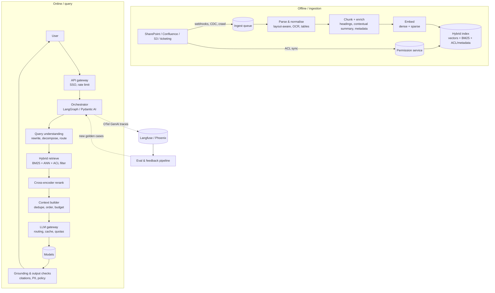

# Design an enterprise RAG system

!!! abstract "At a glance"
    **Priority:** P0 · **Complexity:** 4/5 · **Est. time:** 4 h · **Phase:** 2 · **Prereqs:** [Framework](framework.md), [RAG fundamentals](../agentic-ai/rag-fundamentals.md), [Hybrid search & reranking](../agentic-ai/hybrid-search-reranking.md), [Vector databases](../agentic-ai/vector-databases.md)
    **You're done when:** you can design, in 45 minutes, a permission-aware hybrid RAG system over 10M+ documents with an ingestion pipeline, reranking, citation-grounded generation, a retrieval + generation eval plan, and a cost estimate — and defend when *not* to use agentic RAG or GraphRAG.

## Problem

"Design a question-answering assistant over our company's internal knowledge: policies, SOPs, contracts, Confluence/SharePoint, tickets. 40k employees. Answers must cite sources and respect document permissions."

Logistics flavour: a global carrier's ops, customer-service and commercial staff need answers from 3M documents — tariff rules, customs SOPs per country, contract clauses, incident postmortems — in 12 languages.

## Clarifying questions

| Question | Why it changes the design |
|---|---|
| Corpus size, formats, growth rate? | Index size, ingestion throughput, parsing strategy (PDF tables, scans) |
| Permission model? (SharePoint ACLs, groups, per-country) | ACL propagation into the index; filter-at-query design |
| Freshness SLA? (minutes for tickets, days for policies) | CDC/webhooks vs nightly batch |
| Question types? (lookup, comparison, multi-hop, "summarise all incidents in Q2") | Plain RAG vs query decomposition vs agentic/aggregation paths |
| Languages? | Multilingual embeddings, BM25 analyzers per language |
| Required answer form? Citations, confidence, "I don't know"? | Grounding checks, abstention policy |
| Interactive or also API for other agents? | Expose retrieval as an MCP server / tool |
| Data residency and model restrictions? | Region-pinned models (Foundry/Bedrock), self-hosted embeddings |

## Requirements

**Functional:** natural-language Q&A with inline citations to passages; multi-turn follow-ups; filters (country, doc type, date); feedback (thumbs, "wrong source"); admin re-index; retrieval API for other agents.

| NFR | Target (assumed) |
|---|---|
| Quality | Answer correctness ≥ 90% on golden set; citation precision ≥ 95% (cited passage supports claim); abstain when unsupported; Recall@20 ≥ 90% on retrieval set |
| Latency | TTFT p95 < 1.5 s; full answer p95 < 8 s |
| Cost | < $0.02 per question all-in; < $25k/month |
| Safety | Zero cross-permission leakage; injection-resistant to poisoned docs; PII redaction in logs; audit trail |
| Freshness | Permission changes effective < 15 min; content < 1 h (tickets) / 24 h (policies) |
| Availability | 99.9% for retrieval; degrade to "search results only" if LLM unavailable |

## Estimation

```text
Corpus: 3M docs × avg 8 pages × ~600 tokens/page ≈ 14.4B tokens
Chunks: 512-token chunks with ~10% overlap → ~31M chunks
Embeddings: 1024-dim float32 = 4 KB/vector → ~125 GB raw
  int8 quantisation → ~31 GB; binary + rescoring → ~4 GB (HNSW graph overhead +30–50%)
Initial embedding cost: 14.4B tokens × assumed $0.02–0.10/M → ~$300–$1,500 one-off (API);
  self-hosted embedder on 1–2 GPUs: ~days of throughput, trivial $.
Daily delta: 1% churn → 144M tokens/day to re-embed: cheap.

Query load: 40k users × 30% DAU × 6 questions = 72k questions/day ≈ 0.8 QPS avg, ~5 QPS peak
Per question: system 1.5k + history 1k + 8 chunks × 500 = ~6.5k input tokens, 400 output tokens
Monthly: 2.2M questions × 6.5k = 14B input + 0.9B output
  at assumed $3/M in, $15/M out → $42k + $13k = $55k → OVER budget
Levers: prompt caching of static prefix (~1.5k), route 60% to small model, 5 chunks not 8
  → ~ $18–22k/month
```

Takeaway to say out loud: **retrieval infra is cheap; generation tokens dominate cost**, and the number of chunks you stuff is the main lever.

## Architecture



## Component deep dives

### 1. Ingestion & parsing

Parsing quality caps RAG quality. Tables in tariff PDFs, multi-column contracts and scanned customs forms are where naive text extraction silently destroys meaning.

| Option | Good at | Weak at |
|---|---|---|
| Plain text extraction (pypdf) | Speed, cost | Tables, columns, scans |
| Layout-aware open source (Docling, Marker) | Tables → Markdown, reading order; self-hostable | Heavy docs, handwriting |
| Cloud document AI (Azure Document Intelligence / Content Understanding, AWS Textract) | Scans, forms, key-value pairs | Cost per page, residency |
| Multimodal LLM parsing | Complex visual layouts, charts | Cost, latency, hallucinated cells |

Pattern: route by document type — cheap path for born-digital, layout/OCR for scans, LLM only for low-confidence pages. Store the **parsed canonical form** (Markdown + page/bbox references) so you can re-chunk without re-parsing.

### 2. Chunking & enrichment

| Strategy | When |
|---|---|
| Fixed tokens (400–800) + overlap | Baseline; homogeneous prose |
| Structure-aware (by heading/section/clause) | Policies, contracts, SOPs — preserves semantic units |
| Parent-child ("small-to-big") | Retrieve small precise chunks, pass the parent section to the LLM |
| Contextual chunk headers | Prepend doc title + section path + short LLM-generated context to each chunk before embedding (Anthropic's "contextual retrieval" reported large failure-rate reductions combined with BM25 + rerank) |
| Late chunking / multi-vector (ColBERT-style) | High-precision domains where budget allows larger indexes |

Metadata per chunk: `doc_id, version, source, language, country, doc_type, effective_date, acl_principals[], page, section_path`. The `effective_date` matters for policies: "which customs rule applied on 3 March?"

### 3. Retrieval strategy

Default in 2026: **hybrid (BM25 + dense + metadata filters) → fuse (RRF) → cross-encoder rerank → top 5–8 to the model.**

| Approach | Strength | Weakness | Use |
|---|---|---|---|
| BM25 only | Exact terms, codes (HS codes, container IDs, clause numbers), cheap | Synonyms, paraphrase, cross-lingual | Never alone for NL questions |
| Dense only | Semantic match, multilingual | Exact identifiers, rare terms, negation | Never alone for enterprise corpora |
| **Hybrid + RRF** | Robust across query types | Two indexes to maintain | **Default** |
| + Cross-encoder rerank | Big precision gain on top-k | +50–200 ms, GPU/API cost | Default for interactive |
| Query rewriting / HyDE / multi-query | Vague or conversational queries | Extra LLM call latency | Route only when needed |
| Agentic RAG (LLM plans iterative retrieval) | Multi-hop, comparison questions | 3–10× cost and latency; not always better (see arXiv 2601.07711) | Behind a router for complex intents |
| GraphRAG / LazyGraphRAG | Global "summarise themes across corpus" questions, entity relationships | Index build cost (GraphRAG), complexity | Specific question classes only |

**Permission filtering**: pre-filter (ACL principals in the index, filter during ANN) beats post-filter (retrieve then drop) — post-filtering starves results for users with narrow access and leaks via timing/counts. Watch for HNSW recall collapse under highly selective filters; Qdrant/pgvector (with iterative scans in pgvector ≥ 0.8) and most engines have filtered-search strategies, but test recall per permission profile.

### 4. Vector store choice

| Option | Choose when |
|---|---|
| pgvector in existing Postgres | < ~50–100M vectors, team knows Postgres, want transactional metadata + ACL joins |
| Qdrant / Weaviate / Milvus | Larger scale, rich filtering, quantisation, multi-tenancy features |
| Elasticsearch / OpenSearch / Vespa | Strong BM25 + vectors in one engine; existing search team |
| Managed (Azure AI Search, Bedrock Knowledge Bases, Pinecone) | Speed to market, compliance posture, less ops |

Senior answer: "The index is a derived, rebuildable artifact. I pick the engine my team can operate, and I keep the canonical parsed corpus separately so I can migrate or re-embed."

### 5. Generation & grounding

- Prompt structure: static system prompt + tool/format spec (cacheable prefix) → retrieved passages with IDs → conversation summary → question.
- Require **inline citations by passage ID**; post-validate that every cited ID was retrieved and (sampled) that the passage supports the claim.
- **Abstention**: if top rerank score < threshold or no passage supports the answer, say so and show search results.
- Order passages by relevance with the best at the start and end (mitigates "lost in the middle").
- Conflicting sources: prefer newest `effective_date` and surface the conflict explicitly.

### 6. Caching

| Cache | Hit profile | Risk |
|---|---|---|
| Provider prompt cache (static prefix) | Very high | None — pure win; order prompt accordingly |
| Retrieval result cache (normalised query + ACL hash) | Moderate | Staleness; must key on permissions |
| Semantic answer cache | Low–moderate in enterprise Q&A | Wrong answer for subtly different question; permission leakage if key omits ACL. Use only for FAQ-like intents with high similarity threshold |
| Embedding cache | High for repeated queries | Minimal |

### 7. Guardrails

- Treat retrieved documents as **untrusted input**: anyone who can edit a wiki page can inject instructions. Delimit passages, instruct the model that passages are data, run injection classifiers on ingestion *and* retrieval, and — most importantly — give the RAG assistant **no side-effecting tools**, so an injection can at most corrupt an answer.
- PII/secret scanning at ingestion (Presidio-class) with policy: redact, restrict ACL, or exclude.
- Output checks: citation validity, PII, policy phrases (e.g., no legal advice beyond the contract text).

## Evaluation strategy

**Split retrieval and generation evals** — you can't fix what you can't localise.

| Layer | Metric | How |
|---|---|---|
| Retrieval | Recall@k, MRR/nDCG on a labelled query→relevant-chunk set | Build 300–500 queries from real search logs + SME labels; synthetic queries generated per chunk for coverage |
| Reranker | Precision@5 lift vs no rerank | Same set |
| Generation | Correctness (vs reference answer), faithfulness/groundedness, citation precision, abstention correctness | Code checks for citation validity; LLM-judge calibrated against ~100 human labels (report TPR/TNR) |
| Permissions | Leakage rate = 0 | Synthetic users with known ACLs query for docs they can't see |
| Adversarial | Injection success rate | Poisoned docs in a test index; promptfoo red-team presets |
| End-to-end online | Thumbs, "wrong source" clicks, reformulation rate, escalations | Dashboards per intent/country/language |

**Error analysis loop**: weekly, sample 100 traces (stratified; oversample thumbs-down), open-code failures, cluster: *parsing error*, *chunk boundary split the answer*, *retrieval miss (lexical)*, *retrieval miss (semantic)*, *rerank dropped it*, *model ignored context*, *stale doc*, *question out of scope*. Fix the top bucket, add cases to the golden set. Tools: Ragas/DeepEval metrics as a starting point, but custom, domain-specific judges usually win.

## Observability

Emit OTel GenAI spans: `retrieve` (query, k, filter, latency, top scores, chunk IDs), `rerank`, `chat` (model, `gen_ai.usage.input_tokens` / `output_tokens`, cached tokens, finish reason). Pin the semconv version — GenAI conventions are still Development status as of mid-2026. Dashboards: TTFT/total latency p50/p95 per stage, tokens/question, cost/question by tenant, abstention rate, zero-result rate, index freshness lag, ACL sync lag. Store full traces (with PII redaction) to replay any answer: prompt version + model version + index snapshot ID.

## Failure modes

| Failure | Symptom | Mitigation |
|---|---|---|
| Hallucination despite context | Confident answer, citation doesn't support | Grounding check, abstention threshold, judge sampling, stronger "answer only from passages" + structured citations |
| Retrieval miss on identifiers | "No info" for "clause 14.3" or HS code | BM25 leg, identifier-aware tokenisation, query router detecting codes |
| Permission leak | User sees snippet from restricted doc | Pre-filter by ACL, ACL-keyed caches, leakage tests in CI, ACL sync SLO |
| Indirect prompt injection | Answer includes attacker text / phishing link | No tools, link allow-listing in output, injection classifiers, source trust tiers |
| Stale / conflicting docs | Outdated policy cited | Versioning, `effective_date` filters, dedupe near-duplicates, freshness monitor |
| Runaway cost | Long histories, huge chunks | Context budget enforcement, conversation summarisation, per-user quotas |
| Embedding model change | Silent quality shift | Versioned indexes, dual-write, eval-gated cutover |

## Scaling & cost optimization

- Generation dominates: reduce chunks (better rerank → fewer, better passages), prompt caching, model routing (small model for lookups; frontier for synthesis/multi-hop), output length caps.
- Index: int8/binary quantisation with rescoring; tiered storage (hot recent docs in memory, cold on disk-based ANN); shard by tenant/region for residency.
- Ingestion: event-driven incremental updates; content hashing to skip unchanged chunks; batch embedding APIs.
- Multi-region: index replicas per region; data-residency-pinned corpora stay in-region with region-pinned models.

## What a Staff-level answer adds

- **Retrieval as a platform**: expose retrieval as an MCP server with ACL-enforced tools so every team's agents reuse one governed index instead of building five RAG stacks.
- **Eval ownership model**: SMEs own golden sets per domain (customs, tariffs); platform owns harness and CI gates.
- **Explicit non-goals**: aggregate analytics ("how many incidents in Q2?") go to a text-to-SQL/BI path, not RAG.
- **Migration story**: dual-index during embedding model upgrades; shadow-evaluate; flip per tenant.
- **Cost governance**: cost per *resolved* question, not per call; chargeback per business unit via the gateway.
- **Build vs buy**: managed search (Azure AI Search / Bedrock Knowledge Bases) for v1 speed, with the canonical corpus kept portable.

## Resources

| Resource | Type | Why this one | Level | Cost |
|---|---|---|---|---|
| [Introducing Contextual Retrieval (Anthropic)](https://www.anthropic.com/news/contextual-retrieval) | article | Clear numbers on contextual chunks + BM25 + rerank | intermediate | free |
| [Rerankers and Two-Stage Retrieval (Pinecone)](https://www.pinecone.io/learn/series/rag/rerankers/) :gem: | article | Best visual explanation of bi- vs cross-encoders | intermediate | free |
| [Qdrant: Hybrid search article](https://qdrant.tech/articles/hybrid-search/) | article | Practical fusion strategies and trade-offs | intermediate | free |
| [LazyGraphRAG (Microsoft Research)](https://www.microsoft.com/en-us/research/blog/lazygraphrag-setting-a-new-standard-for-quality-and-cost/) | article | When graph approaches beat vector RAG and at what cost | advanced | free |
| [Is Agentic RAG worth it? (arXiv 2601.07711)](https://arxiv.org/abs/2601.07711) :gem: | paper | Evidence for routing instead of agentic-everywhere | advanced | free |
| [Embedding quantization (Hugging Face)](https://huggingface.co/blog/embedding-quantization) :gem: | article | Binary/int8 math that makes index sizing concrete | intermediate | free |
| [pgvector](https://github.com/pgvector/pgvector) | docs | Filtering, HNSW/IVFFlat and iterative scans | intermediate | free |
| [Docling](https://github.com/docling-project/docling) | docs | Layout-aware parsing you can self-host | intermediate | free |
| [Ragas docs](https://docs.ragas.io/) | docs | RAG metrics starting point (calibrate before trusting) | intermediate | free |
| [Evals FAQ (Husain & Shankar)](https://hamel.dev/blog/posts/evals-faq/) | article | Why custom error-analysis beats generic RAG metrics | advanced | free |

## Follow-up questions

### L2 — Apply

??? question "Q1. Size the vector index for 50M chunks at 1024 dims. What are your options to fit it on a single 64 GB node?"
    ??? success "Answer"
        float32: 50M × 4 KB = 200 GB (+30–50% HNSW overhead). int8 scalar quantisation: 50 GB + graph → tight. Binary quantisation: 50M × 128 B = 6.4 GB, keep float/int8 vectors on disk for **rescoring** the top ~100–200 candidates — fits comfortably with good recall. Alternatives: Matryoshka embeddings truncated to 256–512 dims, disk-based ANN (DiskANN-style), or shard across nodes. Validate Recall@20 after each compression step on your retrieval eval set.

??? question "Q2. Users complain the assistant can't find 'clause 7.2(b)' in contracts. Diagnose and fix."
    ??? success "Answer"
        Likely dense-only retrieval or a tokenizer that splits identifiers, plus structure-blind chunking. Fixes: ensure BM25 leg with an analyzer preserving identifiers; add `section_path`/clause numbers as metadata and as text in contextual chunk headers; structure-aware chunking by clause; a query router that detects identifier patterns and boosts lexical/metadata match. Add these queries to the retrieval eval set.

??? question "Q3. A permission change (user removed from a group) must take effect in < 15 minutes. How?"
    ??? success "Answer"
        Store ACL principals (groups/users) on chunks rather than expanding to user lists; resolve the *user's* groups at query time from the identity provider/permission service with a short TTL cache (≤ 5 min). Group membership changes then apply without re-indexing. Document-level ACL changes flow via webhook/CDC to update chunk metadata (partial update, not re-embed). Key any retrieval/answer caches on the resolved principal set hash. Monitor ACL sync lag as an SLO.

??? question "Q4. Your p95 TTFT is 2.4 s against a 1.5 s target. Where do you look first?"
    ??? success "Answer"
        Per-stage span breakdown. Common culprits: query rewrite LLM call on every query (route it), reranker on 100+ candidates (cut to 30–50 or use a smaller model), huge prompts (8+ long chunks, full history) inflating prefill, cache misses because dynamic content precedes the static prefix, provider queueing at peak (gateway fallback/priority tier). Fix the largest contributor first and add a latency regression test.

### L3 — Design & trade-offs

??? question "Q5. Pre-filtering vs post-filtering for ACLs — decide for a corpus where most users can see < 1% of documents."
    ??? success "Answer"
        Pre-filter. With < 1% visibility, post-filtering top-k would return mostly forbidden chunks, starving results (and wasting rerank budget) and risking leakage through counts/timing. But highly selective filters can hurt HNSW recall; mitigations: partition/shard by major ACL domain (e.g., business unit/country), use engines with filter-aware traversal or fall back to exact search when the filtered set is small, and measure recall per permission profile in evals.

??? question "Q6. The business wants 'summarise all customs incidents in Germany this year'. Can your RAG do it?"
    ??? success "Answer"
        Not well — top-k retrieval can't aggregate across hundreds of documents. Options: (1) route to a structured path: incidents are records → text-to-SQL or pre-computed analytics; (2) map-reduce summarisation over a metadata-filtered set (country = DE, year = 2026) as an async job with cost cap; (3) GraphRAG/LazyGraphRAG for thematic global questions. I'd add an intent router that detects aggregation questions and uses (1) or (2), and set expectations in the UI ("this may take a minute").

??? question "Q7. You're asked to use agentic RAG everywhere 'because it's smarter'. Respond."
    ??? success "Answer"
        Agentic retrieval helps multi-hop and comparison questions but multiplies calls (3–10×), latency and variance, and recent comparisons show it isn't uniformly better than well-tuned pipelines. I'd run the eval: classify golden questions by type, compare pipeline vs agentic per slice on quality, p95 latency and cost. Typically: simple lookups (majority) stay on the pipeline; complex intents go to an agentic path via a router. Decision documented as an ADR with the slice results.

??? question "Q8. How do you upgrade the embedding model for 31M chunks without downtime or quality regression?"
    ??? success "Answer"
        Build a new index in parallel from the canonical parsed corpus (no re-parse), dual-write new/changed docs to both, run the retrieval eval set and shadow queries against both, compare Recall@k/nDCG and downstream answer quality per language/tenant. Cut over by tenant with feature flags; keep old index for rollback for N days; then decommission. Queries must be embedded with the matching model — version the embedder alongside the index ID.

### L4 — Staff-level ambiguity

??? question "Q9. Three business units each built their own RAG stack (different vector DBs, chunkers, models). Propose a convergence plan."
    ??? success "Answer"
        Don't start with a rewrite. (1) Measure: common eval harness applied to all three with their own golden sets — establishes quality/cost baselines and exposes which components matter. (2) Converge on **interfaces**, not implementations: a retrieval MCP server contract (query, filters, ACL context → passages with IDs/scores), shared ingestion/parsing service, shared LLM gateway and tracing. (3) Offer a paved-road platform that beats the stacks on something teams value (lower cost via caching/routing, managed ACL sync, compliance sign-off). (4) Migrate the weakest stack first, prove parity on its evals, then the others; allow per-domain chunking/enrichment plugins. Success metrics: % queries via shared retrieval, cost/question, eval scores per BU, time-to-onboard a new corpus.

??? question "Q10. Legal says any answer about contracts must be auditable for 7 years. What changes?"
    ??? success "Answer"
        Immutable audit record per answer: user, time, question, prompt template version, model ID/version, retrieved chunk IDs with document versions (not just latest), full answer, guardrail decisions. Document versions must be retained (or content-addressed snapshots) so the exact passages can be reproduced. Store in WORM/append-only storage with retention policies; redact PII per policy while keeping legal-hold capability. Also update UX: show "based on contract version X dated Y". Cost: storage of traces (~10–50 KB each) is small relative to tokens.

??? question "Q11. The CFO asks why RAG costs $55k/month when 'search is free'. How do you frame it and what do you change?"
    ??? success "Answer"
        Frame by value: cost per resolved question vs cost of the human time it replaces (e.g., $0.03 vs 6 minutes of an ops analyst). Then show the plan with numbers: prompt caching (−20–30% input), route 60% of lookups to a small model (−40–50% of remaining), fewer but better chunks via reranking (−30% input), answer length caps, semantic cache for top FAQ intents. Commit to a target (e.g., −60% in a quarter) with eval gates ensuring quality doesn't drop, and chargeback per BU through the gateway so demand is visible.

## Real-world use cases

- **Carrier customer-service knowledge assistant**: tariff rules + SOPs per country; heavy identifier queries (port codes, HS codes) make hybrid retrieval non-negotiable.
- **Contract clause Q&A for commercial teams**: structure-aware chunking by clause, version-aware answers, audit trail.
- **Engineering runbook assistant**: incident postmortems + runbooks; freshness and deduping near-identical pages matter most.
- **Compliance/policy lookup (HR, finance)**: strict ACLs and abstention; semantic caching for FAQ-like questions.

## Checklist

- [ ] I can draw the ingestion + query architecture and explain every box's failure mode
- [ ] I can compute index size with and without quantisation, and monthly token cost with levers
- [ ] I can defend hybrid + rerank as default and say when to add agentic/GraphRAG
- [ ] I can explain ACL pre-filtering and the 15-minute permission-change design
- [ ] I can describe separate retrieval and generation evals plus the error-analysis taxonomy
- [ ] I answered all L3/L4 questions out loud in < 3 min each
