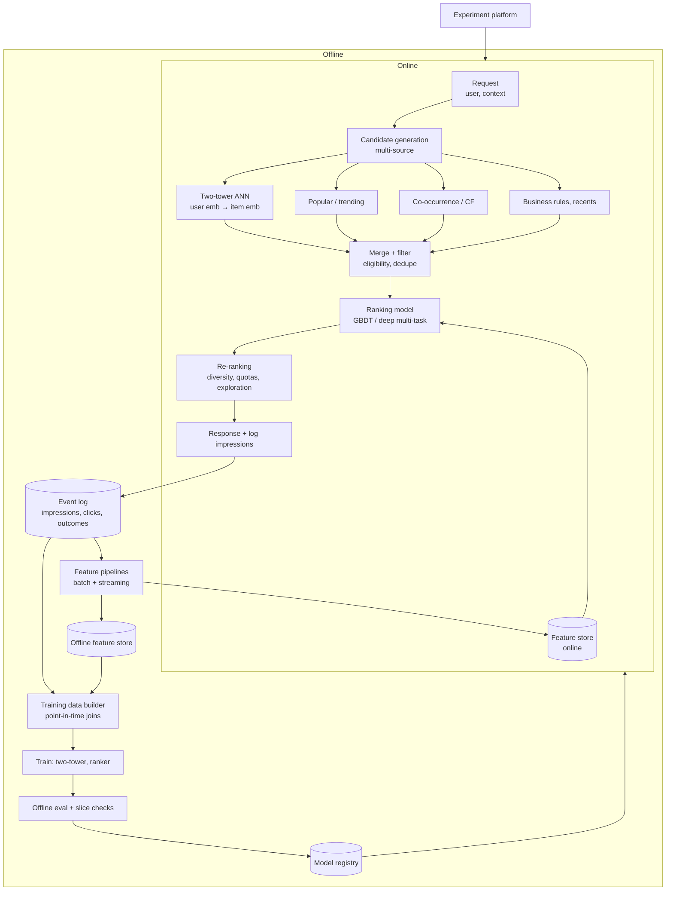

# Classic ML system design: recommendation & ranking

!!! abstract "At a glance"
    **Priority:** P2 · **Complexity:** 4/5 · **Est. time:** 4 h · **Phase:** 5 · **Prereqs:** [Framework](framework.md), [AI search](ai-search.md), [Caching](../system-design/caching.md), [Data pipelines](../system-design/data-pipelines.md)
    **You're done when:** you can design a two-stage (retrieval → ranking) recommendation system end to end — features, training data and labels, offline/online metrics, serving latency, feature store, cold start, feedback loops — and explain where LLMs now fit (and don't) in it.

Classic ML system design still appears in interviews (and at logistics/marketplace companies). LLMs did not replace ranking models: at 10k+ QPS with 10 ms budgets, embeddings + GBDT/deep rankers remain the workhorses. This page keeps the walkthrough structure of the other design topics.

## Problem

"Design a recommendation system that suggests relevant items to users on a homepage/feed." For a logistics context: **recommending carriers/services for a booking** (rank carrier–route–service options by likelihood of acceptance and on-time performance), or **suggesting the next best action to an ops agent**.

## Clarifying questions

| Question | Why |
|---|---|
| Items, users, catalogue size, interaction volume? | Retrieval vs ranking scale |
| Objective: clicks, conversions, revenue, on-time delivery, long-term retention? | Label definition; multi-objective |
| Explicit vs implicit feedback? Delay of feedback (booking outcome known weeks later)? | Label construction, delayed feedback |
| Real-time features needed (session context)? | Feature store, streaming |
| Cold start prevalence (new users/items)? | Content-based fallbacks |
| Fairness/business constraints (diversity, contractual carrier quotas)? | Re-ranking layer |
| Latency and QPS? | Architecture tiers |

## Requirements

**Functional:** personalised ranked list per request; filters (availability, eligibility); explanations ("because you shipped to X"); feedback logging; experimentation support.

| NFR | Target (assumed) |
|---|---|
| Quality | +5% conversion vs current heuristic; recall@200 of retrieval ≥ 80% of eventual positives |
| Latency | p99 < 100 ms end-to-end (retrieval 20 ms, ranking 40 ms, re-rank 10 ms) |
| Scale | 5k QPS peak; 20M users; 5M items |
| Freshness | New items retrievable < 15 min; features updated near-real-time for session signals |
| Safety/compliance | Privacy (GDPR), no protected-attribute use, explainability for regulated contexts |

## Estimation

```text
Interactions: 20M users × 10 events/day = 200M events/day ≈ 2.3k/s avg; × ~200 B = 40 GB/day raw logs
Training data: 90 days ≈ 3.6 TB raw → sample negatives; ~10–50B rows for ranking
Embeddings: 5M items × 128 dims × 4 B = 2.5 GB (fits in RAM on each ANN node); 20M users × 128 × 4 = 10 GB
Ranking compute: 5k QPS × 500 candidates = 2.5M scored candidates/s
  GBDT on ~200 features: ~10–50 µs per candidate per core → 25–125 core-seconds/s → ~30–150 cores (CPU) 
  deep ranker on GPU: batch 500 candidates/request → 5k batches/s → several GPUs; consider distillation
Feature store reads: 5k QPS × (1 user vector + 500 item feature lookups) → ~2.5M lookups/s → 
  needs in-memory/local caches of item features (5M items × 1 KB = 5 GB replicated per ranker node)
```

## Architecture



## Component deep dives

### 1. Candidate generation (retrieval)

Goal: from millions of items, return ~200–1,000 plausible candidates in ~10–20 ms, prioritising **recall**.

| Method | Notes |
|---|---|
| Two-tower model (user tower, item tower) with in-batch/sampled negatives → ANN index | The standard; item embeddings precomputed; user embedding computed at request or cached |
| Item-to-item co-occurrence / collaborative filtering (ALS, item2vec) | Strong baseline, cheap, explainable |
| Content-based (text/image embeddings, attributes) | Cold-start items |
| Popularity/trending, geo/segment | Fallbacks, exploration |
| Sequence models (session-based transformers/GRU4Rec-style) | Session intent |

Multiple sources are merged; each source's contribution is monitored.

### 2. Ranking

Predict per-candidate utility using rich cross features (user × item × context). Options: gradient-boosted trees (LightGBM/XGBoost; strong, fast, interpretable), deep models (DCN, DeepFM, multi-task towers with shared bottom / MMoE for click + conversion + dwell), and increasingly transformer-based sequence rankers. Multi-objective: combine predictions with weights `score = a·p(click) + b·p(convert) + c·quality` tuned via experiments.

Feature groups: user (history aggregates), item (stats, embeddings, freshness), context (time, device, location), cross (user-category affinity), real-time session (last N interactions).

### 3. Labels and training data

- **Implicit feedback** (click, dwell, booking) with **impression logging** — you must log what was *shown*, not only what was clicked, to derive negatives and correct for position bias.
- **Delayed feedback** (booking confirmed days later; delivered on time weeks later): train on matured windows, use delayed-feedback corrections, or short-horizon proxies.
- **Point-in-time correctness**: features joined as of the impression time; leakage (using future info) is the #1 offline/online gap cause.
- Negative sampling strategy matters; sample-selection bias since you only observe items previously shown.

### 4. Feature store

Consistent definitions for offline (training) and online (serving) features to avoid training/serving skew: Feast/Tecton-style stores or platform-native (Databricks, Vertex, SageMaker). Streaming aggregates (Flink/Kafka Streams) for real-time features. Serve hot features from in-memory stores (Redis) with local caching.

### 5. Re-ranking, exploration and feedback loops

Diversity (MMR), business quotas (carrier contractual minimums), freshness boosts, and **exploration** (epsilon-greedy, Thompson sampling / contextual bandits) so the system collects data on non-top items. Without exploration the model trains on its own past decisions — a **feedback loop** that entrenches popular items and starves new ones.

### 6. Cold start

New users: popularity + context (geo/segment), onboarding signals, bandits. New items: content embeddings, attribute-based similarity, exploration budget/boost. Track time-to-first-impression for new items.

### 7. Where LLMs fit (2026)

| Use | Fit |
|---|---|
| LLM as the ranker for every request | Poor: latency/cost; use only offline or for small candidate sets |
| LLM-generated item/user text representations → embeddings for cold start | Good |
| LLM for explanations ("why recommended") on the final top-k | Good, cached |
| LLM-as-judge for offline relevance labels | Useful with calibration |
| LLM synthetic user simulators for testing | Emerging, use cautiously |
| Semantic IDs / generative retrieval | Active research/production at large companies; consider only at scale |
| Conversational recommendation front-end | Natural language → structured filters + the same ranker |

## Evaluation strategy

- **Offline**: retrieval — Recall@K, hit rate; ranking — AUC/log-loss (calibration matters when combining objectives), NDCG@K, MAP; slice metrics (new users, new items, regions); counterfactual/off-policy estimators (IPS, doubly robust) when logs are from a previous policy. Offline gains often don't translate — treat as a filter, not proof.
- **Online**: A/B tests with guardrail metrics (latency, revenue, complaints), long-term holdouts for feedback-loop effects, interleaving for faster ranking comparisons; novelty effects; sample-ratio-mismatch checks.
- **Error analysis**: inspect failure cases — items surfaced that are ineligible, repetitive results, cold-start failures, popularity bias, unexplainable recs.

## Observability

Model: prediction distribution drift, calibration by segment, feature drift/missing rates, training/serving skew checks (compare logged online features vs offline recomputation). System: stage latencies, candidate counts per source, ANN recall, feature store latency and hit rates, cache hit rates. Business: CTR/conversion by segment and experiment arm, diversity and coverage metrics (share of catalogue shown).

## Failure modes

| Failure | Mitigation |
|---|---|
| Training/serving skew | Shared feature definitions, logging served features, skew monitors |
| Position bias in click data | Log positions, inverse propensity weighting, randomised exploration slices |
| Feedback loops / popularity bias | Exploration, debiasing, long-term holdouts |
| Stale embeddings/features | Freshness SLOs, streaming updates |
| Data leakage in offline eval | Point-in-time joins, time-based splits |
| Latency spikes at ranking | Candidate caps, model distillation, fallback to cheaper ranker |
| Model rollback needs | Versioned models, shadow scoring, canary |

## Scaling & cost optimization

- Cache user embeddings and candidate sets for short TTLs; precompute item features into ranker memory.
- Distil deep rankers into smaller models; quantise embeddings; use GPU only where batch sizes justify.
- Tier requests: cheap path for anonymous/low-value contexts.
- Sample training data smartly (negative sampling, time windows); incremental training.

## What a Staff-level answer adds

- Objective definition with stakeholders (short-term clicks vs long-term outcomes such as on-time delivery), including guardrails and fairness constraints.
- **Experimentation platform and data flywheel** as first-class systems; the biggest gains are usually data and logging quality, not model architecture.
- Build/buy: managed recommenders (e.g., cloud recommendation services) for standard use cases versus custom when objectives/constraints are unique.
- Governance: explainability, privacy, right-to-be-forgotten propagating into training data and embeddings.
- Clarity about LLM roles: use them where language understanding matters and latency allows, not as a default ranker.

## Resources

| Resource | Type | Why this one | Level | Cost |
|---|---|---|---|---|
| [System Design for Recommendations and Search (Eugene Yan)](https://eugeneyan.com/writing/system-design-for-discovery/) :gem: | article | Real architectures compared across companies | intermediate | free |
| [Deep Neural Networks for YouTube Recommendations](https://research.google/pubs/deep-neural-networks-for-youtube-recommendations/) | paper | The canonical two-stage design | intermediate | free |
| [Rules of Machine Learning (Google)](https://developers.google.com/machine-learning/guides/rules-of-ml) :gem: | article | Practical wisdom on features, skew, launches | intermediate | free |
| [Hello Interview — ML System Design in a Hurry](https://www.hellointerview.com/learn/ml-system-design/in-a-hurry/introduction) | course | Interview delivery framework | intermediate | freemium |
| [Bandits for Recommender Systems (Eugene Yan)](https://eugeneyan.com/writing/bandits/) :gem: | article | Exploration explained with practical caveats | intermediate | free |
| [Recommender systems and LLMs (Eugene Yan)](https://eugeneyan.com/writing/recsys-llm/) | article | Where LLMs help recsys | intermediate | free |
| [Designing Machine Learning Systems (Chip Huyen)](https://huyenchip.com/books/) | book | Data, features, deployment, monitoring end to end | advanced | paid |
| [ColBERT paper](https://arxiv.org/abs/2004.12832) | paper | Late-interaction retrieval, relevant to ranking research | advanced | free |

## Follow-up questions

### L2 — Apply

??? question "Q1. Recall@200 of your retrieval is 60% but ranking model AUC is excellent. Where's the problem?"
    ??? success "Answer"
        The ranker can only reorder what retrieval provides; 40% of eventual positives never reach it. Improve candidate generation: add sources (CF, content-based, recent-interest), increase candidates for cheap sources, retrain the two-tower with better negatives (hard negatives), check filter over-pruning. Measure recall per source and per user segment.

??? question "Q2. You logged only clicked items. Why is that a problem and how do you fix logging?"
    ??? success "Answer"
        Without impressions you can't know negatives (shown but ignored) or positions, so you can't correct for exposure/position bias or compute CTR properly. Log every impression with position, candidate scores, features served, model version and request context; keep this immutable for training/replay.

??? question "Q3. Offline AUC improved 2 points but the A/B test is flat. List likely causes."
    ??? success "Answer"
        Training/serving skew or leakage in offline eval; offline metric misaligned with the business objective; position-bias effects in logs; improvement concentrated on items rarely shown; calibration issues when combined with other objectives; novelty effects/insufficient test power; latency regressions offsetting gains. Investigate with slice analysis, feature skew checks, and counterfactual estimators.

??? question "Q4. Size the online feature lookups for 5k QPS × 500 candidates."
    ??? success "Answer"
        2.5M item-feature lookups/s — unrealistic against a remote store per candidate. Replicate item features into ranker-node memory (5M items × ~1 KB = 5 GB), refresh via streaming; only user/session features (~1–3 lookups/request, 5–15k/s) hit the online store (Redis). Batch requests and use local caches with TTL.

### L3 — Design & trade-offs

??? question "Q5. GBDT vs deep ranker — decide."
    ??? success "Answer"
        Start with GBDT: strong on tabular features, fast to train/serve on CPU, interpretable, easy to debug. Move to deep multi-task models when you need learned embeddings interactions, multi-objective towers, sequence features or have very large data and GPU serving; often keep GBDT as a fallback or ensemble. Decide by online gains vs latency/cost and operational complexity.

??? question "Q6. How do you handle delayed conversions (booking confirmed 3 days later)?"
    ??? success "Answer"
        Use matured label windows (train on data older than the delay horizon), plus short-horizon proxy labels (click, quote request) in multi-task learning; apply delayed-feedback modelling or importance weighting to handle not-yet-observed positives; refresh models frequently with corrected labels; monitor label-lag distributions.

??? question "Q7. How much exploration is right and how do you justify it to the business?"
    ??? success "Answer"
        Reserve a small, controlled budget (e.g., 1–5% of slots) using contextual bandits or randomised slots in low-risk positions, chosen via simulation and A/B tests measuring long-term metrics. Justify: without exploration, models converge to popularity, new items never gain data, and long-term performance decays; exploration data also enables unbiased off-policy evaluation.

??? question "Q8. Would you use an LLM to rank carriers for a booking?"
    ??? success "Answer"
        Not as the primary ranker: needs numeric features (price, transit time, reliability, capacity), strict latency and consistent, auditable scoring. Use a GBDT/deep ranker for scoring; use LLMs for the natural-language layer (parse the request into constraints, generate explanations, summarise trade-offs) or offline analysis of unstructured carrier notes converted into features.

### L4 — Staff-level ambiguity

??? question "Q9. Product wants 'personalisation' but has no logging infrastructure. What do you do first?"
    ??? success "Answer"
        Build the data foundation before models: impression/interaction logging with schema and IDs, identity stitching, an experimentation framework, and a simple non-ML baseline (popularity by segment, rules) to measure against. Then ship a co-occurrence/CF model as v1 with A/B testing; invest in feature store and two-stage architecture only when data volume and gains justify it. Communicate the roadmap with milestones tied to measurable lifts.

??? question "Q10. Compliance says the ranker must not use nationality-correlated features. How do you enforce and verify?"
    ??? success "Answer"
        Governance at the feature layer: feature registry with sensitivity tags and approval workflow; block protected/proxy features in training pipelines; audit proxies (postal codes, language) with fairness metrics across groups; evaluation slices for disparate impact; documentation and periodic reviews. Keep counterfactual fairness tests in CI for model releases.

??? question "Q11. Two teams built separate recommenders with different feature pipelines. Propose convergence."
    ??? success "Answer"
        Converge on shared data and platform pieces first: unified event schema and logging, shared feature store, common experimentation platform and evaluation harness; leave model choices to teams initially. Compare the recommenders on the shared harness to decide which architecture to standardise for each use case, and migrate incrementally with A/B validation. Track platform adoption and time-to-launch for new recommenders.

## Real-world use cases

- **Carrier/service recommendation at booking** ranking options by acceptance, price and on-time performance.
- **Next-best-action for ops agents** prioritising exception cases by predicted impact.
- **Marketplace/catalogue personalisation** (e-commerce, streaming) — the classic form.
- **Notification targeting** predicting which alert is useful for which customer.

## Checklist

- [ ] I can explain two-stage retrieval → ranking → re-ranking and each stage's latency budget
- [ ] I can define labels, handle delayed feedback and position bias, and avoid leakage
- [ ] I can design feature store serving and explain training/serving skew
- [ ] I can compare offline metrics with online A/B design and feedback-loop risks
- [ ] I can say where LLMs help and where they don't in recommendation
- [ ] I answered all L3/L4 questions out loud in < 3 min each
