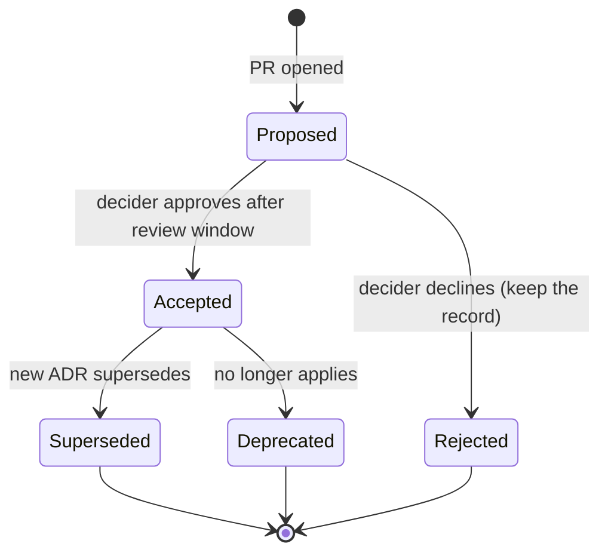

# Architecture Decision Records

!!! abstract "At a glance"
    **Priority:** P0 · **Complexity:** 1/5 · **Est. time:** 1 h · **Phase:** 1 · **Prereqs:** [Architect role & trade-offs](architect-role-tradeoffs.md)
    **You're done when:** you can write a good ADR in 20 minutes (context with forces, options with real trade-offs, decision, consequences, review trigger), set up an ADR log in a repo with status lifecycle and lint checks, and explain how ADRs fit into a decision process without becoming bureaucracy.

## Why it matters

Architecture decays when the reasoning behind it is lost. ADRs (Michael Nygard, 2011) are the cheapest, highest-return architecture practice: a short markdown file per significant decision, stored with the code. They give new joiners the *why*, prevent re-litigating settled debates, expose assumptions so they can be checked later, and in the AI era they double as **context for coding agents** (agents that read the ADR log stop proposing the options you already rejected).

At Staff level, ADRs are also an influence tool: writing the options fairly forces you to understand the opposing view, and a decision record with a named decider and review date turns endless debate into progress.

## Core concepts

### What deserves an ADR

An *architecturally significant decision*: affects structure, non-functional characteristics, dependencies, interfaces or construction techniques — and is hard or costly to reverse. Heuristics (Zimmermann's "Y-statement" and "ASR" thinking):

| Write an ADR | Don't |
|---|---|
| Choosing a datastore, broker, or cloud service for a system of record | Picking a linter rule or a variable naming convention |
| Adopting/retiring a framework or language for a platform | Library choice inside one module, easily replaced |
| Public API/event schema conventions and versioning policy | Tactical refactors |
| Cross-cutting patterns (outbox standard, auth model, tenancy model) | Feature-level design (that's a design doc/RFC) |
| Explicitly *not* doing something (rejecting microservices for now) | |
| Model/provider strategy for AI features (gateway, data-residency rules) | Prompt wording tweaks |

Test: "Would a new joiner in 18 months ask *why did we do it this way?*" and "Would reversing it cost more than a sprint?"

### ADR vs design doc / RFC

- **Design doc/RFC**: explores a solution space for a feature or project, collects feedback; a long document, mostly short-lived. See [design docs & RFCs](../staff-skills/design-docs-rfcs.md).
- **ADR**: records *one decision* and its consequences; short, immutable-ish, long-lived, discoverable in the repo. A design doc often produces several ADRs.

### Anatomy of a good ADR

Nygard's original: Title, Status, Context, Decision, Consequences. MADR (Markdown Any Decision Records) adds decision drivers and considered options with pros/cons.

```markdown
# ADR-0017: Use a transactional outbox with Debezium for domain events

- Status: Accepted (2026-09-12) — supersedes ADR-0009
- Deciders: @rsingh (decider), @platform-team, @booking-team
- Consulted: @data-eng, @sre · Informed: all service teams
- Review trigger: revisit if event volume > 5k/s sustained or if we move off Postgres

## Context and forces
Booking, Invoicing and Tracking need reliable event exchange. Today three services publish to Kafka
after DB commit; we lost events in 4 incidents in Q2 (INC-1123, ...). Constraints: Postgres 16 everywhere,
managed Kafka, platform team of 3 can operate Kafka Connect, at-least-once delivery acceptable,
consumers can be made idempotent. Top characteristics: no lost events (durability), operability,
low latency (< 1 s p95).

## Options considered
1. **Polling outbox relay in each service** — simple, no new infra; latency = poll interval; DB load; 14 divergent implementations likely.
2. **CDC outbox with Debezium (chosen)** — near-real-time, one operational pattern, ordering from WAL; needs Kafka Connect ops.
3. **Event sourcing** — solves it fundamentally; unjustified rewrite cost for 3 of the 14 services.
4. **Do nothing / retry in code** — rejected: does not close the dual-write gap.

## Decision
We will use the transactional outbox pattern with Debezium's Outbox Event Router. The platform team
owns Connect; services own their outbox tables (standard schema, see appendix).

## Consequences
+ Eliminates the lost-event class of incident; single pattern to teach and test.
+ Consumers must implement idempotency (inbox pattern) — provided as library.
− New operational component (Connect) and on-call surface for the platform team.
− Outbox table growth needs housekeeping (retention job).
− Schema of outbox is a shared contract (versioned).
Follow-ups: fitness function checks every service with a producer has an outbox table (ARCH-212).
```

What makes it *good*:

- **Context states forces and constraints**, not just the problem. Include the *numbers* that drove it.
- **Options are real** — including "do nothing" and the option you personally dislike, described fairly.
- **Decision in active voice** ("We will…").
- **Consequences include the negatives** — an ADR with only positives is advocacy.
- **Review trigger / assumptions** — what must remain true; when to revisit.
- **Short**: one to two pages. Link to detail rather than embedding.

### Lifecycle and process



- **Immutable history**: don't rewrite accepted ADRs; write a new one that supersedes (link both ways). Small typo/status changes are fine.
- **PR-based**: an ADR is a pull request; discussion happens in review; the merge = acceptance. Good ADRs are discussed *before* being written (a conversation, per the advice process), then written down.
- **Numbering** sequentially (`0017-…md`), stored at `docs/adr/` or `docs/decisions/`; per-repo for local decisions and a central repo for org-wide.
- **Decider named**: consensus isn't required, accountability is. Timebox the review (e.g. 5 working days).
- **Index/log** generated automatically (adr-tools, log4brains) — add to the docs site.

### Tooling

| Tool | What | Notes |
|---|---|---|
| adr-tools (Nat Pryce) | Bash CLI to create/supersede/list ADRs | Minimal, Nygard format |
| MADR templates | Markdown template with options/drivers | The most popular in 2026 |
| log4brains | Web UI/static site + CLI for ADR logs | Good for publishing |
| adr.github.io | Hub for templates, tools, examples | Start here |
| MkDocs / Docusaurus | Publish ADRs with the docs site | Docs-as-code |

Automation ideas: a CI check that PRs labelled "architecture" link an ADR; a bot that comments on PRs touching `docs/adr` for review; a **fitness function** or lint per decision where feasible ("ADR-0017 says every producer has an outbox table" → test).

### ADRs and AI

- Agents (Claude Code, Copilot, etc.) read repo files: an `docs/adr/` folder plus a pointer in `AGENTS.md` ("consult ADRs before proposing structural changes; don't violate accepted ADRs") reduces regressions against decisions.
- Agents can *draft* ADRs from a PR or Slack thread, and summarise options — but the decider must supply the context and constraints that only humans have, and check that consequences are honest.
- ADRs for AI-specific decisions: model/provider choice with eval evidence, data residency and retention rules, agent autonomy levels and approval requirements, prompt/versioning strategy. These decisions change fast — set short review triggers (e.g. 6 months).

### Senior-level nuance

- **ADRs fail when they're a gate**. Make them an artefact of a good conversation, not a form to appease an architecture board. Lightweight beats comprehensive.
- **Capture rejected options.** The most valuable sentence in an ADR is often "we considered X and rejected it because Y — if Y changes, revisit".
- **Backfill judiciously**: for surprising legacy decisions, write "retrospective ADRs" when you discover the reasoning; label them as such.
- **Y-statements** (Zdun/Zimmermann) as a one-line summary: "In the context of *X*, facing *Y*, we decided *Z* and neglected *W*, to achieve *A*, accepting *B*."
- **Link to evidence**: benchmarks, spike results, incident IDs, cost calculations.

## Resources

| Resource | Type | Why this one | Level | Cost |
|---|---|---|---|---|
| [Documenting Architecture Decisions (Michael Nygard)](https://cognitect.com/blog/2011/11/15/documenting-architecture-decisions) | article | The original 2011 post — 2 pages; read it once | beginner | free |
| [adr.github.io](https://adr.github.io/) | docs | Hub: templates (MADR), tools, and examples | beginner | free |
| [MADR — Markdown Architectural Decision Records](https://adr.github.io/madr/) | docs | The current de-facto template with options and pros/cons | beginner | free |
| [ADR repo (Joel Parker Henderson)](https://github.com/joelparkerhenderson/architecture-decision-record) :gem: | docs | Huge collection of templates, examples and guidance in one place | intermediate | free |
| [Architectural Decision Making (Olaf Zimmermann)](https://www.ozimmer.ch/practices/2020/04/27/ArchitectureDecisionMaking.html) :gem: | article | Y-statements, when to decide, and how to make good records | advanced | free |
| [Thoughtworks Radar — Lightweight ADRs](https://www.thoughtworks.com/radar/techniques/lightweight-architecture-decision-records) | article | Industry endorsement and adoption guidance | beginner | free |
| [adr-tools (Nat Pryce)](https://github.com/npryce/adr-tools) | tool | CLI for numbering, superseding and listing | beginner | free |
| [log4brains](https://github.com/thomvaill/log4brains) :gem: | tool | Publishes an ADR knowledge base as a static site with search | intermediate | free |
| [Scaling the Practice of Architecture, Conversationally (Harmel-Law)](https://martinfowler.com/articles/scaling-architecture-conversationally.html) | article | How ADRs fit into the advice process | advanced | free |

## Hands-on lab

**Goal:** set up an ADR practice and write three real ADRs. 60 min.

1. In your capstone repo, create `docs/adr/` with a MADR template and an `index.md` (or use log4brains/adr-tools).
2. Write ADR-0001 "Record architecture decisions" (meta).
3. Write ADR-0002 on a real decision from your capstone (e.g. "Use pgvector behind a `VectorStore` port"). Include ≥ 3 options with numbers (e.g. estimated vectors, QPS) and negative consequences.
4. Write ADR-0003 that *rejects* something (e.g. "No multi-agent framework in v1").
5. Add a CI check (script) that verifies every ADR has Status, Context, Options, Decision, Consequences, and a review trigger.
6. Add a pointer in `AGENTS.md` telling agents to read `docs/adr/` first; ask a coding agent to propose a change that conflicts with ADR-0003 and see if it respects it.
7. Add one fitness function for ADR-0002 (e.g. import-linter: only `adapters/vectorstore` may import the pgvector driver).

**Expected output:** three ADRs, a lint script, an AGENTS.md pointer, and a fitness function.

## Questions

### L1 — Recall

??? question "Q1. What are the sections of Nygard's ADR template?"
    ??? success "Answer"
        Title (short noun phrase with number), Status (proposed/accepted/deprecated/superseded), Context (forces at play: technical, political, social, project), Decision (in full sentences, active voice: "We will…"), Consequences (all resulting context, positive and negative).

??? question "Q2. What is the status lifecycle of an ADR and why are accepted ADRs not edited?"
    ??? success "Answer"
        Proposed → Accepted (or Rejected); later Deprecated or Superseded by a newer ADR. Accepted ADRs are treated as historical records of what was decided and why at that time; rewriting them destroys the history. You write a new ADR that supersedes the old one and link both.

??? question "Q3. Which decisions warrant an ADR?"
    ??? success "Answer"
        Architecturally significant decisions: those affecting structure, key quality attributes, dependencies, interfaces or construction techniques, and that are costly to reverse or likely to prompt "why did we do this?" later. Not small local choices easily changed.

??? question "Q4. What is a Y-statement?"
    ??? success "Answer"
        A one-sentence decision summary: "In the context of ⟨use case⟩, facing ⟨concern⟩, we decided for ⟨option⟩ and neglected ⟨other options⟩, to achieve ⟨quality⟩, accepting downside ⟨consequence⟩." Useful as an ADR's summary or in slides.

### L2 — Apply

??? question "Q5. Write the Context + Decision + Consequences for choosing between Kafka and a cloud queue (e.g. Azure Service Bus) for booking events, given a 6-person team on Azure with 800 events/s peak, need for replay by 3 consumers, and 7-day retention."
    ??? success "Answer"
        Context: Azure-first; 800 msg/s peak, growth 3× in 18 months; three independent consumers, one requires replay after bugs; 7-day retention; small team, limited Kafka experience; managed services preferred. Options: Service Bus topics (mature, sessions, DLQ, no replay after complete), Event Hubs (Kafka-compatible endpoint, retention, partition ordering, managed), self-managed Kafka (ops burden). Decision: Event Hubs with Kafka protocol for the event backbone (replay + partition ordering + managed), Service Bus only for command queues needing sessions/DLQ semantics. Consequences: + replay and consumer independence, + no cluster ops; − Event Hubs feature gaps vs Kafka (compaction limits, ecosystem), − two messaging technologies to learn, − Azure lock-in mitigated by Kafka protocol. Review trigger: > 10k events/s or need for Kafka Streams/ksqlDB.

??? question "Q6. A colleague's ADR says 'We decided to use MongoDB because it is scalable and flexible.' Give review feedback."
    ??? success "Answer"
        Missing forces (what data, access patterns, consistency needs, team skills, volumes); "scalable and flexible" are unmeasured claims; no options (Postgres JSONB, DynamoDB); no consequences (loss of joins/transactions, ops burden, backup/DR); no review trigger. Ask for evidence: data model sketch, expected QPS/size, a spike/benchmark, cost estimate. Suggest adding "why not Postgres with JSONB?" since the team already operates it — the default option must be beaten by evidence.

??? question "Q7. Design a CI check for ADR quality."
    ??? success "Answer"
        A script run on PRs touching `docs/adr/**`: validate filename pattern and unique number; parse front-matter/status ∈ allowed set; require sections (Context, Options ≥ 2, Decision, Consequences with at least one negative marker like a "−" bullet or "Negative" heading, Review trigger); check `supersedes` links resolve and the superseded ADR has status updated; check that ADR is linked from the index. Comment a checklist on the PR; don't try to judge quality automatically — leave that to reviewers.

### L3 — Design & trade-offs

??? question "Q8. Central architecture board approval vs advice process for ADRs in a 200-engineer company. Choose and design."
    ??? success "Answer"
        Prefer the advice process: any team can make and record an architecturally significant decision after seeking advice from affected parties and people with relevant expertise (with visible discussion in the ADR PR); the decider is accountable for the outcome. A central board becomes a bottleneck, slows delivery and detaches from context. Keep a small set of *org-level* decisions (cloud provider, identity, data classification, LLM gateway) owned by platform/architecture guild with formal review. Guardrails: ADR template, a searchable log, an "architecture forum" where controversial ADRs get discussed, and fitness functions for org-level constraints.

??? question "Q9. Where should ADRs live: per service repo, central repo, or wiki? Trade-offs."
    ??? success "Answer"
        Per-repo (next to code): discoverable for that codebase, versioned with the code, easy PR flow; poor visibility for cross-cutting decisions. Central repo: good for org-wide decisions and cross-team visibility; disconnected from code, risk of staleness. Wiki: easy to edit but no review flow, no versioning, drifts. Recommended: local decisions in the service repo; cross-cutting/org decisions in a central `architecture` repo; a generated portal (log4brains/MkDocs, Backstage catalogue) aggregating both; local ADRs link to org ADRs they depend on.

??? question "Q10. How should an ADR treat decisions made with heavy AI involvement (e.g. model choice justified by eval results)?"
    ??? success "Answer"
        Record the evidence, not just the conclusion: eval set description and size, metrics per candidate (quality, latency, cost per task), date of evaluation and model versions, known limitations (evals may not cover X), and the assumption that models change quickly. Set a short review trigger (e.g. 3–6 months or new major model release) and link the eval harness so re-running is cheap. Include data-handling constraints (residency, retention) and the fallback plan (portability via a port/gateway). This turns the decision into a re-evaluable experiment rather than a one-off preference.

### L4 — Staff-level ambiguity

??? question "Q11. You inherit a system with no records and a team that says 'nobody remembers why'. How do you rebuild the decision history and prevent it recurring?"
    ??? success "Answer"
        Archaeology: interview long-tenured engineers, mine git history, incident reports, Slack/Confluence, and architecture diagrams; identify the top 10 surprising decisions (e.g. "why two message brokers?") and write retrospective ADRs marked as such with confidence levels ("reconstructed; unverified"). Prioritise those blocking current work. Going forward: introduce the ADR practice with a template, a low-friction PR flow and a visible first win (an ADR that resolves a live debate). Add to the definition of done for architecturally significant changes, link ADRs in PR templates, and review the log in a monthly architecture forum. Track adoption (ADRs/quarter, % of significant changes with ADRs).

??? question "Q12. A director wants 'architecture governance' and proposes a mandatory ARB sign-off for every ADR. What is your counterproposal?"
    ??? success "Answer"
        Address the underlying needs (risk control, consistency, visibility) with less friction: (1) risk-tiering — only decisions crossing team boundaries or touching security/data/cost thresholds need review; (2) advice process for everything else with a named decider; (3) transparency — all ADRs visible in a portal with a subscription feed for the guild; (4) automated guardrails — fitness functions, policy-as-code, paved roads — so compliance doesn't rely on review; (5) an SLA for reviews (e.g. 3 working days) and a metric on decision lead time; (6) periodic sampling audits instead of blocking gates. Present data: lead time impact of approval queues in other orgs and your own. Offer a 3-month pilot with defined success metrics.

## Real-world use cases

- **Thoughtworks and many consultancies** adopt lightweight ADRs as a default practice (Radar: Adopt).
- **Government digital services (e.g. UK GDS-style)** publish ADRs openly to share reasoning.
- **Platform teams** record ADRs for paved-road choices (logging, auth, messaging) that dozens of teams inherit.
- **Regulated industries** use ADRs as audit evidence for risk-related design choices.
- **AI programs** record model/provider decisions with eval evidence and short review triggers.

## Pitfalls & anti-patterns

- ADRs after the fact as a rubber stamp; written by one person with no consultation.
- Only positive consequences; no rejected options.
- Too long (design docs in disguise) or too vague to be useful.
- Stored in a wiki nobody finds; no index; no links from code/PRs.
- Treating ADRs as a gate that slows every change.
- Editing accepted ADRs in place, erasing history.
- No review trigger; decisions calcify long after assumptions changed.

## Checklist

- [ ] I can write a complete ADR in 20 minutes with real options and negative consequences
- [ ] I set up an ADR log with template, index and a CI check
- [ ] I can explain ADR vs design doc and the advice process
- [ ] I linked an ADR to a fitness function and to AGENTS.md
- [ ] I answered all L3 questions out loud in < 3 min each
