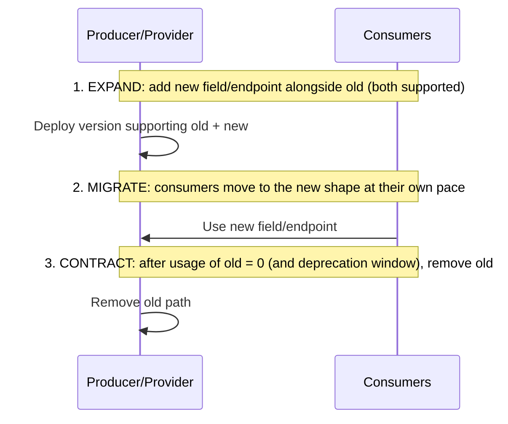

# API contracts, versioning & schema evolution

!!! abstract "At a glance"
    **Priority:** P1 · **Complexity:** 3/5 · **Est. time:** 2 h · **Phase:** 3 · **Prereqs:** [API design](../system-design/api-design.md), [Coupling & modularity](coupling-modularity.md)
    **You're done when:** you can define a compatibility policy (backward/forward/full) for REST, gRPC/Protobuf and event schemas, run an expand/contract migration, choose a versioning strategy with a deprecation process, and set up CI gates (breaking-change detection, consumer-driven contract tests).

## Why it matters

Contracts are the strongest coupling you can't refactor away: once other teams (or customers) depend on your API or event schema, every change is a negotiation. In a large system, *contract management is the mechanism that lets teams deploy independently* (deployment coupling → contract coupling). Bad contract discipline creates the distributed monolith: "we can't release the Booking API until the Invoicing team upgrades".

For AI systems the concept extends: **tool schemas (MCP), structured-output schemas and agent handoff payloads are API contracts too** — model-facing contracts that must evolve without breaking agents in production, and whose descriptions are part of the contract because LLMs read them.

## Core concepts

### Compatibility, precisely

| Type | Definition | Who upgrades first | Example |
|---|---|---|---|
| **Backward compatible** | New consumers/schema can read data written with the old schema | Consumers first (Kafka default for consumers), or for requests: new server accepts old clients | Adding an optional field with default |
| **Forward compatible** | Old consumers can read data written with the new schema | Producers first | Old code ignores unknown fields |
| **Full** | Both | Any order | Adding optional fields only |
| **Transitive** | Compatibility checked against *all* previous versions, not just the last | | Long-lived event logs, replay |

For request/response APIs: server changes must be backward compatible with existing clients (Postel/tolerant reader); for events: producers and consumers upgrade independently, so aim for full compatibility (transitive if you replay).

### Safe vs breaking changes (rule table)

| Change | REST/JSON | Protobuf | Avro | Events (generic) |
|---|---|---|---|---|
| Add optional field | Safe | Safe | Safe with default | Safe (tolerant readers) |
| Add required field | **Breaking** for requests; response ok | Breaking semantics (proto3 has no required) | Breaking without default | **Breaking** |
| Remove field | **Breaking** if consumers read it | Safe if number reserved | Breaking without default handling | **Breaking** |
| Rename field | **Breaking** (JSON), | Safe on wire (numbers), breaking in JSON mapping | Breaking (use aliases) | **Breaking** |
| Change type | **Breaking** (widening sometimes ok: int → long in Avro/proto compatible cases) | Mostly breaking | Promotions allowed (int→long) | Breaking |
| Change enum: add value | Risky: old clients may crash on unknown | Safe if clients handle unknown/default | Depends (default needed) | Risky |
| Change semantics of a field (units, meaning) | **Breaking but invisible** to tools | Same | Same | Same — the most dangerous |
| Tighten validation | Breaking for requests | | | |
| Reorder JSON fields | Safe | n/a | n/a | Safe |

**Semantic changes** (a field now means gross weight instead of net weight) pass every schema checker and break consumers silently. Only new field names/versions and contract tests catch them.

### Versioning strategies

| Strategy | Example | Pros | Cons |
|---|---|---|---|
| URI versioning | `/v2/bookings` | Explicit, cache/route friendly | Whole-API version bumps; duplicated surface |
| Header/media type | `Accept: application/vnd.acme.booking.v2+json` | Clean URLs, per-resource versions | Harder to test/discover |
| Date-based (Stripe) | `Stripe-Version: 2026-03-01` + per-account pinning + transformation layer | Fine-grained, no big-bang v2 | Requires sophisticated compatibility layer |
| Additive evolution only ("versionless"; Google AIPs) | Add fields; deprecate; never break | Simplest for consumers | Discipline; accumulating cruft; needs tolerant readers |
| Schema registry subjects | Per-topic compatibility mode | Enforced at produce time | Registry operations and governance |
| Consumer-driven (GraphQL) | Deprecate fields, clients select fields | No versions; usage-driven pruning | Field-level auth and cost control |

Guidance: **prefer additive, backward-compatible evolution; version only when you must break** (semantics, big restructure). Use a major version number as a *last resort*, and ensure you can operate two versions for a defined window.

### Expand / contract (parallel change)

The universal technique for breaking changes without downtime:



Example rename `weight` → `gross_weight_kg`: emit both for N months (deprecating `weight` in docs, `Deprecation`/`Sunset` headers), track consumer usage (API gateway logs, schema registry client ids), notify laggards, remove after the window. Same for database columns (migrations) and event types.

### Deprecation and sunset

- Communicate: `Deprecation` header (draft standard evolving) and `Sunset` header (RFC 8594), changelog, direct outreach to known consumers.
- Track **who uses what**: client IDs/API keys, schema registry consumers, gateway analytics.
- Publish a **deprecation policy** (e.g. minimum 6 months for external, 3 months internal) and follow it.
- **Brownouts**: temporarily disable the old endpoint for short periods to flush out unknown consumers before final removal.

### Consumer-driven contract testing

Provider-side specs (OpenAPI) describe what the provider *offers*; consumers use only a subset. **Consumer-driven contracts** (Pact) record what each consumer actually needs and verify the provider satisfies all of them in CI — enabling provider changes with confidence and independent deployment. Workflow: consumer tests generate a pact → published to a broker → provider verification runs against all consumer pacts → `can-i-deploy` check gates release.

### Tooling map

| Concern | Tools |
|---|---|
| OpenAPI breaking-change detection | oasdiff, openapi-diff, Optic |
| Protobuf breaking-change detection | `buf breaking` (Buf) |
| Event schema compatibility | Confluent Schema Registry (Avro/Protobuf/JSON Schema), Apicurio; compatibility modes per subject |
| Async API docs | AsyncAPI |
| Consumer contracts | Pact + Pact Broker |
| GraphQL | Schema checks (Apollo GraphOS/Hive), field usage analytics |
| API style guides | Google AIP (google.aip.dev), Zalando RESTful API guidelines, Microsoft REST guidelines |

Protobuf discipline: never reuse or change field numbers; `reserved` removed numbers and names; add new fields with new numbers; avoid `required`; treat enum `0` as `UNSPECIFIED`.

```protobuf
message Booking {
  reserved 4, 7;
  reserved "weight";          // removed; don't reuse the name or number
  string booking_id = 1;
  string status = 2;
  int64  gross_weight_grams = 8;   // replaces weight (expand/contract)
}
```

Pydantic v2 for tolerant readers on consumers:

```python
from pydantic import BaseModel, ConfigDict

class ShipmentEventV1(BaseModel):
    model_config = ConfigDict(extra="ignore")   # tolerate new producer fields
    shipment_id: str
    status: str
    gross_weight_kg: float | None = None        # optional: older events lack it
```

### Event schema evolution specifics

- Envelope with `event_id`, `type`, `schema_version`, `occurred_at`, `correlation_id`, then payload.
- Set registry compatibility to **BACKWARD_TRANSITIVE** or **FULL_TRANSITIVE** if consumers may replay from the start of the log; otherwise BACKWARD (upgrade consumers before producers).
- Use **upcasters** (see [CQRS & ES](cqrs-event-sourcing.md)) for event-sourced stores.
- Don't change event *meaning*; create a new event type. Publish **schemas as artefacts** from the owning team's repo, generate typed clients per consumer.
- Public events are part of your API surface: treat with the same versioning/deprecation policy.

### Contracts for AI: tools, structured outputs and agents

- **MCP tool schemas / function-calling schemas**: names, descriptions and parameter schemas are consumed by an LLM. Changing a description or parameter meaning changes agent behaviour even if the JSON schema is compatible — so run evals on tool changes and version tools (`create_booking_v2`) for breaking behavioural changes.
- **Structured-output schemas** (Pydantic): adding optional fields is safe; making fields required or changing enums can break the model's ability to comply — evaluate structured-output validity rate after changes.
- **Prompts as contracts**: prompt template versions with evals and rollout controls (canary) — treat like API releases.
- **Agent handoff/A2A payloads**: typed, versioned, with tolerant readers.
- Version the model *and* the prompt *and* the schema together in traces so regressions can be attributed.

### Senior-level nuance

- **Robustness principle, revisited**: be liberal in what you accept only when you can afford the ambiguity; validate strictly at trust boundaries but ignore unknown fields on reads.
- **Hyrum's Law**: with enough consumers, every observable behaviour will be depended on (field order, error message text, timing). Make unspecified behaviour deliberately vague or randomised (e.g. shuffle unspecified ordering) if you need freedom to change.
- **Own your consumers**: for internal APIs, know who calls you; for external APIs, expect the long tail.
- **Cost of versions**: each supported version multiplies testing and operational surface — limit to two live versions and drive migration actively.
- **Governance without a committee**: style guide + linting (Spectral for OpenAPI) + breaking-change gates in CI + a small API guild for reviews of new APIs.

## Resources

| Resource | Type | Why this one | Level | Cost |
|---|---|---|---|---|
| [APIs as infrastructure: future-proofing Stripe with versioning](https://stripe.com/blog/api-versioning) :gem: | article | The best description of date-based versioning with per-account pinning and compatibility transformations | intermediate | free |
| [Google API Improvement Proposals](https://google.aip.dev/) | docs | Rigorous, opinionated guidance on compatibility and API design (e.g. AIP-180 compatibility) | advanced | free |
| [Zalando RESTful API Guidelines](https://opensource.zalando.com/restful-api-guidelines/) | docs | Practical, lint-able guidelines incl. compatibility and deprecation rules | intermediate | free |
| [Buf — breaking change detection](https://buf.build/docs/breaking/) | docs | Automated Protobuf compatibility checks; rules explained | intermediate | free |
| [Protobuf language guide — updating messages / dos and don'ts](https://protobuf.dev/programming-guides/dos-donts/) :gem: | docs | Precise rules for safe schema changes | intermediate | free |
| [Confluent Schema Registry — schema evolution & compatibility](https://docs.confluent.io/platform/current/schema-registry/fundamentals/schema-evolution.html) | docs | Compatibility modes and upgrade order explained with tables | intermediate | free |
| [Pact docs — how Pact works](https://docs.pact.io/getting_started/how_pact_works) | docs | Consumer-driven contract testing workflow and `can-i-deploy` | intermediate | free |
| [Parallel Change (Fowler)](https://martinfowler.com/bliki/ParallelChange.html) | article | Expand/migrate/contract, the universal safe-change recipe | intermediate | free |
| [AsyncAPI](https://www.asyncapi.com/) | docs | Contracts for event-driven APIs | intermediate | free |
| [Hyrum's Law](https://www.hyrumslaw.com/) :gem: | article | Why every observable behaviour becomes a contract | beginner | free |

## Hands-on lab

**Goal:** implement compatibility gates and an expand/contract migration. 90 min.

1. FastAPI service exposing `GET /bookings/{id}` with `weight` (kg, float). Export OpenAPI in CI.
2. Add `oasdiff breaking` (or a script comparing OpenAPI JSON) against `main`; verify a field removal fails.
3. Perform expand/contract to rename `weight` → `gross_weight_kg` and add `net_weight_kg`: expand (both fields), migrate a sample consumer, add `Deprecation`/`Sunset` headers, track usage by client id, contract.
4. Events: register a `BookingConfirmed` Avro/JSON schema in a local schema registry (Redpanda Console/Apicurio/Confluent). Set BACKWARD_TRANSITIVE; try adding a required field and see rejection; add an optional field with default and see acceptance.
5. Write a Pact consumer test for a reporting service and verify the provider; break the provider and see the failure.
6. AI: define an MCP/function tool `get_booking` with a schema; change its description slightly; run a 20-case eval to see if tool-selection accuracy changes; write the versioning rule you'd adopt.

**Expected output:** CI showing blocked breaking change, completed expand/contract log, registry compatibility demo, Pact verification, and an eval delta table for the tool change.

## Questions

### L1 — Recall

??? question "Q1. Define backward, forward and full compatibility, and who must upgrade first for each."
    ??? success "Answer"
        Backward: new schema/consumer can read old data — upgrade consumers first. Forward: old consumers can read new data — upgrade producers first. Full: both — any order. Transitive variants check against all historical versions, needed when consumers may replay old data.

??? question "Q2. List four backward-compatible changes and four breaking changes to a JSON API response."
    ??? success "Answer"
        Compatible: add optional field, add new endpoint, add new optional query parameter, widen accepted input. Breaking: remove or rename a field, change a field's type, change semantics/units, make an optional request field required, remove an enum value that clients send, tighten validation.

??? question "Q3. What is expand/contract?"
    ??? success "Answer"
        A three-phase approach to breaking changes: expand (introduce the new alongside the old, both work), migrate (consumers move gradually), contract (remove the old after usage reaches zero and the deprecation window ends). Applies to APIs, events and database schemas.

??? question "Q4. What does a consumer-driven contract test verify that an OpenAPI diff doesn't?"
    ??? success "Answer"
        It verifies that the provider actually satisfies what specific consumers use (fields, formats, status codes) — including semantic expectations encoded in examples — and identifies which consumers a change would break. OpenAPI diff only detects structural incompatibilities relative to the spec, not misuse or unspecified behaviours consumers rely on, and can't say who is affected.

### L2 — Apply

??? question "Q5. You need to change `status` from strings (`CONFIRMED`) to a richer object `{code, reason}` in an event consumed by 12 services. Plan."
    ??? success "Answer"
        Avoid changing `status` in place. Expand: add `status_detail: {code, reason}` (optional) while keeping `status` populated; version the schema (compatible under registry rules). Notify consumers, provide generated clients and a migration guide; monitor consumer group/registry usage to track who reads which field. Migrate consumers at their pace; brownout tests optional for internal. After all consumers use `status_detail` (and replay concerns are handled — the old field remains in historical events), stop populating `status` in new events but keep the schema field as deprecated/optional. If replay must work with new consumers, use an upcaster to synthesise `status_detail` from `status` for old events.

??? question "Q6. A client complains that adding a new enum value `PARTIALLY_SHIPPED` crashed their app. Whose fault is it and how do you prevent it?"
    ??? success "Answer"
        Both sides share responsibility, but as provider you need to guarantee your contract: adding enum values is breaking for clients with exhaustive handling unless the contract says clients must tolerate unknown values. Prevent: document 'open enums' (clients must handle unknown values), include an `UNKNOWN/UNSPECIFIED` default in generated clients (Protobuf default 0), use AIP-style guidance, add contract tests with unknown values, and announce new values via deprecation-like notices or gate them behind a client capability/version flag so old clients don't receive them.

??? question "Q7. Configure schema-compatibility governance for Kafka topics used by 30 consumers, some replaying from offset 0."
    ??? success "Answer"
        Registry compatibility: `BACKWARD_TRANSITIVE` (or `FULL_TRANSITIVE` if producers are also decoupled) so any consumer using the latest schema can read all past data; enforce in CI (schema check before merge) and at the registry (reject incompatible registrations). Require defaults for new fields; forbid removing fields without a deprecation cycle (mark deprecated, keep). Naming strategy: subject per topic-record. Ownership: producing team owns schema, publishes artefacts; consumers generate typed clients. Add documentation via AsyncAPI, a change log, and a deprecation policy with usage tracking by consumer group.

### L3 — Design & trade-offs

??? question "Q8. Compare URI versioning, header versioning and Stripe-style date-based versioning for a public B2B API with 2,000 integrators."
    ??? success "Answer"
        URI (`/v2/`): simplest for integrators and caches; but big-bang v2 forces migrations and doubles maintained surface. Header/media type: cleaner URLs and per-resource evolution but harder to discover/test and proxy-unfriendly. Date-based with account pinning: integrators are pinned to the version at first use and upgrade at will; provider maintains a chain of small transformations from the latest internal model to each historical version — best consumer experience and smallest change units, but demands strong engineering (transformation layer, test matrix) and tooling (changelog, upgrade tooling). For 2,000 integrators, date-based is attractive if you can afford the machinery; otherwise additive-only evolution with rare URI major versions and long deprecation windows.

??? question "Q9. Should internal microservice APIs be versioned the same way as public APIs?"
    ??? success "Answer"
        Not usually. Internal consumers are knowable, so you can use additive evolution + consumer-driven contract tests + coordinated expand/contract with shorter deprecation windows, and avoid maintaining multiple live versions. Public APIs need stricter stability guarantees, formal versioning and long sunsets because you can't coordinate with consumers. The exception: internal APIs consumed by many teams (platform APIs) deserve public-grade discipline because coordination cost approaches that of external consumers.

??? question "Q10. How should tool schemas exposed to LLM agents (MCP) be versioned and tested?"
    ??? success "Answer"
        Treat tool name, description, parameters and *behaviour* as a contract; both schema and description affect model behaviour. Rules: additive optional params are safe schema-wise but re-run tool-use evals; semantic changes get a new tool name/version (`search_shipments_v2`) with the old kept during migration; keep descriptions precise and stable; version the server (MCP spec revision, server semver) and publish a changelog. CI: run an eval suite measuring tool selection accuracy, argument validity and task success over golden conversations before/after; canary new tool versions in production with tracing; keep a rollback. Backward-compatible errors to help agents self-correct.

### L4 — Staff-level ambiguity

??? question "Q11. Your org has 200 internal APIs, no versioning policy, and monthly production breakages from API changes. Propose a program."
    ??? success "Answer"
        (1) Quantify: incidents caused by API changes, coordinated release counts, time lost. (2) Define a minimal policy: additive-first, breaking-change definition, deprecation windows (e.g. 90 days internal), required consumer notification, and ownership per API. (3) Automate: OpenAPI/proto linting and breaking-change gates in shared CI templates, schema registry for events, API catalogue with consumer discovery (gateway logs/traces) so owners see who they'd break. (4) Introduce consumer-driven contract tests for the top 20 most depended-on APIs first. (5) Establish an API guild reviewing new API designs against a style guide, not gatekeeping changes. (6) Track metrics: breaking changes caught in CI vs prod, deprecation completion rate. Roll out to teams with the worst incident history first.

??? question "Q12. A partner integration depends on undocumented behaviour (response ordering and a timing quirk). You need to change internals. What do you do?"
    ??? success "Answer"
        Hyrum's Law applies: the behaviour is now a de facto contract. Assess business impact and partner importance; check whether you can preserve the behaviour cheaply behind the new implementation (compatibility shim). If not, treat it as a breaking change: communicate early, document the intended contract (make ordering explicit via a sort parameter), provide a migration path and test environment, agree a timeline, and use brownouts/monitoring to detect remaining dependence. Add contract tests capturing the partner's expectations. For the future, make unspecified behaviour deliberately variable where safe (randomise), and improve API documentation and examples to discourage accidental reliance.

## Real-world use cases

- **Stripe**: date-pinned versions with a transformation pipeline enable backward compatibility for a decade of integrators.
- **Kafka-based platforms**: Schema Registry with transitive compatibility so new consumers can replay history.
- **gRPC/Protobuf microservices** at scale using `buf breaking` gates and field reservation.
- **Public GraphQL APIs (e.g. GitHub)** using deprecation and usage analytics to prune fields.
- **AI tool ecosystems**: MCP servers versioning tool sets with eval gates so agent behaviour doesn't regress on tool updates.

## Pitfalls & anti-patterns

- Changing semantics without changing names/versions.
- Versioning everything as v1/v2 without a deprecation process — infinite versions.
- Trusting the spec instead of measuring actual consumer usage.
- Required fields added to events; enum additions with strict consumers.
- Sharing generated model libraries that force lock-step upgrades.
- No owner or catalogue for internal APIs and event topics.
- Treating LLM tool descriptions as documentation rather than contract.

## Checklist

- [ ] I can define compatibility types and classify common changes as safe or breaking
- [ ] I executed an expand/contract migration with deprecation signalling
- [ ] I set up breaking-change detection (OpenAPI/proto) and schema-registry compatibility
- [ ] I can design versioning strategy for public vs internal vs AI-tool contracts
- [ ] I answered all L3 questions out loud in < 3 min each
