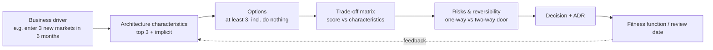

# The architect role & trade-off thinking

!!! abstract "At a glance"
    **Priority:** P0 · **Complexity:** 2/5 · **Est. time:** 2 h · **Phase:** 1 · **Prereqs:** [Staff archetypes](../staff-skills/staff-archetypes.md), [Decision-making under ambiguity](../staff-skills/decision-making.md)
    **You're done when:** given any design choice, you can name at least three architecture characteristics it trades against each other, identify the top three that matter for the business driver, and record the decision as an ADR in under 20 minutes.

## Why it matters

The jump from senior engineer to Staff/Principal architect is less about knowing more patterns and more about **changing the unit of work**: you stop optimising a component and start optimising a *set of trade-offs across teams, time and money*. The two "laws" from *Fundamentals of Software Architecture* (Richards & Ford) are the whole job in two lines:

1. **Everything in software architecture is a trade-off.** If you think you found something that isn't, you haven't found the trade-off yet.
2. **Why is more important than how.** A diagram without the reasoning is a liability once the author leaves.

In 2026 this matters more, not less. LLMs will happily generate a microservices layout, a Kafka topology or a LangGraph agent in seconds; what they cannot do is know that *your* organisation has two platform engineers, a regulator who audits every cross-border data flow, and a CFO who cut the cloud budget 20%. Architecture judgment — framing, trade-off analysis, and getting humans to commit — is the part of the job that AI makes *more* valuable. Interviews at Staff+ probe exactly this: "What would make you change your mind?" "What did you give up?"

## Core concepts

### What an architect actually does

Richards & Ford list eight expectations; compressed for a Staff/Principal context:

| Expectation | What it looks like in practice | Failure mode |
|---|---|---|
| Make architecture decisions | Guide technology choices through principles and ADRs, not by dictating libraries | Ivory tower: decisions nobody follows |
| Continually analyse the architecture | Re-assess viability as load, team and business change ("architecture vitality") | Architecture is a one-time document |
| Keep current with trends | Tech radar, spikes, reading — then *filter* for your context | Resume-driven architecture |
| Ensure compliance with decisions | Fitness functions, review gates, platform defaults | Rules exist only on a wiki |
| Diverse exposure | Know several stacks well enough to compare | Golden hammer |
| Business domain knowledge | Speak the language of revenue, risk and customers | Technically correct, commercially irrelevant |
| Interpersonal skills | Negotiation, facilitation, writing | "Right" architecture, zero adoption |
| Understand and navigate politics | Know who funds, who blocks, who operates | Surprised in the steering committee |

Gregor Hohpe's **Architect Elevator** metaphor captures the Staff+ version: you ride between the "penthouse" (strategy, finance, executives) and the "engine room" (code, infra, incidents), translating in both directions. An architect who only lives in the penthouse draws boxes that don't run; one who only lives in the engine room optimises things that don't matter.

### Architecture characteristics ("-ilities")

Architecture characteristics are the non-domain qualities a system must exhibit. They are *where trade-offs live*.

| Category | Examples | Typical tension |
|---|---|---|
| Operational | availability, performance, scalability, elasticity, recoverability, reliability | availability vs consistency; performance vs cost |
| Structural | modifiability, extensibility, maintainability, portability, deployability, testability | extensibility vs simplicity; portability vs using managed services |
| Cross-cutting | security, privacy, compliance, observability, accessibility, cost (FinOps) | security vs developer velocity; observability vs data minimisation |
| AI-era additions | evaluability, output quality, groundedness, cost-per-task, latency to first token, model portability | quality vs cost vs latency (the "LLM triangle") |

Senior-level nuance:

- **Pick the top three, not twelve.** Every characteristic you support costs design effort and complexity. Richards & Ford recommend asking stakeholders to choose the three most important from a list — the argument you get into *is* the requirement.
- **Implicit characteristics** (security, basic availability) are never in the requirements but will be in the post-mortem. Name them anyway.
- **Characteristics must be measurable** or they cannot be governed: "scalable" → "sustain 5k orders/s at p99 < 300 ms with linear cost".
- **Architecture quantum** — the smallest independently deployable unit with high functional cohesion and synchronous connascence — is the scope at which characteristics can differ. If the checkout and the catalogue need different availability, they probably need to be different quanta.

### Trade-off analysis as a repeatable method

A junior compares options on features; an architect compares them on **consequences**.

Techniques that work in the room:

1. **Always include "do nothing" and "buy"**. It forces you to articulate the cost of change.
2. **Weighted decision matrix**, but treat the numbers as a conversation aid, not an oracle. The weights expose disagreement.
3. **Reversibility check** (Bezos's one-way vs two-way doors). Spend analysis effort proportional to the cost of reversal. Choosing a message broker for one service = two-way door. Choosing the event schema contract used by 40 consumers = nearly one-way.
4. **"Out of context" trap**: Ford/Richards/Sadalage/Dehghani (*The Hard Parts*) warn against evaluating a trade-off against characteristics that don't matter for *this* system. A framework that is "10x faster" is irrelevant if the SLO is 2 s and the bottleneck is a partner API.
5. **Model the second-order effect**: who operates it, who is on call, what the migration costs, what happens when it fails.
6. **Architecture risk storming**: grid of components × characteristics, each cell rated likelihood × impact (1–9); the team fills it independently, then discusses deltas.

Example trade-off matrix (sync REST vs async events for order → fulfilment):

| Characteristic (weight) | Sync REST | Async events (Kafka) | Workflow engine (Temporal) |
|---|---|---|---|
| Availability of order intake (3) | 1 — fails if fulfilment down | 3 — decoupled | 3 |
| Consistency / user feedback (2) | 3 — immediate | 1 — eventual, needs status UX | 2 — durable status |
| Operability with current team (2) | 3 | 2 — needs Kafka skills | 1 — new platform |
| Debuggability (1) | 3 | 1 — needs tracing across topics | 3 — built-in history |
| **Weighted** | **17** | **16** | **17** |

The tie is the point: the conversation shifts to "which weight is wrong?" — often uncovering that order intake availability during peak is worth far more than assumed.

### Decision rights and governance

- **Decide at the lowest responsible level.** An architect's leverage comes from principles, paved roads and guardrails, not from approving every PR. Use an *advice process* (anyone can decide after seeking advice from those affected and experts — see Andrew Harmel-Law's *Facilitating Software Architecture*).
- **Architecturally significant decisions** are those that affect structure, characteristics, dependencies, interfaces or construction techniques. Only these need ADRs and review.
- **Last responsible moment**: defer decisions until the cost of not deciding exceeds the cost of deciding — but not later. Staff engineers are often the ones who notice a decision is *overdue*.

### The AI-era architect

- **Treat models as volatile dependencies.** A model you pick today will be deprecated within 12–18 months. Portability (a port for "LLM completion"), eval suites and cost telemetry become architecture characteristics.
- **Non-determinism is a first-class quality attribute.** Traditional characteristics assume the same input gives the same output. With LLM components you trade determinism for capability and must design verification (evals, guardrails, human review) as part of the architecture.
- **AI accelerates the "how", not the "why".** Coding agents make it cheap to produce code and even prototypes of three options. Use that: build throwaway spikes of each option and let the trade-off matrix be evidence-based, not opinion-based.

### Senior-level nuance juniors miss

- There is no "best practice", only "practice that fits this context". Say *"it depends on X; here is how X changes the answer"*.
- The most expensive architecture failures are organisational (unclear ownership, misaligned incentives), not technical.
- Architects must be **hands-on enough** to keep credibility — Richards & Ford suggest doing proofs of concept, fixing tech-debt stories and automating fitness functions rather than owning critical-path features (you'll become the bottleneck).
- Record what you *rejected* and why. Future-you will be asked "why didn't we use X?" repeatedly.

## Resources

| Resource | Type | Why this one | Level | Cost |
|---|---|---|---|---|
| [Fundamentals of Software Architecture, 2nd ed. (Richards & Ford)](https://fundamentalsofsoftwarearchitecture.com/) | book | The canonical treatment of characteristics, the two laws and the architect role; 2e (2025) adds GenAI material | intermediate | paid |
| [Developer to Architect lessons (Mark Richards)](https://www.developertoarchitect.com/lessons/) :gem: | video | 10-minute weekly lessons on trade-offs, soft skills and styles; incredibly high signal per minute | intermediate | free |
| [The Architect Elevator (Gregor Hohpe)](https://architectelevator.com/) | book/article | Best articulation of the Staff+ architect as translator between strategy and engine room | advanced | paid |
| [Martin Fowler — Software Architecture Guide](https://martinfowler.com/architecture/) | article | Short, opinionated essays on what architecture is ("the important stuff, whatever that is") | intermediate | free |
| [Scaling the Practice of Architecture, Conversationally (Harmel-Law)](https://martinfowler.com/articles/scaling-architecture-conversationally.html) :gem: | article | The advice process — decentralised decision-making that actually works in larger orgs | advanced | free |
| [Olaf Zimmermann — Architectural decision making](https://www.ozimmer.ch/practices/2020/04/27/ArchitectureDecisionMaking.html) :gem: | article | Practical, research-backed guidance on when and how to make and record decisions | advanced | free |
| [Neal Ford — Architectural Katas](https://nealford.com/katas/) | interactive | Practice trade-off reasoning with realistic requirements; use in study groups | intermediate | free |
| [StaffEng — Staff archetypes](https://staffeng.com/guides/staff-archetypes/) | article | Where the "architect" archetype fits among Staff roles | intermediate | free |

## Hands-on lab

**Goal:** practise a trade-off analysis end-to-end on a decision you actually face (or the one below). 60–90 min.

1. Scenario: *"A container-shipping booking platform must add AI-generated booking suggestions to its customer portal within one quarter. Current system: Java monolith + Oracle, 400 bookings/min at peak, strict data residency (EU, IN)."*
2. List ten candidate characteristics; pick the top three (and name two implicit ones). Write one measurable target per characteristic.
3. Generate three options (e.g. *LLM calls inside the monolith*, *separate Python AI service behind a port*, *managed agent platform*). Include "do nothing / rules-based suggestions".
4. Fill a weighted trade-off matrix; mark each option as one-way or two-way door.
5. Write a one-page ADR (context, decision, consequences, rejected options) — see [ADRs](adrs.md).
6. Define one fitness function that would tell you in 3 months whether the decision is holding (e.g. "p95 suggestion latency < 1.5 s and cost < $0.01 per suggestion, measured weekly").

**Expected output:** a matrix with visible disagreement on weights, an ADR, and one automated or scheduled check. Save it under `docs/log/` for your capstone.

## Questions

### L1 — Recall

??? question "Q1. State the two laws of software architecture from Richards & Ford and explain why the second matters operationally."
    ??? success "Answer"
        1. *Everything in software architecture is a trade-off.* 2. *Why is more important than how.*

        The second matters operationally because systems outlive their authors. Without recorded reasoning, later engineers cannot tell whether a constraint still holds, so they either cargo-cult it (keeping a costly pattern whose driver disappeared) or remove it (reintroducing the risk it mitigated). ADRs and fitness functions are the operational expression of law 2.

??? question "Q2. What is an architecture characteristic and what three criteria make something one?"
    ??? success "Answer"
        An architecture characteristic is a non-domain design consideration the system must support. Richards & Ford's criteria: it (1) specifies a non-domain design consideration, (2) influences some structural aspect of the design (it needs special structural support, not just code), and (3) is critical or important to the application's success. "Must be fast" only qualifies if meeting it requires structural decisions (caching tier, async processing, separate quantum).

??? question "Q3. Define 'architecture quantum' and why it matters for choosing a style."
    ??? success "Answer"
        An independently deployable artifact with high functional cohesion, high static coupling (what it needs to run) and synchronous dynamic coupling. It matters because characteristics apply per quantum: a monolith is one quantum, so the whole thing must meet the strictest availability/scalability requirement. If parts need very different characteristics (e.g. 99.99% intake vs 99% reporting), you need multiple quanta — a driver toward distributed styles.

??? question "Q4. What is the difference between a one-way and a two-way door decision? Give an architecture example of each."
    ??? success "Answer"
        A two-way door is cheap to reverse; decide quickly and learn. A one-way door is expensive or impossible to reverse; invest in analysis. Two-way: choice of HTTP client library or an internal service's queue implementation behind an interface. One-way (or near): public event schemas consumed by many teams, primary datastore for a system of record with years of data, multi-tenant isolation model, publishing a public API.

### L2 — Apply

??? question "Q5. A product manager says the new customs-declaration service must be 'scalable, secure, fast, flexible and highly available'. Turn this into architecture characteristics you can design for."
    ??? success "Answer"
        Ask for the business driver and force ranking. Then make each measurable:

        - *Scalability*: "handle 3x current peak (1,200 declarations/min) during quarter-end, linear cost".
        - *Availability*: "99.9% for submission during business hours in each region; declarations must never be lost (durability > availability)".
        - *Performance*: "p95 submission ack < 500 ms; customs authority response is async".
        - *Security/compliance*: "data residency per country, audit trail of every change, PII encrypted at rest".
        - *Flexibility* → *extensibility*: "add a new country's rules in < 2 weeks without redeploying others".

        Top three likely: durability/availability of submission, extensibility per country, compliance. "Fast" is probably not top-3 because the authority is the bottleneck. The ranking drives a design with an append-only submission log, per-country rule plugins, and async status updates.

??? question "Q6. Your team wants to adopt a vector database for a new RAG feature. Run a quick trade-off analysis against using pgvector in the existing Postgres."
    ??? success "Answer"
        Characteristics: operability (team knows Postgres), transactional consistency with source data, scale (vector count, QPS), filtering/hybrid search, cost, lock-in.

        - pgvector: one system to operate and back up; joins/filters with relational data in one query; transactional consistency; good to tens of millions of vectors with HNSW; tuning shared with OLTP workload (noisy neighbour risk).
        - Dedicated DB (Qdrant etc.): better at very large scale, richer filtering/quantisation, isolated resources; new operational surface, dual-write/sync pipeline, eventual consistency.

        Decision rule of thumb: start with pgvector behind a `VectorStore` port unless you already know you need > ~50–100M vectors or very high QPS, or the OLTP DB is already hot. It's a two-way door *if* you keep the port abstraction and an embedding re-index pipeline. See [Vector databases](../agentic-ai/vector-databases.md).

??? question "Q7. You're asked to approve a design that uses GraphQL federation across 6 services. What questions do you ask before giving an opinion?"
    ??? success "Answer"
        - What is the business driver — client flexibility, reducing BFF sprawl, mobile bandwidth?
        - Who owns the gateway/supergraph and its on-call? Is there a platform team?
        - What are the top characteristics — latency (N+1 across subgraphs), security (field-level authz), evolvability (schema checks in CI)?
        - What alternatives were considered (BFF per client, REST + composition)?
        - What's the failure mode when one subgraph is down — partial responses acceptable?
        - How reversible is it — will clients couple to the federated schema?
        - Team skills and operational maturity (tracing, persisted queries, cost limits).

        The point is to evaluate against *their* drivers, not your preference.

### L3 — Design & trade-offs

??? question "Q8. Two principal engineers disagree: one wants a modular monolith, the other microservices for a new logistics visibility platform. How do you run the decision so it sticks?"
    ??? success "Answer"
        1. Reframe from styles to drivers: team count and growth, deployment independence needs, differing characteristics per area (e.g. high-volume tracking ingest vs low-volume admin), operational maturity.
        2. Agree the top three characteristics with product and ops *before* discussing options.
        3. Generate options including hybrids: modular monolith with an extracted ingest service is often the answer.
        4. Trade-off matrix; have each principal fill it independently and compare — disagreement reveals assumption differences (e.g. "we'll have 8 teams in a year" vs "3").
        5. Identify what evidence would change minds and run a time-boxed spike or load test.
        6. Decide (named decider), record ADR with rejected option and *trigger conditions for revisiting* (e.g. "if > 4 teams commit to the monolith weekly and lead time > 2 days, extract modules").
        7. Encode module boundaries with fitness functions (import-linter/ArchUnit) so the monolith option doesn't rot.

        Sticking power comes from both principals seeing their concerns captured as explicit triggers.

??? question "Q9. When is 'defer the decision' the wrong answer? Give criteria."
    ??? success "Answer"
        Deferral is wrong when: (a) the cost of delay is compounding — teams are building divergent solutions (e.g. three auth approaches); (b) the decision is on the critical path of others' work or a regulatory deadline; (c) data is accumulating in a shape that becomes a one-way door (schemas, identifiers, tenancy model); (d) you already have enough information and are deferring to avoid conflict. The last responsible moment is the point where *not* deciding eliminates an option. A Staff engineer's job is often to notice when a deferred decision has passed that point and force it.

??? question "Q10. A team proposes putting an LLM directly in the order-validation path to 'handle messy addresses'. Evaluate the architecture trade-offs."
    ??? success "Answer"
        Characteristics affected: latency (hundreds of ms to seconds), availability (external provider SLOs, rate limits), determinism/auditability (same address may normalise differently), cost per order, data privacy (PII to a third party, residency), testability.

        Alternatives: deterministic address normalisation library/service first; LLM only as a fallback for the ~5% that fail; async enrichment rather than blocking validation; human queue for low-confidence cases.

        Recommended design: LLM behind a `AddressNormaliser` port, called only on fallback, with structured output validated against a schema, confidence threshold, cached results keyed by normalised input, timeout + circuit breaker falling back to "accept and flag for review". Add an eval set of real messy addresses and track accuracy/cost in production. This preserves order-intake availability while capturing the capability.

### L4 — Staff-level ambiguity

??? question "Q11. You join a 300-engineer company as Principal Architect. There is no architecture practice, 40 services, and leadership wants 'an architecture strategy' in 90 days. What do you do?"
    ??? success "Answer"
        Days 0–30, *listen and map*: interview 20–30 people across levels; collect incident themes, lead-time data, cost hotspots; draw a current-state C4 context/container map and a team/ownership map. Identify the 3–5 business drivers for the next 2 years.

        Days 30–60, *diagnose and choose*: write a diagnosis (Rumelt: diagnosis → guiding policy → coherent actions). Likely themes: unclear service ownership, inconsistent integration, no decision records. Establish lightweight mechanisms: ADR template + repo, an advice forum (not an approval board), a tech radar.

        Days 60–90, *show value*: pick 1–2 visible, painful problems and help teams fix them (e.g. an outbox pattern standard eliminating lost events; a paved road for new services). Publish the strategy as principles + target-state sketches + a sequenced roadmap with owners.

        Throughout: avoid an ivory tower — decisions made by teams with advice; measure outcomes (lead time, incident rate, cost per transaction) rather than compliance. Include AI adoption guardrails (model gateway, eval standards) since every team will be building LLM features.

??? question "Q12. Your CTO wants every team to 'go AI-first' and asks you to define the architectural guardrails. What do you put in place and what do you deliberately NOT standardise?"
    ??? success "Answer"
        Standardise the *seams and risks*: (1) a model/LLM gateway for auth, quotas, cost attribution, provider failover and logging; (2) data classification rules for what may go to which model/provider; (3) an eval standard — every LLM feature ships with an offline eval set and a production quality metric; (4) observability via OTel GenAI conventions (noting they're still in Development status as of mid-2026) into a shared tracing backend; (5) security baseline: OWASP LLM/Agentic Top 10, no agent with the lethal trifecta without human approval; (6) ADRs for any agent with write access to systems of record.

        Deliberately do *not* standardise: the agent framework (LangGraph vs Pydantic AI vs Spring AI), prompt style, or model choice per use case — these are two-way doors and the landscape changes monthly. Provide paved-road templates instead of mandates. Revisit quarterly with a radar.

## Real-world use cases

- **Amazon Prime Video monitoring (2023):** a team moved an audio/video quality-monitoring pipeline from distributed serverless components to a single process and reported ~90% cost reduction. The lesson isn't "monoliths win" — it's that the chosen characteristics (elasticity, independent scaling) weren't the ones that mattered for that workload (cost, data transfer).
- **Shipping line booking platform:** availability of booking intake at peak (vessel cut-off times) dominates consistency of downstream allocation; trade-off analysis pushes to async allocation with explicit "pending" states visible to customers.
- **Bank payments modernisation:** auditability and correctness beat time-to-market; architects accept slower delivery and invest in event-sourced ledgers and reconciliation.
- **SaaS start-up at 15 engineers:** deployability and simplicity dominate; the architect's job is to *prevent* premature microservices and keep a well-modularised monolith.
- **Enterprise GenAI rollout:** cost per task and data residency become top characteristics, leading to a central LLM gateway and per-region model deployments.

## Pitfalls & anti-patterns

- **Ivory tower architect**: decisions without implementation context or feedback loops.
- **Resume-driven design**: choosing technology for learning value rather than business fit.
- **Supporting every -ility**: generic architectures that are complex and excellent at nothing.
- **Analysis paralysis** on two-way doors; **snap decisions** on one-way doors.
- **Decisions without records**: re-litigating the same debate every six months.
- **Frozen caveman**: rejecting options based on a failure from a different context years ago.
- **Treating the LLM as deterministic**: no evals, no fallback, no cost ceiling.

## Checklist

- [ ] I can explain the two laws, architecture characteristics and architecture quantum without notes
- [ ] I can run a weighted trade-off matrix including "do nothing" and mark reversibility
- [ ] I produced an ADR and one fitness function for the lab scenario
- [ ] I can list the AI-era characteristics (evaluability, cost per task, model portability) and when they dominate
- [ ] I answered all L3 questions out loud in < 3 min each
