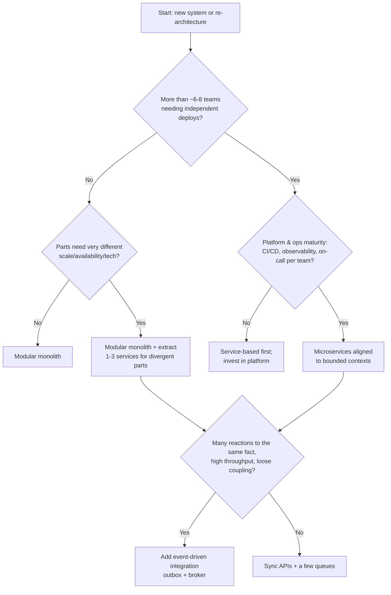

# Architecture styles: modular monolith → microservices → event-driven → serverless

!!! abstract "At a glance"
    **Priority:** P0 · **Complexity:** 3/5 · **Est. time:** 4 h · **Phase:** 1 · **Prereqs:** [Architect role & trade-offs](architect-role-tradeoffs.md), [Scalability fundamentals](../system-design/scalability-fundamentals.md)
    **You're done when:** for any system brief you can pick a style (or hybrid), justify it against the top three characteristics and team topology, name what you give up, and describe the migration path to the next style if the drivers change.

## Why it matters

The architecture style is the most expensive decision to reverse after the data model. The industry has swung from monoliths (2000s) to microservices (2014–2020) and back toward **modular monoliths plus a few extracted services** (2022+), with event-driven and serverless used surgically. Staff engineers are expected to cut through fashion: Segment's "Goodbye Microservices", Prime Video's monitoring consolidation, and Shopify's modular monolith are standard interview talking points precisely because they show that *style follows drivers*.

In AI-era systems, style decisions reappear at a new level: is an agent system a single process with tools (monolith), a set of cooperating agents over A2A (microservices), or a set of event-driven workers reacting to a stream (EDA)? The same trade-offs — coupling, consistency, operability — apply.

## Core concepts

### The style landscape

Richards & Ford split styles into **monolithic** (one deployment unit) and **distributed** (many).

| Style | Partitioning | Deploy units | Sweet spot | Main cost |
|---|---|---|---|---|
| Layered (n-tier) | technical (UI/service/data) | 1 | small CRUD apps, simple teams | changes cut across all layers; "big ball of mud" drift |
| Modular monolith | domain (modules) | 1 | most products < ~50–80 engineers | needs enforced boundaries; one scaling/availability profile |
| Microkernel (plugin) | core + plugins | 1 (usually) | product with customer/country variants, IDEs, rules engines | plugin contract design; core becomes bottleneck |
| Service-based | domain, coarse (4–12 services), often shared DB | few | pragmatic modernisation, internal enterprise apps | shared DB coupling |
| Microservices | domain, fine-grained, DB per service | many | many autonomous teams, very different characteristics per area | distributed-systems tax: network, consistency, ops, observability |
| Event-driven (broker/mediator) | by event/reaction | many | high-throughput, reactive, fan-out, integration | eventual consistency, debugging, schema governance |
| Space-based | processing units + in-memory data grid | many | extreme, spiky concurrency (ticketing, auctions) | complexity, data sync, cost |
| Serverless / FaaS | function per event | very many | spiky/low-duty-cycle workloads, glue, event handlers | cold starts, vendor coupling, limits, local testing |

### How to choose: drivers, not fashion



Rules of thumb (not laws):

- **Team count drives style more than traffic.** Microservices solve a *coordination* problem (many teams stepping on each other's deploys). Traffic can be solved in a monolith with horizontal scaling and caching.
- **Microservice premium** (Fowler): below a certain complexity, microservices reduce productivity. Start monolith-first unless you *know* the boundaries (e.g. second system in a well-understood domain).
- **Distributed monolith** = worst of both: many deploy units, lock-step releases, shared DB, synchronous chains. Symptom: "we have to deploy services A, B and C together."
- **One DB per service is the defining constraint** of microservices. If you share a database you have service-based architecture — which is fine, just be honest.

### Modular monolith: the default in 2026

A modular monolith is one deployable, internally split into modules aligned with bounded contexts, each with a **public API** (facade/interface) and **private internals** (including its tables/schema).

- Enforce boundaries with tooling: `import-linter` (Python), ArchUnit/Spring Modulith (Java), module-private DB schemas, and per-module ownership in CODEOWNERS.
- Communicate between modules via in-process interfaces or **in-process domain events** (Spring Modulith's event publication registry persists them — effectively an outbox).
- Extraction later becomes mechanical: the module's facade becomes an API client; its events go to a broker.

```python
# modules/booking/api.py  -- the only thing other modules may import
from dataclasses import dataclass
from typing import Protocol

@dataclass(frozen=True)
class BookingSummary:
    booking_id: str
    status: str

class BookingApi(Protocol):
    def get_summary(self, booking_id: str) -> BookingSummary: ...
    def confirm(self, booking_id: str) -> None: ...
```

```ini
# .importlinter -- fails CI if modules reach into each other's internals
[importlinter:contract:booking-encapsulation]
name = Only booking.api is public
type = forbidden
source_modules = app.modules.invoicing, app.modules.tracking
forbidden_modules = app.modules.booking.domain, app.modules.booking.adapters
```

### Microservices: what you actually sign up for

Benefits: independent deploy and scale, fault isolation, technology heterogeneity, team autonomy (Conway alignment).

Costs you must budget for (Chris Richardson's "dark energy vs dark matter" frames them as forces *toward* decomposition vs *toward* keeping things together):

- **Network**: latency, partial failure → timeouts, retries, idempotency, circuit breakers ([reliability patterns](../system-design/reliability-patterns.md)).
- **Data**: no cross-service ACID → sagas, outbox, CQRS views ([sagas & outbox](sagas-outbox.md)).
- **Operations**: per-service CI/CD, observability (distributed tracing is mandatory), on-call, security (mTLS, service identity).
- **Contracts**: versioning and schema evolution ([API contracts](api-contracts-versioning.md)).
- **Testing**: contract tests replace a lot of end-to-end tests.

Sizing guidance: a service should be owned by one team, be deployable independently, and map to a bounded context or a sub-part of one. "Micro" is about *independence*, not lines of code. Uber's move to **domain-oriented microservice architecture (DOMA)** — grouping thousands of services into domains with gateways — shows what happens when granularity is driven by convenience rather than boundaries.

### Event-driven architecture

Two topologies (Richards & Ford):

| | Broker topology | Mediator topology |
|---|---|---|
| Control | Choreography: services react to events, no central brain | Orchestration: mediator directs steps |
| Coupling | Low; easy to add consumers | Higher; mediator knows the workflow |
| Error handling | Hard; no one owns the whole flow | Centralised; retries/compensation in one place |
| Visibility | Needs tracing + process mining | Workflow state is explicit |
| Fit | Fan-out notifications, analytics, integration | Business processes with steps and compensation (orders, claims) |

Event types matter: **event notification** (thin, "OrderPlaced id=123" → consumers call back), **event-carried state transfer** (fat, contains data → consumers keep local copy), **event sourcing** (events are the source of truth), and **CQRS** (Fowler's "What do you mean by Event-Driven?"). Mixing them up causes most EDA pain.

### Serverless

Use for: spiky or low-duty-cycle workloads, event handlers (S3/Blob triggers, queue consumers), scheduled jobs, glue code, and increasingly for **LLM tool endpoints** that are called sporadically.

Avoid or be careful when: steady high throughput (containers are cheaper), long-running work (use durable functions / workflow engines), latency-sensitive paths with cold-start risk, heavy local state, or strict portability requirements. Serverless shifts cost from ops to vendor coupling and architecture complexity (hundreds of functions = a distributed system you didn't design).

### AI-era mapping

| Classic style | AI-system analogue | Choose when |
|---|---|---|
| Modular monolith | Single agent/workflow process with tools as in-process modules | Most use cases; easiest to eval and debug |
| Microservices | Agents as services behind A2A/MCP, owned by different teams | Different teams own capabilities; different security zones |
| Event-driven | Agents as consumers on a stream (e.g. "ShipmentDelayed" → re-plan agent, notify agent) | Reactive automation; many independent reactions |
| Serverless | MCP tool servers / eval jobs on FaaS | Bursty tool usage, batch evals |

Anthropic's "Building effective agents" advice — start with the simplest workflow, add agentic autonomy only when needed — is the monolith-first rule restated.

### Migration paths between styles

- **Layered → modular monolith**: introduce modules by domain, move code, enforce with import rules. Low risk.
- **Monolith → microservices**: strangler fig, extract the module with the most divergent characteristics or highest change rate first ([legacy modernization](legacy-modernization.md)). Split data last and carefully.
- **Microservices → fewer services (re-consolidation)**: merge services with high change coupling or chatty sync calls; keep external contracts; merge DB schemas. Segment did this.
- **Sync → event-driven**: add outbox, publish events alongside existing APIs, migrate consumers, then remove sync calls.

## Resources

| Resource | Type | Why this one | Level | Cost |
|---|---|---|---|---|
| [Fundamentals of Software Architecture, 2nd ed.](https://fundamentalsofsoftwarearchitecture.com/) | book | Style-by-style chapters with star ratings per characteristic — the best comparison tables available | intermediate | paid |
| [Microservices (Lewis & Fowler)](https://martinfowler.com/articles/microservices.html) | article | The defining article; read for the characteristics, not the hype | intermediate | free |
| [MonolithFirst (Fowler)](https://martinfowler.com/bliki/MonolithFirst.html) | article | Short argument for monolith-first with the counter-arguments | intermediate | free |
| [microservices.io pattern language (Richardson)](https://microservices.io/patterns/microservices.html) :gem: | docs | Every decomposition and data pattern with forces and consequences; the "dark matter" force articles are superb | advanced | free |
| [Microservices Patterns, 2nd ed. (Richardson)](https://www.manning.com/books/microservices-patterns-second-edition) | book | Deepest treatment of sagas, CQRS, decomposition with Java examples | advanced | paid |
| [What do you mean by "Event-Driven"? (Fowler)](https://martinfowler.com/articles/201701-event-driven.html) :gem: | article | Clears up the four meanings of event-driven in ten minutes | intermediate | free |
| [Azure Architecture Center — architecture styles](https://learn.microsoft.com/en-us/azure/architecture/guide/architecture-styles/) | docs | Vendor-neutral-enough comparison with when-to-use/when-not guidance | intermediate | free |
| [Goodbye Microservices (Segment/Twilio)](https://www.twilio.com/en-us/blog/developers/best-practices/goodbye-microservices) | article | Real re-consolidation story with numbers and reasoning | intermediate | free |
| [Deconstructing the monolith (Shopify)](https://shopify.engineering/deconstructing-monolith-designing-software-maximizes-developer-productivity) :gem: | article | How a very large Rails monolith was modularised instead of split | intermediate | free |
| [Spring Modulith reference](https://docs.spring.io/spring-modulith/reference/) | docs | Concrete Java tooling for modular monoliths: module verification, event publication registry | intermediate | free |

## Hands-on lab

**Goal:** feel the difference between a modular monolith and a distributed one. 90–120 min.

1. Create a FastAPI app with three modules: `booking`, `invoicing`, `tracking`, each with `api.py`, `domain/`, `adapters/`.
2. Add an `import-linter` contract forbidding cross-module imports except via `api`. Deliberately violate it; see CI fail.
3. Implement "booking confirmed → invoice created" as an in-process domain event dispatched after commit.
4. Now extract `invoicing` into a second FastAPI process. Replace the in-process event with an outbox table + a poller publishing to Redis Streams (or Kafka via Docker).
5. Kill the invoicing process, confirm bookings, restart it: invoices should catch up.
6. Write down what you had to add in step 4 (retry, idempotency key, correlation id, tracing) — that list *is* the microservices premium.

**Expected output:** working repo, a failing then passing import contract, and a short note quantifying the extra moving parts. Reuse as the capstone's skeleton.

## Questions

### L1 — Recall

??? question "Q1. What distinguishes a modular monolith from a layered monolith?"
    ??? success "Answer"
        Partitioning. A layered monolith is partitioned *technically* (controllers, services, repositories), so a single feature change touches every layer and boundaries between business areas are implicit. A modular monolith is partitioned by *domain* — each module owns its logic, data and public API, with internals hidden. It is still one deployable, but change is localised and modules can later be extracted.

??? question "Q2. What is a distributed monolith and what are its symptoms?"
    ??? success "Answer"
        A system deployed as multiple services that are nevertheless tightly coupled, so it has the operational cost of distribution without the independence benefits. Symptoms: lock-step deployments, shared database tables, long synchronous call chains where one failure cascades, shared libraries with domain logic that force coordinated upgrades, and teams unable to release without others.

??? question "Q3. Compare broker and mediator topologies in event-driven architecture."
    ??? success "Answer"
        Broker: no central coordinator; each service reacts to events and emits new ones (choreography). High decoupling and extensibility, but no single place knows workflow state, so error handling and visibility are hard. Mediator: a central orchestrator receives the initiating event and directs steps via commands. Better for workflows with ordering, compensation and error handling, at the price of coupling to the mediator and a potential bottleneck.

??? question "Q4. Name the four meanings of 'event-driven' that Fowler distinguishes."
    ??? success "Answer"
        Event notification (a thin signal; receiver may call back for data), event-carried state transfer (event includes the data so receivers keep local copies), event sourcing (the log of events is the system of record), and CQRS (separate models for writes and reads, often but not necessarily combined with events).

### L2 — Apply

??? question "Q5. A 25-engineer company (4 teams) runs a Django monolith with slow deploys and frequent merge conflicts. The CTO wants microservices. What do you recommend?"
    ??? success "Answer"
        The pain is coordination and build/test time, not scaling. Recommend a modular monolith first: identify 4–6 bounded contexts, restructure code into modules with public APIs, enforce with import-linter, split the test suite per module and run affected tests only, and introduce per-module CODEOWNERS. Fix deploy pipeline speed (parallel tests, trunk-based development, feature flags). Extract a service only where characteristics diverge — e.g. a high-volume webhook ingest or a Python ML/LLM component with different scaling. Revisit when team count doubles. This gets 80% of the autonomy benefit at 20% of the cost.

??? question "Q6. Estimate whether a serverless design is cheaper than containers for an API with 50 req/s steady, 200 ms avg duration, 512 MB memory."
    ??? success "Answer"
        50 req/s × 86,400 s × 30 ≈ 130M invocations/month. Compute: 130M × 0.2 s × 0.5 GB ≈ 13M GB-s. At typical FaaS pricing (order of $0.0000167 per GB-s plus ~$0.20 per million requests, AWS Lambda-like, check current prices) ≈ $217 + $26 ≈ $240/month, plus API gateway fees which can dominate (~$1–3.50 per million requests → $130–455). Containers: 50 req/s × 0.2 s = 10 concurrent requests; 2–3 small instances (2 vCPU/4 GB) for redundancy ≈ $100–200/month. At steady load containers are usually cheaper and simpler; serverless wins for spiky/low utilisation or where ops headcount is the constraint. The real answer includes ops cost and the gateway line item people forget.

??? question "Q7. Which module would you extract first from a logistics monolith with modules: booking, pricing, document generation, tracking-event ingest, customer admin? Why?"
    ??? success "Answer"
        Tracking-event ingest is the classic first extraction: very different characteristics (high-volume, spiky, append-only), minimal transactional coupling to other modules (it produces events others consume), naturally asynchronous, and failure isolation protects booking. Document generation is a second candidate (CPU-heavy, async, stateless). Avoid pricing and booking first — they're core, highly coupled, and transactional; extracting them early forces sagas where you don't need them.

### L3 — Design & trade-offs

??? question "Q8. Design the style for a container-tracking platform: 20k events/s from carriers, ports and IoT devices; customers query shipment status; alerts on delays; 6 teams."
    ??? success "Answer"
        Hybrid: event-driven backbone for ingest and reaction, services for query and domain logic.

        - Ingest: stateless adapters per source (serverless or containers) normalise into a canonical `ShipmentEvent` on a partitioned log (Kafka, keyed by container/shipment id for ordering).
        - Stream processing: enrichment and ETA computation consumers; delay detection emits `ShipmentDelayed`.
        - Query side: a shipment-status read model (CQRS) in a document or key-value store, updated by consumers; API service serves customers with caching.
        - Alerts: notification service subscribes to delay events (broker topology — easy to add consumers like an LLM re-planning agent).
        - Teams: ingest/integration, tracking domain, ETA/analytics, notifications, customer API, platform.

        Trade-offs: eventual consistency in status (seconds) accepted; schema registry and compatibility rules mandatory; ordering only per key; replay capability for reprocessing after ETA model changes. Rejected: synchronous microservices (can't absorb spikes), single monolith (ingest scale and team count).

??? question "Q9. When is space-based architecture justified, and what would you use instead most of the time?"
    ??? success "Answer"
        Justified for extreme and unpredictable concurrent load on a narrow workflow where the database is the bottleneck — e.g. concert ticket on-sale, online auctions, flash sales — and where eventual write-behind to the DB is acceptable. It uses processing units with replicated in-memory data grids and asynchronous data pumps to persistence. Most of the time you'd instead use caching, queue-based load levelling (virtual waiting room), sharding, and a partitioned log. Space-based is complex and expensive to test; reach for it only when those fail.

??? question "Q10. Your company has 120 microservices for 60 engineers. Incidents often involve 5+ services. Propose a direction."
    ??? success "Answer"
        Diagnosis: granularity far exceeds team count (2 services per engineer); boundaries likely follow technical or entity lines, causing chatty sync chains. Direction: re-consolidate toward bounded contexts. Steps: (1) build a dependency and change-coupling map from traces and git history (services that change together belong together); (2) align ownership — each team owns one domain; (3) merge services within a domain into a small number of deployables, keeping external APIs stable via a gateway; (4) replace sync chains across domains with events where possible; (5) track metrics: incidents spanning > 2 services, lead time, cost. Communicate it as "domain-oriented" consolidation, not a retreat.

### L4 — Staff-level ambiguity

??? question "Q11. Leadership read about Prime Video and wants to 'move everything back to a monolith' to cut cloud costs. How do you respond?"
    ??? success "Answer"
        Don't argue style; argue drivers and evidence. (1) Point out the Prime Video case was one workload whose cost was dominated by inter-component data transfer and orchestration; the lesson is "match style to workload". (2) Run a cost analysis: which services drive spend (compute, data transfer, managed service fees, idle capacity)? Often the fix is rightsizing, reserved capacity, fewer chatty calls, and consolidating tiny services within a domain. (3) Identify candidates where consolidation reduces cost *and* coupling (same team, change together, chatty). (4) Keep independence where team autonomy or divergent characteristics justify it. (5) Propose a phased plan with measured savings per step and an ADR. This reframes a fashion swing into a portfolio decision.

??? question "Q12. Three product teams each built their own LLM agent service with its own vector store, prompt management and model client. Should you consolidate into one 'agent platform' service?"
    ??? success "Answer"
        Separate what is *domain* from what is *platform*. Agents' behaviour, prompts, tools and evals are domain-specific and should stay with the teams (each agent is effectively its own bounded context). Cross-cutting capabilities — model gateway (auth, quotas, cost attribution, failover), tracing/eval infrastructure, vector store as a managed service, guardrail library — are platform concerns suited to a platform team offering them "as a service" (Team Topologies). A single central agent service would create a bottleneck team and couple release cycles. Plan: inventory duplicated capabilities, extract the gateway first (fastest cost/safety win), provide a paved-road template, migrate teams voluntarily with measured benefits, and set standards (eval + tracing) rather than mandating one framework.

## Real-world use cases

- **Shopify**: one of the largest Rails codebases, modularised into components with enforced boundaries (Packwerk) rather than split into microservices.
- **Segment**: consolidated 140+ destination microservices back into a monolith after operational overhead outpaced benefits.
- **Uber**: evolved from sprawling microservices to domain-oriented microservice architecture — domains, layers and gateways.
- **Amazon Prime Video**: moved a monitoring pipeline from serverless/step functions to a single ECS-hosted process, citing ~90% cost reduction.
- **Carrier/freight visibility platforms**: event-driven ingestion of EDI, API and IoT events with CQRS status views are the norm, because ingest volume and query patterns differ so much.

## Pitfalls & anti-patterns

- Choosing microservices for "scalability" when the real problem is team coordination or slow CI.
- Sharing a database between "microservices" and calling it microservices.
- Entity services (CustomerService, OrderService) as thin CRUD wrappers → chatty, anaemic, distributed monolith.
- EDA without schema governance, correlation ids and a dead-letter strategy.
- Serverless sprawl: hundreds of functions with no ownership map.
- Modular monolith without enforcement — it silently becomes a big ball of mud.
- Multi-agent architectures chosen for novelty when a single agent with good tools would do.

## Checklist

- [ ] I can compare 8 styles on deployability, scalability, consistency, cost and operability without notes
- [ ] I can explain the microservice premium and the distributed monolith
- [ ] I built a modular monolith with enforced boundaries and extracted one module
- [ ] I can describe migration paths in both directions (split and consolidate)
- [ ] I answered all L3 questions out loud in < 3 min each
