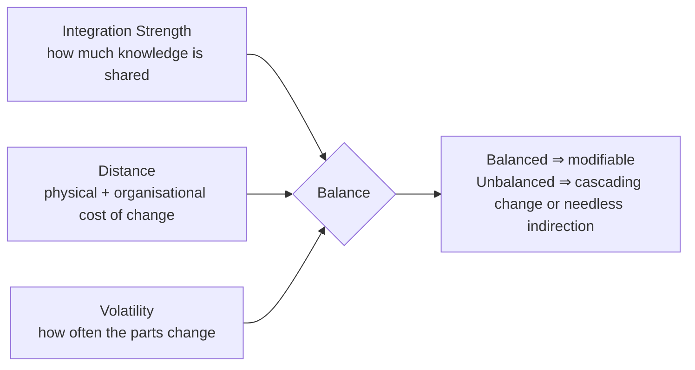

# Coupling, cohesion & modularity (balanced coupling)

!!! abstract "At a glance"
    **Priority:** P0 · **Complexity:** 3/5 · **Est. time:** 3 h · **Phase:** 2 · **Prereqs:** [Architecture styles](architecture-styles.md), [DDD strategic](ddd-strategic.md)
    **You're done when:** you can evaluate any integration between two components on Khononov's three dimensions (strength, distance, volatility), say whether the coupling is balanced, and propose a concrete change (move, merge, add a contract, or leave alone) with a rationale.

## Why it matters

"Reduce coupling" is folk wisdom that sounds right and is often wrong: a system with zero coupling is not a system. Every architecture style debate (monolith vs microservices, shared library vs service, sync vs async) is really a debate about **which coupling, at what distance, between things that change at what rate**. Vlad Khononov's *Balancing Coupling in Software Design* (2024) gives a model that turns this into a practical review tool, building on Myers and Constantine (structured design), Page-Jones (connascence) and Kent Beck ("coupling is a cost of change").

For AI systems the same lens applies: a prompt tightly coupled to one model's quirks, an agent that reaches into another agent's private memory, or a tool schema shared across ten agents are all coupling decisions with strength, distance and volatility.

## Core concepts

### Modularity in one sentence

A module is a unit of change that hides a design decision (Parnas, 1972). Good modularity means most changes touch one module; bad modularity means "shotgun surgery". Coupling is what makes a change in one place *require* a change in another.

- **Cohesion**: how strongly the parts of a module belong together (change together for the same reason). High cohesion = a module has one reason to change.
- **Coupling**: how much a change in one module forces a change in another.
- Khononov's insight: cohesion and coupling are two views of the same thing — *the components that change together should be close*; if they're far apart, you've created costly coupling.

### The three dimensions



**1. Integration strength** — what one component knows about another. From strongest to weakest (Khononov's levels, derived from Myers/Constantine and Page-Jones):

| Level | Meaning | Example |
|---|---|---|
| **Intrusive coupling** | Uses another's implementation details, private state or internals | Reading another service's database tables; reflection into private fields; agent reading another's memory store |
| **Functional coupling** | Shares business logic/knowledge; a change in rules requires change in both | Both services duplicate pricing rules; must change in lock-step |
| **Model coupling** | Shares a domain model | Shared library with `Booking` class; shared Pydantic schema package across services |
| **Contract coupling** | Depends on an integration-specific contract, a deliberately minimal model | Public API/OpenAPI, event schema in a registry, a published language |

Weakest is not "no coupling" — contract coupling is the goal for anything that crosses a boundary: the knowledge shared is intentionally small and versioned.

**2. Distance** — the effort required to change *both* sides: same function < same class < same module < same package < same service < different services < different teams < different companies. Includes the *sociotechnical* dimension: lifecycle coupling (deployed together?), cross-team coordination, and physical distance (network).

**3. Volatility** — how frequently a component changes, driven by business: core subdomains are volatile, generic ones rarely change. Estimate from the subdomain classification ([DDD strategic](ddd-strategic.md)) and git history.

### The balance rule

Khononov's formula (qualitative):

> **Balance = (Strength XOR Distance) OR NOT Volatility**

Read: coupling is fine if (a) strong coupling with low distance (cohesion — things that change together live together), or (b) weak coupling with high distance (distributed with contracts), or (c) the components are not volatile at all (don't care).

| Strength | Distance | Volatility | Verdict | Example |
|---|---|---|---|---|
| Strong | Low | High | **Balanced (high cohesion)** | Aggregate and its repository in one module |
| Weak (contract) | High | High | **Balanced (loose coupling)** | Two teams' services over versioned events |
| Strong | High | High | **Unbalanced — cascading changes (the distributed monolith)** | Two services sharing a DB schema, different teams |
| Weak | Low | High | **Unbalanced — needless complexity** | Internal module wrapped in API + events + mapping layers although always changed together |
| Strong | High | Low | **Tolerable** | Generic auth library shared, rarely changes |
| Any | Any | Low | Tolerable | Stable dependency (e.g. standard library, `Money`) |

Practical reading: *if two things change together often, bring them close or weaken the coupling; don't leave them both strong and far.*

### Connascence: a finer-grained vocabulary

Page-Jones's connascence describes *how* two elements are coupled; weaker forms are easier to refactor. Ordering (weak → strong):

| Static | Dynamic |
|---|---|
| Name (both agree on a name) | Execution order |
| Type | Timing |
| Meaning/convention (magic values) | Value (values must change together) |
| Position (argument order) | Identity (same instance) |
| Algorithm (both implement the same algorithm) | |

Guidelines: convert strong → weak (magic strings → enums/named types; positional → keyword args), and **strength × locality**: strong connascence is acceptable within a function/class, unacceptable across services. Ford & Richards apply this in *Hard Parts* to analyse service coupling; "dynamic" connascence (timing, value, identity) across services is what makes distributed systems hard.

### Types of coupling in distributed systems (Hard Parts / Khononov)

| Type | Symptom | Weakening techniques |
|---|---|---|
| Temporal | Caller needs callee up now | Async messaging, outbox, queues |
| Deployment (lifecycle) | Must release together | Backward-compatible contracts, expand/contract migrations |
| Implementation | Shared DB/internal model | Own your data; ACL; published API |
| Functional | Same rule in two places | Single owner + API/event; or merge |
| Domain/model | Shared library of domain objects | Contract types per boundary; avoid shared "common-domain" libs |
| Semantic | Same words, different meanings | Bounded contexts, ubiquitous language per context |

### Practical review workflow

1. List component pairs that interact (from C4 container diagram, traces, imports).
2. For each: classify **strength** (look at what's shared: DB? library? API? events?).
3. Measure **distance**: same deployable? same team? same repo?
4. Estimate **volatility**: `git log --since=1y` change counts; subdomain type; roadmap.
5. Mark unbalanced pairs; choose a fix:
    - **Move closer**: merge services/modules; co-locate code; same team.
    - **Weaken strength**: introduce a contract (API/event), an ACL, or a published language.
    - **Reduce volatility**: stabilise by extracting the volatile part.
    - **Accept**: low volatility → do nothing (don't refactor stable code for purity).
6. Encode: import-linter/ArchUnit rules, ownership (CODEOWNERS), fitness functions.

Change coupling mining from git (files/modules that change together in the same commits) is a cheap volatility+coupling detector:

```bash
# files changed together most often (rough co-change count for module pairs)
git log --since=12.months --name-only --pretty=format:'--%h' \
 | python3 - <<'PY'
import sys, itertools, collections
commits, cur = [], set()
for line in sys.stdin:
    line = line.strip()
    if line.startswith('--'):
        if cur: commits.append(cur); cur = set()
    elif line:
        cur.add(line.split('/')[0] + '/' + (line.split('/')[1] if '/' in line else ''))
if cur: commits.append(cur)
pairs = collections.Counter(p for c in commits for p in itertools.combinations(sorted(c), 2))
for (a, b), n in pairs.most_common(15): print(n, a, b)
PY
```

Modules that appear together in many commits but live in different services/teams are your unbalanced pairs (tools like CodeScene or `code-maat` do this properly).

### Applying it: shared library vs service vs duplication

| Option | Strength | Distance | When balanced |
|---|---|---|---|
| Shared library with domain logic | Model/functional | Low at compile time, high at deploy time (versions) | Only if stable (low volatility) |
| Shared service (API) | Contract | High | Volatile logic, many consumers, owner team exists |
| Duplicate the code | None at design time | — | Small, low-volatility snippets; beats a shared library that creates lock-step |
| Shared kernel | Model | Low (same team or partnership) | Small, agreed model, close teams |

### AI-era applications

- **Prompt ↔ model coupling**: prompts that rely on one model's formatting quirks are implementation-coupled; wrap in a task port and eval suite so swapping models is a contract change, not a rewrite.
- **Agent ↔ agent**: prefer contract coupling (typed handoff schema, A2A tasks) over shared memory or scratchpad (intrusive).
- **Tool schemas shared by many agents** have high blast radius; treat as versioned public APIs.
- **Vibe-coded code**: AI-generated code tends to add duplication and shortcuts through boundaries; fitness functions for coupling become more, not less, important.

## Resources

| Resource | Type | Why this one | Level | Cost |
|---|---|---|---|---|
| [Balancing Coupling in Software Design (Vlad Khononov)](https://www.informit.com/store/balancing-coupling-in-software-design-universal-design-9780137353484) :gem: | book | The model this page is built on; the best modern treatment of coupling | advanced | paid |
| [coupling.dev](https://coupling.dev/) :gem: | article | Khononov's free introduction to the balanced coupling model | intermediate | free |
| [Software Architecture: The Hard Parts](https://nealford.com/books/) | book | Coupling analysis for decomposing monoliths; sysops squad case study | advanced | paid |
| [microservices.io — dark energy & dark matter](https://microservices.io/articles/dark-energy-dark-matter/dark-matter/minimize-design-time-coupling.html) :gem: | article | Richardson's forces framework: what pulls services apart or together | advanced | free |
| [Learning Domain-Driven Design (Khononov)](https://vladikk.com/) | book | Prequel: where volatility/subdomain classification comes from | intermediate | paid |
| [Tidy First? (Kent Beck)](https://tidyfirst.substack.com/) | article/newsletter | Beck's cost-of-change view of coupling and cohesion | intermediate | freemium |
| [MicroservicePremium (Fowler)](https://martinfowler.com/bliki/MicroservicePremium.html) | article | Complements coupling with the operational cost of distance | intermediate | free |
| [import-linter](https://import-linter.readthedocs.io/) | docs | Turn coupling rules into failing CI checks in Python | intermediate | free |

## Hands-on lab

**Goal:** run a balanced-coupling review on a real codebase. 90 min.

1. Pick a repo you know (or the capstone). Draw a container-level dependency graph (packages/services).
2. Run the git co-change script over 12 months; list the top 15 co-changing module pairs.
3. Build a table: pair, strength level, distance, volatility (H/M/L), verdict from the balance rule.
4. Pick the two worst unbalanced pairs. For each, write a proposal: move/merge, add contract, or accept. Estimate effort and expected reduction in co-change.
5. Encode one rule as an import-linter contract; make CI fail on violation.
6. AI extension: review your LLM integration — list what prompt, parsing and model config each caller knows; propose a port reducing strength to contract level.

**Expected output:** a review table + two proposals + one enforced contract.

## Questions

### L1 — Recall

??? question "Q1. What are the three dimensions of Khononov's balanced coupling model?"
    ??? success "Answer"
        Integration strength (how much knowledge two components share: intrusive > functional > model > contract), distance (effort to change both — code, team, deployment, organisation), and volatility (how often the components change). Balance is achieved when strong coupling is at low distance, weak coupling at high distance, or the components are stable.

??? question "Q2. Order the four integration strength levels from strongest to weakest and give an example of each."
    ??? success "Answer"
        Intrusive (reading another service's tables), functional (duplicated business rules that must change together), model (shared domain library/schema), contract (a versioned public API or event schema deliberately smaller than either internal model).

??? question "Q3. Give three types of connascence and say which is weakest."
    ??? success "Answer"
        Connascence of name (weakest static), type, meaning, position, algorithm; dynamic: execution order, timing, value, identity. Name is the weakest form — agreeing on names is unavoidable and easily refactored with tooling; timing and identity are the hardest.

??? question "Q4. Why isn't 'minimise coupling' a sufficient design goal?"
    ??? success "Answer"
        Components must interact for the system to have value, so some coupling is required. The cost of coupling depends on its strength, the distance and how volatile the parts are. Strong coupling between things that change together at low distance is desirable (cohesion). The goal is *balance*, not minimisation.

### L2 — Apply

??? question "Q5. Two microservices, owned by different teams, share a Postgres schema; both change monthly. Classify and fix."
    ??? success "Answer"
        Strength: intrusive (shared internals), distance: high (two teams, two deployables), volatility: high → unbalanced, cascading changes (distributed monolith). Options: (1) reduce strength — assign table ownership to one service and give the other an API or event feed (contract coupling), possibly a read-replica/projection; (2) reduce distance — merge the services or move them to one team if they truly change together. Pick based on whether the subdomains are really distinct (different language and rules → (1)) or one context split arbitrarily (→ (2)).

??? question "Q6. A shared `common-domain` jar with `Booking`, `Customer` and `Money` is used by 9 services. Every change requires 9 upgrades. Diagnose and propose."
    ??? success "Answer"
        Model coupling across high distance with high volatility on `Booking`/`Customer` → unbalanced. `Money` is stable and generic → fine to share. Split: keep `Money` and identifiers in a tiny stable library; remove `Booking`/`Customer` domain classes and replace with per-service models plus contract types (OpenAPI/event schemas generated from the owning service). Consumers depend on the contract, not the owner's model. Introduce compatibility rules and consumer-driven contract tests.

??? question "Q7. git history shows `pricing/` and `quoting/` change together in 70% of commits though they live in separate services. What do you do?"
    ??? success "Answer"
        High co-change means strong functional coupling with high distance. First check if the shared change reason is a single business concept (quote rules); if so merge into one bounded context/service owned by one team. If the co-change is driven by a contract that keeps evolving (e.g. quoting requesting new fields), stabilise the contract with versioning and consumer-driven tests, or move the volatile piece into the owner. Measure co-change again after 2 months.

### L3 — Design & trade-offs

??? question "Q8. Compare synchronous REST calls vs asynchronous events between Booking and Invoicing on the balanced-coupling model."
    ??? success "Answer"
        REST call: contract-level strength but *temporal* coupling (invoicing must be up), and often functional coupling creeping in via request shape (booking dictates invoicing's fields). Events: contract coupling with no temporal coupling, but semantic coupling to event meaning and schema and higher operational cost. If Booking needs an immediate answer (e.g. credit check), sync is justified; if invoicing is a downstream reaction, events reduce runtime coupling. Volatility matters: if invoicing changes often, use a published event contract so evolutions don't ripple. Also consider distance — if both are in one modular monolith, an in-process interface or domain event is enough.

??? question "Q9. When is duplication better than a shared abstraction?"
    ??? success "Answer"
        When the shared abstraction would create strong coupling at high distance between volatile parts: two teams' code that looks similar today but evolves for different reasons (accidental duplication vs essential). The cost of a shared library — lock-step upgrades, negotiation, lowest-common-denominator design — exceeds the cost of duplicating small, low-volatility snippets. Rule of thumb: share stable, generic, well-understood code (Money, tracing helpers); duplicate or version-per-consumer business logic; wait for the "rule of three" and check that the reasons to change are the same.

??? question "Q10. How would you use coupling analysis to decide which module to extract first from a monolith?"
    ??? success "Answer"
        Score each module on (1) incoming/outgoing strong couplings (shared tables, direct calls), (2) volatility relative to the rest (independent release need), (3) characteristics divergence, (4) team ownership clarity. Best first candidates: low inbound coupling (few callers), high volatility or scaling needs, already contract-shaped edges. Worst: hubs with many strong dependents (e.g. `Customer`). Prepare by weakening strength inside the monolith (introduce API/facade, remove cross-module table access) — if that step is hard, extraction would be harder. Extract when strength is already at contract level and only distance remains to change.

### L4 — Staff-level ambiguity

??? question "Q11. Leadership asks you to 'quantify our coupling problem' to justify a modernisation budget. How do you make it credible?"
    ??? success "Answer"
        Use outcome metrics, not abstract scores: lead time for changes and change failure rate by area; co-change matrices showing cross-team change coupling; percentage of incidents involving 2+ services; number of coordinated releases per quarter; blocked-PR wait times across teams; cost of delay for two representative features. Overlay with the balanced-coupling review to show *why* (unbalanced pairs). Propose a target and leading indicators (co-change ratio, contract-test coverage). Present as investment with expected effect on delivery metrics (DORA) and risk. Include quick wins (a couple of pair fixes) to demonstrate the method before asking for a large budget.

??? question "Q12. Two teams disagree: one wants a shared Protobuf-generated model library for all services; the other wants each service to define its own models from OpenAPI specs. Mediate."
    ??? success "Answer"
        Frame with balanced coupling: a shared generated library of *contract* types owned by the producer (versioned schema, generated per consumer) is contract coupling — acceptable. A single shared library of *domain* models is model coupling at high distance — not acceptable for volatile areas. Recommend: producers own schemas (Protobuf/OpenAPI/AsyncAPI) in a registry with compatibility checks; consumers generate their own client types from the spec and map to internal models via an ACL where the domain differs. Shared common types only for stable primitives (Money, timestamps, ids). Decide with an ADR and a fitness function: no service imports another service's internal domain package.

## Real-world use cases

- **Microservice consolidation**: teams use co-change analysis to find services that should merge (Segment-style re-consolidation).
- **Modular monolith extraction**: contract-level coupling achieved inside the monolith before splitting.
- **Platform libraries**: shared observability/auth libraries kept tiny and stable; domain code kept out.
- **Event schemas**: producers own published languages; consumers ACL into their own models.
- **Agent platforms**: agent-to-agent contracts as typed handoffs; prompt/model coupling isolated behind task ports.

## Pitfalls & anti-patterns

- Treating "loose coupling" as always good — needless indirection between things that always change together.
- Shared domain libraries and "common" modules across teams.
- Shared databases across teams (intrusive coupling at distance).
- Ignoring volatility: refactoring stable code for purity.
- Measuring only static dependencies, not co-change over time.
- Splitting services before weakening coupling inside the monolith.
- Hidden coupling via timing, ordering and identity across services.

## Checklist

- [ ] I can explain strength, distance and volatility and apply the balance rule without notes
- [ ] I ran a co-change analysis and classified at least 10 component pairs
- [ ] I can list connascence types and coupling types in distributed systems
- [ ] I enforced one coupling rule with a CI check
- [ ] I answered all L3 questions out loud in < 3 min each
