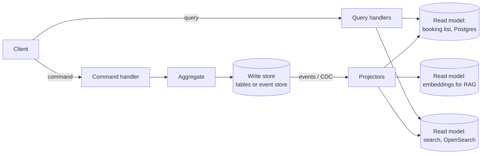

# CQRS & event sourcing

!!! abstract "At a glance"
    **Priority:** P1 · **Complexity:** 4/5 · **Est. time:** 4 h · **Phase:** 3 · **Prereqs:** [DDD tactical](ddd-tactical.md), [Message queues & streaming](../system-design/messaging-streaming.md), [Sagas & outbox](sagas-outbox.md)
    **You're done when:** you can decide — with explicit criteria — whether a context needs CQRS, event sourcing, both or neither; implement an event-sourced aggregate with projections in Python; and explain schema evolution, snapshots, replay and GDPR handling.

## Why it matters

CQRS and event sourcing (ES) are powerful and frequently misapplied. Greg Young, who popularised them, repeatedly warns that ES should be used in a few places, not as a top-level architecture. A Staff architect must be able to (a) spot where they genuinely fit — ledgers, audit-heavy domains, temporal queries, complex read models — and (b) talk a team *out* of them when they'd add years of complexity for no benefit.

AI relevance: event logs are the ideal substrate for agent systems. Agent runs are naturally event-sourced (LangGraph checkpoints, Temporal histories), audit of agent actions requires an immutable log, and "replay with a new model/prompt" is event-sourcing's replay applied to AI evals.

## Core concepts

### CQRS: separate the write model from the read model

Command Query Responsibility Segregation (Greg Young, building on Meyer's CQS) splits a model into:

- **Command side**: processes intent (`ConfirmBooking`), enforces invariants via aggregates, optimised for consistency.
- **Query side**: one or more read models (projections) optimised for specific queries, often denormalised, possibly in different stores (Elasticsearch for search, Redis for dashboards, a columnar store for analytics).



CQRS levels (increasing cost):

| Level | Description | Consistency | When |
|---|---|---|---|
| 0: CQS in code | Separate command and query methods/handlers, same DB | Immediate | Almost always worthwhile |
| 1: Separate read queries | Queries bypass the domain model, use SQL/views directly | Immediate | Complex screens, reporting (Cosmic Python ch. 12) |
| 2: Separate read store | Projections into another table/store, updated async | Eventual | Different query shapes/scale, search, dashboards |
| 3: + Event sourcing | Write side stores events; projections built from them | Eventual | Audit, temporal, complex domains |

### Event sourcing: the log is the source of truth

Instead of storing current state and overwriting it, store the sequence of domain events; current state = fold(events).

```python
from dataclasses import dataclass
from functools import reduce

@dataclass(frozen=True)
class Event:
    stream_id: str
    version: int
    type: str
    data: dict

class Account:                      # event-sourced aggregate
    def __init__(self):
        self.id, self.balance, self.version, self.pending = None, 0, 0, []

    # --- command: validate, then record
    def withdraw(self, amount: int):
        if amount > self.balance:
            raise ValueError("insufficient funds")
        self._raise("Withdrawn", {"amount": amount})

    def deposit(self, amount: int):
        self._raise("Deposited", {"amount": amount})

    # --- event application: pure state transitions, no validation
    def apply(self, e: Event):
        match e.type:
            case "Opened":    self.id = e.stream_id
            case "Deposited": self.balance += e.data["amount"]
            case "Withdrawn": self.balance -= e.data["amount"]
        self.version = e.version
        return self

    def _raise(self, type_, data):
        e = Event(self.id, self.version + 1, type_, data)
        self.apply(e); self.pending.append(e)

    @classmethod
    def rehydrate(cls, events):
        return reduce(lambda acc, e: acc.apply(e), events, cls())
```

```sql
-- minimal event store on Postgres
CREATE TABLE events (
  global_position BIGSERIAL PRIMARY KEY,
  stream_id   TEXT NOT NULL,
  version     INT  NOT NULL,
  type        TEXT NOT NULL,
  data        JSONB NOT NULL,
  metadata    JSONB NOT NULL,         -- correlation_id, causation_id, actor, schema_version
  recorded_at TIMESTAMPTZ NOT NULL DEFAULT now(),
  UNIQUE (stream_id, version)          -- optimistic concurrency: append fails on conflict
);
```

The `UNIQUE (stream_id, version)` constraint gives optimistic concurrency for free: two writers appending version 8 → one fails and retries. Purpose-built stores (KurrentDB, formerly EventStoreDB; Axon Server; Marten on Postgres for .NET) add subscriptions, projections and stream management.

### What ES gives you — and what it costs

| Benefit | Cost |
|---|---|
| Complete audit trail by construction | Every read needs projections or rehydration |
| Temporal queries ("state as of last Tuesday") | Event schema evolution forever (upcasters, versioning) |
| Replay to build new read models or fix bugs | Eventual consistency of read models; UX must handle it |
| Natural integration via events | GDPR "right to erasure" vs immutable log (crypto-shredding) |
| Debugging by replaying production histories | Steep learning curve, fewer engineers experienced |
| Captures intent (`AddressCorrected` vs `AddressChanged`) | Long streams need snapshots; stream design matters |

### Decision criteria

| Signal | CQRS (L1–2) | Event sourcing |
|---|---|---|
| Read and write shapes differ significantly | Yes | Maybe |
| Read scale ≫ write scale | Yes | Not needed |
| Regulatory audit of every change, with intent | Maybe | **Strong yes** |
| Domain is inherently a ledger (money, inventory movements, positions) | — | **Strong yes** |
| Need "as-of" historical state or what-if replay | — | Yes |
| Simple CRUD, supporting subdomain | No | **No** |
| Team new to DDD/async, tight deadline | Level 0–1 only | No |
| Many external integrations need events | Outbox is enough | Optional |

**When NOT to use ES:** CRUD-ish domains, whole-system ES (apply per bounded context, per aggregate type), when you only want an audit log (an audit table or CDC is cheaper), when the team cannot own schema evolution long-term.

### Projections, consistency and UX

- Projectors subscribe to the event stream (catch-up subscription from a checkpoint), update read models idempotently (store last processed position in the same transaction as the read model update).
- **Read-your-writes**: return the new version from the command, and have the query wait until the projection reaches it (or read from the write side for that user's immediate view). Or design UX for pending states ("Booking received — confirming…").
- **Rebuild**: new projection → replay from position 0 into a new table, then switch over (blue/green projections).
- **Snapshots**: store state every N events (e.g. 100–500) for long streams; they're a cache, never the source of truth.

### Schema evolution

Events are forever. Techniques (Greg Young's "Versioning in an Event Sourced System" is the reference):

- **Weak schema / tolerant reader**: add optional fields; consumers ignore unknown fields.
- **Upcasting**: transform old event versions to the new shape on read.
- **New event type** for semantic changes (`BookingConfirmedV2` or a better name).
- **Copy-and-transform** stream migration: rare, heavy, sometimes necessary.
- Never change the *meaning* of an existing event type.

### GDPR and PII

Immutable logs and erasure rights collide. Patterns: keep PII out of events (reference ids, store PII in a deletable store); **crypto-shredding** — encrypt PII per subject with a per-subject key and delete the key on erasure; retention-bounded streams for non-ledger data. Decide before the first event is written.

### AI-era angles

- **Agent runs as event streams**: each step (`ToolCalled`, `ToolReturned`, `HumanApproved`, `ModelResponded`) appended to a stream — gives audit, resumability (durable execution) and replay for evals. LangGraph checkpointers and Temporal event histories are specialised versions of this idea. See [Durable execution & HITL](../agentic-ai/durable-execution-hitl.md).
- **Projections for RAG**: an embeddings index is just another read model built from events; rebuild it when you change chunking or embedding model by replaying.
- **Replay-based evaluation**: re-run historical inputs through a new prompt/model and diff decisions before rollout.

## Resources

| Resource | Type | Why this one | Level | Cost |
|---|---|---|---|---|
| [CQRS (Fowler bliki)](https://martinfowler.com/bliki/CQRS.html) | article | Balanced intro including the warning that most systems shouldn't use it | intermediate | free |
| [Event Sourcing (Fowler)](https://martinfowler.com/eaaDev/EventSourcing.html) | article | Classic explanation of replay, temporal queries and external systems | intermediate | free |
| [event-driven.io (Oskar Dudycz)](https://event-driven.io/en/) :gem: | article | The most practical, current ES/CQRS writing — projections, versioning, myths | advanced | free |
| [CQRS facts and myths explained (Dudycz)](https://event-driven.io/en/cqrs_facts_and_myths_explained/) :gem: | article | Clears up "CQRS requires ES / two databases" misconceptions | intermediate | free |
| [Cosmic Python — CQRS chapter](https://www.cosmicpython.com/book/chapter_12_cqrs.html) | book | Pragmatic Python CQRS without event sourcing | intermediate | free |
| [microservices.io — Event sourcing](https://microservices.io/patterns/data/event-sourcing.html) | docs | Pattern forces and consequences in a microservices context | intermediate | free |
| [Azure Architecture Center — Event Sourcing pattern](https://learn.microsoft.com/en-us/azure/architecture/patterns/event-sourcing) | docs | Clear issues-and-considerations list, when not to use | intermediate | free |
| [Kurrent (formerly EventStoreDB) — Event sourcing](https://www.kurrent.io/event-sourcing) | docs | Vendor intro to ES concepts from the team behind EventStoreDB | intermediate | free |
| [Turning the database inside out (Kleppmann)](https://martin.kleppmann.com/2015/03/04/turning-the-database-inside-out.html) :gem: | video/article | The log-centric worldview behind ES, CDC and stream processing | advanced | free |
| [Designing Data-Intensive Applications 2e](https://dataintensive.net/) | book | Derived data, logs and stream processing chapters give the systems foundation | advanced | paid |

## Hands-on lab

**Goal:** build a small event-sourced context with two projections. 2 h.

1. Postgres event store table as above. Implement `append(stream_id, expected_version, events)` and `read(stream_id)`.
2. Model a `ContainerLease` aggregate: `LeaseStarted`, `ContainerPickedUp`, `DemurrageAccrued`, `ContainerReturned`, `LeaseClosed`. Enforce invariants (can't return before pickup).
3. Projections: `active_leases` table (current state) and `demurrage_by_customer` (aggregate report). Store checkpoints transactionally.
4. Write a temporal query: lease state as of a given timestamp (rehydrate filtered events).
5. Change the `DemurrageAccrued` schema (add `currency`) and write an upcaster for old events.
6. Drop and rebuild `demurrage_by_customer` via replay; time it for 100k events.
7. Stretch: simulate an agent step log as a stream and replay it with a different "policy" function.

**Expected output:** passing invariant tests, two projections, a rebuild timing, and an upcaster test.

## Questions

### L1 — Recall

??? question "Q1. Does CQRS require event sourcing? Does event sourcing require CQRS?"
    ??? success "Answer"
        CQRS does not require ES — you can have separate read models fed by the same relational DB, views or CDC. ES practically requires some form of CQRS, because querying current state across many aggregates by folding events on each request is impractical; you need projections (read models) for queries.

??? question "Q2. What is a projection and how is idempotency achieved?"
    ??? success "Answer"
        A projection is a read model derived from events, updated by a projector subscribed to the event stream. Idempotency: store the last processed global position (or per-stream version) in the same transaction as the read-model update and skip events at or below it; or make updates naturally idempotent (upserts keyed by event id / aggregate version).

??? question "Q3. What is a snapshot in ES and what must be true about it?"
    ??? success "Answer"
        A serialized aggregate state at a stream version, used to avoid replaying all events for long streams. It is a cache: disposable and rebuildable from events, tagged with the version and snapshot schema version. Rehydration = load latest snapshot + events after its version.

??? question "Q4. What is crypto-shredding?"
    ??? success "Answer"
        Encrypting personal data in events with a per-data-subject key stored separately; to satisfy erasure, delete the key, rendering the PII in the immutable log unreadable while keeping the event structure for audit and projections.

### L2 — Apply

??? question "Q5. A booking dashboard query joins 9 tables and takes 4 s at peak. Apply CQRS at the minimum necessary level."
    ??? success "Answer"
        Start at level 1–2: create a denormalised `booking_dashboard` table (or materialised view) shaped exactly for the dashboard, updated by the command handlers' domain events (in-process after commit, or via outbox/CDC for async). Queries read a single indexed table (ms). If updates can lag, accept eventual consistency with a "last updated" indicator; if not, update synchronously in the same transaction (still CQRS in model separation, not in store). No need for event sourcing.

??? question "Q6. A user confirms a booking and is redirected to the booking list, which doesn't show it yet. Give three fixes."
    ??? success "Answer"
        (1) Return the aggregate version from the command; the list query includes `min_version`/waits until the projection checkpoint ≥ that version (with timeout). (2) Optimistic UI: client inserts the booking locally as "pending" until the projection catches up. (3) Read-your-writes routing: for a short window, serve that user's view from the write model. Also reduce projection lag (process in-process for local projections). Choose based on UX expectations and cost.

??? question "Q7. You need to add a field `incoterm` to `BookingCreated` events; 30M historical events lack it. Plan the change."
    ??? success "Answer"
        Add as optional with a default meaning "unknown" in the new schema version; producers emit it from now on; consumers are tolerant readers. Write an upcaster mapping v1 → v2 with `incoterm=None` (or derived from other data if possible). If projections need historic values, backfill via a new compensating/enrichment event (`BookingIncotermBackfilled`) rather than mutating old events. Update schema registry with backward compatibility check. Document in the event catalogue.

### L3 — Design & trade-offs

??? question "Q8. A team proposes event sourcing for the entire new customer-portal backend (profiles, preferences, notifications, bookings). Evaluate."
    ??? success "Answer"
        Mostly no. Profiles/preferences/notification settings are CRUD with little behaviour; ES adds projections, schema evolution and GDPR complexity for no benefit. Bookings may benefit if there's rich lifecycle, audit and temporal needs (amendments, disputes). Recommendation: state-based persistence with an outbox for integration events across the portal; consider ES only for the booking aggregate if audit/temporal requirements are real — or use an append-only history table as a cheaper audit alternative. Assess team experience; ES without experience in the first project is a known failure mode.

??? question "Q9. Design a financial ledger for a freight payment platform. ES or state-based with audit table? Defend."
    ??? success "Answer"
        ES (or at minimum an append-only double-entry journal, which is effectively ES). Ledgers are inherently event logs: entries are immutable, corrections are compensating entries, balances are projections, auditors need full history, and temporal queries (balance as of month-end) are routine. Design: streams per account; `EntryPosted` events with idempotency keys; balance projection with strong consistency for the write path (check against current version); reconciliation projections; snapshots per period close. State-based + audit table risks divergence between state and audit and loses intent. Trade-off accepted: projection complexity and schema discipline.

??? question "Q10. How do you architect a RAG index as a projection, and what does that buy you?"
    ??? success "Answer"
        Documents/policies emit events (`DocumentPublished`, `DocumentRevised`, `DocumentRetracted`) via outbox/CDC. An indexing projector consumes them: chunk → embed → upsert into the vector store, keyed by document id + version, storing the checkpoint. Buys: (1) index stays consistent with source of truth, including deletions/retractions (critical for compliance); (2) rebuild with a new embedding model or chunking by replaying into a new index and switching an alias (blue/green); (3) lag metrics as SLO; (4) per-tenant/ACL metadata carried from events. Cost: embedding cost on replay — budget it.

### L4 — Staff-level ambiguity

??? question "Q11. Three years ago a team event-sourced everything; now onboarding takes months, projections break on every schema change, and leadership wants to 'rip it out'. What do you recommend?"
    ??? success "Answer"
        Avoid big-bang rewrite. Triage contexts: (1) where ES provides real value (ledger, audit, temporal), keep it and invest in tooling: schema registry, upcaster conventions, projection rebuild automation, docs; (2) where it's CRUD, migrate to state-based: build a final projection as the new source-of-truth table, switch writes to it (state + outbox for integration events), freeze the event stream as archive. Do it context by context with clear ADRs. Address root causes: lack of event versioning discipline, no event catalogue, no platform support. Measure onboarding time and change failure rate to show progress.

??? question "Q12. Compliance asks that every action an AI agent takes on customer accounts be auditable and reproducible for 7 years. Propose the architecture."
    ??? success "Answer"
        Event-sourced agent run log: each run is a stream with events for input received, retrieved context (document ids + versions, not just text), model/provider/version and parameters, prompts (template id + rendered hash, full text in WORM storage), tool calls and results, guardrail decisions, human approvals, and resulting domain commands (with their own domain events). Store immutably (append-only store + object storage with retention lock), PII handled via crypto-shredding to reconcile with erasure. Reproducibility: exact replay of deterministic parts; for model calls, store outputs (models aren't reproducible across versions), and pin model versions where possible. Projections: per-customer audit view, per-model performance, incident investigation. Correlate with OTel traces via ids. Define retention and access controls with legal.

## Real-world use cases

- **Banking and payments ledgers**: append-only journals with balance projections; corrections as compensating entries.
- **Logistics container lifecycle**: gate-in, load, discharge, gate-out events with demurrage/detention computed as projections.
- **E-commerce order history**: CQRS read models for order search and customer dashboards, without ES.
- **Git**: the canonical event-sourced system — commits are events, working tree is a projection.
- **Agent platforms**: Temporal event histories and LangGraph checkpoints enable resume, audit and time travel of agent runs.

## Pitfalls & anti-patterns

- Event sourcing the whole system instead of selected aggregates.
- CRUD events (`BookingUpdated` with full state) — losing intent, gaining nothing.
- Querying the event store directly for UI screens.
- Treating integration events and internal ES events as the same contract.
- No plan for schema evolution or PII erasure before going live.
- Projections that aren't idempotent or can't be rebuilt.
- Ignoring UX for eventual consistency.

## Checklist

- [ ] I can explain CQRS levels and ES benefits/costs without notes
- [ ] I built an event-sourced aggregate, two projections, a rebuild and an upcaster
- [ ] I can state criteria for ES and argue against it for CRUD contexts
- [ ] I can design GDPR handling and read-your-writes UX
- [ ] I answered all L3 questions out loud in < 3 min each
