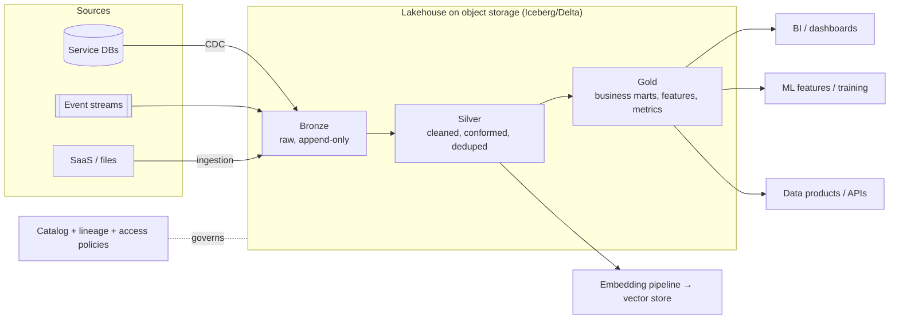

# Data architecture: lakehouse, data mesh, CDC

!!! abstract "At a glance"
    **Priority:** P1 · **Complexity:** 3/5 · **Est. time:** 3 h · **Phase:** 5 · **Prereqs:** [Batch & stream data pipelines](../system-design/data-pipelines.md), [Databases: SQL vs NoSQL](../system-design/databases-sql-nosql.md), [DDD strategic](ddd-strategic.md)
    **You're done when:** you can compare warehouse, lake, lakehouse and data-mesh architectures with decision criteria, design a CDC pipeline from operational databases into an analytical store (including schema evolution and deletes), define data products with contracts and ownership, and explain how operational data architecture feeds AI/RAG systems.

## Why it matters

Operational architecture (services, events) and analytical architecture (warehouses, lakes, ML features) are converging: the same events feed dashboards, search indices, feature stores and RAG pipelines. Getting the seam right — who owns data, how it leaves the service boundary, how quality and contracts are enforced — decides whether analytics teams become a chaotic downstream of 200 services or a governed consumer of *data products*.

Staff-level interviews probe this as "how do you get data out of microservices without shared databases?" (CDC, outbox, events) and "centralised data team vs data mesh?" (a sociotechnical trade-off). For AI: the quality of retrieval and agent grounding is a data-architecture problem — freshness, lineage, access control, and deletion propagation matter as much as embeddings.

## Core concepts

### The evolution of analytical architecture

| Generation | Shape | Strengths | Pain |
|---|---|---|---|
| Data warehouse (Kimball/Inmon) | ETL into a modelled, governed relational store | Strong schema, BI performance, governance | Rigid, slow to onboard new sources, costly at big-data scale, semi-structured data awkward |
| Data lake | Raw files (Parquet/JSON) on object storage, schema-on-read | Cheap, flexible, ML-friendly | "Data swamp": no ACID, poor governance, slow BI |
| **Lakehouse** | Open table formats (Delta Lake, Apache Iceberg, Apache Hudi) on object storage giving ACID, schema evolution, time travel; query engines (Spark, Trino, DuckDB, warehouses) on top | One copy for BI + ML; open formats; cheaper; streaming + batch | Operational maturity, compaction/maintenance, governance layer needed |
| **Data mesh** (Dehghani) | Organisational architecture: domain-owned data products, self-serve platform, federated governance | Scales ownership, aligns with bounded contexts | Needs platform maturity and strong governance; can fragment |

They're not mutually exclusive: **lakehouse is a technology architecture; data mesh is an ownership/organisation architecture.** A mesh's data products may live on a shared lakehouse platform.

### Lakehouse essentials



- **Medallion layering** (bronze/silver/gold) is a convention, not a law: keep raw immutable data for replay, then progressively refine.
- **Open table formats** provide ACID commits via metadata/manifest layers on object storage, time travel, schema evolution, partition evolution (Iceberg), upserts/deletes (`MERGE`), and engine interoperability. Choosing Iceberg vs Delta vs Hudi is mostly about ecosystem and engine support; Iceberg has broad multi-engine momentum, Delta is strong in Spark/Databricks. Check current engine compatibility before deciding.
- **Compaction and maintenance** (small files, snapshot expiry) are operational necessities.
- **Catalog** (Unity, Polaris/Nessie/Glue/Hive metastore) as the control plane for tables, permissions and lineage.

### Change Data Capture (CDC)

CDC reads a database's transaction log (Postgres WAL/logical decoding, MySQL binlog, Oracle redo, SQL Server CDC) and emits row-level change events — without polling queries or application changes.

| Approach | How | Pros | Cons |
|---|---|---|---|
| **Log-based CDC** (Debezium, cloud DMS, Fivetran/Airbyte log mode) | Tail transaction log | Low latency, captures deletes, ordering, minimal source impact | Operational setup; log retention; schema-change handling |
| Query-based (timestamp/incrementing column) | Poll `WHERE updated_at > ?` | Simple | Misses deletes, needs reliable columns, load on source |
| Trigger-based | DB triggers write audit rows | Works without log access | Overhead, intrusive |
| **Outbox** | App writes domain events to outbox table; relay/CDC publishes | Publishes *meaningful* domain events; contract-controlled | Requires app changes ([sagas & outbox](sagas-outbox.md)) |

**CDC vs outbox is a key architectural distinction**: raw table CDC leaks the internal schema (intrusive coupling — consumers depend on your tables); outbox events are a designed contract. Recommended: use **outbox/domain events for inter-service integration**; use **CDC for analytics ingestion and legacy displacement** where table-level replication is acceptable, ideally landing in bronze with a consumer-owned mapping layer ("raw CDC is an internal interface between the service and the data platform, not a public API").

Debezium event shape (simplified):

```json
{
  "before": {"id": 42, "status": "PENDING"},
  "after":  {"id": 42, "status": "CONFIRMED"},
  "op": "u",
  "ts_ms": 1790000000000,
  "source": {"db": "booking", "table": "bookings", "lsn": 123456789}
}
```

CDC pipeline design questions:

1. **Initial snapshot + streaming** handoff without gaps or duplicates (Debezium snapshot modes).
2. **Ordering**: partition by primary key; apply changes with LSN/version to resolve conflicts.
3. **Deletes and tombstones**: model as soft-deletes in silver; propagate physical deletion for GDPR (see below).
4. **Schema evolution**: DDL changes on the source must not break the pipeline — registry compatibility, additive-first migration practice on source teams, and alerting on schema drift.
5. **Idempotent sinks**: `MERGE INTO` keyed by PK with `op`/LSN ordering; exactly-once is at-least-once + idempotent merge.
6. **Backfills and replays** from Kafka retention or from bronze.
7. **PII**: column masking/tokenisation before landing in shared zones.

```sql
-- Silver upsert from bronze CDC (Delta/Iceberg MERGE)
MERGE INTO silver.bookings AS t
USING (
  SELECT * FROM (
    SELECT *, ROW_NUMBER() OVER (PARTITION BY id ORDER BY lsn DESC) AS rn
    FROM bronze.bookings_cdc WHERE ingest_date >= current_date - 1
  ) WHERE rn = 1
) AS s
ON t.id = s.id
WHEN MATCHED AND s.op = 'd' THEN DELETE
WHEN MATCHED THEN UPDATE SET *
WHEN NOT MATCHED AND s.op <> 'd' THEN INSERT *;
```

### Data mesh: four principles

| Principle | Meaning | Architectural implication |
|---|---|---|
| **Domain ownership** | Analytical data is owned by the domain team that produces it | Maps to bounded contexts; teams ship data products, not tables dumped elsewhere |
| **Data as a product** | Discoverable, addressable, trustworthy, self-describing, interoperable, secure; with SLOs | Data contracts, versioning, documentation, quality checks |
| **Self-serve data platform** | Platform team provides tooling to build/run data products cheaply | Platform-as-product (see [Team Topologies](team-topologies.md)) |
| **Federated computational governance** | Global standards enforced by automation, local autonomy | Policy-as-code: classification, retention, access, interoperability |

When mesh fits: many domains with distinct data expertise, a central data team that has become a bottleneck, sufficient engineering maturity in domain teams, executive support for federated governance. When it doesn't: small orgs (< ~5 data-producing domains), weak platform capability, or where central modelling is the actual bottleneck and domains lack data skills. Many organisations adopt "mesh-lite": central platform + domain-owned data products for the few critical domains + shared governance.

### Data products and contracts

A **data product** has: owner, purpose, schema (with semantics), SLOs (freshness, completeness, accuracy), access policy, lineage, versioning and deprecation policy, and documentation/examples. A **data contract** is the formal agreement between producer and consumers — schema + semantics + quality expectations + SLAs — enforced in CI (schema and quality checks on the producer side) and monitored in production.

```yaml
# Data contract (illustrative; formats like Open Data Contract Standard are emerging)
id: shipments.tracking-events
owner: tracking-team
version: 2.1.0
schema:
  - name: shipment_id
    type: string
    required: true
    pii: false
  - name: event_type
    type: string
    enum: [GATE_IN, LOADED, DISCHARGED, GATE_OUT]
  - name: occurred_at
    type: timestamp
quality:
  freshness: { max_lag_minutes: 15 }
  completeness: { shipment_id: 1.0 }
  uniqueness: [shipment_id, event_type, occurred_at]
access: { classification: internal, roles: [analytics, ops-ai] }
deprecation_policy: { notice_days: 90 }
```

Tools: dbt (transformations, tests), Great Expectations/Soda (quality), OpenLineage/Marquez/DataHub (lineage/catalog), schema registries, policy engines.

### Choosing an architecture: decision table

| Situation | Suggested direction |
|---|---|
| Small team, mostly structured BI needs, one main DB | Managed warehouse + ELT (dbt); skip lake/mesh |
| Diverse data (events, files, ML), cost sensitivity | Lakehouse on open formats with a catalog |
| Many domains, central bottleneck, mature platform | Mesh-lite: domain data products on shared lakehouse platform, federated governance |
| Real-time operational reactions | Event streaming (Kafka) + stream processing; CDC/outbox as sources; serving via materialised views |
| Legacy displacement | CDC from legacy DB to new store (legacy as source of truth) |
| AI/RAG on operational data | Event-driven ingestion → chunk/embed → vector index as a projection with ACL metadata and deletion propagation |

### Data architecture for AI systems

- **Feature and knowledge freshness**: define freshness SLOs for retrieval indices (e.g. policy documents visible within 5 minutes of publish); drive with CDC/events.
- **Access control propagation**: ACLs from source systems must flow to the index (document-level filters) — otherwise RAG becomes a permission bypass.
- **Deletion and retention**: right-to-erasure must remove embeddings and cached answers, not just source rows; keep lineage from chunk → source doc → subject.
- **Lineage for answers**: log which document versions were retrieved for each answer (auditability, debugging, evals).
- **Evaluation datasets are data products**: versioned, owned, with contracts.
- **Semantic layer/metrics layer** (dbt Semantic Layer, Cube): governed metric definitions consumed by BI *and* text-to-SQL agents — reduces hallucinated metrics.
- **Text-to-SQL agents** require curated, documented gold-layer schemas; never point them at raw operational DBs.

### Senior-level nuance

- **Analytical coupling is still coupling.** If downstream teams build on your table schema, you can't refactor your DB — publish contracts, not tables.
- **Central vs federated is about where the *bottleneck* is** (knowledge? capacity? governance?).
- **Streaming everything is rarely necessary**: choose latency tiers by business value (batch daily, micro-batch minutes, streaming seconds); cost and complexity rise steeply.
- **Time semantics**: event time vs processing time, late data and watermarks — decide upfront.
- **Cost governance (FinOps)**: storage is cheap, compute isn't; watch full scans, small-file explosion and unbounded retention.

## Resources

| Resource | Type | Why this one | Level | Cost |
|---|---|---|---|---|
| [Data Mesh Principles and Logical Architecture (Zhamak Dehghani)](https://martinfowler.com/articles/data-mesh-principles.html) | article | The four principles in the author's own words | intermediate | free |
| [How to Move Beyond a Monolithic Data Lake to a Distributed Data Mesh](https://martinfowler.com/articles/data-monolith-to-mesh.html) | article | The original argument for mesh, with diagnosis of centralised data platforms | intermediate | free |
| [datamesh-architecture.com](https://www.datamesh-architecture.com/) :gem: | docs | Practical, opinionated guide with data-product canvas, tech options and pitfalls | intermediate | free |
| [Lakehouse: A New Generation of Open Platforms (CIDR 2021 paper)](https://www.cidrdb.org/cidr2021/papers/cidr2021_paper17.pdf) | paper | The foundational lakehouse paper (Armbrust et al.) | advanced | free |
| [Apache Iceberg docs](https://iceberg.apache.org/) | docs | Table format spec, partition evolution, catalog integrations | intermediate | free |
| [Delta Lake](https://delta.io/) | docs | Delta protocol and features (time travel, MERGE, deletion vectors) | intermediate | free |
| [Debezium documentation](https://debezium.io/) | docs | The reference CDC toolkit: connectors, snapshots, outbox router | intermediate | free |
| [Change data capture explained (Confluent)](https://www.confluent.io/learn/change-data-capture/) | article | Vendor-neutral enough overview of CDC approaches and trade-offs | beginner | free |
| [Designing Data-Intensive Applications, 2nd ed.](https://dataintensive.net/) | book | Foundations: logs, derived data, batch/stream processing | advanced | paid |
| [Turning the database inside out (Kleppmann)](https://martin.kleppmann.com/2015/03/04/turning-the-database-inside-out.html) :gem: | article | The mental model behind CDC, logs and materialised views | advanced | free |

## Hands-on lab

**Goal:** build a CDC → lakehouse pipeline with a data contract, then an embedding projection. 2 h.

1. Docker Compose: Postgres (bookings), Kafka/Redpanda, Debezium (Kafka Connect), MinIO (object storage).
2. Configure a Debezium Postgres connector for `bookings` (logical decoding, `pgoutput`); inspect change events (insert, update, delete).
3. Land events in a bronze Iceberg/Delta table (Spark/Flink/`pyiceberg`/DuckDB writer — pick what you know; even a Parquet append with DuckDB is acceptable for the exercise).
4. Build silver with an idempotent `MERGE` (dedupe by LSN, handle deletes) and a gold mart `bookings_by_day`.
5. Change the source schema (add a nullable column, then rename one). Observe pipeline behaviour; write the compatibility policy you'd adopt.
6. Write a data contract YAML for gold and add dbt/Soda tests for freshness, uniqueness and not-null; fail CI on violation.
7. AI extension: build an embedding projection from silver `booking_notes` into pgvector with `tenant_id` and ACL metadata; implement deletion propagation (delete a source row → embeddings removed within one cycle) and measure lag.

**Expected output:** working pipeline, schema-drift experiment notes, contract with tests, and a deletion-propagation demo.

## Questions

### L1 — Recall

??? question "Q1. What problem do open table formats (Iceberg/Delta) solve compared with raw Parquet in a data lake?"
    ??? success "Answer"
        They add a metadata layer on object storage that provides ACID transactions, consistent snapshots (time travel), schema and partition evolution, efficient upserts/deletes (MERGE), and concurrent-writer safety — turning a file dump into a table. This enables BI and ML on the same data with warehouse-like reliability.

??? question "Q2. Differentiate log-based CDC, query-based CDC and the outbox pattern."
    ??? success "Answer"
        Log-based CDC reads the DB transaction log to emit row-level changes (low latency, captures deletes, low source load). Query-based polls for changed rows via timestamps/version columns (simple, misses deletes, higher load). The outbox pattern has the application write explicit domain events to a table in the same transaction, which are then relayed — producing intentional, contract-controlled events rather than internal row changes.

??? question "Q3. State the four principles of data mesh."
    ??? success "Answer"
        Domain-oriented decentralised ownership, data as a product, self-serve data infrastructure as a platform, federated computational governance.

??? question "Q4. What is the medallion architecture?"
    ??? success "Answer"
        A layering convention in lakehouses: bronze (raw, immutable ingested data), silver (cleaned, deduplicated, conformed), gold (business-level aggregates/marts/features). It supports replay, progressive quality improvement and clear consumption tiers.

### L2 — Apply

??? question "Q5. Design the ingestion of 40 microservice Postgres databases into a lakehouse without shared DB access."
    ??? success "Answer"
        Per-service Debezium connectors (or a managed CDC service) streaming to Kafka topics per table; a standard landing job writing bronze tables (append-only with `op`, LSN, source ts). Governance: each service team registers tables as *exposed for analytics* (allow-list), with PII columns tagged and masked/tokenised in the connector (SMTs) or at bronze→silver. Silver: idempotent merge per table with keys and delete handling; schema drift alerts and a policy that source migrations be additive (expand/contract) or announced. Provide domain-owned silver models (data products) where possible; central team owns platform and cross-domain gold. Monitor lag per connector and completeness with row-count reconciliation.

??? question "Q6. The source team renames a column; the CDC pipeline breaks silently and dashboards show nulls. What controls prevent recurrence?"
    ??? success "Answer"
        Contract and detection controls: schema registry with compatibility checks on CDC topics (fail on incompatible changes or route to quarantine); DDL change events surfaced to the platform with alerts; source migration policy (additive first, expand/contract for renames); data-quality tests (null-rate, freshness, row-count reconciliation) that alert within minutes; pipeline design that handles unknown/renamed columns via schema-evolution mode with review; dbt/contract tests in CI on the analytics side; a producer-consumer communication path (schema change notification → downstream owners). Post-incident: add the specific test and ownership metadata to the catalogue.

??? question "Q7. Define freshness and deletion SLOs for a RAG index built from a document management system, and how you'd enforce them."
    ??? success "Answer"
        Freshness SLO: 95% of published/updated documents searchable within 5 minutes, 99% within 15. Deletion SLO: retracted/deleted documents removed from index and caches within 10 minutes (compliance-critical). Enforcement: event/CDC-driven ingestion with per-document version tracking; a metric for `index_lag_seconds` (source event time vs indexed time); a periodic reconciliation job comparing source document ids/versions to the index and repairing drift; ACL metadata updated on permission-change events; canary "sentinel" documents inserted and searched synthetically to measure end-to-end lag; alerts on SLO breach.

### L3 — Design & trade-offs

??? question "Q8. Centralised data team + warehouse vs data mesh for a 400-engineer company with 15 domains and a struggling central data team. Decide."
    ??? success "Answer"
        Likely mesh-lite. Diagnose the bottleneck: if it's capacity and domain knowledge (central team modelling everyone's data with a backlog), domain-owned data products help; if it's inconsistent definitions, central governance and a semantic layer are needed regardless. Approach: keep a strong platform team providing lakehouse, catalog, CI templates and quality tooling; pilot with 2–3 high-value domains owning data products with contracts; federated governance (a council setting global standards for identifiers, classification, interoperability, enforced by policy-as-code); central team evolves into platform + enabling. Preconditions: domain teams with data skills or embedded data engineers and incentives. Metrics: time to onboard a new data product, consumer satisfaction, data incident rate. Avoid a big-bang reorganisation.

??? question "Q9. Raw table CDC vs outbox events for feeding downstream *services* (not analytics). Which and why?"
    ??? success "Answer"
        Outbox (domain events): raw CDC exposes internal tables so consumers couple to the schema (intrusive coupling), lacks business intent (an UPDATE is not `BookingConfirmed`), and changes with every migration. Outbox events are a designed, versioned contract and can carry only what's needed. Use raw CDC when the goal is replication/analytics or legacy displacement without app changes, and treat its schema as internal to the data platform. Some teams use CDC *to relay* the outbox table (Debezium outbox router) — best of both.

??? question "Q10. Streaming vs batch for the enterprise data platform: how do you decide per use case?"
    ??? success "Answer"
        Tier by business latency value: daily batch for finance/reporting; micro-batch (5–15 min) for dashboards and most analytics; streaming (seconds) only where actions depend on it (fraud, ETA alerts, personalisation, operational agents). Cost/complexity drivers: state management, exactly-once semantics, late data handling, on-call load. Prefer one unified pipeline framework where possible (lakehouse with incremental processing) to reduce duplicate logic; use Kafka + stream processing for the few real-time paths, and serve reads from materialised views. Re-evaluate periodically as business needs change.

### L4 — Staff-level ambiguity

??? question "Q11. Leadership mandates 'data mesh' after a conference; your platform maturity is low and domain teams are overloaded. How do you respond?"
    ??? success "Answer"
        Reframe from the label to the outcomes: faster access to trustworthy data, clear ownership, fewer central bottlenecks. Assess readiness (platform capability, data skills, incentives, governance). Propose a staged path: (1) inventory and prioritise 5–10 critical datasets, assign owners and minimal contracts; (2) build the thin platform (catalog, CI templates, quality checks, access management) — the mesh's foundation; (3) pilot data products with 2 willing domains, measuring lead time and quality; (4) establish federated governance with a few enforceable standards; (5) expand as capability and demand grow. Communicate risks of premature mesh (fragmentation, duplicated effort, quality decline) and secure funding for platform and enabling roles rather than just asking domains to do more.

??? question "Q12. Design an architecture that lets an enterprise AI assistant answer questions over operational data safely (bookings, invoices, tracking) for 5,000 users with role-based access."
    ??? success "Answer"
        Don't point the LLM at operational DBs. Build governed layers: (1) events/CDC → lakehouse silver/gold data products with contracts; (2) a semantic/metrics layer for governed metric definitions; (3) two access paths: (a) *structured*: text-to-SQL/tool calls against curated gold views through a query service enforcing row/column-level security by user identity (pass-through auth, not a super-user), with query limits and result-size caps; (b) *unstructured*: RAG index with document-level ACL metadata, filtered at retrieval, with freshness and deletion SLOs. (4) Agent tools call domain APIs for live operational state (rather than analytical copies) with the user's token. (5) Guardrails: PII masking, prompt-injection defences on retrieved content, audit log of queries and retrieved sources, evals on golden questions (including permission-boundary tests). (6) Observability and cost controls at the gateway. Explain trade-offs: freshness vs safety, coverage vs governance, cost of curation.

## Real-world use cases

- **Logistics visibility**: CDC from TOS/ERP + carrier events into a lakehouse for ETA modelling and customer dashboards; gold features for ML.
- **Banking**: mesh-style domain data products (payments, lending) with central governance and lineage for regulators.
- **E-commerce**: Debezium CDC from order DBs feeding search indices, recommendation features and finance marts.
- **Legacy displacement**: CDC from a legacy Oracle DB to a new service's store during a strangler migration.
- **Enterprise RAG**: event-driven ingestion with ACL and deletion propagation; retrieval lineage stored for audit.

## Pitfalls & anti-patterns

- Exposing raw operational tables as a public analytical API.
- Data swamp: lake without catalog, ownership or quality checks.
- "Mesh" as a rename of the central team, or as an unfunded mandate to domains.
- CDC without a plan for deletes, schema changes and initial snapshots.
- Streaming everything, paying complexity for no business value.
- RAG indices that ignore source ACLs or deletions.
- Text-to-SQL agents on undocumented raw schemas.

## Checklist

- [ ] I can compare warehouse, lake, lakehouse and mesh and state when each fits
- [ ] I built a CDC pipeline with idempotent merge, delete handling and schema-change handling
- [ ] I can write a data contract and enforce it in CI
- [ ] I can explain CDC vs outbox and where each belongs
- [ ] I can design permission-, freshness- and deletion-safe data feeds for AI assistants
- [ ] I answered all L3 questions out loud in < 3 min each
