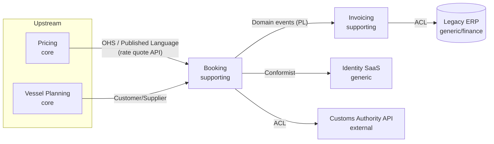

# DDD strategic: subdomains, bounded contexts, context maps

!!! abstract "At a glance"
    **Priority:** P0 · **Complexity:** 3/5 · **Est. time:** 4 h · **Phase:** 2 · **Prereqs:** [Architecture styles](architecture-styles.md), [Coupling & modularity](coupling-modularity.md)
    **You're done when:** you can take a business domain you know, classify its subdomains (core/supporting/generic), draw bounded contexts with a context map naming every relationship pattern, and justify where service and team boundaries should go.

## Why it matters

Most failed microservice migrations fail at *boundaries*, not at technology. Strategic DDD is the toolkit for finding boundaries that minimise coordination: between models, services, teams and — increasingly — agents. Staff/Principal interviews routinely ask "How would you decompose this system?" and the credible answer uses subdomains, bounded contexts and context mapping, not "one service per entity".

For AI architecture, bounded contexts map naturally onto agents and tool sets: an agent that "does everything" is the LLM equivalent of a big ball of mud. A per-context agent with its own ubiquitous language, tools and eval set is easier to secure, test and own.

## Core concepts

### Problem space vs solution space

| Problem space (what the business does) | Solution space (what we build) |
|---|---|
| **Domain**: the whole business area (e.g. container shipping) | **Bounded context**: a boundary within which a model and its language are consistent |
| **Subdomains**: parts of the domain (booking, pricing, vessel planning, customs, invoicing) | **Context map**: the relationships and integration patterns between bounded contexts |
| Discovered through conversation, EventStorming | Designed; aligns with teams and deployables |

A subdomain is *discovered*; a bounded context is a *design decision*. They often align 1:1 but needn't: a legacy ERP may span several subdomains (one context, many subdomains), and a complex subdomain may be split into several contexts.

### Subdomain types and investment strategy

| Type | Definition | Example (shipping) | Strategy | Build/buy |
|---|---|---|---|---|
| **Core** | Source of competitive advantage; complex, changing | Dynamic pricing & capacity allocation; ETA prediction | Best people, rich domain model, DDD tactical patterns, in-house | Build |
| **Supporting** | Necessary, specific to you, but not differentiating | Booking amendments workflow, internal rate-sheet admin | Simpler design (transaction script, CRUD), can outsource | Build simply |
| **Generic** | Solved problems, same for everyone | Identity, payments, email, accounting | Buy/SaaS/OSS; integrate behind ACL | Buy |

Khononov's heuristic: core subdomains have high complexity *and* high differentiation; generic ones high complexity but low differentiation; supporting ones low complexity, low differentiation. Nick Tune's **Core Domain Charts** plot business differentiation vs model complexity and let you track contexts drifting over time (a core capability commoditises — e.g. OCR of shipping documents moved from core to generic once LLMs made it a commodity).

!!! tip "AI-era shift"
    LLMs are rapidly moving capabilities from *core* to *generic* (document extraction, translation, classification). Re-run the core domain chart yearly: a context you invested heavily in may now be a buy decision, and your real differentiator may be the proprietary data and workflow around it.

### Bounded contexts

A **bounded context** is the boundary inside which a particular model applies and a term has one meaning. "Booking" means a customer's request in the Sales context, a slot on a vessel in Capacity Planning, and a billable item in Invoicing. Trying to make one `Booking` class serve all three produces a god model that every team must negotiate.

Heuristics for finding boundaries:

- **Language divergence**: the same word means different things, or different words mean the same thing.
- **Different change rates and owners**: pricing rules change weekly; vessel master data rarely.
- **Pivotal events** in EventStorming (e.g. `BookingConfirmed`, `CargoLoaded`) often mark boundaries between phases of a process.
- **Transactional consistency needs**: things that must be consistent immediately belong together; eventual consistency is acceptable across contexts.
- **Team cognitive load**: a context should fit in one team's head (Team Topologies).

Size: Khononov notes bounded contexts are *not* microservices by definition. A bounded context can be deployed as several services, or several small contexts can share one deployable. The constraint is: **one context, one team owner** (a team can own several contexts).

### Ubiquitous language

The shared, precise language between domain experts and engineers *within one context*. It appears in code (class names, method names, event names), tests, docs and conversation. If the code says `processRecord()` but experts say "release the cargo", the model is leaking. In AI systems, the ubiquitous language also belongs in prompts and tool descriptions — an agent's tool named `release_cargo(container_id, customs_clearance_ref)` is far more reliably used than `update_status(id, code)`.

### Context mapping patterns



| Pattern | Relationship | When to use | Risk |
|---|---|---|---|
| **Partnership** | Two teams succeed/fail together, coordinate closely | Tightly related contexts, temporarily | High coordination cost; don't make it permanent |
| **Shared Kernel** | Share a small subset of the model (code/schema) | Small, stable shared concepts (e.g. `Money`, `UN/LOCODE`) | Changes need both teams' agreement |
| **Customer/Supplier** | Upstream plans with downstream's needs in mind | Upstream willing to negotiate | Upstream priorities may still win |
| **Conformist** | Downstream adopts upstream's model as-is | Upstream won't change and its model is acceptable (SaaS APIs) | Upstream's model pollutes yours |
| **Anti-Corruption Layer (ACL)** | Downstream translates upstream's model into its own | Legacy systems, poor-quality or volatile external models | Extra code; must be maintained |
| **Open Host Service (OHS)** | Upstream offers a well-defined protocol for many consumers | Many consumers | Versioning discipline |
| **Published Language** | Documented shared exchange format (often with OHS) | Industry standards (EDIFACT, DCSA APIs), event schemas | Standard's rigidity |
| **Separate Ways** | No integration; duplicate instead | Integration cost > benefit | Duplication, divergence |
| **Big Ball of Mud** | Acknowledge a messy area and quarantine it | Legacy you won't fix now | Contamination if not isolated by ACL |

Upstream/downstream is about **influence**: the upstream's changes affect the downstream, not vice versa. Context maps are as much about *power and politics* as about technology — a conformist relationship with a team that ignores your needs is an organisational problem to escalate, not a coding one.

### The ACL in code

```python
# booking/adapters/customs_acl.py
from booking.domain.model import ClearanceStatus, ContainerId

class CustomsAuthorityACL:
    """Translates the customs authority's model into Booking's language."""
    _STATUS_MAP = {"R1": ClearanceStatus.RELEASED, "H3": ClearanceStatus.ON_HOLD,
                   "X9": ClearanceStatus.REJECTED}

    def __init__(self, client):  # client speaks the authority's XML/JSON model
        self._client = client

    def clearance_for(self, container: ContainerId) -> ClearanceStatus:
        raw = self._client.get_declaration(ctr_no=str(container))
        return self._STATUS_MAP.get(raw["stsCd"], ClearanceStatus.UNKNOWN)
```

The booking domain never sees `stsCd`; when the authority changes codes, one class changes.

### Discovery techniques

- **EventStorming** (Alberto Brandolini): big-picture sticky-note workshop of domain events on a timeline; reveals pivotal events, hotspots and language clashes. Follow with process-level and design-level sessions.
- **Domain Storytelling**: pictographic stories of actors, work objects and activities.
- **DDD Crew Starter Modelling Process**: an 8-step path (align → discover → decompose → strategise → connect → organise → define → code) with canvases.
- **Bounded Context Canvas**: one page per context — purpose, strategic classification, inbound/outbound communication, ubiquitous language, business decisions.

### AI-era patterns

- **Agents as bounded contexts**: each agent owns a context's language, tools and data access. Cross-context collaboration happens via published contracts (A2A, MCP tools, events), not by sharing prompts or memory stores.
- **LLM output as an upstream model**: treat an LLM (or third-party agent) like an external upstream — put an ACL in front that validates structured output against your domain types.
- **Context maps constrain agent tool scopes**: a tool set that spans three contexts is a red flag for least privilege and eval complexity.

## Resources

| Resource | Type | Why this one | Level | Cost |
|---|---|---|---|---|
| [Learning Domain-Driven Design (Vlad Khononov)](https://vladikk.com/) | book | The clearest modern DDD book; strategic chapters are excellent and pragmatic | intermediate | paid |
| [DDD Crew — Context Mapping](https://github.com/ddd-crew/context-mapping) :gem: | docs | Visual cheat sheet of all relationship patterns with team-relationship guidance | intermediate | free |
| [DDD Crew — Starter Modelling Process](https://github.com/ddd-crew/ddd-starter-modelling-process) :gem: | docs | Step-by-step path from discovery to code, with links to every technique | intermediate | free |
| [DDD Crew — Bounded Context Canvas](https://github.com/ddd-crew/bounded-context-canvas) | docs | One-page template to design and review a context | intermediate | free |
| [DDD Crew — Core Domain Charts](https://github.com/ddd-crew/core-domain-charts) :gem: | docs | Visual tool to classify and track subdomain strategy over time | advanced | free |
| [DDD Reference (Eric Evans, PDF)](https://www.domainlanguage.com/wp-content/uploads/2016/05/DDD_Reference_2015-03.pdf) | docs | Evans's own concise definitions of every pattern | advanced | free |
| [Bounded Context (Fowler bliki)](https://martinfowler.com/bliki/BoundedContext.html) | article | Five-minute intuition for why one model can't serve everyone | intermediate | free |
| [Context Mapper](https://contextmapper.org/) :gem: | interactive | DSL and tooling to model context maps as code and generate diagrams | advanced | free |
| [Architecture Modernization (Nick Tune)](https://www.manning.com/books/architecture-modernization) | book | Strategic DDD applied to modernisation, team design and investment | advanced | paid |
| [EventStorming](https://www.eventstorming.com/) | docs | Brandolini's official site for the discovery technique | intermediate | free |

## Hands-on lab

**Goal:** produce a strategic design for a domain you know. 90 min.

1. Pick a domain (ocean freight booking-to-invoice is ideal). Run a solo big-picture EventStorming: list 30–50 domain events on a timeline (Miro or paper).
2. Mark pivotal events and hotspots (disagreement, unknowns, pain).
3. Group events into candidate subdomains; classify each core/supporting/generic with a one-line justification. Plot them on a core domain chart.
4. Draw bounded contexts and a context map in Mermaid or Context Mapper; label every edge with a pattern (OHS/PL, ACL, conformist, customer/supplier...).
5. Fill a Bounded Context Canvas for your core context.
6. Map contexts to hypothetical teams (≤ 1 team per context). Note where a team would own 2+ contexts.
7. AI extension: mark which contexts could have an agent, and what tools (limited to that context) it would get.

**Expected output:** event timeline photo, context map diagram, one canvas, team mapping. Commit into `docs/log/` as capstone input.

## Questions

### L1 — Recall

??? question "Q1. What is the difference between a subdomain and a bounded context?"
    ??? success "Answer"
        A subdomain is part of the business problem space — discovered by understanding what the business does (e.g. pricing). A bounded context is a solution-space boundary within which a single model and ubiquitous language are consistent — designed by architects. They often align but can differ: one legacy system (one context) may cover several subdomains, or one complex subdomain may be implemented as multiple contexts.

??? question "Q2. Define core, supporting and generic subdomains and the default build/buy strategy for each."
    ??? success "Answer"
        Core: differentiating, complex, changing — build in-house with the best people and rich modelling. Supporting: specific to the business but not differentiating, usually simpler — build simply (CRUD/transaction scripts) or outsource. Generic: common problems solved industry-wide (identity, payments, accounting) — buy or use OSS/SaaS, integrate behind an ACL.

??? question "Q3. What is an anti-corruption layer and when do you need one?"
    ??? success "Answer"
        A translation layer owned by a downstream context that converts an upstream model (and protocol) into the downstream's own model, so upstream concepts don't leak in. Use it when integrating with legacy systems, external/third-party APIs, poorly designed or volatile upstream models, or during strangler-fig migration so the new system isn't shaped by the old one.

??? question "Q4. Explain upstream/downstream in context mapping."
    ??? success "Answer"
        It describes direction of influence: changes in the upstream context affect the downstream, while downstream changes don't affect upstream. It's not the direction of data flow or calls necessarily. It determines who must adapt: conformist, ACL (downstream adapts), customer/supplier (upstream accommodates), OHS/PL (upstream offers a stable protocol).

### L2 — Apply

??? question "Q5. In an e-commerce company, 'Product' appears in Catalog, Inventory, Pricing and Shipping. How do you model it?"
    ??? success "Answer"
        Separate models per bounded context sharing only an identifier (SKU). Catalog's `Product` has descriptions, images, categories; Inventory's `StockItem` has quantities per warehouse and reservations; Pricing's `PricedItem` has price lists, promotions; Shipping's `Parcel`/`ShippableItem` has weight, dimensions, hazmat class. Each context owns its data and publishes events (`ProductPublished`, `StockReserved`). Avoid a central "Product service" that everyone calls for everything — it becomes a coupling hub and bottleneck. Shared kernel only for truly common value objects (SKU format, Money).

??? question "Q6. Your booking context must integrate with a 25-year-old mainframe for invoicing. The mainframe team has no capacity to change anything. Which context-mapping pattern(s) and how would you implement them?"
    ??? success "Answer"
        The mainframe is upstream and won't change, so the options are conformist or ACL. Given its legacy model (fixed-width records, cryptic codes), choose an ACL owned by the booking/invoicing team: an adapter service or module that translates `InvoiceRequested` domain events into mainframe transactions (e.g. via MQ or a file drop) and translates responses back. Include idempotency (mainframe may not dedupe), reconciliation jobs, and a canonical internal model. The ACL also becomes the strangler seam if invoicing is later rebuilt.

??? question "Q7. Classify these for a freight forwarder and justify: shipment tracking UI, rate negotiation engine, identity & SSO, customs document generation, carrier contract management."
    ??? success "Answer"
        Rate negotiation engine — core (margin and competitiveness depend on it; complex rules). Carrier contract management — core or supporting depending on strategy; if procurement leverage is a differentiator, core. Customs document generation — was supporting; with LLM extraction/generation increasingly generic (buy or use a platform), but country-specific compliance logic may stay supporting. Shipment tracking UI — supporting (customers expect it; rarely differentiating unless visibility is your product). Identity & SSO — generic (buy). The classification drives who works on what and where to use rich domain models.

### L3 — Design & trade-offs

??? question "Q8. A team wants a shared 'Customer' library used by all 12 services so that everyone has the same Customer model. Evaluate."
    ??? success "Answer"
        This is a shared kernel of 12 parties — effectively a distributed monolith lever. Every change requires coordinating 12 teams; the model bloats to serve all needs; versions diverge. Better: each context models customer per its needs; a Customer (or Party) context owns identity/master data and publishes events via OHS/PL; others keep local projections. Acceptable shared kernel: tiny, stable value objects (CustomerId, address format) — ideally as a schema, not behaviour. Trade-off: some duplication and eventual consistency in exchange for autonomy. If the real need is data quality, fix it with master-data governance, not a library.

??? question "Q9. You're designing a multi-agent system for freight operations: quoting, booking, exception handling, customer communication. How do bounded contexts guide the design?"
    ??? success "Answer"
        Treat each agent as a bounded context: Quoting agent (Pricing language, read-only rate tools), Booking agent (Booking context, tools that create/amend bookings via the booking API), Exception agent (Operations context — delays, rerouting), Communication agent (Customer engagement — templates, channels). Each has its own tools, prompts in its ubiquitous language, eval set and data permissions (least privilege). Collaboration via published contracts: domain events (`ShipmentDelayed`) and explicit handoffs (A2A tasks or orchestrator calls) — not shared scratchpads spanning contexts. An orchestrator/router corresponds to a process manager. Benefits: blast-radius limits for prompt injection, per-context evals, team ownership. Trade-off: more handoffs → latency and context loss; mitigate with structured handoff payloads.

??? question "Q10. When is 'Separate Ways' the right context-mapping decision?"
    ??? success "Answer"
        When integration cost and coupling exceed the value of shared data or behaviour: e.g. a small internal tool that could reuse the HR system's org model but only needs team names — duplicating a small list is cheaper than integration; or two business units with different processes where forcing a shared model would slow both. Also valid when the upstream is unreliable/political and the duplicated capability is small. Risks: divergence and inconsistent reporting; mitigate with occasional reconciliation or accept the difference explicitly.

### L4 — Staff-level ambiguity

??? question "Q11. A merger combines two logistics companies, each with its own booking, pricing and customer platforms. You're asked for the target context map. How do you approach it?"
    ??? success "Answer"
        1. Separate business strategy from tech: which capabilities are core for the combined company (e.g. pricing), which will converge, which remain separate brands?
        2. Run joint big-picture EventStorming with domain experts from both — reveals language differences ("booking" vs "order") and process differences that must be decided by the business, not IT.
        3. Draw current-state context maps for both, then the target: generic capabilities converge first (identity, finance — buy/consolidate); core pricing gets a new unified context maybe using the better model; supporting contexts may stay Separate Ways for a period.
        4. Integration via ACLs and a published language (canonical events) during coexistence; strangler migration per context.
        5. Team design: align teams to target contexts early (Inverse Conway), avoiding "company A team vs company B team" politics.
        6. Sequence by value and risk, record decisions as ADRs, and revisit the core domain chart as the merged strategy clarifies.

??? question "Q12. Engineering leadership wants a single enterprise canonical data model for all systems to 'end integration chaos'. Respond as Principal Architect."
    ??? success "Answer"
        An enterprise-wide canonical model conflicts with bounded contexts: it forces a single meaning on terms that legitimately differ, becomes a bottleneck owned by a committee, and changes slowly. Instead propose: (1) **Published Languages per integration domain** — e.g. shipment events aligned with industry standards (DCSA), owned by the upstream context with schema registry and compatibility rules; (2) shared **identifiers and reference data** (party ids, locations, currencies) governed centrally — this is where most "chaos" actually comes from; (3) ACLs at boundaries; (4) a data platform where analytical canonical models (data products) can exist without constraining operational contexts. Acknowledge the legitimate concern (inconsistent semantics in reporting) and solve it with governance of a few core entities, not a universal model.

## Real-world use cases

- **Ocean shipping (DCSA standards)**: the Digital Container Shipping Association publishes industry APIs (track & trace, booking, eBL) — a Published Language that lets carriers and forwarders integrate via OHS/ACL rather than bespoke formats.
- **Banking**: "Account" means different things in retail banking, risk, and general ledger contexts; ACLs guard the core ledger from channel-specific models.
- **E-commerce marketplaces**: catalog, inventory, pricing and fulfilment as separate contexts sharing SKU only.
- **Healthcare**: HL7/FHIR as Published Language between hospital systems.
- **Enterprise AI assistants**: per-domain agents (HR, IT, finance) behind a router rather than one agent with every tool.

## Pitfalls & anti-patterns

- One service per entity (CustomerService, ProductService) instead of per context.
- Treating bounded contexts and microservices as the same thing.
- Shared kernels that grow into shared domain libraries.
- Skipping domain experts — boundaries designed from the database schema.
- Conformist by default to a poor upstream model, then leaking it everywhere.
- Classifying everything as "core" — then nothing gets simplified or bought.
- One mega-agent with tools spanning every context.

## Checklist

- [ ] I can explain subdomain types, bounded contexts and all context-map patterns without notes
- [ ] I ran an EventStorming and produced a context map for a real domain
- [ ] I can implement an ACL and explain when conformist is acceptable
- [ ] I can map contexts to teams and agents with least-privilege tool sets
- [ ] I answered all L3 questions out loud in < 3 min each
