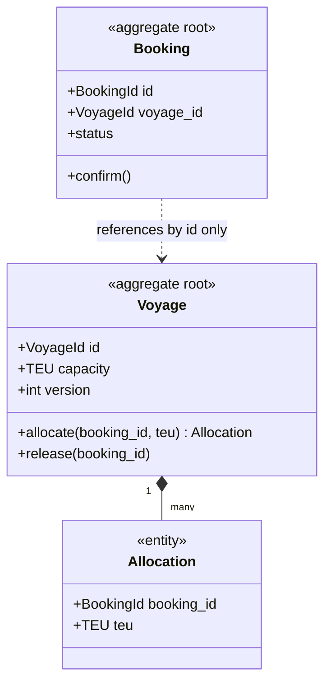

# DDD tactical: aggregates, entities, value objects, domain events

!!! abstract "At a glance"
    **Priority:** P0 · **Complexity:** 3/5 · **Est. time:** 3 h · **Phase:** 2 · **Prereqs:** [DDD strategic](ddd-strategic.md), [Architecture patterns in Python](../python/architecture-patterns-python.md)
    **You're done when:** you can design an aggregate for a real invariant, justify its boundary using Vernon's rules, implement it in Python (and sketch it in Java) with value objects and domain events, and explain when NOT to use a rich domain model.

## Why it matters

Tactical DDD is how you keep **core** domain logic correct under concurrency and change. The aggregate is the single most useful — and most misused — pattern: it defines your transaction boundary, your consistency guarantees and, in distributed systems, your unit of partitioning and event emission. Get aggregate boundaries wrong and you get either lock contention and giant transactions (too big) or broken invariants (too small).

For AI systems: when an agent takes actions on your domain, the aggregate is where invariants are enforced — *not* the prompt. "The agent must not overbook a vessel" belongs in `Voyage.allocate()`, which rejects the command regardless of what the LLM decided.

## Core concepts

### The building blocks

| Block | Identity? | Mutable? | Purpose | Example |
|---|---|---|---|---|
| **Value object** | No — equality by value | Immutable | Describe things; encapsulate validation and behaviour | `Money`, `ContainerNumber`, `Weight`, `PortCode`, `DateRange` |
| **Entity** | Yes — equality by id | Mutable over lifecycle | Things with continuity | `Booking`, `Container` |
| **Aggregate** | Root entity's id | Changed only via root | Consistency boundary for invariants | `Voyage` (with allocations), `Order` (with lines) |
| **Domain event** | Usually an id for dedup | Immutable | Something that happened that domain experts care about | `BookingConfirmed`, `CapacityExceeded` |
| **Domain service** | — | Stateless | Behaviour that doesn't belong to one entity | `FreightCalculator` spanning rate cards and routes |
| **Repository** | — | — | Collection-like access to aggregates | `VoyageRepository.get(id)` |
| **Factory** | — | — | Complex creation logic | `BookingFactory.from_quote(quote)` |

### Value objects: the most underused pattern

Primitive obsession (`str` container numbers, `float` money) scatters validation and bugs. Value objects make illegal states unrepresentable:

```python
from dataclasses import dataclass
from decimal import Decimal
import re

@dataclass(frozen=True, slots=True)
class Money:
    amount: Decimal
    currency: str

    def __post_init__(self):
        if len(self.currency) != 3:
            raise ValueError("ISO-4217 currency required")

    def __add__(self, other: "Money") -> "Money":
        if other.currency != self.currency:
            raise ValueError("currency mismatch")
        return Money(self.amount + other.amount, self.currency)

@dataclass(frozen=True, slots=True)
class ContainerNumber:
    value: str
    _PATTERN = re.compile(r"^[A-Z]{4}\d{7}$")

    def __post_init__(self):
        if not self._PATTERN.match(self.value):
            raise ValueError(f"invalid ISO 6346 container number: {self.value}")
```

In Java, `record` types are ideal value objects:

```java
public record Money(BigDecimal amount, Currency currency) {
    public Money {
        Objects.requireNonNull(amount); Objects.requireNonNull(currency);
    }
    public Money plus(Money other) {
        if (!currency.equals(other.currency)) throw new IllegalArgumentException("currency mismatch");
        return new Money(amount.add(other.amount), currency);
    }
}
```

With Pydantic v2 at the edges (API, LLM structured output), validate into these domain types immediately — the domain model shouldn't depend on Pydantic, but the adapter can map.

### Aggregates and Vernon's four rules

Vaughn Vernon's "Effective Aggregate Design" rules:

1. **Model true invariants in consistency boundaries.** An aggregate exists to protect a business rule that must be *immediately* consistent (e.g. "allocated TEU ≤ vessel capacity").
2. **Design small aggregates.** Big aggregates cause contention, slow loads and concurrency conflicts.
3. **Reference other aggregates by identity only.** `booking.voyage_id`, not `booking.voyage` object graph.
4. **Use eventual consistency outside the boundary.** Other aggregates update in response to domain events, in separate transactions.

Plus the practical rule: **one aggregate per transaction** (per command). If a use case needs to change two aggregates atomically, either your boundaries are wrong or you need eventual consistency via events.



### A Python aggregate with events and optimistic concurrency

```python
from dataclasses import dataclass, field

@dataclass(frozen=True)
class CapacityAllocated:
    voyage_id: str
    booking_id: str
    teu: int

@dataclass(frozen=True)
class CapacityExceeded:
    voyage_id: str
    booking_id: str
    requested: int

class Voyage:
    def __init__(self, voyage_id: str, capacity_teu: int, version: int = 0):
        self.id = voyage_id
        self.capacity_teu = capacity_teu
        self.version = version            # optimistic locking
        self._allocations: dict[str, int] = {}
        self.events: list = []

    @property
    def allocated(self) -> int:
        return sum(self._allocations.values())

    def allocate(self, booking_id: str, teu: int) -> None:
        if booking_id in self._allocations:          # idempotent
            return
        if self.allocated + teu > self.capacity_teu:  # the invariant
            self.events.append(CapacityExceeded(self.id, booking_id, teu))
            return
        self._allocations[booking_id] = teu
        self.events.append(CapacityAllocated(self.id, booking_id, teu))
```

The repository saves with `UPDATE voyage SET ..., version = version + 1 WHERE id = ? AND version = ?`; zero rows updated → concurrency conflict → retry the command. The Unit of Work collects `events` and publishes them after commit (or writes them to an outbox in the same transaction — see [sagas & outbox](sagas-outbox.md)).

### Domain events

- Named in past tense in the ubiquitous language: `BookingConfirmed`, not `BookingUpdated` or `SendEmail`.
- Carry what consumers need to react, plus metadata: event id, occurred-at, aggregate id, aggregate version, correlation/causation ids.
- **Internal domain events** (within a context, can be rich, can change freely) vs **integration events** (published to other contexts, a contract — versioned, minimal, stable). Translate from one to the other at the boundary; don't leak internal events.
- Events enable eventual consistency between aggregates and contexts, audit trails, and — if you go further — event sourcing ([CQRS & ES](cqrs-event-sourcing.md)).

### When NOT to use tactical DDD

| Situation | Better choice |
|---|---|
| Supporting/generic subdomain with CRUD semantics | Active record / transaction script, framework defaults |
| Reporting and read-heavy screens | Query directly (SQL/views) — CQRS read side |
| Very simple validation rules | Pydantic models + service functions |
| Data pipelines / ETL | Dataflow thinking, not aggregates |

Rich domain models pay off where the rules are complex, change often and are costly when wrong. Fowler's "Anemic Domain Model" critique applies *there*; elsewhere, anaemic is fine.

### Senior-level nuance

- **Aggregate size is a performance decision too.** Loading a `Customer` with 50k orders to add one order is the classic mistake.
- **Invariants that span aggregates** usually aren't true invariants — ask the business: "What happens if this is violated for 2 seconds? For 2 minutes?" Often they accept compensation (e.g. overbooking with a later reallocation, which airlines and shipping lines do deliberately).
- **Hot aggregates** (a single `Voyage` receiving hundreds of allocations per second) need different tactics: shard the invariant (capacity buckets), reserve-then-confirm, or accept small overbooking with compensation.
- **Aggregates as partition keys**: in event streaming, the aggregate id is the natural Kafka key — ordering per aggregate is exactly what you need.
- **LLM-driven commands**: validate LLM output into value objects at the adapter; the aggregate still enforces invariants. Never let an agent write rows directly.

## Resources

| Resource | Type | Why this one | Level | Cost |
|---|---|---|---|---|
| [Effective Aggregate Design (Vaughn Vernon, 3-part PDF)](https://www.dddcommunity.org/library/vernon_2011/) :gem: | article | The definitive essay on aggregate boundaries; short and practical | advanced | free |
| [Learning Domain-Driven Design (Khononov)](https://vladikk.com/) | book | Tactical patterns positioned by subdomain type — tells you when *not* to use them | intermediate | paid |
| [Cosmic Python — Aggregates chapter](https://www.cosmicpython.com/book/chapter_07_aggregate.html) :gem: | book | Python implementation with optimistic concurrency and consistency boundaries | intermediate | free |
| [Cosmic Python — Events and the Message Bus](https://www.cosmicpython.com/book/chapter_08_events_and_message_bus.html) | book | Domain events raised by aggregates and dispatched after commit | intermediate | free |
| [DDD Crew — Aggregate Design Canvas](https://github.com/ddd-crew/aggregate-design-canvas) :gem: | docs | Canvas forcing you to state invariants, throughput and size | advanced | free |
| [DDD_Aggregate (Fowler bliki)](https://martinfowler.com/bliki/DDD_Aggregate.html) | article | Short definition and common confusions | intermediate | free |
| [Value Object (Fowler bliki)](https://martinfowler.com/bliki/ValueObject.html) | article | Why equality by value matters, with pitfalls | intermediate | free |
| [Implementing Domain-Driven Design (Vernon)](https://www.informit.com/store/implementing-domain-driven-design-9780321834577) | book | Deep Java-centric treatment of tactical patterns | advanced | paid |
| [jMolecules](https://www.jmolecules.org/) | docs | Java annotations/types to express DDD building blocks and verify them with ArchUnit | intermediate | free |

## Hands-on lab

**Goal:** implement and stress an aggregate. 90 min.

1. Implement `Voyage` and `Booking` aggregates with value objects `TEU`, `ContainerNumber`, `Money` in pure Python (no ORM imports in `domain/`).
2. Write unit tests for the invariant (allocate beyond capacity → `CapacityExceeded`), idempotency, and events emitted.
3. Add a SQLAlchemy repository with an integer `version` column and optimistic locking.
4. Write a concurrency test: 50 threads each allocate 1 TEU on a voyage of capacity 40. Expected: exactly 40 `CapacityAllocated`, 10 rejections or retries ending in `CapacityExceeded`, never > 40 allocated.
5. Make `Voyage` "too big" by also holding all bookings' documents; measure load time with 10k bookings. Then refactor back.
6. AI extension: add a function that takes an LLM's structured output (Pydantic model) proposing an allocation and maps it to a command; show the aggregate rejects an invalid proposal.

**Expected output:** green tests, a concurrency test proving the invariant, and a note on aggregate size vs load time.

## Questions

### L1 — Recall

??? question "Q1. Distinguish entities from value objects, with an example of something that is an entity in one context and a value object in another."
    ??? success "Answer"
        Entities have identity that persists through state changes; equality is by id. Value objects have no identity; equality by attributes; immutable. An address is a value object in a booking (it's just the delivery address) but may be an entity in a postal/address-management context where addresses are tracked, corrected and have lifecycle. Similarly, a `Seat` is a value in general admission but an entity in assigned seating.

??? question "Q2. State Vernon's four aggregate design rules."
    ??? success "Answer"
        1. Model true invariants in consistency boundaries. 2. Design small aggregates. 3. Reference other aggregates by identity. 4. Use eventual consistency outside the boundary. (Corollary: modify one aggregate per transaction.)

??? question "Q3. What's the difference between an internal domain event and an integration event?"
    ??? success "Answer"
        Internal domain events live within a bounded context: they can be rich, reference internal types, and change freely with the model. Integration events cross context boundaries and are public contracts: versioned, backward-compatible, minimal, using published language and primitive/serialisable types. Translate internal to integration events at the boundary (often via outbox) to avoid coupling consumers to your internal model.

### L2 — Apply

??? question "Q4. An `Order` aggregate contains `OrderLine`s and a `Customer` object with the full customer profile. What's wrong and how do you fix it?"
    ??? success "Answer"
        Customer is a separate aggregate; embedding it violates "reference by identity", makes the Order aggregate large, and creates false consistency expectations (editing the customer through an order). Fix: `Order` holds `customer_id` and a snapshot of what the order needs at the time (e.g. shipping address as a value object, customer tier used for pricing). Changes to customer profile propagate via events if needed.

??? question "Q5. Implement optimistic concurrency for a repository save in SQL and explain the retry strategy."
    ??? success "Answer"
        `UPDATE voyages SET allocations = :a, version = version + 1 WHERE id = :id AND version = :expected_version;` If `rowcount == 0`, another transaction won → raise `ConcurrencyConflict`. The application service catches it, reloads the aggregate and re-executes the command (bounded retries, e.g. 3 with jitter). Commands must be idempotent (e.g. allocation keyed by booking_id) so a retry after an ambiguous failure is safe. If conflicts are frequent, the aggregate is hot — redesign.

??? question "Q6. A business rule states: 'A customer's total open credit across all orders must not exceed their limit.' How do you enforce it?"
    ??? success "Answer"
        Options: (a) make a `CreditAccount` aggregate per customer that holds reserved amounts; each order placement first reserves credit on it (one aggregate per transaction: reserve credit, then order created via event/saga); (b) enforce eventually — place order, check asynchronously, cancel/hold if exceeded; (c) put all orders in a Customer aggregate (bad — too big). Choice depends on business tolerance: ask "what if exceeded for a minute?" Most choose (a) with a reservation pattern — the credit account is small and its invariant is true.

### L3 — Design & trade-offs

??? question "Q7. A vessel voyage receives 300 allocation requests per second at peak during booking window opening. The Voyage aggregate is a hot spot. Propose designs."
    ??? success "Answer"
        (1) **Capacity buckets**: split capacity into N sub-aggregates (e.g. per trade lane/customer segment or random shards of 50 TEU each); allocate from a bucket, rebalance periodically — reduces contention at cost of fragmentation. (2) **Reserve-then-confirm** with a fast in-memory/Redis counter (atomic decrement) as the gate and the aggregate updated asynchronously — accept small reconciliation risk. (3) **Queue per voyage** — serialise commands through a single consumer (Kafka partition keyed by voyage id); throughput limited by one consumer but no conflicts; 300/s is easily handled by one consumer. (4) **Accept controlled overbooking** with compensation, as airlines do. Option 3 is often simplest: single-writer principle, deterministic, auditable.

??? question "Q8. Should the domain model use Pydantic models directly? Discuss trade-offs."
    ??? success "Answer"
        Pros: one set of types, validation for free, easy serialisation, fast (v2 core in Rust). Cons: couples the domain to a framework, encourages mutable data containers with behaviour elsewhere (anaemic), validation-on-construct semantics can clash with rehydration, and serialisation concerns leak in. Pragmatic stance: in supporting/CRUD contexts, Pydantic models as domain is fine. In core contexts, use plain dataclasses/classes for aggregates and value objects; use Pydantic at the edges (API schemas, LLM structured output, message schemas) and map. Frozen Pydantic models as value objects are a reasonable middle ground if the team prefers.

??? question "Q9. How do domain events relate to the transaction that changed the aggregate, and what failure modes exist?"
    ??? success "Answer"
        Events should be published only if the transaction commits and must not be lost if it does. Failure modes: publish-before-commit (consumers see an event for a change that rolled back), commit-then-crash-before-publish (lost event), dual write to DB and broker without atomicity. Solutions: collect events in the aggregate, write them to an outbox table in the same transaction, relay them asynchronously (at-least-once) with consumer idempotency. In-process handlers after commit are fine within a monolith if losing them on crash is acceptable or they're re-derivable.

### L4 — Staff-level ambiguity

??? question "Q10. Your team's 'DDD' codebase has 200 classes of repositories, factories and services, but every aggregate is a data bag and logic lives in services. Leadership asks if DDD was a mistake. What's your assessment and plan?"
    ??? success "Answer"
        Likely they applied tactical patterns uniformly without strategic classification: ceremony without rich behaviour. Assessment: identify which contexts are core (where rules are complex and bugs costly) vs supporting. Plan: (1) in supporting contexts, simplify — collapse layers, use transaction scripts/active record, delete unneeded abstractions; (2) in core contexts, move invariants into aggregates, introduce value objects, test behaviour at aggregate level; (3) establish guidelines per subdomain type; (4) measure defect rates/lead time before and after. DDD's value is mostly strategic; tactical patterns are tools for core domains only.

??? question "Q11. An AI agent will autonomously amend bookings (change dates, containers, routes) based on customer emails. What does the domain model need to guarantee, and how do you split responsibility between the agent and the model?"
    ??? success "Answer"
        The agent decides *intent*; the domain decides *legality*. Domain guarantees: every amendment is a command validated by aggregates (capacity, cut-off times, hazmat rules, customer permissions); commands are idempotent (keyed by email/message id) so retries don't double-apply; aggregates emit events for audit (`BookingAmended` with actor=agent, model version, trace id). Add policy: amendments above risk thresholds (cost delta, dangerous goods) become `AmendmentProposed` requiring human approval — a state in the booking lifecycle, not an agent prompt rule. The agent's tools map one-to-one to domain commands with typed parameters. Evals test intent extraction; unit tests test invariants. This keeps correctness independent of LLM behaviour.

## Real-world use cases

- **Shipping capacity allocation**: `Voyage` aggregate protects TEU/weight capacity; bookings reference voyages by id and react to `CapacityAllocated`.
- **Payments**: `Payment` aggregate with state machine (authorised → captured → refunded) enforcing legal transitions; money as value objects prevents float bugs.
- **E-commerce cart vs order**: cart is a loose aggregate; order is strict with invariants on totals and inventory reservations via events.
- **Insurance claims**: `Claim` aggregate enforces coverage rules; adjusters' and AI triage's actions are commands.
- **Ticketing**: seat-map aggregates per section to avoid a hot "Event" aggregate.

## Pitfalls & anti-patterns

- Aggregates designed around the UI screen or DB tables instead of invariants.
- Giant aggregates with lazy-loaded collections (N+1, contention).
- Modifying multiple aggregates in one transaction "because it's easier".
- Primitive obsession — strings and floats for money, ids, codes.
- Events named as commands (`SendInvoice`) or CRUD (`OrderUpdated`).
- Leaking internal domain events as public integration contracts.
- Relying on prompts to enforce business rules for agents.

## Checklist

- [ ] I can explain entity vs value object, aggregates and Vernon's rules without notes
- [ ] I implemented an aggregate with optimistic locking and a concurrency test
- [ ] I can separate internal and integration events and describe the outbox hand-off
- [ ] I can say when a rich domain model is not worth it
- [ ] I answered all L3 questions out loud in < 3 min each
