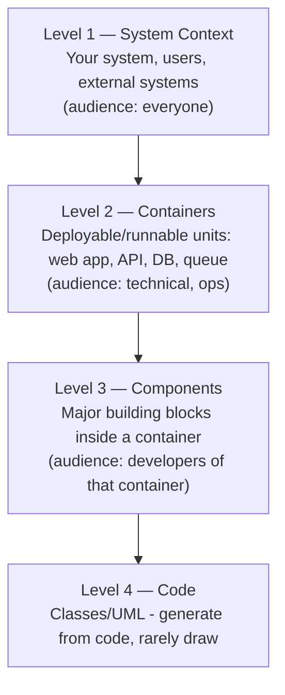
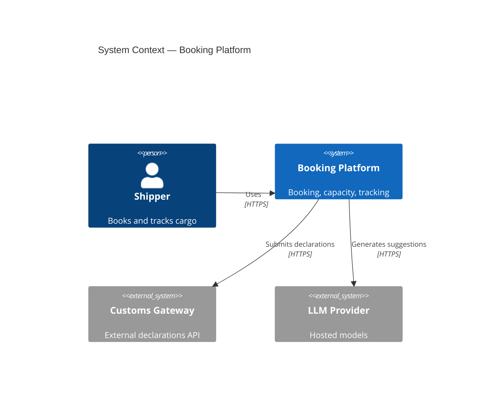
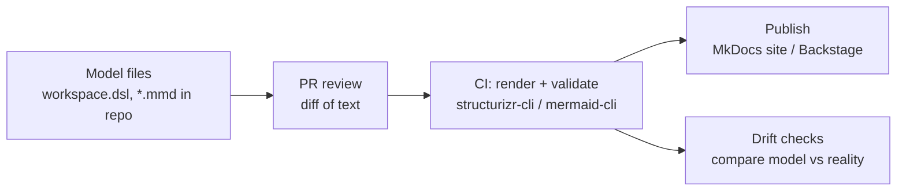

# C4, arc42 & diagrams as code

!!! abstract "At a glance"
    **Priority:** P0 · **Complexity:** 2/5 · **Est. time:** 2 h · **Phase:** 4 · **Prereqs:** [ADRs](adrs.md), [Architecture styles](architecture-styles.md)
    **You're done when:** you can produce a C4 context/container/component set for a real system as code (Structurizr DSL or Mermaid), organise documentation with arc42, and set up a docs-as-code pipeline where diagrams are reviewed in PRs and cannot silently rot.

## Why it matters

Architecture that can't be communicated doesn't exist. A Staff/Principal architect's leverage is proportional to how many people can *accurately* understand and act on the design. The failure modes are well known: the 2019 PowerPoint nobody trusts, the "box-and-arrow" diagram where arrows mean different things, the 80-page Word document nobody reads. C4 (Simon Brown) fixes diagrams; arc42 fixes documentation structure; diagrams-as-code fixes staleness.

In AI-era engineering, good architecture docs are also **agent context**: a repo with a current C4 model, ADRs and a module README lets coding agents make changes that respect boundaries. Conversely, LLMs are decent at *drafting* diagrams from code, which lowers the cost of keeping docs alive, provided a human verifies them.

## Core concepts

### Principles for useful architecture documentation

1. **Audience first.** Executives, delivery teams, operators and security reviewers need different views. One diagram cannot serve all.
2. **Abstractions over pictures.** Agree on what "service", "container", "component" mean before drawing boxes.
3. **Every box: name, type/technology, responsibility. Every arrow: direction, purpose, protocol.** Diagrams lacking these are decoration.
4. **Document what is hard to see in code**: context, decisions, quality requirements, deployment, cross-cutting concepts. Don't duplicate what the code shows.
5. **Keep it near the code and automate.** Docs in the repo, built in CI, reviewed with PRs.
6. **Just enough.** Update cost must be lower than the cost of confusion.

### C4: four levels of zoom



| Level | Elements | Show | Typical count |
|---|---|---|---|
| 1. System Context | Person, Software System | The system in its environment: users, external systems, key relationships | 1 diagram |
| 2. Container | Container = separately runnable/deployable thing (web app, API service, DB, message broker, function) — *not Docker container* | Technology choices, communication protocols, data stores | 1 per system |
| 3. Component | Component = grouping of related functionality behind an interface (module, controller, service) | Inside one container: responsibilities and dependencies | Only for complex containers |
| 4. Code | Classes | Auto-generated if at all | Rare |

Supplementary diagrams: **System Landscape** (all systems in an enterprise), **Dynamic** (numbered interactions for one use case — sequence-like), **Deployment** (containers mapped to infrastructure/regions/nodes).

C4 notation rules that matter: consistent shapes/colours with a **legend**, every element labelled with type and description, titles saying *what the diagram is* ("Container diagram for Booking Platform"), no mixing abstraction levels in one diagram, avoid unlabeled arrows.

### C4 as code: Structurizr DSL

A single model, many views — the strongest argument for code over drawing tools: rename a container once and all views update.

```text
workspace "Booking Platform" "Freight booking and tracking" {
  model {
    customer  = person "Shipper" "Books and tracks cargo"
    ops       = person "Operations Agent" "Handles exceptions"
    customs   = softwareSystem "Customs Gateway" "External declarations API" "External"
    llm       = softwareSystem "LLM Provider" "Hosted foundation models" "External"

    platform  = softwareSystem "Booking Platform" "Booking, capacity, tracking" {
      web     = container "Portal" "Customer UI" "React"
      api     = container "Booking API" "REST/JSON; commands and queries" "Python, FastAPI"
      agent   = container "Exceptions Agent" "Proposes fixes for delayed shipments" "Python, LangGraph"
      db      = container "Booking DB" "Bookings, allocations, outbox" "PostgreSQL 16" "Database"
      bus     = container "Event Backbone" "Domain events" "Kafka"
      gateway = container "LLM Gateway" "Auth, quotas, routing, tracing" "LiteLLM"
    }

    customer -> web "Uses" "HTTPS"
    web -> api "Calls" "JSON/HTTPS"
    api -> db "Reads/writes" "SQL"
    api -> bus "Publishes events (via outbox)" "Kafka"
    agent -> bus "Consumes ShipmentDelayed" "Kafka"
    agent -> gateway "Calls models" "HTTPS"
    gateway -> llm "Forwards requests" "HTTPS"
    api -> customs "Submits declarations" "HTTPS"
    ops -> agent "Approves proposals" "via Portal"
  }
  views {
    systemContext platform "Context" { include * autolayout lr }
    container platform "Containers" { include * autolayout lr }
    styles {
      element "External" { background #999999 color #ffffff }
      element "Database" { shape cylinder }
    }
  }
}
```

Render with Structurizr (Lite/CLI/Cloud), export to Mermaid/PlantUML/D2. Alternatives: **LikeC4** (TypeScript-friendly DSL with live preview), **Mermaid C4 diagrams** (experimental syntax, fine for quick embedding in markdown), **C4-PlantUML**, **IcePanel** (SaaS with drift-friendly modelling), **D2** for general diagrams.

Mermaid C4 quick form (renders in MkDocs Material):



### arc42: structure for architecture documentation

arc42 (Gernot Starke, Peter Hruschka) is a 12-section template — a table of contents for "what should be documented", to be filled *proportionally*:

| # | Section | Content | Notes |
|---|---|---|---|
| 1 | Introduction & goals | Requirements overview, top quality goals, stakeholders | Keep top 3–5 quality goals here |
| 2 | Constraints | Technical, organisational, regulatory | Data residency, tech mandates |
| 3 | Context & scope | Business and technical context | C4 level 1 |
| 4 | Solution strategy | Key decisions, approach | The "one-pager" — write first |
| 5 | Building block view | Static decomposition | C4 levels 2–3 |
| 6 | Runtime view | Key scenarios as sequences | C4 dynamic; sagas, failure flows |
| 7 | Deployment view | Infrastructure mapping | C4 deployment |
| 8 | Cross-cutting concepts | Security, logging, error handling, domain model, i18n | Where the reusable knowledge is |
| 9 | Architecture decisions | Link to ADR log | See [ADRs](adrs.md) |
| 10 | Quality requirements | Quality tree and scenarios | Make -ilities measurable |
| 11 | Risks & technical debt | Known risks, prioritised | Living list |
| 12 | Glossary | Ubiquitous language | Ties to DDD |

Use arc42 as a checklist, delete sections that add nothing. Tools: arc42 in Markdown/AsciiDoc, docToolchain, MkDocs.

### C4 + arc42 + ADRs together

| Question | Artifact |
|---|---|
| What is this system and who uses it? | arc42 §3 with C4 Context |
| What are the moving parts? | arc42 §5 with C4 Container/Component |
| How does checkout work at runtime? | arc42 §6 with C4 Dynamic or sequence diagram |
| Where does it run? | arc42 §7 with C4 Deployment |
| Why did we choose X? | ADR log (arc42 §9) |
| What must it satisfy? | arc42 §1, §10 quality scenarios (measurable) |

### Diagrams-as-code pipeline



Practices:

- Keep model files next to the code they describe; one workspace per system, or per domain.
- **CI validates** the DSL and renders images; fail on syntax errors.
- **Drift detection**: scripts that compare the model with reality — e.g. list of services in the K8s manifests vs containers in the DSL; OpenAPI files vs declared relationships; import-linter modules vs components. Even a coarse check ("every deployed service appears in the model") catches most rot.
- **Generate instead of drawing** where possible: dependency graphs from build files, sequence diagrams from OpenTelemetry traces (Tempo/Jaeger service graphs), ERDs from schema.
- **Ownership**: each diagram has an owning team; review during quarterly architecture reviews.

### Documenting AI-era systems

Add to C4 views: the **LLM provider(s)** and **LLM gateway** as containers/systems; **vector store**, **eval pipeline**, **prompt registry** as containers; **agent** containers with their tool sets (components); **data flows crossing trust boundaries** (what goes to which model), annotated with data classification. A dynamic diagram of one agent run (user → orchestrator → retriever → model → tool → human approval) doubles as a threat-modelling aid and eval scope.

### Senior-level nuance

- The **container diagram is the workhorse** — most teams need only Context + Container + one or two dynamic/deployment views.
- Avoid the "arrow soup": if a diagram has > 20 elements, split by level or domain.
- Use **views for a purpose** ("security view", "data-flow view") derived from the same model.
- **Sequence diagrams** are excellent for runtime behaviour, particularly for sagas and failure paths; keep them as text (Mermaid `sequenceDiagram`).
- Docs decay from **lack of triggers**: tie updates to events (new service → PR checklist; new ADR → update building-block view).

## Resources

| Resource | Type | Why this one | Level | Cost |
|---|---|---|---|---|
| [The C4 model (Simon Brown)](https://c4model.com/) | docs | Canonical definitions, notation guidance, FAQs, and examples | beginner | free |
| [C4 model — Diagrams and abstractions](https://c4model.com/abstractions) | docs | Precise definitions of person/system/container/component | beginner | free |
| [Structurizr DSL docs](https://docs.structurizr.com/dsl) | docs | Reference for the DSL, views, styles, deployment and dynamic views | intermediate | free |
| [arc42](https://arc42.org/) and [docs](https://docs.arc42.org/home/) | docs | The template, with tips per section and worked examples | beginner | free |
| [LikeC4](https://likec4.dev/) :gem: | tool | Architecture-as-code with live previews and embeddable views; friendly for repos | intermediate | free |
| [Mermaid C4 syntax](https://mermaid.js.org/syntax/c4.html) | docs | C4 diagrams inline in Markdown docs (marked experimental) | beginner | free |
| [C4-PlantUML](https://github.com/plantuml-stdlib/C4-PlantUML) | tool | Mature C4 macros for PlantUML | intermediate | free |
| [IcePanel](https://icepanel.io/) | tool | Model-based C4 with flows and drift-friendly practices | intermediate | freemium |
| [D2 language](https://d2lang.com/) :gem: | tool | Modern diagram language with beautiful layouts for non-C4 pictures | intermediate | free |

## Hands-on lab

**Goal:** document the capstone architecture as code. 90–120 min.

1. Create `docs/architecture/` in your repo with `workspace.dsl` (Structurizr) or LikeC4 files.
2. Model: 2 persons, 3 external systems, one system with ≥ 6 containers (include LLM gateway, vector store, event backbone).
3. Views: Context, Container, one Dynamic view (e.g. "agent proposes reroute with human approval"), one Deployment view (dev vs prod).
4. Write arc42 sections 1, 2, 4, 10 (quality scenarios with numbers) and 12 (glossary); link to ADRs.
5. Add CI: render with `structurizr-cli` (or LikeC4 CLI) and publish to MkDocs; fail on DSL errors.
6. Write a 20-line drift script: parse `docker-compose.yml`/K8s manifests and assert every service appears in the model.
7. Ask an LLM to draft a component diagram for one container from its code; correct it and note errors — discuss how you'd verify.

**Expected output:** rendered diagrams, arc42 stub, CI job, drift check, and a list of LLM-draft errors.

## Questions

### L1 — Recall

??? question "Q1. Name the four C4 levels and their primary audiences."
    ??? success "Answer"
        Level 1 System Context (everyone, incl. non-technical), Level 2 Containers (technical stakeholders, ops, architects), Level 3 Components (developers working in a container), Level 4 Code (rarely drawn; developers, usually generated). Plus supplementary landscape, dynamic and deployment diagrams.

??? question "Q2. What is a 'container' in C4 and what is it not?"
    ??? success "Answer"
        A container is an independently runnable/deployable unit that hosts code or data: web app, API service, database, message broker, serverless function, mobile app. It is not (necessarily) a Docker container; two Docker containers may form one C4 container, and a database is a container. It's about runtime boundaries and technology choices.

??? question "Q3. List the 12 sections of arc42 (at least eight) and the section you'd write first."
    ??? success "Answer"
        Introduction & goals; Constraints; Context & scope; Solution strategy; Building block view; Runtime view; Deployment view; Cross-cutting concepts; Architecture decisions; Quality requirements; Risks & technical debt; Glossary. Write Solution strategy (and quality goals) first: it forces the key decisions and gives readers the story before details.

??? question "Q4. Why prefer text-based diagrams (diagrams as code) over drawing tools?"
    ??? success "Answer"
        Diffable and reviewable in PRs, version-controlled with the code, a single model can generate multiple views, enable CI validation and drift checks, consistent styling, and lower friction to update. Trade-offs: layout control is limited and there's a learning curve, so keep drawing tools for exploratory sketches.

### L2 — Apply

??? question "Q5. Draw (describe) the C4 container diagram elements for a RAG-based support assistant."
    ??? success "Answer"
        Person: Support agent/customer. Containers: Chat UI (web app), Assistant API (FastAPI) orchestrating retrieval and generation, LLM Gateway (routing, quotas, tracing), Vector/Search store (pgvector or OpenSearch — hybrid search), Document ingestion pipeline (worker), Blob storage (source documents), Relational DB (conversations, feedback), Evaluation/observability platform (Langfuse/Phoenix), Identity provider (external). Relationships labelled with protocol and purpose (e.g. Assistant API → Vector store "hybrid query, SQL", Ingestion → Embeddings via gateway). Mark trust boundaries and data classification on flows to the external LLM provider.

??? question "Q6. Write a Mermaid sequence diagram for the failure path where payment is declined in the booking saga."
    ??? success "Answer"
        Participants: Client, Orchestrator, Capacity, Payment. Flow: Client → Orchestrator: CreateBooking; Orchestrator → Capacity: ReserveCapacity; Capacity → Orchestrator: CapacityReserved; Orchestrator → Payment: AuthorizePayment; Payment → Orchestrator: PaymentDeclined; Orchestrator → Capacity: ReleaseCapacity (compensation); Capacity → Orchestrator: CapacityReleased; Orchestrator → Client: BookingRejected. Use `alt` blocks for success vs failure. Failure paths are the most valuable content in runtime views.

??? question "Q7. Design a drift check that keeps the architecture model honest with minimal effort."
    ??? success "Answer"
        Compare machine-readable sources of truth against the model: (1) deployed services (K8s manifests/Helm/Compose/Terraform) vs C4 containers — fail on unlisted deployables; (2) OpenAPI/AsyncAPI specs vs declared relationships (an API consumer listed in the model must exist in code/config); (3) service graph from tracing (last 30 days) vs modelled relationships — report unmodelled edges as warnings; (4) import-linter component list vs component view. Run nightly in CI, open an issue on drift, and keep tolerances loose enough to avoid noise. Owners fix or update the model.

### L3 — Design & trade-offs

??? question "Q8. Structurizr DSL vs Mermaid C4 vs a drawing tool (draw.io/Miro) for a 40-engineer org. Decide."
    ??? success "Answer"
        Structurizr DSL (or LikeC4) as the system-of-record model: one model → many views, strong C4 semantics, exports to Mermaid/PlantUML, CI-friendly. Mermaid for lightweight diagrams embedded directly in READMEs/ADRs (sequence, flow, state) since it renders natively in GitHub/MkDocs. draw.io/Miro for workshops and exploratory sketches, exported as images only when needed. Avoid making the drawing tool the source of truth (rots). Adoption tips: templates, a docs repo skeleton, an example workspace, and a "docs as code" CI job so teams start with a working baseline. Reassess if the DSL learning curve blocks non-engineers — then IcePanel-style SaaS could help.

??? question "Q9. How much documentation is 'just enough' for a 6-person team vs a 300-person org?"
    ??? success "Answer"
        6-person team: README + C4 context/container in the repo, a handful of ADRs, arc42 sections 1/3/4/10 in brief, runtime diagrams for two critical flows; total maybe 10–15 pages. 300-person org: a system landscape and per-domain containers/components, a documented platform ("paved road"), org-wide ADRs, quality scenarios, deployment/security views for regulated systems, discoverability (catalogue like Backstage), ownership metadata and a governance rhythm. In both cases scale the *update cost* to the *cost of confusion*, and generate rather than hand-maintain where possible.

??? question "Q10. You must present the AI assistant architecture to (a) the CISO, (b) the CFO, (c) the platform engineers. How do the views differ?"
    ??? success "Answer"
        CISO: context and data-flow view with trust boundaries, data classification, authn/z, what goes to which model provider, retention, prompt-injection controls, audit logging, threat-model annotations. CFO: a simple context + capability view with cost drivers (tokens/task, infra), scaling assumptions and unit economics, build/buy choices and risks. Platform engineers: container/component/deployment views, contracts (APIs, events), SLOs, runbooks, dependencies, and quality scenarios. Same underlying model, different views and levels of abstraction — a key benefit of a modelling approach.

### L4 — Staff-level ambiguity

??? question "Q11. Documentation across 80 services is stale and diagrams contradict each other. You have one quarter and no dedicated tech writers. Plan."
    ??? success "Answer"
        Don't try to document everything. (1) Define a minimal standard: per service a README + C4 container view in the repo + owner metadata + ADR folder; org-level landscape assembled automatically from per-service models. (2) Generate what you can: service catalogue from deployment manifests (Backstage), dependency graph from traces; publish as the landscape. (3) Prioritise the top 10 critical services/flows (by incidents, revenue) for full docs including runtime views of key failure modes. (4) Make it stick with triggers: PR template item, "new service" scaffold includes docs, quarterly review with drift reports. (5) Measure: % services with current model, time-to-onboard, incident MTTR involving docs. (6) Use LLMs to draft first versions from code and traces; owners review. Communicate what's deliberately not documented.

??? question "Q12. Architects and delivery teams disagree: the architects want C4 models kept centrally; teams want to own docs in their repos. Resolve."
    ??? success "Answer"
        Federate: teams own their system/container-level models in their repos (single source of truth near code, updated in PRs); the architecture group owns the *landscape* and cross-cutting views built by aggregating team models via CI (Structurizr workspace extension/includes, or generated catalogue), plus standards (notation, metadata, naming) and tooling templates. Central models fail from stale data; local-only models fail from inconsistency and no cross-system view. Use automated validation to enforce minimum standards, and a guild to evolve them. This mirrors Team Topologies: platform/enabling team provides tooling; stream-aligned teams own content.

## Real-world use cases

- **Enterprise landscape maps** built from per-team Structurizr/LikeC4 models aggregated in a portal (Backstage TechDocs).
- **Regulated industries** using arc42 as the basis for audit-ready architecture documentation.
- **Onboarding**: C4 context/container diagrams and dynamic views reduce new-hire ramp-up.
- **Incident response**: runtime views showing dependencies and failure modes speed diagnosis.
- **AI security reviews**: data-flow diagrams showing what leaves the trust boundary to model providers.

## Pitfalls & anti-patterns

- Boxes and arrows without legends, labels or consistent semantics.
- Mixing levels of abstraction in one diagram.
- One giant "everything" diagram.
- Diagrams in binary tools with no owner or update trigger.
- Copying code structure into docs (documenting what code already says).
- Documenting only the happy path.
- Treating arc42 as a form to fill completely instead of a checklist.

## Checklist

- [ ] I can draw C4 levels 1–2 for a real system and explain each element's semantics
- [ ] I modelled a system in Structurizr DSL (or LikeC4) with multiple views from one model
- [ ] I can outline arc42 and map sections to C4 and ADRs
- [ ] I set up CI rendering and at least one drift check
- [ ] I answered all L3 questions out loud in < 3 min each
