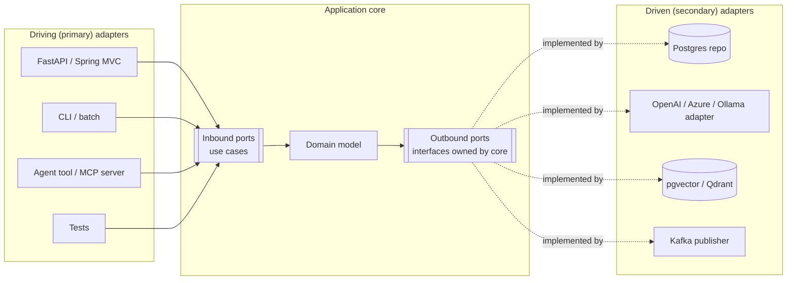

# Hexagonal / clean architecture, ports & adapters

!!! abstract "At a glance"
    **Priority:** P0 · **Complexity:** 2/5 · **Est. time:** 3 h · **Phase:** 2 · **Prereqs:** [DDD tactical](ddd-tactical.md), [Architecture patterns in Python](../python/architecture-patterns-python.md), [SOLID & refactoring](solid-refactoring.md)
    **You're done when:** you can build a service where the domain and use cases have zero imports of frameworks, databases or LLM SDKs, swap an adapter (e.g. OpenAI → local Ollama, Postgres → in-memory) without touching the core, and explain when this structure is overkill.

## Why it matters

Ports & adapters (Alistair Cockburn, 2005) is the structural pattern that makes **volatile dependencies replaceable** and **business logic testable in milliseconds**. In 2026 the most volatile dependency in most systems is the LLM provider: models are deprecated within a year, prices change monthly, and you want to route between providers or run locally. Putting "LLM completion", "embedding" and "vector search" behind ports is the single highest-leverage architectural move for AI features.

It also underpins testing strategy (fast unit tests against fakes), modular monoliths (modules exposing ports), and strangler migrations (swap an adapter from legacy to new).

## Core concepts

### The idea in one picture



- **Ports** are interfaces *owned by the core*, expressed in domain language: `BookingRepository`, `RateQuoteProvider`, `TextGenerator`.
- **Driving adapters** call the core (HTTP controllers, message consumers, CLI, MCP tool handlers, tests).
- **Driven adapters** implement outbound ports (DB, APIs, LLMs, queues).
- **Dependency rule**: source-code dependencies point *inward*. The core never imports an adapter. This is Dependency Inversion (the D in SOLID) applied at architecture scale.

### Hexagonal vs onion vs clean

| | Hexagonal (Cockburn) | Onion (Palermo) | Clean (Martin) |
|---|---|---|---|
| Core metaphor | Inside vs outside; ports on the boundary | Concentric layers: domain model → domain services → app services → infra | Concentric: entities → use cases → interface adapters → frameworks |
| Prescribes inner layering? | No | Yes | Yes |
| Key rule | App is driven equally by UI, tests, other apps | Dependencies point to centre | Dependency rule: inner circles know nothing of outer |
| Emphasis | Symmetry of driving/driven sides; testability | Domain model at centre | Use cases (interactors) as first-class |

They are variations of one idea. Herberto Graça's "Explicit Architecture" post stitches them together with DDD and CQRS. Pick the vocabulary your team understands and enforce the dependency rule; don't argue about circles.

### A Python sketch: an LLM behind a port

```python
# app/domain/ports.py  -- owned by the core, domain language, no SDK types
from typing import Protocol
from dataclasses import dataclass

@dataclass(frozen=True)
class DelayExplanation:
    summary: str
    customer_message: str
    confidence: float

class DelayExplainer(Protocol):
    def explain(self, shipment_id: str, events: list[str]) -> DelayExplanation: ...

class ShipmentRepository(Protocol):
    def events_for(self, shipment_id: str) -> list[str]: ...

class Notifier(Protocol):
    def send(self, customer_id: str, text: str) -> None: ...
```

```python
# app/application/notify_delay.py  -- use case (inbound port implementation)
from app.domain.ports import DelayExplainer, ShipmentRepository, Notifier

class NotifyCustomerOfDelay:
    def __init__(self, repo: ShipmentRepository, explainer: DelayExplainer,
                 notifier: Notifier, min_confidence: float = 0.7):
        self.repo, self.explainer, self.notifier = repo, explainer, notifier
        self.min_confidence = min_confidence

    def __call__(self, shipment_id: str, customer_id: str) -> bool:
        events = self.repo.events_for(shipment_id)
        exp = self.explainer.explain(shipment_id, events)
        if exp.confidence < self.min_confidence:
            return False                     # route to human queue instead
        self.notifier.send(customer_id, exp.customer_message)
        return True
```

```python
# app/adapters/llm_explainer.py  -- driven adapter; the only file importing an SDK
from pydantic import BaseModel
from pydantic_ai import Agent
from app.domain.ports import DelayExplanation

class _Out(BaseModel):
    summary: str
    customer_message: str
    confidence: float

class PydanticAIDelayExplainer:
    def __init__(self, model: str = "openai:gpt-4.1-mini"):   # or "ollama:..." etc.
        self._agent = Agent(model, output_type=_Out,
                            system_prompt="Explain shipment delays factually from events.")

    def explain(self, shipment_id, events):
        out = self._agent.run_sync("\n".join(events)).output
        return DelayExplanation(out.summary, out.customer_message, out.confidence)
```

```python
# tests/fakes.py  -- fast, deterministic tests of the use case
class FakeExplainer:
    def __init__(self, confidence): self.confidence = confidence
    def explain(self, shipment_id, events):
        return DelayExplanation("port congestion", "Your shipment is delayed 2 days.", self.confidence)
```

The use case is unit-tested with fakes in microseconds; the adapter is tested separately with **contract tests** and **evals** (does the real model produce good explanations?). Swapping providers touches one file and the composition root. Note: model identifiers above are illustrative — check current provider names.

### Java sketch (Spring)

```java
// core: no Spring imports
public interface RateQuoteProvider {             // outbound port
    Money quote(PortCode origin, PortCode destination, ContainerType type);
}
public final class QuoteBooking {                // use case
    private final RateQuoteProvider rates;
    public QuoteBooking(RateQuoteProvider rates) { this.rates = rates; }
    public Quote handle(QuoteRequest req) { /* domain logic */ }
}

// adapter module: Spring, HTTP client, Spring AI etc.
@Component
class PricingServiceRateAdapter implements RateQuoteProvider { /* RestClient call + ACL mapping */ }

@Configuration
class Wiring {                                    // composition root
    @Bean QuoteBooking quoteBooking(RateQuoteProvider p) { return new QuoteBooking(p); }
}
```

Enforce with ArchUnit or jMolecules (`@Port`, `@Adapter` annotations + verification) in Java; `import-linter` layers/forbidden contracts in Python.

### Composition root and dependency injection

Wire adapters to ports in one place (FastAPI `lifespan`/dependency providers, Spring `@Configuration`). Avoid service locators sprinkled through the core. In Python, plain constructor injection plus a small `bootstrap.py` (as in Cosmic Python) beats DI frameworks for most services.

### How much is enough? A decision table

| Situation | Recommendation |
|---|---|
| CRUD service, one DB, little logic | Don't. Framework-native layering (FastAPI + SQLAlchemy models) is fine |
| Core domain with rich rules | Yes: domain + use cases isolated, ports for persistence and integrations |
| Any LLM/embedding/vector dependency | Yes, at least a port for the model call — providers and models churn |
| Strangler migration from legacy | Yes: port with legacy adapter now, new adapter later |
| Short-lived prototype / spike | No, but keep LLM calls in one module |
| Library/SDK code | Ports make sense for pluggable backends |

### Senior-level nuance

- **Ports should be shaped by the core's needs, not the adapter's capabilities.** A `VectorStore` port with 40 methods mirroring Qdrant's API isn't a port; it's a leaky wrapper. Prefer `find_similar_clauses(query, jurisdiction, k)`.
- **Don't abstract what isn't volatile.** Wrapping the standard library or your language's HTTP client adds cost without benefit.
- **Transactions**: the Unit of Work is an outbound port too (`uow.commit()`), so use cases control transaction boundaries without importing SQLAlchemy.
- **LLM port granularity**: a generic `LLM.complete(prompt)` port leaks prompt engineering into the core. A *task-shaped* port (`DelayExplainer`, `ClauseClassifier`) keeps prompts, model choice and output parsing in the adapter, where they can be evaluated and swapped together.
- **Agents as driving adapters**: an MCP server or agent tool that calls your use cases is just another driving adapter — the same inbound port serves HTTP, CLI and AI tools, with the same authorisation and invariants.

## Resources

| Resource | Type | Why this one | Level | Cost |
|---|---|---|---|---|
| [Hexagonal Architecture (Alistair Cockburn)](https://alistair.cockburn.us/hexagonal-architecture/) | article | The original — short, and clearer than most retellings | intermediate | free |
| [Hexagonal Architecture explained (Juan Manuel Garrido de Paz)](https://jmgarridopaz.github.io/content/hexagonalarchitecture.html) :gem: | article | The most rigorous, well-illustrated walkthrough of driving vs driven ports | intermediate | free |
| [Explicit Architecture (Herberto Graça)](https://herbertograca.com/2017/11/16/explicit-architecture-01-ddd-hexagonal-onion-clean-cqrs-how-i-put-it-all-together/) :gem: | article | Integrates hexagonal, onion, clean, DDD and CQRS in one diagram | advanced | free |
| [The Clean Architecture (Robert C. Martin)](https://blog.cleancoder.com/uncle-bob/2012/08/13/the-clean-architecture.html) | article | The dependency rule, concisely | intermediate | free |
| [Cosmic Python (Percival & Gregory)](https://www.cosmicpython.com/) :gem: | book | Ports/adapters, repository, UoW, bootstrap in idiomatic Python — free online | intermediate | free |
| [Domain-Driven Hexagon (Sairyss)](https://github.com/sairyss/domain-driven-hexagon) | docs | Huge annotated reference repo (TypeScript) with rationale for every folder | intermediate | free |
| [import-linter docs](https://import-linter.readthedocs.io/) | docs | Enforce layers and forbidden imports in Python CI | intermediate | free |
| [ArchUnit](https://www.archunit.org/) | docs | Enforce hexagonal rules in Java tests | intermediate | free |
| [Pydantic AI docs](https://ai.pydantic.dev/) | docs | Model-agnostic agents, handy inside LLM adapters | intermediate | free |

## Hands-on lab

**Goal:** build a hexagonal service with swappable LLM adapters. 90–120 min.

1. Implement the `NotifyCustomerOfDelay` use case above with `ShipmentRepository`, `DelayExplainer`, `Notifier` ports.
2. Adapters: in-memory repo, SQLAlchemy repo; `FakeExplainer`, `PydanticAIDelayExplainer` using a hosted model, and the same adapter pointed at a local Ollama model; `ConsoleNotifier`.
3. Driving adapters: FastAPI endpoint *and* an MCP tool (or a CLI) calling the same use case.
4. Add import-linter contracts: `app.domain` and `app.application` may not import `pydantic_ai`, `sqlalchemy`, `fastapi`.
5. Tests: use-case unit tests with fakes (< 50 ms total); a small eval (10 shipment event histories with expected key facts) run against both real adapters; compare quality, latency and cost.
6. Swap the provider via configuration only.

**Expected output:** passing lint contracts, fast tests, and an eval table comparing two models. This is a capstone building block.

## Questions

### L1 — Recall

??? question "Q1. What is a port and who owns it?"
    ??? success "Answer"
        A port is an interface at the boundary of the application core, expressed in domain terms, defining how the core is driven (inbound/driving) or what it needs from the outside (outbound/driven). The core owns ports; adapters depend on them. Ownership is the key: the interface is designed for the core's needs, not mirroring an external API.

??? question "Q2. State the dependency rule of clean architecture."
    ??? success "Answer"
        Source code dependencies must point only inward, toward higher-level policies. Nothing in an inner circle (entities, use cases) may know anything about outer circles (controllers, gateways, frameworks, DBs), including names of functions, classes or data formats declared there. Data crossing boundaries is in forms convenient for the inner circle.

??? question "Q3. Give two examples each of driving and driven adapters in an AI-enabled service."
    ??? success "Answer"
        Driving: FastAPI HTTP controller; Kafka consumer; MCP server exposing a use case as a tool; a test harness or eval runner. Driven: Postgres repository; OpenAI/Azure/Ollama LLM adapter; pgvector similarity-search adapter; email/SMS notifier; outbox publisher.

### L2 — Apply

??? question "Q4. Your use case calls `openai.chat.completions.create` directly and tests mock the SDK. Refactor plan?"
    ??? success "Answer"
        1. Identify the *task* the call performs (e.g. classify customs document type). 2. Define a task-shaped port in the core: `DocumentClassifier.classify(text) -> DocumentType` with domain types. 3. Move SDK call, prompt, model name, parsing and retries into an adapter implementing the port. 4. Inject it via the composition root. 5. Replace SDK mocks with a fake classifier in use-case tests; add adapter-level tests with recorded responses and an eval set for quality. 6. Add import-linter rule forbidding `openai` imports in core. Result: tests independent of SDK shape, provider swap limited to one adapter.

??? question "Q5. Design the port for semantic retrieval over contract clauses so that switching from pgvector to Qdrant is painless."
    ??? success "Answer"
        `class ClauseRetriever(Protocol): def find_relevant(self, question: str, jurisdiction: Jurisdiction, k: int = 8) -> list[ClauseHit]` where `ClauseHit` has clause_id, text, score, source metadata. The port hides embeddings, index type, hybrid scoring and reranking. Adapters: `PgVectorClauseRetriever` (SQL with `<=>` + filters), `QdrantClauseRetriever` (payload filters), each with its own embedding call. Keep ingestion (`ClauseIndexer.index(clause)`) as a separate port. Write a shared contract test suite (same fixtures, assert expected top-k contains known clauses) run against both adapters, plus retrieval evals (recall@k).

??? question "Q6. Where should the database transaction boundary live in a hexagonal Python service?"
    ??? success "Answer"
        In the application layer (use case), via a Unit of Work port: `with self.uow: booking = self.uow.bookings.get(id); booking.confirm(); self.uow.commit()`. The UoW adapter wraps SQLAlchemy sessions. Controllers shouldn't manage transactions (they'd duplicate across driving adapters), and the domain shouldn't (it must stay persistence-ignorant). This also gives a natural place to collect domain events and write them to the outbox atomically.

### L3 — Design & trade-offs

??? question "Q7. A colleague argues hexagonal architecture is over-engineering for your 8-endpoint FastAPI service. When do you agree?"
    ??? success "Answer"
        Agree when: logic is mostly CRUD/validation; one datastore unlikely to change; no volatile external dependencies; short expected lifetime; small team. The cost (more files, indirection, mapping between layers) outweighs benefit. Disagree when: there's non-trivial domain logic, an LLM or third-party API likely to change, need for fast tests without infra, or multiple driving adapters (API + worker + agent tool). Middle ground: keep FastAPI + SQLAlchemy directly, but isolate the one volatile dependency (LLM) behind a port. Architecture should be proportional to volatility and complexity.

??? question "Q8. Generic `LLMClient.complete(prompt)` port vs task-specific ports (`Summariser`, `Classifier`). Trade-offs?"
    ??? success "Answer"
        Generic port: one abstraction, easy provider switching, reusable; but prompts, output parsing and model choice leak into the core, making the core depend on prompt engineering and hard to test (tests assert on prompt strings). Task-specific ports: core expresses intent in domain types; each adapter encapsulates prompt+model+parsing and can be evaluated and swapped independently (e.g. classifier moves to a fine-tuned small model, summariser stays on a frontier model); more interfaces to maintain. Best of both: task-specific ports in the core, implemented by adapters that share a generic internal gateway client (the gateway handles auth, retries, routing, telemetry).

??? question "Q9. How do you prevent the 'ports' from slowly acquiring adapter-specific concepts over time?"
    ??? success "Answer"
        (1) Name ports and types in the ubiquitous language; code-review rule: no vendor types (e.g. `ChatCompletion`, `ScoredPoint`) in core signatures. (2) import-linter/ArchUnit contracts in CI. (3) Maintain at least two adapters per important port (real + fake, or two providers) — a second implementation exposes leaks. (4) Shared contract tests all adapters must pass. (5) Periodic architecture review of port diffs. The second-adapter rule is the strongest in practice.

### L4 — Staff-level ambiguity

??? question "Q10. Your org has 30 services calling LLM providers directly with different SDKs. You want provider portability and cost control. Propose an architecture and migration plan."
    ??? success "Answer"
        Two layers: (1) **Platform**: an LLM gateway (e.g. LiteLLM-based or managed) providing a single OpenAI-compatible API, auth, per-team quotas, cost attribution, caching, routing/failover, logging to the tracing backend. (2) **Service-level**: each service defines task-shaped ports; its adapters call the gateway, not providers. Migration: start with the gateway (point base URLs at it — minimal code change, immediate cost visibility); publish a reference implementation/template of ports + adapter + eval harness; migrate services opportunistically when they next change their AI feature; track via fitness function (no direct provider SDK imports outside adapters, no provider hostnames in egress except from the gateway). Communicate benefits in cost and incident terms. See [Model routing & gateways](../agentic-ai/model-routing-gateways.md).

??? question "Q11. A team insists on 'pure' clean architecture with 6 layers and mapping DTOs at every boundary; delivery has slowed to a crawl. How do you intervene?"
    ??? success "Answer"
        Acknowledge the goal (isolation, testability) and measure the cost: lead time, lines of mapping code per feature, defect rate. Propose proportionality: keep the dependency rule and ports where volatility exists; collapse layers where they add no decision (e.g. use cases that only forward to repositories; DTOs identical to domain objects). Allow reading straight from the DB for queries (CQRS-lite). Agree on a team guideline and try it on the next two features, comparing metrics. Frame it as "we keep the invariant (dependencies point inward), we drop ceremony that protects nothing". Model the behaviour with a PR rather than a mandate.

## Real-world use cases

- **LLM provider portability**: services with a `TextGenerator`/task port switched from one provider to another (or to a local model for data-sensitive tenants) by swapping adapters.
- **Payments**: payment service providers (Stripe, Adyen, local PSPs) behind a `PaymentGateway` port per country.
- **Legacy strangling**: `CustomerDirectory` port implemented first by a mainframe adapter, later by a new service.
- **Testing at scale**: thousands of use-case tests running in seconds with in-memory adapters, and a smaller set of integration tests with Testcontainers.
- **Agent tooling**: the same `CreateBooking` use case exposed over REST, as an MCP tool and to a batch importer.

## Pitfalls & anti-patterns

- Ports mirroring the vendor API (leaky abstractions).
- Framework annotations/ORM models inside the domain.
- One generic `Repository<T>` with 30 methods rather than intention-revealing repositories.
- DTO-mapping ceremony at every layer for CRUD code.
- Composition scattered across the codebase (service locators, global singletons).
- Mocking SDKs instead of defining ports — brittle tests coupled to vendor shapes.
- Putting prompts in the domain layer.

## Checklist

- [ ] I can explain ports, adapters, driving vs driven, and the dependency rule without notes
- [ ] I built a service with a task-shaped LLM port and two swappable adapters
- [ ] I enforced the dependency rule with import-linter or ArchUnit
- [ ] I can argue when hexagonal is overkill
- [ ] I answered all L3 questions out loud in < 3 min each
