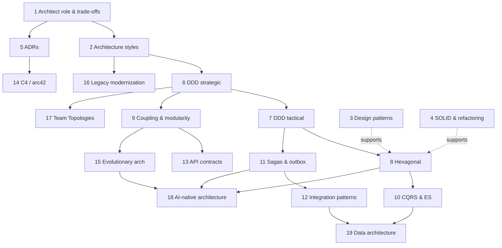

# Architecture & Design

The track that turns a strong senior engineer into a Staff/Principal architect: trade-off thinking, decomposition (DDD, styles, coupling), the patterns that make distributed systems correct (hexagonal, CQRS/ES, sagas, outbox), the practices that keep architecture alive (ADRs, C4, fitness functions, modernization), the sociotechnical layer (Team Topologies), and — new in 2026 — how to treat LLMs and agents as first-class system components.

!!! abstract "Track at a glance"
    **19 topics · ~53 h of core study · Phases 1–5 · Question bank:** [questions.md](questions.md) (60+ graded questions, 16 katas, 25 rapid-fire)
    **Outcome:** you can decompose an ambiguous domain, choose and defend an architecture style, record the decision, evolve it safely, and design AI-enabled systems with clear autonomy and trust boundaries, in interviews and on the job.

## Topic table

| # | Topic | Priority | Complexity | Phase | Hours |
|---|---|---|---|---|---|
| 1 | [The architect role & trade-off thinking](architect-role-tradeoffs.md) | P0 | 2 | 1 | 2 |
| 2 | [Architecture styles: modular monolith → microservices → event-driven → serverless](architecture-styles.md) | P0 | 3 | 1 | 4 |
| 3 | [Design patterns that still matter (GoF, modern)](design-patterns.md) | P1 | 2 | 1 | 3 |
| 4 | [SOLID, refactoring & code quality at scale](solid-refactoring.md) | P1 | 2 | 1 | 2 |
| 5 | [Architecture Decision Records](adrs.md) | P0 | 1 | 1 | 1 |
| 6 | [DDD strategic: subdomains, bounded contexts, context maps](ddd-strategic.md) | P0 | 3 | 2 | 4 |
| 7 | [DDD tactical: aggregates, entities, value objects, domain events](ddd-tactical.md) | P0 | 3 | 2 | 3 |
| 8 | [Hexagonal / clean architecture, ports & adapters](hexagonal-clean.md) | P0 | 2 | 2 | 3 |
| 9 | [Coupling, cohesion & modularity (balanced coupling)](coupling-modularity.md) | P0 | 3 | 2 | 3 |
| 10 | [CQRS & event sourcing](cqrs-event-sourcing.md) | P1 | 4 | 3 | 4 |
| 11 | [Sagas, outbox & distributed transactions](sagas-outbox.md) | P0 | 4 | 3 | 3 |
| 12 | [Enterprise integration patterns](integration-patterns.md) | P1 | 3 | 3 | 3 |
| 13 | [API contracts, versioning & schema evolution](api-contracts-versioning.md) | P1 | 3 | 3 | 2 |
| 14 | [C4, arc42 & diagrams as code](documenting-architecture.md) | P0 | 2 | 4 | 2 |
| 15 | [Evolutionary architecture & fitness functions](evolutionary-architecture.md) | P1 | 3 | 4 | 2 |
| 16 | [Legacy modernization & strangler fig](legacy-modernization.md) | P0 | 3 | 4 | 3 |
| 17 | [Team Topologies & Conway's law](team-topologies.md) | P0 | 2 | 4 | 2 |
| 18 | [AI-native architecture: LLMs as system components](ai-native-architecture.md) | P0 | 4 | 4 | 4 |
| 19 | [Data architecture: lakehouse, data mesh, CDC](data-architecture.md) | P1 | 3 | 5 | 3 |

## How the topics fit together

## Recommended path

Total core reading and labs: about 53 h; plan 12–15 h/week alongside other tracks.

1. **Phase 1 — Frame the job (≈ 12 h).** Architect role, styles, ADRs first (P0). Design patterns and SOLID are refreshers for a 15-year engineer; skim, then do the labs (the LLM decorator pipeline and the characterisation-test refactor are the valuable parts). *Deliverable:* your first three ADRs in the capstone repo.
2. **Phase 2 — Decompose (≈ 13 h).** DDD strategic → tactical → hexagonal → coupling. Do the EventStorming lab on a domain you know and the balanced-coupling review on real code. *Deliverable:* context map + one aggregate with a concurrency test + an import-linter contract.
3. **Phase 3 — Make it correct across boundaries (≈ 12 h).** Sagas & outbox first (P0), then integration patterns, API contracts, CQRS/ES (P1; read critically, decide when *not* to use it). *Deliverable:* outbox + idempotent consumer + saga passing chaos tests; compatibility gates in CI.
4. **Phase 4 — Keep it alive and connect to AI (≈ 13 h).** C4/arc42, evolutionary architecture, legacy modernization, Team Topologies, then **AI-native architecture** as the synthesis. *Deliverable:* C4 model as code, five fitness functions, and an ADR-backed AI capability with autonomy level and evals.
5. **Phase 5 — Data (≈ 3 h).** Data architecture, once CQRS, outbox and CDC are familiar.

Then drill: the [question bank](questions.md) — do L3/L4 questions and katas out loud (< 3 min each for L3, 10–15 min for katas), one kata per weekend.

## Key books (priority order)

| Book | Why | Covers topics |
|---|---|---|
| *Fundamentals of Software Architecture, 2nd ed.* (Richards & Ford) | The vocabulary and the styles chapters | 1, 2 |
| *Software Architecture: The Hard Parts* (Ford, Richards, Sadalage, Dehghani) | Decomposition, data, sagas, coupling — the Staff-level trade-off book | 2, 9, 11 |
| *Learning Domain-Driven Design* (Khononov) | The clearest modern DDD | 6, 7 |
| *Balancing Coupling in Software Design* (Khononov) :gem: | The coupling model used throughout this track | 9 |
| *Architecture Modernization* (Tune & Perrin) :gem: | DDD + sociotechnical modernization | 6, 16, 17 |
| *Cosmic Python* (Percival & Gregory; free online) :gem: | Hexagonal, repository, UoW, events in Python | 7, 8, 10, 11 |
| *Building Evolutionary Architectures, 2nd ed.* | Fitness functions | 15 |
| *Team Topologies* (Skelton & Pais) | Conway, team types, cognitive load | 17 |
| *Microservices Patterns, 2nd ed.* (Richardson) and [microservices.io](https://microservices.io/) | Sagas, outbox, decomposition; the site is free | 2, 11 |
| *Enterprise Integration Patterns* (Hohpe & Woolf) and its [free site](https://www.enterpriseintegrationpatterns.com/) | The integration vocabulary | 12 |
| *The Architect Elevator* (Hohpe) | The Staff+ role between penthouse and engine room | 1 |
| *Designing Data-Intensive Applications, 2nd ed.* (Kleppmann & Riccomini) | Foundations for CQRS, CDC, data architecture | 10, 19 |
| *A Philosophy of Software Design* (Ousterhout) | Counterweight to over-abstraction | 3, 4 |

The curated, machine-readable list lives in `data/resources/architecture.yml`.

## Cross-track links

- Distributed-systems foundations: [Messaging & streaming](../system-design/messaging-streaming.md), [Consistency models](../system-design/consistency-models.md), [Reliability patterns](../system-design/reliability-patterns.md).
- Python implementation: [Architecture patterns in Python](../python/architecture-patterns-python.md).
- AI systems: [Agent patterns](../agentic-ai/agent-patterns.md), [Guardrails & security](../agentic-ai/guardrails-security.md), [Multi-agent systems](../agentic-ai/multi-agent-systems.md), [Design a multi-agent platform](../ai-system-design/agent-platform.md).
- Staff practice: [Design docs & RFCs](../staff-skills/design-docs-rfcs.md), [Technical strategy](../staff-skills/technical-strategy.md), [Architecture reviews](../staff-skills/architecture-reviews.md).

## Capstone tie-in

Every topic's lab builds a piece of one running example — a container-logistics booking and tracking platform with an AI exception-handling agent: modular monolith with import-linter contracts → bounded contexts and an aggregate → hexagonal core with an LLM port and gateway → outbox and booking saga → C4 model and ADR log → fitness functions and evals in CI → strangler-style extraction of tracking ingest. Keep it in one repo so the ADRs, diagrams and code evolve together.
