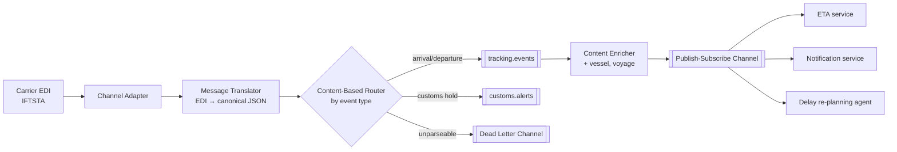

# Enterprise integration patterns

!!! abstract "At a glance"
    **Priority:** P1 · **Complexity:** 3/5 · **Est. time:** 3 h · **Phase:** 3 · **Prereqs:** [Message queues & streaming](../system-design/messaging-streaming.md), [DDD strategic](ddd-strategic.md), [Sagas & outbox](sagas-outbox.md)
    **You're done when:** you can choose an integration style (file, shared DB, RPC, messaging, events, API-led) for a given pair of systems, sketch the message flow using EIP vocabulary (channels, routers, translators, aggregators, process managers), and name the failure handling (DLQ, retries, idempotency) for each hop.

## Why it matters

Enterprises are integration problems wearing a product costume. A shipping company runs carrier systems, terminal operating systems, customs gateways, ERPs, CRMs, EDI partners and now LLM agents — and the business value lives in how they talk. Hohpe & Woolf's *Enterprise Integration Patterns* (2003) is still the shared vocabulary: every modern broker (Kafka, RabbitMQ, Azure Service Bus), iPaaS (MuleSoft, Boomi) and framework (Apache Camel, Spring Integration) implements its 65 patterns.

For AI architects: agent protocols are integration patterns in new clothes. MCP is a request-reply channel adapter; A2A tasks are asynchronous request-reply with correlation ids; an orchestrator agent routing to specialists is a content-based router plus process manager. Knowing EIP lets you reason about agent systems with 20 years of hard-won lessons.

## Core concepts

### The four integration styles (and a fifth)

| Style | How | Coupling | Latency | When it still fits |
|---|---|---|---|---|
| File transfer | Batch files (CSV, EDIFACT, SFTP drops) | Low runtime, high format | Hours | Partners, legacy, bulk (nightly rate sheets, EDI 315/IFTSAI) |
| Shared database | Multiple apps read/write the same schema | Very high | Low | Almost never across teams; ok for reporting replicas |
| Remote procedure invocation | REST/gRPC/SOAP calls | High temporal coupling | Low | Queries, commands needing immediate answers |
| Messaging | Async messages over channels | Low temporal, medium format | ms–s | Commands/events between services, load levelling |
| *Event streaming (modern)* | Durable replayable log (Kafka) | Low | ms–s | Event-driven architecture, CDC, analytics, many consumers |

The architectural question is always about **coupling dimensions**: temporal (must both be up?), format (shared schema?), location (who knows whose address?), and semantic (shared meaning?).

### The EIP vocabulary map



Key families (the ones that come up weekly):

| Family | Patterns | Use |
|---|---|---|
| Channels | Point-to-point, publish-subscribe, datatype channel, dead letter channel, invalid message channel, guaranteed delivery | Where and how messages travel |
| Message construction | Command, document, event message; request-reply; return address; correlation identifier; message expiration | What a message *means* |
| Routing | Content-based router, message filter, recipient list, splitter, aggregator, resequencer, scatter-gather, routing slip, process manager | Where messages go and how they're combined |
| Transformation | Message translator, envelope wrapper, content enricher, content filter, claim check, normalizer, canonical data model | Changing shape |
| Endpoints | Channel adapter, messaging gateway, polling consumer, event-driven consumer, competing consumers, idempotent receiver, transactional client | How apps connect |
| System management | Wire tap, message history, control bus, detour | Observability and control |

### Patterns that deserve depth

**Correlation identifier + return address.** Async request-reply needs both: the reply carries the request's id, and the request says where to reply. Also the basis of distributed tracing (propagate `traceparent` in message headers).

**Competing consumers + idempotent receiver.** Scale out consumers on a queue; because redelivery happens, each consumer must dedupe. With Kafka, parallelism is bounded by partitions; ordering holds per partition key.

**Claim check.** Store large payloads (PDF bills of lading, images, long LLM contexts) in blob storage and pass a reference. Keeps brokers fast and within message-size limits (Kafka default ~1 MB; Azure Service Bus Standard 256 KB).

**Scatter-gather.** Send a request to multiple recipients and aggregate responses (e.g. request spot rates from 5 carriers, take best within 2 s). Needs timeouts and a completeness condition. The LLM analogue: fan out a question to several retrievers/agents and synthesise.

**Aggregator.** Correlate and combine related messages: correlation key, completeness condition (count, timeout, "last" marker), and aggregation strategy. Stateful → needs persistence and expiry.

**Process manager.** Central component maintaining state of a multi-step flow and deciding the next step — the EIP name for saga orchestrator ([sagas & outbox](sagas-outbox.md)).

**Canonical data model.** A common format between many systems reduces N×(N−1) translators to 2N. But see the trap: an *enterprise-wide* canonical model fights bounded contexts. Use canonical models per integration domain (e.g. shipment events) or adopt industry published languages (DCSA, UN/EDIFACT, HL7 FHIR).

**Dead letter channel and invalid message channel.** Distinguish *can't deliver/process after retries* (dead letter) from *malformed* (invalid). Every DLQ needs an owner, alerting, a replay tool and a retention policy — otherwise it's a data graveyard.

### Retries and error handling policy

| Failure type | Example | Handling |
|---|---|---|
| Transient | Timeout, 503, broker leader election | Retry with exponential backoff + jitter; bounded |
| Poison message | Unparseable payload, schema mismatch | No retry → invalid-message channel, alert |
| Business rejection | Booking for a sailed voyage | Not an error of the pipe — emit a rejection event/reply |
| Downstream outage | Customs gateway down for 2 h | Circuit breaker; park messages; delayed retry queue |
| Ordering violation | Update arrives before create | Resequencer, or design consumers to be order-tolerant (versions) |

### Integration architecture options

| Option | Strengths | Weaknesses | Fit |
|---|---|---|---|
| Point-to-point integrations | Fast to start | N² spaghetti | ≤ 3–4 systems |
| ESB (central bus with logic) | Central governance, transformations | Bottleneck team, smart-pipe logic trapped in the bus | Legacy; avoid putting business logic in the bus |
| "Smart endpoints, dumb pipes" (broker + services) | Autonomy, scalable | Duplication of mapping logic, governance needed | Microservices/EDA |
| iPaaS / API-led (system/process/experience APIs) | Speed for SaaS integrations, connectors | Vendor cost/lock-in, can recreate ESB problems | SaaS-heavy enterprises |
| Event streaming platform + CDC | Replay, many consumers, decoupling | Schema governance, ops | Data-rich, event-driven orgs |

### Apache Camel sketch (Java)

```java
from("sftp://partner-edi/inbound?delete=true")              // channel adapter
  .routeId("carrier-status-ingest")
  .unmarshal().edifact()                                    // translator (illustrative)
  .split(body())                                            // splitter
    .choice()                                               // content-based router
      .when(simple("${body.statusCode} == 'CUS'")).to("kafka:customs.alerts")
      .otherwise().to("kafka:tracking.events")
    .end()
  .end()
  .onException(ParseException.class).handled(true).to("kafka:edi.invalid");  // invalid msg channel
```

Python equivalents are usually hand-rolled with a broker client plus Pydantic for translation; the vocabulary still applies.

### AI-era integration patterns

| EIP pattern | Agent-system counterpart |
|---|---|
| Channel adapter | MCP server wrapping a legacy system as tools/resources |
| Content-based router | Router/classifier LLM selecting specialist agent or workflow |
| Scatter-gather | Parallel sub-agents or multi-retriever RAG with synthesis |
| Process manager | Orchestrator agent / durable workflow |
| Message translator | LLM-based extraction from unstructured docs to canonical schema (validate!) |
| Correlation id | A2A task id, trace id across agent hops |
| Dead letter channel | Human review queue for low-confidence LLM outputs |
| Wire tap | Tracing/eval sampling of agent messages |

LLMs are excellent *translators* for messy inputs (emails, PDFs, free-text EDI remarks) but must sit behind validation (schema + business rules) with an invalid-message path to humans.

## Resources

| Resource | Type | Why this one | Level | Cost |
|---|---|---|---|---|
| [Enterprise Integration Patterns site (Hohpe & Woolf)](https://www.enterpriseintegrationpatterns.com/) | docs | Every pattern with diagrams and discussion — free companion to the book | intermediate | free |
| [EIP messaging patterns catalogue](https://www.enterpriseintegrationpatterns.com/patterns/messaging/) | docs | The 65-pattern map; bookmark it | intermediate | free |
| [Gregor's Ramblings](https://www.enterpriseintegrationpatterns.com/ramblings.html) :gem: | article | Two decades of short essays on integration and architecture, incl. Starbucks & 2PC | advanced | free |
| [Apache Camel EIP reference](https://camel.apache.org/components/latest/eips/enterprise-integration-patterns.html) | docs | Executable EIPs; see how each pattern maps to code | intermediate | free |
| [Confluent Event Streaming Patterns](https://developer.confluent.io/patterns/) :gem: | docs | EIP updated for event streaming (Kafka): event envelopes, claim check, dead letter streams | intermediate | free |
| [Enterprise Integration: You Can't Buy Integration (Fowler site)](https://martinfowler.com/articles/cant-buy-integration.html) | article | Why integration is architecture, not a product purchase | advanced | free |
| [Microservice API Patterns](https://www.microservice-api-patterns.org/) :gem: | docs | Zimmermann et al.'s pattern language for API message design | advanced | free |
| [AsyncAPI](https://www.asyncapi.com/) | docs | Contract spec for message-driven APIs — document your channels | intermediate | free |

## Hands-on lab

**Goal:** build a small integration pipeline using EIP vocabulary. 90–120 min.

1. Input: a folder of simulated carrier status files (CSV and a few malformed lines) and a stream of JSON webhook events.
2. Channel adapters: file poller and a FastAPI webhook endpoint → publish raw messages to `raw.events` (Redpanda/Kafka).
3. Translator/normalizer: map both formats to a canonical Pydantic `ShipmentEvent`; malformed → `invalid.events`.
4. Content-based router: route `CUSTOMS_HOLD` to `customs.alerts`, others to `tracking.events`.
5. Enricher: add vessel/voyage from a lookup table; aggregator: build a per-container daily summary (completeness: end-of-day timer).
6. Idempotent receiver: dedupe by `(source, source_event_id)`.
7. Add an LLM translator for free-text "remarks" → structured delay reason, with confidence threshold and human-review channel.
8. Wire tap: sample 5% of messages to a trace log.

**Expected output:** routed topics, a populated invalid channel with reasons, and a daily summary per container.

## Questions

### L1 — Recall

??? question "Q1. Name the four integration styles from EIP and one key downside of each."
    ??? success "Answer"
        File transfer — latency and format coupling (stale data, batch windows). Shared database — tight coupling of schemas across applications; changes ripple; no encapsulation. Remote procedure invocation — temporal coupling (both must be available) and chatty interfaces. Messaging — asynchronous complexity: eventual consistency, ordering, duplicate handling, harder debugging.

??? question "Q2. What is a claim check and why use it?"
    ??? success "Answer"
        Store a large payload in external storage (blob store) and send a message containing only a reference (the claim check) plus essential metadata; the consumer retrieves the payload when needed. It keeps messages within broker size limits, reduces broker load and cost, and allows access control on the payload.

??? question "Q3. Differentiate a dead letter channel from an invalid message channel."
    ??? success "Answer"
        Dead letter channel: messages the messaging system couldn't deliver or that consumers failed to process after retries (e.g. downstream unavailable, TTL expired). Invalid message channel: messages received but malformed/unprocessable by the receiver (schema violation). Different root causes, different owners and remediation (replay after outage vs fix producer).

??? question "Q4. What do an aggregator's three key design decisions consist of?"
    ??? success "Answer"
        Correlation (which messages belong together — correlation key), completeness condition (when to emit: count reached, timeout, explicit end message, first-best), and aggregation algorithm (how to combine: merge, pick best, concatenate). Plus persistence and expiry of incomplete aggregates.

### L2 — Apply

??? question "Q5. You need best-price quotes from 6 carrier APIs within 1.5 s for a customer UI. Design with EIP."
    ??? success "Answer"
        Scatter-gather: a quote service sends requests in parallel (async HTTP or via a recipient list of per-carrier adapters) with a correlation id; an aggregator collects responses with completeness condition "all 6 or 1.2 s timeout", picks the best N; late responses are discarded or cached for next time. Per-carrier circuit breakers skip known-down carriers. Cache recent quotes (content enricher from cache). Return partial results with indication of which carriers didn't respond.

??? question "Q6. A legacy TOS (terminal operating system) only exports a CSV every 15 minutes. Downstream services want real-time events. Design the integration."
    ??? success "Answer"
        Channel adapter polls the file drop; a splitter turns rows into messages; since CSV contains current state (not changes), a *change detector* compares with the last snapshot (stored keyed by container id + hash) and emits only differences as events (`ContainerGateIn`, etc.) — essentially CDC over snapshots. Idempotency via deterministic event ids (container + status + timestamp). Publish on a pub-sub topic. Be explicit about the 15-min latency in the event contract (e.g. `observed_at` vs `occurred_at`). Longer term: push for an API/CDC from the TOS vendor.

??? question "Q7. Order events can arrive out of order across partitions (e.g. `BookingAmended` before `BookingCreated`). How do you handle it?"
    ??? success "Answer"
        Prefer designing it away: key all events for a booking by booking id so they land on one partition (order preserved per key). If multiple sources make that impossible: (a) resequencer buffering by sequence number with timeout; (b) version-aware consumers — store the aggregate version and apply only if newer, park events whose predecessor hasn't arrived (retry later); (c) upsert semantics where the consumer creates a placeholder on amendment and fills it on create. Choose based on latency tolerance.

### L3 — Design & trade-offs

??? question "Q8. Your company wants to replace an ESB with 400 integrations. Kafka + microservices or an iPaaS? Decide and defend."
    ??? success "Answer"
        Probably both, segmented by integration type. Classify the 400: SaaS-to-SaaS and partner integrations with standard connectors (Salesforce, SAP, SFTP partners) → iPaaS gives speed and connectors; internal domain events between owned services, high volume, replay needs → event streaming platform with smart endpoints. Critically, *extract business logic from the ESB* into owning services — otherwise you'll rebuild the ESB in the iPaaS. Migrate with strangler: route one flow at a time, measure. Governance: integration catalogue, schema registry, ownership per flow. Decision criteria: volume, latency, ownership, connector availability, cost per flow, team skills.

??? question "Q9. Should you adopt an enterprise canonical data model for all messages? Discuss."
    ??? success "Answer"
        Benefits: fewer translators (2N vs N²), shared understanding. Costs: committee-owned model grows to cover every context's needs, changes slowly, conflicts with bounded contexts' legitimate semantic differences, and consumers still map to their internal models. Better: canonical models per integration domain owned by the upstream context (published language), industry standards where they exist (DCSA for shipping events), and ACLs at consumer boundaries. Central governance of identifiers and reference data is where a shared model pays off.

??? question "Q10. Using an LLM as a message translator for unstructured carrier emails: design and risks."
    ??? success "Answer"
        Flow: channel adapter (mailbox) → claim check (store email + attachments) → LLM extraction to a strict schema (Pydantic, structured output) → validation (schema + business rules: valid container number checksum, known vessel/voyage, plausible dates) → confidence gating → canonical event or human review channel. Risks: hallucinated values (mitigate with validation and cross-checking against master data), prompt injection in email text (the translator must have no tools/side effects; output only data), cost and latency (batch, small model, cache templates), drift (evals on a labelled sample, monitor rejection rate). Keep the original for audit via the claim check.

### L4 — Staff-level ambiguity

??? question "Q11. Every product team now wants to expose its systems to agents via MCP servers. How do you govern this as an integration architecture?"
    ??? success "Answer"
        Treat MCP servers as channel adapters/APIs with the same governance as other integration endpoints: (1) ownership — each server owned by the system's team; (2) catalogue/registry with descriptions, scopes, data classification; (3) security — OAuth-based auth (MCP spec hardened in 2025–2026), least-privilege tool scopes, no write tools without idempotency and audit, egress controls; (4) contracts — versioning of tool schemas, deprecation policy; (5) gateway for cross-cutting concerns (authn/z, rate limits, logging) rather than every server reinventing them; (6) prefer read-only tools first, write tools behind domain commands with invariants; (7) observability via trace propagation. Avoid wrapping DBs directly (shared-database anti-pattern for agents). See [MCP](../agentic-ai/mcp.md).

??? question "Q12. After an acquisition you must integrate the acquired company's order system within 3 months, long-term plan TBD. Which integration style and why?"
    ??? success "Answer"
        Optimise for reversibility and minimal coupling: event/message-based integration with ACLs on both sides, a small published language for the few flows needed now (orders, customers, status), and possibly file-based bulk sync for reference data. Avoid shared DB or deep RPC coupling that would make either long-term option (consolidate or keep separate) costly. Put translation logic in an integration context owned by a named team. Document assumptions in an ADR with a review date aligned to the long-term decision.

## Real-world use cases

- **Ocean carriers & forwarders**: EDIFACT (IFTSTA, COPARN, BAPLIE) over SFTP/AS2 translated into canonical events; increasingly DCSA-standard APIs.
- **Banking**: SWIFT/ISO 20022 messages via translators, routers and idempotent receivers; DLQs with strict operational ownership.
- **Retail**: order, inventory and pricing events on Kafka; iPaaS for SaaS (ERP, CRM) connectors.
- **Healthcare**: HL7v2/FHIR interface engines implementing EIP patterns.
- **AI document processing**: emails and PDFs → LLM translator → validated canonical messages → human review channel.

## Pitfalls & anti-patterns

- Business logic in the ESB/iPaaS instead of in owning services.
- Shared database as integration.
- DLQs without owners, alerts or replay tooling.
- No correlation ids → impossible end-to-end tracing.
- Assuming ordering or exactly-once across partitions or systems.
- Enterprise-wide canonical model governed by committee.
- LLM translators with tool access or without validation.

## Checklist

- [ ] I can explain the integration styles and 15+ EIP patterns without notes
- [ ] I built a pipeline with adapter, translator, router, enricher, aggregator, DLQ and idempotent receiver
- [ ] I can map agent-system components to EIP patterns
- [ ] I can design error handling per failure type
- [ ] I answered all L3 questions out loud in < 3 min each
