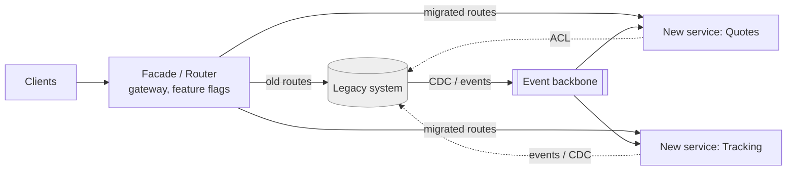

# Legacy modernization & strangler fig

!!! abstract "At a glance"
    **Priority:** P0 · **Complexity:** 3/5 · **Est. time:** 3 h · **Phase:** 4 · **Prereqs:** [Architecture styles](architecture-styles.md), [DDD strategic](ddd-strategic.md), [Sagas & outbox](sagas-outbox.md)
    **You're done when:** you can assess a legacy system (value, risk, coupling), choose a modernization strategy (retain, rehost, replatform, refactor, rebuild, replace, retire), design a strangler-fig migration with seams, ACL and data-migration steps, and write the business case and sequencing for it.

## Why it matters

Most enterprise engineering is modernization, not greenfield: mainframes, 15-year-old Java monoliths, Oracle stored-procedure empires, Delphi thick clients. Staff/Principal architects are hired for this because the failures are expensive: "big-bang rewrites" have a well-documented record of running years over budget and dying before delivering (the second-system effect). The strangler fig — grow the new system around the old, route traffic incrementally, and retire the old piece by piece — is the dominant safe strategy. Fowler's more recent *Patterns of Legacy Displacement* (with Ian Cartwright, Rob Horn and James Lewis) adds a catalogue of concrete techniques.

AI changes the economics: LLMs accelerate code comprehension, documentation recovery, test generation and mechanical translation (COBOL → Java, Struts → Spring) — but they don't remove the need for characterisation tests, seams and incremental cutover. Treat AI as an accelerator of the *analysis and translation* steps, with equivalence verified by tests.

## Core concepts

### Why big-bang rewrites fail

- The old system keeps changing during the rewrite (moving target); the new one must chase it.
- Hidden behaviour: 15 years of edge cases live in the code, not in specs.
- No value until the end; funding and sponsors evaporate first.
- Second-system effect: over-ambitious redesign.
- Cutover risk concentrated in a single date.

### Modernization strategies (the "R's")

| Strategy | What | When | Risk/Effort |
|---|---|---|---|
| **Retain** | Leave as is; wrap or ignore | Stable, low-change, low-risk | Low |
| **Retire** | Turn off | Unused or duplicate functionality (often 10–30% of a portfolio) | Low; value from discovery |
| **Rehost** (lift & shift) | Move to cloud/VMs unchanged | Data centre exit deadline | Low; little benefit beyond infra |
| **Replatform** | Small tweaks (managed DB, containers) | Cheap operational wins | Low–medium |
| **Refactor / re-architect** | Restructure code, decompose | Core system needing change velocity | Medium–high |
| **Rebuild** | Rewrite from requirements | Technology dead-end, small scope, well-understood | High |
| **Replace** | Buy SaaS/COTS | Generic subdomains (HR, finance, CRM) | Medium; integration and data migration |

Decide **per subdomain**, not per system: core subdomains → refactor/rebuild with DDD; supporting → replatform or replace; generic → replace with SaaS; dead → retire ([DDD strategic](ddd-strategic.md)).

### Assessing the legacy system

| Question | How to answer |
|---|---|
| What does it do and for whom? | Capability map; interview users; traffic analysis; find dead features (logs, usage analytics) |
| Where is the change pressure? | git history hotspots; backlog by area; cost of delay |
| How risky is it? | Incident history, bus factor, unsupported tech, security findings |
| How coupled is it? | Dependency analysis, shared DB tables, integration inventory, batch job chains |
| Where are the seams? | Interfaces, message boundaries, UI routes, batch handoffs, DB views |
| What data does it own? | Data model, master vs derived data, quality, retention/regulatory needs |
| What's the business case? | Cost of run + cost of delay + risk vs cost of change |

### Strangler fig pattern

Named by Fowler after the vines that grow around a host tree and eventually replace it. Steps:

1. **Introduce a facade/routing layer** in front of the legacy system (API gateway, reverse proxy, UI shell, message router).
2. **Identify a thin vertical slice** (a capability/route with clear boundaries and value).
3. **Build the new implementation** of the slice; keep the legacy path live.
4. **Route** traffic to the new implementation gradually (by user cohort, tenant, percentage, header, feature flag), compare results (shadowing/parallel run), roll back if needed.
5. **Retire** the legacy code for that slice (delete it!). Repeat.



Seam types where you can intercept:

| Seam | Technique | Example |
|---|---|---|
| HTTP/API | Reverse proxy or gateway routes by path/tenant | `/api/quotes/*` → new service, rest → legacy |
| UI | Micro-frontends, shell app, edge-side includes | New booking page embedded in legacy portal |
| Messaging | Message router/content-based routing; consume legacy events | Legacy publishes to MQ; new service subscribes |
| Database | Views, CDC, "branch by abstraction" at data layer | Debezium streams table changes to new service |
| Batch/file | Replace a batch step with a service; keep file handoffs | New rating engine replaces nightly job, writes same file |
| Code | **Branch by abstraction** (Paul Hammant): introduce an interface in the monolith, implement new and old behind it, switch by flag | Replace pricing module in-process |

### Data migration: the hard part

Strangling code is easy compared with strangling data. Options:

| Approach | Description | Trade-offs |
|---|---|---|
| **Shared DB (temporary)** | New service reads/writes legacy tables | Fast start; couples to legacy schema; forbid long-term (intrusive coupling) |
| **Read-through/ACL** | New service calls legacy API for data it doesn't own yet | Latency, availability dependency; clean model via ACL |
| **CDC replication (legacy → new)** | Debezium streams legacy changes to the new store | Legacy remains source of truth during transition; eventual consistency |
| **Dual write with reconciliation** | Write to both (via outbox) and compare | Complex; requires reconciliation and a clear "source of truth" per phase |
| **Cutover per entity/tenant** | Move ownership per customer segment; migrate history | Clean but needs routing by entity; good for multi-tenant |
| **Event interception + synchronisation** | Capture legacy events/transactions, replay to new | Works with mainframes/MQ |

Patterns from *Patterns of Legacy Displacement*: **Transitional Architecture** (temporary scaffolding you will throw away — budget for it and plan its removal), **Event Interception**, **Legacy Mimic** (new system exposes the legacy's interface to avoid changing consumers), **Divert the Flow**, **Revert to Source**, **Extract Product Feature**, **Critical Aggregator**, **Feature Parity** (avoid recreating everything; resist parity for low-value features).

**Verification**: parallel run/shadow traffic — send production requests to both, compare responses (diff service), fix discrepancies before switching. **Golden master** tests from recorded production data provide equivalence checks.

### Sequencing and business case

Choose slices by **value × feasibility**:

- High business value (change pressure, revenue, pain) and low coupling → first.
- Early slice should be *representative but survivable*: proves the pipeline (routing, deployment, observability, data sync) end to end.
- Avoid starting with the hub (customer master) — start at the edge and work inward, or extract data-owning core last.
- Fund incrementally: each slice must deliver measurable value (cycle time, cost, capability) to survive budget reviews.
- Track the **kill list**: legacy components decommissioned; a modernization without deletions is just addition (and cost).

### Anti-corruption layer in practice

```python
# new-service adapter: translate legacy CUSTOMER_MASTER row (fixed codes) into new domain model
class LegacyCustomerACL:
    def __init__(self, legacy_client): self.legacy = legacy_client
    def get(self, customer_id: str) -> Customer:
        r = self.legacy.fetch_customer(cust_no=customer_id.zfill(10))
        return Customer(
            id=customer_id,
            name=r["CUST_NM"].strip().title(),
            payment_terms=PaymentTerms.from_legacy_code(r["PMT_TRM_CD"]),
            status=CustomerStatus.ACTIVE if r["ACT_FLG"] == "Y" else CustomerStatus.INACTIVE,
        )
```

### AI-assisted modernization

| Task | LLM usefulness | Guardrails |
|---|---|---|
| Code comprehension, summaries, dependency maps | High | Verify against runtime traces/tests |
| Extracting business rules from COBOL/PL-SQL | Medium–high | Domain expert review; rules as executable tests |
| Generating characterisation tests | High | Run against the legacy to confirm expected outputs |
| Mechanical translation (language/framework) | Medium–high with tests | Equivalence via golden master/parallel runs |
| Designing target architecture | Low–medium (context is human) | Use as brainstorming partner; you decide |
| Data mapping proposals | Medium | Validate with samples and reconciliation reports |

Agents work best on well-bounded slices with strong tests: *slice by seam, generate tests from legacy behaviour, generate the new implementation, verify equivalence*. Track "AI-translated LOC verified by tests" not raw LOC.

### Senior-level nuance

- **Organisation matters more than code**: align the new-slice team to the target bounded context (Inverse Conway) and give them ownership of both the new service and the legacy slice being retired.
- **Prevent the legacy from growing**: freeze new features in the legacy area, or new features go into the new system only ("stop digging").
- **Transitional architecture is a cost you must plan to delete** — track it explicitly.
- **Don't over-modernize**: retaining a stable, low-change component is a valid decision; "modern" isn't a business goal.
- **Compliance & audit** may require data lineage and reconciliation reports at each cutover.
- **Measure**: % traffic on new paths, lead time for changes in migrated areas, incident rate, run cost, legacy LOC/modules deleted.

## Resources

| Resource | Type | Why this one | Level | Cost |
|---|---|---|---|---|
| [StranglerFigApplication (Fowler)](https://martinfowler.com/bliki/StranglerFigApplication.html) | article | Origin of the metaphor; short and clear | intermediate | free |
| [Patterns of Legacy Displacement (Fowler et al.)](https://martinfowler.com/articles/patterns-legacy-displacement/) :gem: | article | Catalogue of practical patterns (Transitional Architecture, Event Interception, Legacy Mimic...) | advanced | free |
| [Architecture Modernization (Nick Tune & Jean-Georges Perrin)](https://www.manning.com/books/architecture-modernization) :gem: | book | DDD + sociotechnical view of modernization; how to choose targets and design teams | advanced | paid |
| [How to break a Monolith into Microservices (Fowler/Newman)](https://martinfowler.com/articles/break-monolith-into-microservices.html) | article | Sequencing and slicing guidance from Sam Newman | intermediate | free |
| [Monolith to Microservices (Sam Newman)](https://samnewman.io/books/monolith-to-microservices/) | book | Patterns: strangler, branch by abstraction, parallel run, data decomposition | intermediate | paid |
| [Azure Architecture Center — Strangler Fig](https://learn.microsoft.com/en-us/azure/architecture/patterns/strangler-fig) | docs | Concise issues/considerations, when not to use | intermediate | free |
| [AWS Prescriptive Guidance — Strangler fig](https://docs.aws.amazon.com/prescriptive-guidance/latest/cloud-design-patterns/strangler-fig.html) | docs | Cloud implementation guidance with sequence diagrams | intermediate | free |
| [microservices.io — Strangler application](https://microservices.io/patterns/refactoring/strangler-application.html) | docs | Forces and refactoring pattern context | intermediate | free |
| [Debezium docs](https://debezium.io/) | docs | CDC toolkit for streaming legacy DB changes to new systems | advanced | free |
| [Understand Legacy Code](https://understandlegacycode.com/) :gem: | article | Practical techniques to gain safe footing in legacy code | intermediate | free |

## Hands-on lab

**Goal:** perform a mini strangler migration. 2 h.

1. Take (or create) a small legacy app: Flask/Spring monolith with `/quotes`, `/bookings`, `/customers` endpoints and one SQLite/Postgres DB.
2. Put nginx/Traefik or a FastAPI gateway in front; route everything to legacy (baseline).
3. Record 500 real-ish requests/responses (golden master) for `/quotes`.
4. Build a new `quotes` service (clean domain, hexagonal), initially calling legacy pricing via an ACL.
5. Shadow traffic: gateway sends copies to the new service; a diff script reports mismatches; fix until < 0.5% diff (document legitimate differences).
6. Canary: route 5% → 25% → 100% by header/cookie; add a rollback flag.
7. Data: stream legacy quote-rule tables to the new service via CDC (Debezium) or a polling sync; verify with reconciliation report.
8. Delete the legacy `/quotes` code; record the deletion in a "kill list".
9. AI extension: use an LLM to summarise the legacy pricing code into candidate business rules; convert three rules into failing tests and verify against legacy behaviour.

**Expected output:** gateway config, diff report, canary rollout log, reconciliation report, and the deleted legacy code commit.

## Questions

### L1 — Recall

??? question "Q1. Describe the strangler fig pattern in five steps."
    ??? success "Answer"
        1. Put a facade/router in front of the legacy system. 2. Pick a thin vertical slice. 3. Build the new implementation while legacy still serves. 4. Gradually route traffic to the new slice with the ability to roll back (canary, flags). 5. Decommission the legacy slice; repeat until the legacy can be turned off.

??? question "Q2. What is branch by abstraction?"
    ??? success "Answer"
        A technique for replacing a component inside a codebase without long-lived branches: introduce an abstraction (interface) over the existing implementation, route callers through it, build the new implementation behind the same abstraction, switch via configuration/flag, then remove the old implementation and possibly the abstraction. Enables continuous integration during large changes.

??? question "Q3. Name the 'R' strategies for application portfolio modernization."
    ??? success "Answer"
        Retain, retire, rehost (lift and shift), replatform, refactor/re-architect, rebuild, replace (repurchase). Decide per subdomain/application considering business value, technical health and cost.

??? question "Q4. What is a transitional architecture and why must you plan to remove it?"
    ??? success "Answer"
        Temporary components built to bridge old and new systems during migration (sync jobs, adapters, facades, dual writes). They have real cost, add failure modes and become permanent if not tracked; hence budget for them, define exit criteria and treat their removal as part of the migration plan.

### L2 — Apply

??? question "Q5. Plan the migration of a monolith's `Quoting` capability to a new service. What's the sequence?"
    ??? success "Answer"
        (1) Characterise: record production request/response pairs; identify data used (rate tables, customer contracts) and callers. (2) Establish routing: gateway/facade. (3) Create seams: within the monolith, introduce a `QuoteService` interface (branch by abstraction) if callers use in-process calls. (4) Build the new service with its own domain model, ACL to legacy for data not yet migrated. (5) Sync reference data via CDC/events. (6) Shadow and diff results; fix discrepancies. (7) Canary by customer segment; monitor business metrics (conversion, quote latency). (8) Migrate write ownership of rate tables; remove legacy code and dead tables. Track and delete transitional pieces.

??? question "Q6. Two systems (legacy and new) need the same customer data during a 12-month transition. Choose a data strategy."
    ??? success "Answer"
        Keep legacy as source of truth initially; stream changes via CDC to the new service's store (read model); the new service uses its local copy for reads and sends writes to legacy through an API/ACL until ownership flips for the customer domain. At flip: freeze writes briefly (or use cutover per tenant), do a final sync and reconciliation, make the new service the source of truth, and reverse the sync direction (new → legacy) for consumers still on legacy until they migrate. Avoid dual writes without clear ownership; add reconciliation reports at each phase.

??? question "Q7. How do you verify functional equivalence for a rewritten pricing engine?"
    ??? success "Answer"
        Golden master from recorded production inputs (with privacy scrubbing) run through both; property-based tests on invariants; shadow production traffic with a diff service classifying differences (bug, legitimate change, tolerance e.g. rounding); domain-expert review of samples in discrepancy classes; gradual rollout with business KPI monitors. For high-risk domains, parallel-run through a full billing cycle.

### L3 — Design & trade-offs

??? question "Q8. Rebuild vs refactor for a 20-year-old core booking system with 60% of features rarely used. Decide."
    ??? success "Answer"
        Neither wholesale. First retire: analyse usage to find the dead 30–60% (biggest ROI). For the live core, refactor/strangle by subdomain: extract the volatile, high-value capabilities (pricing, tracking) with DDD boundaries; leave stable low-change parts (Retain) behind an ACL. Rebuild only small, well-understood, high-pain modules or where tech is a dead end (unsupported runtime). Justification: rewrite risk, moving target, hidden rules. Plan an explicit feature parity policy — don't replicate low-value behaviour — and get business agreement to drop features.

??? question "Q9. Mainframe COBOL system processes nightly batches and has no APIs. Modernization options?"
    ??? success "Answer"
        Options: (1) Wrap: expose CICS/transaction or MQ interfaces via an integration layer/API gateway (Legacy Mimic) to allow new consumers; (2) Event interception: capture the mainframe's outputs/DB2 changes (CDC) to feed new services; (3) Replace batch steps incrementally with services writing the same output files; (4) Automated code translation (COBOL→Java) as a rehost-like step to escape licences — high risk of "COBOL in Java"; (5) Rebuild by domain with strangler. Recommended combination: wrap + CDC to enable new capabilities immediately, then displace high-change batch steps first, leaving stable ledger-like batches last. Use LLMs to extract rules and generate tests, verified against production outputs.

??? question "Q10. Shared-database shortcut: the new service will read/write the legacy tables directly 'for now'. Accept?"
    ??? success "Answer"
        Only as a time-boxed transitional step with explicit exit criteria: it creates intrusive coupling and locks the legacy schema; the new service inherits legacy constraints and any schema change breaks both. If accepted: read-only access via database views (a defined interface), no writes, a date and owner for removal, tests that detect drift, and a plan to move data ownership (CDC/ACL). Prefer an ACL/API or CDC-based read model if feasible — the "temporary" shared DB tends to be permanent. Record as an ADR with review trigger.

### L4 — Staff-level ambiguity

??? question "Q11. The CEO has approved a 'two-year platform rewrite' with a big-bang cutover. You believe it will fail. How do you respond?"
    ??? success "Answer"
        Engage constructively: identify what the CEO wants (speed, cost, capability) and show how an incremental approach achieves it sooner with less risk. Bring evidence: industry failure rates of big-bang rewrites, your own system's hidden-behaviour complexity (present an inventory of undocumented rules discovered through a 2-week analysis spike), and a concrete alternative: strangler roadmap with the first slice delivering value in 3 months, funding tied to milestones and a kill list. Offer risk-based governance: quarterly go/no-go gates, measurable outcomes (traffic migrated, legacy deleted, lead time improved). Propose a compromise if needed: rebuild only bounded, well-understood modules; keep a facade so incremental cutover remains possible. Escalate risks in writing (ADR) and secure sponsorship from delivery leadership.

??? question "Q12. After 18 months of strangling, 40% of traffic is on new services, but the legacy still needs a full team and costs are up. How do you get back on track?"
    ??? success "Answer"
        Diagnose why deletions lag: migrated slices leave legacy code and data behind (no decommission discipline), transitional architecture accumulates, features keep being added to legacy, the data-owning core is untouched. Actions: introduce a kill list with owners and dates (each migration story includes deletion and infra shutdown), freeze feature work in legacy (new features only in new system), prioritise slices that unlock decommissioning of expensive components (licences, mainframe MIPS) rather than only user-visible ones, reassess sequencing towards the hub data domain, and report cost metrics (run cost and legacy team size) alongside traffic percentages. Reset expectations with leadership using a transparent burn-down of legacy capabilities.

## Real-world use cases

- **Banks** displacing mainframe cores with CDC/event interception and per-product cutover.
- **Retailers** strangling monolithic e-commerce platforms by routing checkout, search and catalogue to new services.
- **Logistics** replacing nightly batch rating engines and EDI gateways with event-driven services while keeping partner interfaces (Legacy Mimic).
- **Government** modernising benefits systems slice by slice with parallel runs for compliance.
- **AI-assisted rewrites** of framework upgrades (e.g. Struts/JSF → Spring/React) with characterisation tests and agent-driven mechanical translation.

## Pitfalls & anti-patterns

- Big-bang rewrite with a single cutover date.
- Replicating every legacy feature (feature-parity trap).
- Building the new system on the legacy database schema forever.
- No routing facade, so no way to roll back.
- Never deleting legacy code; transitional architecture becoming permanent.
- Starting with the hardest hub domain (customer master) or the most trivial one (proves nothing).
- Treating modernization as a technology project instead of an organisational one (teams, ownership, incentives).

## Checklist

- [ ] I can explain strangler fig, branch by abstraction and the R strategies without notes
- [ ] I ran a shadow/canary migration of one slice with a diff report
- [ ] I can design data migration options (CDC, ACL, per-tenant cutover) and their trade-offs
- [ ] I can build a business case and sequencing for a modernization
- [ ] I answered all L3 questions out loud in < 3 min each
