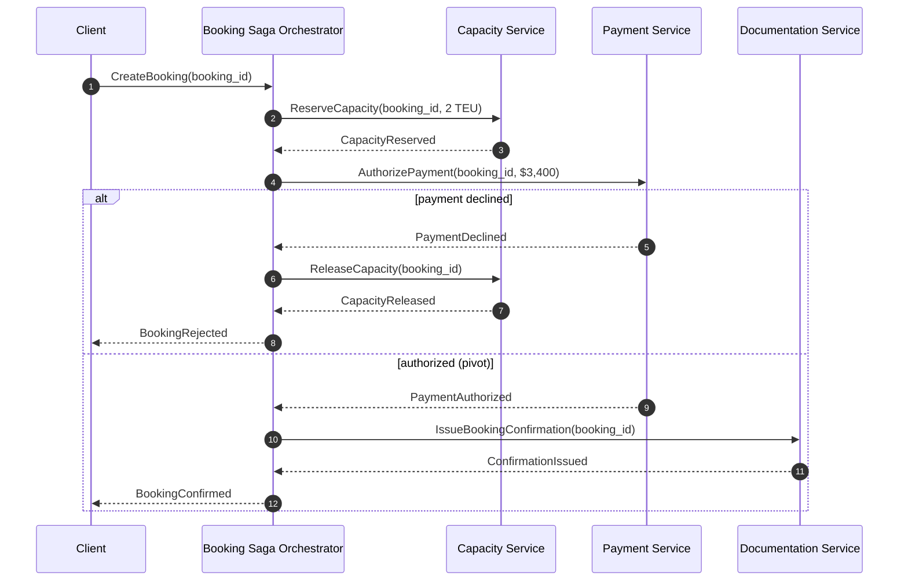

# Sagas, outbox & distributed transactions

!!! abstract "At a glance"
    **Priority:** P0 · **Complexity:** 4/5 · **Est. time:** 3 h · **Phase:** 3 · **Prereqs:** [DDD tactical](ddd-tactical.md), [Message queues & streaming](../system-design/messaging-streaming.md), [Consistency models](../system-design/consistency-models.md)
    **You're done when:** you can implement a transactional outbox and an orchestrated saga with compensations and idempotent consumers, choose between choreography, orchestration and a workflow engine for a given process, and explain why 2PC is usually the wrong answer across services.

## Why it matters

The moment you split data across services, you lose ACID transactions across them. Every microservices or event-driven system eventually faces: "the order was saved but the event was never published", "payment captured but inventory never reserved", "the message was processed twice". Sagas, the outbox pattern and idempotent consumers are the standard answers, and they are among the most commonly probed topics in senior/Staff system design interviews (payments, bookings, order fulfilment).

AI relevance: multi-step agent workflows that touch real systems (book → pay → notify) are sagas. An agent that fails halfway through must compensate, and its tool calls must be idempotent because LLM frameworks *will* retry. Durable-execution engines (Temporal, LangGraph with checkpointers) are saga orchestrators with better ergonomics.

## Core concepts

### The dual-write problem

```python
# BROKEN: two systems, no atomicity
with db.transaction():
    db.insert(order)
kafka.send("orders", OrderPlaced(order.id))   # crash here → event lost
                                              # or: send ok, commit fails → phantom event
```

Any code that writes to a database and a broker (or two databases, or DB + external API) without coordination will eventually be inconsistent. At scale "eventually" means "this week".

### Transactional outbox

Write the event into an `outbox` table **in the same local transaction** as the state change; a separate relay publishes it to the broker.

```sql
CREATE TABLE outbox (
  id            UUID PRIMARY KEY,
  aggregate_type TEXT NOT NULL,
  aggregate_id  TEXT NOT NULL,
  event_type    TEXT NOT NULL,
  payload       JSONB NOT NULL,
  headers       JSONB NOT NULL,          -- trace/correlation ids, schema version
  created_at    TIMESTAMPTZ NOT NULL DEFAULT now(),
  published_at  TIMESTAMPTZ
);
CREATE INDEX outbox_unpublished ON outbox (created_at) WHERE published_at IS NULL;
```

```python
# write side (inside the Unit of Work)
def place_order(uow, cmd):
    with uow:
        order = Order.place(cmd)
        uow.orders.add(order)
        for e in order.events:
            uow.outbox.add(OutboxMessage.from_event(e, aggregate_id=order.id))
        uow.commit()                 # state + events atomically

# relay (polling publisher) -- run as a separate worker
def relay_once(conn, producer, batch=500):
    rows = conn.execute("""
        SELECT id, aggregate_id, event_type, payload, headers FROM outbox
        WHERE published_at IS NULL ORDER BY created_at
        LIMIT %s FOR UPDATE SKIP LOCKED""", (batch,)).fetchall()
    for r in rows:
        producer.send("orders", key=r.aggregate_id, value=r.payload,
                      headers={**r.headers, "message_id": str(r.id)})
    producer.flush()                  # wait for broker acks before marking
    conn.execute("UPDATE outbox SET published_at = now() WHERE id = ANY(%s)",
                 ([r.id for r in rows],))
    conn.commit()
```

Relay options:

| Relay | How | Pros | Cons |
|---|---|---|---|
| Polling publisher | Query unpublished rows periodically | Simple, any DB | Latency = poll interval; DB load; ordering care with multiple relays |
| Log-tailing / CDC | Debezium reads WAL/binlog; Outbox Event Router SMT routes to topics | Low latency, no polling load, ordering from log | Operate Kafka Connect/Debezium; infra complexity |
| Framework-managed | Spring Modulith event publication registry, NServiceBus/MassTransit outbox | Little code | Framework coupling |

Guarantee: **at-least-once** publication. Duplicates happen (crash after send, before marking). Hence:

### Idempotent consumer (the inbox)

```python
def handle(conn, msg):
    with conn.transaction():
        inserted = conn.execute(
            "INSERT INTO inbox (message_id, handler) VALUES (%s, %s) ON CONFLICT DO NOTHING",
            (msg.headers["message_id"], "reserve_inventory")).rowcount
        if inserted == 0:
            return                        # duplicate: already processed
        reserve_inventory(conn, msg.payload)   # same local transaction
```

Alternatives: naturally idempotent operations (`SET status='CONFIRMED' WHERE status='PENDING'`), idempotency keys on external APIs (Stripe-style `Idempotency-Key`), version checks. "Exactly-once" end-to-end = at-least-once delivery + idempotent processing.

### Why not 2PC / XA?

Two-phase commit gives atomicity across resources but: the coordinator is a blocking single point of failure (participants hold locks while in doubt), it reduces availability to the product of participants', most brokers and cloud services don't support XA, and it couples services at runtime. Use it inside a single database cluster (Spanner, CockroachDB do internal 2PC with consensus) — not across service boundaries. Gregor Hohpe's "Starbucks Does Not Use Two-Phase Commit" is the classic intuition.

### Sagas

A saga is a sequence of local transactions; each publishes an event/triggers the next step; on failure, **compensating transactions** semantically undo completed steps. (Garcia-Molina & Salem, 1987; popularised for microservices by Chris Richardson.)

Step types (Richardson):

- **Compensatable** steps: can be undone (reserve inventory → release).
- **Pivot** step: the go/no-go point; after it, the saga must complete (e.g. payment capture).
- **Retriable** steps: after the pivot, guaranteed to succeed eventually (retry until done — send confirmation, update read model).

Order steps so risky/likely-to-fail steps come before the pivot, and non-compensatable ones after it.

### Choreography vs orchestration

| | Choreography | Orchestration |
|---|---|---|
| Control | Each service reacts to events | Orchestrator sends commands, tracks state |
| Coupling | Services know events, not each other | Orchestrator knows all participants |
| Visibility | Flow is implicit; need tracing to see it | Explicit state machine; easy to query "where is order 123?" |
| Failure handling | Distributed; compensations triggered by failure events | Centralised; timeouts, retries, compensations in one place |
| Cyclic dependency risk | High as flows grow | Low |
| Good for | 2–4 steps, simple, stable flows; fan-out | 4+ steps, branching, timeouts, human steps, frequent change |

### An orchestrated booking saga



A minimal orchestrator as a persisted state machine (Python):

```python
from enum import Enum

class S(str, Enum):
    STARTED = "STARTED"; CAPACITY_RESERVED = "CAPACITY_RESERVED"
    CONFIRMED = "CONFIRMED"; COMPENSATING = "COMPENSATING"; REJECTED = "REJECTED"

class BookingSaga:
    def __init__(self, saga_id, booking_id, state=S.STARTED):
        self.id, self.booking_id, self.state = saga_id, booking_id, state
        self.commands = []       # to be written to outbox with the saga state

    def start(self):
        self.commands.append(("capacity", "ReserveCapacity", {"booking_id": self.booking_id}))

    def on(self, event_type: str, data: dict):
        match (self.state, event_type):
            case (S.STARTED, "CapacityReserved"):
                self.state = S.CAPACITY_RESERVED
                self.commands.append(("payment", "AuthorizePayment", {"booking_id": self.booking_id}))
            case (S.STARTED, "CapacityUnavailable"):
                self.state = S.REJECTED
            case (S.CAPACITY_RESERVED, "PaymentAuthorized"):      # pivot passed
                self.state = S.CONFIRMED
                self.commands.append(("docs", "IssueConfirmation", {"booking_id": self.booking_id}))
            case (S.CAPACITY_RESERVED, "PaymentDeclined" | "PaymentTimedOut"):
                self.state = S.COMPENSATING
                self.commands.append(("capacity", "ReleaseCapacity", {"booking_id": self.booking_id}))
            case (S.COMPENSATING, "CapacityReleased"):
                self.state = S.REJECTED
            case _:
                pass    # duplicate or out-of-order event: ignore idempotently
```

The saga state and its outgoing commands are saved in the same transaction (outbox again). Timeouts are scheduled messages (`PaymentTimedOut`). In practice, consider a **workflow engine** instead of hand-rolling:

```python
# Temporal (Python SDK) — the same saga as durable code
from datetime import timedelta
from temporalio import workflow

@workflow.defn
class BookingWorkflow:
    @workflow.run
    async def run(self, booking_id: str) -> str:
        opts = dict(start_to_close_timeout=timedelta(seconds=30))
        await workflow.execute_activity("reserve_capacity", booking_id, **opts)
        try:
            await workflow.execute_activity("authorize_payment", booking_id, **opts)
        except Exception:
            await workflow.execute_activity("release_capacity", booking_id, **opts)
            return "REJECTED"
        await workflow.execute_activity("issue_confirmation", booking_id, **opts)  # retried until success
        return "CONFIRMED"
```

### Choosing an implementation

| Option | Use when | Watch out for |
|---|---|---|
| Choreography via events | ≤ 3–4 steps, stable, many independent reactions | Invisible flows; add correlation ids and process monitoring |
| Hand-rolled orchestrator (state machine + outbox) | Few sagas, no appetite for new infra | You're building a workflow engine slowly |
| Workflow engine (Temporal, Camunda, AWS Step Functions, Azure Durable Functions) | Many long-running processes, timers, human steps | New platform to operate/learn; determinism constraints in workflow code |
| Agent frameworks with durable state (LangGraph checkpointers) | LLM-driven steps with HITL | Not a replacement for business-critical saga guarantees unless persisted and idempotent |

### Saga anomalies and countermeasures

Sagas lack isolation (the "I" in ACID): other transactions see intermediate states. Countermeasures (Richardson): **semantic locks** (status `PENDING` flags that others respect), **commutative updates**, **pessimistic view** (reorder steps to reduce risk), **reread value** before overwriting, **version file**, **by value** (choose mechanism per request risk).

### AI-era: agent actions as saga steps

- Every tool with side effects must be idempotent (pass a deterministic idempotency key derived from run id + step).
- Define compensations explicitly as tools (`cancel_booking`) and let the orchestrator — not the LLM — decide when to call them on failure.
- Put human approval as a saga step with a timeout (e.g. approvals expire after 4 h → compensate).
- Keep LLM reasoning *outside* the transactional core: the LLM proposes; the saga executes.

## Resources

| Resource | Type | Why this one | Level | Cost |
|---|---|---|---|---|
| [microservices.io — Saga](https://microservices.io/patterns/data/saga.html) :gem: | docs | Richardson's definitive pattern page with choreography/orchestration examples | intermediate | free |
| [microservices.io — Transactional outbox](https://microservices.io/patterns/data/transactional-outbox.html) | docs | Forces, relay options and consequences | intermediate | free |
| [Outbox, inbox patterns and delivery guarantees (Dudycz)](https://event-driven.io/en/outbox_inbox_patterns_and_delivery_guarantees_explained/) :gem: | article | Best explanation of at-least-once + idempotency = effectively once | advanced | free |
| [Reliable microservices data exchange with the outbox pattern (Debezium)](https://debezium.io/blog/2019/02/19/reliable-microservices-data-exchange-with-the-outbox-pattern/) | article | CDC-based outbox with a runnable example | advanced | free |
| [Debezium Outbox Event Router](https://debezium.io/documentation/reference/stable/transformations/outbox-event-router.html) | docs | Reference for routing outbox rows to topics | advanced | free |
| [Starbucks Does Not Use Two-Phase Commit (Hohpe)](https://www.enterpriseintegrationpatterns.com/ramblings/18_starbucks.html) :gem: | article | The best intuition for why async + compensation beats 2PC | intermediate | free |
| [Saga pattern made easy (Temporal)](https://temporal.io/blog/saga-pattern-made-easy) | article | Sagas as durable code with compensation | intermediate | free |
| [Azure Architecture Center — Saga](https://learn.microsoft.com/en-us/azure/architecture/patterns/saga) | docs | Clear comparison, issues and considerations | intermediate | free |
| [Microservices Patterns, 2nd ed. (Richardson)](https://www.manning.com/books/microservices-patterns-second-edition) | book | Deepest treatment: step types, anomalies, countermeasures | advanced | paid |

## Hands-on lab

**Goal:** implement outbox + idempotent consumer + orchestrated saga, then break it. 2 h.

1. Docker Compose: Postgres + Redpanda (or Kafka).
2. Booking service: `place_booking` writes booking + outbox rows in one transaction; a relay publishes with `FOR UPDATE SKIP LOCKED`.
3. Capacity and Payment services consume commands with an `inbox` table; Payment randomly declines 20% and randomly delays 10% beyond timeout.
4. Implement the `BookingSaga` state machine persisted in Postgres, with a timeout scheduler.
5. Chaos: kill the relay mid-batch; kill consumers before commit; replay the topic from the beginning.
6. Verify invariants with a checker script: no capacity reserved for rejected bookings after quiescence; no duplicate payments; every booking in a terminal state.
7. Rewrite the same flow in Temporal and compare lines of code and observability.

**Expected output:** checker passes after chaos; a short comparison of hand-rolled vs Temporal.

## Questions

### L1 — Recall

??? question "Q1. What is the dual-write problem?"
    ??? success "Answer"
        Writing to two systems (e.g. DB and message broker) as part of one logical operation without a shared transaction. Crashes or failures between the writes leave them inconsistent: state saved but event not published, or event published for a change that rolled back. Solutions: transactional outbox (with relay), CDC, or making one system the source of truth (event sourcing, where the event store is the only write).

??? question "Q2. Define compensatable, pivot and retriable saga steps."
    ??? success "Answer"
        Compensatable: steps before the pivot that can be semantically undone by a compensating transaction. Pivot: the go/no-go step — if it succeeds, the saga will run to completion; if it fails, compensate prior steps. Retriable: steps after the pivot that are guaranteed to eventually succeed with retries (no compensation needed).

??? question "Q3. What delivery guarantee does the outbox pattern provide, and what must consumers do?"
    ??? success "Answer"
        At-least-once: every committed event will be published, but possibly more than once (e.g. relay crashes after publishing but before marking rows). Consumers must be idempotent — dedupe by message id (inbox table in the same transaction as the side effect), natural idempotency, or version checks.

??? question "Q4. Why is 2PC generally avoided across microservices?"
    ??? success "Answer"
        It's blocking (participants hold locks while waiting for the coordinator; coordinator failure leaves them in doubt), reduces availability (all participants must be up), increases latency, couples services at runtime, and is unsupported by most brokers/NoSQL/SaaS APIs. It also violates service autonomy over their own data.

### L2 — Apply

??? question "Q5. Your relay runs as 3 replicas for availability. How do you avoid duplicate publishing and ordering problems?"
    ??? success "Answer"
        Use `SELECT ... FOR UPDATE SKIP LOCKED` so replicas grab disjoint batches (duplicates still possible on crash — consumers are idempotent anyway). Ordering: per-aggregate ordering matters, not global. Either partition work by aggregate id (each replica handles a hash range, or use advisory locks per aggregate) or run leader-elected single active relay with standby. Publish with the aggregate id as the partition key so the broker preserves per-key order. Alternatively use CDC (Debezium), which reads the WAL in commit order.

??? question "Q6. An LLM agent calls a `create_shipment` tool; the framework retried after a timeout and two shipments were created. Fix it."
    ??? success "Answer"
        Make the tool idempotent: the orchestrator generates a deterministic idempotency key (e.g. hash of run_id + step_id) and passes it to the tool; the shipment API stores the key with a unique constraint and returns the existing result on repeat. Don't let the LLM generate the key (it may vary). Also set tool timeouts longer than the API's p99, and make retries explicit in the orchestrator rather than implicit in the framework. Add a reconciliation check for duplicates.

??? question "Q7. Sequence the steps of an e-commerce checkout saga: reserve inventory, charge card, create shipment label, send email, apply loyalty points. Identify the pivot."
    ??? success "Answer"
        1. Reserve inventory (compensatable: release). 2. Apply loyalty points reservation (compensatable: restore). 3. Charge card — **pivot** (after this, we complete). 4. Create shipment label (retriable). 5. Send email (retriable). Rationale: failure-prone and reversible steps first; irreversible customer-facing effects after the pivot. If card capture can fail after authorisation, split into authorize (compensatable: void) before, capture as pivot.

### L3 — Design & trade-offs

??? question "Q8. Choreography or orchestration for a 7-step import customs clearance process with document checks, duties payment, inspections (can take days) and human approvals?"
    ??? success "Answer"
        Orchestration, ideally with a workflow engine. Reasons: many steps with branching (inspection needed or not), long-running timers (days), human tasks, need for status visibility ("where is my container?") and centralised compensation (refund duties if clearance rejected). Choreography would scatter the process across services with hidden coupling via events and make timeouts/status queries hard. Use events for notifications *out* of the process (fan-out to tracking, customer comms). Engine choice: Temporal/Camunda or cloud-native (Step Functions/Durable Functions) based on team skills and portability needs.

??? question "Q9. Outbox via polling vs CDC (Debezium): decide for a team of 6 with Postgres and managed Kafka."
    ??? success "Answer"
        Polling if: moderate throughput (< a few thousand events/s), latency tolerance of 100 ms–1 s, no existing Kafka Connect expertise — simplest, no extra infra; tune batch size and index. CDC if: high throughput, low latency needed, multiple services need outbox relays (one Connect cluster serves all), or strict commit-order publication. For a 6-person team, start with polling behind an interface; move to CDC when a platform team can own Connect. Either way consumers stay idempotent.

??? question "Q10. How do sagas handle isolation anomalies? Give a concrete example and countermeasure."
    ??? success "Answer"
        Example: a booking saga reserves capacity; before payment completes, a capacity report counts it as sold and a sales agent tells another customer the vessel is full; then payment fails and capacity is released (dirty read). Or two sagas both read available credit and both proceed (lost update). Countermeasures: semantic lock — mark reservations `PENDING` and have queries/other sagas treat pending appropriately; commutative updates (increment/decrement rather than set); reread value before final step; reorder steps (pessimistic view) so risky checks happen before visible changes.

### L4 — Staff-level ambiguity

??? question "Q11. You discover 14 services each implemented their own outbox and retry logic differently; incidents of lost and duplicated events are frequent. What's your plan?"
    ??? success "Answer"
        1. Quantify: incidents, reconciliation effort, which services lose/duplicate. 2. Define a standard: event envelope (id, type, schema version, correlation/causation, occurred_at), outbox schema, at-least-once + inbox dedupe contract, DLQ/poison-message policy. 3. Provide paved road: a shared library per language (Python/Java) or a platform CDC outbox (Debezium managed by platform team), plus consumer idempotency helpers and test kits (chaos tests). 4. Migrate highest-incident services first; add fitness functions (no direct producer calls in request paths; outbox table present; inbox table for consumers). 5. Observability: end-to-end event lag and loss detection via reconciliation jobs. 6. ADR and a guild to own evolution. Avoid mandating a big-bang rewrite.

??? question "Q12. Product wants an 'autonomous booking agent' that can quote, book, pay and arrange trucking in one conversation. Architect the transactional side."
    ??? success "Answer"
        Separate reasoning from execution. The agent (LLM) gathers intent and produces a structured `BookingPlan`. Execution is a durable saga (Temporal or equivalent) started with that plan: reserve capacity → hold trucking slot → human/customer confirmation step (explicit consent with expiry) → payment (pivot) → confirm trucking and issue documents (retriable). Each step calls domain APIs with idempotency keys derived from saga id + step. Compensations are defined in the workflow, not chosen by the LLM. The agent can query saga status and explain it. Guardrails: spending limits, policy checks before pivot, audit events for every step, kill switch. This gives autonomy in conversation and determinism in money movement.

## Real-world use cases

- **Order fulfilment** (e-commerce): inventory → payment → shipping saga with compensations; outbox publishing order events.
- **Travel/shipping bookings**: reserve vessel space, trucking and rail legs; release on payment failure.
- **Payments** (Stripe-like): idempotency keys on every mutating API to make client retries safe.
- **Banking transfers across ledgers**: debit-credit sagas with reconciliation; no cross-bank 2PC.
- **Agentic back-office automation**: durable workflows orchestrating LLM steps and system actions with human approval gates.

## Pitfalls & anti-patterns

- Publishing events inside the DB transaction or after commit without an outbox.
- Assuming "exactly-once" from the broker means end-to-end exactly-once.
- Compensations that aren't idempotent or can fail silently.
- Choreographed sagas grown to 8+ steps with nobody owning the flow.
- No timeouts — sagas stuck in intermediate states forever.
- LLMs deciding compensations or generating idempotency keys.
- Missing reconciliation jobs as a safety net.

## Checklist

- [ ] I can explain dual writes, outbox, inbox and why not 2PC without notes
- [ ] I implemented an outbox relay, idempotent consumer and orchestrated saga, and survived chaos tests
- [ ] I can choose choreography vs orchestration vs workflow engine with criteria
- [ ] I can design agent tool calls as idempotent saga steps
- [ ] I answered all L3 questions out loud in < 3 min each
